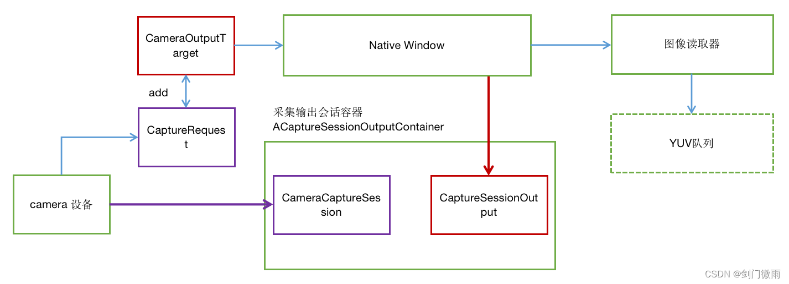
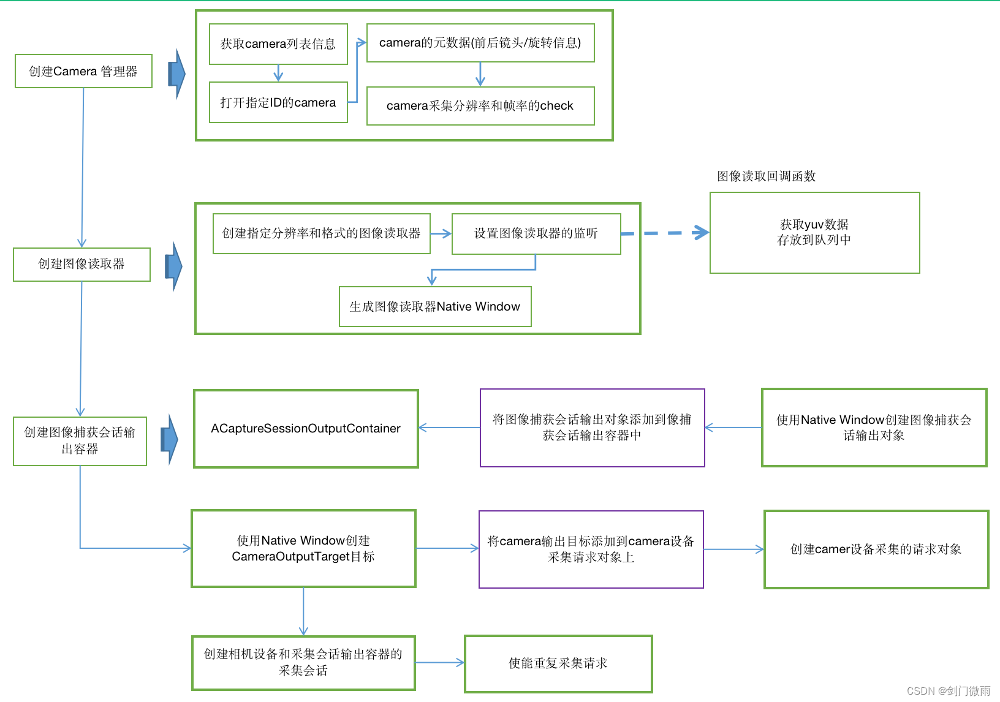

# NDK Android平台camera2采集视频

原文链接：https://blog.csdn.net/u010140427/article/details/128574133


文章详细介绍了Android平台使用camera2接口进行视频采集的代码实现过程，包括Camera2的硬件级别、主要API的使用，以及创建图像读取器和采集会话的步骤。此外，还提供了camera2采集视频的框架流程图，帮助开发者理解camera2在软件采集中的工作原理。


## 一、前言

在Android平台开发实时音视频项目，摄像头的采集是一个必不可少的流程；通常在Android平台上采集摄像头数据可以使用Camera1接口、Camera2接口或者CameraX接口。Camera1接口只支持java语言的接口，是Android最开始支持的相机接口，在Android 5.0 以后逐步废弃；Camera2是替代Camera1的接口，不仅支持java语言的接口也支持c/c++的接口；CameraX 是一个 Jetpack 库，Camera2使用比较复杂，CameraX对Camera2的API 进行了封装使用起来比较简单。


## 二、camera2介绍

从Android 5.0 (API 21) 版本开始引入Camera2(java版本的接口)以取代Camera1相机框架。Native Camera2则开始于android7.0（API 24）开始支持Camera2(c/c++版本的)的接口。由于不同厂商对 Camera2 的支持程度也不同，所以Camera2定义了一个叫做Supported Hardware Level的重要参数，其作用是将不同设备上的Camera2根据功能的支持情况划分成多个不同级别，从低到高一共有INFO_SUPPORTED_HARDWARE_LEVEL_LEGACY、INFO_SUPPORTED_HARDWARE_LEVEL_LIMITED、INFO_SUPPORTED_HARDWARE_LEVEL_FULL 和 INFO_SUPPORTED_HARDWARE_LEVEL_3四个级别：

INFO_SUPPORTED_HARDWARE_LEVEL_LEGACY：处于该级别的设备意味着它只支持Camera1的功能，不具备任何Camera2高级特性，即无法使用Camera2;

INFO_SUPPORTED_HARDWARE_LEVEL_LIMITED：支持Camera1的基础功能，支持部分Camera2高级特性的级别;

INFO_SUPPORTED_HARDWARE_LEVEL_FULL：支持所有Camera2的高级特性;

INFO_SUPPORTED_HARDWARE_LEVEL_3：新增更多Camera2高级特性，例如YUV数据的后处理。

通过以下方法可以获取andorid 相机等级参数。

```
Float hardwareLevel = mCameraCharacteristics.get(CameraCharacteristics.INFO_SUPPORTED_HARDWARE_LEVEL);
```

通过 Camera2 提供的高级特性可以构建出更加高质量的相机应用程序； Camera2 才支持的高级特性(部分)如下：

1 在开启相机之前检查相机信息 比如检查闪光灯是否可用；

2 在不开启预览的情况下拍照 在 Camera1 上，只有在开启预览之后才能进行拍照，即使显示预览画面与实际业务需求相违背的情况下也不得不开启预览。而 Camera2 则不强制要求你必须先开启预览才能拍照。

3 一次拍摄多张不同格式和尺寸的图片 在 Camera1 上一次只能拍摄一张图片，Camera2 则支持一次拍摄多张图片，比如同时拍摄jpeg和raw格式的图像，并且jpeg和raw的图像分辨率可以不同。

4 灵活的 3A 控制 在 Camera2 上3A（AF、AE、AWB）的控制权限比较宽泛，APP层可以根据业务需求来配置 3A 流程并且可以获取 3A 状态。

5 支持连拍 Camera2可以连续拍摄30张的图像。

虽然android comera2相比android comera1更加强大和灵活，但是有有一定的局限，比如需要android 5.0甚至android 7.0以上的版本才支持，以及相机硬件等级不能为LEVEL_LEGACY，否则也无法使用 comera2。

android comera2的介绍

https://developer.android.com/training/camera2

android comera2的API介绍

https://developer.android.com/ndk/reference/group/camera


## 三、camera2主要API介绍

```
ACameraManager * ACameraManager_create()
```

该函数用于创建一个相机管理器的实例；返回一个相机管理器实例指针；相机管理器主要是用于检查、链接到相机设备。需要和ACameraManager_delete()函数配合使用。

```
void ACameraManager_delete( ACameraManager *manager)
```

该函数用于删除相机管理器，释放其资源；输入manager为ACameraManager_create返回的相机管理器。

```
camera_status_t ACameraManager_getCameraIdList( ACameraManager *manager, ACameraIdList **cameraIdList)
```

该函数用于返回已经链接的相机的列表；manager为相机管理器实例，cameraIdList为返回的相机列表，ACameraIdList 中主要包含了相机ID(cameraIds),相机个数(numCameras),固定相机的id从0开始，可拆卸相机的id是一个唯一的标识数字id。

```
void ACameraManager_deleteCameraIdList(ACameraIdList *cameraIdList)
```

该函数用于删除相机的列表，即ACameraManager_getCameraIdList生成的相机列表需要该函数删除释放资源。

```
camera_status_t ACameraManager_getCameraCharacteristics( ACameraManager *manager, const char *cameraId,ACameraMetadata **characteristics)
```

该函数用于查询获取指定相机的特征信息；特征信息返回保存在characteristics中；常用的特征参数有ACAMERA_LENS_FACING(前置/后置位置信息)、ACAMERA_SENSOR_ORIENTATION(相机旋转角度信息)、ACAMERA_SCALER_AVAILABLE_STREAM_CONFIGURATIONS(相机视频信息，如分辨率)；

```
void ACameraMetadata_free( ACameraMetadata *metadata)
```

该函数用于释放相机特征信息参数，即释放ACameraManager_getCameraCharacteristics获取的相机特征信息参数。

```
camera_status_t ACameraMetadata_getConstEntry(const ACameraMetadata *metadata, uint32_t tag, ACameraMetadata_const_entry *entry)
```

该函数用于从相机特征信息参数中获取指定的参数值；metadata为相机特征信息参数(元数据)；tag为指定的特征参数，如ACAMERA_LENS_FACING、ACAMERA_SENSOR_ORIENTATION、ACAMERA_SCALER_AVAILABLE_STREAM_CONFIGURATIONS；entry为返回的参数值。比如要获取相机采集分辨率使用ACAMERA_SCALER_AVAILABLE_STREAM_CONFIGURATIONS，如下图，entry会有一个int 32位的数组(地址空间)，第0个32bit整数表示的是图像格式，第1、第2个32bit整数表示图像的分辨率，第3个32bit整数是表示是否是作为输入。

```
camera_status_t ACameraManager_openCamera( ACameraManager *manager, const char *cameraId,ACameraDevice_StateCallbacks *callback,ACameraDevice **device)
```

该函数用于打开指定的相机设备；相机设备打开成功后返回到device中；通过device可以对相机做操作。参数callback为相机状态回调函数接口，包含相机断开链接的状态接口onDisconnected(相机断开链接会调用该接口)，相机出错状态的接口onError(相机出现错误会调用该接口)；

```
camera_status_t ACameraDevice_close(ACameraDevice *device)
```

该函数用于关闭已经打开的相机设备，即用于关闭ACameraManager_openCamera打开的相机设备。

```
media_status_t AImageReader_new(int32_t width,int32_t height,int32_t format, int32_tmaxImages, AImageReader **reader)
```

该函数用于创建一个图像读取器，输入为宽、高、图像格式(如AIMAGE_FORMAT_YUV_420_888)、图像最大个数，返回一个图像读取器的指针到reader。

```
media_status_t AImageReader_setImageListener( AImageReader *reader, AImageReader_ImageListener *listener)
```

该函数用于设置图像读取器的监听器；listener参数中的onImageAvailable用于注册一个回调函数，可以用来获取图像数据。

```
media_status_t AImageReader_getWindow(AImageReader *reader, ANativeWindow **window)
```

该函数用于获取可用于为该图像读取器生成AImage的ANativeWindow 。

```
void ANativeWindow_acquire( ANativeWindow *window)
```

该函数用于获取给定window对象的引用，防止在删除引用之前删除对象。

```
void AImageReader_delete(AImageReader *reader)
```

该函数用于删除一个AImageReader并将该读取器生成的所有图像返回给系统。

```
void ANativeWindow_release(ANativeWindow *window)
```

该函数用于删除使用ANativeWindow_acquire()获取的引用。

```
camera_status_t ACaptureSessionOutputContainer_create(ACaptureSessionOutputContainer **container)
```

该函数用于创建一个图像捕获会话输出容器，成功返回到container。使用ACaptureSessionOutputContainer_free释放容器及其内存。

```
camera_status_t ACaptureSessionOutput_create(ACameraWindowType *anw,ACaptureSessionOutput **output)
```

该函数是为创建一个 ACaptureSessionOutput 对象；ACaptureSessionOutput 在ACaptureSessionOutputContainer_add方法中使用，以将输出ANativeWindow添加到 ACaptureSessionOutputContainer；使用ACaptureSessionOutput_free释放对象及其内存。

```
camera_status_t ACaptureSessionOutputContainer_add(ACaptureSessionOutputContainer *container,const ACaptureSessionOutput *output)
```

该函数用于添加一个ACaptureSessionOutput对象到ACaptureSessionOutputContainer。

```
camera_status_t ACameraOutputTarget_create( ACameraWindowType *window, ACameraOutputTarget **output)
```

该函数用于创建一个 ACameraOutputTarget 对象。ACameraOutputTarget 在ACaptureRequest_addTarget方法中用于将输出ANativeWindow添加到 ACaptureRequest。使用ACameraOutputTarget_free释放对象及其内存。

```
camera_status_t ACaptureRequest_addTarget(ACaptureRequest *request, const ACameraOutputTarget *output)
```

该函数用于添加一个ACameraOutputTarget对象到ACaptureRequest。

```
camera_status_t ACaptureRequest_setEntry_i32(ACaptureRequest *request, uint32_t tag, uint32_t count,const int32_t *data)
```

该函数用于设置/修改相机捕获控制参数(32为整数)；如修改帧率范围参数，则参数tag设置为ACAMERA_CONTROL_AE_TARGET_FPS_RANGE，data设置帧率的最大最小值；count为data的数组元素个数。

```
camera_status_t ACameraDevice_createCaptureSession( ACameraDevice *device, const ACaptureSessionOutputContainer *outputs,const ACameraCaptureSession_stateCallbacks *callbacks, ACameraCaptureSession **session)
```

该函数用于创建新的相机捕获会话；outputs为ACaptureSessionOutputContainer_create创建的采集会话输出容器；callbacks参数为相机状态的回调接口；

```
camera_status_t ACameraCaptureSession_setRepeatingRequest(ACameraCaptureSession *session, ACameraCaptureSession_captureCallbacks *callbacks, int numRequests, ACaptureRequest **requests, int *captureSequenceId)
```

该函数用于设置重复捕获图像数据。通过session，ACaptureRequest被不断重复向ACameraDevice发送请求，ACaptureRequest所返回的响应数据，由ACaptureSessionOutputContainer中的ACaptureSessionOutput接收，ACaptureRequest通过ACameraOutputTarget，将ACaptureSessionOutput与AImageReader绑定。

```
media_status_t AImageReader_acquireLatestImage( AImageReader *reader, AImage **image)
```

该函数用于从读取器的队列中获取最新的图像返回到image中，并丢弃旧图像。image通过AImage_delete接口来释放；使用AImage_getPlaneRowStride()接口可以获取图像数据的跨距，使用AImage_getPlaneData()接口获取图像各个分量的数据。


## 四、camera2代码示例

打开摄像头

    static int open_camera(AndroidCameraCtx *context)
    {
        AndroidCameraCtx *ctx = context;
        camera_status_t ret;
        ACameraIdList *camera_ids;
        ACameraMetadata_const_entry lens_facing;
        ACameraMetadata_const_entry sensor_orientation;
     
        ret = ACameraManager_getCameraIdList(ctx->camera_mgr, &camera_ids);
        if (ret != ACAMERA_OK) 
        {
            LOGE("Failed to get camera id list, error: %d.\n",ret);
            return -1;
        }
     
        if (ctx->camera_index < camera_ids->numCameras) 
        {
            ctx->camera_id = av_strdup(camera_ids->cameraIds[ctx->camera_index]);
            if (!ctx->camera_id) 
            {
                LOGE("Failed to allocate memory for camera_id.\n");
                return -1;
            }
        }
        else 
        {//有些摄像头的等级为INFO_SUPPORTED_HARDWARE_LEVEL_LEGACY 可能无法使用ndk下的camer2需要使用camer1
            LOGE("No camera with index %d < %d available.\n",
                   ctx->camera_index, camera_ids->numCameras);
            return -1;
        }
     
        ACameraManager_deleteCameraIdList(camera_ids);
     
        ret = ACameraManager_getCameraCharacteristics(ctx->camera_mgr,
                                                      ctx->camera_id, &ctx->camera_metadata);
        if (ret != ACAMERA_OK)
        {
            LOGE("Failed to get metadata for camera with id %s, error: %d.\n",ctx->camera_id, ret);
            return -1;
        }
     
        ctx->camera_state_callbacks.context = context;
        ctx->camera_state_callbacks.onDisconnected = camera_dev_disconnected;
        ctx->camera_state_callbacks.onError = camera_dev_error;
     
        ret = ACameraManager_openCamera(ctx->camera_mgr, ctx->camera_id,
                                        &ctx->camera_state_callbacks, &ctx->camera_dev);
        if (ret != ACAMERA_OK)
        {
            LOGE("Failed to open camera with id %s, error: %d.\n",ctx->camera_id, ret);
            return -1;
        }
     
        ACameraMetadata_getConstEntry(ctx->camera_metadata,
                                      ACAMERA_LENS_FACING, &lens_facing);
        ACameraMetadata_getConstEntry(ctx->camera_metadata,
                                      ACAMERA_SENSOR_ORIENTATION, &sensor_orientation);
     
        ctx->lens_facing = lens_facing.data.u8[0];
        ctx->sensor_orientation = sensor_orientation.data.i32[0];
     
        return 0;
    }

创建图像读取器

    static int create_image_reader(AndroidCameraCtx *context)
    {
        AndroidCameraCtx *ctx = context;
        media_status_t ret;
     
        ret = AImageReader_new(ctx->width, ctx->height, AIMAGE_FORMAT_YUV_420_888,
                               MAX_OUT_BUF_COUNT, &ctx->image_reader);
        if (ret != AMEDIA_OK) 
        {
            LOGE("Failed to create image reader, error: %d.\n", ret);
            return -1;
        }
     
        ctx->image_listener.context = context;
        ctx->image_listener.onImageAvailable = imageAvailableCallBack;
     
        ret = AImageReader_setImageListener(ctx->image_reader, &ctx->image_listener);
        if (ret != AMEDIA_OK) 
        {
            LOGE("Failed to set image listener on image reader, error: %d.\n",ret);
            return -1;
        }
     
        ret = AImageReader_getWindow(ctx->image_reader, &ctx->image_reader_window);
        if (ret != AMEDIA_OK) 
        {
            LOGE("Could not get image reader window, error: %d.\n",ret);
            return -1;
        }
        ANativeWindow_acquire(ctx->image_reader_window);
       
        return 0;
    }


创建采集会话流程

    static int create_capture_session(AndroidCameraCtx *context)
    {
        AndroidCameraCtx *ctx = context;
        camera_status_t ret;
     
        ret = ACaptureSessionOutputContainer_create(&ctx->capture_session_output_container);
        if (ret != ACAMERA_OK) 
        {
            LOGE("Failed to create capture session output container, error: %d.\n", ret);
            return -1;
        }
     
        ret = ACaptureSessionOutput_create(ctx->image_reader_window, &ctx->capture_session_output);
        if (ret != ACAMERA_OK) 
        {
            LOGE("Failed to create capture session container, error: %d.\n",ret);
            return -1;
        }
     
        ret = ACaptureSessionOutputContainer_add(ctx->capture_session_output_container,
                                                 ctx->capture_session_output);
        if (ret != ACAMERA_OK) 
        {
            LOGE("Failed to add output to output container, error: %d.\n",ret);
            return -1;
        }
     
        ret = ACameraOutputTarget_create(ctx->image_reader_window, &ctx->camera_output_target);
        if (ret != ACAMERA_OK) 
        {
            LOGE("Failed to create camera output target, error: %d.\n",ret);
            return -1;
        }
     
        ret = ACameraDevice_createCaptureRequest(ctx->camera_dev, TEMPLATE_RECORD, &ctx->capture_request);
        if (ret != ACAMERA_OK) 
        {
            LOGE("Failed to create capture request, error: %d.\n",ret);
            return -1;
        }
     
        ret = ACaptureRequest_setEntry_i32(ctx->capture_request, ACAMERA_CONTROL_AE_TARGET_FPS_RANGE,
                                           2, ctx->framerate_range);
        if (ret != ACAMERA_OK) 
        {
           LOGE("Failed to set target fps range in capture request, error: %d.\n",ret);
            return -1;
        }
     
        ret = ACaptureRequest_addTarget(ctx->capture_request, ctx->camera_output_target);
        if (ret != ACAMERA_OK) 
        {
            LOGE("Failed to add capture request capture request, error: %d.\n",ret);
            return -1;
        }
     
        ctx->capture_session_state_callbacks.context = context;
        ctx->capture_session_state_callbacks.onClosed = capture_session_closed;
        ctx->capture_session_state_callbacks.onReady = capture_session_ready;
        ctx->capture_session_state_callbacks.onActive = capture_session_active;
     
        ret = ACameraDevice_createCaptureSession(ctx->camera_dev, ctx->capture_session_output_container,
                                                 &ctx->capture_session_state_callbacks, &ctx->capture_session);
        if (ret != ACAMERA_OK) 
        {
            LOGE("Failed to create capture session, error: %d.\n",ret);
            return -1;
        }
     
        ret = ACameraCaptureSession_setRepeatingRequest(ctx->capture_session, NULL, 1, &ctx->capture_request, NULL);
        if (ret != ACAMERA_OK) 
        {
            LOGE("Failed to set repeating request on capture session, error: %d.\n",ret);
            return -1;
        }
     
        return 0;
    }


相机关闭，资源释放

    static int android_camera_close(AndroidCameraCtx *context)
    {
        AndroidCameraCtx *ctx = context;
     
        if (ctx->capture_session) {
            ACameraCaptureSession_stopRepeating(ctx->capture_session);
            ACameraCaptureSession_close(ctx->capture_session);
            ctx->capture_session = NULL;
        }
     
        if (ctx->capture_request) {
            ACaptureRequest_removeTarget(ctx->capture_request, ctx->camera_output_target);
            ACaptureRequest_free(ctx->capture_request);
            ctx->capture_request = NULL;
        }
     
        if (ctx->camera_output_target) {
            ACameraOutputTarget_free(ctx->camera_output_target);
            ctx->camera_output_target = NULL;
        }
     
        if (ctx->capture_session_output) {
            ACaptureSessionOutputContainer_remove(ctx->capture_session_output_container,
                                                  ctx->capture_session_output);
            ACaptureSessionOutput_free(ctx->capture_session_output);
            ctx->capture_session_output = NULL;
        }
     
        if (ctx->image_reader_window) {
            ANativeWindow_release(ctx->image_reader_window);
            ctx->image_reader_window = NULL;
        }
     
        if (ctx->capture_session_output_container) {
            ACaptureSessionOutputContainer_free(ctx->capture_session_output_container);
            ctx->capture_session_output_container = NULL;
        }
     
        if (ctx->camera_dev) {
            ACameraDevice_close(ctx->camera_dev);
            ctx->camera_dev = NULL;
        }
     
        if (ctx->image_reader) {
            AImageReader_delete(ctx->image_reader);
            ctx->image_reader = NULL;
        }
     
        if (ctx->camera_metadata) {
            ACameraMetadata_free(ctx->camera_metadata);
            ctx->camera_metadata = NULL;
        }
     
        delete [] ctx->camera_id;
     
        if (ctx->camera_mgr) {
            ACameraManager_delete(ctx->camera_mgr);
            ctx->camera_mgr = NULL;
        }
     
        m_AndroidCameraMng.cameraStatus = 0;
        clearVideoPicBuff();
     
        return 0;
    }


## 五、camera2 采集视频框架流程

camera2硬件采集流程官方介绍文档：

https://source.android.com/docs/core/camera/camera3

1、camera2软件采集框图



2、camera2软件采集流程图

