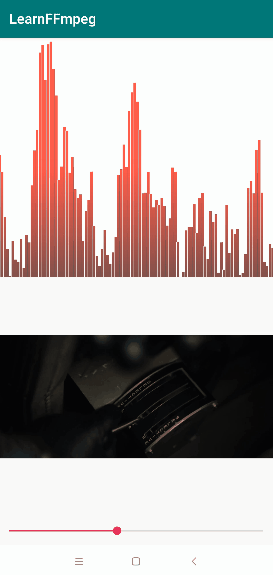
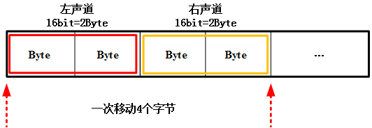

# FFmpeg 开发(04)：FFmpeg + OpenGLES 实现音频可视化播放

FFmpeg 开发系列连载：

- [FFmpeg 开发(01)：FFmpeg 编译和集成](http://mp.weixin.qq.com/s?__biz=MzIwNTIwMzAzNg==&mid=2654162543&idx=1&sn=894a6bfb0f8f652ef53860075af1754b&chksm=8cf39d5cbb84144a9d62fa80cbeed1843aadfe97bf8a30ab02474f98ec86be649d65e301674b&scene=21#wechat_redirect)
- [FFmpeg 开发(02)：FFmpeg + ANativeWindow 实现视频解码播放](http://mp.weixin.qq.com/s?__biz=MzIwNTIwMzAzNg==&mid=2654162564&idx=1&sn=6785c7f9b6bdccbd400f792e9389b15c&chksm=8cf39db7bb8414a14a4acdea47e866f4b19ebdf80ed5aa7663a678c9571d505ecda294b65a05&scene=21#wechat_redirect)
- [FFmpeg 开发(03)：FFmpeg + OpenSLES 实现音频解码播放](http://mp.weixin.qq.com/s?__biz=MzIwNTIwMzAzNg==&mid=2654162604&idx=1&sn=c4e6d5a53fddcc327861cb1956285c9c&chksm=8cf39d9fbb8414898778a461b8249b698486dff85d52f0f4a86deebb711597ac685fdc99c8c3&scene=21#wechat_redirect)


本文基于上一篇文章 FFmpeg + OpenSLES 实现音频解码播放 ，利用 FFmpeg 对一个 Mp4 文件的音频流进行解码，然后将解码后的 PCM 音频数据进行重采样。


最后利用 OpenSLES 进行播放的同时，将 PCM 音频一个通道的数据实时渲染成条状图。


FFmpeg + OpenGLES 实现音频可视化播放

关于音频的可视化，在旧文中，我们曾经实现过将 Android AudioRecorder 采集的实时音频单通道 PCM 数据用 OpenGL 渲染成柱状图。


具体的渲染过程和细节，请移步这篇文章，代码已开源：

- [OpenGL ES 实现可视化实时音频](http://mp.weixin.qq.com/s?__biz=MzIwNTIwMzAzNg==&mid=2654162045&idx=1&sn=251e7d6432198d470e5c67cdb17c34a5&chksm=8cf39f4ebb841658888a4f37f699040fa9a2a5a63717c33f9b4b8513c30c37c32babfd36408a&scene=21#wechat_redirect)

# 提取一个通道的音频数据

在上一篇文章，我们构建 OpenSLES 播放器时，对数据格式的定义如下：


```
SLDataFormat_PCM pcm = {
        SL_DATAFORMAT_PCM,//format type
        (SLuint32)2,//channel count 双通道
        SL_SAMPLINGRATE_44_1,//44100hz
        SL_PCMSAMPLEFORMAT_FIXED_16,// bits per sample 2字节=16bit
        SL_PCMSAMPLEFORMAT_FIXED_16,// container size
        SL_SPEAKER_FRONT_LEFT | SL_SPEAKER_FRONT_RIGHT,// channel mask
        SL_BYTEORDER_LITTLEENDIAN // endianness 小端序
};
```

从上面代码中可以看出，音频驱动接收的 PCM 数据的采样率是 44.1kHz，双通道，采样大小 2 字节。由于我们要渲染的是一个通道的 PCM 数据，所以需要对双通道的数据做一个提取。

双通道的 PCM 数据

如上图所示，解码后的 PCM 数据是 2 个通道的数据交叉存储，当使用指针偏移提取某一通道的数据时，每次偏移的步长是 2 字节 x 通道数 = 4 个字节。

提取某一通道的 PCM 数据方式如下，通过该方式我们可以将一帧音频数据每个通道的数据进行分离。

```
//小端序存储的音频数据
uint8_t* pByte = audioFrame->data;
for(int i=0; i<audioFrame->dataSize; i++) {
    short *pShort = pByte + i * 4;
    //左声道值
    short leftChannelValue = *pShort;

    pShort = pByte + i * 4 + 2;
    //右声道值
    short rightChannelValue = *pShort;

}
```

另外需要注意的是，数据的存储方式分为大端序和小端序，小端序指低地址存放低位、高地址存放高位，大端序与小端序相反，即低地址存放高位，分离通道数据需要注意。

```
//大端序存储的音频数据
uint8_t* pByte = audioFrame->data;
for(int i=0; i<audioFrame->dataSize; i++) {
    short *pShort = pByte + i * 4;
    //左声道值
    short leftChannelValue = ((*pShort & 0xFF00) >> 8) | ((*pShort & 0x00FF) << 8);

    pShort = pByte + i * 4 + 2;
    //右声道值
    short rightChannelValue = ((*pShort & 0xFF00) >> 8) | ((*pShort & 0x00FF) << 8);

}
```

# OpenGL ES 渲染音频数据

OpenGLES 全称 OpenGL for Embedded Systems ，是三维图形应用程序接口 OpenGL 的子集，本质上是一个跨编程语言、跨平台的编程接口规范，主要应用于嵌入式设备，如手机、平板等。

由于前期已经系统地阐述了 OpenGL ES 相关知识点，这里就不做展开叙述，详细内容请参考：

[Android OpenGL ES 从入门到精通系统性学习教程](http://mp.weixin.qq.com/s?__biz=MzIwNTIwMzAzNg==&mid=2654162516&idx=1&sn=6b19a9dbd38d15cc3dd47a446e5bd933&chksm=8cf39d67bb841471eed05c8d4452b6493c396cfc9746a3ee23781dfef178a161fd82e6b007c4&scene=21#wechat_redirect)

利用 OpenGL 渲染音频数据，本质上就是根据音频数据的值去构建一组如下图所示的网格，最终渲染成条状图。

根据音频数据的值去构建条状图网格


接下来就是代码实现过程，首先在 Java 层创建 GLSurfaceView 的 Render ，FFMediaPlayer 中增加对应 Native 函数。


这里其实不必用 EGL + SurfaceView 创建 OpenGL 环境，GLSurfaceView 已经封装的很好，可以满足绝大部分屏幕渲染的需求。


```
private GLSurfaceView.Renderer mAudioGLRender = new GLSurfaceView.Renderer() {
    @Override
    public void onSurfaceCreated(GL10 gl10, EGLConfig eglConfig) {
        FFMediaPlayer.native_OnAudioVisualSurfaceCreated();

    }

    @Override
    public void onSurfaceChanged(GL10 gl10, int w, int h) {
        FFMediaPlayer.native_OnAudioVisualSurfaceChanged(w, h);

    }

    @Override
    public void onDrawFrame(GL10 gl10) {
        FFMediaPlayer.native_OnAudioVisualDrawFrame();
    }
};

public class FFMediaPlayer {

    static {
        System.loadLibrary("learn-ffmpeg");
    }

    //......

    //for audio visual render
    public static native void native_OnAudioVisualSurfaceCreated();
    public static native void native_OnAudioVisualSurfaceChanged(int width, int height);
    public static native void native_OnAudioVisualDrawFrame();

}
```

对应 Java 层接口的 JNI :

```
//可视化音频的渲染接口
JNIEXPORT void JNICALL
Java_com_byteflow_learnffmpeg_media_FFMediaPlayer_native_1OnAudioVisualSurfaceCreated(JNIEnv *env,
                                                                                      jclass clazz) {
    AudioVisualRender::GetInstance()->OnAudioVisualSurfaceCreated();
}

JNIEXPORT void JNICALL
Java_com_byteflow_learnffmpeg_media_FFMediaPlayer_native_1OnAudioVisualSurfaceChanged(JNIEnv *env,
                                                                                      jclass clazz,
                                                                                      jint width,
                                                                                      jint height) {
    AudioVisualRender::GetInstance()->OnAudioVisualSurfaceChanged(width, height);
}

JNIEXPORT void JNICALL
Java_com_byteflow_learnffmpeg_media_FFMediaPlayer_native_1OnAudioVisualDrawFrame(JNIEnv *env,
                                                                                 jclass clazz) {
    AudioVisualRender::GetInstance()->OnAudioVisualDrawFrame();
}
```

Native 层实现音频渲染的类：

```
#include <LogUtil.h>
#include <GLUtils.h>
#include "AudioVisualRender.h"
#include <gtc/matrix_transform.hpp>
#include <detail/type_mat.hpp>
#include <detail/type_mat4x4.hpp>
#include <render/video/OpenGLRender.h>


AudioVisualRender* AudioVisualRender::m_pInstance = nullptr;
std::mutex AudioVisualRender::m_Mutex;

AudioVisualRender *AudioVisualRender::GetInstance() {
    if(m_pInstance == nullptr) {
        std::unique_lock<std::mutex> lock(m_Mutex);
        if(m_pInstance == nullptr) {
            m_pInstance = new AudioVisualRender();
        }

    }
    return m_pInstance;
}

void AudioVisualRender::ReleaseInstance() {
    std::unique_lock<std::mutex> lock(m_Mutex);
    if(m_pInstance != nullptr) {
        delete m_pInstance;
        m_pInstance = nullptr;
    }

}

void AudioVisualRender::OnAudioVisualSurfaceCreated() {
    ByteFlowPrintE("AudioVisualRender::OnAudioVisualSurfaceCreated");
    if (m_ProgramObj)
        return;
    char vShaderStr[] =
            "#version 300 es\n"
            "layout(location = 0) in vec4 a_position;\n"
            "layout(location = 1) in vec2 a_texCoord;\n"
            "uniform mat4 u_MVPMatrix;\n"
            "out vec2 v_texCoord;\n"
            "void main()\n"
            "{\n"
            "    gl_Position = u_MVPMatrix * a_position;\n"
            "    v_texCoord = a_texCoord;\n"
            "    gl_PointSize = 4.0f;\n"
            "}";

    char fShaderStr[] =
            "#version 300 es                                     \n"
            "precision mediump float;                            \n"
            "in vec2 v_texCoord;                                 \n"
            "layout(location = 0) out vec4 outColor;             \n"
            "uniform float drawType;                             \n"
            "void main()                                         \n"
            "{                                                   \n"
            "  if(drawType == 1.0)                               \n"
            "  {                                                 \n"
            "      outColor = vec4(1.5 - v_texCoord.y, 0.3, 0.3, 1.0); \n"
            "  }                                                 \n"
            "  else if(drawType == 2.0)                          \n"
            "  {                                                 \n"
            "      outColor = vec4(1.0, 1.0, 1.0, 1.0);          \n"
            "  }                                                 \n"
            "  else if(drawType == 3.0)                          \n"
            "  {                                                 \n"
            "      outColor = vec4(0.3, 0.3, 0.3, 1.0);          \n"
            "  }                                                 \n"
            "}                                                   \n";

    //生成着色器程序
    m_ProgramObj = GLUtils::CreateProgram(vShaderStr, fShaderStr);
    if (m_ProgramObj == GL_NONE) {
        LOGCATE("VisualizeAudioSample::Init create program fail");
    }


    //设置 MVP Matrix 变换矩阵
    // Projection matrix
    glm::mat4 Projection = glm::ortho(-1.0f, 1.0f, -1.0f, 1.0f, 0.1f, 100.0f);
    //glm::mat4 Projection = glm::frustum(-ratio, ratio, -1.0f, 1.0f, 4.0f, 100.0f);
    //glm::mat4 Projection = glm::perspective(45.0f, ratio, 0.1f, 100.f);

    // View matrix
    glm::mat4 View = glm::lookAt(
            glm::vec3(0, 0, 4), // Camera is at (0,0,1), in World Space
            glm::vec3(0, 0, 0), // and looks at the origin
            glm::vec3(0, 1, 0)  // Head is up (set to 0,-1,0 to look upside-down)
    );

    // Model matrix
    glm::mat4 Model = glm::mat4(1.0f);
    Model = glm::scale(Model, glm::vec3(1.0f, 1.0f, 1.0f));
    Model = glm::rotate(Model, 0.0f, glm::vec3(1.0f, 0.0f, 0.0f));
    Model = glm::rotate(Model, 0.0f, glm::vec3(0.0f, 1.0f, 0.0f));
    Model = glm::translate(Model, glm::vec3(0.0f, 0.0f, 0.0f));

    m_MVPMatrix = Projection * View * Model;

}

void AudioVisualRender::OnAudioVisualSurfaceChanged(int w, int h) {
    ByteFlowPrintE("AudioVisualRender::OnAudioVisualSurfaceChanged [w, h] = [%d, %d]", w, h);
    glClearColor(1.0f, 1.0f, 1.0f, 1.0);
    glViewport(0, 0, w, h);

}

void AudioVisualRender::OnAudioVisualDrawFrame() {
    ByteFlowPrintD("AudioVisualRender::OnAudioVisualDrawFrame");
    glClear(GL_DEPTH_BUFFER_BIT | GL_COLOR_BUFFER_BIT);
    std::unique_lock<std::mutex> lock(m_Mutex);
    if (m_ProgramObj == GL_NONE || m_pAudioBuffer == nullptr) return;
    UpdateMesh();
    lock.unlock();

    // Generate VBO Ids and load the VBOs with data
    if(m_VboIds[0] == 0)
    {
        glGenBuffers(2, m_VboIds);

        glBindBuffer(GL_ARRAY_BUFFER, m_VboIds[0]);
        glBufferData(GL_ARRAY_BUFFER, sizeof(GLfloat) * m_RenderDataSize * 6 * 3, m_pVerticesCoords, GL_DYNAMIC_DRAW);

        glBindBuffer(GL_ARRAY_BUFFER, m_VboIds[1]);
        glBufferData(GL_ARRAY_BUFFER, sizeof(GLfloat) * m_RenderDataSize * 6 * 2, m_pTextureCoords, GL_DYNAMIC_DRAW);
    }
    else
    {
        glBindBuffer(GL_ARRAY_BUFFER, m_VboIds[0]);
        glBufferSubData(GL_ARRAY_BUFFER, 0, sizeof(GLfloat) * m_RenderDataSize * 6 * 3, m_pVerticesCoords);

        glBindBuffer(GL_ARRAY_BUFFER, m_VboIds[1]);
        glBufferSubData(GL_ARRAY_BUFFER, 0, sizeof(GLfloat) * m_RenderDataSize * 6 * 2, m_pTextureCoords);
    }

    if(m_VaoId == GL_NONE)
    {
        glGenVertexArrays(1, &m_VaoId);
        glBindVertexArray(m_VaoId);

        glBindBuffer(GL_ARRAY_BUFFER, m_VboIds[0]);
        glEnableVertexAttribArray(0);
        glVertexAttribPointer(0, 3, GL_FLOAT, GL_FALSE, 3 * sizeof(GLfloat), (const void *) 0);
        glBindBuffer(GL_ARRAY_BUFFER, GL_NONE);

        glBindBuffer(GL_ARRAY_BUFFER, m_VboIds[1]);
        glEnableVertexAttribArray(1);
        glVertexAttribPointer(1, 2, GL_FLOAT, GL_FALSE, 2 * sizeof(GLfloat), (const void *) 0);
        glBindBuffer(GL_ARRAY_BUFFER, GL_NONE);

        glBindVertexArray(GL_NONE);
    }

    // Use the program object
    glUseProgram(m_ProgramObj);
    glBindVertexArray(m_VaoId);
    GLUtils::setMat4(m_ProgramObj, "u_MVPMatrix", m_MVPMatrix);
    GLUtils::setFloat(m_ProgramObj, "drawType", 1.0f);
    glDrawArrays(GL_TRIANGLES, 0, m_RenderDataSize * 6);
    GLUtils::setFloat(m_ProgramObj, "drawType", 2.0f);
    glDrawArrays(GL_LINES, 0, m_RenderDataSize * 6);

}

void AudioVisualRender::UpdateAudioFrame(AudioFrame *audioFrame) {
    if(audioFrame != nullptr) {
        ByteFlowPrintD("AudioVisualRender::UpdateAudioFrame audioFrame->dataSize=%d", audioFrame->dataSize);
        std::unique_lock<std::mutex> lock(m_Mutex);
        if(m_pAudioBuffer != nullptr && m_pAudioBuffer->dataSize != audioFrame->dataSize) {
            delete m_pAudioBuffer;
            m_pAudioBuffer = nullptr;

            delete [] m_pTextureCoords;
            m_pTextureCoords = nullptr;

            delete [] m_pVerticesCoords;
            m_pVerticesCoords = nullptr;
        }

        if(m_pAudioBuffer == nullptr) {
            m_pAudioBuffer = new AudioFrame(audioFrame->data, audioFrame->dataSize);
            m_RenderDataSize = m_pAudioBuffer->dataSize / RESAMPLE_LEVEL;

            m_pVerticesCoords = new vec3[m_RenderDataSize * 6]; //(x,y,z) * 6 points
            m_pTextureCoords = new vec2[m_RenderDataSize * 6]; //(x,y) * 6 points
        } else {
            memcpy(m_pAudioBuffer->data, audioFrame->data, audioFrame->dataSize);
        }
        lock.unlock();
    }
}

//创建和更新条状图的网格，这里一帧音频数据太大，进行了采样
void AudioVisualRender::UpdateMesh() {
    float dy = 0.25f / MAX_AUDIO_LEVEL;
    float dx = 1.0f / m_RenderDataSize;
    for (int i = 0; i < m_RenderDataSize; ++i) {
        int index = i * RESAMPLE_LEVEL; //RESAMPLE_LEVEL 表示采样间隔
        short *pValue = (short *)(m_pAudioBuffer->data + index);
        float y = *pValue * dy;
        y = y < 0 ? y : -y;
        vec2 p1(i * dx, 0 + 1.0f);
        vec2 p2(i * dx, y + 1.0f);
        vec2 p3((i + 1) * dx, y + 1.0f);
        vec2 p4((i + 1) * dx, 0 + 1.0f);

        m_pTextureCoords[i * 6 + 0] = p1;
        m_pTextureCoords[i * 6 + 1] = p2;
        m_pTextureCoords[i * 6 + 2] = p4;
        m_pTextureCoords[i * 6 + 3] = p4;
        m_pTextureCoords[i * 6 + 4] = p2;
        m_pTextureCoords[i * 6 + 5] = p3;

        m_pVerticesCoords[i * 6 + 0] = GLUtils::texCoordToVertexCoord(p1);
        m_pVerticesCoords[i * 6 + 1] = GLUtils::texCoordToVertexCoord(p2);
        m_pVerticesCoords[i * 6 + 2] = GLUtils::texCoordToVertexCoord(p4);
        m_pVerticesCoords[i * 6 + 3] = GLUtils::texCoordToVertexCoord(p4);
        m_pVerticesCoords[i * 6 + 4] = GLUtils::texCoordToVertexCoord(p2);
        m_pVerticesCoords[i * 6 + 5] = GLUtils::texCoordToVertexCoord(p3);
    }
}

void AudioVisualRender::Init() {
    m_VaoId = GL_NONE;

    m_pTextureCoords = nullptr;
    m_pVerticesCoords = nullptr;

    memset(m_VboIds, 0, sizeof(GLuint) * 2);
    m_pAudioBuffer = nullptr;

}

//释放内存
void AudioVisualRender::UnInit() {
    if (m_pAudioBuffer != nullptr) {
        delete m_pAudioBuffer;
        m_pAudioBuffer = nullptr;
    }

    if (m_pTextureCoords != nullptr) {
        delete [] m_pTextureCoords;
        m_pTextureCoords = nullptr;
    }

    if (m_pVerticesCoords != nullptr) {
        delete [] m_pVerticesCoords;
        m_pVerticesCoords = nullptr;
    }
}
```

最后只需要在 OpenSLES 播放器的回调函数（见上篇文章）中调用下面函数即可：

```
AudioFrame *audioFrame = m_AudioFrameQueue.front();
if (nullptr != audioFrame && m_AudioPlayerPlay) {
    SLresult result = (*m_BufferQueue)->Enqueue(m_BufferQueue, audioFrame->data, (SLuint32) audioFrame->dataSize);
    if (result == SL_RESULT_SUCCESS) {
        //最后只需要在 OpenSLES 播放器的回调函数中调用 UpdateAudioFrame 函数即可
        AudioVisualRender::GetInstance()->UpdateAudioFrame(audioFrame);

        m_AudioFrameQueue.pop();
        delete audioFrame;
    }

}
```


