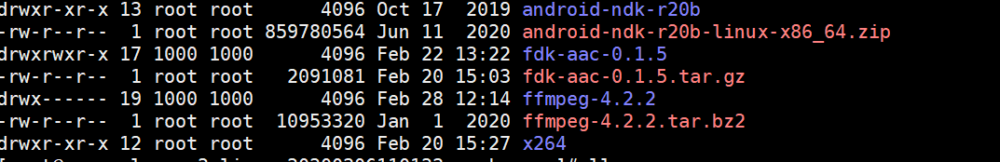
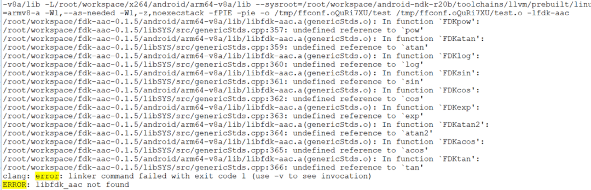
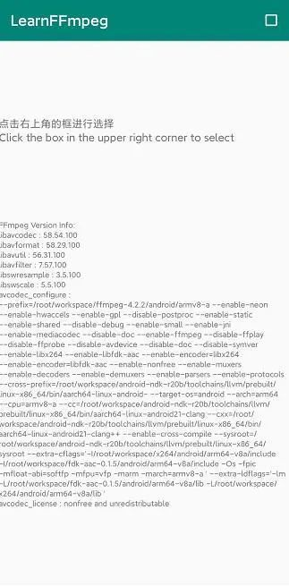

# FFmpeg、x264以及fdk-aac 编译整合

最近在根据项目需求疯狂撸 OpenCL ，FFmpeg 相关的文章落下了不少，后面也准备介绍下 OpenCL 在 Android 上的应用，另外 OpenCL 可以和 OpenGL 结合使用，非常有趣。

前面系列文章已经讲过使用 FFmpeg 对[音频和视频进行解码](http://mp.weixin.qq.com/s?__biz=MzIwNTIwMzAzNg==&mid=2654162883&idx=1&sn=40e6a50ad4ca715dbceaa3782ae2fdc1&chksm=8cf39cf0bb8415e6411b87ed6a0edad423ce2b869399b788815785ea3f0584599a0973c1cf81&scene=21#wechat_redirect)以及[视频添加滤镜渲染](http://mp.weixin.qq.com/s?__biz=MzIwNTIwMzAzNg==&mid=2654163056&idx=1&sn=94d3d8ae3c004207b4c019a236b9129d&chksm=8cf38343bb840a5504d0cdc05cece6dbe4ab5fa89da71e59334f418634efd218129a6c7ac3a6&scene=21#wechat_redirect)，接下来文章将会介绍音频和视频编码相关，包括为视频添加好玩的滤镜、音频添加搞笑的变声效果。

关于 x264、fdk-aac、FFmpeg 开源库的编译介绍网上“满大街”都是的，可参考资料很多。本文只是采用高一些的 NDK 版本，使用 clang 编译，以防止后面二次开发时出现编译问题。

# 编译环境

按照套路先说明编译环境：

- android-ndk-r20b-linux-x86_64
- ffmpeg-4.2.2
- libfdk-aac version:0.1.5
- x264

# 编译 fdk-aac

fdk-aac 是指：Fraunhofer FDK AAC 编解码器库，是**一个开源软件库，用于编码和解码高级音频编码格式 AAC 的音频**。

在 fdk-aac 解压目录下创建编译脚本`build_fdk_aac_clang.sh`：

```
#!/bin/bash
NDK=/root/workspace/android-ndk-r20b # 这里需要替换成你本地的 NDK 路径，其他的不用修改
HOST_TAG=linux-x86_64
TOOLCHAIN=$NDK/toolchains/llvm/prebuilt/$HOST_TAG
ANDROID_LIB_PATH="$(pwd)/android"

API=21

function build_android
{
echo "Build fdk-aac for android $CPU"
./configure \
--host=$HOST \
--disable-shared \
--enable-static \
--prefix="$ANDROID_LIB_PATH/$CPU" \
 CPPFLAGS="-fPIC"

make clean
make -j8
make install
echo "Build fdk-aac for android $CPU completed"
}

# armeabi-v7a
CPU=armv7-a
HOST=arm-linux-android
export AR=$TOOLCHAIN/bin/arm-linux-androideabi-ar
export AS=$TOOLCHAIN/bin/arm-linux-androideabi-as
export LD=$TOOLCHAIN/bin/arm-linux-androideabi-ld
export RANLIB=$TOOLCHAIN/bin/arm-linux-androideabi-ranlib
export STRIP=$TOOLCHAIN/bin/arm-linux-androideabi-strip
export CC=$TOOLCHAIN/bin/armv7a-linux-androideabi$API-clang
export CXX=$TOOLCHAIN/bin/armv7a-linux-androideabi$API-clang++
build_android

# arm64-v8a
CPU=armv8-a
HOST=aarch64-linux-android
export AR=$TOOLCHAIN/bin/aarch64-linux-android-ar
export AS=$TOOLCHAIN/bin/aarch64-linux-android-as
export LD=$TOOLCHAIN/bin/aarch64-linux-android-ld
export RANLIB=$TOOLCHAIN/bin/aarch64-linux-android-ranlib
export STRIP=$TOOLCHAIN/bin/aarch64-linux-android-strip
export CC=$TOOLCHAIN/bin/aarch64-linux-android$API-clang
export CXX=$TOOLCHAIN/bin/aarch64-linux-android$API-clang++
build_android
```

修改编译脚本的权限，执行编译：

```
# 修改 build_fdk_aac_clang.sh 可执行权限
chmod +x build_fdk_aac_clang.sh
# 运行编译脚本
bash build_fdk_aac_clang.sh
```

编译完成后会在当前目录下自动创建 android 文件夹，并生成 32 & 64 位 libfdk-aac.a 库。

```
-fdk-aac-0.1.5
---android
-----lib/armeabi-v7a
-------libfdk-aac.a
-----lib/arm64-v8a
-------libfdk-aac.a
```

# 编译 x264

x264 是采用 GPL 授权的开源视频编码库，**主要用于 H.264/MPEG-4 AVC 的视频编码，仅作为编码器使用**。

在 x264 解压目录下创建编译脚本`build_x264_clang.sh`：

```
#!/bin/bash
export NDK=/root/workspace/android-ndk-r20b # 这里需要替换成你本地的 NDK 路径，其他的不用修改
TOOLCHAIN=$NDK/toolchains/llvm/prebuilt/linux-x86_64
export API=21

function build_android
{
./configure \
    --prefix=$PREFIX \
      --disable-cli \
    --disable-shared \
    --enable-static \
    --enable-pic \
    --host=$my_host \
      --cross-prefix=$CROSS_PREFIX \
    --sysroot=$NDK/toolchains/llvm/prebuilt/linux-x86_64/sysroot \

make clean
make -j8
make install
}

#arm64-v8a
PREFIX=./android/arm64-v8a
my_host=aarch64-linux-android
export TARGET=aarch64-linux-android
export CC=$TOOLCHAIN/bin/$TARGET$API-clang
export CXX=$TOOLCHAIN/bin/$TARGET$API-clang++
CROSS_PREFIX=$TOOLCHAIN/bin/aarch64-linux-android-
build_android

#armeabi-v7a
PREFIX=./android/armeabi-v7a
my_host=armv7a-linux-android
export TARGET=armv7a-linux-androideabi
export CC=$TOOLCHAIN/bin/$TARGET$API-clang
export CXX=$TOOLCHAIN/bin/$TARGET$API-clang++
CROSS_PREFIX=$TOOLCHAIN/bin/arm-linux-androideabi-
build_android
```


同样修改编译脚本的权限，执行编译：


```
# 修改 build_x264_clang.sh 可执行权限
chmod +x build_x264_clang.sh
# 运行编译脚本
bash build_x264_clang.sh
```


编译完成后会在当前目录下自动创建 android 文件夹，并生成 32 & 64 位 libx264.a 库。


```
-x264
---android
-----lib/armeabi-v7a
-------libx264.a
-----lib/arm64-v8a
-------libx264.a
```

# 编译 FFmpeg 链接 fdk-aac 和 x264

关于 FFmpeg 的介绍、编译以及集成可以参考前面的文章：[FFmpeg 集成编译](http://mp.weixin.qq.com/s?__biz=MzIwNTIwMzAzNg==&mid=2654162543&idx=1&sn=894a6bfb0f8f652ef53860075af1754b&chksm=8cf39d5cbb84144a9d62fa80cbeed1843aadfe97bf8a30ab02474f98ec86be649d65e301674b&scene=21#wechat_redirect)，本节直接介绍编译 FFmpeg 时链接 fdk-aac 和 x264 库。


Android 平台，一般我们要链接第三方库的时候，需要第三方库的头文件和相应的 .a 或 .so 库。前面我们已经对 fdk-aac 和 x264 库进行了编译，可以获取到它们对应的静态库和头文件。


FFmpeg 、fdk-aac 和 x264 目录结构：


FFmpeg 、fdk-aac 和 x264 目录结构


在 FFmpeg-4.2.2 解压目录下，新建编译 FFmpeg 并链接 fdk-aac 和 x264 脚本 build_ffmpeg_link_fdk_aac_x264_clang.sh：


```
#!/bin/bash
export NDK=/root/workspace/android-ndk-r20b # 这里需要替换成你本地的 NDK 路径，其他的不用修改
TOOLCHAIN=$NDK/toolchains/llvm/prebuilt/linux-x86_64

function build_android
{

./configure \
--prefix=$PREFIX \
--enable-neon  \
--enable-hwaccels  \
--enable-gpl   \
--disable-postproc \
--enable-static \
--enable-shared \
--disable-debug \
--enable-small \
--enable-jni \
--enable-mediacodec \
--disable-doc \
--enable-ffmpeg \
--disable-ffplay \
--disable-ffprobe \
--disable-avdevice \
--disable-doc \
--disable-symver \
--enable-libx264 \
--enable-libfdk-aac \
--enable-encoder=libx264 \
--enable-encoder=libfdk-aac \
--enable-nonfree \
--enable-muxers \
--enable-decoders \
--enable-demuxers \
--enable-parsers \
--enable-protocols \
--cross-prefix=$CROSS_PREFIX \
--target-os=android \
--arch=$ARCH \
--cpu=$CPU \
--cc=$CC \
--cxx=$CXX \
--enable-cross-compile \
--sysroot=$SYSROOT \
--extra-cflags="-I$X264_INCLUDE -I$FDK_INCLUDE -Os -fpic $OPTIMIZE_CFLAGS" \
--extra-ldflags="-lm -L$FDK_LIB -L$X264_LIB $ADDI_LDFLAGS" 

make clean
make -j8
make install
echo "The Compilation of FFmpeg with x264,fdk-aac for $CPU is completed"
}

#armv8-a
ARCH=arm64
CPU=armv8-a
API=21
CC=$TOOLCHAIN/bin/aarch64-linux-android$API-clang
CXX=$TOOLCHAIN/bin/aarch64-linux-android$API-clang++
SYSROOT=$NDK/toolchains/llvm/prebuilt/linux-x86_64/sysroot
CROSS_PREFIX=$TOOLCHAIN/bin/aarch64-linux-android-
PREFIX=$(pwd)/android/$CPU
OPTIMIZE_CFLAGS="-mfloat-abi=softfp -mfpu=vfp -marm -march=$CPU "

BASE_PATH=/root/workspace
LIB_TARGET_ABI=arm64-v8a

#指定 fdk-aac 的头文件和静态库目录
FDK_INCLUDE=$BASE_PATH/fdk-aac-0.1.5/android/$LIB_TARGET_ABI/include
FDK_LIB=$BASE_PATH/fdk-aac-0.1.5/android/$LIB_TARGET_ABI/lib

#指定 x264 的头文件和静态库目录
X264_INCLUDE=$BASE_PATH/x264/android/$LIB_TARGET_ABI/include
X264_LIB=$BASE_PATH/x264/android/$LIB_TARGET_ABI/lib

build_android

cp $FDK_LIB/libfdk-aac.a $PREFIX/lib
cp $X264_LIB/libx264.a $PREFIX/lib

#armv7-a
ARCH=arm
CPU=armv7-a
API=21
CC=$TOOLCHAIN/bin/armv7a-linux-androideabi$API-clang
CXX=$TOOLCHAIN/bin/armv7a-linux-androideabi$API-clang++
SYSROOT=$NDK/toolchains/llvm/prebuilt/linux-x86_64/sysroot
CROSS_PREFIX=$TOOLCHAIN/bin/arm-linux-androideabi-
PREFIX=$(pwd)/android/$CPU
OPTIMIZE_CFLAGS="-mfloat-abi=softfp -mfpu=vfp -marm -march=$CPU "

BASE_PATH=/root/workspace
LIB_TARGET_ABI=armeabi-v7a
FDK_INCLUDE=$BASE_PATH/fdk-aac-0.1.5/android/$LIB_TARGET_ABI/include
FDK_LIB=$BASE_PATH/fdk-aac-0.1.5/android/$LIB_TARGET_ABI/lib
X264_INCLUDE=$BASE_PATH/x264/android/$LIB_TARGET_ABI/include
X264_LIB=$BASE_PATH/x264/android/$LIB_TARGET_ABI/lib

build_android

cp $FDK_LIB/libfdk-aac.a $PREFIX/lib
cp $X264_LIB/libx264.a $PREFIX/lib
```


里面有几个关键的地方需要注意下：


```
# 打开2种编码器的开关
--enable-libx264 \
--enable-libfdk-aac \
--enable-encoder=libx264 \
--enable-encoder=libfdk-aac \

......

#指定第三方库的头文件和静态库目录
--extra-cflags="-I$X264_INCLUDE -I$FDK_INCLUDE -Os -fpic $OPTIMIZE_CFLAGS" \
--extra-ldflags="-lm -L$FDK_LIB -L$X264_LIB $ADDI_LDFLAGS" 
```


另外还需要链接标准数学库：


```
--extra-ldflags="-lm -L$FDK_LIB -L$X264_LIB $ADDI_LDFLAGS" # -lm 即是链接数学库
```


因为 FFmpeg 链接的 fdk-aac 需要用到数学库，不链接的话会报如下错误：


error.png


这里又引出来一个问题，那么一般 FFmpeg  编译错误如何查看？


答案是**查看 ffbuild 文件夹下面的 config.log 文件**，可以直接跳到文件结尾看报错信息。


通过打印编译配置信息验证


最后通过查看编译成功后 FFmpeg 库的编译配置信息，查看我们的编译是否成功，本文通过程序将 FFmpeg 的编译配置信息打印出来了。