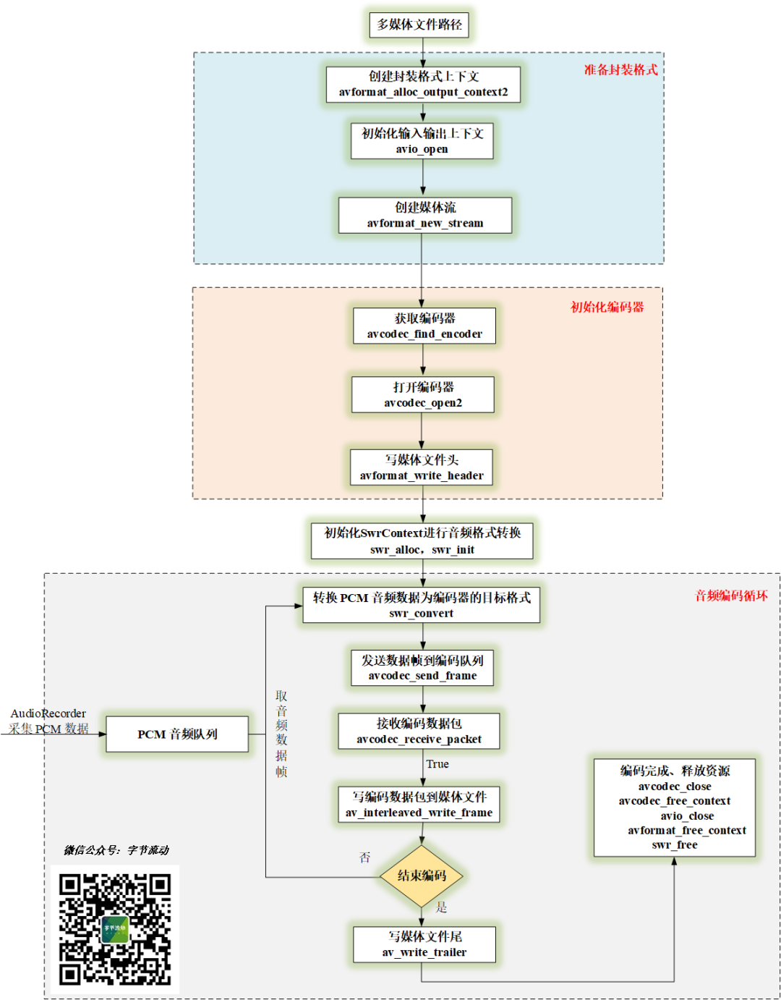
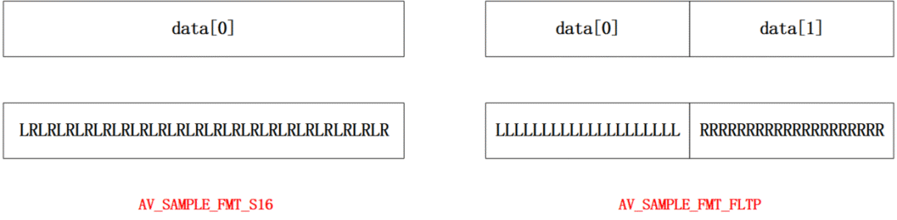

# FFmpeg + Android AudioRecorder 音频录制编码

前文利用 [FFmpeg 对 Android Camera2 采集的预览帧先进行渲染，然后利用 OpenGL 添加滤镜，最后将渲染结果进行编码生成 mp4 文件](http://mp.weixin.qq.com/s?__biz=MzIwNTIwMzAzNg==&mid=2654164776&idx=1&sn=5e9f1307349b2ec16452c9b33cc289cb&chksm=8cf3841bbb840d0dc08a8c447c83f21fff1fe205a9096ef705795d7341862ac8308206339753&scene=21#wechat_redirect)。


本文将**利用 Android AudioRecorder 采集 PCM 音频，然后利用 FFmpeg 对其编码生成 aac 文件**。


提前预告下，在该系列的下一篇文章将介绍 FFmpeg 同时对 Android Camera 采集的预览帧和 AudioRecorder 采集的音频数据进行编码，生成一个 mp4 文件。


FFmpeg + Android AudioRecorder 音频录制编码

# AudioRecorder 使用

这里利用 Android AudioRecorder API 采集音频 PCM 裸数据，然后通过 jni 传递到 Native 层供 FFmpeg 编码使用。


下面代码将 AudioRecoder 封装到线程里，通过接口回调的方式将 PCM 数据传出来，**默认采样率为 44.1kHz，双通道立体声，采样格式为 PCM 16 bit 。**


```
public class AudioRecorder extends Thread {
    private static final String TAG = "AudioRecorder";
    private AudioRecord mAudioRecord = null;
    private static final int DEFAULT_SAMPLE_RATE = 44100;
    private static final int DEFAULT_CHANNEL_LAYOUT = AudioFormat.CHANNEL_IN_STEREO;
    private static final int DEFAULT_SAMPLE_FORMAT = AudioFormat.ENCODING_PCM_16BIT;
    private final AudioRecorderCallback mRecorderCallback;

    public AudioRecorder(AudioRecorderCallback callback) {
        this.mRecorderCallback = callback;
    }

    @Override
    public void run() {
        final int mMinBufferSize = AudioRecord.getMinBufferSize(DEFAULT_SAMPLE_RATE, DEFAULT_CHANNEL_LAYOUT, DEFAULT_SAMPLE_FORMAT);
        Log.d(TAG, "run() called mMinBufferSize=" + mMinBufferSize);

        mAudioRecord = new AudioRecord(android.media.MediaRecorder.AudioSource.MIC, DEFAULT_SAMPLE_RATE, DEFAULT_CHANNEL_LAYOUT, DEFAULT_SAMPLE_FORMAT, mMinBufferSize);
        try {
            mAudioRecord.startRecording();
        } catch (IllegalStateException e) {
            mRecorderCallback.onError(e.getMessage() + " [startRecording failed]");
            return;
        }

        byte[] sampleBuffer = new byte[4096];
        try {
            while (!Thread.currentThread().isInterrupted()) {

                int result = mAudioRecord.read(sampleBuffer, 0, 4096);
                if (result > 0) {
                    mRecorderCallback.onAudioData(sampleBuffer, result);
                }
            }
        } catch (Exception e) {
            mRecorderCallback.onError(e.getMessage());
        }

        mAudioRecord.release();
        mAudioRecord = null;
    }

    public interface AudioRecorderCallback {
        void onAudioData(byte[] data, int dataSize);
        void onError(String msg);
    }
}
```

# 音频编码流程

音频的编码流程与视频编码流程基本上一致，为了更加清楚地展示流程，也画了一张流程图如下图所示。


音频的编码流程


AudioRecoder 采集的 PCM 音频放入音频队列中，子线程音频编码循环不断从队列中取数据进行编码，最后将编码数据写入媒体文件。


# FFmpeg 两种采样格式

由于新的 FFmpeg 版本**不再支持对 AV_SAMPLE_FMT_S16 采样格式的音频数据进行编码**，需要利用 swr_convert 将格式转换为 AV_SAMPLE_FMT_FLTP ，而 AV_SAMPLE_FMT_S16 就是 AudioRecorder 的 AudioFormat.ENCODING_PCM_16BIT 。


两种采样格式的特点：


- **AV_SAMPLE_FMT_S16  位宽 16 bit , short 型，取值范围 [-32767, 32767];**
- **AV_SAMPLE_FMT_FLTP 位宽 32 bit , float 型，取值范围 [-1.0, 1.0];**

**
**


可以看出单声道两者只是取值范围上的差别，双声道的话两者还有存储结构上的差异。


双声道 AV_SAMPLE_FMT_S16 和 AV_SAMPLE_FMT_FLTP 格式结构


两种音频采样格式的结构


从图中可以看出，**双声道 AV_SAMPLE_FMT_S16 类型左右声道数据交叉存储，而双声道 AV_SAMPLE_FMT_FLTP 类型左右声道各存储在一个 planer** ，熟悉 YUV 格式的同学可以看出这种排布方式有点像 YUV420SP 和 YUV420P 。

**
**

swresample 库的 swr_convert 函数，网上看到经常有人用错，这里简单介绍下：

**
**

```
/** Convert audio.
 * @param s         allocated Swr context, with parameters set
 * @param out       output buffers, only the first one need be set in case of packed audio
 * @param out_count amount of space available for output in samples per channel
 * @param in        input buffers, only the first one need to be set in case of packed audio
 * @param in_count  number of input samples available in one channel
 *
 * @return number of samples output per channel, negative value on error
 */
int swr_convert(struct SwrContext *s, uint8_t **out, int out_count,
                                const uint8_t **in , int in_count);
```


**其中 in_count 和 out_count 表示的是输入和输出每个声道的样本数量，而不是 2 个声道总的样本数**，比如采集一坨 4096 字节的双声道 AV_SAMPLE_FMT_S16 数据，那么它每个通道的样本数量是 4096 / 2（双声道） / 2（16 bits） = 1024 。


另外 AVFrame 中的 **nb_samples 表示的也是每个声道的样本数量**。


swr_convert 的使用：


```
// audioFrame->data 表示双声道 AV_SAMPLE_FMT_S16 数据 
int result = swr_convert(recorder->m_swrCtx, pFrame->data, pFrame->nb_samples, (const uint8_t **) &(audioFrame->data), audioFrame->dataSize / 4);
// result 数量一般等于 in_count , 小于 0 时表示转换失败。
```

# 代码实现

FFmpeg 编码音频数据跟编码视频数据实现一样，**Android AudioRecorder 通过 jni 将 PCM 数据传递到 Native 层队列中，供 FFmpeg 编码使用**。


```
extern "C"
JNIEXPORT void JNICALL
Java_com_byteflow_learnffmpeg_media_MediaRecorderContext_native_1OnAudioData(JNIEnv *env,
                                                                             jobject thiz,
                                                                             jbyteArray data,
                                                                             jint size) {
    int len = env->GetArrayLength (data);
    unsigned char* buf = new unsigned char[len];
    env->GetByteArrayRegion(data, 0, len, reinterpret_cast<jbyte*>(buf));
    MediaRecorderContext *pContext = MediaRecorderContext::GetContext(env, thiz);
    if(pContext) pContext->OnAudioData(buf, len);
    delete[] buf;
}
```


为了方便读者 demo ，现在把 FFmpeg 编码音频的实现也放到一个单独的类中来实现。


```
class SingleAudioRecorder {
public:
    SingleAudioRecorder(const char *outUrl, int sampleRate, int channelLayout, int sampleFormat);
    ~SingleAudioRecorder();
    //开始录制
    int StartRecord();
    //接收音频数据
    int OnFrame2Encode(AudioFrame *inputFrame);
    //停止录制
    int StopRecord();

private:
    //编码循环
    static void StartAACEncoderThread(SingleAudioRecorder *context);
    //编码一帧的函数
    int EncodeFrame(AVFrame *pFrame);
private:
    ThreadSafeQueue<AudioFrame *> m_frameQueue;
    char m_outUrl[1024] = {0};
    int m_frameIndex = 0;
    int m_sampleRate;
    int m_channelLayout;
    int m_sampleFormat;
    AVPacket m_avPacket;
    AVFrame  *m_pFrame = nullptr;
    uint8_t *m_pFrameBuffer = nullptr;
    int m_frameBufferSize;
    AVCodec  *m_pCodec = nullptr;
    AVStream *m_pStream = nullptr;
    AVCodecContext *m_pCodecCtx = nullptr;
    AVFormatContext *m_pFormatCtx = nullptr;
    SwrContext *m_swrCtx = nullptr;
    thread *m_encodeThread = nullptr;
    volatile int m_exit = 0;
};
```


SingleAudioRecorder 在一个线程里开启编码循环，不断地从音频队列中取数据进行编码。


```
//编码循环
void SingleAudioRecorder::StartAACEncoderThread(SingleAudioRecorder *recorder) {
    LOGCATE("SingleAudioRecorder::StartAACEncoderThread start");
    while (!recorder->m_exit || !recorder->m_frameQueue.Empty())
    {
        if(recorder->m_frameQueue.Empty()) {
            //队列为空，休眠等待
            usleep(10 * 1000);
            continue;
        }

        AudioFrame *audioFrame = recorder->m_frameQueue.Pop();
        AVFrame *pFrame = recorder->m_pFrame;
        //音频采样格式转换
        int result = swr_convert(recorder->m_swrCtx, pFrame->data, pFrame->nb_samples, (const uint8_t **) &(audioFrame->data), audioFrame->dataSize / 4);
        LOGCATE("SingleAudioRecorder::StartAACEncoderThread result=%d", result);
        if(result >= 0) {
            pFrame->pts = recorder->m_frameIndex++;
            recorder->EncodeFrame(pFrame);
        }
        delete audioFrame;
    }

    LOGCATE("SingleAudioRecorder::StartAACEncoderThread end");
}

//编码一帧的函数
int SingleAudioRecorder::EncodeFrame(AVFrame *pFrame) {
    LOGCATE("SingleAudioRecorder::EncodeFrame pFrame->nb_samples=%d", pFrame != nullptr ? pFrame->nb_samples : 0);
    int result = 0;
    result = avcodec_send_frame(m_pCodecCtx, pFrame);
    if(result < 0)
    {
        LOGCATE("SingleAudioRecorder::EncodeFrame avcodec_send_frame fail. ret=%d", result);
        return result;
    }
    while(!result) {
        result = avcodec_receive_packet(m_pCodecCtx, &m_avPacket);
        if (result == AVERROR(EAGAIN) || result == AVERROR_EOF) {
            return 0;
        } else if (result < 0) {
            LOGCATE("SingleAudioRecorder::EncodeFrame avcodec_receive_packet fail. ret=%d", result);
            return result;
        }
        LOGCATE("SingleAudioRecorder::EncodeFrame frame pts=%ld, size=%d", m_avPacket.pts, m_avPacket.size);
        m_avPacket.stream_index = m_pStream->index;
        av_interleaved_write_frame(m_pFormatCtx, &m_avPacket);
        av_packet_unref(&m_avPacket);
    }
    return 0;
}
```


完整的实现代码可以参考项目：


```
https://github.com/githubhaohao/LearnFFmpeg
```