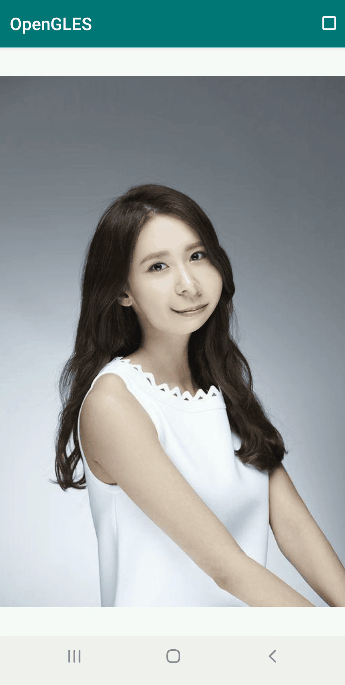

# FFmpeg 音视频和 OpenGL ES 干货汇总

有位大佬说，“这是全网最全的 Android OpenGL ES 教程”，哈哈，对于这种善意的“商业互吹”，当然是欣然接受，**这无疑给了我更多的动力和激情来完善这几个系列的文章**。

Android FFmpeg 和 OpenGL 一直作为本号的主线文章系列更新，现在回过头来看已经更新了接近 100 篇相关的原创文章，今天对其进行一次阶段性汇总，方便读者查找相关资料和学习。

字节流动的视频

，赞27

**Android FFmpeg 音视频开发系列**

**
**

字节流动的视频

，赞20

字节流动的视频

，赞26

[（01）FFmpeg 编译和集成](http://mp.weixin.qq.com/s?__biz=MzIwNTIwMzAzNg==&mid=2654162543&idx=1&sn=894a6bfb0f8f652ef53860075af1754b&chksm=8cf39d5cbb84144a9d62fa80cbeed1843aadfe97bf8a30ab02474f98ec86be649d65e301674b&scene=21#wechat_redirect)

[（02）FFmpeg + ANativeWindow 实现视频解码播放](http://mp.weixin.qq.com/s?__biz=MzIwNTIwMzAzNg==&mid=2654162564&idx=1&sn=6785c7f9b6bdccbd400f792e9389b15c&chksm=8cf39db7bb8414a14a4acdea47e866f4b19ebdf80ed5aa7663a678c9571d505ecda294b65a05&scene=21#wechat_redirect)

[（03）FFmpeg + OpenSLES 实现音频解码播放](http://mp.weixin.qq.com/s?__biz=MzIwNTIwMzAzNg==&mid=2654162604&idx=1&sn=c4e6d5a53fddcc327861cb1956285c9c&chksm=8cf39d9fbb8414898778a461b8249b698486dff85d52f0f4a86deebb711597ac685fdc99c8c3&scene=21#wechat_redirect)

[（04）FFmpeg + OpenGLES 实现音频可视化播放](http://mp.weixin.qq.com/s?__biz=MzIwNTIwMzAzNg==&mid=2654162642&idx=1&sn=d25b3204928fdea29bee287024a763a1&chksm=8cf39de1bb8414f70f98b79c201dbd53f1679bceac37109e07a1072ff32c220c07eebe93111b&scene=21#wechat_redirect)

[（05）FFmpeg + OpenGLES 实现视频解码播放和视频滤镜](http://mp.weixin.qq.com/s?__biz=MzIwNTIwMzAzNg==&mid=2654162883&idx=1&sn=40e6a50ad4ca715dbceaa3782ae2fdc1&chksm=8cf39cf0bb8415e6411b87ed6a0edad423ce2b869399b788815785ea3f0584599a0973c1cf81&scene=21#wechat_redirect)

[（06）FFmpeg 播放器实现简单音视频同步的三种方式](http://mp.weixin.qq.com/s?__biz=MzIwNTIwMzAzNg==&mid=2654163000&idx=1&sn=80b75d043ae5a71e4fe59fe982129afe&chksm=8cf3830bbb840a1d6b8093781c6d5fdbf957c5ca7246cac11d04a9607271a1b45170613b1bba&scene=21#wechat_redirect)

[（07）FFmpeg + OpenGL ES 实现 3D 全景播放器](http://mp.weixin.qq.com/s?__biz=MzIwNTIwMzAzNg==&mid=2654163056&idx=1&sn=94d3d8ae3c004207b4c019a236b9129d&chksm=8cf38343bb840a5504d0cdc05cece6dbe4ab5fa89da71e59334f418634efd218129a6c7ac3a6&scene=21#wechat_redirect)

[（08）FFmpeg 播放器视频渲染优化](http://mp.weixin.qq.com/s?__biz=MzIwNTIwMzAzNg==&mid=2654163238&idx=1&sn=3f778082ee5a278bdd05743c33247127&chksm=8cf38215bb840b03fb6de375e22521fa3db762acdc09a37f9240648845e1057ff4c65d4a5661&scene=21#wechat_redirect)

[（09）FFmpeg、x264以及fdk-aac 编译整合](http://mp.weixin.qq.com/s?__biz=MzIwNTIwMzAzNg==&mid=2654164725&idx=1&sn=f643b096b3e87b1d1cd6068f2a25825a&chksm=8cf385c6bb840cd0d151b3140079e310c888442d96fe7857decfc708aaf96c37c374f2cefd62&scene=21#wechat_redirect)

[（10）FFmpeg 视频录制 - 视频添加滤镜和编码](http://mp.weixin.qq.com/s?__biz=MzIwNTIwMzAzNg==&mid=2654164776&idx=1&sn=5e9f1307349b2ec16452c9b33cc289cb&chksm=8cf3841bbb840d0dc08a8c447c83f21fff1fe205a9096ef705795d7341862ac8308206339753&scene=21#wechat_redirect)

[（11）FFmpeg + Android AudioRecorder 音频录制编码](http://mp.weixin.qq.com/s?__biz=MzIwNTIwMzAzNg==&mid=2654164836&idx=1&sn=24d5c252a9568145734c86b10d98f9d1&chksm=8cf38457bb840d4162d025c58a11bc91b6c16efcf9e02cdc8ec1f5849139f7ed4dfcf32bf09f&scene=21#wechat_redirect)

[（12）Android FFmpeg 实现带滤镜的微信小视频录制功能](http://mp.weixin.qq.com/s?__biz=MzIwNTIwMzAzNg==&mid=2654164869&idx=1&sn=dd3dc715f31de1b750d97a0ab71c1e62&chksm=8cf384b6bb840da0332a11c8aeeccb83dad0d8bf2a665cc4ab29e3542906592bbd57d60e1e6d&scene=21#wechat_redirect)

[（13）Android FFmpeg 流媒体边播放边录制功能](http://mp.weixin.qq.com/s?__biz=MzIwNTIwMzAzNg==&mid=2654165251&idx=1&sn=a5448fe687ac42e6ab96279831aedade&chksm=8cf38a30bb8403265dad19af9953b7525333634471b389087ed898b54bb93f2b5feb0ce97860&scene=21#wechat_redirect)

[（14）学习如何使用 FFmpeg 打造自己的播放器](http://mp.weixin.qq.com/s?__biz=MzIwNTIwMzAzNg==&mid=2654171043&idx=1&sn=66bdb5db7bd1e048375c49b61d1b6696&chksm=8cf3bc90bb843586cbe1d2b9df8b043453a9903e29b04dca2258b03dd69bbba3deeb591ef963&scene=21#wechat_redirect)

[（15）Android FFmpeg + MediaCodec 实现视频硬解码](http://mp.weixin.qq.com/s?__biz=MzIwNTIwMzAzNg==&mid=2654170440&idx=1&sn=a754ec5830bbb562923691e48be5f744&chksm=8cf3be7bbb84376de561ce962111bc21044d8905583504498bc444ad422196d6b92ac21c5103&scene=21#wechat_redirect)

全景视频播放

**Android OpenGL ES 系统性学习教程**

**
**

LUT 滤镜

动态（水波纹）涟漪效果

**基础篇**

[OpenGL ES 3.0 开发（01）：绘制一个三角形](http://mp.weixin.qq.com/s?__biz=MzIwNTIwMzAzNg==&mid=2654161532&idx=1&sn=de3cc993ada0563e985407fbc0a84a3c&chksm=8cf3994fbb8410595a427efe19a6ba63269b8df96090fc1229949e85a9bfa14a5c9c0ede93ac&scene=21#wechat_redirect)

[OpenGL ES 3.0 开发（02）：纹理映射](http://mp.weixin.qq.com/s?__biz=MzIwNTIwMzAzNg==&mid=2654161543&idx=1&sn=bb69fdacc5d9e85e4dea8e87e29abd66&chksm=8cf399b4bb8410a249167518e518798a7bc29b0e9c5d1343876928ff0cf5cd794f0878c73789&scene=21#wechat_redirect)

[OpenGL ES 3.0 开发（03）：YUV 渲染](http://mp.weixin.qq.com/s?__biz=MzIwNTIwMzAzNg==&mid=2654161548&idx=1&sn=50ba9f1fe3ac66321a6e7f0f8334a371&chksm=8cf399bfbb8410a9ff44bc62af3f8d5fb7208be94f619b29c6b934a0aeff4f557f84abafcd84&scene=21#wechat_redirect)

[OpenGL ES 3.0 开发（04）：VBO、EBO 和 VAO](http://mp.weixin.qq.com/s?__biz=MzIwNTIwMzAzNg==&mid=2654161568&idx=1&sn=845783cfc2554aa5319c5ae94f8475b6&chksm=8cf39993bb8410859cd4e92349952d0cdef4c1799221e20d767d6c604513bd4ea89fa7b9a375&scene=21#wechat_redirect)

[OpenGL ES 3.0 开发（05）：FBO 离屏渲染](http://mp.weixin.qq.com/s?__biz=MzIwNTIwMzAzNg==&mid=2654161576&idx=1&sn=cafaa3f9a4cb0af7c7e1c15dfddf5286&chksm=8cf3999bbb84108d01c0050c55fdb24e8e6428e2772beba1a14f2fd844ac24f90a9175f3f59a&scene=21#wechat_redirect)

[OpenGL ES 3.0 开发（06）：EGL](http://mp.weixin.qq.com/s?__biz=MzIwNTIwMzAzNg==&mid=2654161590&idx=1&sn=6cfe6d3e4f2cfbc0934385b7751ee78e&chksm=8cf39985bb84109310c2535d1655d987d716d3047400b029f299a555e413e1f195198d43ad1e&scene=21#wechat_redirect)

[OpenGL ES 3.0 开发（07）：Transform Feedback](http://mp.weixin.qq.com/s?__biz=MzIwNTIwMzAzNg==&mid=2654161600&idx=1&sn=8a4c7f726ae8f93117e2764b0d7af5c9&chksm=8cf399f3bb8410e521d8ae418409441bdc8f47de72953e4bf849cbf5c16da3c1f802eb2dcb75&scene=21#wechat_redirect)

[OpenGL ES 3.0 开发（08）：坐标系统](http://mp.weixin.qq.com/s?__biz=MzIwNTIwMzAzNg==&mid=2654161606&idx=1&sn=8871f74ee86691226c6ec9b21b99e561&chksm=8cf399f5bb8410e3e2bba9bab1039f3cb7569b38e802db202168e63f3dafd14ba4e0bf045d20&scene=21#wechat_redirect)

[OpenGL ES 3.0 开发（09）：光照基础](http://mp.weixin.qq.com/s?__biz=MzIwNTIwMzAzNg==&mid=2654162070&idx=1&sn=4d3afaecb0e399fa8c00f42d231f5d04&chksm=8cf39fa5bb8416b35c02f7204ceafceafd45cacb66e65afd8139fafcff48bf1f10e788685cb2&scene=21#wechat_redirect)

[OpenGL ES 3.0 开发（10）：深度测试](http://mp.weixin.qq.com/s?__biz=MzIwNTIwMzAzNg==&mid=2654161619&idx=1&sn=ff5570d54e7bc7e25f03403fa3dc72f6&chksm=8cf399e0bb8410f60c37613370adb2e67a8f0dbeea273f42306e6a2f995981646208493dff4e&scene=21#wechat_redirect)

[OpenGL ES 3.0 开发（11）：模板测试](http://mp.weixin.qq.com/s?__biz=MzIwNTIwMzAzNg==&mid=2654161627&idx=1&sn=a032fdda0b5e54063b48b7153454e8d9&chksm=8cf399e8bb8410fe42c5435ba74b022370a3fb668bdf6a5253bebf9d904b3a6b9f2fdcab85a1&scene=21#wechat_redirect)

[OpenGL ES 3.0 开发（12）：混合](http://mp.weixin.qq.com/s?__biz=MzIwNTIwMzAzNg==&mid=2654161791&idx=2&sn=f2060f9d5dac62d7556bd2f32a4bacaa&chksm=8cf3984cbb84115a0c3d0afcc4a6a2eb15545826e53007b05c28a543ab2940e2a51e972a5021&scene=21#wechat_redirect)

[OpenGL ES 3.0 开发（13）：实例化（Instancing）](http://mp.weixin.qq.com/s?__biz=MzIwNTIwMzAzNg==&mid=2654161641&idx=1&sn=ba1e1c329fa0ae973b09345bc55ca9ff&chksm=8cf399dabb8410ccd5541d25b22d44eeac29abadf2526d19514628cb335c0ccf43de97f70519&scene=21#wechat_redirect)

[OpenGL ES 3.0 开发（14）：粒子（Particles）](http://mp.weixin.qq.com/s?__biz=MzIwNTIwMzAzNg==&mid=2654161646&idx=1&sn=67a8901a3aac6a899c5dbd883579f6d3&chksm=8cf399ddbb8410cbd6307e9a461123821e97c05fbd538d53f87a9a7f80ba7a26366644de8af8&scene=21#wechat_redirect)

[OpenGL ES 3.0 开发（15）：立方体贴图（天空盒）](http://mp.weixin.qq.com/s?__biz=MzIwNTIwMzAzNg==&mid=2654161660&idx=1&sn=2159cf68a705e9c9479176e2a23ba4c8&chksm=8cf399cfbb8410d9bc46134c59ac7365a09188bf79ba690f79dd1a2f1da2ac3313c614710141&scene=21#wechat_redirect)

[OpenGL ES 3.0 开发（16）：相机预览](http://mp.weixin.qq.com/s?__biz=MzIwNTIwMzAzNg==&mid=2654162060&idx=1&sn=e5e66d4d67b03752ab82aae91a04bb18&chksm=8cf39fbfbb8416a98241014d193c141ec9ec190cfc0c8fcf8d3e271cfb871601f56110bc5c57&scene=21#wechat_redirect)

[OpenGL ES 3.0 开发（17）：相机基础滤镜](http://mp.weixin.qq.com/s?__biz=MzIwNTIwMzAzNg==&mid=2654161679&idx=1&sn=52f22efb617c16fcbdd45c9c9544693a&chksm=8cf3983cbb84112ad1086457880679eb69bfb6a0688be17404f93bab554072c99be445f683e8&scene=21#wechat_redirect)

[OpenGL ES 3.0 开发（18）：相机 LUT 滤镜](http://mp.weixin.qq.com/s?__biz=MzIwNTIwMzAzNg==&mid=2654161695&idx=1&sn=44b0ab0ff07d3652f00f4d74a6df9740&chksm=8cf3982cbb84113ae5b19d5b948745fda5f8d9598eb8831cedb738487389eeeedb8b969fad0d&scene=21#wechat_redirect)

[OpenGL ES 3.0 开发（19）：相机抖音滤镜](http://mp.weixin.qq.com/s?__biz=MzIwNTIwMzAzNg==&mid=2654161710&idx=1&sn=8b2daf00f391d4403fcbbc725f21e418&chksm=8cf3981dbb84110bdfb263946ae15022a6df7967c4c7b69a9ae74ac235435af953ad11404bf7&scene=21#wechat_redirect)

[OpenGL ES 3.0 开发（20）：3D 模型](http://mp.weixin.qq.com/s?__biz=MzIwNTIwMzAzNg==&mid=2654161753&idx=2&sn=234f6a934446a94ee9cfd19d4617ee10&chksm=8cf3986abb84117c2cbbacc53798b1af4831cbb7c60a8a1428e3d4d68882e7df551e75df8844&scene=21#wechat_redirect)

[OpenGL ES 3.0 开发（21）：3D 模型加载和渲染](http://mp.weixin.qq.com/s?__biz=MzIwNTIwMzAzNg==&mid=2654161753&idx=1&sn=7aefa61e1eef873f052f483da7916f4a&chksm=8cf3986abb84117c5e90adaac5b9a9b83771fd9732da2ceb660622264c846e2843f25537dbe0&scene=21#wechat_redirect)

[OpenGL ES 3.0 开发（22）：PBO](http://mp.weixin.qq.com/s?__biz=MzIwNTIwMzAzNg==&mid=2654161764&idx=1&sn=cae0909d8ce82051d38fa0182704a25b&chksm=8cf39857bb84114183b72746c90f9bfa5408547ab464b323f793513848ee4aaac56e61e37c69&scene=21#wechat_redirect)

[OpenGL ES 3.x 开发（23）：UBO 和 TBO](http://mp.weixin.qq.com/s?__biz=MzIwNTIwMzAzNg==&mid=2654163684&idx=1&sn=b007fd0e948bc432066f6ae18f6c5003&chksm=8cf381d7bb8408c182063a3305691495fdc800e9570c8c2403757e2ff7b0166712d45ae8ff32&scene=21#wechat_redirect)

3D 阿凡达效果

**应用篇**

[利用 OpenGL ES 给视频播放器做个字符画滤镜](http://mp.weixin.qq.com/s?__biz=MzIwNTIwMzAzNg==&mid=2654164556&idx=1&sn=c78e06ccc19d5bf4938e63538cec5c13&chksm=8cf3857fbb840c69482d4cc9b5792ae406e3495b8b201f2e1d8899358ea3b077af7310e9e603&scene=21#wechat_redirect)

[OpenGL ES 实现动态（水波纹）涟漪效果](http://mp.weixin.qq.com/s?__biz=MzIwNTIwMzAzNg==&mid=2654162412&idx=1&sn=4eecb70bccc48d7d3184e4f2aa08296c&chksm=8cf39edfbb8417c978d8fe0f911b3f16074d5cd425027f9e01d11463b8f9c333fc3276c9ea6a&scene=21#wechat_redirect)

[OpenGL ES 实现 3D 阿凡达效果](http://mp.weixin.qq.com/s?__biz=MzIwNTIwMzAzNg==&mid=2654162358&idx=1&sn=879cf64ed80c3fcf41613b65a878b1f7&chksm=8cf39e85bb841793e93e03a6ce935155534bb6589e781ab39ce6c922ea43c450b473e273da9a&scene=21#wechat_redirect)

[OpenGL ES 实现刮刮卡和手写板功能](http://mp.weixin.qq.com/s?__biz=MzIwNTIwMzAzNg==&mid=2654162224&idx=1&sn=bd45be419bef3ac5ba16cdf1d8fc65c4&chksm=8cf39e03bb841715446db0a04f433ce7379786d7202e69a34ad56e5af0579540001cb733cdc0&scene=21#wechat_redirect)

[OpenGL ES 实现实时音频的可视化](http://mp.weixin.qq.com/s?__biz=MzIwNTIwMzAzNg==&mid=2654162045&idx=1&sn=251e7d6432198d470e5c67cdb17c34a5&chksm=8cf39f4ebb841658888a4f37f699040fa9a2a5a63717c33f9b4b8513c30c37c32babfd36408a&scene=21#wechat_redirect)

[OpenGL ES 实现大小头和头部晃动效果](http://mp.weixin.qq.com/s?__biz=MzIwNTIwMzAzNg==&mid=2654161784&idx=1&sn=e603a953f60d3f48207be1258a88cd25&chksm=8cf3984bbb84115d4021eeac4179d12f2727d07a7d32b3e6ce70b33c4f749cf907a111e7f072&scene=21#wechat_redirect) 

[OpenGL ES 实现瘦脸大眼效果](http://mp.weixin.qq.com/s?__biz=MzIwNTIwMzAzNg==&mid=2654161784&idx=1&sn=e603a953f60d3f48207be1258a88cd25&chksm=8cf3984bbb84115d4021eeac4179d12f2727d07a7d32b3e6ce70b33c4f749cf907a111e7f072&scene=21#wechat_redirect) 

[OpenGL ES 绘制贝塞尔曲线](http://mp.weixin.qq.com/s?__biz=MzIwNTIwMzAzNg==&mid=2654161791&idx=1&sn=a38152bd80b2cf4e06bda3e64355144c&chksm=8cf3984cbb84115aa351d25df1e92e81b427d1a942189bcd7e236717933f48d75508386caad1&scene=21#wechat_redirect)

[OpenGL ES 实现瘦身大长腿效果](http://mp.weixin.qq.com/s?__biz=MzIwNTIwMzAzNg==&mid=2654161784&idx=1&sn=e603a953f60d3f48207be1258a88cd25&chksm=8cf3984bbb84115d4021eeac4179d12f2727d07a7d32b3e6ce70b33c4f749cf907a111e7f072&scene=21#wechat_redirect)

[OpenGL ES 实现“心动”特效](http://mp.weixin.qq.com/s?__biz=MzIwNTIwMzAzNg==&mid=2654161771&idx=1&sn=688fde685214f7c0bc4a3a7a6fd90e8b&chksm=8cf39858bb84114eee7f6186e0a3c62e1941194a60596b9ec33b08463645510da0fa7b921ca4&scene=21#wechat_redirect)

[推荐一款强大的 Android OpenGL ES 调试工具](http://mp.weixin.qq.com/s?__biz=MzIwNTIwMzAzNg==&mid=2654162453&idx=1&sn=7274e83b3c22a81c644f2309f7797454&chksm=8cf39d26bb841430fd33667f778cacdc9cb99c9c14ec2a16e3eb2e329dc59244abec85498a99&scene=21#wechat_redirect)

[OpenGL ES 渲染图像读取哪家强？](http://mp.weixin.qq.com/s?__biz=MzIwNTIwMzAzNg==&mid=2654163537&idx=1&sn=138b831324bfb09cdcdb4b08b8fa9db1&chksm=8cf38162bb84087429aee66be6b6441020eed1dbaa016122ac3f4a3e6816010012e5c3481ed5&scene=21#wechat_redirect)

[OpenGL ES 如何传输一个超大数组给着色器程序？](http://mp.weixin.qq.com/s?__biz=MzIwNTIwMzAzNg==&mid=2654163684&idx=1&sn=b007fd0e948bc432066f6ae18f6c5003&chksm=8cf381d7bb8408c182063a3305691495fdc800e9570c8c2403757e2ff7b0166712d45ae8ff32&scene=21#wechat_redirect)

[面试中经常被问到的 OpenGL ES 对象，你知道的有哪些？](http://mp.weixin.qq.com/s?__biz=MzIwNTIwMzAzNg==&mid=2654164074&idx=1&sn=8017dd8975ec6f1a8e6b49c864fb2282&chksm=8cf38759bb840e4f2b4a9590c5ca4f1b57e20ea75daec3deceb6e0fd9ef049d6f2db36b420f0&scene=21#wechat_redirect)

[所有你想要的图片转场效果，都在这了](http://mp.weixin.qq.com/s?__biz=MzIwNTIwMzAzNg==&mid=2654167306&idx=1&sn=210e65fde6df9c59652fd0c000de16b2&chksm=8cf3b239bb843b2f7aa2a02905b2078ef5f7b873a31c5fe3a55227cee51ac4d16c7b66a66de2&scene=21#wechat_redirect)

[抖音“蓝线挑战”特效是怎么实现的](http://mp.weixin.qq.com/s?__biz=MzIwNTIwMzAzNg==&mid=2654168662&idx=1&sn=27dc11c3c50030ed7052cace46f1e699&chksm=8cf3b565bb843c736fe06007befa489c30b92a4e4264298a1d105b62306300793e817bba2867&scene=21#wechat_redirect)

[利用 Shader 实现 RGBA 到 NV21 图像格式转换？](http://mp.weixin.qq.com/s?__biz=MzIwNTIwMzAzNg==&mid=2654169174&idx=1&sn=64b2ebab3bab20c2891ce6265bca668f&chksm=8cf3bb65bb84327317a633990301e9b93b3b7c6ee5133fc3effaa720ab28570faee3a3da3284&scene=21#wechat_redirect)

[使用 OpenGL ES 将 RGB 图像转换为 YUV 格式](http://mp.weixin.qq.com/s?__biz=MzIwNTIwMzAzNg==&mid=2654165564&idx=1&sn=5e9fedeb486014216fb4539904a85ab8&chksm=8cf3890fbb840019bf57b162aee60c947598bf4610bf52484249875942f7d8294b490d410b6e&scene=21#wechat_redirect)

[OpenGL ES 高级进阶：EGL 及 GL 线程](http://mp.weixin.qq.com/s?__biz=MzIwNTIwMzAzNg==&mid=2654169605&idx=2&sn=0e5d309fbfa13cc541f8d46cf9a78321&chksm=8cf3b936bb843020c84d0cc7f2c5da3fed9ac774fddd69f380ddbd9557b13c326f02442dcc59&scene=21#wechat_redirect)

[OpenGL ES 高级进阶：FenceSync](http://mp.weixin.qq.com/s?__biz=MzIwNTIwMzAzNg==&mid=2654169587&idx=1&sn=107a0ff427ca15957294358e0456c823&chksm=8cf3bac0bb8433d6b37be38a98e9220c9b5d68ce005b13dc8d7892da43c64f86ea998f6ec7d3&scene=21#wechat_redirect)

[OpenGL ES 文字渲染方式有几种？](http://mp.weixin.qq.com/s?__biz=MzIwNTIwMzAzNg==&mid=2654166002&idx=1&sn=07cebb0ff4d0282b9eff20cd0d975e4e&chksm=8cf388c1bb8401d775d19746f0d8b254b3eec334868c058935ea9ab44adb2f5142496ec73511&scene=21#wechat_redirect)

[OpenGL ES 文字渲染进阶--渲染中文字体](http://mp.weixin.qq.com/s?__biz=MzIwNTIwMzAzNg==&mid=2654166473&idx=1&sn=90846d3715d5912c646c38007b9f0609&chksm=8cf38efabb8407ecb893c834c06763637dc80a68231f400fc17d2b2545ca775aa54e0e1f523f&scene=21#wechat_redirect)

[OpenGL ES 共享上下文实现多线程渲染](http://mp.weixin.qq.com/s?__biz=MzIwNTIwMzAzNg==&mid=2654165674&idx=1&sn=5ad986771f5364b016ac45ccd301e740&chksm=8cf38999bb84008fc390bbfdc6201a99f9c0a785aec6d079a96d92ee6fdc5effb4a784559792&scene=21#wechat_redirect)

[抖音传送带特效是怎么实现的？](http://mp.weixin.qq.com/s?__biz=MzIwNTIwMzAzNg==&mid=2654167625&idx=1&sn=1af1e10be773c1e4c3f6af2edd6c27e5&chksm=8cf3b17abb84386ca1faa62b5421fc757f4934093101f5218c97dd5bb641676a342d57212cd7&scene=21#wechat_redirect)

字节流动的视频

，赞26

字节流动的视频

，赞12

最后的话：**学习音视频，你不是一个人在战斗**，我建了几个音视频相关的技术交流群，里面聚集了**商汤、字节、小米、OV** 等大厂的大佬，一起学习、交流、进步。**还没进群的同学，扫描下方二维码拉你进群。**

-- END --