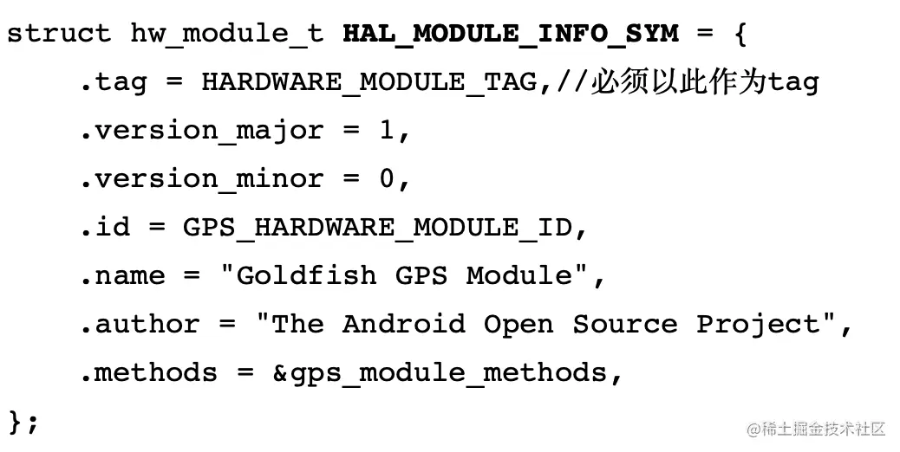
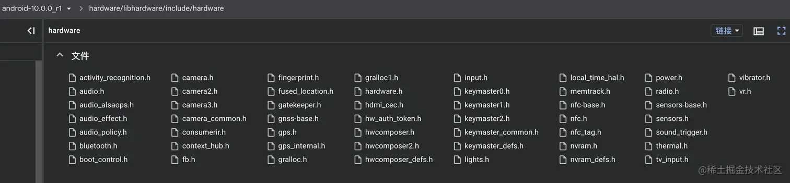

# 解读 GraphicBuffer 之 HAL 层

文章主要解读了 Android 中 GraphicBuffer 在 HAL 层的相关内容，包括 HAL 层基础知识、接口抽象及实现，如直通模式和 HIDL 绑定模式，详细介绍了其注册流程和相关函数实现，还探讨了 AllocatorHal 的实现，以及 GraphicBuffer 内存分配过程中涉及的各类函数和对象，最终通过驱动层进行内存分配。

关联问题:HAL层有哪些优势？HAL服务如何优化？HAL接口怎样扩展？

# 

https://juejin.cn/post/7026351143714308132

# 一 前言

相比于 Framework 层，大多数人对于 HAL 层可能会有一些陌生，所以在介绍 GraphicBuffer 在 HAL 层创建之前，我们先简单介绍一下 HAL 层的基础知识。

对于 Android 的系统来说，HAL都是必不可少的组成部分，它负责了 Android 的一些子系统与 Linux Kernel 驱动之间通信的统一接口。**对于不同的硬件厂商，Android 需要提供一个统一的接口，方便他们实现，同时也需要一套统一的接口，供给上层的开发者调用**，HAL 做的就是这些事情

## 1.1 接口抽象

因为 HAL 需要提供统一的接口，所以需要对于不同的硬件提炼出通用的接口。然后再通过面对对象的设计方式，通过继承实现。

因为 HAL 是通过 C 语言实现的，所以**为了实现面向对象的设计方式，对于 HAL 的结构体，子类的第一个对象就是它的父类**，对于 HAL 子类的定义，Android 系统有两个要求

1. **所有的硬件模块必须有一个 HAL_MODULE_INFO_SYM 变量，这个变量就是这个模块的名字**
2. **所有的模块都必须继承自 hw_module_t，也就是说所有的 HAL 模块的结构体的第一个对象必须是 hw_module_t 结构体**

hw_module_t 结构体定义如下：



HAL 的各类硬件接口统一放在`hardware/libhardware/include/hardware`目录下



而它们的默认实现，大多数都在命名为 default 的包下

## 1.2 HAL 接口的实现

再说回 GraphicBuffer，对于 `IAllocator.hal` 接口的默认实现，目录在

```bash
bash

代码解读
复制代码hardware/interfaces/graphics/allocator/2.0/default/
```

这个目录里提供了两种的实现方式：

- `passthrough.cpp`是老版的实现方式翻译为直通模式，在 Android 8.0 之前使用
- `service.cpp`是新版的实现方式，翻译为绑定模式，即类似于 AIDL 的 HIDL 模式。

这是虽然提供了两种实现方式，但是它们最后使用的其实是同一套逻辑。因为 HIDL 模式其实也使用了部分的直通模式的逻辑，所以我们首先来看直通模式。

## 1.3直通模式

直通模式的实现类是 `passthrough.cpp`，代码如下，这里只有一个函数，它调用了 `GrallocLoader::load()`

```cpp
cpp代码解读复制代码[hardware/interfaces/graphics/allocator/2.0/default/passthrough.cpp]

#include <allocator-passthrough/2.0/GrallocLoader.h>
#include <android/hardware/graphics/allocator/2.0/IAllocator.h>

using android::hardware::graphics::allocator::V2_0::IAllocator;
using android::hardware::graphics::allocator::V2_0::passthrough::GrallocLoader;

extern "C" IAllocator* HIDL_FETCH_IAllocator(const char* /* name */) {
	// 加载 HAL 模块，返回操作用的 IAllocator 对象
    return GrallocLoader::load();
}
```

通过导入的路径可以知道，GrallocLoader 的具体路径是 `allocator-passthrough/2.0/GrallocLoader.h`，所以我们直接去看具体的定义和实现

### 1.3.1 GrallocLoader::load

```c
c代码解读复制代码[hardware/interfaces/graphics/allocator/2.0/utils/passthrough/include/allocator-passthrough/2.0/GrallocLoader.h]

class GrallocLoader {
   public:
    // 直通模式调用的 load，它用来加载了一个系统模块
    static IAllocator* load() {
	// 1. 首先是 loadModule，加载系统硬件模块，返回的是一个 hw_module_t 结构体
        const hw_module_t* module = loadModule();
        if (!module) {
            return nullptr;
        }

	// 2. 通过 hw_module_t 创建对应的 HAL 对象
        auto hal = createHal(module);
        if (!hal) {
            return nullptr;
        }

	// 3. 通过 HAL 对象创建对应的 Allocator
        return createAllocator(std::move(hal));
    }

    // 加载系统模块
    static const hw_module_t* loadModule() {
	// 先构建一个 hw_module_t 结构体
        const hw_module_t* module;
	// GRALLOC_HARDWARE_MODULE_ID 是要加载的模块的ID，传入需要保存数据的结构体
        int error = hw_get_module(GRALLOC_HARDWARE_MODULE_ID, &module);
        if (error) {
            return nullptr;
        }

        return module;
    }

    // 获取 hw_module_t 的版本
    static int getModuleMajorApiVersion(const hw_module_t* module) {
        return (module->module_api_version >> 8) & 0xff;
    }

    // 根据 hw_module_t 结构体，创建对应的 AllocatorHal 对象
    // 其实就是根据 module 的版本号返回对应的 Gralloc1Hal 还是 Gralloc0Hal
    static std::unique_ptr<hal::AllocatorHal> createHal(const hw_module_t* module) {
        int major = getModuleMajorApiVersion(module);
        switch (major) {
            case 1: {
                auto hal = std::make_unique<Gralloc1Hal>();
                return hal->initWithModule(module) ? std::move(hal) : nullptr;
            }
            case 0: {
                auto hal = std::make_unique<Gralloc0Hal>();
                return hal->initWithModule(module) ? std::move(hal) : nullptr;
            }
            default:
                ALOGE("unknown gralloc module major version %d", major);
                return nullptr;
        }
    }

    // 根据传入的 hal::AllocatorHal 创建对应的 IAllocator
    // IAllocator 其实就是 detail::AllocatorImpl，定义如下
    static IAllocator* createAllocator(std::unique_ptr<hal::AllocatorHal> hal) {
        auto allocator = std::make_unique<hal::Allocator>();
	// 初始化 IAllocator，然后返回 IAllocator 并释放它的管理权
	// 真正返回的其实是 :AllocatorImpl
        return allocator->init(std::move(hal)) ? allocator.release() : nullptr;
    }
};
```

在 load 函数的第一行，就看到了 hw_module_t 这个结构体，在[1.1]中我们已经说了，这是一个系统硬件的结构体，所以大致看 load 函数，它分为三个步骤

1. 加载一个系统硬件模块
2. 通过这个系统硬件模块创建对应的 HAL 对象
3. 通过 HAL 对象创建对应的 Allocator，也就是在上一篇中我们看到的调用 HAL 层的接口对象

------

在加载系统模块的时候，传入了两个参数

1. GRALLOC_HARDWARE_MODULE_ID，这就是这个系统模块的名字，它是字符串"gralloc"
2. 用于保存结果字段的结构体 hw_module_t

------

在创建 HAL 对象的时候，

1. 会首先判断对应的版本号，然后根据不同的版本号，返回 Gralloc1Hal 或者 Gralloc0Hal，
2. 然后调用 initWithModule 函数。

------

最后就是创建 IAllocator 对象

1. 首先创建 hal::Allocator 对象
2. 调用 hal::Allocator 对象的 init 函数

------

### 1.3.2 IAllocator 的定义

```c
c代码解读复制代码[hardware/interfaces/graphics/allocator/2.0/utils/hal/include/allocator-hal/2.0/Allocator.h]
using Allocator = detail::AllocatorImpl<IAllocator, AllocatorHal>;
```

## 1.4 HIDL 的绑定模式

HIDL 的绑定模式也只有一个函数，就是调用 defaultPassthroughServiceImplementation，传递的参数是4，对应的泛型就是 IAllocator，也是之前直通模式最后创建的对象。

```cpp
cpp代码解读复制代码#include <android/hardware/graphics/allocator/2.0/IAllocator.h>

#include <hidl/LegacySupport.h>

using android::hardware::defaultPassthroughServiceImplementation;
using android::hardware::graphics::allocator::V2_0::IAllocator;

int main() {
    return defaultPassthroughServiceImplementation<IAllocator>(4);
}
```

### 1.4.1 HAL 服务的注册过程

HAL 服务的注册过程和 Framework 层的系统服务注册流程很相似。这里的注册函数是一个模板函数，从`main`函数传递过来的参数是 IAllocator，就是在直通模式中创建的对象。

```c
c代码解读复制代码[system/libhidl/transport/include/hidl/LegacySupport.h]
template <class Interface>
__attribute__((warn_unused_result)) status_t defaultPassthroughServiceImplementation(
    const std::string& name, size_t maxThreads = 1) {

    // 设置 Rpc 线程池参数
    configureRpcThreadpool(maxThreads, true);

    // 注册 HIDL 服务
    status_t result = registerPassthroughServiceImplementation<Interface>(name);

    if (result != OK) {
        return result;
    }

    // 将 HIDL 服务加入 RPC 线程池
    joinRpcThreadpool();
    return UNKNOWN_ERROR;
}
```

### 1.4.2 registerPassthroughServiceImplementation

registerPassthroughServiceImplementation 其实就是注册系统服务，如果了解 Framework 层系统服务的注册流程，那么这里就很容易理解了。

```c
c代码解读复制代码[system/libhidl/transport/include/hidl/LegacySupport.h]

template <class Interface>
__attribute__((warn_unused_result)) status_t registerPassthroughServiceImplementation(
    const std::string& name = "default") {

    // 调用 details 的 registerPassthroughServiceImplementation
    // 传入了两个参数，一个是 回调函数，一个是服务名
    return details::registerPassthroughServiceImplementation<Interface>(

	// 参数1：回调函数
        [](const sp<Interface>& service, const std::string& name) {
	    // 注册 Service
            return service->registerAsService(name);
        },
	// 参数2：服务名
        name);
}
```

上面调用了 registerPassthroughServiceImplementation 这个函数，接着来看 details::registerPassthroughServiceImplementation 函数的具体实现

```c
c代码解读复制代码[system/libhidl/transport/include/hidl/LegacySupport.h]

template <class Interface, typename Func>
__attribute__((warn_unused_result)) status_t registerPassthroughServiceImplementation(
    Func registerServiceCb, const std::string& name = "default") {
    // 通过服务名获取服务接口
    sp<Interface> service = Interface::getService(name, true /* getStub */);

    if (service == nullptr) {
        return EXIT_FAILURE;
    }

    // 调用传入的回调函数
    // 其实就是上面传入的 service->registerAsService(name)
    status_t status = registerServiceCb(service, name);

    return status;
}
```

这里的`registerPassthroughServiceImplementation`和`registerPassthroughServiceImplementation`的都是模板函数。

还记得[1.4]中的`main`函数吗。Interface 就是最开始从`main`函数传递过来的 IAllocator。所以它其实就是调用 IAllocator 的 getService。这个 IAllocator 其实就是`android/hardware/graphics/allocator/2.0/IAllocator.h`

这个函数看不到具体的实现，然后调用的`registerServiceCb`是之前传递进来的回调函数，将通过`getService`拿到的 service 和 name 传递进去

再来回顾一下之前传递进来的回调函数

```cpp
cpp代码解读复制代码// 参数1：回调函数
[](const sp<Interface>& service, const std::string& name) {
    // 注册 Service
    return service->registerAsService(name);
},
```

通过 registerAsService 将 Service 注册为一个服务，这样其他的进程就可以通过 HAL 层的接口获取到对应的 HAL 服务。这里的 Service 注册流程和 Framework 层的系统服务注册流程很像，可以参考着看。

# 二 AllocatorHal的实现

了解了 HAL 的两种注册模式之后，再来看看它们具体的实现。虽然 HAL 的实现模式有两种，但是它们最后其实都是创建的 AllocatorHal 对象（见[1.3.1]中），而它的实现有两个版本 Gralloc1Hal 和 Gralloc0Hal.

AllocatorHal 的创建分为两步

1. 创建对应版本的
2. 调用 initWithModule 函数

在 `Gralloc1Hal.h` 中有

```c
c

代码解读
复制代码using Gralloc1Hal = detail::Gralloc1HalImpl<hal::AllocatorHal>
```

所以直接看`Gralloc1HalImpl`即可。

## 2.1 Gralloc1HalImpl

因为 Gralloc1HalImpl 没有定义构造函数，所以直接看初始化函数，这个初始化函数中的工作如下

1. gralloc1_open：打开graphic设备
2. initCapabilities
3. initDispatch

```c
c代码解读复制代码bool initWithModule(const hw_module_t* module) {
    // 1. 打开graphic设备[2.1.1]
    int result = gralloc1_open(module, &mDevice);
    if (result) {
        ALOGE("failed to open gralloc1 device: %s", strerror(-result));
        mDevice = nullptr;
        return false;
    }

    // 2. initCapabilities[2.1.3]
    initCapabilities();
    
    // 3. initDispatch
    if (!initDispatch()) {
        gralloc1_close(mDevice);
        mDevice = nullptr;
        return false;
    }

    return true;
}
```

### 2.1.1 gralloc1_open

gralloc1_open 是定义在 gralloc1.h 中的函数。它的作用就是通过传入的结构体 hw_module_t 打开 gralloc 模块，hw_module_t 就是硬件层在 HAL 层的抽象。

```c
c代码解读复制代码static inline int gralloc1_open(const struct hw_module_t* module,
        gralloc1_device_t** device) {
    return module->methods->open(module, GRALLOC_HARDWARE_MODULE_ID,
            TO_HW_DEVICE_T_OPEN(device));
}
```

这里的 device 在传递进去的时候，会经过一个脚本转换成 hw_device_t

```C
C代码解读复制代码[hardware/libhardware/include/hardware/hardware.h]
#ifdef __cplusplus
#define TO_HW_DEVICE_T_OPEN(x) reinterpret_cast<struct hw_device_t**>(x)
#else
#define TO_HW_DEVICE_T_OPEN(x) (struct hw_device_t**)(x)
#endif
```

hw_module_t 中有一个的 methods 结构体，它是一个 hw_module_methods_t 结构体，这个结构体中只有一个函数指针，就是 open，用于打开硬件设备。

```c
c代码解读复制代码[hardware/libhardware/include/hardware/hardware.h]
typedef struct hw_module_methods_t {
    /** Open a specific device */
    // 结构体中的 open 函数
    int (*open)(const struct hw_module_t* module, const char* id,
            struct hw_device_t** device);

} hw_module_methods_t;
```

所以 gralloc1_open 最终的作用，就是使用硬件层提供的抽象结构体中的 open 方法，打开对应的硬件设备，然后将返回值保存到对应的结构体 hw_device_t 的指针 device 中。

### 2.1.2 gralloc1_device

对应硬件设备支持的函数指针

```c
c代码解读复制代码typedef struct gralloc1_device {
    // gralloc1_device 结构体其实就是 hw_module_t 结构体，
    // hw_module_t 结构体定义必须以 hw_device_t 作为结构体的第一个元素
    struct hw_device_t common;

    void (*getCapabilities)(struct gralloc1_device* device, uint32_t* outCount,
            int32_t* /*gralloc1_capability_t*/ outCapabilities);


    gralloc1_function_pointer_t (*getFunction)(struct gralloc1_device* device,
            int32_t /*gralloc1_function_descriptor_t*/ descriptor);
} gralloc1_device_t;
```

### 2.1.3 initCapabilities

初始化能力，根据上面的 open 函数会获取到设备的抽象指针和对应的描述信息 mDevice，然后在 initCapabilities 函数中，就会把 mDevice 中的描述信息读取出来放到capabilities中，这样就知道了这个设备支持的功能。

```c
c代码解读复制代码protected:
virtual void initCapabilities() {
    // 首先获取硬件设备支持的函数的数量
    uint32_t count = 0;
    mDevice->getCapabilities(mDevice, &count, nullptr);

    // 第二次才会创建出对应的集合，获取到对应的函数列表
    // 分配内存这类功能，就是通过硬件设备的函数实现的，这类函数就在这个函数列表中
    std::vector<int32_t> capabilities(count);
    mDevice->getCapabilities(mDevice, &count, capabilities.data());
    capabilities.resize(count);

    for (auto capability : capabilities) {
        if (capability == GRALLOC1_CAPABILITY_LAYERED_BUFFERS) {
            mCapabilities.layeredBuffers = true;
            break;
        }
    }
}
```

### 2.1.4 initDispatch

最后就是 initDispatch，它会将 Gralloc1HalImpl 中的函数与对应的硬件的函数相关联，这样当调用到 HAL 层的函数时，它就会通过关联的关系，找到对应硬件层的函数并调用。

```c
c代码解读复制代码virtual bool initDispatch() {
    if (!initDispatch(GRALLOC1_FUNCTION_DUMP, &mDispatch.dump) ||
        !initDispatch(GRALLOC1_FUNCTION_CREATE_DESCRIPTOR, &mDispatch.createDescriptor) ||
        !initDispatch(GRALLOC1_FUNCTION_DESTROY_DESCRIPTOR, &mDispatch.destroyDescriptor) ||
        !initDispatch(GRALLOC1_FUNCTION_SET_DIMENSIONS, &mDispatch.setDimensions) ||
        !initDispatch(GRALLOC1_FUNCTION_SET_FORMAT, &mDispatch.setFormat) ||
        !initDispatch(GRALLOC1_FUNCTION_SET_CONSUMER_USAGE, &mDispatch.setConsumerUsage) ||
        !initDispatch(GRALLOC1_FUNCTION_SET_PRODUCER_USAGE, &mDispatch.setProducerUsage) ||
        !initDispatch(GRALLOC1_FUNCTION_GET_STRIDE, &mDispatch.getStride) ||
        !initDispatch(GRALLOC1_FUNCTION_ALLOCATE, &mDispatch.allocate) ||
        !initDispatch(GRALLOC1_FUNCTION_RELEASE, &mDispatch.release)) {
        return false;
    }

    if (mCapabilities.layeredBuffers) {
        if (!initDispatch(GRALLOC1_FUNCTION_SET_LAYER_COUNT, &mDispatch.setLayerCount)) {
            return false;
        }
    }

    return true;
}
```

真正的 initDispatch 就是一个模板函数，通过传入的 gralloc1_function_descriptor_t，取到对应硬件设备中的函数指针，这样就能调用对应硬件设备的功能了。

```c
c代码解读复制代码template <typename T>
bool initDispatch(gralloc1_function_descriptor_t desc, T* outPfn) {
    auto pfn = mDevice->getFunction(mDevice, desc);
    if (pfn) {
        *outPfn = reinterpret_cast<T>(pfn);
        return true;
    } else {
        ALOGE("failed to get gralloc1 function %d", desc);
        return false;
    }
}
```

在了解了上述 HAL 层和硬件层相关的知识之后，接着来看我们之前说到的 GraphicBuffer 的内存分配过程，之前我们通过 HAL 相关服务的函数调用到了 HAL 层的 allocate，根据上述的逻辑，它其实会调用到硬件层的 allocate 函数。

# 三 allocate

它的 GetFunction 函数会将 HAL 层的函数映射到自己的函数，我们能看到 GraphicBuffer 内存分配的函数 GRALLOC1_FUNCTION_ALLOCATE 被映射成了 AllocateBuffers 函数

```c
c代码解读复制代码[hardware/qcom/display/msm8909/gralloc/gr_device_impl.cpp]
gralloc1_function_pointer_t GrallocImpl::GetFunction(gralloc1_device_t *device, int32_t function) {
  if (!device) {
    return NULL;
  }

  switch (function) {

    case GRALLOC1_FUNCTION_ALLOCATE:
      return reinterpret_cast<gralloc1_function_pointer_t>(AllocateBuffers);

      ...

}
```

所以 GraphicBuffer 的内存分配，最终就是调用到了硬件厂商中的 AllocateBuffers 函数，我们这里看的是高通的实现。我们要看的具体实现目录在`hardware/qcom/display/msm8909/gralloc/`下。

## 3.1 gr_device_impl

首先是`gr_device_impl.cpp`这个类，它是 HAL 调用到硬件层的主要入口。

```cpp
cpp代码解读复制代码[hardware/qcom/display/msm8909/gralloc/gr_device_impl.cpp]

gralloc1_error_t GrallocImpl::AllocateBuffers(gralloc1_device_t *device, uint32_t num_descriptors,
                                              const gralloc1_buffer_descriptor_t *descriptors,
                                              buffer_handle_t *out_buffers) {
  if (!num_descriptors || !descriptors) {
    return GRALLOC1_ERROR_BAD_DESCRIPTOR;
  }

  if (!device) {
    return GRALLOC1_ERROR_BAD_VALUE;
  }

  // 将外面传递进来的 gralloc1_device_t 结构体转换成 GrallocImpl
  GrallocImpl const *dev = GRALLOC_IMPL(device);

  // 拿到 GrallocImpl 中的 buf_mgr_，然后调用它的 AllocateBuffers 函数
  gralloc1_error_t status = dev->buf_mgr_->AllocateBuffers(num_descriptors, descriptors,
                                                           out_buffers);

  return status;
}
```

首先，会将传递进来的 gralloc1_device_t 转换为 GrallocImpl，然后拿到 GrallocImpl 中的 buf_mgr_ 成员变量，并调用它的 AllocateBuffers 来进行分配内存。

buf_mgr_ 的定义如下，它是一个 BufferManager，BufferManager 的头文件是`gr_buf_mgr.h`，具体实现在`gr_buf_mgr.cpp`。

```c
c代码解读复制代码[hardware/qcom/display/msm8909/gralloc/gr_device_impl.h]
class GrallocImpl : public gralloc1_device_t {
  BufferManager *buf_mgr_ = NULL;
}
```

## 3.2 gr_buf_mgr

```cpp
cpp代码解读复制代码[hardware/qcom/display/msm8909/gralloc/gr_buf_mgr.h]
class BufferManager {
 public:
  ~BufferManager();
  gralloc1_error_t CreateBufferDescriptor(gralloc1_buffer_descriptor_t *descriptor_id);
  gralloc1_error_t DestroyBufferDescriptor(gralloc1_buffer_descriptor_t descriptor_id);
  gralloc1_error_t AllocateBuffers(uint32_t num_descriptors,
                                   const gralloc1_buffer_descriptor_t *descriptor_ids,
                                   buffer_handle_t *out_buffers);
  gralloc1_error_t RetainBuffer(private_handle_t const *hnd);
  gralloc1_error_t ReleaseBuffer(private_handle_t const *hnd);
  gralloc1_error_t LockBuffer(const private_handle_t *hnd, gralloc1_producer_usage_t prod_usage,
                              gralloc1_consumer_usage_t cons_usage);
  gralloc1_error_t UnlockBuffer(const private_handle_t *hnd);
  gralloc1_error_t Perform(int operation, va_list args);
  gralloc1_error_t GetFlexLayout(const private_handle_t *hnd, struct android_flex_layout *layout);
  gralloc1_error_t GetNumFlexPlanes(const private_handle_t *hnd, uint32_t *out_num_planes);
  gralloc1_error_t Dump(std::ostringstream *os);

  ...

  gralloc1_error_t FreeBuffer(std::shared_ptr<Buffer> buf);


  std::shared_ptr<Buffer> GetBufferFromHandleLocked(const private_handle_t *hnd);

  // 真正用于内存分配的对象
  Allocator *allocator_ = NULL;
  ...
};
```

### 3.2.1 BufferManager::AllocateBuffer

在 BufferManager 中又经过了一次传递，调用了 allocator_ 的 AllocateMem 进行分配内存，这个 allocator_ 是定义在头文件中的 Allocator 对象。

```cpp
cpp代码解读复制代码[hardware/qcom/display/msm8909/gralloc/gr_buf_mgr.cpp]
int BufferManager::AllocateBuffer(const BufferDescriptor &descriptor, buffer_handle_t *handle,
                                  unsigned int bufferSize) {
  if (!handle)
    return -EINVAL;

  // 先通过 descriptor 描述文件获取具体的参数
  int format = descriptor.GetFormat();
  gralloc1_producer_usage_t prod_usage = descriptor.GetProducerUsage();
  gralloc1_consumer_usage_t cons_usage = descriptor.GetConsumerUsage();
  uint32_t layer_count = descriptor.GetLayerCount();

  // 通过参数获取 gralloc_format
  int gralloc_format = allocator_->GetImplDefinedFormat(prod_usage, cons_usage, format);

  ...

  // 分配缓冲区内存
  err = allocator_->AllocateMem(&data, prod_usage, cons_usage);
  if (err) {
    return err;
  }

  // 为元数据分配内存
  AllocData e_data;
  e_data.size = ALIGN(UINT(sizeof(MetaData_t)), page_size);
  e_data.handle = data.handle;
  e_data.align = page_size;

  err =
      allocator_->AllocateMem(&e_data, GRALLOC1_PRODUCER_USAGE_NONE, GRALLOC1_CONSUMER_USAGE_NONE);
  if (err) {
    return err;
  }

  ...
  
  return err;
}
```

## 3.3 gr_allocator

### 3.3.1 Allocator的定义

Allocator的头文件定义如下，它里面有一个 IonAlloc 类型的 ion_allocator_ 成员变量，这个成员变量就是真正用于分配内存的。

```c
c代码解读复制代码class Allocator {
 public:
  Allocator();
  ~Allocator();
  bool Init();
  int MapBuffer(void **base, unsigned int size, unsigned int offset, int fd);
  int ImportBuffer(int fd);
  int FreeBuffer(void *base, unsigned int size, unsigned int offset, int fd, int handle);
  int CleanBuffer(void *base, unsigned int size, unsigned int offset, int handle, int op);
  int AllocateMem(AllocData *data, gralloc1_producer_usage_t prod_usage,
                  gralloc1_consumer_usage_t cons_usage);
                  
  // @return : index of the descriptor with maximum buffer size req
  bool CheckForBufferSharing(uint32_t num_descriptors,
                             const std::vector<std::shared_ptr<BufferDescriptor>>& descriptors,
                             ssize_t *max_index);
  int GetImplDefinedFormat(gralloc1_producer_usage_t prod_usage,
                           gralloc1_consumer_usage_t cons_usage, int format);
  bool UseUncached(gralloc1_producer_usage_t prod_usage, gralloc1_consumer_usage_t cons_usage);

 private:
  void GetIonHeapInfo(gralloc1_producer_usage_t prod_usage, gralloc1_consumer_usage_t cons_usage,
                      unsigned int *ion_heap_id, unsigned int *alloc_type, unsigned int *ion_flags);

  // 真正执行内存分配的对象
  IonAlloc *ion_allocator_ = NULL;
};
```

### 3.3.2 Allocator::AllocateMem

首先我们来看一下分配内存的实现 Allocator::AllocateMem，它就是调用了 ion_allocator_ 的 AllocBuffer。ion_allocator_ 定义在文件 gr_ion_alloc.h 中

```cpp
cpp代码解读复制代码int Allocator::AllocateMem(AllocData *alloc_data, gralloc1_producer_usage_t prod_usage,
                           gralloc1_consumer_usage_t cons_usage) {
  ...

  ret = ion_allocator_->AllocBuffer(alloc_data);
  
  if (ret >= 0) {
    alloc_data->alloc_type |= private_handle_t::PRIV_FLAGS_USES_ION;
  } else {
    ALOGE("%s: Failed to allocate buffer - heap: 0x%x flags: 0x%x", __FUNCTION__,
          alloc_data->heap_id, alloc_data->flags);
  }

  return ret;
}
```

## 3.4 gr_ion_alloc

IonAlloc 的头文件定义。这里我们就可以看到之前跟踪的函数，最后调用的就是 AllocBuffer。这里还有一个变量 kIonDevice，它的值就是真正的硬件名称 "/dev/ion"

```c
c代码解读复制代码class IonAlloc {
 public:
  IonAlloc() { ion_dev_fd_ = FD_INIT; }

  ~IonAlloc() { CloseIonDevice(); }

  bool Init();
  int AllocBuffer(AllocData *data);
  int FreeBuffer(void *base, unsigned int size, unsigned int offset, int fd, int ion_handle);
  int MapBuffer(void **base, unsigned int size, unsigned int offset, int fd);
  int ImportBuffer(int fd);
  int UnmapBuffer(void *base, unsigned int size, unsigned int offset);
  int CleanBuffer(void *base, unsigned int size, unsigned int offset, int handle, int op);

 private:
  const char *kIonDevice = "/dev/ion";

  int OpenIonDevice();
  void CloseIonDevice();

  int ion_dev_fd_;
};
```

IonAlloc 类真正的实现，其实就是调用了 ioctl 函数调用到了内核层，传递了两个参数是

1. ION_IOC_ALLOC：通过 ION 来进行内存分配
2. ion_alloc_data：具体用来分配结果的结构体

```cpp
cpp代码解读复制代码int IonAlloc::AllocBuffer(AllocData *data) {
  ATRACE_CALL();
  int err = 0;
  struct ion_handle_data handle_data;
  struct ion_fd_data fd_data;
  struct ion_allocation_data ion_alloc_data;

  ion_alloc_data.len = data->size;
  ion_alloc_data.align = data->align;
  ion_alloc_data.heap_id_mask = data->heap_id;
  ion_alloc_data.flags = data->flags;
  ion_alloc_data.flags |= data->uncached ? 0 : ION_FLAG_CACHED;

  // 通过 ioctl 调用 ION_IOC_ALLOC 进行内存分配
  if (ioctl(ion_dev_fd_, INT(ION_IOC_ALLOC), &ion_alloc_data)) {
    err = -errno;
    ALOGE("ION_IOC_ALLOC failed with error - %s", strerror(errno));
    return err;
  }

  fd_data.handle = ion_alloc_data.handle;
  handle_data.handle = ion_alloc_data.handle;
  if (ioctl(ion_dev_fd_, INT(ION_IOC_MAP), &fd_data)) {
    err = -errno;
    ALOGE("%s: ION_IOC_MAP failed with error - %s", __FUNCTION__, strerror(errno));
    ioctl(ion_dev_fd_, INT(ION_IOC_FREE), &handle_data);
    return err;
  }

  data->fd = fd_data.fd;
  data->ion_handle = handle_data.handle;
  ALOGD_IF(DEBUG, "ion: Allocated buffer size:%zu fd:%d handle:0x%x",
          ion_alloc_data.len, data->fd, data->ion_handle);

  return 0;
}
```

到此，HAL 层的代码就结束了，之后就是通过驱动层，真正进行内存分配的逻辑