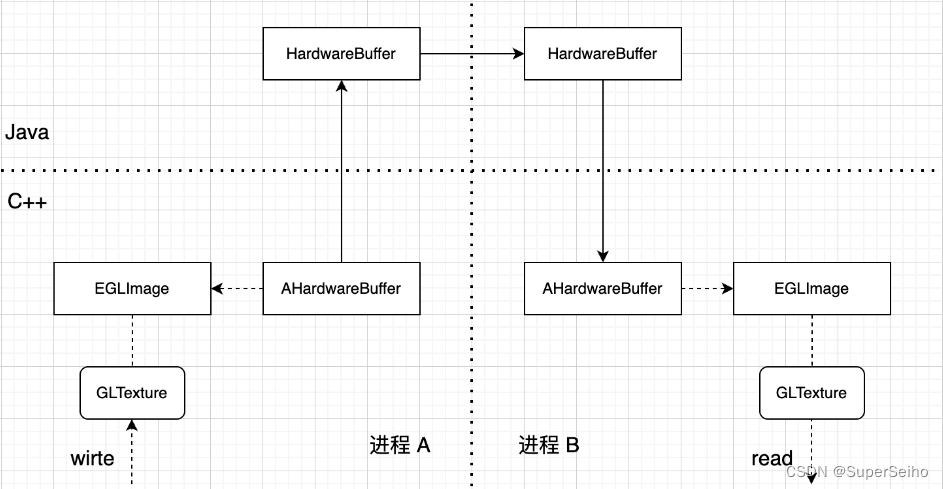

# Android渲染-AHardwareBuffer

本文主要从应用的角度介绍android的native层AHardwareBuffer创建纹理以及保存渲染数据。


## HardwareBuffer

要介绍native层的AHardwareBuffer，就需要先从Java层的HardwareBuffer说起。Android官方对于HardwareBuffer介绍如下：

```
HardwareBuffer wraps a native AHardwareBuffer object, which is a low-level object representing a memory buffer accessible by various hardware units. HardwareBuffer allows sharing buffers across different application processes. In particular, HardwareBuffers may be mappable to memory accessibly to various hardware systems, such as the GPU, a sensor or context hub, or other auxiliary processing units. For more information, see the NDK documentation for AHardwareBuffer.
```

HardwareBuffer 官方介绍为一种底层的内存 buffer 对象，可在不同进程间共享，可映射到不同硬件系统，如 GPU、传感器等，从构造函数可以看出，其可以指定 format 和 usage，用来让底层选择最合适的实现。

从HardwareBuffer的源码中可以了解到，HardwareBuffer只是 GraphicBuffer 的一个包装。在Android早期版本(API<=25), Java层并没有提供底层的GraphicBuffer API，通常使用底层由GraphicBuffer实现的Surface。因此本质上是 Android 系统开放了更底层的 API，我们才可以有更高效的实现。接下来看具体如何基于HardwareBuffer跨进程传输纹理。



通过 AHardwareBuffer_toHardwareBuffer 函数，可以将native层的AHardwareBuffer 对象转为 Java HardwareBuffer 对象，其本身实现了 Parcelable 接口，可以直接通过 AIDL 传递到另一个进程，其中具体的实现就是 Android 系统 GraphicBuffer 跨进程的方案，底层通过 fd 实现，B进程获取对应的HardwareBuffer后，可以通过AHardwareBuffer_fromHardwareBuffer继续转换为native层的AHardwareBuffer。 


## AHardwareBuffer

接下来主要介绍使用AHardwareBuffer创建纹理以及通过AHardwareBuffer读取纹理图像的流程


### AHardwareBuffer创建纹理

创建纹理的流程较为简单，创建AHardwareBuffer_Desc句柄，结构体赋值，本文以创建NV21的OES纹理为例，代码如下：

    FUN_BEGIN_TIME("RenderContext::CreateOESTexture")
        if(textureID == 0){
            AHardwareBuffer_Desc h_buffer_desc = {0};
            h_buffer_desc.stride = frameData->i32Width;
            h_buffer_desc.height = frameData->i32Height;
            h_buffer_desc.width = frameData->i32Width;
            h_buffer_desc.layers = 1;
            h_buffer_desc.format = 0x11;
            h_buffer_desc.usage = AHARDWAREBUFFER_USAGE_CPU_WRITE_OFTEN|AHARDWAREBUFFER_USAGE_GPU_SAMPLED_IMAGE;
     
            int ret = AHardwareBuffer_allocate(&h_buffer_desc, &inputHWBuffer);
            EGLint attr[] = {EGL_NONE};
            EGLDisplay edp;
            edp = (EGLDisplay)eglGetCurrentDisplay();
            inputEGLImage) = eglCreateImageKHR(edp, EGL_NO_CONTEXT, EGL_NATIVE_BUFFER_ANDROID, eglGetNativeClientBufferANDROID(inputHWBuffer), attr);
            glGenTextures(1, &textureID);
            glBindTexture(GL_TEXTURE_EXTERNAL_OES, textureID);
            glTexParameteri(GL_TEXTURE_EXTERNAL_OES , GL_TEXTURE_MIN_FILTER, GL_LINEAR);
            glTexParameteri(GL_TEXTURE_EXTERNAL_OES , GL_TEXTURE_MAG_FILTER, GL_LINEAR);
            glEGLImageTargetTexture2DOES(GL_TEXTURE_EXTERNAL_OES , (GLeglImageOES)inputEGLImage);
            GLUtils::CheckGLError("eglCreateImageKHR");
        }
        AHardwareBuffer_Planes planes_info = {0};
        int ret = AHardwareBuffer_lockPlanes(inputHWBuffer,
                                             AHARDWAREBUFFER_USAGE_CPU_WRITE_MASK,
                                             -1,
                                             nullptr,
                                             &planes_info);
        if (ret != 0) {
            LOGI("Failed to AHardwareBuffer_lockPlanes");
        }
        else
        {
            memcpy(planes_info.planes[0].data,frameData->ppu8Plane[0],frameData->i32Width * frameData->i32Height*3/2);
            ret = AHardwareBuffer_unlock(inputHWBuffer, nullptr);
            if (ret != 0) {
                LOGI("Failed to AHardwareBuffer_unlock");
            }
        }
        glBindTexture(GL_TEXTURE_EXTERNAL_OES, textureID);
    FUN_END_TIME("RenderContext::CreateOESTexture")


### AHardwareBuffer读取纹理图像数据

读取纹理图像数据的方式和创建纹理的方式类似，通过上述创建纹理的方式，我们实现了AHardwareBuffer 和 EGLImageKHR的绑定，因此，我们可以通过反向思维，将纹理读取出来，代码如下：

```
FUN_BEGIN_TIME("RenderContext::ReadOESTexture")
    unsigned char *ptrReader = nullptr;
    ret = AHardwareBuffer_lock(inputHWBuffer, AHARDWAREBUFFER_USAGE_CPU_READ_OFTEN, -1,     nullptr, (void **) &ptrReader); 
    memcpy(dstBuffer, ptrReader, imgWidth * imgHeight * 3 / 2);
    ret = AHardwareBuffer_unlock(inputHWBuffer, nullptr);
FUN_END_TIME("RenderContext::ReadOESTexture")
```

至此，我们可以将dstBuffer通过字节，或者其他形式，保存为图像数据。


## 总结

针对Android侧，我们需要理清GraphicBuffer、AHardwareBuffer、ANativeWindowBuffer之间的关系。从联系上，GraphicBuffer 继承了ANativeWindowBuffer，所以可以直接通过static_cast<>类型转换成ANativeWindowBuffer，不过由于是多继承，所以转完有一个地址偏移（static_cast 自动完成）。而AHardwareBuffer只是一个抽象的概念，没有具体类型，与GraphicBuffer 没有任何继承关系，也没有具体的类型，是个空结构体，类似于void 类型。从源码可以看到，aosp封装的那些AHardwareBuffer_xxx接口，本质上底层都是通过AHardwareBuffer_to_GraphicBuffer,转成GraphicBuffer，依旧用GraphicBuffer的形式做的后续处理。