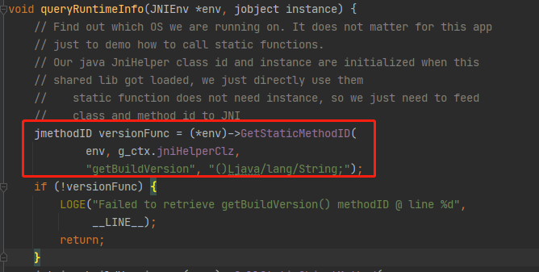
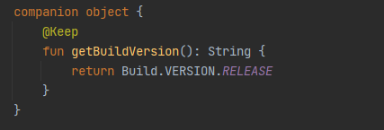
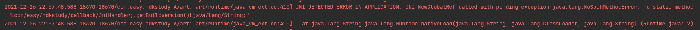
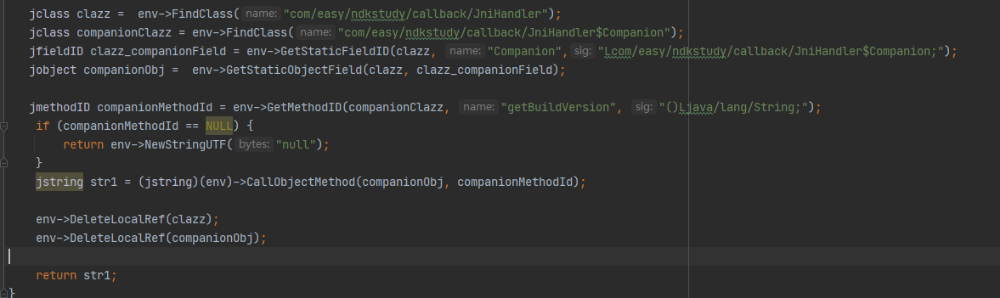
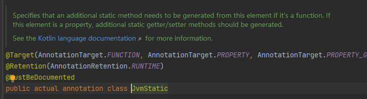
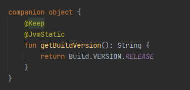
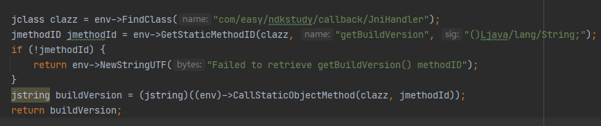
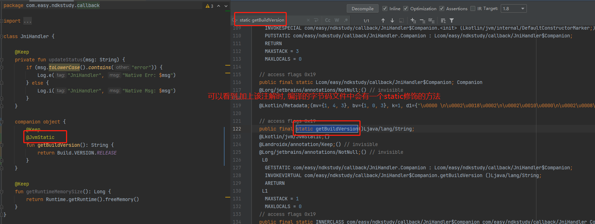
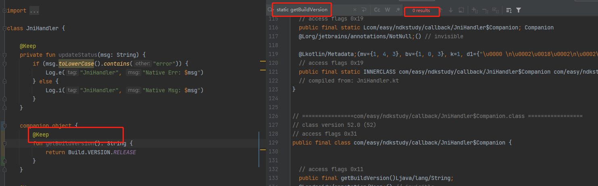

# JNI


java -> jni ->c++

String -> jstring -> char*


签名规则

| java类型                    | 属性类型符号                         |
| --------------------------- | ------------------------------------ |
| boolean                     | Z                                    |
| byte                        | B                                    |
| char                        | C                                    |
| short                       | S                                    |
| int                         | I                                    |
| long                        | J                                    |
| float                       | F                                    |
| double                      | D                                    |
| void                        | V                                    |
| object                      | L+完整的类名;<br />如:               |
| array                       | [数组的数据类型<br />如: int[] -> [I |
| method(参数类型) 返回值类型 | void name(int a, double b) (ID) V    |


javap命令获取

javap -s -p D:\code\study\android\NativeDemo\app\build\tmp\kotlin-classes\debug\com\xingray\demo\nativedemo\MainActivity.class
Compiled from "MainActivity.kt"
public final class com.xingray.demo.nativedemo.MainActivity extends androidx.appcompat.app.AppCompatActivity {
  public static final com.xingray.demo.nativedemo.MainActivity$Companion Companion;
    descriptor: Lcom/xingray/demo/nativedemo/MainActivity$Companion;
  private com.xingray.demo.nativedemo.databinding.ActivityMainBinding binding;
    descriptor: Lcom/xingray/demo/nativedemo/databinding/ActivityMainBinding;
  private java.lang.String name;
    descriptor: Ljava/lang/String;
  private int age;
    descriptor: I
  private static int count;
    descriptor: I
  public com.xingray.demo.nativedemo.MainActivity();
    descriptor: ()V

  protected void onCreate(android.os.Bundle);
    descriptor: (Landroid/os/Bundle;)V

  public final native java.lang.String stringFromJNI();
    descriptor: ()Ljava/lang/String;

  public final native void setName();
    descriptor: ()V

  public final native void setAge();
    descriptor: ()V

  public static final int access$getCount$cp();
    descriptor: ()I

  public static final void access$setCount$cp(int);
    descriptor: (I)V

  static {};
    descriptor: ()V
}


# 安卓 NDK 入门指南

## 

*Posted by Piasy on August 26, 2017*

[选择语言▼](https://blog.piasy.com/2017/08/26/NDK-Start-Guide/index.html#)

本文是 Piasy 原创，发表于 [https://blog.piasy.com](https://blog.piasy.com/index.html)，请阅读原文支持原创 [https://blog.piasy.com/2017/08/26/NDK-Start-Guide/](https://blog.piasy.com/2017/08/26/NDK-Start-Guide/index.html)

*本文的前身是一篇笔记，比较零碎，发布出来是为了让后续的文章可以有一个基本的参考，本文会持续更新。*

NDK 的高性能最常见的场景：多媒体，游戏。此外，利用 NDK 还能练习 C/C++，一举两得。

## 基本概念

- shared library, `.so`
- static library, `.a`
- JNI: Java Native Interface
- Application Binary Interface, ABI：我们将符号修饰标准、变量内存布局、函数调用方式等跟可执行代码二进制兼容性相关的内容称为程序的 ABI（*摘自《程序员的自我修养》*）；
- Application Programming Interface, API：API 是源码层面的接口，而 ABI 则是二进制层面的接口，ABI 的兼容程度更为严格；
- CPU 架构
  - `armeabi`
  - `armeabi-v7a`
  - `arm64-v8a`
  - `x86`
- JNI function v.s. native method：前者是 JNI 系统（Java）提供的函数，后者则是 Java 类里面定义的 native 函数；

写代码时 C++ 和 Java 的互相调用，这是 JNI 提供的能力，NDK 可以编译出和安卓系统 ABI 兼容的静态/动态库，安卓 APK 打包进去以及运行时使用的都是动态库，静态库可以作为依赖，用来编译其他库。

NDK 开发现在有两种编译方式，一是 `ndk-build`，我们需要编写 `Android.mk` 和 `Application.mk`，运行 `ndk-build` 命令进行编译，另一种是 CMake，它和 Gradle 紧密结合，AndroidStudio 对它也有很好的支持，我们需要编写 `CMakeLists.txt` 和 `build.gradle`。

如果我们的 APP 不希望编写任何 Java 代码，这也是可以做到的，NDK 定义了 native activity 和 native application。除了这俩模块，还有很多模块也都有 native 的定义，我们可以直接在 C++ 代码中访问，例如 native window，asset manager 等。

## JNI

### Design overview

- JNI interface pointer：

  native 代码通过它使用 JVM 的功能（调用 JNI functions）

  ；

  - 它就是 native 方法的 `JNIEnv* env` 参数，它是一个指针的指针，所以使用都是 `(*env)->XXX`；C++ 语法层面可以简化为 `env->XXX`；
  - 可以把它理解为一个线程局部的指针，只在传入时的线程内有效，不要把它存起来给其他线程用；JVM 保证同一个线程内多次调用（不同的）native 方法，env 指针都是同一个，不同线程调用，env 指针将不同；


- 函数命名规则，参数对应规则，参数使用之前的转换，现在 Android Studio 都有了很好的支持；
- 参数列表：第一个参数是 JNI interface pointer `JNIEnv* env`，如果方法是 static，第二个参数就是该类的 class 对象引用，否则是该对象的引用；其他参数的对应关系见 [JNI Types and Data Structures](http://docs.oracle.com/javase/8/docs/technotes/guides/jni/spec/types.html)；
- 访问 Java 对象：primitive 类型传值，对象传引用，这和 Java 的机制一致；native 代码需要显式告知 JVM，何时引用了 Java 对象，何时释放了引用；
  - Global References：有效期不限于本次函数调用，需显式释放；
  - Local References：有效期仅限于本次函数调用，无需显式释放；为了允许提前 GC，或者防止 local ref 导致 OOM 时，可以显式释放；local ref 只允许在被创建的线程使用；
- 访问 primitive 数组：*JNI 引入了“pinning”机制，可以让 JVM “固化”数组的地址，允许 native 代码获得直接访问的指针*；
- 访问成员变量和成员函数：根据名字和签名，取得函数/变量的 id，再利用 id 进行调用；持有函数/变量的 id 不能阻止类被卸载，持有类的 class 对象引用可以阻止；
- JNI 允许在 native 代码中抛出异常，也能捕获异常；

### [JNI Functions](http://docs.oracle.com/javase/8/docs/technotes/guides/jni/spec/functions.html)

- 访问 Java 的方法，需要指定签名（signature，包含参数列表、返回值类型），可以用 `javap –s -classpath <path to class file> <import path>` 获取；
- 类操作、异常处理、reference、对象操作、成员变量、成员函数、字符串、数组、monitor、NIO、反射……具体可以参考 [spec](http://docs.oracle.com/javase/8/docs/technotes/guides/jni/spec/functions.html)；

### [The Invocation API](http://docs.oracle.com/javase/8/docs/technotes/guides/jni/spec/invocation.html)

- native 线程可以创建 JavaVM 和 JNIEnv 对象，用于运行 Java 的代码；
- JNIEnv 只在创建的线程内有效，如果要如果要保存起来在其他线程使用，都需要先 AttachCurrentThread，下面的代码参考自 [StackOverflow](http://stackoverflow.com/q/12900695/3077508)：

```
// 在 JNI_OnLoad 中直接保存 g_vm，或者在初始化函数中利用 JNIEnv 获取并保存 g_vm
static JavaVM *g_vm;

jint JNI_OnLoad(JavaVM *vm, void *reserved) {
    g_vm = vm;
}

...init(JNIEnv *env...) {
    env->GetJavaVM(&g_vm);
}

// 利用 g_vm 获取 JNIEnv，并判断是否需要 attach
void nativeFunc(char *data, int len) {
    JNIEnv *env;
    int getEnvStat = g_vm->GetEnv((void **) &env, JNI_VERSION_1_6);
    if (getEnvStat == JNI_EDETACHED) {
        int attached = g_vm->AttachCurrentThread(&env, NULL);
        LOGI("AttachCurrentThread: %s", (attached ? "false" : "true"));
    } else if (getEnvStat == JNI_OK) {
        LOGI("thread already attached");
    } else if (getEnvStat == JNI_EVERSION) {
        LOGI("Unsupported JVM version");
        return;
    }
    callJNIFunc(env, data, len);
    if (getEnvStat == JNI_EDETACHED) {
        g_vm->DetachCurrentThread();
    }
}
```

- native 库被加载的时候（`System.loadLibrary`），会调用 `JNI_OnLoad` 函数；库被 GC 的时候，会调用 `JNI_OnUnload`；
- 调用 JVM（JNI）方法都需要 JNIEnv 指针，但 JNIEnv 不能跨线程共享，我们只能共享 JavaVM 指针，并用它来获取各自线程的 JNIEnv；

## [JNI tips](https://developer.android.com/training/articles/perf-jni.html)

- 不要跨线程共享 JNIEnv，要共享就共享 JavaVM；
- 如果头文件会被 C/C++ 同时 include，那最好里面不要引用 JNIEnv；
- `pthread_create` 创建的线程，需要调用 `AttachCurrentThread` 才能拥有 JNIEnv，才能调用 JNI 函数；attach 会为该 native 线程创建一个 `java.lang.Thread` 对象；attach 之后的线程，在退出之前需要 detach，当然，也可以更早 detach；

### jclass, jmethodID, and jfieldID

- native 代码中访问 Java 成员变量或者调用 Java 函数，需要先找到 `jclass`，`jmethodID` 或 `jfieldID`，找到这些变量会比较耗时，但找到之后访问/调用是很快的；
- `jclass` 如果要存起来，必须用 `NewGlobalRef` 包装一层，一是防止被 GC，二是为了在作用域之外使用；如果要缓存 `jmethodID` 或 `jfieldID`，可以在 Java 类的 static 代码块中调用 native 函数执行缓存操作；

### Local and Global References

- native 方法的参数，以及绝大多数 JNI 方法的返回值，都是 local reference，即便被引用的对象还存在，local reference 也将在作用域外变得非法（不能使用）；可以通过 `NewGlobalRef` 或者 `NewWeakGlobalRef` 创建 global reference；常用的保存 `jclass` 方法就是如下：

```
jclass localClass = env->FindClass("MyClass");
jclass globalClass = reinterpret_cast<jclass>(env->NewGlobalRef(localClass));
```

- 在 native 代码中，同一对象的引用值可能不同，因此不要用 `==` 判等，而要用 `IsSameObject` 函数；
- 对象的引用既不是固定不变的，也不是唯一的，因此不要用 `jobject` 作为 key；
- 通常 local reference 可以被 JVM 自动释放，但由于存在数量上限，而且手动 attach 的线程不会自动释放 local reference，因此最好还是手动释放 local reference，尤其是在循环中；

### UTF-8, UTF-16 Strings, Primitive Arrays

- Get 之后都需要 Release，否则内存泄漏；Get 可能失败，不要 Release NULL；
- `Get<PrimitiveType>ArrayElements` 可能会直接返回 Java heap 上的地址，也可能会做拷贝；无论是否拷贝，都需要 Release；
- Release 时有 mode 参数，0，`JNI_COMMIT`，`JNI_ABORT`；
- `Get<PrimitiveType>ArrayRegion` 和 `Set<PrimitiveType>ArrayRegion` 用于单纯的数组拷贝；
- 自己实现的 JNI 接口如果要返回 jstring，则调用 `NewStringUTF`，传入的 `char*` 参数，需要自己维护内存，可以是栈上分配的，如果是 new 出来的，就要 delete 掉，[参考问题](https://stackoverflow.com/a/6245964/3077508)；

### Exceptions，Extended Checking

- 异常发生后，就不要调用 JNI 函数了，除了 Release/Delete 等函数；
- `adb shell setprop debug.checkjni 1` 或在 manifest 中设置 `android:debuggable`；

### Java 和 native 代码共享数组

- `GetByteArrayElements` 可能直接返回堆地址，也可能会进行拷贝，后者就存在性能开销；
- `java.nio.ByteBuffer.allocateDirect` 分配的数组，一定不需要拷贝（通过 `GetDirectBufferAddress`）；但在 Java 代码中访问 direct ByteBuffer 可能会很慢；
- 所以需要考虑：数组主要在哪一层代码访问？（native 层就用 direct ByteBuffer，Java 层就用 byte[]）如果数据最终都要交给系统 API，数据必须是什么形式？（最好能用 byte[]）

## CMake 基本使用

CMake 是用来生成其他编译系统配置文件的一套工具集，从 AndroidStudio 2.2 开始作为默认的 NDK 支持方式，和 Gradle、AndroidStudio 都做到了紧密结合。

`build.gradle` 示例：

```
android {
    //...
    defaultConfig {
        //...
        ndk.abiFilters = ['armeabi-v7a']
        externalNativeBuild {
            cmake {
                arguments = ['-DANDROID_TOOLCHAIN=clang', '-DANDROID_STL=c++_static']
                cppFlags '-std=c++11 -fno-rtti'
            }
        }
    }
    externalNativeBuild {
        cmake {
            path "CMakeLists.txt"
        }
    }
    //...
}
```

`CMakeLists.txt` 示例：

```CMake
cmake_minimum_required(VERSION 3.4.1)

set(CWD ${CMAKE_CURRENT_LIST_DIR})

add_library(try-webrtc SHARED
            src/main/cpp/try-webrtc.cpp
            )

include_directories(libs/webrtc/include)
add_definitions(-DWEBRTC_POSIX)

# Include libraries needed for try-webrtc lib
target_link_libraries(try-webrtc
                      android
                      log
                      ${CWD}/libs/webrtc/libwebrtc.a
                      )
```

### `set`

定义一个变量，引用变量的方式为 `${var name}`。

### `add_library`

定义一个 library，指定名字，链接类型（static/shared），源文件：

```CMake
add_library( # Specifies the name of the library.
             try-webrtc
             # Sets the library as a shared library.
             SHARED
             # Provides a relative path to your source file(s).
             src/main/cpp/try-webrtc.cpp
             )
```

### `add_executable`

定义一个可执行目标：

```CMake
add_executable(myapp main.c)
```

### `include_directories`

指定头文件查找路径：

```CMake
# Specifies a path to native header files.
include_directories(libs/webrtc/include)
```

### `find_library`

查找特定的库：

```CMake
find_library( # Defines the name of the path variable that stores the
              # location of the NDK library.
              log-lib
              # Specifies the name of the NDK library that
              # CMake needs to locate.
              log 
              )
```

### `target_link_libraries`

为目标增加链接库：

```CMake
# Links your native library against one or more other native libraries.
target_link_libraries( # Specifies the target library.
                       try-webrtc
                       # Links the log library to the target library.
                       ${log-lib} 
                       android
                       ${CWD}/libs/webrtc/libwebrtc.a
                       )
```

链接库可以是 `add_library` 定义的，也可以是 `find_library` 定义的，也可以是预先编译好的静态/动态库（绝对路径），甚至可以是链接选项。

### CMake 遇上 Gradle

AndroidStudio 会在构建过程中执行一些 Gradle task，其中就包含运行 CMake 命令的 task，这样就完成了对 NDK 的支持。运行 CMake 的具体命令和参数，会保存在 `<project-root>/<module-root>/.externalNativeBuild/cmake/<build-type>/<ABI>/cmake_build_command.txt` 文件中，调试 CMake 过程时非常有用。在这里 CMake 实际上是生成了 ninja 配置文件，靠 ninja 完成编译。

## 开发技巧

- native obj 做 Java wrapper
  - 把 native obj 指针 `jlong handle = reinterpret_cast<intptr_t>(ptr)` 得到一个 jlong 值；
  - Java obj 保存一个这个 long 值，后续 native 接口调用都带着它；
  - native 函数中 `reinterpret_cast<NativeType*>(j_ptr)` 得到 native obj 的指针，就可以调用它的方法了；

## 参考链接

- [JNI spec](http://docs.oracle.com/javase/8/docs/technotes/guides/jni/spec/jniTOC.html)
- [JNI tips](https://developer.android.com/training/articles/perf-jni.html)
- [Best practices for using the Java Native Interface](https://www.ibm.com/developerworks/library/j-jni/index.html)
- [添加、引入、引用 C/C++ 代码、模块](https://developer.android.com/studio/projects/add-native-code.html)
- [NDK 提供的可直接使用的库](https://developer.android.com/ndk/guides/stable_apis.html)
- [googlesamples/android-ndk](https://github.com/googlesamples/android-ndk)


# [Android开发-----JNI反射kotlin静态方法](https://www.cnblogs.com/sweep/p/15743298.html)

#### Google官方sample中的问题

google官方的`ndk-sample`中的`hello-jnicallback`项目, 在通过反射调用`JniHandler.java`类中的`getBuildVersion()`方法时,
由于是直接调用的java的`static`方法,并没有出错


而在kotlin的语法中, 要实现java中`static`需要使用到`companion`关键字


但是如果只是增加了`companion`, 那么在jni中通过`GetStaticMethodID()`获取`getBuildVersion()`静态方法会报如下错误


#### JNI反射Kotlin静态方法的方式

**方法一**
网上搜索了一些资料,查询了相关API找到了如下方法(该方法参考[Jni 反射 Kotlin 静态内部类成员函数](https://blog.csdn.net/qq_20330595/article/details/100117086))
主要是通过反射先获取`companion`静态属性对象, 然后再通过该对象调用其方法


**方法二**
该方法是无意间想起kotlin中有一个`@JvmStatic`注解, 该注解注释如下


> 大意是说, 如果`@JvmStatic`注解用在函数上,那么会生成一个静态方法; 如果是用在属性上, 那么就会对应的生成静态`setter/getter`方法

既然如此,那么就可以使用该注解来实现jni反射kotlin中的`static`


加上该注解后, jni中的代码就可以写为google官方sample中的方式


#### 关于@JvmStatic注解

方法二中使用到该注解来解决jni反射kotlin静态的问题, 该注解的功能直接看字节码文件比较清晰


若不适用该注解,那么字节码文件如下图, 可以看到并不会生成一个对应的static方法, 所以按照googl-sample的方式调用时, 会找不到该方法从而报错


分类: [Android](https://www.cnblogs.com/sweep/category/1185645.html) , [Kotlin](https://www.cnblogs.com/sweep/category/1188371.html) , [jni](https://www.cnblogs.com/sweep/category/2054931.html)