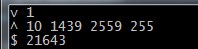

# STF 框架之 minitouch 工具


## 前言

有感于各路大神对 STF 细节功能的挖掘：
[STF 框架之 minicap 工具](https://testerhome.com/topics/3115)
[[STF 系列\] 无痛接入基于 LDAP 的单点登录](https://testerhome.com/topics/3906)
发现除了 minicap 之外，对于 STF 的设备管理的触摸功能，他们用的是类似的依赖工具，叫 minitouch，Git 地址：https://github.com/openstf/minitouch

## minitouch 介绍

跟 minicap 一样，minitouch 也是用 NDK 开发的，跟 minicap 使用方法类似，不过它只要上传一个 minitouch 文件就可以了。对应的文件路径树跟 minicap 一样就不重复介绍 (不过它只需要对应不同的 CPU 的 ABI，而不需要对应 SDK 版本)。实际测试这个触摸操作和 minicap 一样，实时性很高没什么卡顿。

## 使用概述

- 判断设备的 CPU 的 ABI： `adb shell getprop ro.product.cpu.abi armeabi-v7a`

- adb push 对应的 minitouch 文件到设备上 (libs/$ABI 对应的为你本地的 minitouch 路径)： `adb push libs/$ABI/minitouch /data/local/tmp/`

- 比较关键的一步，因为 push 上去的文件是没有执行权限的，需要运行 chmod 提升权限： `C:\Users\Administrator>adb shell sshell@shamu:/ $ su root@shamu:/ # cd /data/local/tmp root@shamu:/data/local/tmp # chmod 777 minitouch root@shamu:/data/local/tmp # ls -l -rwxrwxrwx shell shell 25920 2016-02-24 21:09 minitouch`

- 本地端口转发 (端口可以任意) `adb forward tcp:1111 localabstract:minitouch`

- 启动 minitouch

  ```
  C:\Users\Administrator>adb shell /data/local/tmp/minitouch
  Note: device /dev/input/mice is not supported by libevdev
  Type B touch device atmel_mxt_ts (1439x2559 with 16 contacts) detected on /dev/i
  nput/event0 (score 1100)
  Note: hard-limiting maximum number of contacts to 10
  ```

  ## minitouch 执行触摸命令

  和 minicap 类似，minitouch 也是通过 socket 通信进行操作，只不过 minicap 是读取 socket 信息，而 minitouch 则是向 socket 发送信息进行设备操作。
  每一个触摸操作为一条 socket 命令。
  写入的命令分别有

- d 按下的操作，命令格式为：

  ```
  d <contact> <x> <y> <pressure>
  ```

  contact 为触摸点索引，从 0 开始，可以有多个触摸点， 为具体点击的坐标，为压力值。(注意在程序中实现时每个命令结束一定要加上'\n')

  ```
  d 0 10 10 50\n
  ```

- m 划动的操作，命令格式为：

  ```
  m <contact> <x> <y> <pressure>
  ```

  contact 为触摸点索引，从 0 开始，可以有多个触摸点， 为要移动到的 xy 坐标，为压力值

  ```
  m 0 100 100 50\n
  ```

- u 松开的操作，命令格式为：

  ```
  u <contact> 
  ```

  contact 为触摸点索引，从 0 开始，可以有多个触摸点

  ```
  u 0\n
  ```

- c 操作
  commit 操作，用于提交当前的触摸设置并在屏幕上执行。注意对于相同触摸点的每条 d、m、u 操作后面都需要跟一个 c 操作，才能正确的在屏幕上执行

  ```
  c\n
  ```

  那么合在一起操作，比如点击设备的 (0,0) 并划动到 (100,100) 然后放开

  ```
  d 0 0 0 50\n
  c\n
  m 0 100 100 50\n
  c\n
  u 0\n
  c\n
  ```

  两个手指同时点击 (10,10) 和 (20,20)

  ```
  d 0 10 10 50\n
  d 1 20 20 50\n
  c\n
  u 0\n
  u 1\n
  c\n
  ```

## minitouch 的 output 信息

之后进行触摸操作的时候我发现，部分设备是可以准确的执行到正确的坐标，而部分设备坐标存在巨大的偏差。于是有仔细的看下文档，仔细看了 minitouch 的 output 部分信息：

> When you first open a connection to the socket, you'll get some protocol metadata which you'll need need to read from the socket. Other than that there will be no responses of any kind.

首先，当 socket 连接建立的时候，socket 的首次 output 信息会返回 minitouch 对应的头信息，我尝试用一段 C# 代码对它进行读取

```
static void Main(string[] args)
        {
            Socket socket = new Socket(AddressFamily.InterNetwork, SocketType.Stream, ProtocolType.Tcp);
            socket.Connect(new IPEndPoint(IPAddress.Parse("127.0.0.1"), 1111));
            byte[] chunk = new byte[1024];
            socket.Receive(chunk);
            Console.WriteLine(System.Text.Encoding.Default.GetString(chunk));
            Console.ReadLine();
        }
```

执行后可以看到返回的数据为：



官方文档中对它的描述分别为：


- v minitouch 协议的版本
- ^ 这一段为对应的参数上线，如支持的最大触摸点个数，和触摸的 x,y 坐标的最大值，最大压力值 (貌似搞不懂这个鸭梨)
- $ 文档上写的是 minicap 的 pid(这个没确认过是否它写错了还是真的是和 minicap 有关)

这边要重点说的是 max-x 和 max-y，这边返回的值有可能和你的设备的真实大小并不是一样的，比如我用三星 GalaxyNote10.1 的平板调试，读取到的 max-x 和 max-y 分别为 4095x4095，而设备的实际分辨率为 1600x2560。
所以我注意看了下官方文档有写了：

> It's also very important to note that the maximum X and Y coordinates may, but usually do not, match the display size. You'll need to work out a good way to map display coordinates to touch coordinates if required, possibly by using percentages for screen coordinates.
> 文档里有说到通常不匹配显示大小，你需要自己用一个方法来映射坐标，建议是用百分比来显示

于是我做了个实验，对设备发送了

```
d 0 2048 2048 50\n      
c\n
```

然后在设备上发现，设备被点击的坐标是 800，1280，果然分别是真实坐标的一半。
那么就是说我们在实际应用中需要给设备分别换算出真实设备大小和 minitouch 映射大小的宽度和高度的百分比参数，来进行正确的坐标映射。
需要对设备进行操作的时候，将要点击的坐标除以这个百分比就可以得到要给设备发送的正确坐标。
用 C# 做了个简单的实现：

```
public class MiniTouchStream
    {
        private String IP = "127.0.0.1";
        private int PORT = 1111;
        private Socket socket;
        private Banner banner = new Banner();
        private AndroidDevice device;

        public Banner Banner
        {
            get
            {
                return banner;
            }
        }

        public MiniTouchStream(AndroidDevice device)
        {
            this.device = device;
            socket = new Socket(AddressFamily.InterNetwork, SocketType.Stream, ProtocolType.Tcp);
            socket.Connect(new IPEndPoint(IPAddress.Parse(IP), PORT));
            ParseBanner(socket);
        }

        private void ParseBanner(Socket socket)
        {
            byte[] chunk = new byte[64];
            socket.Receive(chunk);
            string[] result = Encoding.Default.GetString(chunk).Split(new char[2] { '\n', ' ' }).ToArray();
            banner.Version = Convert.ToInt32(result[1]);
            banner.MaxContacts = Convert.ToInt32(result[3]);
            banner.MaxX = Convert.ToInt32(result[4]);
            banner.MaxY = Convert.ToInt32(result[5]);
            banner.MaxPressure = Convert.ToInt32(result[6]);
            banner.Pid = Convert.ToInt32(result[8]);
            banner.PercentX = (double)device.Width / banner.MaxX;
            banner.PercentY = (double)device.Height / banner.MaxY;
        }

        public void TouchDown(Point downpoint)
        {
            Point realpoint = PointConvert(downpoint);
            ExecuteTouch(string.Format("d 0 {0} {1} 50\n", realpoint.X.ToString(), realpoint.Y.ToString()));
        }

        public void TouchUp()
        {
            ExecuteTouch(string.Format("u 0\n"));
        }

        public void TouchMove(Point movepoint)
        {
            Point realpoint = PointConvert(movepoint);
            ExecuteTouch(string.Format("m 0 {0} {1} 50\n", realpoint.X.ToString(), realpoint.Y.ToString()));
        }

        public void ExecuteTouch(string touchcommand)
        {
            byte[] inbuff = Encoding.ASCII.GetBytes(touchcommand);
            socket.Send(inbuff);
            string ccommand = "c\n";
            inbuff = Encoding.ASCII.GetBytes(ccommand);
            socket.Send(inbuff);   
        }

        private Point PointConvert(Point point)
        {
            Point realpoint = new Point((int)(point.X / banner.PercentX) * device.Scale, (int)(point.Y / banner.PercentY) * device.Scale);
            return realpoint;
        }
    }
```

最后贴个结合 minicap 和 minitouch 简单写的一个小 demo，
[C#demo](http://pan.baidu.com/s/1qWR8yFa)
第一次启动可能会稍微慢点，耐心等下