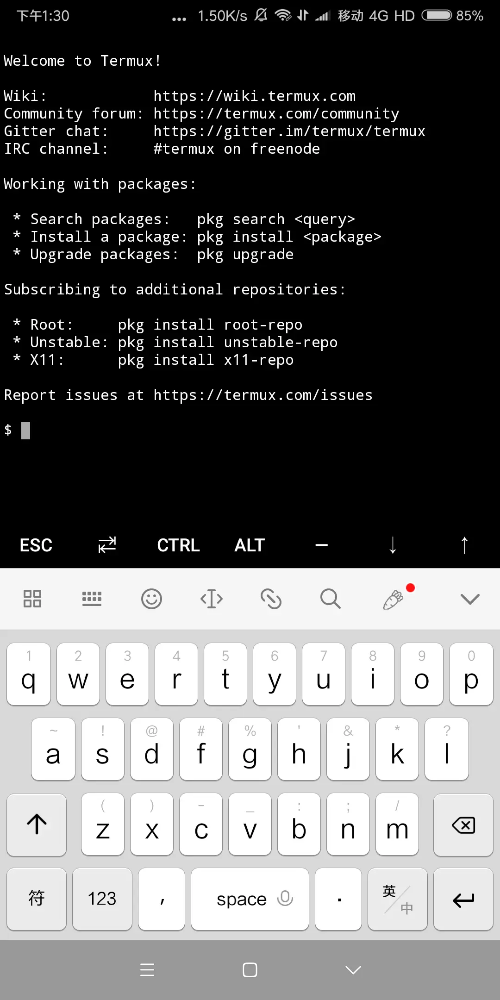
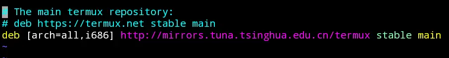
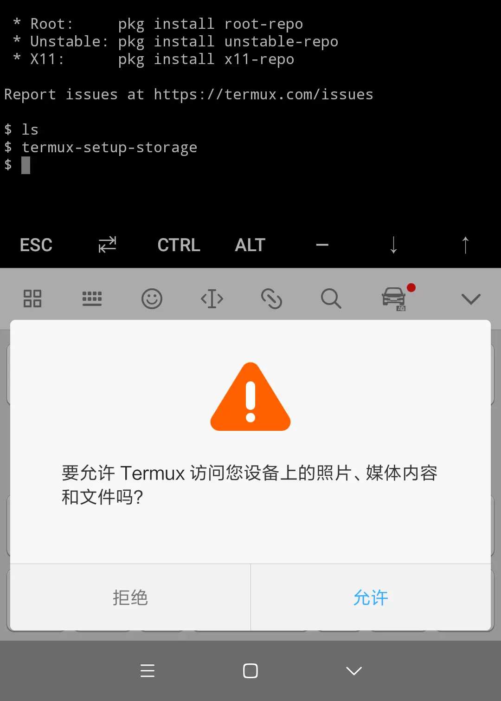
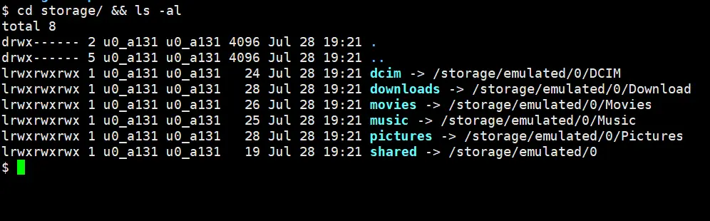
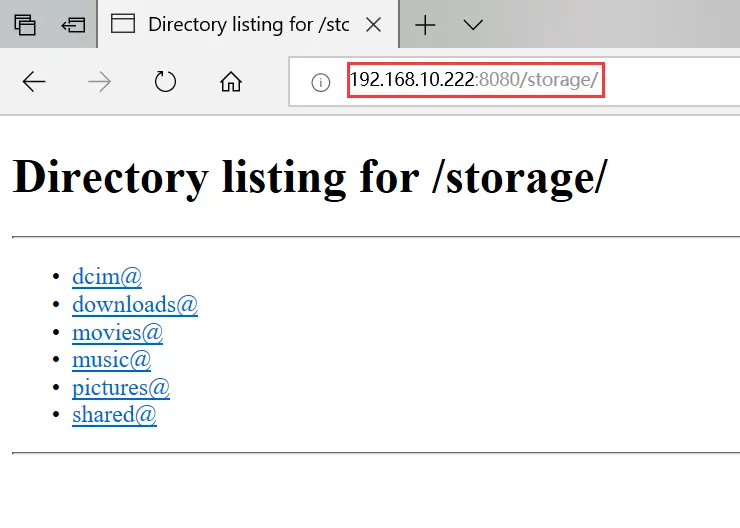

# Termux 入门与实践


最近读了阮一峰老师关于 Termux[1] 的博客，刚好手边有闲置的安卓机，于是抽空折腾了下，特此记录和分享一下。

## Termux 简介

Termux 是一款安卓平台下模拟 Linux 环境的 app。可以直接使用，无需 root 或 额外设置。支持 apt 进行软件包管理。

## 环境准备

本章包含以下内容：

- 下载与安装（必需）
- 修改安装源
- 管理软件包

### 下载与安装

目前 官网[2] 提供两种下载渠道：`Google Play` 和 `F-Droid`，最新版本为 0.72。如果安装无误，将会看到以下界面：



termux.png


### 修改安装源

由于官方源下载速度较慢，建议将安装源修改为国内源。修改方法如下：


```ruby
# 设置默认编辑器
$ export EDITOR=vi

# 编辑源文件
$ apt edit-sources
```

其实还有个简便方法：


```php
$ vi  $PREFIX/etc/apt/sources.list
```

将安装源修改为 `http://mirrors.tuna.tsinghua.edu.cn/termux`，保存退出。



修改安装源.png


### 管理软件包

除了 apt，Termux 在此基础上还封装了 pkg 命令，向下兼容 apt。pkg 在运行前会执行一次 `apt update`，保证安装的包是最新版本。

apt：


```ruby
# 连接远程仓库，获取软件包信息
$ apt update

# 更新本地已经安装的软件包
$ apt upgrade
```

pkg：


```xml
pkg search <query>              搜索包
pkg install <package>           安装包
pkg uninstall <package>         卸载包
pkg reinstall <package>         重新安装包
pkg update                      更新源
pkg upgrade                     升级软件包
pkg list-all                    列出可供安装的所有包
pkg list-installed              列出已经安装的包
pkg shoe <package>              显示某个包的详细信息
pkg files <package>             显示某个包的相关文件夹路径
```

## Termux 实践

本章包含以下内容：

- 配置 SSH
- 下载手机文件
- 安装 Ubuntu

### 配置SSH

由于自己在手机上打字效率堪忧，所以我决定先在 Termux 上配置个 SSH 服务，让 PC 端能够远程连接到手机。


```ruby
# 安装SSH服务
$ pkg install openssh

# 设置密码
$ passwd

# 启动sshd服务
$ sshd
```

配置完成后，确认下 SSH 连接的相关信息。需要注意的是，Termux 的 sshd 服务默认监听在 8022 端口上。


```ruby
# 查询手机ip，以实际手机ip为准
$ ifconfig
=> 192.168.10.222

# 查询当前用户
$ whoami
u0_a131

# 确认ssh服务的监听端口
netstat -ntlp | grep sshd
tcp        0      0 0.0.0.0:8022            0.0.0.0:*               LISTEN      28618/sshd          
tcp6       0      0 :::8022                 :::*                    LISTEN      28618/sshd
```

信息确认后就可以连接了，命令如下：


```ruby
$ ssh u0_a131@192.168.10.222 -p 8022
```

### 下载手机文件

阮老师博客中通过 Node.js 运行 Http Server 来实现，这里我准备用 Python 来测试下。

访问手机存储目录需要先请求权限，执行以下命令：


```ruby
# 访问本机存储
$ termux-setup-storage 
```

执行命令后，手机会弹框询问是否授权，"允许"即可。



allow.png


授权后会在家目录下生成 storage 子目录。其中包含很多软链接文件，指向手机实际的存储目录。



storage.png

安装python并启动 HTTP 服务。


```ruby
# 安装 python3。如需安装 python2，则执行pkg install pyton2。
$ pkg install python

# 启动 HTTP 服务。
$ python -m http.server 8080
```

在浏览器上输入地址`http://192.168.10.222:8080/storage/`下载文件。



download.png


### 安装 Ubuntu

Termux 支持安装其它 Linux 发行版。我测试安装了个 Ubuntu。具体 步骤[3] 如下：


```tsx
apt-get update && apt-get upgrade -y
# proot包的作用是允许未root的手机模拟管理员用户
apt-get install wget proot git -y
cd ~
git clone https://github.com/MFDGaming/ubuntu-in-termux.git
cd ubuntu-in-termux
chmod +x ubuntu.sh
./ubuntu.sh
cp ~/ubuntu-in-termux/resolv.conf ~/ubuntu-in-termux/ubuntu-fs/etc/
./start.sh
```

执行`./start.sh`脚本后可以看到 Ubuntu 已经安装成功了。


```ruby
$ cat /etc/issue
Ubuntu 19.04 \n \1
```

## 写在后面

通过 Termux 终端，您完全可以将自己闲置的安卓机改造成台开发机。由于自己折腾 Termux 时间有限，很多高级玩法还未深入涉及。这篇文章算是抛砖引玉吧。
部分内容参考了网上的一些资料和文档，如果您对 Termux 也感兴趣或者想深入了解的话，推荐阅读这篇文章[4]，写得非常详细。

##### 参考文档：

[1] 阮一峰的网络日志 - Termux 入门教程：架设手机 Server 下载文件 [http://www.ruanyifeng.com/blog/2019/07/termux-tutorial.html](https://links.jianshu.com/go?to=http://www.ruanyifeng.com/blog/2019/07/termux-tutorial.html)
[2] Termux官网 [https://termux.com/](https://links.jianshu.com/go?to=https://termux.com/)
[3] Ubuntu - Termux Wiki [https://wiki.termux.com/wiki/Ubuntu](https://links.jianshu.com/go?to=https://wiki.termux.com/wiki/Ubuntu)
[4] 国光 - Termux 高级终端安装使用配置教程 [https://www.sqlsec.com/2018/05/termux.html](https://links.jianshu.com/go?to=https://www.sqlsec.com/2018/05/termux.html)

