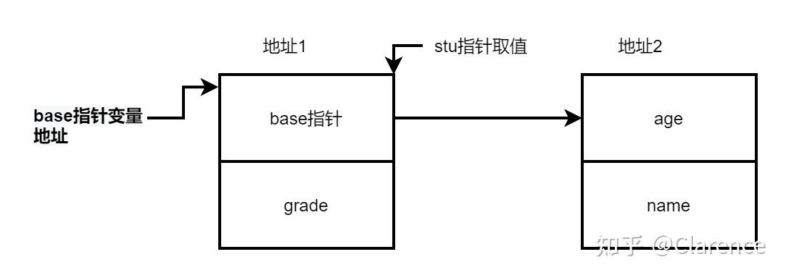

# C指针实现类似高级语言的继承特性

## 前言

笔者目前正在读大型的[开源项目](https://zhida.zhihu.com/search?content_id=219179065&content_type=Article&match_order=1&q=开源项目&zhida_source=entity)， [Mesa3D/mesa: Mesa 3D graphics library (read-only mirror of https://gitlab.freedesktop.org/mesa/mesa/) (github.com)](https://github.com/Mesa3D/mesa) ，这个项目的代码量在800W左右，而且是一个1993年就开始维护的代码，在看这个历史悠久并且活力不减的仓库时，我阅读到了一些非常有趣的C写法，在这里分享出来。

## **子类继承父类**

[oop](https://zhida.zhihu.com/search?content_id=219179065&content_type=Article&match_order=1&q=oop&zhida_source=entity)中，如果定义了一个名为"people"的父类

```text
class people{
    int age;
    int name;
    void eat(void);
};
```

这里的想法是，只要这个对象是一个 "人"，那么他一定会有age和name两个属性，并且作为人，一定会有eat的操作。

然后，我们在people的基础上新增一个子类概念，student。

那么可以使用oop的继承方法

```cpp
class student: people{
    int grade;
}
```

这样新的类型 student就可以享用原先的类型的属性和方法。这个是[C++](https://zhida.zhihu.com/search?content_id=219179065&content_type=Article&match_order=1&q=C%2B%2B&zhida_source=entity)的基本语法之一。

这里带来的想法是，如何使用C语言的指针来实现上述的功能呢？

## C指针实现类继承

与oop的类概念对标的是C语言中的struct方法

首先定义出people类型

```text
struct people{
    int age;
    int name;
    void (*eat)(void);
};
```

然后定义出继承这个struct的student

```text
struct student{
struct people * base;
int grade;
}
```

接着创建子类实体

```text
struct student * stu = malloc(sizeof(struct  student));
```

显然创建stu指针指向实体的时候，并没有创建 struct people *base 指向的实体。

不妨用这种方式创建实体，以及初始化指针指向实体

```text
struct people base = {
.age = 18;
.name = 0;
}
stu->base = &base;
```

此时子类 student指针 stu的值和他的一个[成员指针](https://zhida.zhihu.com/search?content_id=219179065&content_type=Article&match_order=1&q=成员指针&zhida_source=entity)base(people类型)的地址是相同的。

换言之 stu == &stu->base



我们这样理解，base关联着父类的[数据结构](https://zhida.zhihu.com/search?content_id=219179065&content_type=Article&match_order=1&q=数据结构&zhida_source=entity)信息，因为可以通过stu->base->age访问到父类的信息。

同时&stu->base又是和stu指针的值时相等的。

由上述的性质可以用指针模拟oop的面向对象特性。

## 场景如下

当我调用函数只需要访问父类的信息（更加抽象的信息），而不需要访问子类的数据结构的时候，我们只需要将&stu->base这个值传下去。

```text
function2(struct people * p){
//只需要访问people父类数据结构
}

function2(&stu->base);
```

这样一来在function2函数中只能看到父类people类型的信息 p->age,p->name。

话说回来，如果在函数的调用栈中，又突然需要访问子类信息怎么办呢？

使用上述的指针[方法论](https://zhida.zhihu.com/search?content_id=219179065&content_type=Article&match_order=1&q=方法论&zhida_source=entity)，可以很方便的把父类扩展到子类，具体看下述代码实现。

```text
function3(struct student * stu){
   //需要访问子类信息
}
function2(struct people * p){
    struct student * stu = (struct student *)p;
    function3(stu);
}

function2(&stu->base);
```

看到，只需要将 &stu->base 强转为 (struct student *)类型即可，因为 stu指针和&stu->base是完全取值相同的。这个是根本的原因，也是C能做到这一点的保证，但是局限性在于这个性质只能用在结构体第一个成员指针上，因此一个子类只能继承一个父类。

在大型工程中，例如mesa，大量用到了这个写法，将子类的第一个结构体指针指向父类实体，然后再[函数调用](https://zhida.zhihu.com/search?content_id=219179065&content_type=Article&match_order=1&q=函数调用&zhida_source=entity)的过程中只传递父类实体的首地址，再有需要访问子类数据结构的时候将其还原。

这样的好处在于：

**安全性**，在C语言中，安全性是十分奢侈的，因为C的struct没有public private之类的概念，在多人协作中，我不希望其他协作者修改子类数据结构，因此我只把父类的地址传给你，让你无法访问我的私有成员。当然，当我真正需要的时候，也可以将其还原，从而访问到子类的数据类型。传递的指向小实体的指针，随时可以强转为指向大实体的指针。

## **笔者思考**

C指针指到哪里，其实并不重要，它可以乱指到任何一个内存点，重要的是同文件里面各种struct定义，去解释这个指针指着的是“怎么样”的一片区域，这个区域第一个字节是下一个内存片段的地址？还是一个char型的数？所以最重要的是怎么解读，怎么理解内存片段，指针里面只是存放一个[内存地址](https://zhida.zhihu.com/search?content_id=219179065&content_type=Article&match_order=1&q=内存地址&zhida_source=entity)罢了。

好比两个人相互暗号，其中A递了个纸条给了B，纸条上记录着一个地点(指针)，然后B去这个地点里找到了十块钱，但是B并不知道该怎么分配这十块钱（程序不认识这一段内存），因此还是需要一本公认的“消费指南”（[头文件](https://zhida.zhihu.com/search?content_id=219179065&content_type=Article&match_order=1&q=头文件&zhida_source=entity)中的各种struct数据类型）来指导分配（程序如何运行）。

