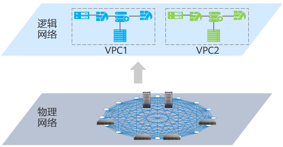
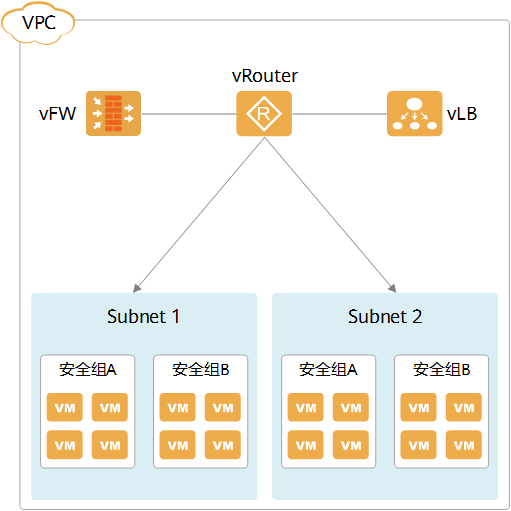
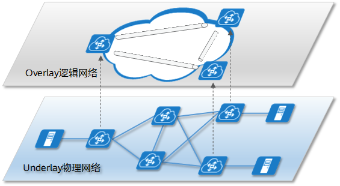

# 什么是VPC？

虚拟私有云[VPC](https://info.support.huawei.com/info-finder/encyclopedia/zh/M-LAG.html)（Virtual Private Cloud）是一套为云服务器、云容器、云数据库等云上资源构建的逻辑隔离的、由用户自主配置和管理的虚拟网络环境，旨在提升用户资源的安全性，简化用户的网络部署。

## 为什么需要VPC

随着云计算的不断发展，对虚拟化网络的要求越来越高，要求网络具有弹性（scalability）、安全性（security）、可靠性（reliability）和私密性（privacy）。传统的二层网络模型存在很多问题，其中最大的问题就是安全问题。二层网络内的所有设备默认是可以互通的，这就导致云主机很容易被同网络的其他用户恶意攻击。而[VPC](https://info.support.huawei.com/info-finder/encyclopedia/zh/M-LAG.html)能够在公共的网络资源上为每个用户隔离出一个专属的独立网络，用户的安全、隐私更容易得到保障，且用户可以灵活定义VPC内主机的IP地址、路由策略等。

*VPC网络模型*

## VPC的主要组成部分

每个[VPC](https://info.support.huawei.com/info-finder/encyclopedia/zh/M-LAG.html)为一个虚拟的网络环境，通过创建VPC将物理网络划分为逻辑网络，包含Subnet、vRouter、vFW等逻辑单元。

*VPC组成示意图*

Subnet：子网，是VPC中的一个网段，属于二层网络，一个VPC可以创建一个或者多个内部子网，用来分类管理有不同业务需求的云主机。VPC内部子网的云主机可以互通。

vRouter：[虚拟路由器](https://info.support.huawei.com/info-finder/encyclopedia/zh/虚拟路由器.html)，是VPC的网络枢纽，连接各个子网，同时也是各个子网的网关，实现子网之间的互通。

vFW：虚拟防火墙，用于保障VPC的网络安全，主要是控制进出子网或VPC的流量。

安全组：安全组功能类似于虚拟防火墙，都是用于保障VPC的网络安全，区别在于虚拟防火墙是基于子网或VPC级别的访问控制，而安全组是基于主机级别的访问控制。安全组是一个逻辑上的分组，为具有相同安全保护需求并相互信任的云主机提供访问策略。

## VPC的实现原理

[VPC](https://info.support.huawei.com/info-finder/encyclopedia/zh/M-LAG.html)是基于网络Overlay技术，在三层网络之上构建大二层网络来实现的。Overlay本意为叠加，即在原有物理网络（Underlay）基础上构建一个软件定义的虚拟的逻辑网络。Overlay本质上是一种L2 over IP的隧道封装技术，主要有[VXLAN](https://info.support.huawei.com/info-finder/encyclopedia/zh/VXLAN.html)、NVGRE等，基本原理是将主机发出的原始二层报文进行再次封装，然后在现有网络中进行透明传输，到达目的地后再解封装得到原始报文，转发给目标主机，从而实现主机间的二层通信。这就相当于一个大二层网络（Overlay）叠加在现有基础网络（Underlay）之上。

*Overlay网络概念示意图*