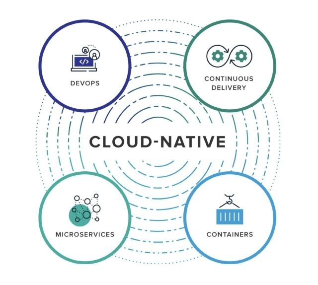

# 拥抱云原生

生态系统解读

[toc]

## 1 云计算的技术革命

互联网时代的历程

云计算到底是什么  

云计算不是新技术， 是一种新的互联网模式， 通过使用公有云或者私有云资源， 便捷、 快速的为我们提供服务  

在虚拟化、 分布式、 自动化平台上的更深层解决方案  

私有云、 公有云、 混合云， 4c8g 70-80%,裸金属  

“云” 中的资源在使用者看来是可以无限扩展的， 并且可以随时获取， 按需使用， 随时扩展， 按使用付费。 这种特性经常被称为像水电一样使用IT基础设施。  

### 1.1 云计算历程

CNCF Cloud Native Computing Foundation 云原生计算基金会

Building sustainable ecosystems for cloud native software 为云原生软件构建可持续发展的生态系统

IaaS：Infrastructure-as-a-Service 基础设施即服务

PaaS：Platform-as-a-Service 平台即服务

SaaS：Software-as-a-Service 软件即服务

CaaS：Container-as-a-Service 容器即服务  

### 1.2 云平台的优缺点  

优势

稳定性： 云平台大量资源， 分布式集群部署， 保障服务永不宕机， 几个9； 0.999999,1

弹性扩展： 按需索取， 一键秒级开通需要的资源

安全性： 云上平台生产级可用的完善权限系统

成本： 初期计算资源成本极低， 后期更是大量降低运维成本

易用性： 各大云商都有Web管理控制台， 可视化， 智能化便捷操作

 ...

缺点

公有云， 服务资源被第三方管理， 不符合特殊级别的安全场景

私有云， 搭建、 维护、 升级成本大

...

## 2 云计算技术的架构演进变革

### 2.1 体系变革

### 2.2 架构变革

#### 2.2.1 单体架构

#### 2.2.2 集群化架构阶段

#### 2.2.3 分布式架构阶段

分布式架构和集群架构的区别

把一个大型应用， 拆分出很多功能模块， 各个功能部署在不同服务器， 所有这些服务器合起来提供完整服务（108將） ： 分布式

吹出1000个一模一样的猴子： 集群

很多机器： 都可以叫集群

不同服务部署到不同服务器： 才能称为分布式

异地多活

#### 2.2.4 微服务架构

业务天然分库  

RPC： 远程调用  

网关： facade 门面模式、 外观模式  

网关的角色是什么? 

网关真正想做的只有一件事 : 对外暴露统一访问接口（宗旨）为了做成这件事,网关需要实现:

负载均衡、 协议转换、 用户鉴权、 牵扯到业务代码的相关东西， 这些nginx很难实现(脚本),一般nginx做前置负载均衡

gateway做更多的业务融合  

#### 2.2.5 网格化架构  ( service mesh )

## 3 云上的挑战

### 3.1 考虑的问题

云机器资源编排

云存储方案

云负载均衡方案

云缓存方案

云持久化

云运维

云监控

云容器技术

云DevOps

云安全防护

...

### 3.2 技术变革  

应用上云无关语言。  

CNCF： 倡导这个事情。  

CNCF蓝图

https://landscape.cncf.io/

技术变革

docker（没有实现CRI） 适配层（docker shim） 接口 Container Runtime Interface) k8s(CRI容器运行时

实现 CRI， 还是让我干掉.... 

2021年底的最后一次更新会替换掉.

docker容器的封装层。 containerd(runc)。 docker一定会兼容上k8s。容器的所有思想都是通用的。 容器、 镜像、 ........

Springcloud 只是对Java的应用的分布式上云的支持， 落地一大堆ServiceMesh 是任何应用上云的架构思想和编排理念。 落地实现一大堆

应用上云的新型架构就是： Kubernetes+ServiceMesh

## 4 云原生的生态系统

ServiceMesh

Serverless

### 常见技术

完整云原生平台基础研究量  

Docker、 Docker Compose： 容器化技术  `*****`

Kubernetes： 大规模容器编排 `*****`

Helm： 云原生应用商店

Rancher： 易用的容器管理平台

KubeSphere： 一站式容器云平台 

OpenTracing： 云原生链路追踪标准

Jaeger： 云原生链路追踪实现产品

Istio： ServiceMesh下的服务流量治理

Jenkins、 JenkinsX、 Jenkins-BlueOcean： 老牌的CI/CD平台 `****`

Gitlab/hub-CICD： Gitlab/hub自带的CICD

Argo： kubernetes声明式持续集成

Nexus： Maven私库

Habor： Docker私库  `***`

Prometheus+Grafana： 监控与可视化方案 `**`

ElasticSearch+Fluentd+Kibana： 日志与可视化方案 `**`

Serverless： 无服务器上云方案

SpringCloud Kubernetes： 微服务上云方案 `**`

## 5 云原生的术语

https://www.kdocs.cn/l/skIUQnbIc6cJ  

https://www.kdocs.cn/view/l/cixXZZZFJ0vy

## 云原生的定义

https://github.com/cncf/toc/blob/master/DEFINITION.md

云原生技术有利于各组织在公有云、 私有云和混合云等新型动态环境中， 构建和运行可弹性扩展的应用。 云原生的代表技术包括容器、 服务网格、 微服务、 不可变基础设施和声明式API(配置文件、 请求、 可视化操作....)。 云上配置文件

这些技术能够构建容错性好、 易于管理和便于观察的松耦合系统。 结合可靠的自动化手段， 云原生技术使工程师能够轻松地对系统作出频繁和可预测的重大变更。

云原生计算基金会（CNCF） 致力于培育和维护一个厂商中立的开源生态系统， 来推广云原生技术。 我们通过将最前沿的模式民主化， 让这些创新为大众所用。

kubesphere国内厂商

## 如何学好云原生

官方的指导建议

