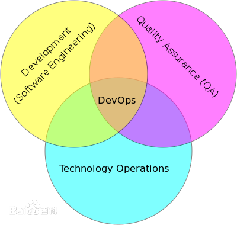
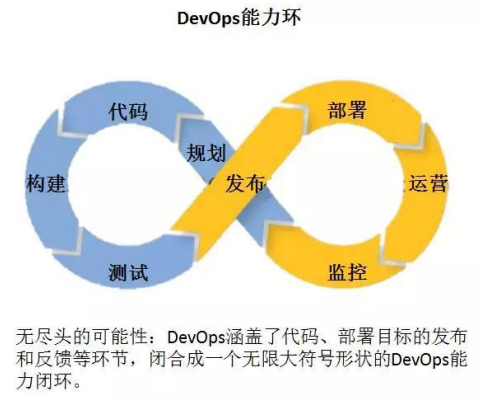
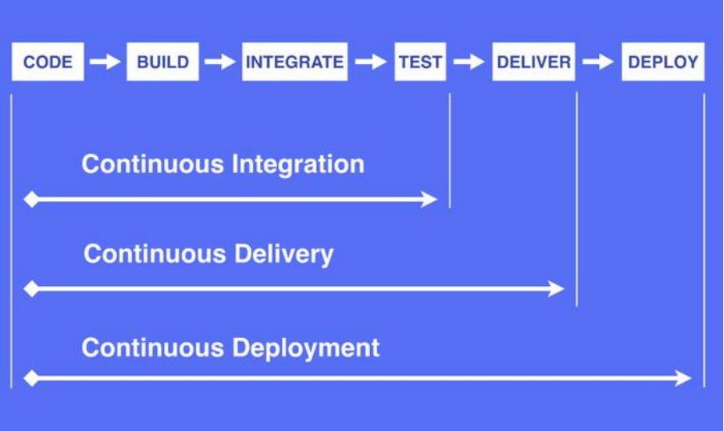
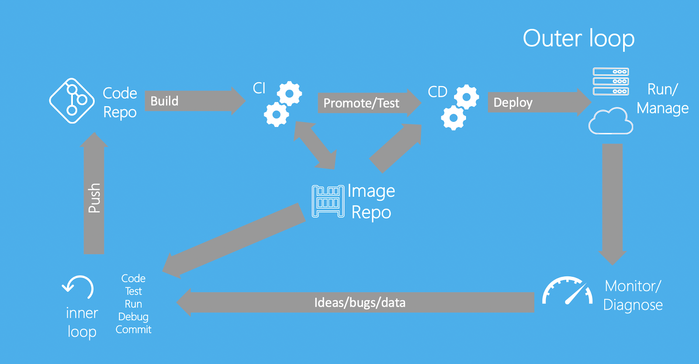
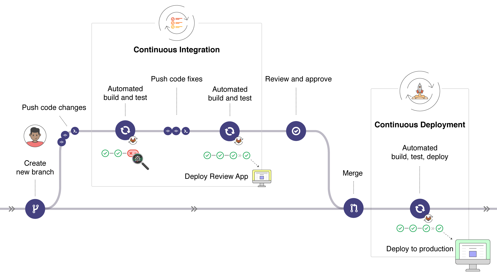

# DevOps

一、DevOps概念

1、DevOps是什么

Development和Operations的组合词；

DevOps: Development 和 Operations 的组合

DevOps 看作开发（软件工程）、技术运营和质量保障（QA）三者的交集。

突出重视软件开发人员和运维人员的沟通合作，通过自动化流程来使得软件构建、测试、 发布更加快捷、频繁和可靠。

DevOps 希望做到的是软件产品交付过程中 IT 工具链的打通，使得各个团队减少时间损 耗，更加高效地协同工作。专家们总结出了下面这个 DevOps 能力图，良好的闭环可以大大 增加整体的产出。

2、CICD是什么  

持续集成 持续部署  

1、基本理念  

1、持续集成（Continuous Integration）

持续集成是指软件个人研发的部分向软件整体部分交付，频繁进行集成以便更快地发现 其中的错误。“持续集成”源自于极限编程（XP），是 XP 最初的 12 种实践之一。

CI 需要具备这些：

全面的自动化测试。这是实践持续集成&持续部署的基础，同时，选择合适的 自动化测试工具也极其重要；

灵活的基础设施。容器，虚拟机的存在让开发人员和 QA 人员不必再大费周 折；

版本控制工具。如 Git，CVS，SVN 等；

自动化的构建和软件发布流程的工具，如 Jenkins，flow.ci；

反馈机制。如构建/测试的失败，可以快速地反馈到相关负责人，以尽快解决达到一个更稳定的版本。

2、持续交付（Continuous Delivery）

持续交付在持续集成的基础上，将集成后的代码部署到更贴近真实运行环境的「类生产环境」（production-like environments）中。持续交付优先于整个产品生命周期的软件部署，建立 在高水平自动化持续集成之上。

灰度发布。

持续交付和持续集成的优点非常相似：

快速发布。能够应对业务需求，并更快地实现软件价值。

编码->测试->上线->交付的频繁迭代周期缩短，同时获得迅速反馈；

高质量的软件发布标准。整个交付过程标准化、可重复、可靠，

整个交付过程进度可视化，方便团队人员了解项目成熟度；

更先进的团队协作方式。从需求分析、产品的用户体验到交互 设计、开发、测试、运维等角色密切协作，相比于传统的瀑布式软件团队，更少浪费。

3、持续部署（Continuous Deployment）

持续部署是指当交付的代码通过评审之后，自动部署到生产环境中。持续部署是持续交付的最高阶段。这意味着，所有通过了一系列的自动化测试的改动都将自动部署到生产环境。它也可以被称为“Continuous Release”。

“开发人员提交代码，持续集成服务器获取代码，执行单元测试，根据测试结果决定是否部署到预演环境，如果成功部署到预演环境，进行整体验收测试，如果测试通过，自动部署到产品环境，全程自动化高效运转。

持续部署主要好处是，可以相对独立地部署新的功能，并能快速地收集真实用户的反馈。

“You build it, you run it”，这是 Amazon 一年可以完成 5000 万次部署， 平均每个工程师每天部署超过 50 次的核心秘籍。

5000/365 = 15 万次

开发人员代码敲完。可以release的时候，提交代码， 剩下的全部一站式自动搞定

2、最佳实践

1、内循环与外循环

内循环（开发要做的事情）：

编码、测试、运行、debug、提交

代码推送到代码仓库（svn，git）【代码回滚】

进行CI过程（持续集成），万物皆可容器化。打包成一个Docker镜像

镜像推送到镜像仓库

测试持续部署流程（CD），拿到之前的镜像，进行CD。怎么放到各种环境。uat、test、prod

外循环（）

运行时监控

生产环境的管理

监控

线上反馈到开发

来到内循环

MVC：Model（bean,entity,to,po......） View(thymeleaf、前后分离....) Controller（xxxxx）

2、实践流程  

新功能，bug修复。

创建分支来做这个事情（开发功能）

提交分支的代码改变

进入持续集成流程

当前分支代码功能性自动化构建和测试

自动工具推送这次提交

自动化集成测试

可以看到效果

人工确认此次功能是否发布到生产环境

代码合并。

进入持续部署流程

构建、测试、发布......

3、CICD LandSpace

禅道  

