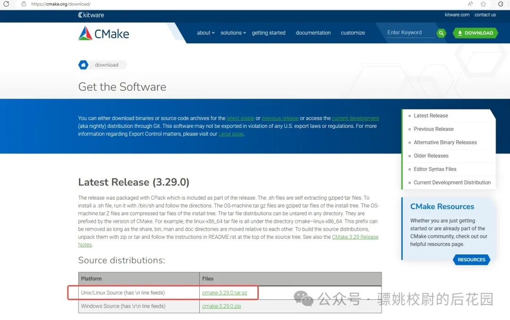
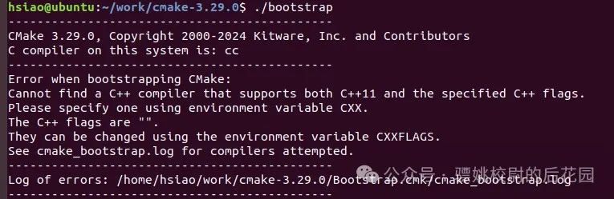
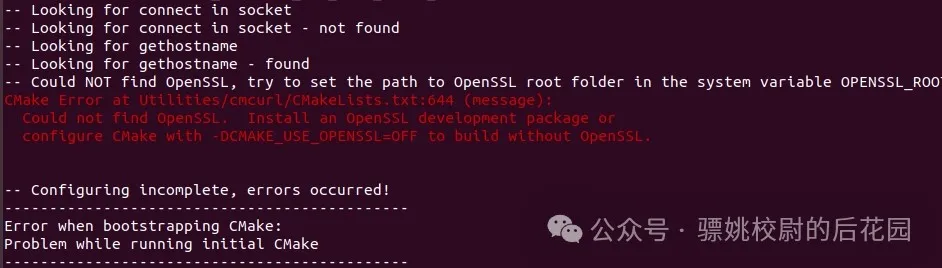
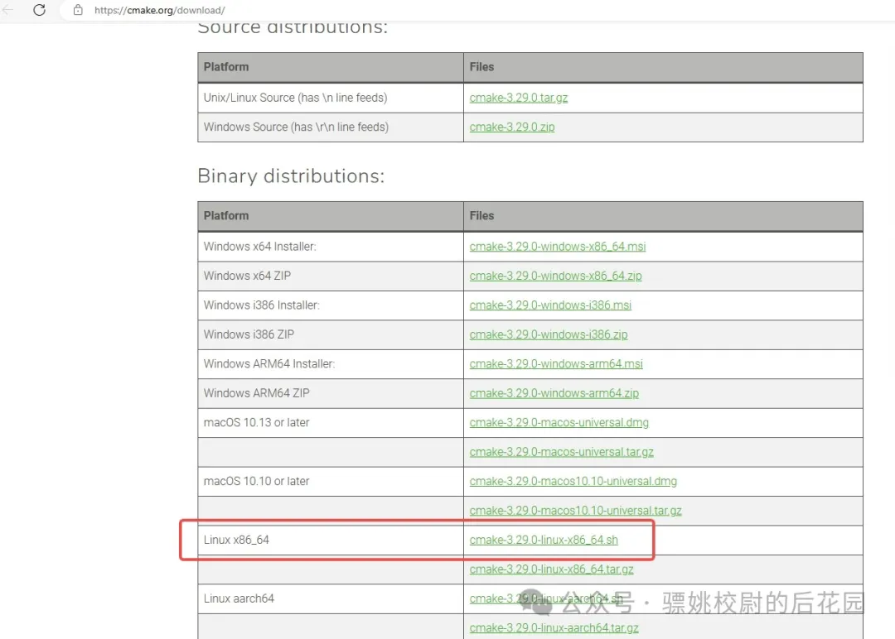
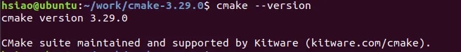

# CMake介绍以及安装方法

### 在平时工作开发的项目中，Makefile和CMake我都使用过，我个人偏向喜欢用CMake。因为CMake的跨平台性，还有其易移植、易维护等等特性。下面我们开始CMake的总结。

### **一、CMake介绍**

“CMake"这个名字是"cross platform make"的缩写。虽然名字中含有"make”，但是CMake和Unix上常见的"make"系统是分开的，而且更为高阶。

> 1、CMake是一个强大的跨平台的编译工具，它使用配置文件（CMakeLists.txt）来生成标准的构建文件，能够输出各种各样的makefile或者project文件。
>
> 
> 2、CMake并不直接构建出最终的软件，而是生成标准的Makefile文件或者VisualStudio项目文件，然后再使用Make或者VisualStudio进行编译。
>
> 
> 3、CMake在Windows平台上生成VisualStudio项目文件，在Linux和Unix平台上生成Makefile文件。

### **二、CMake和Makefile的优缺点**

CMake和Makefile都是用于自动化软件构建过程的工具，但是它们在设计哲学、使用方式以及支持的特性上有着明显的不同。下面对两者做一个优缺点的比较：

#### **1、CMake**

**优点：**

> **跨平台:** CMake可以为不同的编译环境生成相应的构建文件，如Unix Makefiles、Ninja、Visual Studio项目等。
>
> 
>
> **便捷的语法:** CMakeLists.txt文件有着较为简单和易读的语法，易于编写和维护。
>
> 
>
> **高级功能:** CMake提供了丰富的功能，如自动查找依赖库、编译器特性检测、测试和打包等，大大简化了多平台构建的复杂性。
>
> 
>
> **可重用性:** CMake中可以创建模块化的构建脚本，易于在多个项目之间共享和复用。
>
> 
>
> **图形界面:** 对于不熟悉命令行操作的用户，CMake提供了图形化界面工具（cmake-gui）。

**缺点：**

> **学习曲线:** 对于新手来说，CMake的高级特性和内部工作机制需要一定的学习和实践才能掌握。
>
> 
>
> **重度抽象:** CMake定义了许多高级的构建概念，对于需要细粒度控制构建过程的情况，可能会显得过于复杂。
>
> 
>
> **版本兼容性:** CMake的不同版本之间存在差异，某些指令在不同版本的支持程度可能不同，需要注意。

#### **2、Makefile**

**优点：**

> **精细控制:** Makefile为开发人员提供了对构建过程的细粒度控制，可以精确定义编译规则及其依赖关系。
>
> 
>
> **广泛应用:** Make是UNIX和Linux环境中传统且广泛使用的构建工具，有丰富的文档和社区支持。
>
> 
>
> **简洁直接:** 对于小型项目来说，编写一个简单的Makefile通常更直接。
>
> 
>
> **无需额外工具:** 几乎所有的UNIX-like系统都预装了make工具，无需安装其他软件即可使用。

***\*缺点\**：**

> **可移植性差:** Makefile通常和操作系统以及具体的shell环境绑定，需要为不同平台编写不同的Makefile。
>
> 
>
> **可读性:** 对于大型项目，Makefile可能会非常复杂，难以读懂和维护，特别是在包含多个目标和复杂依赖关系时。
>
> 
>
> **重复劳动:** 跨平台项目可能需要维护几套不同的Makefile，增加了工作量。
>
> 
>
> **功能限制:** 相对于CMake，Make本身的功能较为基础，对于复杂的构建过程需要手动编写大量规则。

  总结来说，CMake提供了更加抽象和高级的构建系统，对于跨平台的大型项目而言，其易用性和功能强大是巨大的优势。而Makefile对于小型项目和需要精确控制的构建过程也有它的用武之地。在具体选择时，需根据项目的实际需要、目标平台、团队的熟悉程度等因素综合考虑。

### **三、ubuntu安装CMake的几种方法**

#### **1、命令行安装**

```
sudo apt-get update
sudo apt install cmake
```

  注意：此种方式安装的可能不是最新版本的CMake

#### **2、CMake源码编译安装**

先检查是否有cmake

【1】下载CMake源码。

CMake源码下载地：https://cmake.org/download/



【2】解压CMake源码。

```
tar -zxvf cmake-3.29.0.tar.gz
```

【3】进入解压后的CMake源码文件，执行bootstrap。

```
./bootstrap
```

可能会报以下错误：

提示找不到C++编译器，执行以下命令安装一下即可：

```
sudo apt-get install g++
```

然后重新执行./bootstrap

可能会报以下错误：

提示安装 OpenSSL 开发包或使用 -DCMAKE_USE_OPENSSL=OFF 配置 CMake 以在不使用 OpenSSL 的情况下进行构建。选择安装开发包，执行以下指令即可：

```
sudo apt-get install libssl-dev
```

然后再次执行./bootstrap

【4】编译CMake源码。

```
make
```

【5】安装

```
sudo make install
```

#### **3、sh安装**

下载指定版本的sh文件：https://cmake.org/download/



安装指令：

```
./cmake-3.29.0-linux-x86_64.sh
```

``

### **四、 验证安装版本**

执行命令：

```
cmake --version
```


出现以下版本信息说明安装成功，可是开始使用了。