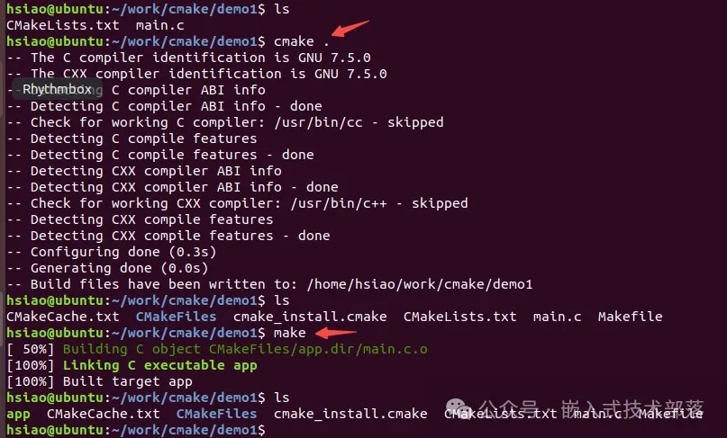
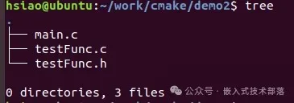
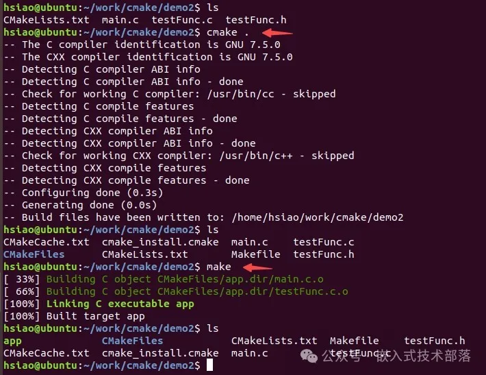
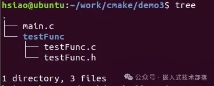
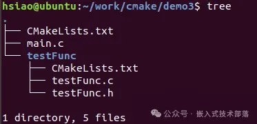
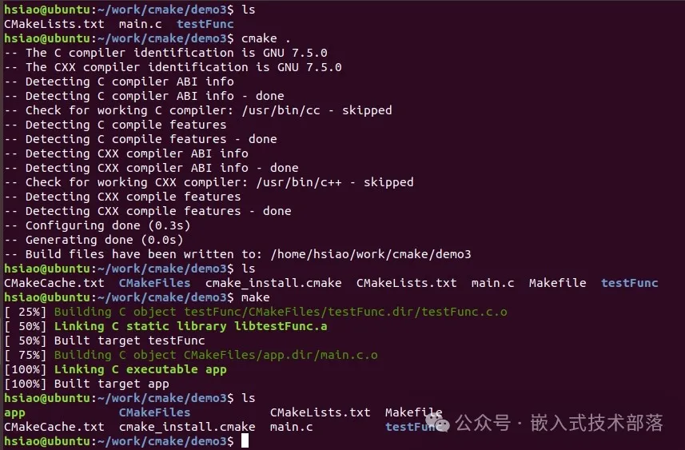

# 实例入手，讲解CMake的基本流程

上一篇文章，我们对什么是CMake、CMake和Makefile优缺点、CMake安装方法进行了总结，本篇文章则开始对CMake的使用流程进行总结，以实例demo入手，以便读者阅读后能快速的上手去操作和运用。

**一、CMake基本流程总结**

在 linux 平台下使用 CMake 的基本流程如下：

> 1、编写 CMake 配置文件 CMakeLists.txt 。
>
> 2、执行命令 cmake PATH。其中， PATH 是 CMakeLists.txt所在的目录。
>
> 3、使用 make 命令进行编译。

### 二、入门实例

#### 1、同一目录，单个源文件

编写一个简单的项目代码“main.c”，该程序的用途是打印“hello world”

```cpp
#include <stdio.h>

void testFunc()
{
    printf("hello world\n");
}

int main(int argc, char *argv[])
{
    testFunc();
}
```

**【1】编写CMakeLists.txt**
编写CMakeLists.txt，保存在与main.c同个目录下：                

```
# CMake最低版本号要求
cmake_minimum_required(VERSION 3.8.2)

# 项目信息
project(demo)

# 指定生成目标app
add_executable(app main.c)
```

CMakeLists.txt 的语法比较简单，由命令、注释和空格组成，其中命令是不区分大小写的。符号 # 后面的内容被认为是注释。命令由命令名称、小括号和参数组成，参数之间使用空格进行间隔。


对于上面的 CMakeLists.txt 文件，依次出现了几个命令：

> cmake_minimum_required：指定运行此配置文件所需的 CMake 的最低版本，如果安装的版本低于指定的版本则不能正常编译。
>
> project：参数值是 demo，该命令表示项目的名称是 demo 。
>
> add_executable：将名为 main.c 的源文件编译成一个名称为 app 的可执行文件。

**【2】执行命令cmake，生成Makefile**
在当前目录执行CMake . ，生成Makefile 。

**【3】执行命令make编译项目**
编译得到了app可执行文件。

**以上操作流程如下图：**



#### 2、同一目录，多个源文件

现在把上面例子中的testFunc()函数单独写进一个名为testFunc.c的文件里，工程目录如下图：



main.c内容如下

```
#include <stdio.h>
#include "testFunc.h"

int main(int argc, char *argv[])
{
    testFunc();
}
```

testFunc.c内容如下                                     

```
#include <stdio.h>

void testFunc()
{
    printf("hello world\n");
}
```

testFunc.h内容如下

```
#ifndef __TEST_FUNC_H
#define __TEST_FUNC_H

void testFunc(void);

#endif
```

此时，CMakeLists.txt的内容改为如下方式：

```
# CMake最低版本号要求
cmake_minimum_required(VERSION 3.8.2)

# 项目信息
project(demo)

# 指定生成目标app
add_executable(app main.c testFunc.c)
```

可以看到，唯一的改动只是在add_executable命令中增加了一个testFunc.c 文件。如果源文件很多，把所有源文件的名字都加进去将是一件烦人的工作。更省事的方法是使用aux_source_directory 命令，该命令会查找指定目录下的所有源文件，然后将结果存进指定变量名。其语法如下：

- 

```
aux_source_directory(<dir> <variable>)
```

因此，可以修改CMakeLists.txt如下：

```
# CMake最低版本号要求
cmake_minimum_required(VERSION 3.8.2)

# 项目信息
project(demo)

# 查找当前目录下的所有源文件,并将名称保存到FILE_SRCS 变量
aux_source_directory(. FILE_SRCS)

# 指定生成目标
add_executable(app ${FILE_SRCS})
```

**之后如上面实例的步骤，执行cmake，执行make**
**以上操作流程如下图：**

****

#### 3、多个目录，多个源文件

现在进一步把上面实例中的testFunc.c和testFunc.h两个文件移动到testFunc目录中。



对于这种情况，需要分别在项目根目录demo3和 testFunc目录里各编写一个 CMakeLists.txt文件。



为了方便，我们可以先将testFunc目录里的文件编译成静态库再由main函数调用。

根目录中的CMakeLists.txt：

```
# CMake最低版本号要求
cmake_minimum_required(VERSION 3.8.2)

# 项目信息
project(demo)

# 查找当前目录下的所有源文件,并将名称保存到FILE_SRCS 变量
aux_source_directory(. FILE_SRCS)

# 添加testFunc子目录
add_subdirectory(testFunc)

# 指定生成目标app 
add_executable(app main.c)

# 添加链接库
target_link_libraries(app testFunc)
```

该文件使用命令add_subdirectory指明本项目包含一个子目录 testFunc，这样 testFunc目录下的 CMakeLists.txt 文件和源代码也会被处理 。使用命令 target_link_libraries 指明可执行文件 app需要连接一个名为 testFunc的链接库 。


子目录中的 CMakeLists.txt：

```
# 查找当前目录下的所有源文件,并将名称保存到 DIR_LIB_SRCS 变量
aux_source_directory(. DIR_LIB_SRCS)
# 生成链接库
add_library(testFunc ${DIR_LIB_SRCS})
```

在该文件中使用命令add_library将src目录中的源文件编译为静态链接库。

**之后如上面实例的步骤，执行cmake，执行make**
**以上操作流程如下图：**

****                           