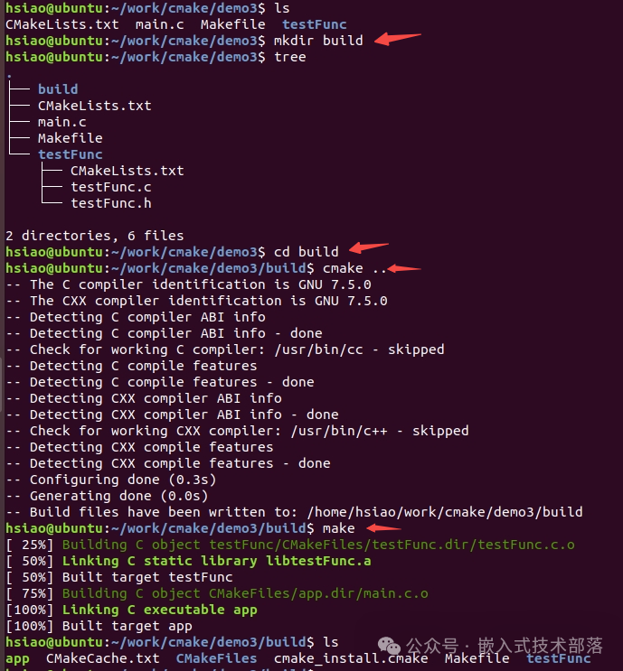

# CMake常用指令

本来此篇文章想总结学习CMake链接静态库和动态库的知识点，但是发现，还是需要对一些指令先总结学习，熟悉一下，这样之后在对CMake链接静态库和动态库的总结学习就会容易得多。毕竟，磨刀不误砍柴工。针对CMake链接静态库和动态库的内容就改到下篇文章进行，此篇文章总结CMake常用的指令。

**一、out-of-source 构建**

在上篇文章中，我们以实例入手，详细的总结了CMake的基本流程，但是，我们发现一个问题，就是CMake在构建过程中会产生一些临时文件、中间文件和构建系统文件，这些文件和源代码在一个目录里，使的源代码文件混乱，不够整洁，影响了源代码目录的整洁性、可维护性和灵活性。

那么如何处理才能不影响源代码目录呢？在使用CMake构建项目时，通常建议在一个单独的目录中进行构建，这通常被称为"out-of-source"或"out-of-tree"构建。这样做可以使源代码目录保持干净，方便管理和维护。以下是在build目录中使用CMake构建项目的详细步骤：

> 1、创建一个build目录：在项目的根目录下创建一个用于构建的新目录。
>
>  **mkdir build**
>
> 2、进入build目录：使用命令行进入新创建的build目录。
>
>  **cd build**
>
> 3、运行CMake：CMake会生成相应的构建系统文件（如Makefile）。
>
>  **cmake ..**
>
> 4、运行make：构建项目，生成可执行文件或其他构建目标。
>
>  **make**
>
>  构建完成后，在构建目录中会生成可执行文件或其他构建目标。通过这些步骤，你就可以在一个独立的build目录中使用CMake来构建你的项目。这种做法有助于保持项目结构的清晰和整洁。

以上篇文章的demo3为例：



下面我们来总结CMake链接静态库和动态库的内容。
    在编写程序的过程中，可能会用到一些系统提供的动态库或者自己制作出的动态库或者静态库文件，CMake 中也为我们提供了相关的编译和链接库的指令。

**二、指令详解**

**1、add_library**

  add_library 是 CMake 构建系统中用于定义一个新的库目标的指令，将指定的源文件编译成目标库。它允许您创建静态库、共享库或模块库，以供后续链接到其他目标中。库目标可以在后续的 target_link_libraries 指令中被链接到其他目标中。

**【1】基本语法**

```
add_library(target_name 
            [STATIC | SHARED | MODULE] 
            [source1 [source2 [...]]]
            [...])
```

**【2】参数含义**

> **target_name**：新库目标的名称，可以是任意有效的 CMake 目标名称。
>
> 
>
> **STATIC | SHARED | MODULE**：指定要创建的库的类型。可选的类型包括：
>
> STATIC：静态库，会在链接时静态地嵌入到可执行文件中。
>
> SHARED：共享库（动态库），会在运行时动态加载。
>
> MODULE：模块库，类似于共享库，但用于加载时插件。
>
> 如果未提供类型，则默认为 STATIC。
>
> 
>
> **source1, source2, …**：用于构建库的源文件列表。

**【3】示例**

```
# 创建一个名为 my_lib 的静态库，包含两个源文件
add_library(my_lib STATIC source1.cpp source2.cpp)

# 创建一个名为 my_shared_lib 的共享库，包含一个源文件
add_library(my_shared_lib SHARED source3.cpp)

# 创建一个名为 my_module 的模块库，包含一个源文件
add_library(my_module MODULE source4.cpp)
```

**2、target_link_libraries**

target_link_libraries 是 CMake 构建系统中一个非常重要的指令，作用是将目标与它所依赖的库文件或其他目标进行链接，最终生成可执行文件或库。当构建目标时，CMake 将自动检测所链接的库文件或目标的位置，并将它们与目标进行关联。

通过使用 target_link_libraries，您可以方便地管理项目中目标之间的依赖关系，使得构建过程更加清晰和可维护。

**【1】基本语法**

```
target_link_libraries(target_name 
                      [item1 [item2 [...]]]
                      [...])
```

**【2】参数含义**

> **target_name：**要链接的目标的名称，可以是可执行文件、静态库、动态库等。
>
> 
>
> **item1, item2, …：**要链接的内容，可以是以下类型之一：
>
> **库名称**：链接一个外部库，比如 pthread、m 等。
>
> **目标名称**：链接另一个 CMake目标，可以是同一 CMakeLists.txt 文件中定义的目标，也可以是其它 CMake 项目中定义的目标。
>
> **文件路径**：链接一个特定的文件路径，比如一个静态库文件或动态库文件。

**【3】示例**

```
# 指定可执行文件 target_name 需要链接的库
target_link_libraries(target_name library1 library2)

# 指定目标 target_name 需要链接的另一个 CMake 目标
target_link_libraries(target_name other_target)

# 指定目标 target_name 需要链接的库文件路径
target_link_libraries(target_name /path/to/library/liblibrary.a)
```

**3、link_directories**

  link_directories是一个CMake指令，用于指定编译器在链接时查找库文件的目录。当您使用CMake构建项目时，通常需要链接一些库文件，这些库文件可能位于您的系统中的不同位置。使用link_directories命令可以告诉CMake在编译链接时去哪里搜索这些库文件。

**【1】基本语法**

```
link_directories(directory1 directory2 ...)
```

**【2】参数含义**

> **directory1，directory2…****：**是您希望编译器在链接时搜索库文件的目录列表。

**【3】示例**

  例如，假设您的项目依赖于一个名为libexample.a的库文件，而这个库文件位于/path/to/example/lib目录下。您可以使用link_directories命令告诉CMake在链接时搜索这个目录：

```
link_directories(/path/to/example/lib)
```

然后，在您的CMakeLists.txt文件中，您可能会使用target_link_libraries命令将这个库文件链接到您的可执行文件中：

```
target_link_libraries(your_executable_name example)
```

这样，CMake在构建时就会知道在哪里找到名为libexample.a的库文件，并将其链接到您的可执行文件中。

**4、include_directories**

  include_directories 是 CMake 中的另一个常用命令，用于指定编译器在编译过程中查找头文件的目录。当您使用 CMake 构建项目时，您可能会有许多头文件位于不同的目录中，这些头文件可能是您自己的项目中的头文件，也可能是您依赖的库的头文件。使用 include_directories 命令可以告诉 CMake 在编译时去哪里搜索这些头文件。

**【1】基本语法**

```
include_directories(directory1 directory2 ...)
```

**【2】参数含义**

> **directory1, directory2…****：**是您希望编译器在编译时搜索头文件的目录列表。

**【3】示例**

  例如，假设您的项目的源文件中包含了一个名为 example.h 的头文件，而这个头文件位于 /path/to/example/include 目录下。您可以使用 include_directories 命令告诉 CMake 在编译时搜索这个目录：

```
include_directories(/path/to/example/include)
```

  这样，当您在源文件中包含 example.h 头文件时，编译器就能够找到它。您可以在您的 CMakeLists.txt 文件中多次使用 include_directories 命令，以指定多个头文件目录。

**5、message**

  在CMake中，message指令用于在构建过程中输出消息到标准输出流。这个指令通常用于调试和显示一些提示信息，以帮助用户了解构建过程中的状态或变量值。message指令是CMake中一个非常有用的工具，可以帮助您更好地了解和调试项目的构建过程。

**【1】基本语法**

```
message([<mode>] "message to display" ...)
```

**【2】参数含义**

> **mode：**是可选的参数，用于指定消息的级别。CMake支持四种不同级别的消息输出：
>
> 
>
> **STATUS**：输出一般的状态信息。
>
> 
>
> **WARNING：**输出警告信息，用于提示用户可能的问题或错误。
>
> 
>
> **AUTHOR_WARNING：**输出作者警告信息，通常用于指出可能影响到项目的重要问题。
>
> 
>
> **FATAL_ERROR：**输出致命错误信息，并停止CMake过程。
>
> 如果不指定<mode>，默认情况下消息会以STATUS级别输出。

**【3】示例**

要输出一条状态消息：

```
message(STATUS "This is a status message.")
```

要输出一条警告消息：

```
message(WARNING "This is a warning message.")
```

要输出一条致命错误消息：

```
message(FATAL_ERROR "This is a fatal error message.")
```

通常，message指令会与变量、条件语句等结合使用，以在构建过程中显示特定的信息或调试信息。例如，您可以使用message指令输出变量的值，以便在构建过程中检查其是否设置正确。

```
set(my_variable "Hello, World!")
message(STATUS "The value of my_variable is: ${my_variable}")
```

这将输出一条状态消息，显示变量my_variable的值。

**6、set**

  在CMake中，set命令用于设置变量的值。这个命令非常灵活，可以用于创建、修改、删除各种类型的变量，包括普通变量、列表、缓存变量等。set命令是CMake中一个非常基础而且强大的命令，您可以用它来管理各种类型的变量，从而灵活地控制项目的行为和配置。

**【1】基本语法**

```
set(<variable> <value>... [CACHE <type> <docstring> [FORCE]])
```

**【2】参数含义**

> **variable：**是要设置的变量名。
>
> 
>
> **value：**是要给变量赋予的值。您可以将一个或多个值分配给变量。
>
> 
>
> **CACHE：**可选的CACHE参数用于创建一个缓存变量，这种变量的值可以由用户在命令行或GUI中设置。
>
> 
>
> **type**：指定了缓存变量的类型，可以是STRING、FILEPATH、PATH、BOOL等。
>
> 
>
> **docstring：**是对变量的描述，用于显示在用户界面上。
>
> 
>
> **FORCE：**表示如果该变量已经存在，是否强制覆盖其值。

**【3】示例**

使用set命令，您可以做很多事情，例如：

创建一个普通变量并给它赋值：

```
set(my_variable "Hello, World!")
```

创建一个列表变量：

```
set(my_list_var "item1" "item2" "item3")
```

修改现有变量的值：

```
set(my_variable "New value" CACHE STRING "Description" FORCE)
```

创建一个缓存变量：

```
set(my_cached_variable "Default value" CACHE STRING "Description")
```

删除变量：

```
unset(my_variable)
```

**7、CMakecmake_minimum_required**

指定 cmake 的最小版本

```
cmake_minimum_required(VERSION 3.4.1)
```

这行命令是可选的，我们可以不写这句话，但在有些情况下，如果 CMakeLists.txt 文件中使用了一些高版本 cmake 特有的一些命令的时候，就需要加上这样一行，提醒用户升级到该版本之后再执行 cmake。

**8、project**

设置项目名称

```
project(demo)
```

这个命令不是强制性的，但最好都加上。它会引入两个变量 demo_BINARY_DIR 和 demo_SOURCE_DIR，同时，cmake 自动定义了两个等价的变量 PROJECT_BINARY_DIR 和 PROJECT_SOURCE_DIR。

**PROJECT_SOURCE_DIR：**这个变量表示的是 CMake 运行 project()指令的那个目录，通常是项目的顶层目录。值得注意的是，CMake 支持在项目中嵌套 project() 指令，而PROJECT_SOURCE_DIR 只会被设置为最近一次执行 project() 指令的目录。

**CMAKE_CURRENT_SOURCE_DIR****：**这个变量表示的是正在处理的 CMakeLists.txt文件的所在目录。无论当前正在处理哪个子目录下的 CMakeLists.txt，CMAKE_CURRENT_SOURCE_DIR总是表示这个子目录。当你返回到上一级目录处理 CMakeLists.txt 时，其值会自动还原。

如果你在编写 CMakeLists.txt 时，需要引用项目的顶层目录，那么应该使用 PROJECT_SOURCE_DIR; 如果你需要引用正在处理的 CMakeLists.txt文件的所在目录，那么应该使用 CMAKE_CURRENT_SOURCE_DIR。

**9、add_executable**

  add_executable 是 CMake 的一个命令，用于在当前的 CMakeLists.txt 文件中定义一个可执行文件的构建规则。它告诉 CMake 如何将源文件编译成可执行文件。

  通常，add_executable 被用于指定一个或多个源文件，用于构建一个可执行程序。这些源文件通常包含程序的主要逻辑和功能实现。如果需要，可以在调用 add_executable 之后，使用 target_link_libraries 命令来指定链接到可执行文件的库。

**【1】基本语法**

```
add_executable(executable_name source1 [source2 ...])
```

**【2】参数含义**

> **executable_name** ：是生成的可执行文件的名称
>
> 
>
> **source1, source2…****：**则是源文件的名称。

**【3】示例**

例如，以下示例将创建一个名为 my_program 的可执行文件，其源文件为 main.c：

```
add_executable(my_program main.c)
```

这样，当使用 CMake 构建项目时，会生成一个名为 my_program 的可执行文件，该文件包含 main.c中的代码，并且可以通过指定的编译器选项和链接选项进行编译。

**10、aux_source_directory**

  aux_source_directory 是 CMake 的一个命令，用于将一个目录中的所有源文件（.cpp、.c、.cxx 等）自动添加到当前项目的构建规则中。

  当调用 aux_source_directory 时，CMake 会自动扫描指定目录中的所有源文件，并将它们的文件名添加到指定的变量中。这样，这些源文件就会被包含到当前项目的构建规则中，从而参与到生成可执行文件或库的过程中。

  通常情况下，aux_source_directory 用于简化 CMakeLists.txt 文件中的源文件管理。通过这个命令，您无需手动列举每个源文件，而是可以让 CMake 自动识别目录中的所有源文件，并将它们添加到构建中。

**【1】基本语法**

```
aux_source_directory(dir VARIABLE)
```

**【2】参数含义**

> **dir** **：**是要搜索源文件的目录
>
> 
>
> **VARIABLE****：**是一个存储源文件列表的变量名。

**【3】示例**

例如，以下示例将搜索 src 目录中的所有源文件，并将它们存储在一个名为 SOURCES 的变量中：

```
aux_source_directory(src SOURCES)
```

这样，变量 SOURCES 中将包含 src 目录中的所有源文件的文件名

**11、add_subdirectory**

  add_subdirectory是CMake 的一个命令，用于在当前的 CMakeLists.txt 文件中添加另一个子目录的 CMakeLists.txt 文件，从而将其包含到当前项目的构建中。

  当调用 add_subdirectory 时，CMake 会进入指定的子目录，并在那个子目录的 CMakeLists.txt 文件中执行相应的命令，包括添加源文件、设置编译选项、链接库等。这样，子目录中的项目就会被纳入到父项目的构建过程中。

  通常，add_subdirectory 会在父项目的 CMakeLists.txt 文件中用于组织大型项目，将其拆分为多个子目录，每个子目录负责管理特定部分的代码或功能。这样可以提高项目的可维护性和可读性，同时也可以使得构建系统更加模块化和灵活。

**【1】基本语法**

```
add_subdirectory(directory)
```

**【2】参数含义**

> **directory** **：**是要添加的子目录的路径。通常，这个路径是相对于当前 CMakeLists.txt 文件的路径。

**【3】示例**

上篇文档的demo里的用到的

```
add_subdirectory(testFunc)
```

**12、list**

  list 是 CMake 中用于处理和操作列表的命令。CMake 中的列表是一种用来存储一组数据元素的数据结构。每个元素都可以是一个字符串。

以下是 list 命令的常见用法和功能：

1、创建一个列表：

你可以使用 set 命令将一组字符串赋值给一个变量，并同时创建一个列表。示例：

```
set(my_list "apple" "banana" "orange")
```

2、合并两个或多个列表：

使用 list(APPEND <list_var> [ …]) 命令可以将多个值添加到一个现有列表中，从而合并多个列表。示例：

```
set(list1 "apple" "banana")
set(list2 "orange" "grape")
list(APPEND merged_list ${list1} ${list2})
```

3、访问列表的元素：

可以使用索引或迭代的方式访问列表中的元素。示例：

```
set(my_list "apple" "banana" "orange")
message(STATUS "First element: ${my_list[0]}")
foreach(item IN LISTS my_list)
message(STATUS "Current item: ${item}")
endforeach()
```

4、 获取列表的长度：

使用 list(LENGTH <list_var> <output_variable>) 命令可以获取列表的长度。示例：

```
set(my_list "apple" "banana" "orange")
list(LENGTH my_list list_length)
message(STATUS "Length: ${list_length}")
```

5、删除列表中的元素：

使用 list(REMOVE_ITEM <list_var> [ …]) 命令可以从列表中删除特定的元素。示例：

```
set(my_list "apple" "banana" "orange")
list(REMOVE_ITEM my_list "banana")
```

  以上只是 list 命令的一些常用功能，还有其他一些相关的命令和选项，可以根据需要查阅 CMake官方文档获取更详细的信息。

  总结：list 命令在 CMake 中用于处理和操作列表。它可以创建列表、合并列表、访问列表的元素、获取列表的长度以及删除列表中的元素等。可以根据具体的需求使用适当的 list命令来操作列表。

  关于CMake的指令先总结到此，目前总结的都是比较常用的指令，下篇文章我们开始总结CMake如何链接静态库和动态库。