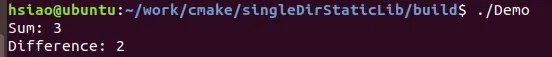
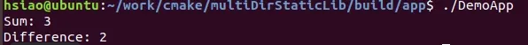
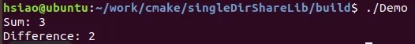
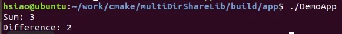
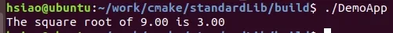
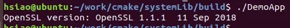
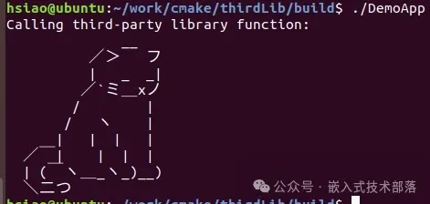

# CMake链接静态库和动态库

如上一篇文章所言，本章开始对CMake如何链接静态库和动态库，进行总结、研究和分享。

  在编写程序的过程中，可能会用到一些系统提供的库，或者自己制作出的库，或者是第三方提供的库，cmake 中也为我们提供了相关的编译链接库的命令。

  上一篇文章，我们对加载库的命令已做了详细的介绍，本章利用这些命令来进行实战演示。

#### 一、编译链接静态库

##### **1、同一个目录**

  在一个单目录项目中链接静态库相对简单，因为所有内容都位于同一个目录中。下面我将通过一个简单的例子来展示如何在单个目录中使用CMake来链接静态库。

项目结构如下：

```
project
├── CMakeLists.txt
├── math_functions.c
└── main.c
```

这里，math_functions.c包含了我们想要编译成静态库的函数，而main.c 是使用这些函数的主程序。

**【1】、创建静态库源代码**

创建一个名为 math_functions.c的文件，内容如下：

```
// math_functions.c
int add(int a, int b) 
{
    return a + b;
}

int subtract(int a, int b) 
{
    return a - b;
}
```

**【2】、编写CMake配置文件**

在项目的根目录下创建一个 CMakeLists.txt 文件，内容如下：

```
cmake_minimum_required(VERSION 3.10)
# 设置项目名称和版本
project(DemoProject VERSION 1.0)

# 创建静态库
add_library(math STATIC math_functions.c)

# 创建可执行文件
add_executable(Demo main.c)
# 链接静态库到可执行文件
target_link_libraries(Demo PRIVATE math)
```

**【3】、创建主程序源代码**
创建一个名为 main.c 的文件，内容如下：

```
#include <stdio.h>

// 声明来自静态库的函数
int add(int a, int b);
int subtract(int a, int b);

int main() {
    int sum = add(1, 2);
    int difference = subtract(4, 2);

    printf("Sum: %d\n", sum);
    printf("Difference: %d\n", difference);

    return 0;
}
```

**【4】、构建项目**

在终端（命令行）中，进入到项目目录，并运行以下命令来构建项目：

```
mkdir build
cd build
cmake .
make
```

这将使用 CMakeLists.txt 文件中定义的规则来构建静态库和可执行文件。首先，它会创建一个名为 libmath.a 的静态库文件，然后创建可执行文件 Demo。

**【5】、运行**

构建成功后，在命令行中运行生成的可执行文件（例如 ./Demo），你应该会看到输出显示了求和和减法的结果。



通过这个过程，你可以看到如何使用CMake来链接静态库并在C语言项目中使用它。

##### **2、多个目录**

在CMake中，当项目结构变得复杂，涉及多个目录时，组织代码和库变得尤为重要。这里，我将引导你完成一个多目录项目的创建过程，这个项目将包含一个静态库和一个使用该库的主程序。这个项目的结构如下：

```
project/
│
├── CMakeLists.txt  (根CMake文件)
│
├── math/
│   ├── CMakeLists.txt
│   └── math_functions.c
│
└── app/
    ├── CMakeLists.txt
    └── main.c
```

**【1】、创建静态库的源代码**

在 math 目录中，创建 math_functions.c，内容如下：

```
// math_functions.c
int add(int a, int b) {
    return a + b;
}

int subtract(int a, int b) {
    return a - b;
}
```

同样在 math 目录下，创建一个 CMakeLists.txt 文件来构建这个静态库：

```
# 设置这个目录项目的最低版本
cmake_minimum_required(VERSION 3.10)

# 定义一个库 math，它是一个静态库
add_library(math STATIC math_functions.c)
```

**【2】、创建主程序的源代码**
在 app 目录中，创建 main.c，内容如下：

```
#include <stdio.h>

// 声明来自静态库的函数
int add(int a, int b);
int subtract(int a, int b);

int main() {
    int sum = add(1, 2);
    int difference = subtract(4, 2);

    printf("Sum: %d\n", sum);
    printf("Difference: %d\n", difference);

    return 0;
}
```

在 app 目录中，创建一个 CMakeLists.txt 文件来构建这个主程序，并链接之前创建的静态库：

```
cmake_minimum_required(VERSION 3.10)
# 定义一个可执行文件
add_executable(DemoApp main.c)
# 链接 math 静态库
target_link_libraries(DemoApp PRIVATE math)
```

**【3】、根目录的 CMakeLists.txt**

在项目的根目录中，创建一个 CMakeLists.txt 文件来包含其他子目录：

```
cmake_minimum_required(VERSION 3.10)
project(DemoProject VERSION 1.0)
# 添加 math 目录
add_subdirectory(math)
# 添加 app 目录
add_subdirectory(app)
```

**【4】、构建项目**
在项目的根目录下，打开终端（命令行），执行以下命令来构建项目：

```
mkdir build
cd build
cmake ..
make
```

这将首先构建 math 静态库，然后构建主程序 DemoApp，并自动处理链接。

**【5】、运行**
构建完成后，你可以在命令行中运行生成的 DemoApp 可执行文件。如果一切设置正确，它应该会显示求和和减法的结果。



这个多目录的设置使得项目更加模块化，便于管理和扩展。每个目录可以专注于项目的一个逻辑部分，使得整个项目结构更清晰。

**二、编译链接动态库**

**1、同一个目录**

在一个单目录项目中链接动态库相对简单，因为所有内容都位于同一个目录中。下面我将通过一个简单的例子来展示如何在单个目录中使用CMake来链接动态库。

项目结构如下：

```
project/
│
├── CMakeLists.txt
├── math_functions.c
└── main.c
```

这里，math_functions.c 包含了我们想要编译成动态库的函数，而 main.c 是使用这些函数的主程序。

**【1】、创建动态库的源代码**
首先，我们来创建动态库的代码。在 math_functions.c 文件中，编写以下内容：

```
// math_functions.c
#include "math_functions.h"

int add(int a, int b) {
    return a + b;
}

int subtract(int a, int b) {
    return a - b;
}
```

同时，创建一个头文件 math_functions.h 来声明这些函数：

```
// math_functions.h
#ifndef MATH_FUNCTIONS_H
#define MATH_FUNCTIONS_H

int add(int a, int b);
int subtract(int a, int b);

#endif
```

**【2】、创建主程序的源代码**
接着，创建主程序 main.c：

```
#include <stdio.h>
#include "math_functions.h"

int main() {
    int sum = add(1, 2);
    int difference = subtract(4, 2);
    printf("Sum: %d\n", sum);
    printf("Difference: %d\n", difference);

    return 0;
}
```

**【3】、编写 \**CMakeLists.txt\** 文件**

最后，我们需要在 CMakeLists.txt 文件中定义如何构建这个项目：

```
cmake_minimum_required(VERSION 3.10)
project(DemoProject VERSION 1.0)

# 创建动态库
add_library(math SHARED math_functions.c)

# 创建可执行文件
add_executable(DemoApp main.c)

# 链接动态库
target_link_libraries(DemoApp math)
```

**【4】、构建项目**
在项目根目录下打开终端（命令行），执行以下命令来构建项目

```
mkdir build
cd build
cmake ..
make
```

这会首先编译 math_functions.c 成一个动态库，然后编译 main.c 成可执行文件，并链接前面创建的动态库。

**【5】、运行**

构建完成后，可以运行生成的 DemoApp。在运行之前，确保动态库对于可执行文件是可见的。在 Linux 或 macOS 上，可能需要设置环境变量 LD_LIBRARY_PATH 或 DYLD_LIBRARY_PATH，以确保系统能够在运行时找到动态库。



通过上述步骤，你就可以在一个单目录项目中创建和链接动态库了。

**2、多个目录**

使用CMake链接动态库与链接静态库类似，但在几个关键步骤中有所不同，主要是在创建库时需要指定库的类型为动态。下面，我们将通过创建一个示例项目来详细介绍如何链接动态库。这个项目会分为两部分：一个动态库和一个主程序，主程序会使用这个动态库。

项目的结构如下所示：

```
project/
│
├── CMakeLists.txt  (根CMake文件)
│
├── math/
│   ├── CMakeLists.txt
│   └── math_functions.c
│
└── app/
    ├── CMakeLists.txt
    └── main.c
```

**【1】、创建动态库的源代码**

在 math 目录下，创建文件 math_functions.c，其内容如下：

```
// math_functions.c
int add(int a, int b) {
    return a + b;
}

int subtract(int a, int b) {
    return a - b;
}
```

同样在 math 目录中，创建 CMakeLists.txt 文件，内容如下：

```
cmake_minimum_required(VERSION 3.10)
# 定义动态库 math
add_library(math SHARED math_functions.c)

# 设置动态库的公共头文件位置（在实际的项目中，如果有头文件的话）
target_include_directories(math PUBLIC ${CMAKE_CURRENT_SOURCE_DIR})
```

**【2】、创建主程序的源代码**

在 app 目录下，创建 main.c 文件，内容如下：

```
#include <stdio.h>

// 声明来自动态库的函数
int add(int a, int b);
int subtract(int a, int b);

int main() {
    int sum = add(1, 2);
    int difference = subtract(4, 2);

    printf("Sum: %d\n", sum);
    printf("Difference: %d\n", difference);

    return 0;
}
```

同样在 app 目录下，创建 CMakeLists.txt 文件，内容如下：

```
cmake_minimum_required(VERSION 3.10)

# 定义可执行文件 DemoApp
add_executable(DemoApp main.c)

# 链接动态库 math
target_link_libraries(DemoApp PRIVATE math)
```

**【3】、根目录的 CMakeLists.txt**

在项目根目录下，创建一个 CMakeLists.txt 文件来包含其他子目录：

```
cmake_minimum_required(VERSION 3.10)

project(DemoProject VERSION 1.0)

# 添加 math 目录
add_subdirectory(math)

# 添加 app 目录
add_subdirectory(app)
```

**【4】、构建项目**

在项目根目录下，打开终端（命令行），执行以下命令来构建项目：

```
mkdir build
cd build
cmake .
make
```

这将构建 math 动态库，然后构建主程序 DemoApp 并自动处理链接。

**【5】、运行**

构建完成后，你可以运行生成的 DemoApp。根据你的操作系统和环境设置，可能需要确保动态库对于可执行文件是可见的，这通常涉及设置环境变量如 LD_LIBRARY_PATH（Linux）或 PATH（Windows）。



通过以上步骤，你可以看到如何使用CMake链接动态库，并在C语言项目中使用它。

**三、链接第三方库**

**1、标准库（数学库m）**

链接到系统的第三方库，如pthread或m（数学库），在CMake中通常使用find_package或target_link_libraries来实现。下面的例子将展示如何在项目中使用CMake链接到系统的数学库。

项目结构如下：

```
project/
│
├── CMakeLists.txt
└── main.c
```

**【1】、主程序源代码**

在 main.c 中，我们可能会使用数学库提供的函数，例如 sqrt 函数：

```
#include <stdio.h>
#include <math.h>

int main() {
    double number = 9.0;
    double squareRoot = sqrt(number);

    printf("The square root of %.2f is %.2f\n", number, squareRoot);
    return 0;
}
```

**【2】、编写 CMakeLists.txt 文件**

在 CMakeLists.txt 中，我们需要指明我们的项目名称、所需的CMake最小版本，创建一个可执行文件，并链接到数学库：

```
cmake_minimum_required(VERSION 3.10)
project(DemoProject VERSION 1.0)

# 添加可执行文件
add_executable(DemoApp main.c)

# 链接到数学库
target_link_libraries(DemoApp m)
```

对于一些标准库（如pthread库），你可能需要做类似的操作，即使用target_link_libraries并指明库名称。对于复杂的或非标准路径中的库，你可能需要使用find_package（对于支持CMake的库）或find_library来找到库的确切位置，然后再链接它们。

**【3】、构建项目**

在项目根目录下打开终端（命令行），执行以下命令来构建项目：

```
mkdir build
cd build
cmake .
make
```

这些命令首先使用CMake生成Makefile，然后使用make命令来编译代码并链接到数学库。

**【4】、运行**

构建完成后，你可以运行生成的 DemoApp 来看到数学函数（本例中为sqrt）的效果。



通过这种方式，你可以链接到系统提供的任何第三方库，只要在target_link_libraries中指定正确的库名称。对于更复杂的情况，如库不在标准路径中或需要特殊的编译器选项，CMake提供了丰富的指令集来处理这些需求。

**2、系统库（OpenSSL加密库）**

要在CMake中链接系统的第三方库，并通过find_library找到这个库，我们可以创建一个实用的C语言项目作为示例。这一次，让我们考虑链接到一个系统上常见的第三方库：OpenSSL。OpenSSL是一个强大的、开源的加密库，广泛用于安全通信和数据加密。

先定义一个简单的项目结构：

```
project/
│
├── CMakeLists.txt
└── main.c
```

**【1】、主程序源代码**

main.c里的代码将使用OpenSSL库来执行一个简单的加密或哈希操作。为了简便，我们只显示版本信息：

```
#include <stdio.h>
#include <openssl/crypto.h>


int main() {
    printf("OpenSSL version: %s\n", OpenSSL_version(OPENSSL_VERSION));
    return 0;
}
```


这段代码调用OpenSSL_version函数来获取并打印OpenSSL库的版本信息。

**【2】、编写CMakeLists.txt文件**

在CMakeLists.txt中，我们使用find_library命令查找OpenSSL加密库（libcrypto）的位置，并将其链接到我们的项目中：

```
cmake_minimum_required(VERSION 3.10)
project(DemoProject VERSION 1.0)


# 查找OpenSSL的加密库
find_library(OPENSSL_CRYPTO_LIB crypto)


if(NOT OPENSSL_CRYPTO_LIB)
  message(FATAL_ERROR "OpenSSL crypto library not found")
else()
  message(STATUS "OpenSSL crypto library found at: ${OPENSSL_CRYPTO_LIB}")
endif()


# 添加可执行文件
add_executable(DemoApp main.c)


# 如果找到了OpenSSL库，链接到我们的应用程序
target_link_libraries(DemoApp ${OPENSSL_CRYPTO_LIB})
```

这个CMakeLists.txt文件首先尝试找到OpenSSL的加密库（libcrypto）。如果找到了，它会将库的路径存储在变量OPENSSL_CRYPTO_LIB中，并通过target_link_libraries将这个库链接到DemoApp可执行文件上。

**【3】构建项目**

打开终端或命令行窗口，进入到项目的根目录，执行以下命令来配置并构建项目：

```
mkdir build
cd build
cmake .
make
```

这些命令将使用CMake来配置项目并调用make工具来编译和链接程序。

**【4】、运行**

一旦构建过程完成，你就可以运行生成的DemoApp程序。如果一切顺利，它将输出OpenSSL库的版本信息，证明我们成功地找到并链接了这个库。



通过这个例子，我们学会了如何在CMake项目中使用find_library命令来寻找系统上的第三方库并将其链接到我们的应用程序中。这对于依赖特定版本的库或者在标准路径之外安装的库尤其有用，因为find_library提供了灵活性来指定搜索路径。

**3、第三方库（打印一只猫）**

链接第三方库通常涉及在CMake中指定库文件的路径和告知编译器链接这些库。下面我们将通过一个示例来详细说明如何在CMake中链接第三方库。假设我们要链接的第三方库是一个名为libexternal.so（或.dll、.dylib，取决于操作系统）的动态库。

我们的项目结构如下：

```
project/
│
├── CMakeLists.txt
├── main.c
└── external/  (假设这是第三方库所在的目录)
    ├── include/
    │   └── external.h
    └── lib/
        └── libexternal.so
```

**【1】、第三方库的头文件和库文件**

在 external/include/external.h 中，我们有第三方库的声明。这个文件的内容取决于第三方库提供的API。示例如下：

```
// external.h
#ifndef EXTERNAL_H
#define EXTERNAL_H

void kitten(void);

#endif
```

**【2】、主程序源代码**

在 main.c 中，我们使用第三方库的函数：

```
#include <stdio.h>
#include "external/include/external.h"


int main() {
    printf("Calling third-party library function:\n");
    kitten();
    return 0;
}
```

编写 CMakeLists.txt 文件

在 CMakeLists.txt 中，我们需要配置项目以包括第三方库的头文件和链接库文件：

```
cmake_minimum_required(VERSION 3.10)
project(DemoProject VERSION 1.0)

# 添加第三方库的头文件目录
include_directories(external/include)
# 添加可执行文件
add_executable(DemoApp main.c)

# 链接第三方库
# 假设第三方库位于项目目录的 external/lib 目录下
target_link_libraries(DemoApp ${CMAKE_SOURCE_DIR}/external/lib/libexternal.so)
```

**【3】、构建项目**

打开终端（命令行），进入到项目根目录，运行以下命令来生成构建系统并构建项目：

```
mkdir build
cd build
cmake .
make
```

**【4】、运行**

构建完成后，可以运行生成的 DemoApp。根据你的系统和环境配置，可能需要确保动态库对于可执行文件是可见的。在 Linux 或 macOS 上，你可能需要设置 LD_LIBRARY_PATH 或 DYLD_LIBRARY_PATH 环境变量来包含库文件的目录。



这样，你就可以在C语言项目中使用CMake链接并使用第三方库了。