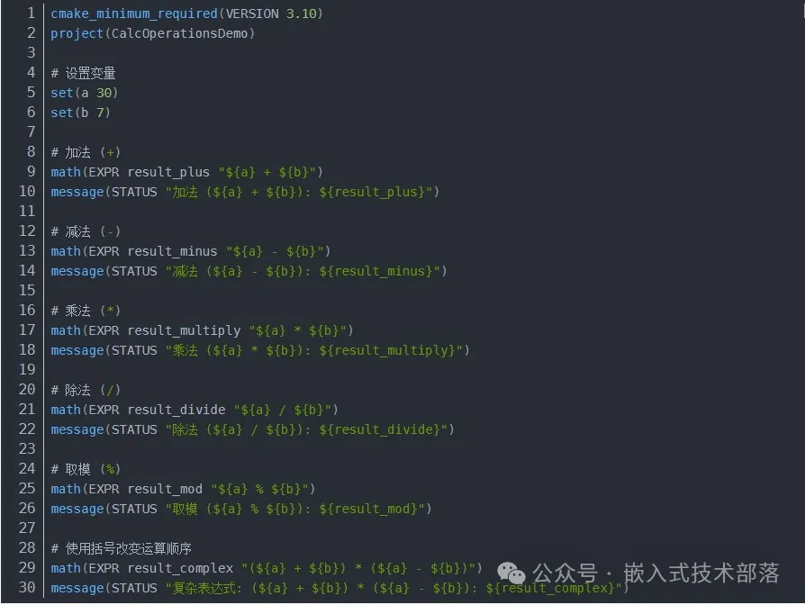
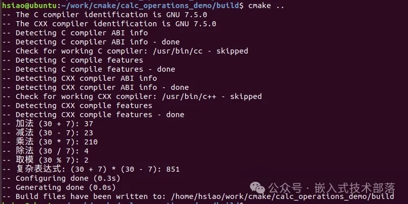
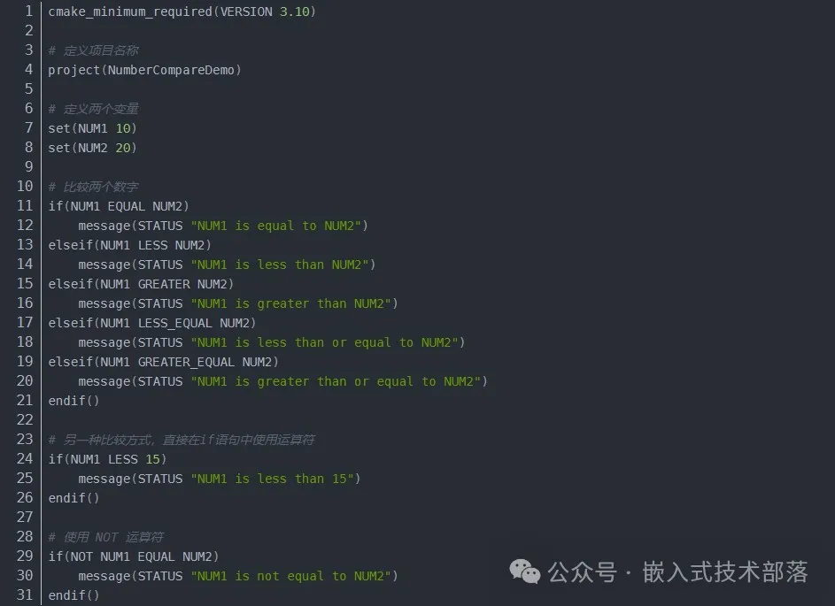
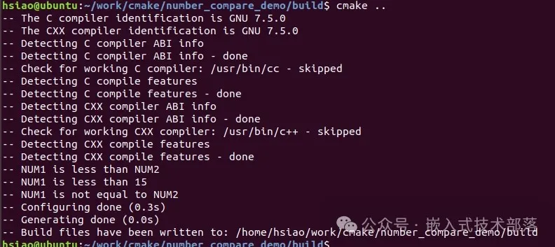
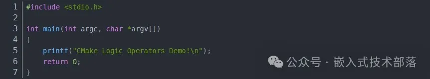
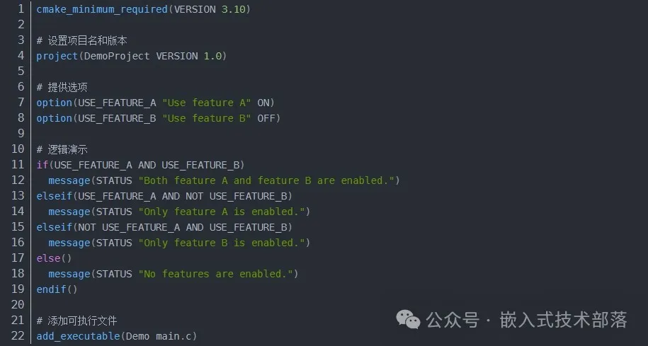
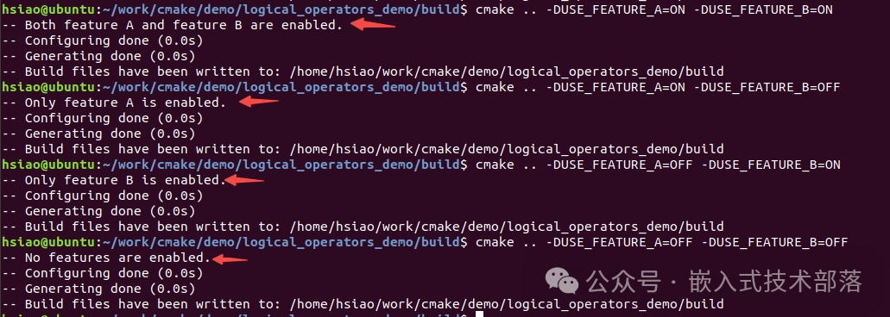

# CMake中的算数运算符，比较运算符和逻辑运算符

CMake 是一个跨平台的自动化构建系统，它主要用于管理软件构建的过程，并且具有一整套自己特定的脚本语言。CMake 脚本中包含了一些基本的运算符，可以用于变量的运算、比较和逻辑判断等。以下是 CMake 中常见的一些运算符。

**一、算术运算符**

**【1】运算符介绍**

> 加法 (+): 用于将两个数值相加。
>
> 减法 (-): 用于从一个数值中减去另一个数值。
>
> 乘法 (*): 用于将两个数值相乘。
>
> 除法 (/): 用于将一个数值除以另一个数值。请注意，这是整除操作，如果你在操作的是整数，那么结果也会是整数，小数部分会被省略。
>
> 取模 (%): 用于获得两个数值相除后的余数。
>
> 括号 (()): 用于改变运算顺序，括号内的运算会被优先计算。

CMake使用这些运算符，可以构建从简单到复杂的数学表达式，用于计算或者进行条件判断。

**【2】示例**

在CMake中

```
math(EXPR <variable> "<expression>")
```

命令用于执行数学表达式 <expression> 的计算，并将结果存储在变量 <variable> 中。

下面是一个简单的CMake demo，展示了如何使用这些算术运算符：

首先，创建一个名为CMakeLists.txt的文件，并写入以下内容：



要运行这个demo，在包含CMakeLists.txt文件的目录中打开命令行工具，执行以下步骤：

```
mkdir build && cd build
cmake ..
```

执行以上步骤过程中，CMake将会执行CMakeLists.txt文件中的命令，并打印出各种算术运算的结果。



以上介绍了CMake中常用的算数运算符和它们在math(EXPR ...)中的基本用法，大大丰富了CMake脚本处理数据的能力

**二、比较运算符**

**【1】运算符介绍**

> EQUAL：相等
>
> NOT：不等于
>
> LESS：小于
>
> GREATER：大于
>
> LESS_EQUAL：小于等于
>
> GREATER_EQUAL：大于等于

**【2】示例**

同上面示例中的步骤

编写CMakeLists.txt的文件



编译

```
mkdir build && cd build
cmake ..
```

结果



**三、逻辑运算符**

**【1】运算符介绍**

> AND：逻辑与
>
> OR：逻辑或
>
> NOT：逻辑非

**【2】示例**

目录结构：

```
/demo_project
  |—— CMakeLists.txt
  |—— main.c
```

main.c



CMakeLists.txt

在CMakeLists.txt文件中，我们使用逻辑运算符来检测两个自定义的选项USE_FEATURE_A和USE_FEATURE_B。



编译

导航到demo_project目录,创建一个构建目录并进入：

```
mkdir build
cd build
```

配置项目并生成构建文件。可以在这一步指定任何选项，如-DUSE_FEATURE_A=OFF。

```
cmake ..
```

或者，启用特定特性：

```
cmake .. -DUSE_FEATURE_A=ON -DUSE_FEATURE_B=ON
```

结果



