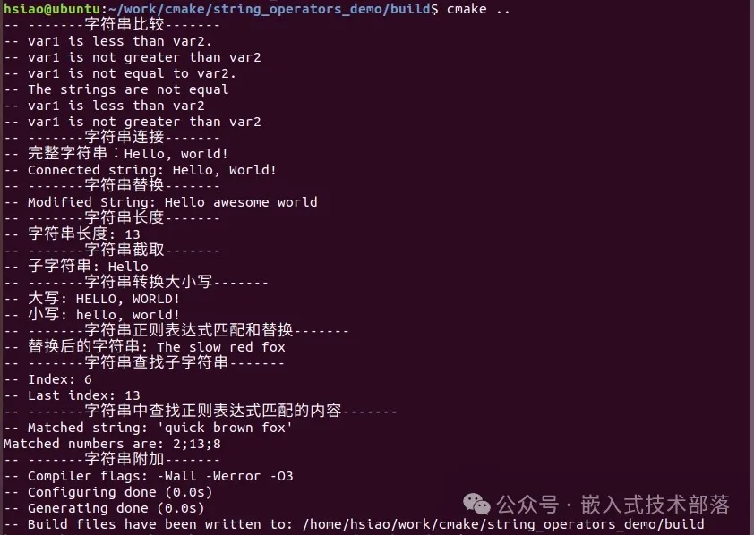

# CMake中的字符串处理指令和运算符

### 一、字符串处理指令string

在CMake中，string 指令提供了一系列的操作来处理字符串。这些操作包括但不限于比较、替换、连接、长度计算等等。

#### 基本语法

string 指令的基本语法如下：

```
string(<command> ...)
```

#### 参数含义

> <command> : 是您希望执行的操作类型，比如 LENGTH，APPEND，REPLACE 等。
> `LENGTH`：计算字符串的长度。
> `APPEND`：将一个字符串附加到另一个字符串后面。
> `REPLACE`：替换字符串中的一部分内容。
> `SUBSTRING`：提取字符串的子字符串。
> `COMPARE`：比较两个字符串大小，是否相等。
> `TOUPPER`/`TOLOWER`：将字符串转换为大写/小写。
> `REGEX REPLACE`:字符串查找和替换,使用正则表达式匹配和替换字符串的某些部分。
> `CONCAT`：字符串连接。
> `FIND`：用于在字符串中查找一个子字符串位置。
> `REGEX MATCH`：用于在字符串中查找正则表达式匹配的内容。
>  
> **…**: 后面的形参根据不同的指令各有差异，下面我们会根据command类型一一示例进行介绍。

### 二、字符串运算符

下面我们根据command类型一一示例进行介绍：

#### 字符串比较

字符串比较有两种方法。
一种方法是通过条件语句使用 `STREQUAL`，`STRLESS` 和 `STRGREATER` 来比较字符串。

> STREQUAL：字符串相等比较。如果相等，则表达式结果为 TRUE，否则为 FALSE。
>
> 
> STRLESS：用于判断一个字符串是否在字典排序上小于另一个字符串。如果是，则表达式结果为 TRUE，否则为 FALSE。
>
> 
> STRGREATER：用于判断一个字符串是否在字典排序上大于另一个字符串。如果是，则表达式结果为 TRUE，否则为 FALSE。

```
set(var1 "Hello")
set(var2 "World")

if("${var1}" STRLESS "${var2}")
  message(STATUS "var1 is less than var2.")
else()
  message(STATUS "var1 is not less than var2.")
endif()

if("${var1}" STRGREATER "${var2}")
  message(STATUS "var1 is greater than var2.")
else()
  message(STATUS "var1 is not greater than var2")
endif()

if("${var1}" STREQUAL "${var2}")
  message(STATUS "var1 is equal to var2.")
else()
  message(STATUS "var1 is not equal to var2.")
endif()
```

另一种比较字符串的方法是

```
string(COMPARE <op> <string1> <string2> <output variable>)
```

这里的<`op>`是比较操作符，`<op>`是`EQUAL`、`LESS`、`GREATER`，比较结果的返回值同上面`STREQUAL`、`STRLESS`、`STRGREATER`。

`<string1>`和`<string2>`是要比较的字符串。

`<output variable>`是用来存储比较结果的变量。

```
set(var1 "Hello")
set(var2 "World")

string(COMPARE EQUAL "${var1}" "${var2}" result)
if(result)
    message(STATUS "The strings are equal")
else()
    message(STATUS "The strings are not equal")
endif()

string(COMPARE LESS "${var1}" "${var2}" result)
if(result)
    message(STATUS "var1 is less than var2")
else()
    message(STATUS "var1 is not less than var2")
endif()

string(COMPARE GREATER "${var1}" "${var2}" result)
if(result)
    message(STATUS "var1 is greater than var2")
else()
    message(STATUS "var1 is not greater than var2")
```

#### 字符串连接

字符串连接也有两种方法。
一种方法是通过 `set` 命令直接将多个字符串变量或值连接起来。

```
set(STR1 "Hello, ")
set(STR2 "world!")
set(FULL_STR "${STR1}${STR2}")
message(STATUS "完整字符串：${FULL_STR}")
```

另一个连接字符串的方法是使用

```
string(CONCAT <output_variable> <input> …)
```

将所有 `<input>` 字符串拼接起来，结果存储在 `<output_variable>` 中

```
set(STR1 "Hello, ")
set(STR2 "World!")
string(CONCAT CONNECTED_STR ${STR1} ${STR2})
message(STATUS "Connected string: ${CONNECTED_STR}")
```

#### 字符串替换

CMake中替换字符串中的某部分用

```
string(REPLACE <match_string> <replace_string> <output_variable> <input>)
```

在`<input>`字符串中搜索 `<match_string>` 并将其替换为`<replace_string>`

结果存储在 `<output_variable>` 中。

```
set(MY_STRING "Hello CMake world")
string(REPLACE "CMake" "awesome" MY_STRING_MODIFIED ${MY_STRING})
message(STATUS "Modified String: ${MY_STRING_MODIFIED}")
```

#### 字符串长度

获取字符串长度

```
string(LENGTH <string> <output_variable>)
```

用来计算字符串`<string>` 的长度。

结果存储在`<output_variable>` 中。

```
set(MY_STR "Hello, world!")
string(LENGTH "${MY_STR}" MY_STR_LENGTH)
message(STATUS "字符串长度: ${MY_STR_LENGTH}")
```

#### 字符串截取

提取子字符串使用 

```
string(SUBSTRING <string> <begin> <length> <output_variable>)
```

提取 `<string>` 的子字符串，从 `<begin>` 开始，长度为 `<length>`。

结果存储在 `<output_variable>` 中。

```
set(MY_STR "Hello, world!")
string(SUBSTRING "${MY_STR}" 0 5 SUB_STR)
message(STATUS "子字符串: ${SUB_STR}")  # 输出应为 "Hello"
```

#### 字符串转换大小写

把字符串全部转换为大写

```
string(TOUPPER <string> <output_variable>)
```

将 `<string>` 转换为大写，结果存储在`<output_variable>`中。

把字符串全部转换为小写

```
string(TOLOWER <string> <output_variable>)
```

将 `<string>` 转换为小写，结果存储在`<output_variable>`中

```
set(MY_STR "Hello, World!")
string(TOUPPER "${MY_STR}" MY_STR_UPPER)
string(TOLOWER "${MY_STR}" MY_STR_LOWER)
message(STATUS "大写: ${MY_STR_UPPER}")  # 输出全部大写
message(STATUS "小写: ${MY_STR_LOWER}")  # 输出全部小写
```

#### 字符串正则表达式匹配和替换

使用正则表达式匹配和替换字符串的某些部分

```
string(REGEX REPLACE <regex> <replace_expression> <output_variable> <input>)
```

对`<input>` 使用正则表达式`<regex>` 进行查找，并用`<replace_expression>`进行替换。

结果存储在 `<output_variable>` 中。

```
set(MY_STR "The quick brown fox")
string(REGEX REPLACE "quick brown" "slow red" MY_NEW_STR ${MY_STR})
message(STATUS "替换后的字符串: ${MY_NEW_STR}")  # 输出 "The slow red fox"
```

#### 字符串查找子字符串

在字符串中查找一个子字符串

```
string(FIND <string> <substring> <output_variable> [REVERSE])
```

在 `<string>` 中查找 `<substring>` 的位置，位置基础是从0开始。

结果是`<substring>` 开始的索引，存储在 `<output_variable>` 中，如果没找到，输出 -1。

可选的[REVERSE]参数表示从字符串的末尾开始向前搜索。使用REVERSE选项对于查找最后一次出现的位置特别有用，尤其是在处理包含多个相同子字符串的长字符串时。这提供了一种灵活的方式来从不同的方向分析和处理字符串数据。

```
set(MY_STRING "Hello World")
string(FIND "${MY_STRING}" "World" MY_INDEX)
message(STATUS "Index: ${MY_INDEX}") # 输出为Index: 6

set(MY_STRING "Hello World, Hello Universe")
string(FIND "${MY_STRING}" "Hello" MY_INDEX REVERSE)
message(STATUS "Last index: ${MY_INDEX}") # 输出应该是13
```

#### 字符串中查找正则表达式匹配的内容

在字符串中查找正则表达式匹配的内容

```
string(REGEX MATCH <regular_expression> <output> <variable> <input_string> )
```

使用正则表达式 `<regular_expression>` 匹配 `<input_string>` 字符串。

结果存储在`<output_variable>` 中。如果有匹配，该变量`<output_variable>`将包含匹配的文本；否则，它将是空的。

或者是用于匹配所有匹配项的变种

```
string(REGEX MATCHALL <regular_expression> <output_variable> <input_string>)
```

```
set(INPUT_STRING "The quick brown fox jumps over the lazy dog")
string(REGEX MATCH "quick.*fox" MATCHED_STRING ${INPUT_STRING})
message(STATUS "Matched string: '${MATCHED_STRING}'")
```

这段代码会把 MATCHED_STRING 设置为 quick brown fox，因为这是 `<input_string>` 中第一个匹配 `<regular_expression>` 的部分。

`REGEX MATCHALL` 的行为类似，但它会找到所有匹配的实例而不仅仅是第一个。这很有用，特别是当你需要从输入字符串中提取一系列的匹配数据时。

```
# 设置包含数字的文本字符串
set(input_text "The 2 quick brown foxes jump over 13 lazy dogs 8 times.")

# 使用正则表达式匹配所有数字
string(REGEX MATCHALL "[0-9]+" matched_numbers ${input_text})

# 打印匹配到的所有数字
message("Matched numbers are: ${matched_numbers}")
```

#### 字符串附加

字符串附加另一个字符串

```
string(APPEND <variable> <string> [<string>...])
```

将一个或多个 `<string>` 附加到变量 `<variable>` 的值上

```
# 初始为空的编译标志
set(COMPILER_FLAGS "")

# 根据需要附加标志
string(APPEND COMPILER_FLAGS "-Wall ")
string(APPEND COMPILER_FLAGS "-Werror ")
string(APPEND COMPILER_FLAGS "-O3")

# 打印最终的编译标志
message(STATUS "Compiler flags: ${COMPILER_FLAGS}")
```

**注意事项：**

> 1、在指定多个值进行追加时，string(APPEND …)不会在这些值之间自动添加任何分隔符。如果需要分隔符（如空格或其他字符），你必须自己包括它们在值中。
>
> 
> 2、和大部分CMake命令一样，string(APPEND …)修改变量的作用是在原地执行的，意味着它直接改变了传入的变量而不是返回一个新的修改后的副本。

**字符串连接\**CONCAT\**和字符串附加\**APPEND\**的区别**
CMake中的`string(APPEND ...)`和`string(CONCAT ...)`命令都是用于处理字符串的，但它们在功能上有一些区别：

1、`string(APPEND …)`

string(APPEND …)命令用于向一个已经存在的变量追加内容。使用这个命令，我们可以向一个字符串变量的末尾添加更多的文本。

这个操作是就地完成的，即对原有变量的内容直接进行扩展。

**语法：**

```
string(APPEND <variable> <value> [<value>...])
```

**例子：**

```
set(MY_STRING "Hello")
string(APPEND MY_STRING ", World!")
# 在这里，MY_STRING的值变成了"Hello, World!"
```

2、`string(CONCAT …)`

相比之下，string(CONCAT …)命令用于将多个字符串值合并为一个新的字符串。

它不修改任何原有的字符串变量，而是创建一个新的字符串结果。
**语法：**

```
string(CONCAT <variable> <value> [<value>...])
```

**例子：**

```
set(STR1 "Hello")
set(STR2 ", ")
set(STR3 "World!")
string(CONCAT MY_NEW_STRING ${STR1} ${STR2} ${STR3})
# 在这里，创建了一个新的变量MY_NEW_STRING，其值为"Hello, World!"
```

**总结：**

> 1、string(APPEND …)是用来修改已存在变量的内容，通过追加方式扩展该变量的字符串值。
>
> 
> 2、string(CONCAT …)是用于合并多个字符串值创建一个新的字符串变量，原有变量的值不会改变。
>
> 
> 3、在选择使用哪一个的时候，可以根据你的具体需求来决定：如果你想要修改已有变量的值，可以使用APPEND；如果你想保留原有变量不变，而创建一个新的字符串，那么CONCAT会是更好的选择。

以上为一些基础的示例，实际应用中可能需要根据具体需求组合使用这些命令。CMake 的字符串操作十分灵活，掌握好这些基础操作，可以帮助你更好地管理和处理项目中的字符串数据。

### 三 、示例

本文源码链接

https://pan.baidu.com/s/1lXUBjsddMjsGBEUKoAJXmA 

提取码9z7a

之后的文章会将源码上传至github，到时给出地址。

源码编译结果：

