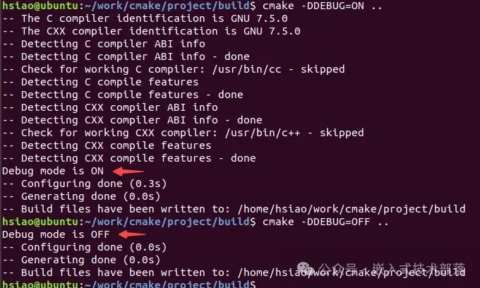
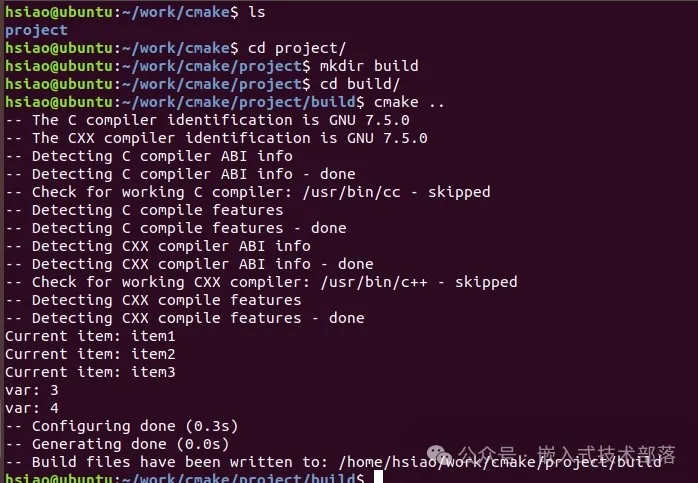
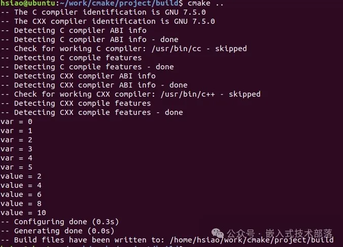
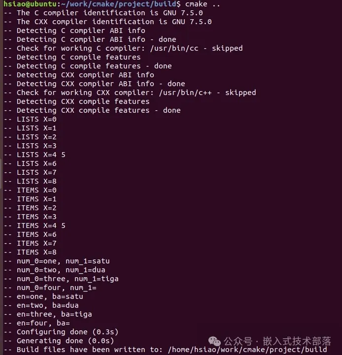
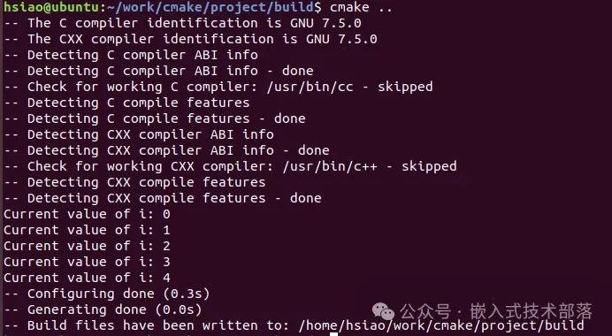
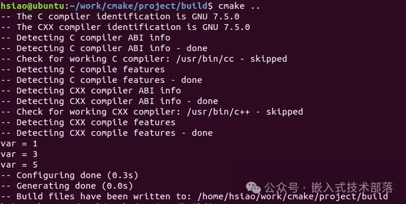

# CMake中的条件语句和循环语句

# 前言

CMake 提供了条件语句和循环语句等控制结构，用于根据不同条件执行不同的操作或重复执行某些操作。

# 一、条件语句

## 1、if 语句

if 语句用于检查条件是否为真，并根据条件的结果执行相应的代码块。

#### 【1】基本语法

```
if (condition)
    # 执行代码块
elseif (condition2)
    # 执行另一个代码块
else ()
    # 默认情况下执行的代码块
endif ()
```

#### 【2】参数含义

在这个语法中，condition是一个表达式，如果该表达式为真，则执行第一个代码块。如果第一个条件不满足，而condition2满足，则执行第二个代码块。如果没有条件满足，则执行else块中的代码。

#### 【3】示例

让我们通过一个简单的示例来演示条件语句在CMake中的使用：
(1)目录结构

```
project
│
├── CMakeLists.txt
```

(2)编写CMakeLists.txt
根据是否开启调试模式来设置不同的编译选项。

```
cmake_minimum_required(VERSION 3.10)
project(MyProject)

option(DEBUG "Enable Debug Mode" OFF)

if (DEBUG)
    message("Debug mode is ON")
else ()
    message("Debug mode is OFF")
endif ()
```

在这个示例中，我们首先定义了一个名为DEBUG的选项，它可以控制是否启用调试模式。然后，在 if 语句中，我们检查DEBUG变量的值，如果为真，则输出调试模式已启用的消息。如果DEBUG为假，则输出调试模式已关闭的消息。

(3)编译
启用调试模式

```
cd project
mkdir build && cd build
cmake -DDEBUG=ON ..
```

关闭调试模式

```
cd project/build # 假设你已经在build目录内
cmake -DDEBUG=OFF ..
```

结果

在实际项目中，可以根据需要扩展这种条件语句的逻辑，例如根据不同的操作系统或编译器版本设置不同的编译选项。

# 二、循环语句

在 CMake 中，循环语句用于在构建过程中重复执行一系列命令或操作。目前，CMake 支持两种主要的循环语句：foreach 和 while。

## 1、foreach 循环

foreach有五种变体用法。

```
变体 1：
foreach(<loop_var> <items>)
    # 在这里执行针对每个元素的操作
endforeach()

变体 2：
foreach(<loop_var> RANGE <stop>)

变体 3：
foreach(<loop_var> RANGE <start> <stop> [<step>])

变体 4：
foreach(<loop_var> IN [LISTS [<lists>]] [ITEMS [<items>]])

变体 5：
foreach(<loop_var>... IN ZIP_LISTS <lists>)
```

下面我们一一分析总结一下。

### foreach 循环之 基本用法

foreach 循环用于遍历列表中的每个元素，并对每个元素执行相应的操作。

#### 【1】基本语法

```
foreach(<loop_var> <items>)
    # 在这里执行针对每个元素的操作
endforeach()
```

#### 【2】参数含义

<loop_var> 表示当前正在迭代的元素，在每次迭代时会被赋值为列表中的一个元素。

<items>是由分号或空格分割的项列表(list of items)。<items>中的每个item调用一次。在每次迭代开始时，变量<loop_var>将被设置为当前item的值。<loop_var>的范围仅限于循环范围。

#### 【3】示例

(1)目录结构

```
project
│
├── CMakeLists.txt
```

(2)编写CMakeLists.txt

```
cmake_minimum_required(VERSION 3.10)
project(MyProject)

set(my_list item1 item2 item3)
foreach(item ${my_list})
    message("Current item: ${item}")
endforeach()

foreach(var 3 4)
    message("var: ${var}")
endforeach()
```

(3)编译

```
cd project
mkdir build && cd build
cmake ..
```



### foreach 循环之 RANGE 关键字

#### 【1】基本语法

语法 1：

```
foreach(<loop_var> RANGE <stop>)
```

语法 2：

```
foreach(<loop_var> RANGE <start> <stop> [<step>])
```

#### 【2】参数含义

语法 1 中，循环会从 0 到指定的数字 <stop>，包含 <stop>，<stop>不能为负数,范围为 [0, <stop>]。

语法 2 中，循环从指定的数字 <start>开始到 <stop>结束，步长为 <step>，不过 <step>参数是一个可选参数， 如果不指定，默认 <step>=1；三个参数都不能为负数，而且 <stop> 不能比 <start>小。

#### 【3】示例

步骤同上

```
cmake_minimum_required(VERSION 3.10)
project(MyProject)

foreach(var RANGE 5)
    message("var = ${var}")
endforeach()

foreach(loop_var RANGE 2 10 2)
    message("value = ${loop_var}")
endforeach()
```

编译结果


### foreach 循环之 IN 关键字

#### 【1】基本语法

语法 1：

```
foreach(<loop_var> IN [LISTS [<lists>]] [ITEMS [<items>]])
```

语法 2:

```
foreach(<loop_var>... IN ZIP_LISTS <lists>)
```

#### 【2】参数含义

语法 1 中，<lists>是一个空格或分号分割的列表值变量列表。foreach命令遍历每个给定list中的每个item。跟在ITEMS关键字后面的<items>的处理方式与foreach命令的第一个变体一样。LISTS A和ITEMS ${A}的形式是等价的。

语法 2 中，<lists>是一个空格或分号分割的列表值变量列表。foreach命令同时迭代每个list，设置迭代变量如下：
(1)如果只给出了loop_var，那么它将一系列loop_var_N变量设置为相应list中的当前项。
(2)如果传递了多个变量名，则它们的计数(count)应与list变量计数匹配。
(3)如果任何list较短，则不会为当前迭代定义相应的迭代变量。

#### 【3】示例

步骤同上

```
cmake_minimum_required(VERSION 3.10)
project(MyProject)

set(A 0;1)
set(B 2 3)
set(C "4 5")
set(D 6;7 8)
set(E "")
foreach(X IN LISTS A B C D E)
        message(STATUS "LISTS X=${X}")
endforeach()

foreach(X IN ITEMS ${A} ${B} ${C} ${D} ${E})
        message(STATUS "ITEMS X=${X}")
endforeach()

list(APPEND English one two three four)
list(APPEND Bahasa satu dua tiga)
foreach(num IN ZIP_LISTS English Bahasa)
    message(STATUS "num_0=${num_0}, num_1=${num_1}")
endforeach()

foreach(en ba IN ZIP_LISTS English Bahasa)
    message(STATUS "en=${en}, ba=${ba}")
endforeach()
```

编译


## 2、while 循环

while 循环用于在满足条件的情况下重复执行一系列命令。

#### 【1】基本语法

```
while(<condition>)
    # 在这里执行循环体内的操作
endwhile()
```

#### 【2】参数含义

<condition> 是一个 CMake 表达式，只有<condition>在为真（非空）时，循环体才会执行。在循环体内，可以使用 break() 来提前跳出循环。

#### 【3】示例

步骤同上

```
cmake_minimum_required(VERSION 3.10)
project(MyProject)

set(i 0)
while(i LESS 5)
    message("Current value of i: ${i}")
    math(EXPR i "${i} + 1")
endwhile()
```

编译


## 3、break() 与 continue()

与绝大多数编程语言一样，CMake也可以通过 break() 跳出循环，通过 continue() 结束本次循环并继续下次循环。

#### 示例

步骤同上

```
cmake_minimum_required(VERSION 3.10)
project(MyProject)

set(myList 1 2 3 4 5 6 7)
foreach(var IN LISTS myList)
    math(EXPR expr ${var}%2)
    if(expr EQUAL 0)
        continue()
    endif()
    if(${var} GREATER 5)
        break()
    endif()
    message("var = ${var}")
endforeach()
```

编译

以上示例中代码是完全且没有删减的，可复制直接使用。

OK，今天总结到此。