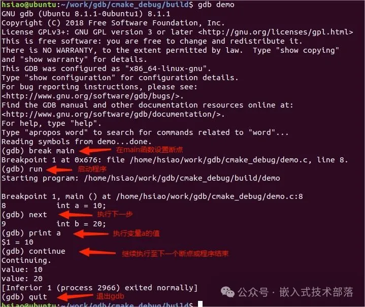

# CMake支持gdb调试

## 一、前言

CMake和GDB的结合确实能使C或C++的开发工作变得轻松，它们可以共同实现跨平台的项目构建和源代码级别的调试。

下面详细阐述一下如何使用CMake配置项目以便使用GDB进行调试，以及提供一个C语言的demo。

## 二、如何支持gdb调试

让 CMake 支持 gdb 的设置也很容易，只需要指定 Debug 模式下开启 -g 选项：

```
set(CMAKE_BUILD_TYPE "Debug")
set(CMAKE_CXX_FLAGS_DEBUG "$ENV{CXXFLAGS} -O0 -Wall -g -ggdb")
set(CMAKE_CXX_FLAGS_RELEASE "$ENV{CXXFLAGS} -O3 -Wall")
```

1、在CMakeLists.txt中加入这三行代码。

CMake 中有一个变量CMAKE_BUILD_TYPE ,可以的取值是 Debug、Release、RelWithDebInfo 和 MinSizeRel。

当这个变量是Debug 的时候,CMake 会使用变量 CMAKE_CXX_FLAGS_DEBUG 和 CMAKE_C_FLAGS_DEBUG 中的字符串作为编译选项生成 Makefile。

2、在编译程序时加上-g选项的作用是生成带调试信息的可执行文件。

这些调试信息包括变量名、函数名、文件名等信息，可以让调试器（如gdb）在调试程序时更容易跟踪程序的执行过程，并能够查看变量的值、函数的调用栈等信息。

通过使用-g选项编译程序，可以使得在调试器中更方便地定位程序中的问题，提高调试效率。


## 三、代码示例

项目结构

```
project/
│
├── CMakeLists.txt
└── demo.c
```

### 【1】编写demo.c

```
#include <stdio.h>

void print_val(int val) {
    printf("value: %d\n", val);
}

int main() {
    int a = 10;
    int b = 20;
    print_val(a);
    print_val(b);
    return 0;
}
```

### 【2】编写CMakeLists.txt

```
cmake_minimum_required (VERSION 3.10)
  
# 项目名称
project (demo)

set(CMAKE_BUILD_TYPE "Debug")
set(CMAKE_CXX_FLAGS_DEBUG "$ENV{CXXFLAGS} -O0 -Wall -g -ggdb")
set(CMAKE_CXX_FLAGS_RELEASE "$ENV{CXXFLAGS} -O3 -Wall")

# 添加可执行文件
add_executable(demo demo.c)                          
```

### 【3】编译

project目录下执行命令

```
mkdir build
cd build;cmake ..
make
```

### 【4】gdb调试

