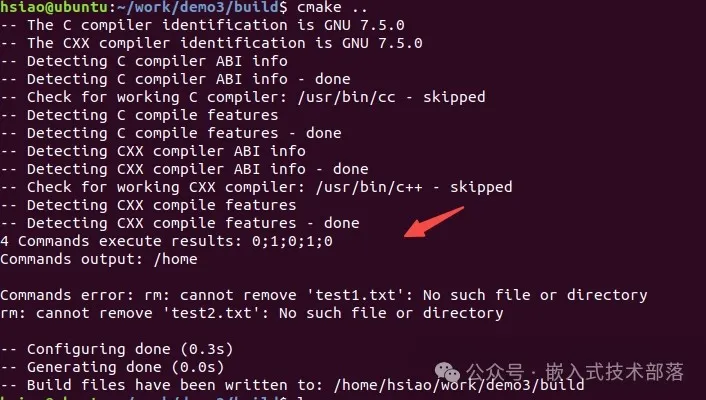
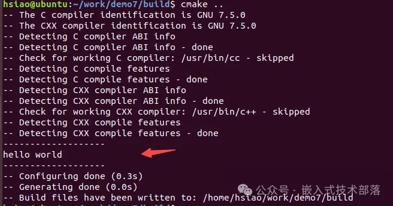

# CMake中如何执行shell命令（1）

### 前言

在CMake中执行shell命令主要涉及三个指令：execute_process、add_custom_command、add_custom_target。我们将分别对每个指令做一下总结，并用示例代码加深理解。

本章对指令execute_process进行一下总结，下一篇文章对add_custom_command和add_custom_target进行总结。

### 指令execute_process

#### 一、基本语法


#### 二、参数含义

各选项说明如下：

> `COMMAND`:待执行的命令，可以指定多个。
>  
> `WORKING_DIRECTORY`：将指定的目录作为命令执行的当前工作目录。
>  
> `TIMEOUT`：设置命令执行的超时时间,单位是秒，可以不是整数。过了设置的超时时间，所有命令会被终止，RESULT_VARIABLE会被设置为“timeout”
>  
> `RESULT_VARIABLE`：包含命令的执行结果，该变量会被设置为最后一个命令执行的返回码，或执行出错时候的描述字符串。
>  
> `RESULTS_VARIABLE`：3.10版本引入。将所有的命令执行结果存入该变量中，命令的执行结果以分号连接，存储的顺序按照COMMAND命令的顺序。
>  
> `OUTPUT_VARIABLE`：对应于标准输出的内容，存储最后一个命令的运行结果。
>  
> `ERROR_VARIABLE`：对应于标准错误的内容，存储所有命令错误。
>  
> `INPUT_FILE`：指定文件作为第一个命令的标准输入。
>  
> `OUTPUT_FILE`：指定文件作为最后一个命令的标准输出。
>  
> `ERROR_FILE`：所有命令运行错误结果存储的文件
>  
> `OUTPUT_QUIET/ERROR_QUIET`：忽略标准输出和标准错误。
>  
> `COMMAND_ECHO`：重显命令到指定的标准设备，如STDERR、STDOUT、NONE。使用CMAKE_EXECUTE_PROCESS_COMMAND_ECHO变量来修改它的行为
>  
> `OUTPUT_STRIP_TRAILING_WHITESPACE/ERROR_STRIP_TRAILING_WHITESPACE`：删除空白字符
>  
> `ENCODING`：在windows系统上指定命令输出时的解码方式，默认是utf-8，其他平台会忽略该参数
>  
> `ECHO_OUTPUT_VARIABLE/ECHO_ERROR_VARIABLE`：输出将被复制，它将被发送到配置的变量中，也会在标准输出或标准错误中，3.18版本支持
>  
> `COMMAND_ERROR_IS_FATAL`：触发致命错误并终止命令执行，方式取决于参数ANY和LAST。ANY表示任意命令执行失败都触发，LAST表示最后一个命令执行失败才触发，3.19版本支持


#### 三、示例

示例源码下载地址，后台回复cmake_shell获取下载地址.

##### 1、COMMAND 

#####    WORKING_DIRECTORY

示例源码 demo0

```
execute_process(COMMAND pwd
               WORKING_DIRECTORY "/home")
```

编译结果


##### 2、TIMEOUT

示例源码 demo1

```
execute_process(COMMAND sleep 5
		COMMAND sleep 5
		TIMEOUT 1
		RESULT_VARIABLE msg)
message("1 commands execute result: ${msg}")
```

编译结果


##### 3、RESULT_VARIABLE 

#####    RESULTS_VARIABLE

示例源码 demo2

```
execute_process(COMMAND rm test.txt
		RESULT_VARIABLE msg)
message("2 command execute result: ${msg}")

execute_process(COMMAND ls -al
		COMMAND rm test.txt
		RESULTS_VARIABLE msg_all)
message("3 command execute result: ${msg_all}")
```

编译结果


##### 4、OUTPUT_VARIABLE 

#####    ERROR_VARIABLE

示例源码 demo3

```
execute_process(COMMAND echo "start"
		COMMAND rm "test1.txt"
		COMMAND pwd
		COMMAND rm "test2.txt"
		COMMAND pwd
		WORKING_DIRECTORY "/home"
		RESULTS_VARIABLE msg_result
		OUTPUT_VARIABLE msg_out
		ERROR_VARIABLE msg_err)
MESSAGE("4 Commands execute results: ${msg_result}")
MESSAGE("Commands output: ${msg_out}")
MESSAGE("Commands error: ${msg_err}")
```

编译结果


##### 5、INPUT_FILE

#####    OUTPUT_FILE

#####    ERROR_FILE

示例源码 demo4
在demo4目录中创建文件text.txt，内容是[test.txt]


```
execute_process(COMMAND cat
               INPUT_FILE ${CMAKE_SOURCE_DIR}/test.txt
               OUTPUT_VARIABLE CAT_OUTPUT)
message(STATUS "The output of cat command was: ${CAT_OUTPUT}")

execute_process(COMMAND rm "test1.txt"
               COMMAND rm "test2.txt"
               COMMAND echo "write message to output"
               OUTPUT_FILE output
               ERROR_FILE error)
```

编译结果


##### 6、OUTPUT_QUIET 

#####    ERROR_QUIET

示例源码 demo5

```
execute_process(COMMAND pwd
		OUTPUT_VARIABLE msg_out)
MESSAGE("5 Commands execute results: ${msg_out}")
execute_process(COMMAND pwd
		OUTPUT_VARIABLE msg_out
		OUTPUT_QUIET)
MESSAGE("6 Commands execute results: ${msg_out}")
```

编译结果


##### 7、COMMAND_ECHO

示例源码 demo6

```
execute_process(COMMAND echo "execute commad"
 		COMMAND ls "CMakeFiles"
 		COMMAND_ECHO STDERR)
```

编译结果


##### 8、ECHO_OUTPUT_VARIABLE

#####    ECHO_ERROR_VARIABLE

##### 

示例源码 demo7

```
execute_process(COMMAND echo "hello world"
 		OUTPUT_VARIABLE var_output)
MESSAGE("-------------------")
execute_process(COMMAND echo "hello world"
 		OUTPUT_VARIABLE var_output
 		ECHO_OUTPUT_VARIABLE)
MESSAGE("-------------------")
```

编译结果


##### 9、COMMAND_ERROR_IS_FATAL

示例源码 demo8

```
execute_process(COMMAND pwd
 		COMMAND rm "test.txt"
 		COMMAND echo "hello world"
 		COMMAND_ERROR_IS_FATAL LAST)
```

编译结果


```
execute_process(COMMAND pwd
		COMMAND rm "test.txt"
		COMMAND echo "hello world"
		COMMAND_ERROR_IS_FATAL ANY)
```

编译结果
