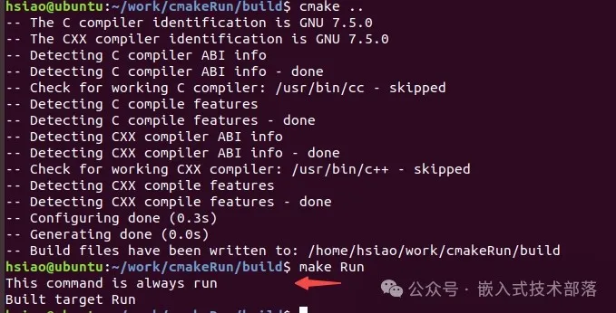

# CMake中如何执行shell命令（2）

### 前言

在CMake中执行shell命令主要涉及三个指令：execute_process、add_custom_command、add_custom_target。

这三个命令参数都比较多，但其实我们并不需要全部了解，甚至一般情况下只需要用到其中的两三个。

上一篇文章我们对execute_process进行了总结，此篇文章我们对add_custom_command和add_custom_target进行总结。

### 一、add_custom_target

add_custom_target，顾名思义就是添加一个自定义目标。

在CMake中，add_custom_target命令用于创建一个自定义目标，这个目标不产生输出文件，只是执行用户指定的命令。它类似于Makefile中的“伪目标”（phony target），总是被认为是最新的，因此总是会执行指定的命令。

在进行总结前，我先来举个简单的例子，让大家有个直观的感受。以下是一个简单的例子，它创建了一个自定义目标Run，该目标总是执行echo命令：

```
cmake_minimum_required(VERSION 3.10)
project(demo)

add_custom_target(Run
	COMMAND echo "This command is always run")
```

在这个例子中，当你运行cmake并且构建Run目标时，它将输出：“This command is always run”。


add_custom_target命令的常见用途包括运行测试、执行代码审查、执行格式化或清理工作等。它非常灵活，可以用于执行任何你想要的命令序列。

#### 【1】基本语法

```
add_custom_target(Name [ALL] [command1 [args1...]]
				[COMMAND command2 [args2...] ...]
				[DEPENDS depend depend depend ... ]
				[BYPRODUCTS [files...]]
				[WORKING_DIRECTORY dir]
				[COMMENT comment]
				[JOB_POOL job_pool]
				[JOB_SERVER_AWARE <bool>]
				[VERBATIM] [USES_TERMINAL]
				[COMMAND_EXPAND_LISTS]
				[SOURCES src1 [src2...]])
```

#### 【2】参数含义

> `Name`: 自定义目标的名称。
>  
> `ALL`: 使这个目标总是被构建，无论是否指定目标。可选参数，如果设置，该目标将被添加到默认构建目标中，即执行make或cmake --build时会自动构建
>  
> `COMMAND`: 后面跟执行的命令，可以指定多条命令，按顺序执行。
>  
> `DEPENDS`: 该目标依赖的其他目标或文件，当这些目标或文件更改时，该目标将被重新构建。
>  
> `BYPRODUCTS`: 指定命令生成的副产品文件。这些文件不会触发重新构建，但如果它们不存在，构建将被视为失败。
>  
> `WORKING_DIRECTORY`: 指定命令执行时的工作目录。
>  
> `COMMENT`: 为这个自定义目标添加一个注释，在构建过程中将显示。
>  
> `VERBATIM`: 保证对命令行的正确转义。如果设置，命令将不会通过CMake的命令行解释器，而是直接传递给构建系统。
>  
> `USES_TERMINAL`: 允许该命令使用调用CMake的终端。
>  
> `JOB_POOL`: 指定此目标用于特定的 job pool（适用于支持 job pool的构建系统）。
>  
> `SOURCES`: 添加到自定义目标的源文件，在 IDE 中可视化显示这些源文件，但实际不会编译它们。

#### 【3】示例

```
project/
│
├── CMakeLists.txt
└── hello.c
```

hello.c:

```
#include <stdio.h>

int main(int argc, char *argv[])
{
	printf("Hello, World from C!\n");
	return 0;
}
```

CMakeLists.txt:

```
cmake_minimum_required(VERSION 3.10)

# 项目名称
project(HelloWorld)

# 创建一个可执行文件
add_executable(hello hello.c)

# 自定义目标，运行可执行文件
add_custom_target(run
    COMMAND hello
    DEPENDS hello
    WORKING_DIRECTORY ${CMAKE_PROJECT_DIR}
    COMMENT "Running the program..."
    VERBATIM
)

# 确保执行的顺序，首先构建 hello 项目然后运行
add_dependencies(run hello)
```

说明

> **project(HelloWorld)**: 定义项目名称。
>  
> **add_executable(hello hello.c)**: 添加一个目标，根据hello.c生成一个可执行文件hello。
>  
> **add_custom_target(run …)**: 定义一个自定义目标run，用于运行可执行文件。它依赖于hello，这意味着hello会在run之前构建。
>  
> **COMMAND hello**: 执行命令，即运行hello。
>  
> **DEPENDS hello**: 保证在运行前hello已被构建。
>  
> **WORKING_DIRECTORY ${CMAKE_PROJECT_DIR}**: 指定命令的工作目录。
>  
> **COMMENT “Running the program…”**: 构建时显示该注释。
>  
> **VERBATIM**: 保证命令按照字面意义传递给构建工具。

运行
在project目录下，运行以下命令以生成Makefile：

```
mkdir build
cd build
cmake ..
```

然后，使用以下命令构建和运行程序：

```
make run
```

这将编译hello.c并运行生成的hello程序，输出"Hello, World from C!"。


### 二、add_custom_command

#### 【1】基本语法

它有两种命令格式：

第一种格式是，将自定义的命令添加到目标（比如lib库或者可执行文件）。这对于在构建目标之前或之后执行操作非常有用。该命令成为目标的一部分，并且仅在目标本身构建时才会执行。如果目标已经构建，则该命令将不会执行。

```
add_custom_command(TARGET <target>
                   PRE_BUILD | PRE_LINK | POST_BUILD
                   COMMAND command1 [ARGS] [args1...]
                   [COMMAND command2 [ARGS] [args2...] ...]
                   [BYPRODUCTS [files...]]
                   [WORKING_DIRECTORY dir]
                   [COMMENT comment]
                   [VERBATIM] [USES_TERMINAL]
                   [COMMAND_EXPAND_LISTS])
```

第二种格式是，添加自定义命令，来生成指定的OUTPUT文件。

```
add_custom_command(OUTPUT output1 [output2 ...]
                   COMMAND command1 [ARGS] [args1...]
                   [COMMAND command2 [ARGS] [args2...] ...]
                   [MAIN_DEPENDENCY depend]
                   [DEPENDS [depends...]]
                   [BYPRODUCTS [files...]]
                   [IMPLICIT_DEPENDS <lang1> depend1
                                    [<lang2> depend2] ...]
                   [WORKING_DIRECTORY dir]
                   [COMMENT comment]
                   [DEPFILE depfile]
                   [JOB_POOL job_pool]
                   [VERBATIM] [APPEND] [USES_TERMINAL]
                   [COMMAND_EXPAND_LISTS])
```

#### 【2】参数含义

> `TARGET`：指定哪个构建目标将会触发这个自定义命令。当 <target> 被构建时，这个命令将会被执行。如果目标已经构建，则该命令将不会执行。
>  
> `PRE_BUILD | PRE_LINK | POST_BUILD`：PRE_BUILD: 表示自定义命令将在构建目标前执行。PRE_LINK: 表示自定义命令将在链接目标前执行。POST_BUILD: 表示自定义命令将在构建目标后执行。
>  
> `OUTPUT`：指定由命令生成的文件。这些文件将成为后续构建步骤的依赖项。
>  
> `COMMAND`：要执行的命令。这可以是任何可以在命令行中运行的命令。
>  
> `MAIN_DEPENDENCY`：可选参数，指定主要依赖项。这通常是一个源文件，当该文件更改时，将重新运行命令。
>  
> `DEPENDS`：指定这个命令执行所依赖的额外文件或目标。如果任何一个依赖项改变了，那么这个自定义命令将被执行。
>  
> `BYPRODUCTS`：指定命令生成的副产品文件。这些文件不会触发重新构建，但如果它们不存在，构建将被视为失败。
>  
> `IMPLICIT_DEPENDS`：隐式依赖项。这允许你指定命令对哪些文件有隐式依赖。
>  
> `WORKING_DIRECTORY`：指定命令的工作目录。
>  
> `COMMENT`：为构建系统提供的注释，通常用于描述命令的目的。
>  
> `DEPFILE`：指定一个文件，它包含了这个命令的完整依赖信息。这通常是由编译器生成的 .d 文件。
>  
> `JOB_POOL` ：指定此目标用于特定的 job pool（适用于支持 job pool的构建系统）。
>  
> `VERBATIM`: 保证对命令行的正确转义。如果设置，命令将不会通过CMake的命令行解释器，而是直接传递给构建系统。保证命令和参数在所有平台上以字面意义解释。建议总是使用这个参数，以保证跨平台兼容性。
>  
> `APPEND`: 如果指定这个选项，那么输出文件的内容将会被追加，而不是覆盖。
>  
> `USES_TERMINAL`: 如果指定这个选项，表示这个命令将使用终端来执行，这可能会影响CMake的输出。
>  
> `COMMAND_EXPAND_LISTS`：在执行命令之前，先对命令及其参数列表进行扩展。这允许你使用生成的文件或目标作为参数等。

#### 【3】示例

```
project/
│
├── CMakeLists.txt
├── hello.txt
└── main.c
```

hello.txt是空文件

main.c

```
#include <stdio.h>

int main(int argc, char *argv[])
{
	printf("hello world\n");
}   
```

**第一种格式：**

CMakeLists.txt

```
cmake_minimum_required(VERSION 3.10)
project(custom_command_demo)

# 添加一个可执行文件
add_executable(custom_command_demo main.c)

# 将自定义命令作为构建目标的一部分
add_custom_command(TARGET custom_command_demo
                   POST_BUILD
                   COMMAND ${CMAKE_COMMAND} -E copy ${CMAKE_SOURCE_DIR}/hello.txt ${CMAKE_BINARY_DIR}/hello.txt)                                                                                                               
```

编译运行


可以将CMakeLists.txt源码中的POST_BUILD改为PRE_BUILD或PRE_LINK，自行编译运行，看一下效果。

**第二种格式：**
CMakeLists.txt

```
cmake_minimum_required(VERSION 3.10)
project(custom_command_demo)

# 添加一个可执行文件
add_executable(custom_command_demo main.c)

# 将自定义命令作为一条独立的步骤
add_custom_command(OUTPUT ${CMAKE_BINARY_DIR}/hello.txt
                   COMMAND ${CMAKE_COMMAND} -E copy ${CMAKE_SOURCE_DIR}/hello.txt ${CMAKE_BINARY_DIR}/hello.txt
                   COMMENT "Copy hello.txt to build directory"
                   VERBATIM)

# 将自定义命令作为构建目标的依赖关系
add_custom_target(copy_hello ALL DEPENDS ${CMAKE_BINARY_DIR}/hello.txt)
```

在上述代码中，add_custom_target 是用来定义一个自定义构建目标的命令，这个构建目标没有直接生成任何输出文件，而是作为一个依赖关系的占位符。它使得 cmake 在构建过程中会执行前面通过 add_custom_command 定义的自定义命令。

如果你去掉 add_custom_target，那么你通过 add_custom_command 定义的自定义命令就不会被执行了。这是因为 add_custom_command 仅定义了一个自定义命令，但并没有把它加入到构建过程中。而 add_custom_target 通过依赖关系确保了在构建过程中会执行这个自定义命令。

在这个例子中，如果移除 add_custom_target，那么即使你在 CMakeLists.txt 中包含了自定义命令，这个命令也不会在 CMake 配置或构建过程中执行。因此，如果你想让自定义命令在构建过程中执行，就不能去掉 add_custom_target。

编译运行


### 三、add_custom_target 和 add_custom_command 的关系

在总结这两个命令的关系之前，我们先来粗略地看一看 Makefile 的规则。

1、Makefile的规则

（以下关于Makefile内容摘自陈皓的《跟我一起写Makefile》）

```
 target ... : prerequisites ... 
 	command 
 	... 
 	...
```

“ target 也就是一个目标文件，可以是 Object File，也可以是执行文件，还可以是一个标签（Label）。

prerequisites 就是要生成那个 target 所需要的文件或是目标。

command 也就是 make 需要执行的命令（任意的 Shell 命令）。

这是一个文件的依赖关系，也就是说，target 这一个或多个的目标文件依赖于 prerequisites中的文件，其生成规则定义在 command 中。

说白一点就是说，prerequisites 中如果有一个以上的文件比 target 文件要新的话，command 所定义的命令就会被执行。这就是 Makefile 的规则。也就是 Makefile 中最核心的内容 ”

2、add_custom_target 和add_custom_command 的关系

通过上面Makefile的规则，我们发现Makefile 中最核心的内容中有几个字比较重要，就是“目标、依赖、命令”，A依赖于B，B依赖于C，要得到A，就得先通过命令得到B，要得到B，得先通过命令得到C。

add_custom_target 和add_custom_command是一样的道理。

add_custom_target 加了DEPENDS参数，依赖关系可以参考本文开头总结的add_custom_target的例子和说明。

add_custom_command两种格式。

第一种target参数已经确定了目标依赖关系，所以可以不用add_custom_target 。

第二种output并没有确定目标依赖关系，DEPENDS也只是确定了OUTPUT所依赖的文件，但是并没有和目标文件有依赖关系，所以此时需要用add_custom_target和目标文件有依赖关系。

**注：本文示例的代码是完整代码，故不再上传源码，沟通交流讨论，可私信**