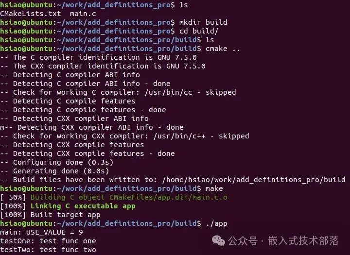
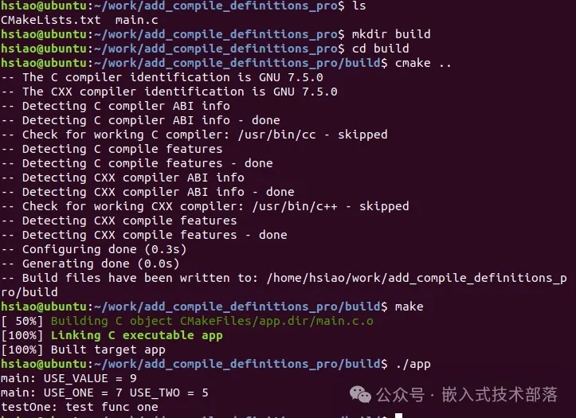
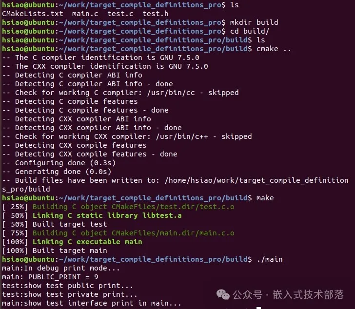
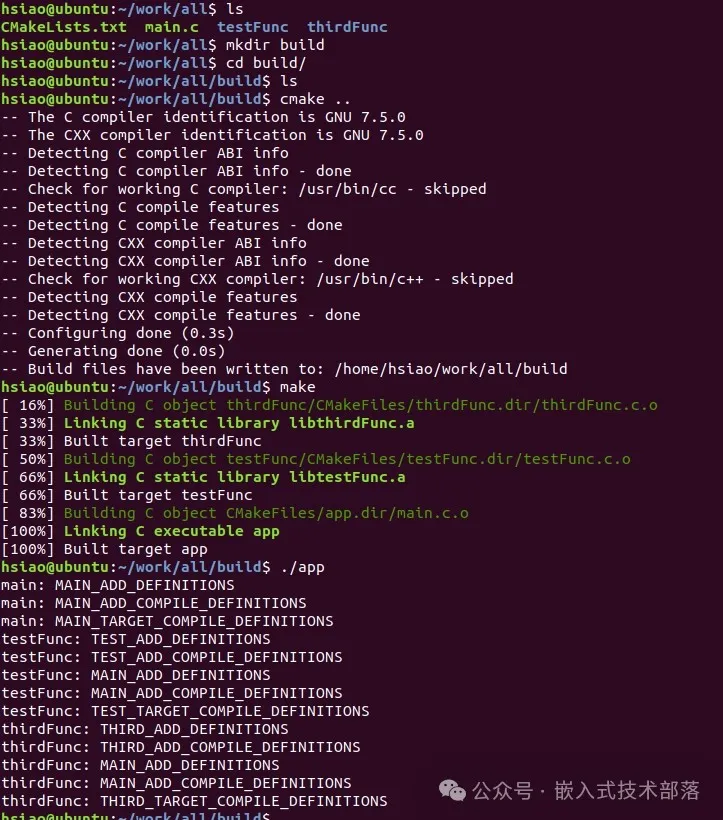

# CMake中增加预处理器定义的几种方法

### 一、前言

1、CMake中的预处理定义类似C语言中的预处理或宏定义。

2、CMake中预处理器定义的应用场景，可以用于控制编译过程中的条件编译，或者为源代码中的条件语句提供条件判断，或者作为变量供源代码使用。

3、CMak中增加预处理器定义的方法有三种：

   add_definitions、

   add_compile_definitions、

   target_compile_definitions。

### 二、add_definitions

add_definitions函数用于向编译器添加预处理器定义，它会在编译过程中将指定的预处理器定义添加到源代码中。

此前发布的一篇文章【CMake】CMake从入门到实战系列(七)详细介绍了add_definitions的基本用法和参数含义 ，此处我们优化补充一下。

#### 【1】基本语法

```
add_definitions(-D<definition> ...)
```

#### 【2】参数含义

> **-D**：告知 CMake 在后续的编译步骤中添加 -D 前缀的编译器标志。
>
> 
>
> **<definition>**：要添加的预处理器定义。
>
> 
>
> **…**: 可以是一个或多个定义，每个定义之间用空格分隔。例如add_definitions(-DUSE_ONE -DUSE_TWO)

#### 【3】示例

**1、目录结构**

```
add_definitions_pro
├── CMakeLists.txt
└── main.c
```

**2、CMakeList.txt源码**

```
cmake_minimum_required(VERSION 3.10)
project(Demo)

add_definitions(-DFUNC_TEST_ONE -DFUNC_TEST_TWO)
add_definitions(-DUSE_VALUE=9)

add_executable(app main.c)
```

**3、main.c源码**

```
#include <stdio.h>

void testOne()
{
    printf("testOne: test func one\n");
    return;
}

void testTwo()
{
    printf("testTwo: test func two\n");
    return;
}

void testThree()
{
    printf("testThree: test func three\n");
    return;
}

int main(int argc, char *argv[])
{
    printf("main: USE_VALUE = %d\n", USE_VALUE);
#ifdef FUNC_TEST_ONE
    testOne();
#endif
#ifdef FUNC_TEST_TWO
    testTwo();
#endif
#ifdef FUNC_TEST_THREE
    testThree();
#endif
    return 0;
}
```

**4、编译运行**

在add_definitions_pro目录中

```
mkdir build
cd build
cmake ..
make
```



### 三、add_compile_definitions

在CMake中add_compile_definitions用于向编译器添加预处理器定义，它会在编译过程中将指定的预处理器定义添加到源代码中。

#### 【1】基本语法

```
add_compile_definitions(<definition> ...)
```

#### 【2】参数含义

> **<definition>:** 需要添加的预处理器定义。
>
> 
> **…**: 可以是一个或多个定义，每个定义之间用空格分隔。

#### 【3】示例

**添加单个定义：**

`add_compile_definitions(MY_DEFINE)`，这相当于在编译时添加了 -DMY_DEFINE。

**添加多个定义：**

`add_compile_definitions(DEFINE_ONE DEFINE_TWO=2)`，这相当于在编译时添加了 -DDEFINE_ONE 和 -DDEFINE_TWO=2。

**1、目录结构**

```
add_compile_definitions_pro
├── CMakeLists.txt
└── main.c
```

**2、CMakeList.txt源码**

```
cmake_minimum_required(VERSION 3.10)
project(Demo)

add_compile_definitions(FUNC_TEST_ONE)
add_compile_definitions(USE_VALUE=9)
add_compile_definitions(USE_ONE=7 USE_TWO=5)

add_executable(app main.c)
```

**3、main.c源码**

```
#include <stdio.h>

void testOne()
{
    printf("testOne: test func one\n");
    return;
}

void testTwo()
{
    printf("testTwo: test func two\n");
    return;
}

int main(int argc, char *argv[])
{
    printf("main: USE_VALUE = %d\n", USE_VALUE);
    printf("main: USE_ONE = %d USE_TWO = %d\n", USE_ONE, USE_TWO);
#ifdef FUNC_TEST_ONE
    testOne();
#endif
#ifdef FUNC_TEST_TWO
    testTwo();
#endif
    return 0;
}
```

**4、编译运行**

在add_compile_definitions_pro目录中

```
mkdir build
cd build
cmake ..
make
```




### 四、target_compile_definitions

在CMake中target_compile_definitions用于为指定的构建目标的编译器添加预处理器定义。

与add_compile_definitions相比，target_compile_definitions允许您更精确地控制哪些目标接收特定的预处理器定义，从而增加了配置的灵活性和精细度。

target_compile_definitions针对构建的目标添加预处理器定义，而add_compile_definitions是针对源文件添加预处理器定义（实际上也隐含对当前构建目标添加预处理器定义）。因此，target_compile_definitions要求构建目标已经存在，也就是目标被add_executable()或add_library()等函数创建出来。

#### 【1】基本语法

```
target_compile_definitions(<target>
  		<INTERFACE|PUBLIC|PRIVATE> [items1...]
  		[<INTERFACE|PUBLIC|PRIVATE> [items2...] ...])
```

#### 【2】参数含义

> 1、 **<target>:** 目标名称，即您要为其添加预处理器定义的目标。它可以是由 add_executable，add_library，add_custom_target 等命令创建的任何目标。
>  
> 2、**<INTERFACE | PUBLIC | PRIVATE>:** 它们指定了预处理器定义的作用范围。
> **PRIVATE**: 这些定义仅对目标自身可见。若其他目标链接了当前目标，这些定义不会传递给链接的目标。
> **INTERFACE**: 这些定义仅适用于使用（即链接或依赖）当前目标的其他目标，而不会影响当前目标自己。
> **PUBLIC**: 这些定义既适用于当前目标自身，也会传递给其他链接或依赖了当前目标的目标。
>
> 总结起来就是PUBLIC既给自己用，也给别人用；PRIVATE只给自己用；INTERFACE只给别人用。

通过PUBLIC和PRIVATE范围限定的预处理器定义会被添加到构建目标的 COMPILE_DEFINITIONS属性中。

通过PUBLIC和INTERFACE范围限定的预处理器定义会被添加到构建目标的INTERFACE_COMPILE_DEFINITIONS属性中。

当多个构建目标在一起链接的时，最终的可执行文件会将各个构建目标的INTERFACE_COMPILE_DEFINITIONS属性继承过来。

对于-D的前导符和空字符串""会被CMake忽略，例如下面命令完全等价：

```
target_compile_definitions(target PUBLIC DEF_FLAG)
target_compile_definitions(target PUBLIC -DDEF_FLAG)  # -D 被移除
target_compile_definitions(target PUBLIC "" DEF_FLAG) # "" 被忽略
target_compile_definitions(target PUBLIC -D DEF_FLAG) # -D 变成 "" 然后被忽略
```

#### 【3】示例

**1、目录结构**

```
target_compile_definitions_pro
├── CMakeLists.txt
├── test.c
├── test.h
└── main.c
```

**2、CMakeList.txt源码**

```
cmake_minimum_required(VERSION 3.10)
project(Demo)

add_library(test test.c)
# 为test增加预编译选项
target_compile_definitions(test
                           PRIVATE PRIVATE_PRINT
                           PUBLIC PUBLIC_PRINT=9
                           INTERFACE INTERFACE_PRINT)

add_executable(app main.c)
target_compile_definitions(main PUBLIC DEBUG_PRINT)

target_link_libraries(app test)
```

**3、test.c源码**

```
#ifdef PUBLIC_PRINT
#include "test.h"
#include <stdio.h>

void test_print()
{
    printf("test:show test public print...\n");
#ifdef PRIVATE_PRINT
    printf("test:show test private print...\n");
#endif
#ifdef INTERFACE_PRINT
    printf("test:show test interface print...\n");
#endif
    return;
}
#endif
```

**4、test.h源码**

```
#ifndef __TEST_TT__
#define __TEST_TT__

#ifdef PUBLIC_PRINT
    void test_print();
#endif

#endif
```

**5、main.c源码**

```
#include "test.h"
#include <stdio.h>

int main(int argc, char** argv)
{
#ifdef DEBUG_PRINT
    printf("main:In debug print mode...\n");
#endif

#ifdef PUBLIC_PRINT
    printf("main: PUBLIC_PRINT = %d\n", PUBLIC_PRINT);
    test_print();
#endif

#ifdef PRIVATE_PRINT
    printf("main:show test private print in main...\n");
#endif

#ifdef INTERFACE_PRINT
    printf("main:show test interface print in main...\n");
#endif
    return 0;
}
```

**6、编译运行**
在target_compile_definitions_pro目录中

```
mkdir build
cd build
cmake ..
make
```



### 五、add_definitions、

###    add_compile_definitions、

###    target_compile_definitions 区别

#### 【1】区别

在CMake中，这三个指令都用于向编译器添加预处理器定义。它们之间的区别在于作用范围和使用方式，使用方式可看此文一开始介绍的它们相关的基本语法、参数含义、示例等，下面我们说明一下作用范围。

**1、add_definitions**

（1）作用范围：当前CMakeLists.txt目录及其子目录的所有目标。

（2）add_definitions不会影响到父目录或是在这个命令之前已经定义的目标。

（3）它是一个早期的命令，在CMake的新版本中，建议使用add_compile_definitions或者target_compile_definitions来取代它，因为这两个命令提供了更好的控制性和清晰的意图表示。

（4）add_definitions用于设置各种全局编译器标志，适用于希望在整个项目（或多个目标）中统一应用某些编译设置的情况。它对所有编译器标志有效，并能设置各种编译选项，例如-Wall、-g，而不局限于预处理器定义。

**2、add_compile_definitions**

（1）作用范围：当前CMakeLists.txt目录及其子目录的所有目标。

（2）add_compile_definitions不会影响到父目录或是在这个命令之前已经定义的目标。

（3）它的引入提供了一个更为清晰和具体的指令，同时它的目的是逐步替代add_definitions命令。

（4）add_compile_definitions专用于设置预处理器定义（相当于使用 -D 选项），适用于只需要定义预处理器宏的场景。

可以看到add_definitions和add_compile_definitions作用范围一样，但是add_definitions不仅可以设置预处理器定义，还可以设置各种编译器标志，add_compile_definitions只适用于设置预处理器定义。

**3、target_compile_definitions**

（1）作用范围：target_compile_definitions的作用范围非常具体，它只会应用于被指定的目标上，这个目标可以是库（library）或可执行文件（executable）。

（2）使用这个命令非常适合用于为特定的目标设置预处理器定义，而不会对其他目标造成干扰。

（3）target_compile_definitions 要求构建目标已经存在。

#### 【2】示例

**目录结构**

```
all
├── CMakeLists.txt
├── main.c
├── testFunc
│   ├── CMakeLists.txt
│   ├── testFunc.c
│   ├── testFunc.h
└── thirdFunc
    ├── CMakeLists.txt
    ├── thirdFunc.c
    └── thirdFunc.h
```

**编译运行**



**获取本篇文章源码下载地址**，微信关注公众号【 **嵌入式技术部落**】，发送消息 “ **cmake十四**”，获取下载地址。

有任何疑问，私信沟通交流