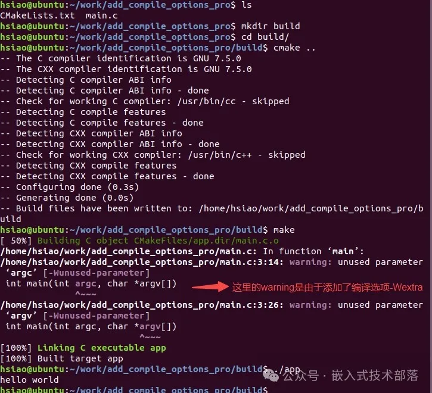
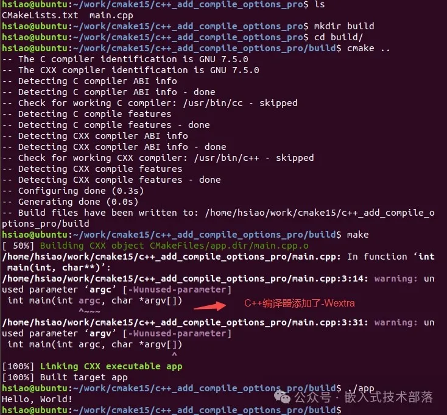

# CMake中添加编译选项的几种方法

### 一、前言

在嵌入式工作开发调试过程中，我们常会遇到需要添加编译选项的情况。添加适当的编译选项能够帮助我们更好地控制程序行为，优化代码，确保稳定性和性能。常见的编译选项有-s、-g、-O3、-fPIC、-Wall、-Werror、-Wextra等。

在CMake中为项目增加编译选项有多种方法，下面我们来详细介绍几种常见的方法。

### 二、add_compile_options

add_compile_options 添加全局编译选项，为整个项目添加编译选项。

#### 【1】基本语法

```
add_compile_options(<option> ...)
```

#### 【2】参数含义

> **<option>**：一个或多个要添加的编译选项，这些选项会传递给编译器

#### 【3】示例

**项目目录结构如下**

```
add_compile_options_pro
  ├── CMakeLists.txt
  └── main.c
```

**main.c\**源码\****

```
#include <stdio.h>

int main(int argc, char *argv[])
{
    printf("hello world\n");
    return 0;
}
```

**CMakeLists.txt源码**

```
cmake_minimum_required(VERSION 3.10)
project(Demo)

add_compile_options(-Wall -Wextra)

add_executable(app main.c)
```

上面的CMake配置将会为项目中的所有源文件添加 -Wall 和 -Wextra 编译选项。

**编译运行**
在add_compile_options_pro目录中

```
mkdir build
cd build
cmake ..
make
```



#### 【4】备注

使用 add_compile_options 针对不同的编译器（如C和C++编译器）设置编译选项是可以的，但需要确保生成器表达式的使用符合CMake的语法要求。

```
# 添加编译选项，适用于C++编译器
add_compile_options($<$<COMPILE_LANGUAGE:CXX>:-Wall> $<$<COMPILE_LANGUAGE:CXX>:-Wextra>)

# 添加编译选项，适用于C编译器
add_compile_options($<$<COMPILE_LANGUAGE:C>:-Wall> $<$<COMPILE_LANGUAGE:C>:-Wextra>)
```

**示例**

下面是一个示例：
**目录结构**

```
c++_add_compile_options_pro
├── CMakeLists.txt
└── main.cpp
```

**main.cpp\**源码\****

```
#include <iostream>

int main() 
{
    std::cout << "Hello, World!" << std::endl;
    return 0;
}
```

**CMakeLists.txt\**源码\****

```
cmake_minimum_required(VERSION 3.10)
project(HelloWorld)

# 添加编译选项，适用于C++编译器
add_compile_options($<$<COMPILE_LANGUAGE:CXX>:-Wall> $<$<COMPILE_LANGUAGE:CXX>:-Wextra>)

add_executable(hello main.cpp)
```

**编译运行**



### 

### 三、target_compile_options

target_compile_options针对某个特定的目标（如库或可执行文件）添加编译选项 。

#### 【1】基本语法

```
target_compile_options(<target> [BEFORE]
  		<INTERFACE|PUBLIC|PRIVATE> [items1...]
  		[<INTERFACE|PUBLIC|PRIVATE> [items2...] ...])
```

#### 【2】参数含义

> **<target>**: 目标名称，即你想要为其添加编译选项的库或可执行文件的名称。
> target_compile_options要求构建目标已经存在，也就是目标被add_executable()或add_library()等函数创建出来。
>  
> **PRIVATE | PUBLIC |INTERFACE**: 这三个关键字控制了这些选项的应用范围。
> PRIVATE: 选项只应用于当前目标。
> PUBLIC:选项既应用于当前目标，也应用于那些链接到当前目标的其他目标。
> INTERFACE: 选项只应用于链接到当前目标的其他目标。
>  
> **items1…、items2…**: 一个或多个要添加的编译选项。

#### 【3】示例

**项目目录结构**、**main.c****源码**和上面所述add_compile_options中**【3】示例**中的一样，此处不再赘述。

**CMakeLists.txt****源码**

```
cmake_minimum_required(VERSION 3.10)
project(Demo)

add_executable(app main.c)
target_compile_options(app 
			PRIVATE -Wall -Wextra
			PUBLIC -g)
```

这样，只有 app目标会应用 -Wall 和 -Wextra 编译选项。

**编译运行结果**同上，可自行编译运行测试。

#### 【4】备注

target_compile_options 可以用于针对 C 和 C++ 编译器分别设置编译选项。使用生成器表达式，您可以为特定目标的不同编译语言添加不同的选项。

```
# 为 C++ 文件添加编译选项
target_compile_options(hello PRIVATE $<$<COMPILE_LANGUAGE:CXX>:-Wall -Wextra>)

# 为 C 文件添加编译选项（当前没有 C 文件，但可以启用以下行）
target_compile_options(hello PRIVATE $<$<COMPILE_LANGUAGE:C>:-Wall -Wextra>)
```

**示例**
**目录结构**、**main.cpp****源码**和add_compile_options备注里的示例一样，此处不再赘述。

**CMakeLists.txt****源码**

```
cmake_minimum_required(VERSION 3.10)
project(HelloWorld)

add_executable(hello main.cpp)

# 为 C++ 文件添加编译选项
target_compile_options(hello PRIVATE $<$<COMPILE_LANGUAGE:CXX>:-Wall -Wextra>)
# 为 C 文件添加编译选项（当前没有 C 文件，但可以启用以下行）
target_compile_options(hello PRIVATE $<$<COMPILE_LANGUAGE:C>:-Wall -Wextra>)
```

**编译运行结果**同add_compile_options备注里的一样，此处不再赘述。

### 四、CMAKE_C_FLAGS 或 

###    CMAKE_CXX_FLAGS

直接设置全局编译选项。
通过set设置 CMAKE_C_FLAGS 变量来全局添加C编译选项。
通过set设置 CMAKE_CXX_FLAGS 变量来全局添加C++编译选项。
这种方法会将指定的编译选项应用于所有C源文件或C++源文件。

**项目目录结构**、**main.c****源码**和上面所述add_compile_options**【3】示例**中的一样，此处不再赘述。

**CMakeLists.txt****源码**

```
cmake_minimum_required(VERSION 3.10)
project(Demo)

# C编译选项
set(CMAKE_C_FLAGS "${CMAKE_C_FLAGS} -Wall -Wextra")
# C++编译选项
set(CMAKE_CXX_FLAGS "${CMAKE_CXX_FLAGS} -Wall -Wextra")

add_executable(app main.c)
```

**编译运行结果**同上，可自行编译运行测试。

本文完整源码下载地址 （永久有效）

> 链接：https://pan.baidu.com/s/11kQGMVQ-TWvZy-KC7QBjtw
>
> 提取码：JGFD

该专栏下一篇文章将总结如何修改CMake的编译器，以及实际嵌入式开发工作中常用到的编译器选项的归纳汇总。

有任何建议或疑问，欢迎私信交流沟通。