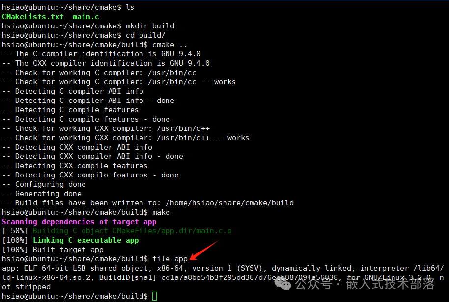
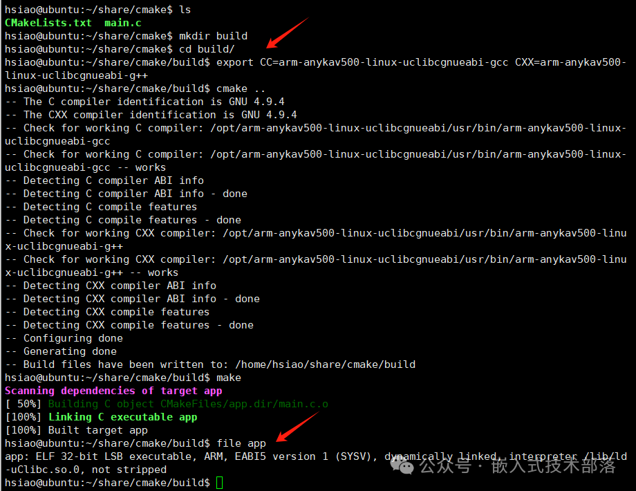
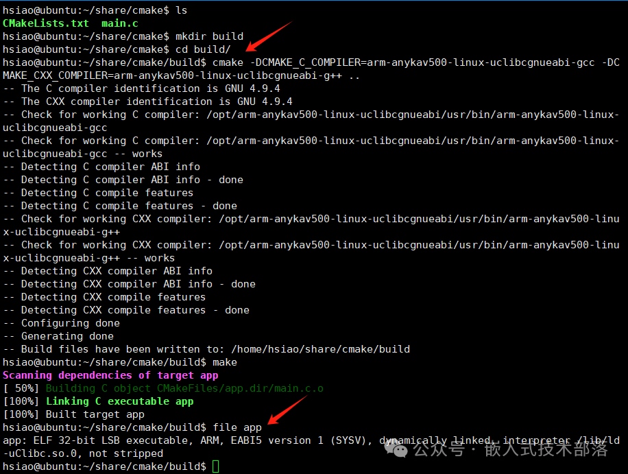
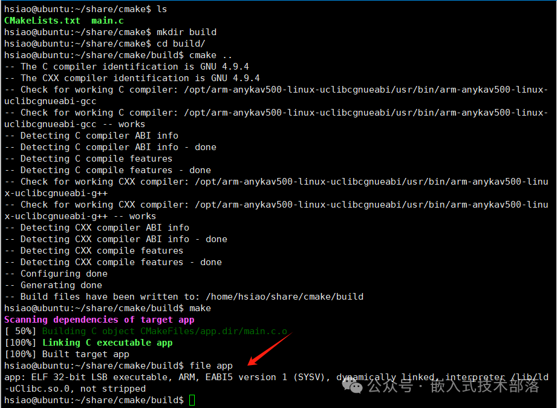

# CMake中设置交叉编译

### 一、前言

CMake是一个强大的跨平台的编译工具，实际嵌入式开发过程中，经常需要使用到交叉编译。在Ubuntu环境中，CMake如果不设置交叉编译，默认情况下，会使用Ubuntu系统（运行 cmake 命令的操作系统）的编译器来编译我们的工程，那么得到的可执行文件或库文件只能在 Ubuntu 系统运行。

如果我们需要使得编译得到的可执行文件或库文件能够在ARM 平台上运行，则需要配置交叉编译，这时就要将系统默认编译器切换到相对应的平台的编译器。例如，同一套代码编译出的执行文件，在海思平台上运行，则需要使用海思的交叉编译工具编译出对应的执行文件，在君正上运行，则需要使用君正的交叉编译工具编译出对应的执行文件。

### 二、切换编译器的方法

切换编译器有以下几种方法：

#### 1、修改系统环境变量来指定编译器

可以在运行cmake命令之前设置系统环境变量来指定编译器。例如：

```
export CC=<C编译器> CXX=<C++编译器>
```

<C编译器>和<C++编译器>为有效的编译器名称或者指定完整路径。
将编译器的路径添加到系统的PATH环境变量中，可以使你在命令行中直接使用编译器的名称而不需要指定完整路径。

#### 2、CMake命令行中指定编译器

可以在运行cmake命令时通过-D选项来指定编译器。例如：

```
cmake -DCMAKE_C_COMPILER=<C编译器> -DCMAKE_CXX_COMPILER=<C++编译器>
```

<C编译器>和<C++编译器>为有效的编译器名称或者指定完整路径。
将编译器的路径添加到系统的PATH环境变量中，可以使你在命令行中直接使用编译器的名称而不需要指定完整路径。

#### 3、CMakeLists.txt中指定编译器

使用set命令在CMakeList.txt设置指定编译器。例如：

```
set(CMAKE_C_COMPILER “C编译器”)
set(CMAKE_CXX_COMPILER “C++编译器”)
```

C编译器和C++编译器为有效的编译器名称或者指定完整路径。
将编译器的路径添加到系统的PATH环境变量中，可以使你在命令行中直接使用编译器的名称而不需要指定完整路径。

#### 4、示例

目录结构

```
project
  ├── CMakeLists.txt
  └── main.c
```

main.c源码

```
#include <stdio.h>

int main(int argc, char* argv[])
{
    printf("hello world\n");
    return 0;
}
```

CMakeLists.txt源码

```
cmake_minimum_required(VERSION 3.10)
project(Demo)

add_executable(app main.c)
```

下面用系统默认编译器以及上面总结的三种方法切换编译器进行编译，看一下结果
【1】系统默认编译器gcc编译

通过file命令查看编译出的执行文件属性，x86_64表示该文件是为 64 位 x86 架构编译的。这对于确保软件兼容性和性能优化非常重要。如果你在一个 x86_64 系统上运行程序，确保它们也是为 x86_64 架构编译的。

【2】修改系统环境变量

通过file命令查看编译出的执行文件属性，ARM表示该文件是为 ARM 架构编译的。

【3】CMake命令行中指定编译器

通过file命令查看编译出的执行文件属性，ARM表示该文件是为 ARM 架构编译的。

【4】CMakeLists.txt中指定编译器
修改CMakeLists.txt内容

```
cmake_minimum_required(VERSION 3.10)
project(Demo)

set(CMAKE_C_COMPILER "arm-anykav500-linux-uclibcgnueabi-gcc")
set(CMAKE_CXX_COMPILER "arm-anykav500-linux-uclibcgnueabi-g++")
add_executable(app main.c)
```


通过file命令查看编译出的执行文件属性，ARM表示该文件是为 ARM 架构编译的。