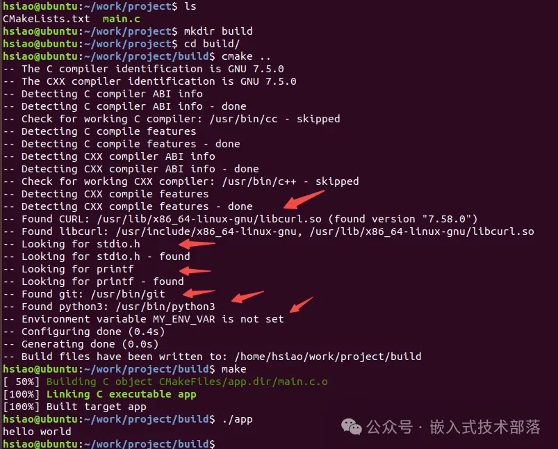

# CMake添加环境检查

## 一、前言

在使用CMake构建C/C++项目时，添加环境检查可以确保构建环境满足项目的需求，例如检查编译器版本、依赖库的存在、头文件和函数的存在等。CMake提供了一些内置的模块和命令来进行这些检查。以下是详细步骤和示例，说明如何在CMake中添加环境检查。

## 二、检查CMake版本

首先，可以确保使用的CMake版本满足项目的最低要求：

```
cmake_minimum_required(VERSION 3.20)  # 设置最低要求的CMake版本
```

## 三、检查编译器

可以检查编译器及其版本是否满足要求：

```
# 检查C编译器版本
if(CMAKE_C_COMPILER_VERSION VERSION_LESS 5.0)
    message(FATAL_ERROR "Requires at least gcc 5.0")
endif()
```

## 四、检查依赖库

可以使用find_package命令来检查依赖库是否存在：

```
# 查找libcurl库
find_package(CURL REQUIRED)

if(NOT CURL_FOUND)
    message(FATAL_ERROR "libcurl not found")
else()
    message(STATUS "Found libcurl: ${CURL_INCLUDE_DIRS}, ${CURL_LIBRARIES}")
endif()
```

要在Ubuntu上安装libcurl库，可以使用以下步骤：

> 1、打开终端。
> 2、运行以下命令更新软件包列表：
> sudo apt update
> 3、运行以下命令安装libcurl库：
> sudo apt install libcurl4-openssl-dev
> 这将安装libcurl库及其开发文件。
> 安装完成后，你可以使用libcurl库来编译和运行程序。

## 五、检查头文件和函数

可以使用check_include_file和check_function_exists命令来检查头文件和函数是否存在：

```
include(CheckIncludeFile)
include(CheckFunctionExists)

# 检查头文件
check_include_file("stdio.h" HAVE_STDIO_H)
if(NOT HAVE_STDIO_H)
    message(FATAL_ERROR "stdio.h not found")
endif()

# 检查函数
check_function_exists("printf" HAVE_PRINTF)
if(NOT HAVE_PRINTF)
    message(FATAL_ERROR "printf function not found")
endif()
```

## 六、检查程序

可以使用find_program命令来检查某些程序是否存在：

```
# 查找git程序
find_program(GIT_EXECUTABLE git)
if(NOT GIT_EXECUTABLE)
    message(FATAL_ERROR "git not found")
else()
    message(STATUS "Found git: ${GIT_EXECUTABLE}")
endif()

# 查找python3程序
find_program(PYTHON_EXECUTABLE python3)
if(NOT PYTHON_EXECUTABLE)
    message(FATAL_ERROR "python3 not found")
else()
    message(STATUS "Found python3: ${PYTHON_EXECUTABLE}")
endif()
```

## 七、自定义检查

可以编写自定义的CMake脚本进行更复杂的检查。例如，检查某个环境变量是否设置：

```
# 自定义检查
if(NOT DEFINED ENV{MY_ENV_VAR})
    message(STATUS "Environment variable MY_ENV_VAR is not set")
endif()
```

## 八、完整示例

**目录结构**

```
project/
├── CMakeLists.txt
├── main.c
```

**CMakeLists.txt****源码**

```
include(CheckIncludeFile)
include(CheckFunctionExists)

# 设置最低要求的CMake版本
cmake_minimum_required(VERSION 3.20)
project(Demo)

# 检查C编译器版本
if(CMAKE_C_COMPILER_VERSION VERSION_LESS 5.0)
    message(FATAL_ERROR "Requires at least gcc 5.0")
endif()

# 查找libcurl库
find_package(CURL REQUIRED)

if(NOT CURL_FOUND)
    message(FATAL_ERROR "libcurl not found")
else()
    message(STATUS "Found libcurl: ${CURL_INCLUDE_DIRS}, ${CURL_LIBRARIES}")
endif()

# 检查头文件
check_include_file("stdio.h" HAVE_STDIO_H)
if(NOT HAVE_STDIO_H)
    message(FATAL_ERROR "stdio.h not found")
endif()

# 检查函数
check_function_exists("printf" HAVE_PRINTF)
if(NOT HAVE_PRINTF)
    message(FATAL_ERROR "printf function not found")
endif()

# 查找git程序
find_program(GIT_EXECUTABLE git)
if(NOT GIT_EXECUTABLE)
    message(FATAL_ERROR "git not found")
else()
    message(STATUS "Found git: ${GIT_EXECUTABLE}")
endif()

# 查找python3程序
find_program(PYTHON_EXECUTABLE python3)
if(NOT PYTHON_EXECUTABLE)
    message(FATAL_ERROR "python3 not found")
else()
    message(STATUS "Found python3: ${PYTHON_EXECUTABLE}")
endif()

# 自定义检查
if(NOT DEFINED ENV{MY_ENV_VAR})
    message(STATUS "Environment variable MY_ENV_VAR is not set")
endif()

add_executable(app main.c)
```

**main.c****源码**

```
#include <stdio.h>

int main(void)
{
    printf("hello world\n");
    return 0 ;
}
```

**编译运行**
ubuntu上编译运行，project目录执行命令

```
mkdir build
cd build
cmake ..
make
```

**结果：**


该专栏下一篇文章我们总结CMake中所有查找指令。