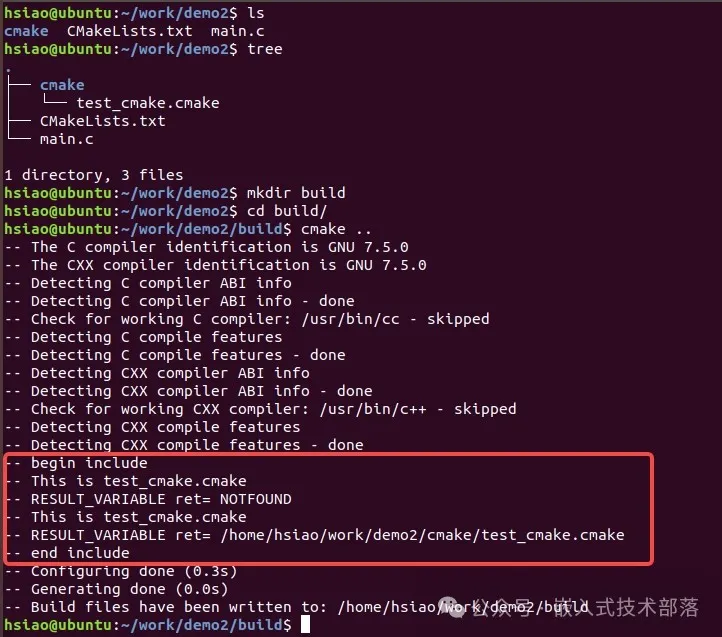

# CMake中的include指令，提高项目的模块化和可重用性

## 一、概述

CMake官网中对于include指令的介绍，如下：

> Load and run CMake code from a file or module.

翻译：从文件或模块加载并运行CMake代码。

CMake中的include 指令用于将其他CMake文件或模块包含到当前文件中，并且在当前作用域有效。这条指令会读取所包含文件中的代码，并立即执行这些命令，就好像它们直接写在 include 命令所在的位置一样。

CMake中的include指令一般用于语句的复用，也就是说，如果有一些语句需要在很多CMakeLists.txt文件中使用，为避免重复编写，可以将其写在.cmake文件中，然后在需要的CMakeLists.txt文件中进行include操作就行了。

> **.cmake文件里面通常是什么信息呢？**
>  
> .cmake文件里可以定义变量、函数、宏或CMake指令等，当CMakeLists.txt包含该.cmake文件时，当编译运行时，该.cmake里的一些命令就会在该包含处得到执行，并且在包含以后的地方能够调用该.cmake里的变量、宏和函数。

CMake 的 include 指令默认是在全局作用域中包含文件，这意味着被包含文件中的任何变量、函数、宏或CMake指令在后续的 CMake 文件中都是可见的。如果你在一个文件中使用 include(other_file.cmake)，而 other_file.cmake 中定义的变量、函数或宏，之后的任何地方都可以访问。如果两个文件都有同名变量，后被包含的文件中的变量将覆盖前一个文件中的变量，这可能导致意外的行为。

include作用域根据它们的定义位置和设置方式而有所不同。理解include作用域的特性有助于避免变量冲突及管理 CMake 文件或模块的复杂性。这些特性是 CMake 强大的模块化和可组合性设计的基础，使得大型项目能够更好地管理和组织代码并避免代码重复。

## 二、指令详解

### 【1】基本语法

```
include(<file|module> [OPTIONAL] [RESULT_VARIABLE <var>]
                      [NO_POLICY_SCOPE])
```

### 【2】参数含义

**file**：指定一个CMake文件路径，通常情况下是以 .cmake 为后缀的文件。file 表示要包含的文件的路径，路径可以是相对路径或绝对路径。如果文件名不包含路径分隔符，CMake 会首先在当前目录查找指定的文件，如果没有找到，它还会根据 CMAKE_MODULE_PATH 和系统默认路径继续查找。关于CMAKE_MODULE_PATH 看本文下面详解

**module**：指定一个CMake模块的名称，CMake会在模块目录中查找该模块。如果指定的是一个模块（module）而不是一个文件，查找的对象会变成路径CMAKE_MODULE_PATH下的文件<modulename>.camke。如果在 CMAKE_MODULE_PATH 中找不到，CMake 会在默认的系统模块路径中继续查找。关于CMAKE_MODULE_PATH 看本文下面详解

**OPTIONAL**：如果设置了这个选项，CMake在找不到指定文件或模块时不会产生错误，而是继续执行后面的指令。

**RESULT_VARIABLE <var>**：如果设置了RESULT_VARIABLE选项，那么var会被设置为被包含文件的完整路径，表示找到该文件，或者被设置为NOTFOUND，NOTFOUND表示没有找到该文件。

**NO_POLICY_SCOPE**：使用此选项时，包含的文件将不受当前作用域的政策设置影响，从而保证文件内部政策的独立性。如果你希望包含的文件能够独立于当前作用域的政策设置而运行，或者需要确保包含的文件在执行时遵循自己的逻辑和行为，使用 NO_POLICY_SCOPE 是合适的选择。关于NO_POLICY_SCOPE 看本文下面详解

上面详细介绍了include指令的所有可选参数，但是一般情况下，都是直接写：

```
include(file|module)
```

> **CMAKE_MODULE_PATH** 详解
>
> 
> 1、CMAKE_MODULE_PATH 是 CMake 中的一个变量，用于指定 CMake 查找模块文件（.cmake文件）时的搜索路径。
>  
> 2、默认情况下，CMake 会在其内置的模块路径 (例如 CMake 安装目录下的 Modules文件夹) 中搜索模块文件。如果你有自定义的模块文件 (比如项目中某些特定的查找模块)，就可以通过设置 CMAKE_MODULE_PATH 来告诉CMake 在何处查找这些文件。
>  
> 3、CMAKE_MODULE_PATH 可以包含一个或多个路径。你可以在 CMakeLists.txt 文件中使用 set 命令来设置这个变量。例如：
>
> ```
> set(CMAKE_MODULE_PATH ${CMAKE_MODULE_PATH} ${CMAKE_SOURCE_DIR}/cmake/modules)
> ```
>
> ${CMAKE_MODULE_PATH}：这里用到了变量替换，表示当前 CMAKE_MODULE_PATH 变量的值。通过将它放在前面，你可以保持之前的路径设置，而不会覆盖它。
>  
> ${CMAKE_SOURCE_DIR}/cmake/modules：这是您想要添加的新路径，CMAKE_SOURCE_DIR 代表项目的根目录。通过组合这个路径，您可以指定一个相对路径或绝对路径，具体取决于 CMAKE_SOURCE_DIR 的值。
>  
> 这行代码会将项目源目录下的 cmake/modules 添加到CMAKE_MODULE_PATH 中。这样，CMake 在查找模块时会首先检查这个目录

> **NO_POLICY_SCOPE** 详解
>
> 
> NO_POLICY_SCOPE参数是一个可选参数，它的作用是：当使用此参数时，被包含的CMake脚本文件中的策略设置不会影响包含它的脚本文件。
>  
> 在CMake中，策略（Policy）是一种机制，用于定义如何处理某些编码实践或语言特性。随着 CMake 版本的更新，某些行为可能会改变，因此引入了策略机制，以确保对新旧语法的支持。每个策略都有一个唯一的标识符（如 CMP0026），用来定义某个特定的行为或功能。这使得开发者能够选择在其项目中使用旧版本的行为或新的推荐行为。
>
> 
> CMake 中的策略状态可以分为以下几种：OLD：使用旧的行为。NEW：使用新的推荐行为。WARN：在配置期间发出警告，提示策略经过更改。IGNORE：忽略该策略。
>  
> 当你在一个脚本中更改策略状态，然后在另一个脚本中包含这个更改策略的脚本时，如果没有使用NO_POLICY_SCOPE参数，那么包含的脚本将继承这些策略更改。因此，如果你在一个脚本中设置了某个策略，后续被包含的脚本将会继承这个设置。这可能导致一些意外的错误，特别是在大型项目中。使用 NO_POLICY_SCOPE 可以防止这种策略的传递。这样，你可以确保被包含的脚本对策略所做的修改不会影响调用它的脚本。
>  
> 例如，如果你有两个CMake脚本：main.cmake和policy.cmake。在policy.cmake中，你可能设置了某种策略，然后在main.cmake中包含了policy.cmake。如果在包含中没有使用NO_POLICY_SCOPE参数，那么在policy.cmake中所做的任何策略更改都会影响main.cmake。
>  
> 这是一个简单的例子：
>
> ```
> # policy.cmake 
> cmake_policy(SET CMP0026 NEW)
> 
> # main.cmake 
> include(policy.cmake)
> # 在这里，CMP0026策略已经被设置为NEW
> 
> # 如果你想阻止这种策略传递，你可以这样写：
> include(policy.cmake NO_POLICY_SCOPE)
> # 这样，CMake将不会将策略更改传播到包含文件的上下文中。
> ```
>
> 在这个例子中，如果你在policy.cmake中更改了策略，但是你在main.cmake中使用了NO_POLICY_SCOPE参数，那么main.cmake将不会看到这些策略更改。这对于在大型项目中管理策略设置非常有用，可以帮助防止策略的不一致和混乱。

### 【3】示例源码

##### 目录结构

```
project/
├── cmake
│   └── test_cmake.cmake
├── CMakeLists.txt
└── main.c
```

##### main.c源码

```
#include <stdio.h>

int main() {
    printf("This is main\n");
    return 0;
}
```

##### test_cmake.cmake源码

```
message(STATUS "This is test_cmake.cmake")
```

##### CMakeLists.txt源码

```
cmake_minimum_required(VERSION 3.9.0)
project(demo)

message(STATUS "begin include")
include("cmake/test_cmake.cmake")
include("cmake/test_cmake1.cmake" OPTIONAL) #OPTIONAL 可选，文件不存在不报错
include("cmake/test_cmake1.cmake" OPTIONAL  RESULT_VARIABLE ret) # RESULT_VARIABLE 返回值，是否引用成功
message(STATUS "RESULT_VARIABLE ret= ${ret}") #NOTFOUND
include("cmake/test_cmake.cmake" OPTIONAL  RESULT_VARIABLE ret)
message(STATUS "RESULT_VARIABLE ret= ${ret}") #导入文件的绝对路径
message(STATUS "end include")

add_executable(app main.c)
```

##### 编译运行



## 三、注意事项

**循环包含**：由于include指令的作用域是全局的，你需要小心避免循环包含。例如，如果文件A包含了文件B，而文件B又包含了文件A，这将导致无限递归和构建错误。

**变量覆盖**：被包含的文件中的变量设置可能会覆盖当前文件中的同名变量。因此，在包含其他文件之前，最好先设置或保存需要保护的变量。

**路径问题**：确保你正确指定了要包含的文件的路径。如果文件不存在或路径不正确，CMake将抛出一个错误。

## 四、源码下载地址

> https://github.com/Turing425/cmake_include


## 五、写在最后

关于CMake中的include指令总结完毕，如有问题，欢迎随时交流