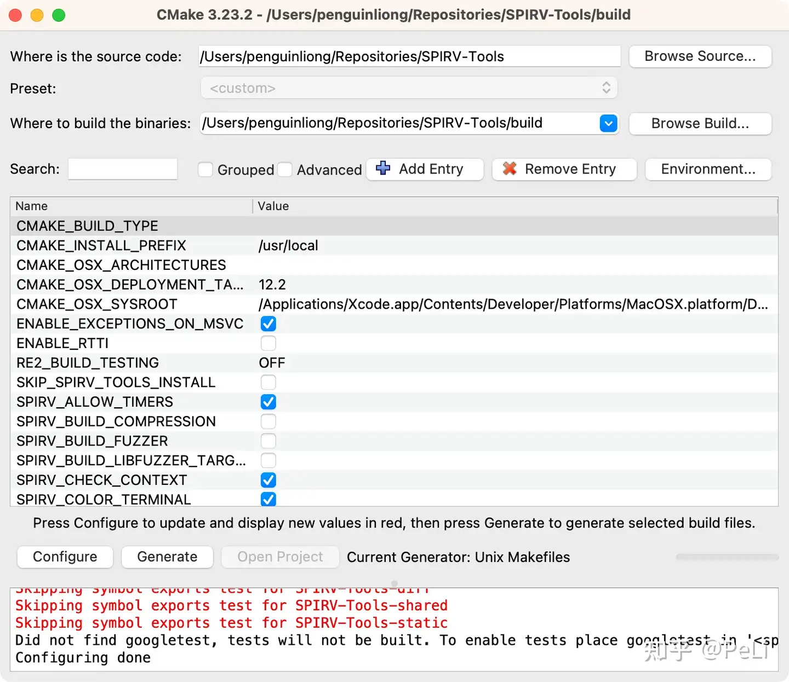
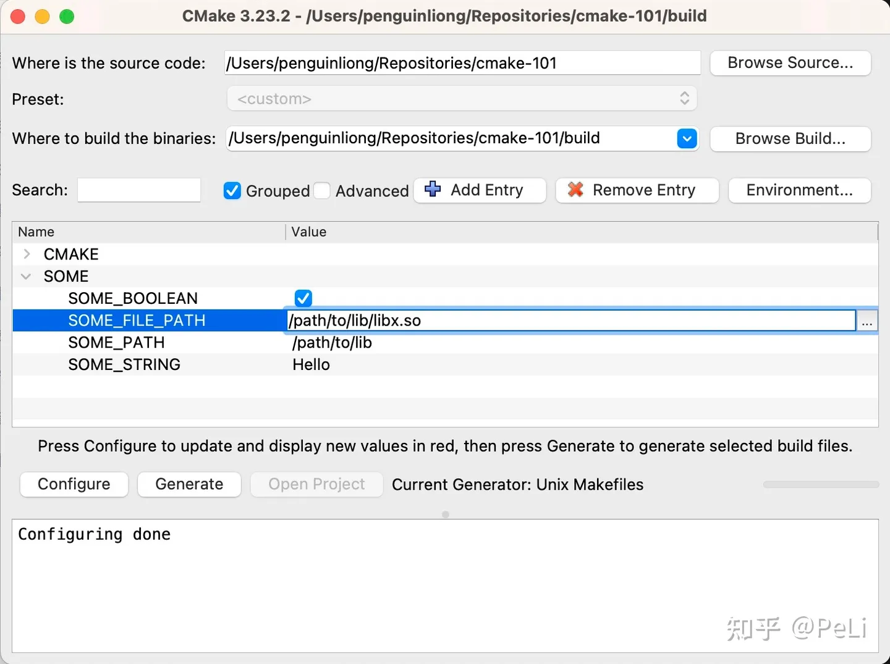

# CMake：2. 自定义配置


在上一篇文章中我们介绍了 CMake 作为*静态 C++ 项目配置工具* 的使用方法。通过今天这篇文章，你会进一步了解，如何使用 CMake 的参数配置项目。我会根据我开发中遇到的各种常见情景，为你介绍 CMake 中你必须熟悉的几个功能。


## 项目生成器

通过上一篇文章，我们知道 CMake 本身没有构建项目的能力。CMake 会**生成**（generate）其他**构建器**（builder）的项目文件，并调用对应的构建器进行**构建**（build）。而用于生成这些项目文件的 CMake 模块叫做 **生成器**（generator）。

下面是 macOS 上 CMake 3.25 支持的生成器（节选）。

```text
* Unix Makefiles               = Generates standard UNIX makefiles.
  Ninja                        = Generates build.ninja files.
  Ninja Multi-Config           = Generates build-<Config>.ninja files.
  Xcode                        = Generate Xcode project files.
  ...
```

下面是 Windows 上 CMake 3.26 支持的生成器（节选）。

```text
* Visual Studio 17 2022        = Generates Visual Studio 2022 project files.
                                 Use -A option to specify architecture.
  Visual Studio 16 2019        = Generates Visual Studio 2019 project files.
                                 Use -A option to specify architecture.
  Visual Studio 15 2017 [arch] = Generates Visual Studio 2017 project files.
                                 Optional [arch] can be "Win64" or "ARM".
  Visual Studio 14 2015 [arch] = Generates Visual Studio 2015 project files.
                                 Optional [arch] can be "Win64" or "ARM".
  Visual Studio 12 2013 [arch] = Generates Visual Studio 2013 project files.
                                 Optional [arch] can be "Win64" or "ARM".
  Visual Studio 11 2012 [arch] = Deprecated.  Generates Visual Studio 2012
                                 project files.  Optional [arch] can be
                                 "Win64" or "ARM".
  Visual Studio 9 2008 [arch]  = Generates Visual Studio 2008 project files.
                                 Optional [arch] can be "Win64" or "IA64".
  Unix Makefiles               = Generates standard UNIX makefiles.
  Ninja                        = Generates build.ninja files.
  Ninja Multi-Config           = Generates build-<Config>.ninja files.
  ...
```

你可以使用 `-G` 选择要使用的生成器，在没有指定时，CMake 会默认使用上面注有星号（*）的生成器。比如说你想用 VS2022 进行构建 64 位的 Windows 程序，就可以这样调用 CMake：

```text
cmake . -B build -G "Visual Studio 17 2022" -A x64
```

我个人比较喜欢用 [ninja-build](https://link.zhihu.com/?target=https%3A//github.com/ninja-build/ninja)，因为它的构建速度很快。

```bash
cmake . -B build -GNinja # 这里没有打错，单横线开头的 flag 是可以省略空格的。
```

### 生成器的编译器和链接器

但是需要注意的是，不同的生成器下，CMake 会选择不同的**编译器**（compiler）和**链接器**（linker）。比如：

- macOS 下的 Ninja 会优先使用 XCode 自带的 `clang++` 和 `ld`；
- Windows 下用 Visual Studio 生成优先使用 Visual Studio 自带的 `cl.exe` 和 `link.exe`；
- 但同样是在 Windows 下，如果你通过 Visual Studio Installer 安装了 Clang，使用 Ninja 生成的项目会优先使用 `clang++.exe` 和 `lld-link.exe`。

不同的编译器和链接器开关选项不同，会触发编译错误的条件也不尽相同。在不固定开发环境（构建器、编译器、链接器）的情况下，很有可能会出现**一个环境上可以编过的项目，在另一个环境构建失败的问题**（It works on my machine!）。而编写能够跨平台编译的 C++ 代码，就是很考验开发者功底的一件事情了，大家可以自己去进步学习，此处不再赘述。

## 构建类型

根据开发场景的不同，我们可能会考虑使用不同的编译、链接选项。如果你用过 Visual Studio、Xcode 或者 Android Studio，你应该在构建时见过“Debug”和“Release”这两种它们叫做**配置**（config）的东西。CMake 里对应的概念叫做**构建类型**（build type）。CMake 预置了 `Release`、`MinSizeRel`、`Debug`、`RelWithDebInfo` 四种构建类型，分别对应了四种常见的开发场景。

**发布模式**（Release）和**最小发布模式**（MinSizeRel）比较类似，用于产生最终发布出去的二进制文件。在 Release 下，CMake 默认启用各类能够**提升执行效率的优化**；而 MinSizeRel 下，CMake 会启用各类能够**缩小输出二进制体积的优化**。这些暴力优化会破坏机器码和 C++ 源码之间的对应关系，所以我们一般认为这两种发布模式产生的软件是无法调试的。

**调试模式**（Debug）会关闭几乎所有编译优化，尽可能地保留源码和机器码之间的位置关系，适合开发调试，但代价是会产生巨大的符号数据库。举例来说，我曾经有次尝试在 Debug 模式下编译 LLVM。编到一半报错说磁盘空间不足，最后发现它产生的中间文件占了几百 G，把我 1T 的硬盘写满了……

**可调试发布模式**（RelWithDebInfo）是上面两种情况的折中。启用一部分优化，但尽量保留源码和机器码的位置关系，符号数据库的体积也相对较小。这种模式下产生的软件是可以调试的，但是保留的信息肯定没有 Debug 模式那么多，会出现调不出来的情况。

我们可以通过定义 `-DCMAKE_BUILD_TYPE` 来指定配置时使用的构建类型。

```text
cmake . -B build -GNinja -DCMAKE_BUILD_TYPE=Release
```

### 多配置构建器

需要注意的是，构建器存在**单配置**（single-config）和**多配置**（multi-config）之分。多配置构建器允许你把多组编译选项写在同一个项目文件里，触发构建的时候再选择要用哪组选项。Visual Studio、Xcode 这种大型构建系统基本都支持多配置构建；而 Makefile 这种比较精简的构建器则不支持。 Ninja 比较特殊，Ninja 同时支持单配置项目和多配置项目，具体有没有多配置的支持取决于你的 CMake 生成器是 `-GNinja`还是 `-G"Ninja Multi-Config"`。

举例来说，在使用**单配置**的 `Ninja` 的时候，你需要在**配置的时候进行指定**。

```bash
cmake . -B build -GNinja -DCMAKE_BUILD_TYPE=Release
cmake --build build
```

而使用**多配置**的 `Ninja Multi-Config` 的时候，你需要在**启动构建的时候进行指定**。

```bash
cmake . -B build -G"Ninja Multi-Config"
cmake --build build --config=Release
```

多配置构建系统的好处在于，每种配置都有自己的工作目录，编译的中间文件都是放在各自的目录下面的。你前脚在用 Release config 测性能，后脚在 Debug config 下面调试新算法的内存问题，中间切换 build type 的时候不需要重新跑 CMake 脚本。不然配置完编译选项变了，构建器就得把原来所有中间文件删了重新编译一遍，对于大型项目来说这非常浪费时间。

## 变量

想象一下，你做的软件依赖于一个第三方 SDK，你要保证每个有这个 SDK 的人都能构建你的项目，但这个 SDK 可能会被装到各种奇葩位置，你也不知道该怎么自动搜索这个 SDK 的安装路径，这个时候你该怎么办呢？

最简单的方法当然是让装它的那个人亲自给你带个路。跟 Linux 不一样，Windows 没有 `/usr/local/lib` 这种方便的统一目录，所以这种需求在 Windows 开发中非常常见，也是 CMake 变量系统主要解决的问题。

我曾经听到过非常多人吐槽 CMake 的变量读写混乱，控制流不灵活。我觉得他们忽略了很重要的一点：CMake 变量系统的设计初衷是为了让你能通过 GUI 界面快速配置环境，而不是让你在 CMake 脚本里写一些非常复杂的控制逻辑自己去搜。



是不是有人甚至就没见过这个东西？

当然了，时代在变化。大家也都不喜欢把一个个依赖分开编译，都想靠脚本 heuristic 和 convention 一步到位。CMake 这种思路就显得有些过时了。但设计已经这样定下来了，也没法改了不是。搞清楚设计的出发点，能让你更好地理解 CMake 为什么变成了现在这个鬼样子。

扯远了。CMake 中的变量可以分为三种：**临时变量**、**环境变量**和**缓存变量**。

### 临时变量

临时变量是CMake 脚本执行流程中设置的变量。你可以通过 `set` 命令设定一个临时变量。

举例来说，配置如下的 CMakeLists.txt 时会输出 Hello。

```cmake
set(HELLO "Hello")
message(${HELLO})
```

而 `HELLO` 这个变量的取值在 cmake 退出时就会被丢弃。

### 环境变量

环境变量即你从命令行拉起 CMake 时操作系统配置的环境变量，用法上和临时变量没有什么区别。

你可以用 `$ENV{变量名}` 来获取环境变量的值。举例来说，你想看看你当前环境里的 NDK 装到哪了，你可以通过 `message` 命令把它打印出来：

```cmake
message($ENV{ANDROID_NDK_ROOT})
```

它在我的 macOS 上会输出以下内容：

```text
/Users/penguinliong/Library/Android/sdk/ndk/25.2.9519653
```

但你需要注意的是，**CMake 的变量取值只是简单的文本替换**，也就是说，如果这个变量不存在，它默认的值就是空的，甚至不占命令的参数位。比如上面的代码在环境变量没有设定的时候就可能报错：

```text
CMake Error at CMakeLists.txt:4 (message):
  message called with incorrect number of arguments


-- Configuring incomplete, errors occurred!
```

所以在没法保证一个变量有值的时候，要用双引号把取值操作包裹起来，写成这样：

```cmake
message("$ENV{ANDROID_NDK_ROOT}")
```

### 缓存变量

为了避免每次配置都重新设定这些变量，我们可以通过 `set` 命令的 `CACHE` 形式把他们缓存到 `CMakeCache.txt` 里。

举例来说，如果我要把环境变量里的 `TAICHI_C_API_INSTALL_DIR` 缓存起来：

```cmake
set(TAICHI_C_API_INSTALL_DIR "$ENV{TAICHI_C_API_INSTALL_DIR}"
    CACHE PATH "Taichi Runtime install directory")
```

在 `CMakeCache.txt` 中就会多出来这样一个条目：

```ini
//Taichi Runtime install directory
TAICHI_C_API_INSTALL_DIR:PATH=/Users/penguinliong/Repositories/taichi/_skbuild/macosx-13.0-arm64-3.10/cmake-install/c_api
```

如果一个变量被保存到了缓存文件里，CMake 就会忽略其他写入 `TAICHI_C_API_INSTALL_DIR` 的 `set` 命令。也就是说，第二次执行 CMake 的时候，即使 `$ENV{TAICHI_C_API_INSTALL_DIR}` 改变了，`TAICHI_C_API_INSTALL_DIR` 还会指向第一次配置时保存的路径。

当然，有一个例外是通过参数 `-D` 传入的定义。不论脚本中有没有用过这个变量，只要是通过 `-D` 设定的，就一定会写入缓存并覆盖原来的数据，也就是上一小节中我们写入 `CMAKE_BUILD_TYPE` 的方法。

## 结语

以上就是所有 CMake 环境配置相关的知识了。我们首先学习了如何使用 `-G` 开关指定生成器，并使用 `-DCMAKE_BUILD_TYPE` 和 `--config` 在单配置和多配置构建器下进行构建。然后我们学习了 CMake 的三种变量类型，并了解了如何将变量缓存到 CMake Cache 中以便下次使用。


## 附录：缓存变量的类型

你可能注意到在 `set` 一个缓存变量的时候需要指定它的类型，还要写一句 help text，不知道是用来干啥的。这个其实是给 GUI 用的，对于命令行用户来说确实没什么意义。

CMake 官方支持下面几种变量类型，根据类型会在 GUI 上提供相应的字段。

- `PATH` 是一个目录选择窗口。
- `FILEPATH` 是一个文件选择窗口。
- `BOOL` 是一个勾选框。
- `STRING` 是一个文本字段。
- `INTERNAL` 则会被 GUI 隐藏。

举例来说，对于下面的 `CMakeLists.txt`：

```cmake
set(SOME_PATH      "/path/to/lib" CACHE PATH "Some path")
set(SOME_FILE_PATH "/path/to/lib/libx.so" CACHE FILEPATH "Some file path")
set(SOME_BOOLEAN   TRUE CACHE BOOL "Some boolean")
set(SOME_STRING    "Hello" CACHE STRING "Some string")
set(SOME_INTERNAL  "Hello" CACHE INTERNAL "Some internal")
```

它在 CMake GUI 中看上去是这样的：



各种类型变量对应的 GUI

需要额外注意的是，通过 `-D` 定义的变量类型如果在脚本中没有被 `set(... CACHE ...)`初始化，则会默认设为 `UNINITIALIZED`。这种变量类型在 GUI 中也是不可见的。