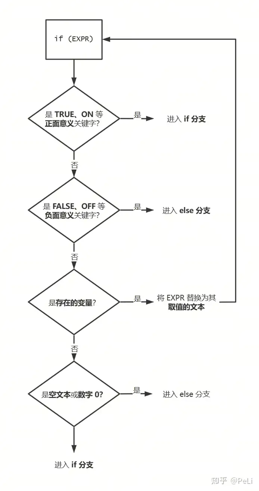

# CMake：3. 选择性配置

在上一篇文章中我们学习了如何指定 CMake 的**生成器**（generator），并利用其生成单配置或多配置（multi-config configuration）的项目；以及如何使用 **CMake 缓存**（CMakeCache.txt）向 CMake 脚本（CMakeLists.txt）传递信息。


我们接下来会学习如何使用**控制流**（control flow）命令来编写有选择性的、跨平台的 CMake 构建脚本。

CMake 的控制流命令体系比较简单，主要分为下面几种：

- 条件分支：if / else / elseif / endif
- 条件循环：while / endwhile
- 遍历循环：foreach / endforeach
- 循环跳出：break / continue

写过 C++ 的朋友应该都猜得出这些命令的含义。

## 条件分支 if-then-else

条件分支的一般形式如下：

```cmake
if(EXPR)
    # 如果 EXPR 或 EXPR 的取值为 1、TRUE、ON、Y、YES 或其他任何非空文本，执行这里的脚本。
else()
    # 如果 EXPR 或 EXPR 的取值为 0、FALSE、OFF、N、NO、IGNORED、NOTFOUND 或空文本，执行这里的脚本。
endif()
```

`if` 和 `elseif` 命令会检查参数中的**条件**（condition）是否成立；条件成立则进入 if 分支，不成立则进入 else 分支。

你需要留意条件分支的取值规则。以 `if(EXPR)` 为例，CMake 会对这个命令进行如下分析：

- 检查 `EXPR` 是否为布尔关键字（`TRUE`/`FALSE`、`ON`/`OFF`、`1`/`0`、...），如果是关键字则直接完成判定。
- 如果不是关键字，则认为 `EXPR` 是一个变量名；CMake 会检查变量是否存在，如果变量没有被 `set` 过也不在缓存里，则认为条件不成立。
- 如果 `EXPR` 是一个实际存在的变量，则判断 `EXPR` 的取值是否为关键字，如果是关键字则根据关键字完成判定。
- 如果 `EXPR` 的取值不是关键字，但是**空字符串**或者**数字 0**，则也认为条件不成立。



所以，下面四种 `if` 的写法是等价的：

```cmake
set(CONDITION TRUE)
if(TRUE)
if("TRUE")
if(CONDITION)
if(${CONDITION})
```

需要注意的是，条件判断语句只判断**参数的文本**是否是关键字，也就是说，一旦你使用 `${}` 进行了取值，`if` 命令是不知道它原来叫什么名字的。同时 `TRUE`、`FALSE` 这些关键字本身也可以作为变量名使用。所以如下的代码会输出一个问号：

```cmake
set(FALSE 1)
if(${FALSE})
    message(?)
endif()
```

CMake 很神奇吧.jpg

### 条件中的特殊谓词

为了帮助你在构建前对构建平台和用户配置进行检查，CMake 提供了一些谓词来帮助你撰写具有控制能力的配置脚本。

最基础的，你可以通过 `DEFINED` 谓词检查一个名字有没有在前文中被定义为变量。

```cmake
if(DEFINED VAR_NAME)
```

你也可以使用 `EXISTS` 谓词可以检查一个路径是否在文件系统中存在。

```cmake
if(EXISTS "/path/to/lib")
```

你也可以使用比较谓词 `if` 命令对一对输入进行计算。CMake 中的**逻辑比较**有几种不同的形式，分为**整数**、**文本**和**版本号**三套，各自支持下面的五种比较计算。注意当输入的类型和使用的算符不匹配时，条件不会成立。

|          | 整数          | 文本             | 版本号                |
| -------- | ------------- | ---------------- | --------------------- |
| 相等     | EQUAL         | STREQUAL         | VERSION_EQUAL         |
| 小于     | LESS          | STRLESS          | VERSION_LESS          |
| 大于     | GREATER       | STRGREATER       | VERSION_GREATER       |
| 小于等于 | LESS_EQUAL    | STRLESS_EQUAL    | VERSION_LESS_EQUAL    |
| 大于等于 | GREATER_EQUAL | STRGREATER_EQUAL | VERSION_GREATER_EQUAL |

数字比较的谓词没有前缀。文本比较谓词前有 `STR` 的前缀，如 `STREQUAL`、`STRLESS`，使用方式可以参照 C/C++ 中的 [strcmp](https://link.zhihu.com/?target=https%3A//en.cppreference.com/w/c/string/byte/strcmp)。

版本号谓词稍微特殊一点，它的前缀是 `VERSION_`，如 `VERSION_EQUAL`、`VERSION_LESS`，在进行判断时会把输入的文本按照 `MAJOR.MINOR.PATCH.TWEAK` 的格式拆分成四个部分，按从前往后的顺序分别进行比较。如果不是完整的四段版本号，则会将缺失的部分替代为 0。比如 `1.3` 在判断的时候会被认为是 `1.3.0.0` 。

下面是几个条件成立的例子：

```cmake
set(A "1")
if(A EQUAL 1)
if("abc" STREQUAL "abc")
if(1.3.2 VERSION_LESS "1.5.1")
```

### 谓词的组合

你可以通过小括号划分子表达式，并使用 `AND`、`OR` 和 `NOT` 组合不同的谓词。

```cmake
set(A "1")
if((A EQUAL 1) AND (NOT(A EQUAL 0)))
```

## 条件循环 while 和循环跳出

条件循环的用法和条件分支的用法非常相似，但是循环没有 else 分支，且只要参数中的条件还成立，就会一直反复执行循环中的内容。while、break 和 continue 命令的用法跟 C++ 里基本一样。此处只放一个例子，不再赘述。

```cmake
while(TRUE)
    if(NOT DARTH_VADER)
        message("I am your father.")
        break()
    endif()
endwhile()
```

## 遍历循环 foreach

循环遍历是一种很常用的命令。比如说你的 CMake 脚本需要在构建前用模板填充生成一些代码或者头文件，或者要把一些第三方依赖的 DLL redistribute 拷到 生成目录下面，你可能就需要把要处理的路径都保存在一个列表里，然后在循环中处理。

简单举个例子，我在脚本里要确认用户已经通过缓存变量设定了 LLVM 和 Taichi Runtime 之类第三方依赖的目录，可能就会用下面的代码进行检查。

```cmake
set(REQUIRED_VAR_NAMES
    LLVM_DIR
    TAICHI_C_API_INSTALL_DIR)

foreach(REQUIRED_VAR_NAME IN ITEMS ${REQUIRED_VAR_NAMES})
    if(NOT DEFINED ${REQUIRED_VAR_NAME})
        message(FATAL_ERROR "${REQUIRED_VAR_NAME} must be set.")
    endif()
endforeach()
```

`ITEMS` 关键字会指示后面跟着的每个参数都是要迭代的**值**。你也可以用 `LISTS` 来指示后面的参数是要迭代的**列表**。比如上面的代码可以改写为：

```cmake
foreach(REQUIRED_VAR_NAME IN LISTS REQUIRED_VAR_NAMES)
    # ...
endforeach()
```

这两种写法是等价的。

一些老脚本里可能你还会见到一些没有 `IN` 关键字的用法，它和上面 `ITEMS` 形式其实是等价的。

```cmake
foreach(REQUIRED_VAR_NAME ${REQUIRED_VAR_NAMES})
    # ...
endforeach()
```

### Range-For

有的时候你需要一个和 C++ 类似的数数的循环，虽然我自己从来没用到过，但它长这样：

```cmake
foreach(LOOP_VAR RANGE 1 10 2)
    message("LOOP_VAR = ${LOOP_VAR}")
endforeach()
```

这段代码会输出：

```text
LOOP_VAR = 1
LOOP_VAR = 3
LOOP_VAR = 5
LOOP_VAR = 7
LOOP_VAR = 9
```

### 列表的文本形式

这里注意一点，CMake有个很离谱的设计。分号（;）能够把左右两边的参数连接在一起组合成一个列表，如 `message(A;B)`。但是如果分号两边不是紧挨着参数，夹了个空格，如 `message(A ; B)` 那就是三个参数，一个 `A`、空列表、`B`。然后这个时候有意思的就来了：**message 命令不会打印列表中的分号**，但又和对一个不存在的变量取值的时候一样，**CMake 处理参数的时候遇到空列表会直接当作什么都没看见**。导致上面两种写法的输出都是 `AB`。这很可能会引起困扰。

玩得更大一点，你可以这样写：

```cmake
if(1 ; EQUAL ; "1")
    message(A;B)
    message(A ; B)
endif()
```

它的输出是：

```text
AB
AB
```

学会了吗？下次给你的老板露一手。