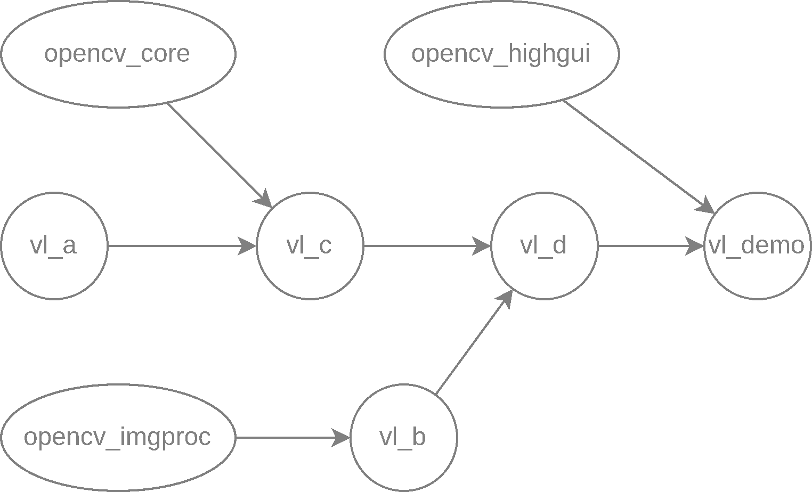

# 【11】项目实战

## [1. 常规非跨平台项目](https://www.cccolt.top/tutorial/cmake/11.html#_1-常规非跨平台项目)

### [1.1 预期目标](https://www.cccolt.top/tutorial/cmake/11.html#_1-1-预期目标)

现计划开发一个专为 Linux 平台设计的视觉处理库 `visionlib` 及示例程序 `vl_demo`，库在从源码编译安装的过程中需要实现以下功能：

1. 需要支持 C++17 标准；

2. 强制依赖 OpenCV 4 及以上版本，并用到其中的 `core`、`imgproc`、`highgui` 模块，分别对应 `opencv_core`、`opencv_imgproc`、`opencv_highgui` 这 3 个 CMake 目标；

3. 默认以静态库的形式构建 `visionlib`，但允许用户通过 CMake 选项设置构建为动态库；

4. 库包含了 `vl_a`、`vl_b`、`vl_c` 和 `vl_d` 共 4 个模块，分别对应 `a`、`b`、`c` 和 `d` 4 个文件夹，均默认参与构建，但是允许用户通过 CMake 选项设置任一模块是否参与构建；

5. 项目包含了一个示例程序 `vl_demo`，默认参与构建，允许用户通过 CMake 选项设置其是否参与构建；

6. 这几个模块和示例程序之间存在依赖关系，使用 → 表示依赖关系，如  表示 `vl_c` 依赖 `vl_a`

   

   **图 1-1：依赖关系图**

7. 项目的安装目录为 `/usr/local`，其中

   - 示例程序安装到 `/usr/local/bin`
   - 头文件安装到 `/usr/local/include`
   - 库文件安装到 `/usr/local/lib`
   - CMake 相关配置文件安装到 `/usr/local/lib/cmake/VisionLib`

### [1.2 要求与文件结构](https://www.cccolt.top/tutorial/cmake/11.html#_1-2-要求与文件结构)

该项目中所有的 CMake 目标必须均以 `vl_` 开头，例如文件夹 `a` 对应的目标是 `vl_a`，该项目的文件结构如下


```
.
├── modules
│   ├── a
│   │   ├── include
│   │   │   └── visionlib
│   │   │       └── a.hpp
│   │   └── src
│   │       ├── a1.cpp
│   │       └── a2.cpp
│   ├── b
│   │   ├── include
│   │   │   └── visionlib
│   │   │       └── b.hpp
│   │   └── src
│   │       ├── b1.cpp
│   │       ├── b2.cpp
│   │       ├── b3.cpp
│   │       └── b4.cpp
│   ├── c
│   │   ├── include
│   │   │   └── visionlib
│   │   │       └── c.hpp
│   │   └── src
│   │       └── c.cpp
│   └── d
│       ├── include
│       │   └── visionlib
│       │       └── d.hpp
│       └── src
│           ├── d1.cpp
│           └── d2.cpp
└── samples
    └── demo.cpp

19 directories, 14 files
```

### [1.3 分析](https://www.cccolt.top/tutorial/cmake/11.html#_1-3-分析)

- 前 3 个预期目标是关于项目的要求，可直接在项目根目录的 `CMakeLists.txt` 中实现
- 第 4 到第 6 个预期目标是关于项目的依赖关系，可在每个模块的 `CMakeLists.txt` 中实现
- 每个模块均涉及到头文件搜索路径添加、源文件编译、库文件链接、依赖库添加、安装目标等操作，可以将这些内容封装到一个函数中，然后在每个模块的 `CMakeLists.txt` 中调用

### [1.4 实现](https://www.cccolt.top/tutorial/cmake/11.html#_1-4-实现)

在项目中添加

- `CMakeLists.txt` —— 项目根目录的 CMake 配置文件
- `cmake/VisionLibInstall.cmake` —— 项目的安装路径配置文件
- `cmake/VisionLibModule.cmake` —— 项目的 CMake 函数库，主要涉及到目标的便捷创建
- `cmake/templates/VisionLibConfig.cmake.in` —— 项目在 `find_package` 时需要的配置文件模板
- `modules/CMakeLists.txt` —— 项目的模块列表
- `modules/a/CMakeLists.txt` —— 模块 `a` 的 CMake 配置文件
- `modules/b/CMakeLists.txt` —— 模块 `b` 的 CMake 配置文件
- `modules/c/CMakeLists.txt` —— 模块 `c` 的 CMake 配置文件
- `modules/d/CMakeLists.txt` —— 模块 `d` 的 CMake 配置文件
- `samples/CMakeLists.txt` —— 示例程序的 CMake 配置文件

共 10 个文件。

#### [1.4.1 项目配置](https://www.cccolt.top/tutorial/cmake/11.html#_1-4-1-项目配置)

CMakeLists.txtVisionLibInstall.cmakeVisionLibModule.cmake


```
cmake_minimum_required(VERSION 3.10)

project(VisionLib)

# ----------------------------------------------------------------------------
#   配置项目
# ----------------------------------------------------------------------------
set(CMAKE_CXX_STANDARD 17)
set(CMAKE_CXX_STANDARD_REQUIRED ON)

find_package(OpenCV 4 REQUIRED)
option(BUILD_SHARED_LIBS "Build shared libraries?" OFF)

include(cmake/VisionLibInstall.cmake)
include(cmake/VisionLibModule.cmake)

# ----------------------------------------------------------------------------
#   将子目录添加到构建系统中
# ----------------------------------------------------------------------------
add_subdirectory(modules)
add_subdirectory(samples)

# ----------------------------------------------------------------------------
#   导出、安装配置
# ----------------------------------------------------------------------------
install(
  EXPORT VisionLibTargets
  FILE VisionLibTargets.cmake
  DESTINATION ${VL_CFG_INSTALL_PATH}
  # VL_CFG_INSTALL_PATH 定义于 VisionLibInstall.cmake 中
)

configure_file(
  cmake/templates/VisionLibConfig.cmake.in
  "${CMAKE_CURRENT_BINARY_DIR}/VisionLibConfig.cmake"
  @ONLY
)

install(
  FILES "${CMAKE_CURRENT_BINARY_DIR}/VisionLibConfig.cmake"
  DESTINATION ${VL_CFG_INSTALL_PATH}
)
```

#### [1.4.2 模块配置](https://www.cccolt.top/tutorial/cmake/11.html#_1-4-2-模块配置)

```
modules``modules/a``modules/b``modules/c``modules/d
```


```
set(cur_path "${CMAKE_CURRENT_SOURCE_DIR}")
file(GLOB modules RELATIVE "${cur_path}" "${cur_path}/*")

foreach(m ${modules})
  if(IS_DIRECTORY ${cur_path}/${m})
    add_subdirectory(${cur_path}/${m})
  endif()
endforeach()

# 简单起见，也可以直接写
# add_subdirectory(a)
# add_subdirectory(b)
# add_subdirectory(c)
# add_subdirectory(d)
```

#### [1.4.3 示例程序配置](https://www.cccolt.top/tutorial/cmake/11.html#_1-4-3-示例程序配置)

samples/CMakeLists.txt


```
vl_add_exe(demo
  SOURCES demo.cpp
  DEPENDS d
  EXT_DEPENDS opencv_highgui
)
```

#### [1.4.4 VisionLibConfig.cmake.in 配置](https://www.cccolt.top/tutorial/cmake/11.html#_1-4-4-visionlibconfig-cmake-in-配置)

若对该文件有疑问，请参考[此处](https://www.cccolt.top/tutorial/cmake/10.html#_4-xxxconfig-cmake-文件的一般写法)。

VisionLibConfig.cmake.in


```
# ----------------------------------------------------------------------------
#  VisionLib CMake 配置文件
#
#                  ** 该文件由 CMake 生成，请勿手动修改 **
#
#  基本用法：
#    find_package(VisionLib REQUIRED)
#    target_link_libraries(your_target PRIVATE vl_a vl_b ...)
# ----------------------------------------------------------------------------

# ----------------------------------------------------------------------------
#   获取 VisionLib 安装路径
# ----------------------------------------------------------------------------
get_filename_component(VL_CONFIG_PATH
  "${CMAKE_CURRENT_LIST_FILE}" PATH
)
set(VL_INSTALL_PATH "@VL_INSTALL_PATH@")

# ----------------------------------------------------------------------------
#   设置头文件搜索路径变量
# ----------------------------------------------------------------------------
set(VisionLib_INCLUDE_DIRS "${VL_INSTALL_PATH}/@VL_INC_INSTALL_PATH@")

# ----------------------------------------------------------------------------
#   设置库文件路径变量
# ----------------------------------------------------------------------------
set(VisionLib_LIBS @VL_LIB_COMPONENTS@)

if(NOT TARGET vl_a)
  include("${VL_CONFIG_PATH}/VisionLibTargets.cmake")
endif()

# ----------------------------------------------------------------------------
#   搜寻的结果、状态
# ----------------------------------------------------------------------------
include(FindPackageHandleStandardArgs)

find_package_handle_standard_args(VisionLib
  REQUIRED_VARS VL_INSTALL_PATH
)
```

### [1.5 思考 🤔](https://www.cccolt.top/tutorial/cmake/11.html#_1-5-思考)

用户在使用 VisionLib 中的 `vl_d` 目标的时候一般在项目中会写上


```
add_executable(demo main.cpp)

find_package(VisionLib REQUIRED)

target_link_libraries(demo PRIVATE vl_d)
```

但是这时候编译会出现形如以下内容的报错


```
[ 50%] Building CXX object CMakeFiles/demo.dir/main.cpp.o
In file included from /usr/local/include/VisionLib/visionlib/d.hpp:3,
                 from /path/to/vl_deploy_demo/main.cpp:1:
/usr/local/include/VisionLib/visionlib/c.hpp:5:10: fatal error: opencv2/core.hpp: No such file or directory
    5 | #include <opencv2/core.hpp>
      |          ^~~~~~~~~~~~~~~~~~
compilation terminated.
make[2]: *** [CMakeFiles/demo.dir/build.make:76：CMakeFiles/demo.dir/main.cpp.o] error 1
make[1]: *** [CMakeFiles/Makefile2:83：CMakeFiles/demo.dir/all] error 2
make: *** [Makefile:91：all] error 2
```

请分析出现该问题的原因以及解决方法。

**答案** [【点此查看】](https://www.cccolt.top/tutorial/cmake/11/answer.html#_1-常规非跨平台项目)

## [2. 外部依赖管理](https://www.cccolt.top/tutorial/cmake/11.html#_2-外部依赖管理)

C/C++ 一个饱受诟病的话题就是包管理，一些现代的语言都具有比较完善的包管理工具，例如 Python 的 `pip`、Node.js 的 `npm` 和 `yarn`、Rust 的 `cargo` 等，而 C/C++ 没有一个统一的、官方的包管理工具，导致了 C/C++ 项目的依赖管理非常困难。CMake 提供了 `FetchContent` 和 `ExternalProject` 模块，可以用于管理项目的外部依赖，相比于手动下载、编译、安装，`FetchContent` 和 `ExternalProject` 已经尽可能的简化了这个过程。

`ExternalProject` 用于在构建过程中下载、配置、构建和安装外部项目。它通常用于处理大型的、独立的外部项目。而 `FetchContent` 用于在配置阶段下载和添加外部项目的源代码。它适用于需要将外部项目的源代码直接集成到主项目中的情况。后文将主要介绍 `FetchContent` 的使用，`ExternalProject` 的使用可以参考[官方文档](https://cmake.org/cmake/help/latest/module/ExternalProject.html)。

### [2.1 `FetchContent`](https://www.cccolt.top/tutorial/cmake/11.html#_2-1-fetchcontent)

`FetchContent` 依赖管理定义于 `FetchContent` CMake 模块中，可使用


```
include(FetchContent)
```

来引入。`FetchContent` 模块提供了 `FetchContent_Declare`、`FetchContent_MakeAvailable` 等函数，用于下载、解压、配置、编译、安装外部项目。

#### [2.1.1 `FetchContent_Declare`](https://www.cccolt.top/tutorial/cmake/11.html#_2-1-1-fetchcontent-declare)

—— 声明外部依赖项


```
FetchContent_Declare(
  <name>
  <contentOptions>...
  [EXCLUDE_FROM_ALL]          # add in CMake 3.28
  [SYSTEM]                    # add in CMake 3.25
  [OVERRIDE_FIND_PACKAGE |
   FIND_PACKAGE_ARGS args...] # add in CMake 3.24
)
```

上述声明的可选项均不是很重要，重要的是 `<contentOptions>`。以下是使用 `FetchContent_Declare` 声明 `googletest` 项目的示例，提供了两种方式声明外部依赖项，一种是使用 Git 存储库作为外部依赖项，另一种是使用 URL 地址作为外部依赖项。

使用 Git 存储库使用 URL 地址


```
FetchContent_Declare(
  googletest
  GIT_REPOSITORY https://github.com/google/googletest.git
  GIT_TAG        703bd9caab50b139428cea1aaff9974ebee5742e # release-1.10.0
)

# GIT_REPOSITORY: 表示外部依赖项的 Git 仓库地址；
# GIT_TAG:        表示外部依赖项的 Git 仓库的标签，可以是分支名、标签名、提交哈希等，
#                 但建议是稳定的标签名防止不稳定的代码进入项目。
```

#### [2.1.2 `FetchContent_MakeAvailable`](https://www.cccolt.top/tutorial/cmake/11.html#_2-1-2-fetchcontent-makeavailable)

—— 使外部依赖项生效，并加入构建系统


```
FetchContent_MakeAvailable(<name1> [<name2>...])
```

该命令保证在调用结束后，每个命名的依赖项都可供项目使用。例如上文的 `googletest` 项目，可以使用以下方式使用：


```
FetchContent_MakeAvailable(googletest)
```

如果有多个外部依赖项，可以使用以下方式使用：


```
FetchContent_MakeAvailable(ext1 ext2 ext3)
```

该命令将依次配置 `ext1`、`ext2` 和 `ext3` 项目

#### [2.1.3 `FetchContent` 示例](https://www.cccolt.top/tutorial/cmake/11.html#_2-1-3-fetchcontent-示例)

来自[【复杂依赖】](https://cmake.org/cmake/help/latest/module/FetchContent.html#complex-dependency-hierarchies)


```
include(FetchContent)
FetchContent_Declare(
  projB
  GIT_REPOSITORY git@mycompany.com:git/projB.git
  GIT_TAG        4a89dc7e24ff212a7b5167bef7ab079d
)
FetchContent_Declare(
  projC
  GIT_REPOSITORY git@mycompany.com:git/projC.git
  GIT_TAG        4ad4016bd1d8d5412d135cf8ceea1bb9
)
FetchContent_Declare(
  projD
  GIT_REPOSITORY git@mycompany.com:git/projD.git
  GIT_TAG        origin/integrationBranch
)

# Order is important, see notes in the discussion further below
FetchContent_MakeAvailable(projD projB projC)
```

### [2.2 预期目标](https://www.cccolt.top/tutorial/cmake/11.html#_2-2-预期目标)

现计划开发一个 Windows 平台下的 OPC UA 通信库 `opcua`，该库依赖于 `open62541`[[1\]](https://www.cccolt.top/tutorial/cmake/11.html#footnote1)，`open62541` 是一个开源的 OPC UA 协议栈，提供了 OPC UA 服务端和客户端的 C 语言实现。`opcua` 库的开发需要实现以下功能：

1. 需要支持 C++17 标准；

2. 强制依赖 `open62541`，没有该库需要自动下载、并添加至项目中，如果是自动下载的 `open62541`，那么 `opcua` 库在安装时需要将 `open62541` 一并安装；

3. ```
   open62541
   ```

    

   的配置要求如下

   - 无需启用 `UA_ENABLE_AMALGAMATION` 选项；
   - 其他选项默认即可；

4. 默认以静态库的形式构建 `opcua`，但允许用户通过 CMake 选项设置构建为动态库；

5. ```
   opcua
   ```

    

   项目的安装目录为

    

   ```
   D:\opcua
   ```

   ，其中

   - 头文件安装到 `D:\opcua\include`；
   - 静态库、导入库文件安装到 `D:\opcua\x64\vc16\lib`；
   - 动态库文件安装到 `D:\opcua\x64\vc16\bin`（如果构建为动态库）；
   - CMake 相关配置文件安装到 `D:\opcua\x64\vc16\bin`；
   - `open62541` 的安装要求由 `open62541Config.cmake` 指定了，具体安装路径不做详细说明，只需保证 `open62541` 的安装路径在 `D:\opcua` 下即可。

### [2.3 文件结构](https://www.cccolt.top/tutorial/cmake/11.html#_2-3-文件结构)

该项目的文件结构如下，参考自 [rmvl_opcua 模块](https://github.com/cv-rmvl/rmvl/tree/2.x/modules/opcua)。


```
.
├── include
│   ├── opcua
│   │   ├── client.hpp
│   │   ├── event.hpp
│   │   ├── method.hpp
│   │   ├── object.hpp
│   │   ├── publisher.hpp
│   │   ├── server.hpp
│   │   ├── subscriber.hpp
│   │   ├── utilities.hpp
│   │   ├── variable.hpp
│   │   └── view.hpp
│   └── opcua.hpp
└── src
    ├── client.cpp
    ├── cvt.hpp
    ├── helper.cpp
    ├── publisher.cpp
    ├── server.cpp
    └── subscriber.cpp

6 directories, 19 files
```

### [2.4 实现](https://www.cccolt.top/tutorial/cmake/11.html#_2-4-实现)

在项目中添加

- `3rdparty/open62541/CMakeLists.txt` —— `open62541` 的配置文件
- `CMakeLists.txt` —— 项目根目录的 CMake 配置文件
- `cmake/opcuaInstall.cmake` —— 项目的安装路径配置文件
- `cmake/opcuaConfig.cmake` —— 提供给用户在 `find_package` 时所需要的配置文件（因为整个项目只有一个目标，这里就不使用模板文件了）

共 4 个文件，如下文件结构所示


```
.
├── 3rdparty
│   └── open62541
│       └── CMakeLists.txt (New)
├── CMakeLists.txt         (New)
├── cmake
│   ├── opcuaConfig.cmake  (New)
│   └── opcuaInstall.cmake (New)
├── include
│   └── ...
└── src
    └── ...
```

#### [2.4.1 项目配置](https://www.cccolt.top/tutorial/cmake/11.html#_2-4-1-项目配置)

CMakeLists.txtopcuaInstall.cmake


```
# --------------------------------------------------------
#  项目配置
# --------------------------------------------------------
cmake_minimum_required(VERSION 3.16)
project(opcua)

set(CMAKE_CXX_STANDARD 17)
option(BUILD_SHARED_LIBS "Build shared libraries?" OFF)

include(cmake/opcuaInstall.cmake)

# --------------------------------------------------------
#  外部依赖管理
# --------------------------------------------------------
find_package(open62541 QUIET)
if(NOT open62541_FOUND)
  add_subdirectory(3rdparty/open62541)
endif()

# --------------------------------------------------------
#  目标构建
# --------------------------------------------------------
aux_source_directory(src target_src)
add_library(opcua ${target_src})

target_include_directories(opcua PUBLIC
  $<BUILD_INTERFACE:${CMAKE_CURRENT_SOURCE_DIR}/include>
  $<INSTALL_INTERFACE:include>
)

target_link_libraries(opcua
  PUBLIC open62541::open62541
)

install(
  TARGETS opcua
  EXPORT opcuaTarget
  LIBRARY DESTINATION ${OPCUA_BIN_INSTALL_PATH}
  ARCHIVE DESTINATION ${OPCUA_LIB_INSTALL_PATH}
  RUNTIME DESTINATION ${OPCUA_BIN_INSTALL_PATH}
  INCLUDES DESTINATION ${OPCUA_INC_INSTALL_PATH}
)

# --------------------------------------------------------
#  导出、安装
# --------------------------------------------------------
install(
  EXPORT opcuaTarget
  FILE opcuaTarget.cmake
  DESTINATION ${OPCUA_CFG_INSTALL_PATH}
)

install(
  FILES cmake/opcuaConfig.cmake
  DESTINATION ${OPCUA_CFG_INSTALL_PATH}
)
```

#### [2.4.2 外部依赖配置](https://www.cccolt.top/tutorial/cmake/11.html#_2-4-2-外部依赖配置)

3rdparty/open62541/CMakeLists.txt


```
option(UA_ENABLE_AMALGAMATION "Enable amalgamation" OFF)

FetchContent_Declare(
  open62541
  GIT_REPOSITORY https://github.com/open62541/open62541.git
  GIT_TAG        v1.4.8
)

FetchContent_MakeAvailable(open62541)
```

#### [2.4.4 opcuaConfig.cmake 配置](https://www.cccolt.top/tutorial/cmake/11.html#_2-4-4-opcuaconfig-cmake-配置)

由于 `opcua` 项目只有一个目标，因此 `opcuaConfig.cmake` 文件非常简单，方便起见也不需要向用户提供诸如 `opcua_INCLUDE_DIRS` 和 `opcua_LIBS` 这样的集合变量，因此 `opcuaConfig.cmake` 只需要完成以下功能即可

- 提供 CMake 目标变量（导入 `opcua` 目标）
- 提供 `find_package` 搜索的结果和状态

opcuaConfig.cmake


```
# ----------------------------------------------------------------------------
#  opcua CMake 配置文件
#
#  基本用法：
#    find_package(opcua REQUIRED)
#    target_link_libraries(your_target PRIVATE opcua)
# ----------------------------------------------------------------------------

if(NOT TARGET opcua)
  include(${CMAKE_CURRENT_LIST_DIR}/opcuaTarget.cmake)
endif()

include(FindPackageHandleStandardArgs)
find_package_handle_standard_args(opcua)
```

## [3. 交叉编译项目](https://www.cccolt.top/tutorial/cmake/11.html#_3-交叉编译项目)

CPU 有不同的架构、指令集，C/C++ 开发中的代码编译后的可执行文件，在不同的 CPU 上直接运行时可能会出现问题。对此有两种解决方案：

- 在目标平台上直接编译代码，例如为了在 64 位 ARM 平台上运行代码，可以直接在 `aarch64` 平台上编译代码。但一般来说，ARM 平台常见于嵌入式设备，这类设备可能缺少编译工具链，在性能上也非常有限，因此这种方式并不适用于所有情况。
- 直接在 PC 上编译目标平台的代码，然后将编译好的代码移植（复制粘贴）到目标平台上运行。这种方式称为交叉编译，在嵌入式 Linux 开发中非常常见，例如在 `amd64` 平台上编译 ARM 平台的代码。

### [3.1 工具链文件的编写](https://www.cccolt.top/tutorial/cmake/11.html#_3-1-工具链文件的编写)

CMake 提供了强大的交叉编译支持，而且仅需一个工具链文件即可完成交叉编译的工作。工具链文件是一个 CMake 脚本，用于指定交叉编译的工具链，例如编译器、链接器、库文件路径等。工具链文件没有严格的命名规则，就如同普通的 `*.cmake` 文件一样，不过一般习惯上会在工具链文件的名字中提到平台或 `toolchain` 字样，在 CMake 配置过程中，使用 `-DCMAKE_TOOLCHAIN_FILE` 选项指定工具链文件，例如


```
cmake -DCMAKE_TOOLCHAIN_FILE=toolchain-aarch64.cmake ..
```

一般来说，工具链文件的内容如下：


```
# 指定目标系统
set(CMAKE_SYSTEM_NAME Linux)
# 指定目标处理器架构
set(CMAKE_SYSTEM_PROCESSOR aarch64)

# 指定目标系统的根目录，将直接影响编译器和链接器的行为
set(CMAKE_SYSROOT "/path/to/sysroot")

# 指定 C 交叉编译器
set(CMAKE_C_COMPILER "/path/to/arm-gcc")
# 指定 C++ 交叉编译器
set(CMAKE_CXX_COMPILER "/path/to/arm-g++")

# 指定 CMake 查找文件的路径，例如 find_package
set(CMAKE_FIND_ROOT_PATH "/path/to/sysroot")
# 不查找程序
set(CMAKE_FIND_ROOT_PATH_MODE_PROGRAM NEVER)
# 只查找库
set(CMAKE_FIND_ROOT_PATH_MODE_LIBRARY ONLY)
# 只查找头文件
set(CMAKE_FIND_ROOT_PATH_MODE_INCLUDE ONLY)
```

### [3.2 预期目标](https://www.cccolt.top/tutorial/cmake/11.html#_3-2-预期目标)

现计划开发一个 EtherCAT 协议的机械臂驱动程序 `ec_robot`，该程序需要在 aarch64 架构的 Linux 平台下运行，`ec_robot` 项目的开发需要实现以下功能：

1. 需要使用指定的工具链进行交叉编译，目标系统根目录假设在 `/home/ecdev/buildroot/host/` 下

   - C 交叉编译器为 `aarch64-linux-gnu-gcc`，位于目标系统根目录的 `/usr/bin` 目录下；
   - C++ 交叉编译器为 `aarch64-linux-gnu-g++`，位于目标系统根目录的 `/usr/bin` 目录下；

2. 需要支持 C++17 标准；

3. 强制依赖 IgH 实现的 `EtherCAT` 主站驱动库，对应的配置文件在 `/home/ecdev/buildroot/host/usr/lib/cmake/ethercat` 下，对应的目标名为 `EtherLab::EtherCAT`；

4. `ec_robot` 项目无需安装，只需构建即可。

5. 没有复杂的文件结构，本项目只有一个 `src` 目录，内容如下：

   

   ```
   .
   └── src
       ├── ec_robot.cpp
       ├── ec_robot.hpp
       └── main.cpp
   ```

### [3.3 分析](https://www.cccolt.top/tutorial/cmake/11.html#_3-3-分析)

- 需要实现一个工具链文件 `toolchain-aarch64.cmake`，用于指定交叉编译的工具链；
- `EtherCATConfig.cmake` 文件在 `find_package` 的 Config 模式能够直接找到的位置，前提是工具链文件中的 `CMAKE_FIND_ROOT_PATH` 设置正确；
- 项目除了工具链文件外，只需要一个 `CMakeLists.txt` 文件，并且构建方式和普通项目一样。

### [3.4 实现](https://www.cccolt.top/tutorial/cmake/11.html#_3-4-实现)

在项目中添加

- `platform/toolchain-aarch64.cmake` —— 交叉编译工具链文件
- `CMakeLists.txt` —— 项目根目录的 CMake 配置文件

共 2 个文件，如下文件结构所示


```
.
├── CMakeLists.txt              (New)
├── src
│   ├── ec_robot.cpp
│   ├── ec_robot.hpp
│   └── main.cpp
└── platform
    └── toolchain-aarch64.cmake (New)
```

CMakeLists.txtplatform/toolchain-aarch64.cmake


```
cmake_minimum_required(VERSION 3.16)

project(ec_robot)

set(CMAKE_CXX_STANDARD 17)

find_package(EtherCAT REQUIRED)

aux_source_directory(src target_src)
add_executable(ec_robot ${target_src})

target_link_libraries(ec_robot
  PRIVATE EtherLab::EtherCAT
)
```

不要惊讶为什么 `CMakeLists.txt` 中没有引用工具链文件，因为习惯上会在 CMake 执行配置生成过程时再指定工具链文件。

打开项目根目录，在命令行中执行


```
mkdir build
cmake -B build -S . -DCMAKE_TOOLCHAIN_FILE=platform/toolchain-aarch64.cmake
cmake --build build
```

即可完成编译。可能有部分读者没有见过 `-B` 和 `-S` 选项，这是 CMake 3.13 版本引入的[功能](https://cmake.org/cmake/help/latest/manual/cmake.1.html#options)。`-B` 选项用于指定构建目录，`-S` 选项用于指定源码目录，这样可以将构建目录和源码目录分开，避免在源码目录中生成构建文件。

编译后的可执行文件在 `build` 目录下，可以直接复制到目标平台上运行，例如可以使用 SSH 工具的 `scp` 命令将文件复制到目标平台上，但要确保目标平台有 `libethercat.so` 的库文件，并且保证复制后的可执行文件能够找到。

## [4. 跨平台项目](https://www.cccolt.top/tutorial/cmake/11.html#_4-跨平台项目)

交叉编译项目虽然涉及到不同的平台，但是只需要一个工具链文件即可，因为大部分交叉编译项目都只涉及 Linux 内核，只不过涉及到不同的 CPU 架构、OS、文件系统，而跨平台项目则需要考虑不同平台的差异，例如 Windows 和 Linux 两个平台的差异就非常大。

跨平台是项目开发的一个重要方向，按照 ISO 标准编写的 C++ 程序跨平台性较好，但是在实际开发中，往往会使用一些平台相关或者是编译器相关的 API，这就导致了跨平台的困难。使用 CMake 完成跨平台项目的开发是一个不错的选择，CMake 提供了很多工具和函数，可以帮助开发者更好的实现跨平台项目。一般来说，跨平台项目的开发需要考虑以下几个方面：

- 编译器的编译选项不同，例如用于控制 C++ 语言标准的选项，在 GCC 中是 `-std=c++<ver>`，在 MSVC 中是 `/std:c++<ver>`；

  重要

  不过在 CMake 中，可以使用 `CMAKE_CXX_STANDARD` 变量来指定 C++ 标准，CMake 会根据不同的编译器自动选择正确的编译选项，这里只是举个例子。

- 不同平台的库文件后缀名不同，例如 Windows 下的静态库文件后缀名是 `*.lib`，Linux 下的静态库文件后缀名是 `*.a`，并且库文件的组织方式也不同，Windows 下在链接动态库时需要使用导入库 `*.lib`，Linux 下在链接动态库时则直接使用动态库 `*.so`。

- 默认安装路径不同，Windows 下的默认安装路径是 `C:\Program Files`，Linux 下的默认安装路径是 `/usr/local`，但 Windows 不建议直接安装到 `C:\Program Files`，而 Linux 则没有过多的限制。

### [4.1 预期目标](https://www.cccolt.top/tutorial/cmake/11.html#_4-1-预期目标)

现计划开发一个跨平台的基础数值算法和最优化库 `numopt`，该库需要支持 Windows 和 Linux 两个平台，`numopt` 项目的开发需要实现以下功能：

1. 需要支持 C++17 标准；

2. 默认以静态库的形式构建 `numopt`，但允许用户通过 CMake 选项设置构建为动态库；

3. 库包含了 `core`、`num` 和 `opt` 3 个模块和 `numopt_version` 1 个可执行文件，其中 `num` 和 `opt` 依赖 `core` 模块，`numopt_version` 依赖 `core` 模块；

4. `numopt` 项目的默认安装目录如下

   |      内容      |                Window 安装路径                |        Linux 安装路径        |
   | :------------: | :-------------------------------------------: | :--------------------------: |
   |   项目根目录   | `${CMAKE_BINARY_DIR}/install` 记作 `<prefix>` | `/usr/local` 记作 `<prefix>` |
   |     头文件     |              `<prefix>\include`               |  `<prefix>/include/numopt`   |
   |   可执行文件   |            `<prefix>\x64\vc16\bin`            |        `<prefix>/bin`        |
   |   静态库文件   |            `<prefix>\x64\vc16\lib`            |        `<prefix>/lib`        |
   |   动态库文件   |            `<prefix>\x64\vc16\bin`            |        `<prefix>/lib`        |
   |   导入库文件   |            `<prefix>\x64\vc16\lib`            |              ——              |
   | CMake 配置文件 |            `<prefix>\x64\vc16\lib`            | `<prefix>/lib/cmake/numopt`  |

5. 需要提供 `uninstall` 目标，用于卸载已安装的文件，在执行

   

   ```
   cmake --build . --target uninstall
   ```

   后，安装目录下的文件都会被删除。

文件结构如下：


```
.
├── modules
│   ├── core
│   │   ├── include
│   │   │   └── ...
│   │   └── src
│   │       └── ...
│   ├── num
│   │   ├── include
│   │   │   └── ...
│   │   └── src
│   │       └── ...
│   └── opt
│       ├── include
│       │   └── ...
│       └── src
│           └── ...
└── samples
    └── version.cpp
```

### [4.2 实现](https://www.cccolt.top/tutorial/cmake/11.html#_4-2-实现)

在项目构建部分和[常规非跨平台项目](https://www.cccolt.top/tutorial/cmake/11.html#_1-常规非跨平台项目)一致，只是在安装部分需要考虑不同平台的差异，因此跨平台项目只是比常规项目多了一些平台相关的配置。

和常规非跨平台项目一样，在项目中添加

- `modules/core/CMakeLists.txt` —— `core` 模块的 CMake 配置文件
- `modules/num/CMakeLists.txt` —— `num` 模块的 CMake 配置文件
- `modules/opt/CMakeLists.txt` —— `opt` 模块的 CMake 配置文件
- `modules/CMakelists.txt` —— 项目的模块列表
- `samples/CMakeLists.txt` —— 示例程序的 CMake 配置文件
- `CMakeLists.txt` —— 项目根目录的 CMake 配置文件
- `cmake/numoptInstall.cmake` —— 与项目安装路径相关的配置文件
- `cmake/templates/numoptConfig.cmake.in` —— 项目的 CMake 配置文件的模板文件
- `cmake/templates/cmake_uninstall.cmake.in` —— 自定义卸载目标的模板文件

共 7 个文件，如下文件结构所示


```
.
├── CMakeLists.txt                   (New)
├── cmake
│   ├── numoptInstall.cmake          (New)
│   └── templates
│       ├── cmake_uninstall.cmake.in (New)
│       └── numoptConfig.cmake.in    (New)
├── modules
│   ├── core
│   │   ├── CMakeLists.txt           (New)
│   │   ├── include
│   │   │   └── ...
│   │   └── src
│   │       └── ...
│   ├── num
│   │   ├── CMakeLists.txt           (New)
│   │   ├── include
│   │   │   └── ...
│   │   └── src
│   │       └── ...
│   ├── opt
│   │   ├── CMakeLists.txt           (New)
│   │   ├── include
│   │   │   └── ...
│   │   └── src
│   │       └── ...
│   └── CMakeLists.txt               (New)
└── samples
    ├── CMakeLists.txt               (New)
    └── version.cpp
```

方便起见，就不添加类似于 `vl_add_module` 和 `vl_add_exe` 的宏了。

#### [4.2.1 项目配置](https://www.cccolt.top/tutorial/cmake/11.html#_4-2-1-项目配置)

CMakeLists.txtcmake/numoptInstall.cmake


```
# ----------------------------------------------------------------------------
#   项目配置
# ----------------------------------------------------------------------------
cmake_minimum_required(VERSION 3.16)

project(
  numopt
  LANGUAGES CXX
)

set(CMAKE_CXX_STANDARD 17)

option(BUILD_SHARED_LIBS "Build shared libraries?" OFF)

include(cmake/numoptInstall.cmake)

# ----------------------------------------------------------------------------
#   目标构建
# ----------------------------------------------------------------------------
# main target
add_subdirectory(modules)

# executable target
add_subdirectory(samples)

# uninstall target
if(NOT TARGET uninstall)
  configure_file(
    "${CMAKE_CURRENT_SOURCE_DIR}/cmake/templates/cmake_uninstall.cmake.in"
    "${CMAKE_CURRENT_BINARY_DIR}/cmake_uninstall.cmake"
    IMMEDIATE @ONLY
  )

  add_custom_target(uninstall
    COMMAND ${CMAKE_COMMAND} -P ${CMAKE_CURRENT_BINARY_DIR}/cmake_uninstall.cmake
  )
endif()

# ----------------------------------------------------------------------------
#   导出、安装
# ----------------------------------------------------------------------------
install(
  EXPORT numoptModules
  DESTINATION ${NUMOPT_CFG_INSTALL_PATH}
  FILE numoptModules.cmake
)

file(RELATIVE_PATH NUMOPT_INSTALL_RELATIVE_PATH 
  "${CMAKE_INSTALL_PREFIX}/${NUMOPT_CFG_INSTALL_PATH}/" ${CMAKE_INSTALL_PREFIX})

configure_file(
  cmake/numoptConfig.cmake.in
  "${CMAKE_CURRENT_BINARY_DIR}/numoptConfig.cmake"
  @ONLY
)

install(
  FILES "${CMAKE_CURRENT_BINARY_DIR}/numoptConfig.cmake"
  DESTINATION ${NUMOPT_CFG_INSTALL_PATH}
)
```

#### [4.2.2 模块配置](https://www.cccolt.top/tutorial/cmake/11.html#_4-2-2-模块配置)

`modules` 目录下的 `CMakeLists.txt` 和各个模块的 `CMakeLists.txt` 文件如下：

modules`core` 模块`num` 模块`opt` 模块


```
add_subdirectory(core)
add_subdirectory(num)
add_subdirectory(opt)
```

提示

由于没有使用宏，`core` 模块、`num` 模块和 `opt` 模块的配置写了大量的重复代码，可读性降低。因此在必要时候使用宏是一个不错的选择。这里就不再展示宏的使用，读者可以按照[常规非跨平台项目配置](https://www.cccolt.top/tutorial/cmake/11.html#_1-4-1-项目配置)中的内容自行添加宏。

#### [4.2.3 示例程序配置](https://www.cccolt.top/tutorial/cmake/11.html#_4-2-3-示例程序配置)

samples/CMakeLists.txt


```
add_executable(numopt_version version.cpp)

target_link_libraries(numopt_version PRIVATE core)
```

#### [4.2.4 CMake 配置文件模板](https://www.cccolt.top/tutorial/cmake/11.html#_4-2-4-cmake-配置文件模板)

`cmake_uninstall.cmake.in` 文件参考自[此处](https://gitlab.kitware.com/cmake/community/-/wikis/FAQ#can-i-do-make-uninstall-with-cmake)，用户在实际使用时最好加上出处。

numoptConfig.cmake.incmake_uninstall.cmake.in


```
# ----------------------------------------------------------------------------
#  numopt CMake 配置文件
#
#                  ** 该文件由 CMake 生成，请勿手动修改 **
#
#  基本用法：
#    find_package(numopt REQUIRED)
#    target_link_libraries(your_target PRIVATE ${numopt_LIBS})
# ----------------------------------------------------------------------------

# ----------------------------------------------------------------------------
#   获取 numopt 安装路径
# ----------------------------------------------------------------------------
get_filename_component(NUMOPT_CONFIG_PATH "${CMAKE_CURRENT_LIST_FILE}" PATH)
get_filename_component(NUMOPT_INSTALL_PATH
  "${NUMOPT_CONFIG_PATH}/@NUMOPT_INSTALL_RELATIVE_PATH@" REALPATH
)

# ----------------------------------------------------------------------------
#   设置头文件搜索路径变量
# ----------------------------------------------------------------------------
set(numopt_INCLUDE_DIRS "${NUMOPT_INSTALL_PATH}/@NUMOPT_INC_INSTALL_PATH@")

# ----------------------------------------------------------------------------
#   设置库文件路径变量
# ----------------------------------------------------------------------------
set(numopt_LIBS @NUMOPT_LIB_COMPONENTS@)

if(NOT TARGET core)
  include("${NUMOPT_CONFIG_PATH}/numoptModules.cmake")
endif()

# ----------------------------------------------------------------------------
#   搜寻的结果、状态
# ----------------------------------------------------------------------------
include(FindPackageHandleStandardArgs)

find_package_handle_standard_args(numopt
  REQUIRED_VARS numopt_INSTALL_PATH
)
```

### [4.3 针对 Visual Studio 的特殊设计](https://www.cccolt.top/tutorial/cmake/11.html#_4-3-针对-visual-studio-的特殊设计)

对于多个目标的项目，会生成多个库文件，例如本 `numopt` 项目，在 Windows 下会生成 `core.lib`、`num.lib` 和 `opt.lib` 3 个库文件，在 Visual Studio 中，利用这 3 个库文件进行开发，需要再项目中手动添加，这样会增加开发者的工作量。为了简化开发者的工作，可以将这 3 个库文件打包成一个 `numopt_world.lib` 文件，这样开发者只需要添加一个库文件即可。

例如 OpenCV 原先会生成 `opencv_core.lib`、`opencv_imgproc.lib` 以及 `opencv_highgui.lib` 等导入库文件，在启用 `BUILD_opencv_world` 选项后，则不再生成原先的库文件，而是生成一个 `opencv_world.lib` 导入库文件。这时开发者在使用 Visual Studio 对项目的导入库进行配置的时候，只需添加 `opencv_world.lib` 该导入库文件的路径和名字即可。

一个简单的实现方式是在 `core`、`num` 和 `opt` 模块的 `CMakeLists.txt` 文件中添加判断，下面以 `core` 模块为例：


```
if(NOT BUILD_WORLD)
  # 原先的配置
else()
  aux source_directory(src core_src)
  set(NUMOPT_SRC "${NUMOPT_SRCS} ${core_src}" CACHE INTERNAL "")
  set(NUMOPT_INC "${NUMOPT_INC} ${CMAKE_CURRENT_SOURCE_DIR}/include" CACHE INTERNAL "")
  # 由于没有外部依赖库，所以就不写 NUMOPT_LIB 了
endif()
```

修改项目的根目录的 `CMakeLists.txt` 文件


```
# ...

# ----------------------------------------------------------------------------
#   目标构建
# ----------------------------------------------------------------------------
if(BUILD_WORLD)
  set(NUMOPT_SRC "" CACHE INTERNAL "")
  set(NUMOPT_INC "" CACHE INTERNAL "")
  # 由于没有外部依赖库，所以就不写 NUMOPT_LIB 了
endif()

add_subdirectory(modules)
add_subdirectory(samples)

if(BUILD_WORLD)
  add_library(numopt_world ${NUMOPT_SRC})
  target_include_directories(numopt_world PUBLIC
    $<BUILD_INTERFACE:${NUMOPT_INC}>
    $<INSTALL_INTERFACE:${NUMOPT_INC_INSTALL_PATH}>
  )
endif()

# ...
```

还有一种实现方式是使用[对象库](https://www.cccolt.top/tutorial/cmake/05.html#_3-1-1-对象库)，将 `core`、`num` 和 `opt` 模块的源文件编译成对象文件，然后再将这些对象文件链接成一个库文件。例如


```
add_library(core_obj OBJECT ${core_src})
```

开发者可以自行增加 `if` 判断，根据自己的需求来选择合适的实现方式。

使用形如以下的代码来安装：

`core` 模块`num` 模块`opt` 模块


```
add_library(core_obj OBJECT ${core_src})

install(TARGETS core_obj
  EXPORT numoptModules
)
```

不过，对象库等效于安装一个接口库，安装接口库的效果可以参考[【10】项目的导出与安装 - 思考](https://www.cccolt.top/tutorial/cmake/10.html#思考)中的第 2 个问题，因此在导出配置文件中也具有相应的信息，例如 `numoptModules.cmake` 导出配置文件中会包含大致如下内容


```
# Create imported target core_obj
add_library(core_obj INTERFACE IMPORTED)

# Create imported target num_obj
add_library(num_obj INTERFACE IMPORTED)

# Create imported target opt_obj
add_library(opt_obj INTERFACE IMPORTED)
```

注意

如果希望在 `numoptModules.cmake` 导出配置文件中只包含一个 `numopt_world` 目标而不包含 `core_obj` 等由对象库导出生成的接口库，可以使用第一种方案。

## [写在后面](https://www.cccolt.top/tutorial/cmake/11.html#写在后面)

有关 CMake 项目实战的内容可以参考 [RMVL](https://github.com/cv-rmvl/rmvl.git)[[2\]](https://www.cccolt.top/tutorial/cmake/11.html#footnote2) 项目的 CMake 框架，本文涉及到的

- 常规目标构建的内容
- 外部依赖管理的内容
- 交叉编译的内容
- 跨平台的内容

对应的 CMake 配置，都能在 RMVL 项目中找到。

1. open62541 developers. [open62541](https://github.com/open62541/open62541.git), September 2014. [↩︎](https://www.cccolt.top/tutorial/cmake/11.html#footnote-ref1)
2. zhaoxi and other RMVL developers. [rmvl](https://github.com/cv-rmvl/rmvl.git), September 2023. [↩︎](https://www.cccolt.top/tutorial/cmake/11.html#footnote-ref2)

