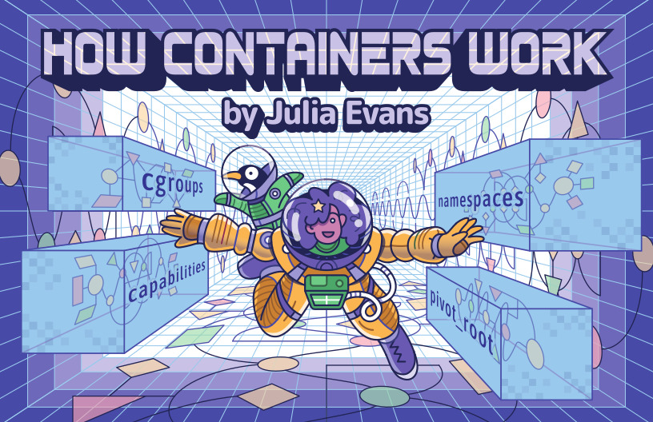
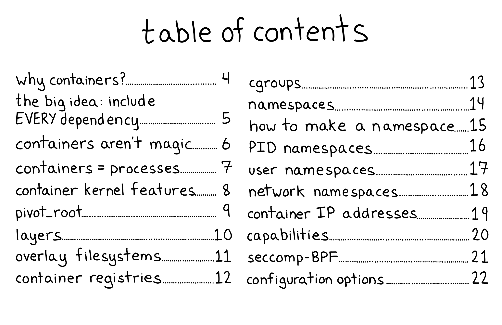

# What even is a container: namespaces and cgroups

• [CONTAINERS](https://jvns.ca/categories/containers) •


The first time I heard about containers it was like – what? what’s that?

Is a container a process? What’s Docker? Are containers Docker? Help!

The word “container” doesn’t mean anything super precise. Basically there are a few new Linux kernel features (“namespaces” and “cgroups”) that let you isolate processes from each other. When you use those features, you call it “containers”.

Basically these features let you pretend you have something like a virtual machine, except it’s not a virtual machine at all, it’s just processes running in the same Linux kernel. Let’s dive in!

### namespaces

Okay, so let’s say we wanted to have something like a virtual machine. One feature you might want is – my processes should be separated from the other processes on the computer, right?

One feature Linux provides here is **namespaces**. There are a bunch of different kinds:

- in a **pid** namespace you become PID 1 and then your children are other processes. All the other programs are gone
- in a **networking namespace** you can run programs on any port you want without it conflicting with what’s already running
- in a **mount namespace** you can mount and unmount filesystems without it affecting the host filesystem. So you can have a totally different set of devices mounted (usually less)

It turns out that making namespaces is totally easy! You can just run a program called `unshare` (named after the system call of the same name)

Let’s make a new PID namespace and run bash in it!

```
$ sudo unshare --fork --pid --mount-proc bash
```

What’s going on?

```
root@kiwi:~# ps aux
USER       PID %CPU %MEM    VSZ   RSS TTY      STAT START   TIME COMMAND
root         1  0.0  0.0  28372  4148 pts/6    S    23:01   0:00 bash
root         2  0.0  0.0  44432  3836 pts/6    R+   23:01   0:00 ps aux
```

Wow, we’re in a whole new world! There are only 2 processes running – bash and ps. Cool, that was easy!

It’s worth noting that if I look from my regular PID namespaces, I can see the processes in the new PID namespace:

```
root     14121  0.0  0.0  33264  4044 pts/6    S+   23:09   0:00 htop
```

This process 14121 (regular namespace) is process 3 in my new PID namespace. So they’re two views on the same thing, but one is a lot more restricted.

### entering the namespace of another program

Also you can enter the namespace of another running program! You do this with a command called `nsenter`. I think this is how `docker exec` works? Maybe?

### cgroups: resource limits

Okay, so we’ve made a new magical world with new processes and sockets that is separate from our old world. Cool!

What if I want to limit how much memory or CPU one of my programs is using? WE’RE IN LUCK. In 2007 some people developed [cgroups](https://en.wikipedia.org/wiki/Cgroups) just for us. These are like when you `nice` a process but with a bunch more features.

Let’s make a cgroup! We’ll make one that just limits memory

```
$ sudo cgcreate -a bork -g memory:mycoolgrou
```

Let’s see what’s in it!

```
$ ls -l /sys/fs/cgroup/memory/mycoolgroup/
-rw-r--r-- 1 bork root 0 Okt 10 23:16 memory.kmem.limit_in_bytes
-rw-r--r-- 1 bork root 0 Okt 10 23:14 memory.kmem.max_usage_in_bytes
```

ooh, max usage in bytes! Okay, let’s try that! 10 megabytes should be enough for anyone!

```
$ sudo echo 10000000 >  /sys/fs/cgroup/memory/mycoolgroup/memory.limit_in_bytes
```

Awesome, let’s try using my cgroup!

```
$ sudo cgexec  -g memory:mycoolgroup bash
```

I ran a bunch of commands. they worked fine. Then I tried compiling a Rust program :) :) :)

```
$ root@kiwi:~/work/ruby-stacktrace# cargo build
error: Could not execute process `rustc -vV` (never executed)

Caused by:
  Cannot allocate memory (os error 12)
```

Fantastic! We have successfully limited our program’s memory!

### seccomp-bpf

Okay, one last feature! If you’re isolating your processes, you might in addition to restricting their memory and CPU usage, want to restrict what system calls they can run! Like, “no network access for you!”. That might help with security! We like security.

This brings us to [seccomp-bpf](https://en.wikipedia.org/wiki/Seccomp), a Linux kernel feature that lets you filter which system calls your process can run.

### what are containers?

Okay, now that you’ve seen these two features you might think “wow, yeah, I could build a bunch of scripts around all these features and have something really cool!” It would be really lightweight and my processes would be isolated from each other, and, wow!

Some people thought that in the past too! They built a thing called “Docker containers” that uses these features :). That’s all Docker is! Of course Docker has a lot of features these days, but a lot of it is built on these basic Linux kernel primitives.

### learn more in “How Containers Work”

In 2020, I published a whole zine about containers called “How containers work”. You can [get it here for $12](https://wizardzines.com/zines/containers).

Here’s the cover and table of contents:

[](https://wizardzines.com/zines/containers) [](https://jvns.ca/images/containers-toc.png)