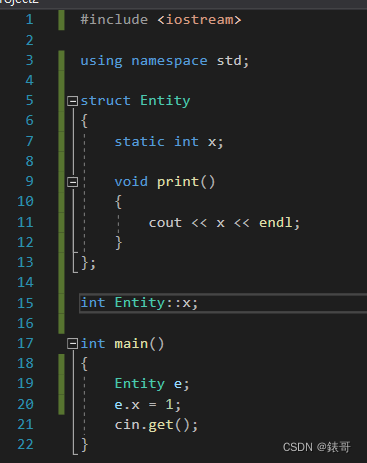

# Cherno C++笔记


很久前在油管上看的大神Cherno的C++教学视频，现在已经更新到了100P左右了。最近这段时间发现自己过去的时间里其实学了很多东西，但是一直没有时间总结，所以更新总结一下，也给自己梳理一下所学知识。

关于Cherno的笔记网络上有很多，我在写自己的笔记的时候因为时间比较久远，有些知识点会遗忘，也会一定参考别人的笔记，会在文末进行标注。


## 1.欢迎来到C++

使用C++的主要原因是可以直接控制硬件。C++写代码，代码被送去编译器进行编译，编译器会将代码输出为目标平台的机器码。机器码就是CPU实际上在运行的指令集。因此，使用C++，我们可以完全控制CPU执行的每一条指令。

C#和JAVA是运行在虚拟机上的，这意味着他们的代码会首先被编译成一种中间语言，当在目标平台上运行应用程序的时候，虚拟机在程序运行时再转换成机器码。

C++是本地语言（Native Language）。比如x64编译器将输出x64的机器代码，从而（也只能在64位的CPU上运行）。C++编译器为目标平台和架构生成机器码，编译后变成了平台上的机器语言，你只需要把机器代码指令放入CPU中，CPU就会执行这些指令。


## 5 C++是如何工作的

以VS为例，配置Configuration只是构建项目时的一系列规则而已，解决方案平台Platform是指你编译的代码的目标平台，Win32其实和X86是一样的东西。
项目中每个CPP文件都会被编译，但是头文件不会被编译。头文件的内容在预处理的时候直接被粘贴到目标文件里。
vs单独编译一个文件指令，Ctrl+F7；
vs的error窗口，基本上就是分析output窗口，然后找到error这个词，并抓取这部分信息展示出来，然后放入error list，所以建议看output窗口。

声明：这个符号、函数是存在的
定义：这个函数到底是什么


## 6.C++编译器是如何工作的

C++编译器实际上需要做的唯一一件事，就是将我们的文本文件拿来转换他们，转换成一种成为目标文件格式的中间格式，这些.obj文件可以传递到链接器，这个链接器可以做他所有要链接的事情。

编译器在生成这些obj时实际上做了几件事：
首先，预处理我们的代码，这意味着所有的预处理语句都会先处理。一旦我们的代码被预处理，接下来我们将或多或少的进行记号化和解析，基本上整理成编译器能够真正理解和推理的格式。这基本上导致了所谓的抽象语法树被创建。它基本上是我们代码的一种表示，但是是抽象的语法树。一旦编译器创建了抽象语法树，它可以开始实际生成代码。这段代码就是实际的机器码，是我们CPU将执行的代码。我们还得到了其他各种类型的数据，比如说一个存储所有常量，变量的地方，这基本上就是编译器所做的一切。

每一个CPP文件将产生一个目标文件，这些CPP文件被称为翻译单元。本质上必须意识到C++不关心文件，文件不是存在于C++中的东西。在C++中，文件只是提供给编译器源代码的一种方式，你负责告诉编译器你输入的是什么类型的文件，以及编译器应该如何处理它。比如说把a.cpp改为b.bubu，只要告诉编译器器这是一个C++文件也可以，所以文件是没有意义的。

预处理到文件：（生成.i，不生成.obj了）


OBJ为二进制文件，不易读，我们可以在VS中选择生成汇编：


默认的debug优化


运行时检查

如果开启优化，则会报错。

```
Error	D8016	'/O2' and '/RTC1' command-line options are incompatible	Project2	
```


要把运行时检查修改为default:


它基本上不会执行运行时检查。


## 7.C++链接器是如何工作的

现在链接的主要焦点是找到每个符号和函数在哪里，并把它们连接起来。应用程序需要知道入口点（entry point，一般为main函数）在哪里，当你实际运行你的应用程序的时候，C++运行时库（run time library）会说：“这里是main函数，我要跳到这里，然后开始执行代码”。

在VS中按下ctrl+F7，只有编译会发生，链接将永远不会发生。但是如果是build或者是F5运行，它会编译然后链接。

语法错误（syntax error）以C开头（compile），告诉我们错误在编译阶段，LNK(link）则告诉我们错误在链接阶段。

自定义entry point(一个exe一定会有一个entry point)


链接错误：
未解决的外部符号unresolved external symbol--------当链接器找不到它需要的东西时发生。(如果从来没有调用某函数，则根本无需链接)


如上图，在一段程序中，如果我们在函数中调用Log，但是main中并没有调用multiply，如果log没有被链接器找到，仍然会报错------因为multiply函数是有可能被别的翻译单元调用的。因此仍然需要进行链接。
那么只要我们让multiply函数变成static的，即static int multiply(int a,int b）.那么这就表示这个函数只被声明在当前这个翻译单元中，因此即使Log函数在其他翻译单元是没有定义的，由于其只存在于multiply中，而multiply是static的且当前翻译单元未被调用，就表明multiply从来没有被调用过！因此无需链接，也就不会得到任何链接错误。

当然，重复定义，会让链接器不知道链接到哪一个函数，因此也会出错。比如在一个头文件中定义了一个函数：


而在Log.cpp和math.cpp中都调用了log函数并且包含了Log.h的头文件(注意，头文件include仅仅是把头文件内容复制粘贴过来而已)，那么由于各自为翻译单元，有两个Log函数的定义存在，链接器仍然将不知道去调用哪个函数，会出现错误：

```
。。。。。already defined in Log.obj

```

告诉我们Log函数已经在Log.obj中被定义了。

修复措施：
1.static
表明头文件代码贴进来的时候，这个函数只是文件的内部函数，所以Log.cpp和math.cpp都有他们各自的Log函数且对其他的obj文件不可见。


2.inline
inline的意思是获取我们实际的函数体，并将函数调用替换为函数体（直接贴进去）
3.放到其他翻译单元中，头文件只有声明

链接器需要带走我们所有的目标文件，并将他们链接在一起。它也将拉进我们可能用到的其他任何的库，例如C runtime library、C++标注库，平台的API等等，从许多不同的地方linking是很常见的。

还有其他不同的链接，静态链接和动态链接。

## 8.C++变量

变量允许我们命名我们存储在内存中的数据（data），继续使用它。当创建一个变量时它将被存储在内存中——两个地方，堆和栈。
cherno解释变量的时候喜欢这样说：在C++中不同变量类型之间的唯一区别就是大小size（这个变量会占用多少内存）。这实际上是这些原始数据类型之间的唯一区别。

变量类型只是告诉编译器，要怎么去解释这块内存的数据。
数据类型的实际大小取决于编译器——不同的编译器会有不同。由编译器确定类型的大小。
数据的大小（字节）
char 1，short 2， int 4，long 通常为4，具体取决于编译器，long long通常为8个字节。
可以将unsigned添加到上述常用的5个的任何一个，它会移除符号位，可以设置一个更大的数字。

char传统意义上用于存储字符，而不仅仅是数字（当然也可以存储数字）。同样也能对其他类型存储分配字符。因此数据类型的使用仅仅取决于程序员。

存小数：
float 4，double 8位
其实还有long double等。
有一个f在后面才声明这是一个浮点数：


如上图定义了float a= 5.5，但这个5.5其实是double的，浮点数写法为5.5f

bool 1字节——因为在内存寻址时（addressing memory），也就是说我们需要从内存中找回我们的bool变量的值，我们没有办法去寻址只有以一个bit位的内容，我们只能寻址字节。因此我们不能只创建只有一个bit位的变量，因为我们需要能够访问到它，而我们现在只能访问字节。
(计算机不能区分什么true和false，因此一般0表示false，而非0的一切都为true）
因此我们可以很聪明的用一字节存储8个bool意义的量，比如bitset。
操作符：sizeof，告诉我们是几字节的。因此sizeof(bool)就会打印出1，表示bool占用一个字节。
有了这些原始数据类型，之后还能转换为指针，引用。

## 9.C++函数

函数就是我们要写的代码块，被设计用来执行特定的任务的。在class中这些代码块则被成为方法method。

这里所说的函数单独指类外的。
每次调用函数，编译器生成一个call指令(类外的，因此没有动态绑定，也不用考虑内联等）。这基本上意味着，在一个运行的程序中，为了调用一个函数，我们需要创建一个堆栈结构，这意味着我们必须把像参数这样的东西推进堆栈。我们还需要一个叫做返回地址的东西压入堆栈。然后我们要做的是跳到二进制执行文件的不同部分，以便开始执行我们的函数指令。
为了将push进去的结果返回，然后我们的回去到最初调用函数之前。跳跃和执行这些都需要时间，所以他们会减慢我们的程序。

而对于main函数，返回值是int，并且只有main可以不return。——会自动假设返回0。


## 10.C++头文件

像C#和Java，就没有头文件的概念，我们实际上有两种不同的文件类型的概念：
一种就是像C++一样，编译的编译文件。一个翻译单元，这种就会有头文件的概念。
就C++的基础而言，头文件通常用于声明某些类型的函数，以便它们可以被使用在你的程序中。

下面来说#pargma once
任何以#开头的东西，都被称为预处理器命令或者预处理器指令，这意味着在实际编译至此文件之前它将被先处理。
pragma本质上是一个被发送到编译器或预处理器的预处理指令。pargma once阻止我们单个头文件多次被包含，并转换为单个翻译单元。原因是如果我们不小心多次包含了一个文件，并转换为一个翻译单元，我们会得到duplicate复制错误，因为我们会复制粘贴整个头文件多次。

头文件保护符（监督、警卫）的东西——#ifndef #define #endif，在过去被广泛使用。但是现在我们有了这个新的预处理语句叫做pragma once. 几乎现在每个编译器都支持pragma once，所以它不止visual studio——GCC、Clang、MSVC都支持。

而有的include是<>有的是“”，原因是：
当我们编译程序的时候，它们有两种不同的含义，我们有能力告诉编译器，包含文件的路径是什么。
如果我们要包含的文件是在其中的一个文件夹里（在包含路径文件夹里），我们可以使用尖括号来告诉编译器搜索包含路径文件夹； 而引号则通常用于包含相对于当前文件的文件。
所以尖括号只用于编译器包含路径，引号可以做一切。不过cherno一般引号中都是只用当前路径，即不用…/啥的，其他都是用尖括号。
建议：如果包含了一些visual studio 解决方案之外的东西，就会用尖括号，也就是一些完全与项目无关的外部依赖项。

而像#include < iostream >，iostream其实是一个文件（虽然没有后缀。。）这是写C++标准库的人决定要这样做的。将C++标准库与C标准库进行区分。（有没有.h，如stdlib.h，这是一种区分C标准库和C++标准库的方法）


## 11.如何在Visual Studio中调试代码

断点和读取内存------是调试的两大部分。当然会同时使用。换句话说设置断点就是为了读取内存。
断点break point 是程序调试器将中断的点，这里break的意思是暂停。当我们的程序执行到断点处时它将暂停。在我们这个例子的整个项目中它将会挂起线程，让我们来看这个程序的state，说到state，其实就是指内存，我们可以暂停程序看看它的内存中发生了什么。

一个运行中的程序需要的内存是相当大的，它包括你设置的每个变量，要调用的函数等等。当你将程序中断后，内存数据实际上还在，能查看内存对诊断你的程序出问题的原因非常有用。通过查看内存可以看到每一个变量的值。

确保在将会被执行的代码行打上断点（空行的断点不起作用）

```
step into F11
进入到这行代码上的函数里面（如果这一行有一个函数的话）
step into F10
从当前函数跳到下一行代码
step out shift+F11
跳出当前函数，回到调用这个函数的位置
```


如上图这样的代码，黄色箭头表示将要执行这行代码，调试器显示的是，a将要被设置的内存位置的数字被现实出来了。因为我们没有把这个变量设置成任何东西，它只是未初始化的内存，这意味着这个值只是给我们展示了内存中实际包含的内容。

内存视图（VS中，debug-windows-memory-memory1）；


最左边是内存地址以十六进制格式表示的实际值，在中间为实际的数据，右边为ASCII码对这些数字的解释。
变量名取地址，即可找到内存视图中对应的位置：


这里内存是大量的CC，意味着它是未初始化的栈内存。


## 12.C++条件与分支（if语句）

运行时检测汇编（debug时，鼠标右键->go to disassembly）


然后就可以看到每一行代码对应的汇编，比如int x = 6就对应那一行汇编 mov xxx，而下面那一句就对应一块汇编。


因为bool是一个字节，因此只要有东西在这个字节中不为0，这个bool就是true；

13.Visual Studio的最佳设置
平台和配置全选all：
Output Directory写为：$(SolutionDIr)bin$(Platform)$(Configuration)
Intermediate Directory写为：$(SolutionDIr)bin\intermediates$(Platform)$(Configuration)


所有宏可以点这个编辑：


然后点这个macros查看：


顺便一提，我们经常会使用到宏$(SolutionDir)，其代表着与sln所在的路径，且自动在结尾有反斜杠\

vcxproj文件，我们的项目文件。其实只是一个XML文件。sln文件实际上是一个文本文件夹，就像是某种目录。


## 16.C++指针

对于计算机来说内存就是一切。x86即32位地址为32位（8位16进制数，4*8=32），那么对应指针就是4字节；x64则为64位地址（16位16进制数），则对应指针8字节。

当你编写一个应用程序并启动它时，所有程序都被载入到内存当中，所有的指令都告诉计算机在你写的代码中要做什么。所有这些都被加载到内存中去。

指针是一个整数，一种存储内存地址的数字，就是这样。
忘掉类型type，类型只是为了我们生活更容易而创造的某种虚幻，这都不重要，int，double或者是class，类型是完全无意义的，所有类型的指针都是为了保存内存地址的整数。*

给指针类型type，我们只是说这个地址的数据被假设为我们给的类型，除此之外他没有任何意义（其实就是预警，该地址指向的内存，我们要用什么类型去解释）。它只是一些我们在实际的源代码中可以编写的东西，使我们的生活在语法层面上更容易，类型不会改变一个指针的实质。

所有的void （也称为无类型指针）意味着我们现在不关心我们的代码中这个指针是什么类型的，因为我们只想保存一个地址。
类型type无关紧要，但类型对该内存的操作很优越感，所以如果我想对它进行读写，类型可以帮助我，因为编译器会知道例如一个int为4个字节。(比如解引用的时候。我们对ptr操作的时候我们就可以根据类型而知道对应着多大的内存。）*

## 17.C++引用

根本上，引用通常只是指针的伪装，只是在指针上的语法糖（syntactic sugar）。
比如int& ， 这里的&其实是类型的一部分。

## 19.C++类与结构体对比

只有默认的可见性的区别，class 默认private，struct默认public。
引入struct是为了让C++向后兼容C。
struct常用于数据结构，class常用于对象，方法。

## 20.cherno建议：类内私有成员变量前面可以加前缀m_，比如m_LogLevel

## 21.C++中的静态（static）

https://zhuanlan.zhihu.com/p/394975612
C++ static关键词有三种完全不同的用途。

**
1.表示一个静态存储期的变量，且具有internal linkage（俗称静态变量）
2.表示一个静态存储期的变量，但是只在一个局部作用域内可见，保证仅初始化一次(俗称static local 变量)
3.表示一个class的静态成员，整个class共享一份，不绑定到任何的instance(俗称static member变量)
**

static关键字在C++中有两个意思，这取决于上下文：
其中之一是在类或者结构体外部使用static关键字，另一种是在类或者结构体内部使用static
基本直白的来说，类外部的static，意味着你声明为static的符号，链接将只是在内部。这意味着它只能对你定义它的翻译单元可见(internal linkage）。然而类或者结构体内部的静态变量(static）意味着该变量实际上将与类的所有实例共享内存。这意味着该静态变量在你在类中创建的所有实例中，静态变量只有一个实例。
类似的事情也适用于类中的静态方法，在类中没有实例会传递给该方法。
这一节着重将在类和结构体外部的静态。
如果不用static定义全局变量，在别的翻译单元可以用extern int a这样的形式，这被称为extern linkage或者extern linking。
重点是，要让函数和变量标记为静态的，除非你真的需要跨翻译单元编译。

22.C++类和结构体中的静态（Static）
在几乎所有面向对象的语言里，static在一个类中意味着特定的东西。如果是static变量，这意味着在类的所有实例中，这个变量有且只有一个实例。比如一个entity类，有很多个entity实例，若其中一个实例更改了这个static变量，它会在所有实例中反映这个变化。这是因为即是创建了很多实例，static的变量仍然只有一个。正因如此，通过类实例来引用静态变量是没有任何意义的。因为这就像在类的全局实例。

静态方法也是一样，无法访问类的实例。静态方法可以被调用，不需要通过类的实例。而在静态方法内部，你不能写引用到类实例的代码，因为你不能引用到类的实例。
比如一段最简单的测试代码：


此时编译不会报错，但是链接会报错：

```
源.obj : error LNK2001: unresolved external symbol "public: static int Entity::x" (?x@Entity@@2HA)
```

于是我们需要给出定义，让链接器可以链接到合适的变量：



接着写代码如下:

```
```cpp
#include <iostream>
using namespace std;

struct Entity
{
	static int x;

	void print()
	{
		cout << x << endl;
	}
};

int Entity::x;

int main()
{
	Entity e1;
	e1.x = 1;

	Entity e2;
	e2.x = 2;

	e1.print();
	e2.print();

	cin.get();
}


```

```
结果就是打印两个2，这是因为它们共享的是同一个变量，因此像上面那样写是没有意义的，最好写为：


即用::让x好像在Entity的作用域内一样，它实际上并不属于类。从这个意义上说它们可以是private的可以是public的，它们仍然是类的一部分，而不是命名空间。

static作用到方法上也是一样的。静态方法不能访问非静态变量(毕竟不属于类实例，所以没有隐藏的this指针。即静态方法没有类实例)。

```
静态成员变量在编译时存储在静态存储区，即定义过程应该在编译时完成，因此一定要在类外进行定义，但可以不初始化。
静态成员变量是所有实例共享的，但是其只是在类中进行了声明，并未定义或初始化（分配内存），类或者类实例就无法访问静态成员变量，这显然是不对的，所以必须先在类外部定义，也就是分配内存
```


## 23.C++中的局部静态（Local Static）

这一节讲述另一环境可能会找到static关键字：在一个局部作用域。
你可以在局部作用域中使用static来声明一个变量，这和前两种有所不同。这一种情况我们要考虑变量的生存期life time和变量的作用域scope。
生存期指的是变量实际存在的时间，而变量的作用域是指我们可以访问变量的范围。
静态局部(local static）变量允许我们声明一个变量，它的生存期基本相当于整个程序的生存期，然而它的作用范围被限制在这个作用域内。


例子：

打印结果：1、2、3、4
另一个作用是单例：

```
```java
class Singleton
{
public:
    static Singleton &get_instance()
    {
        static Singleton instance;
        return instance;
    }

private:
    Singleton() = default;
    ~Singleton() = default;
    Singleton(const Singleton &) = delete;
    Singleton(Singleton &&) = delete;
    Singleton &operator=(const Singleton &) = delete;
    Singleton &operator=(Singleton &&) = delete;
};

```

可以参考：
https://zhuanlan.zhihu.com/p/342769966

```
通过static静态，将生存期延长到永远。这意味着，我们第一次调用get的时候，他实际上会构造一个单例实例，在接下来的时间它只会返回这个已经存在的实例。

参考：https://zhuanlan.zhihu.com/p/394975612
static local 变量，这类变量一般在第一次运行到这段代码的时候进行初始化.
(付出的代价就是每次运行到这就要检查一下有没有初始化.)


补充：
ELF格式的Symbol以及inline关键字 https://zhuanlan.zhihu.com/p/380982475

谈一下c++中的static   https://zhuanlan.zhihu.com/p/394975612

符号（symbol）是在ELF格式中会遇到的概念，也就是在写汇编代码的时候会遇到，而在更高级的语言（比如说C或者C++）中不会直接遇到这个概念，我们把讨论的范围限制在linux的ELF格式。

符号和符号之间时不一样的，我们要明确，链接器的任务是把很多个.o文件(object file）组合到一起，因为一个符号可能在某一个object file中定义了，而在另一个文件中使用了。链接器的作用是把这些reference都分清楚。

没有符号的东西没法放进内存，所以也没法取地址，没有办法ODR-used。

常见的symbol binding有三种
• Local Symbol ：只有当前object file文件都能看到，别的object file看不到。
• Global Symbol ： 所有object file 里都能看见，全局只能有一个
• Weak Symbol ： 所有object file里都能看见，全局可以有很多，但最后只保留一个。如果有同名Global Symbol.就只留下global symbol

对于之前说的static ，static一个函数，其实是生成了Local Symbol，

比如错误：

```
//a.h
int func(){
	return 0;
}

//A.cpp
```cpp
#include"a.h"

//B.cpp
```
#include"a.h"

```

解决方案有三种。
1.只在一个翻译单元中给出函数定义，这样的话就只有一个Global Symbol生成，不会有问题。（其实就是因为声明可以有多次，但是定义只能有一次，所以说最好.h声明，.cpp定义）
2.变成两个Local Symbol。这样做最后的二进制文件会变大一些，具体在C++中有两种做法，那我们的func函数示例，可以加上static。

```
static int func() {return 1;}//会生成local symbol

```

或者是用没有名字的namespace包裹着。

```
namespace
{	//匿名的namespace里都是Local symbol
	int func(){return 1;}
}

```

这个在C++层面上成为Internal Linkage

3.变成两个Weak Symbol.这个可以直接用编译器扩展 __attribute__((weak) ).
更常用的操作是使用inline修饰一个函数

```
inline int func(){
	return 1;
}

```

对于这个函数，编译器会考虑是否内联它，如果编译器决定不内联，就会生成一个weak symbol(GCC/Clang)这样即是是在多个翻译单元中都定义了，也不会出现重定义的错误。

链接器会从不同的object file中随机选择一份func的副本(具体选择了哪个要看链接器的实现了，你要做的是确保每个副本都是一样的)

这三种解决方案，一般使用1,3比较常见，第二种的话，每一个翻译单元都有一份副本，会增加最终生成二进制的体积和符号个数。

现在的观念认为, 编译器在决定一个函数是否内联比我们更合适. 所以 inline 只是作为一个内联提示符. 编译器如果选择内联了, 你这个函数体就没了, 如果没有选择内联, 就会生成一个 Weak Symbol.

现在的inline语义大概就是：允许同一个定义在不同的翻译单元出现，但你要确保不同的翻译单元给出的定义是一致的，可以看出，最自然的实现方案是使用ELF格式中的Weak Symbol。

因为inline语义变了，C++17还引入了inline variable，也就是说，不同的翻译单元中可以共用同一个符号作为变量。
在C++中，除了inline会生成weak symbol。模板生成的内容也会weak symbol。所以模板可以放在头文件中，而不用担心有重定义的错误，事实上，模板的定义也需要放在头文件中，不然无法实例化（除了显式实例化等情况）。

24.C++枚举
enum是enumeration的缩写。基本上它就是一个数值集合。不管怎么说，这里面的数值只能是整数。
默认从0开始，但是Cherno喜欢显式的写为0增强可读性
例如：

```
enum Level
{
	Error = 0,Warning,Info;	
};

```

这里的level并不是真正的命名空间(与之对应的是C11的强类型枚举enum class，大佬笔记https://zhuanlan.zhihu.com/p/415508858）

## 28.虚函数

虚函数引入了一种叫做Dynamic Dispatch动态联编的东西，他通常用虚函数来实现编译。
cherno建议加上override关键字，更有可读性。

## 29.C++接口（纯虚函数）

C++中的纯虚函数本质上与其他语言(如java或c#）中的抽象方法或接口相同。
基本上纯虚函数允许我们在基类中定义一个没有实现的函数，然后强制子类去实现这个函数。

## 30.C++可见性

可见性是一个属于面向对象编程的概念，它指的是类的某些成员或方法实际上有多可见。这里说的可见是指：谁能看见它们，谁能调用它们，谁能使用它们。
可见性是对程序实际运行方式完全没有影响的东西，对程序性能或类似的东西也没影响。它纯粹是语言中存在的东西，让你能够写出更好的代码或者帮助你组织代码。

可见性是让代码更加容易维护，容易理解，不管是阅读代码还是扩展代码。这与性能无关，也不会产生完全不同的代码。可见性不是CPU需要理解的东西，这不是你的电脑需要知道的东西。它只是人类发明的东西，为了帮助其他人和自己。

比如可以让表示位置的成员变量x和y私有，然后搞两个函数SetX和SetY，这样我就可以在SetX函数中除了给x赋值，还可以顺便调用refresh去刷新显示器或是同步之类的。

C++中就三个：private、protected、public

private：只有类和它的友元才能访问（继承的子类也不行）。
protected：这个类和层次结构中的所有子类都可以访问。（比如在main函数中new一个类就不可见，这其实是因为main函数不是类的函数，对main函数是不可访问的）

关于继承的补充：https://www.cnblogs.com/lykkk/p/10699694.html


不过一般都是public继承，见https://www.zhihu.com/question/425852397/answer/1528656579；

31.C++数组
C++数组就是表示一堆的变量组成的集合，一般是一行相同类型的变量。
特别提示：内存访问违规（Memory access violation），在debug模式下，你会得到一个程序崩溃的错误消息，来帮你调试那些问题；然而在release模式下，你可能不会得到报错信息，这意味着你已经写入了不属于你的内存。

循环的时候涉及到性能，我们一般是小于比较而不是小于等于(少一次等于的判断)。

```
int example[5];
int* ptr = example;
*(ptr+2) = 6; 

```

(ptr+2)=6;与 (int)((char)ptr + 8) = 6; 是一样的，因为指针用operator+偏移，是按照指针指向类型的大小决定，修改为一个字节（char*），就是+8，之前的int*则是+2；

计算数组中元素个数可以这样：

```
int a[5];
int count = sizeof(a)/sizeof(int);//5

```

但是堆上分配的就不行，比如在VS2019的x64中测试。

```
```cpp
#include<iostream>

using namespace std;

int main()
{
	int a[5];
	cout<<sizeof(a)/sizeof(int)<<endl;
	
	int* b = new int[5];
	cout<<sizeof(b)/sizeof(int) <<endl;

	cin.get(); 
}

```

```
输出结果就是5和2，后者的b为指针，64位即为8字节，所以得到2.如果x86即是win32，就是1。
而栈上数组的大小需要是编译期常量，比如可以这样：


```
constexpr int mSize = 5;
int a[mSize];
```

或是：

```
static const int mSize = 5;
int a[mSize];

```

C++11中的std::array
有一些优点如：边界检查，记录数据大小，比如：

```
```cpp
#include<iostream>
```
#include<array>

using namespace std;
int main()
{
```cpp
	std::array<int,5> test;
	cout<<test.size()<<endl;

	cin.get();
}

```


```
## 32.C++字符串

C++中有一种数据类型叫做char，是character的缩写，这是一个字节的内存。它很有用因为它能把指针转换为char型指针，所以你可以用字节来做指针运算。他对于分配内存缓冲区也很有用，比如分配1024个char即1kb空间。它对字符串和文本也很有用，因为C++对待字符的默认方式是通过Ascii字符进行文本编码。我们在C++中处理字符是一个字符一个字节。Ascii可以扩展为UTF-8,UTF-16,UTF-32,我们有wide string(宽字符串）等，我们有两个字节的字符，三个字节，四个字节的等等。

字符串实际上是字符数组，如一段很简单的程序：


我们看到报错，因为C++中默认的双引号就是一个字符数组const char*，并且末尾会补‘\0’，而cout<<会输出直到’\0’才终止。


比如：


而进入调试界面输入name：


我们可以看到在hbh后面有一堆cc，输出为烫，这实际上是一个数组守卫，让我们直到内存是在我们的分配之外。每当我们在调试模式下分配数组，C标准库或者C++标准库，实际上会插入栈守卫之类的东西，这样我们就知道是不是在分配内存之外了。
我们正确的写法应该是:


或者是： char name[4] = {‘h’,‘b’,‘h’,‘0’}; 因为ascii码0就是null。


C++标准库还有string ，std::string是baseString类的模板版本。模板参数是char，是模板特化template specialization，它是一个char数组和一些函数用来操作这些数组。其cout的重载版本在头文件string中。


可以看到，上图是错误的，因为之前所述，“”就是const char数组，不能把两个数组(指针)直接相加，可以这样写：

```
```cpp
#include<iostream>
```
#include<string>

int main()
{
```cpp
	std::string name = std::string("hbh")+"hello";
	std::cout<<name<<std::endl;
	
	std::cin.get();
}


```

```
显示调用string的构造函数，再+一个const char数组，这会带来一个额外的开销(拷贝)，但是也没有太大关系，或是写为：

```
```cpp
#include<iostream>
```
#include<string>

int main(){
```cpp
	std::string name = "hbh";
	name+="hello";
	std::cout<<name<<std::endl;

	std::cin.get();
}

```

用string的运算符+=重载。
而用find去判断是否包含字符就可以这样:

```
bool contains = name.find("no")!=std::string::npos;

```

```
最后，字符串复制实际上比较慢，如果可以就用const加引用方式传递。

33.C++字符串字面量
字符串字面量就是双引号balabala，比如“hbh”


而像下图这样操作，虽然有的编译器不会报错，但是这是C++未定义行为，有的编译器会完全禁止，不好。像我的连char* name = “hbh”;都会报错(VS2019，C++17标准)


C++中还有别的一些字符串：


```
const char* name = "hbh";
const wchar_t* name2 = L"hbh";
const char16_t* name3 = u"hbh";
const char32_t* name4 = U"hbh";
const char* name5 = u8"hbh";

```


基本上，char是一个字节的字符，char16_t是两个字符的16个比特的字符(utf16)，char32_t是32比特4字节的字符（utf32），const char就是utf8，那么wchar_t也是两个字节，和char16_t的区别是什么呢？事实上宽字符的大小，实际上就是由编译器决定的，可能是一个字节也可能是两个字节也可能是四个字节，实际应用中通常不是2个就是4个(windows是两个字节，LInux是4个字节)，所以这是一个变动的值。如果要两个字节就用char16_t，它总是16个比特。

而在C++14中我们还能这样搞：

```
```cpp
#include<iostream>
```
#include<string>

int main(){
	using namespace std::string_literals;
```cpp
	std::string name0 = "hbh"s+"hello";
	std::cin.get();
}

```

```
string_literals中定义了很多方便的东西，这里字符串字面量末尾加s，可以看到实际上是一个操作符函数，它返回标准字符串对象(std::string)


然后我们就还能方便地这样写等等：

```
```cpp
std::wstring name0 = L"hbh"s + L"hello";

```

然后还有补充，如R，可以忽略转义字符


可以看我的笔记https://zhuanlan.zhihu.com/p/415910318

原始字符串字面量
```
C++11提供了原始字符串字面量的写法，可以在一个字符串前方使用R来修饰这个字符串，同时，将原始字符串使用括号包裹。
比如字符串C:\File\To\Path，按传统需要写为：

```
```cpp
std::string str = "C:\\File\\To\\Path";
```

但是我们现在可以写为:

```
std::string str = R"(C:\File\To\Path)";
```

```
这样就避免了大量的转义字符，注意，这里的“ ”内必须要用小括号来包裹。
最后，字符串字面量永远保存在内存的只读区域

```
char* p = "hello";//p是一个指针，直接指向常量区，修改P[0]就是修改常量区的内容，这是不允许的。
char p[] = "hello";//编译器在栈上创建一个字符串p，把hello从常量区复制到p，修改p[0]就相当于修改数组元素一样，是可以的。
```


## 34.C++中的const

const首先作用于左边的东西：如果左边没有东西，就作用于右边的东西。
const被cherno成为伪关键字，因为它在改变生成代码方面做不了什么，有点像类和结构体的可见性。关键是，这是一个承诺，承诺一些东西是不变的，你是否遵守诺言取决于自己。我们要保持const是因为这个承诺实际上可以简化很多代码。

并且常对象只能调用常函数，比如这样写就会报错：


正确方法是getX方法类在后面加const，加在小括号和大括号之间（只有类才有这样的写法）：


然后有时我们就会写两个getX()版本，一个有const一个没有，然后下面这个传const+引用的方法就会调用const的getX版本。
记住，总是标记你的方法为const，如果他们实际上没有修改类或者它们不应该修改类。否则在有常量引用或者类似的情况下就用不了你的方法。
而如果要修改别的变量，可以用关键字mutable：


tips：
如果要同行的都是指针，应该这样写：

```
int*  x,*y;
```


而：

```
int* x,y;
```


上面这样是一个指针，一个整型

35.C++的mutable关键字
mutable实际上有两种不同的用途：
1.与const一起用，如34讲
2.lambda表达式，或者同时覆盖两种方法

第一种在34里面已经讲过了，也是最主要的用法，下面来看第二种：


我们想要值传递，但是却不可以++，正确的写法应该是：

```
```cpp
#include<iostream>

int main()
{
	int x = 8;
	auto f = [=](){
		int y = x;
		y++;
		std::cout<<y<<std::endl;
	};
	
	f();
	std::cin.get();
}

```

```
但是这样写很繁琐，就出现了mutable关键字了，本质是一样的。

```
```cpp
#include<iostream>

int main()
{
	int x = 8;
	auto f = [=](){
		x++;
		std::cout<<x<<std::endl;
	};
	f();
	std::cin.get();
}

```

```
## 36.C++的成员初始化列表

有一件要注意的事：在成员初始化列表里需要按顺序写。这很重要，因为不管你怎么写初始化列表，他都会按照定义类的顺序进行初始化。


比如上图在class Entity中定义m_Score，再是m_Name，所以成员初始化列表也要按照这个顺序执行。如果打破这个顺序就会导致各种各样的依赖性问题，所以你要确保你做成员初始化列表时，要与成员变量声明时的顺序一致。

这个列表顺序可以随意，只不过有些编译器会警告，因为你不管怎么调换初始化顺序，编译器都会按照成员声明的时候的顺序进行初始化，所以就可能有个初始化先后顺序的问题，导致某些依赖性的问题。

使用成员初始化列表，除了直观好看外，还有一个好处就是避开了一层性能浪费。如果是直接在构造函数中赋值，实际上的过程是先构造，之后再赋值。即以上图为例，二者的区别是：
成员初始化列表：

```
```cpp
std::string m_Name(“Unknow”)；
```

构造函数内赋值：

```
std::string m_Name;
m_Name = std::string("Unknown");
```

```
前者效率高一些，因为只调用了一次构造函数，而后者有两次构造函数加拷贝赋值。
因此能使用成员初始化列表就一定要使用。


## 37.C++的三元操作符

实际上是if的语法糖

## 38.创建并初始化C++对象

一般栈的效率高，但是栈通常非常小，通常是1M2M，这取决于你的平台和编译器。因此有时候可能由于空间大小我们会在堆分配内存。
因此C++中我们有两种选择方式：

```
//栈中
Entity entity("hbh");
//堆中
Entity* entity = new Entity(“hbh”);
```

在c#中有一种叫做struct的东西，它是基于值的类型，他们实际上是在栈上分配的，即是你用了new关键字；但是在java上的所有东西都是在堆上，C#中所有的类都是在堆上分配的。
cherno看到一个最大的问题，就是每个来自Java或c#的托管语言的人，都会在c++中到处去使用new关键字。简单来就是性能问题，在堆上分配要比栈花费更多的时间，而在堆上分配的话，你必须手动释放被分配的内存。
最后，如果对象太大，或是需要显式地控制对象的生存期，那就用堆上创建；否则就栈上分配吧，栈上创建简单多了，也更快。


## 39.C++ new关键字

如果你来自Java或者C#这样的托管语言，内存会自动清理。但在内存方面 ，你也没那么多控制能力。
C++中，new一个对象，除了在堆中分配内存之外，它还调用构造函数。(当然也还可以直接int* b = new int；但是这不是new一个对象了)
new是一个操作符，就像加，减，等于一样，它是一个操作符，这意味着你可以重载这个操作符，并改变它的行为。
通常调用new时会调用隐藏在里面的C函数malloc，但是malloc仅仅只是分配内存然后给我们一个指向那个内存的指针，而new还会调用delete，我们必须手动操作。
很多c++的策略可以让这个过程自动化，比如基于作用域的指针，也有一些高级策略比如引用计数。

```
int* a = new int;
int* b = new int[50];

delete a;
delete[] b; 
```

所谓的placement new，这就是要决定前面的内存来自哪来，所以你并没有真正的分配内存。在这种情况下，你只需要调用构造函数。在这种情况下，你需要调用构造函数，并在一个特定的内存地址中初始化你的Entity，可以通过写new()然后指定内存地址，比如：

```
int* b = new int[50];
Entity* entity = new(b) Entity(); 
```


## 40.C++隐式转换与explicit关键字

例子：

```
```cpp
#include<iostream>

class Entity
{
private:
	std::string m_Name;
	int m_Age;
public:
	Entity(const std::string& name):m_Name(name),m_Age(-1){
	}
	Entity(int age):m_Name("Unknown"),m_Age(age){
	}
};

int main()
{
	Entity test1("hbh");
	Entity test2(21);
	Entity test3 = std::string("hbh");
	Entity test4 = 21;

	std::cin.get();
}
```

```
如上，在test4中，int型的21就被隐式转换为一个Entity对象，同时我们也能看到，对于语句Entity test3 = “hbh”;会报错，原因是只能进行一次隐式转换，hbh是const char数组，这需要先转换为std::string,再从string转换Entity变量，两次隐式转换是不行的，所以会报错。因此这里我写为了Entity test3 = std::string(“hbh”）；

从cherno个人来说，他不会写Entity test4 = 21;这样的函数，它会尽量避免隐式转换。因为他觉得Entity test2(21)；更清晰。

并且若构造函数写为explicit就会禁用这种隐式转换：


相应的更该方法可以写为：Entity test4 = (Entity)21;


## 41.C++运算符及其重载

运算符时我们使用给的一种符号，通常代替一个函数来执行一些事情。比如加减乘除、dereference运算符、箭头运算符、+=运算符、&运算符、左移运算符、new和delete、逗号、圆括号、方括号等等等等。

可以参考：https://en.cppreference.com/w/cpp/language/operators

运算符就是函数。运算符重载是一个非常有用的特性，但在Java等语言中不受支持，它在C#等语言中得到部分支持，C++给了我们完全的控制权。

在写库的时候，cherno喜欢函数和运算符重载这两种方法都写上，如下图：


那么之后就有两种写法：


不过显然第二种，也就是result2的写法比第一种看起来好多了。

43.C++的对象生存期(栈作用域生存期）
每当我们在c++中进入一个作用域，我们是在push栈帧，它不一定非得是将数据push进一个栈帧。
栈上变量自动销毁，在很多方面都很有用，可以帮助我们自动化代码。比如类的作用域，比如智能指针unique_ptr，这是一个作用域指针，或者像作用域（scoped_lock）。

但最简单的例子可能是作用域指针，他基本上是一个类，它是一个指针的包装器，在构造时用堆分配指针，然后在析构时删除指针，所以我们可以自动化这个new和delete。

例子：

```
```cpp
#include<iostream>

class Entity{
	private:
	public:
		Entity(){
			std::cout<<"Create"<<std::endl;
		}
		~Entity(){
			std::cout<<"Destory"<<std::endl;
		}
};

class ScopePtr{
private:
	Entity* m_Ptr;		
public:
	ScopePtr(Entity* ptr):m_Ptr(ptr){
	}
	~ScopePtr(){
		delete m_Ptr;
	}
};
int main(){
	{
		ScopedPtr test = new Entity();
	}
	std::cin.get();
}

```

```
可以看到，ScopePtr就是我们写的一个最基本的作用域指针，由于是在栈上分配的，然后作用域结束的时候，ScopePtr这个类就会被析构，析构中我们又调用delete把堆上的指针删除内存。

44.C++的智能指针
智能指针本质上是原始指针的包装。当你创建一个智能指针，它会调用new并为你分配内存，然后基于你使用的智能指针，这些内存会在某一时刻自动释放。
unique_ptr是作用域指针，意味着超出作用域时，它会被销毁然后调用delete。
例子：

```
```cpp
#include<iostream>
```
#include<memory>

```cpp
class Entity{
private:

public:
	Entity()
	{
		std::cout<<"Create"<<std::endl;
	}	
	~Entity()
	{
		std::cout<<"Destory"<<std::endl;
	}
};
int main()
{
	{
		std::unique_ptr<Entity> test1(new Entity());
		std::unique_ptr<Entity> test2 = std::make_unique<Entity>();
	}
	
	std::cin.get();
}

```

```
但是为了异常安全，一般我们使用std::make_unique
shared_ptr实现的方式实际上取决于编译器和你在编译器中使用的标准库。

例子：

```
```cpp
#include<iostream>
```
#include<memory>

```cpp
class Entity
{
private:
public:
	Entity(){
		std::cout<<"Create"<<std::endl;
	}
	~Entity()
	{
		std::cout<<"Destory"<<std::endl;
	}
}
int main()
{
	{
		std::shared_ptr<Entity> e0;
		{
			std::shared_ptr<Entity> sharedEntity = std::make_shared<Entity>();
			e0 = sharedEntity;
		}
	}
	std::cin.get();
}

```

同样我们还能赋值给weak_ptr：

```
{
	std::shared_ptr<Entity> e0;
	{
		std::shared_ptr<Entity> sharedEntity = std::make_shared<Entity>();
		std::weak_ptr<Entity> weakEntity = sharedEntity;
		e0 = sharedEntity;
	}
}

```

```
当你将一个shared_ptr赋值给另外一个shared_ptr，引用计数++，而若是把一个shared_ptr赋值给一个weak_ptr时，它不会增加引用计数。这很好，如果你不想Entity的所有权，就像你可能在排序一个Entity列表，你不关心他们是否有效，你只需要存储它们的一个引用就可以了。

尽量使用unique_ptr是因为他有一个较低的开销，但如果你需要在对象之间共享，不能使用unique_ptr的时候，就使用shared_ptr

46.C++的箭头操作符
回到我们所讲的ScopedPtr，这里我们可以进一步对其进行operator->的重载：

```
```cpp
#include<iostream>
class Entity
{
private:
public:
	Entity(){
		std::cout<<"Create"<<std::endl;
	}		
	~Entity(){
		std::cout<<"Destory"<<std::endl;
	}
	void print()
	{
		std::cout<<"Hello"<<std::endl;
	}
};
class ScopedPtr
{
private:
	Entity* m_ptr;
public:
	ScopePtr(Entity* ptr):m_ptr(ptr)
	{
	}
	~ScopePtr()
	{	
		delete m_ptr;
	}
	Entity* operator->()
	{
		return m_ptr;
	}
};
int main()
{
	{
		ScopedPtr test = new Entity();
		test->Print();
	}

	std::cin.get();
}


```

进一步我们可以写为const版本的：

```
```
#include<iostream>
```cpp
#include<memory>

class Entity
{
private:

public:
	Entity()
	{
		std::cout << "Create" << std::endl;
	}
	~Entity()
	{
		std::cout << "Destory" << std::endl;
	}
	void Print() const
	{
		std::cout << "hello" << std::endl;
	}
};
class ScopePtr
{
private:
	Entity* m_ptr;
public:
	ScopePtr(Entity* ptr):m_ptr(ptr){}
	~ScopePtr()
	{
		delete m_ptr;
	}
	Entity* operator->()
	{
		return m_ptr;
	}
	const Entity* operator->()const
	{
		return m_ptr;
	}
};
int main()
{
	{
		const ScopePtr test = new Entity();
		test->Print();
	}
	std::cin.get();
}

```

然后还有一个诡异的用法：

```
```
#include<iostream>
```cpp
#include<memory>

struct Vector3f
{
	float x;
	float y;
	float z;
};
int main()
{
	int offset = (int)&((Vector3f*)0)->x;
	std:: cout << offset << std::endl;
	std::cin.get();
}

```

```
这样我们就取得了struct内部各个变量的偏移量，x为0，y为4，z为8

当然还可以写成int offset = (int)&((Vector3f*)nullptr)->x;

B站评论解释

```
因为指针–属性访问属性的方法实际上是通过把指针的值和属性的偏移量相加，得到属性的内存地址进而实现访问。
而把指针设为nullptr(0)，然后–属性就等于0+属性偏移量。编译器能知道你指定属性的偏移量是因为你把nullptr转换为类指针，而这个类的结构你已经写出来了(float x，y，z)，float 4个字节，所以它在编译的时候就知道偏移量（0,4,8），所以无关对象是否创建。
```


## 48.C++的std::vector使用优化

```
```cpp
#include<iostream>
```
#include<vector>

struct Vertex
{
	float x, y, z;
	Vertex(float x,float y,float z):x(x),y(y),z(z){}
	Vertex(const Vertex& ver):x(ver.x),y(ver.y),z(ver.z){
```cpp
		std::cout << "Copied" << std::endl;
	}
};
int main()
{
	std::vector<Vertex> vertices;
	vertices.push_back({ 1,2,3 });
	vertices.push_back({ 4,5,6 });
	vertices.push_back({ 7,8,9 });

	std::cin.get();
}

```

可以看到运行结果


```
发生了6次copy，这里首先是initializer_list去初始化一个vertex类，但是实际上只是一个临时对象。
我的环境是VS2019，x64，c17标准，经过测试vector扩容因子为1.5，初始的capacity为0；
第一次push_back，capacity扩容到1，临时对象拷贝到真正的vertices所占内存中，第一次copied；第二次push_back，发生扩容，capacity扩容到2，vertices发生内存搬移发生的拷贝为第二次copied，然后再是临时对象的搬移，为第三次copied；接着是第三次push_back，capacity扩容到3(2*1.5=3,3之后是4,4之后是6…），vertices发生内存搬移发生的拷贝为第四个和第五个copied，然后再试临时对象的搬移为第六个copied；

若是首先vertices.reserve(3)；改变的为capacity的大小，变为3,；所以没有发生vertices扩容带来的copied，因此只有三次临时对象的搬移；

而如果改为emplace_back，则是直接在vertices的内存中调用vertex的构造函数，那自然没有临时对象的搬移，所以没有copied。

```
```cpp
std::vector<Vertex> vertices;
vertices.reserve(6);
vertices.emplace_back(1, 2, 3);
vertices.emplace_back(4, 5, 6);
vertices.emplace_back(7, 8, 9);

```

```
那么emplace_back这要怎么做到呢，可以用placement new。
placement new允许我们将对象构建在已经分配的内存中，比如写的一个实例

```
char* buffer = (char*)malloc(sizeof(float)*3);
Vertex* PlacementVertexPtr = new(buffer) Vertex(1, 2, 3);
```cpp
std::cout << PlacementVertexPtr->y << std::endl;

```

```
并且，如果我们写的是vertices.emplace_back(Vertex(1,2,3))；则仍然会发生临时对象的搬移，仍然会带来拷贝。


## 49.C++中使用库(静态链接）

对于其他语言，比如Java、C#或python等，添加库是一项简单任务。你可能用的是包管理器，也可能不是，但无论如何都是很简单的，
对于c++库，cherno倾向于在实际解决方案中的实际项目文件夹中，保留使用的库的版本。所以cherno实际上有那些物理二进制文件或者代码的副本，这取决于在解决方案的实际工作目录中的方法。
对于大多数严肃的项目，cherno绝对推荐，实际构建源代码。如果是用VS,则可以添加另外一个项目，该项目包含你的依赖库的源代码，然后将其编译为静态或动态库。
然而，如果拿不到源代码，或者这只是一个快速项目，不想花太多时间去设置，因为这是一种一次性的东西，或者说是一个不太重要的项目，那么cherno可能倾向于链接二进制文件，因为它可能会更快更容易。
这一节将以二进制文件的形式进行链接，而不是获取实际依赖库的源代码并自己进行编译。而在一个更加专业的大项目中，在有时间的地方，cherno肯定会自己编译它，因为它有助于调试，并且如果想修改库可以稍微改变一下。
比如以GLFW库为例：


对于windows的二进制文件，是拿64位还是32位的呢？这和你操作系统没有关系，而是和你的目标应用程序有关系。如果正在编译的是应用程序性是win32程序(X86)，那么就要32位二进制文件，当然你的操作系统却很可能是win10 64位的。
库通常包含两部分：include和library(包含目录和库目录)，包含目录是一堆头文件，基本上include目录是一堆我们需要使用的头文件，这样我们就可以实际使用预构建的二进制文件中函数，然后lib目录有那些预先构建的二进制文件。这里通常有两部分，dynamic library和static library，可以选择静态链接或者是动态链接(不是所有库都提供了这两种链接方式)。

静态链接意味着这个库会被放到你的可执行文件中，它在你的exe文件中，或者其他操作系统下的可执行文件，而动态链接库是在运行时被链接的，所以你仍然有一些链接，你可以选择在程序运行时装载动态链接库。有一个叫做loadLibrary的函数，你可以在windowsAPI中使用它作为例子，它会载入你的动态库，可以从中拉出函数，然后开始调用函数，也可以在应用程序启动时加载你的dll文件，这就是动态链接库。

其最主要的区别就是库文件是否被编译到exe文件或者是连接到exe文件中，还是只是一个单独的文件在运行时需要把它放到你的exe文件旁边或某个地方，然后你的exe文件可以加载它。

静态链接在技术上更快，因为编译器或者链接器实际上可以执行链接时优化之类的。静态链接在技术上可以产生更快的应用程序。

我们有include files，然后还有库函数，两种文件都需要进行配置。


C++创建一个动态链接库，编译后会生成两个可用的文件一个是lib文件，一个是dll文件，那么这个lib文件是干嘛的呢？
在使用动态库的时候，往往提供两个文件：一个引入库和一个DLL。引入库包含被DLL文件导出的函数和变量的符号名，DLL包含实际的函数和数据。在编译链接可执行文件时，只需要链接引入库，DLL中的函数代码和数据并不复制到可执行文件中，在运行的时候，再去加载DLL，访问DLL中导出的函数。
1.load-time dynamic linking载入时动态链接
这种用法的前提是在编译之前已经明确知道要调用DLL中的哪几个函数，编译时在目标文件找那个只保留必要的链接信息，而不含DLL函数的代码；当程序执行时，利用链接信息加载DLL函数代码并在内存中将其链接入调用程序的执行空间中，其主要目的是便于代码共享。
2.Run-Time Dynamic linking运行时动态链接
这种方式是指在编译之前并不知道会调用哪些DLL函数，完全是在运行过程中根据需要决定应调用哪个函数，并用LoadLibrary和GetProcAddress动态获得DLL函数的入口地址。


## 50.C++中使用动态库

叫动态链接库是因为链接发生在运行时，而静态链接是在编译时发生的。

当你编译一个静态库的时候，将其连接到可执行文件，也就是应用程序，或者链接到一个动态库。这有点像，你取出那个静态库的内容，然后你把这些内容放入到其他的二进制数据中。它实际上在你的动态库中或者在你的可执行文件中，正因为如此有很多优化可能会发生，因为编译器和链接器(特别是链接器)现在完全知道，静态链接时实际进入应用程序的代码。

对于Load-time Dynamic Linking，因为可执行文件知道动态链接库的存在(比如windows弹出缺少alabbala dll文件)，可执行文件实际上把动态库作为一项需要，虽然动态库仍然是一个单独的文件、一个单独的模块，并且在运行时加载；对于Run-Time Dynamic Linking，即也可以完全动态的加载动态库，这样可执行文件就与动态库完全没有任何关系了，你可以启动你的可执行文件，你的应用程序，它甚至不会要求你包含一个特定的动态库，但是在你的可执行文件中你可以写代码，去查找并在运行时加载某些动态库，然后获取函数指针或任何你需要的那个动态库中的东西，然后使用那个动态库。

对于动态库，其中之一是“静态的”动态库的版本，我的应用程序现场需要这个动态链接库，我已经知道里面有什么函数我可以使用什么；然后另一个版本是我想任意加载这个动态库，我甚至不知道里面有什么，但我想取出一些东西，或者我想用它们做很多事情。

比如这里用前者，即应用程序现场需要这个动态链接库，我已经知道里面有什么函数我可以使用什么。


那么一般我们就有一个dll和已对应的lib文件，它们是同时编译的，它们是直接相关的，这个lib就包含被dll导出的函数和变量的符号名，dll包含实际的函数和数据。在编译链接可执行文件时，只需要链接引入库，dll中的函数代码和数据并不复制到可执行文件中，在运行的时候，再去加载dll，访问dll中导出的函数。

你可以在整个应用程序中设置库搜索位置，但是在可执行文件的根目录下也就是包含你的程序的目录，是一种自动搜索路径，如果把他们(即dll和exe)放到同一个文件夹里肯定没有问题。


## 51.C++中创建与使用库（VisualStudio多项目）

在一个项目中，右击解决方案，solution->add->new project：


更改配置类型，将其中要做成静态链接库的进行设置，


…/代表的是返回上级的
Add Reference


这样VS就会自动帮我们链接处理
然后在头文件中引入YEngine的文件夹，注意要相对路径，


Cherno没有说在VS中生成dll并使用的方式
如果只是简单的将项目生成为dll，则不输出lib文件，也就无法在其他项目中静态链接项目dll，
结局办法是在dll项目中，在声明和定义的函数前均加上__declspec(dllexport)，即可同时生成dll与lib


## 52.C++中如何处理多返回值

法一：传指针或传引用。cherno个人喜欢在前面添加前缀out，比如outA，
法二：直接返回一个数组。当然这不通用，因为必须要同一类型。


cherno个人不喜欢这种方法。
或者写为：


当然还能写为vector，不过array会在栈上创建，而vector会把它的底层存在堆上，所以从技术上来说返回std::array更快。

法三：tuple或pair

我的tuple的一个小笔记：https://zhuanlan.zhihu.com/p/415508858
```cpp
std::make_tuple,取得时候用std::get，std::tie之类的。

```
法四：比如要返回一个int和string，就创建一个struct包含int和string，然后返回类型设置为这个struct，定义一个结构体。


## 53.C++的模板

模板有点像宏，他可以让你做很多事，然而泛型却非常受限于类型系统以及其他很多因素，模板template要强大的多。


## 54.C++堆与栈内存的比较

在应用程序启动后，操作系统要做的就是：它会将整个程序加载到内存并分配一大堆物理ram以便使我们的应用程序可以运行。
栈和堆是ram中实际存在的两个区域：栈通常是一个预定义大小的内存区域，通常为2M左右，堆也是一个预定义了默认值的区域，但是它可以生长，并随着应用程序的进行而改变。重要的是要知道这两个区域的实际位置（物理位置）在我们的ram中是完全一样的**。这两个内存区域的实际位置都在我们的内存中。**


如上图这个程序，标红的是array[4]所在地址，往后是几个cc，之后是int value的值05 00 00 00.这些cc是因为我们在调试模式下运行的，他实际上只是添加了安全守卫(safety guards)，在所有变量周围以确保我们不会溢出所有的变量，在错误的内存中访问他们以及诸如此类的东西。
可以看到栈上分配的内存都是挨着的，因为就会栈指针移动这么字节。并且可以看到，更高的内存地址是第一个变量value，然后是array数组在其较低的地址，因为它是反向生长的。因为栈只是把东西堆一起，所以很快。它就像一条cpu指令，我们所做的就是移动栈指针，然后我们返回栈指针的地址。

而对于堆分配，则不会是紧挨着的：


这里使用的是new关键字，然而如果使用智能指针，用make_unique或者make_shared等函数，这都是一样的，他会为你调用new。其次当然是需要delete你使用new分配的内存，智能指针可以为你做这个(释放内存)，而对于上图则需要写：


而对于栈，释放内存没有任何开销，因为栈释放内存与分配一样，不需要将栈指针反向移动然后返回栈指针地址，在这里我们只需要弹出栈中的东西，我们的栈指针自然就回到了作用域开始之前。一条cpu的删除指令就可以释放所有东西。

对于new关键字，其实际上调用了malloc(malloc allocate的缩写)，这样做通常会调用底层操作系统或平台的特定函数，这将在堆上为你分配内存。他这样做的方式是，当你启用你的应用时，你会得到一定数量的物理ram分配给你，你的程序会维护一个叫做空闲列表(free list)的东西，它是跟踪哪些内存块是空闲的，还有他们在哪里等等。所以当你使用malloc请求堆内存时，他可以浏览空闲链表，然后找到一块空闲内存至少和你要的一样大，我会给你们它的一个指针，然后还要记录比如分配的大小和它现在被分配的情况，有一堆记录要做。

因此，**在堆上分配内存是一堆的事情，而在栈上分配内存，就像是一条cpu指令。**除此之外，栈上分配内存因为都是连续的，所以可以放在cpu缓存线上(cache line，可以理解为cpu cache中的最小缓存单位)。因此在栈中分配可能不会得到cache miss而堆中分配则有可能(少量的cache miss没啥，大量的就有问题了)。因此它们之间最大的影响就是分配的过程。

我们可以这样设置去观察汇编：


下面是debug模式生成的汇编，可能会有一些额外的东西。
栈上分配：


而在堆中分配，需要调用整个操作符new，然后接着new又调用malloc，然后显然要去空闲列表去检查我们是否有足够的内存然后得到内存，然后记录balabala：


## 55.C++的宏

#开头的都是预处理器去处理的

## 56.C++的 auto关键字

要注意的就是，要传引用时在后面加&，比如const auto&

## 57.C++的静态数组（std array）

用std::array的好处：我们可以通过.size()去访问它的大小，并且它是在栈上创建的。


## 58.C++的静态指针(std array)

用std::array的好处：我们可以通过.size()去访问它的大小，并且它是在栈上创建的。


## 58.C++函数指针

这一节讲的是原始风格的函数指针，来自于C语言。
函数指针，是将一个函数赋值给一个变量的方法。
示例：

```
```cpp
#include<iostream>
```
#include<string>

void foo(std::string testStr)
{
```cpp
	std::cout << testStr << std::endl;
}
int main()
{
	std::string testStr = "hellsassasao";

	//第一种函数指针，auto来表示
	auto foo1 = foo;
	foo1(testStr);

	//第二种，函数指针变量,其中
	void(*funcsuibianqude)(std::string);
	funcsuibianqude = foo;
	funcsuibianqude(testStr);

```
	//第三种，改变第二种的形式，表现得更自然一些
	typedef void(*suibianqu)(std::string);
	suibianqu suibian = foo;
	suibian(testStr);
}

```

一个更实际点的例子：

```
```cpp
#include<iostream>
```
#include<vector>

void PrintValue(int value)
{
```cpp
	std::cout << "value: " << value << std::endl;
}
void ForEach(const std::vector<int>& values, void(*suibian)(int))
{
	for (int val : values)
	{
		suibian(val);
	}
}
int main()
{
	std::vector<int> values = { 1,5,4,2,3 };
	ForEach(values, PrintValue);
	ForEach(values, [](int value) {std::cout << value << std::endl; });

	std::cin.get();
}

```

当然，用lambda表达式也是可以的。


```
## 59.C++的lambda表达式

lambda本质上是我们定义了一种叫做匿名函数的方式。是一个快速创建函数对象的语法糖。
只要你有一个函数指针，你都可以在c++中使用lambda。这就是它的原理，所以lambda是我们不需要通过函数定义就可以定义一个函数的方式。lambda的用法是，在我们会设置函数指针指向函数的任何地方，我们都可以将它设置为lambda。

例如58讲的最后一个例子。
麦克斯韦的回答：https://www.zhihu.com/question/314660217


其他常用的lambda比如：

```
```cpp
std::vector<int>::iterator it = std::find_if(values.begin(), values.end(), [](int value) {return value > 3; });
```


```
## 61.C++的命名空间

在嵌套的名称空间中这样写蛮有效的：

```
```cpp
#include<iostream>

namespace namespace_a
{
	namespace namespace_b
	{
		void foo()
		{
			std::cout<<"hello"<<std::endl;
		}
	}
}

int main()
{
	namespace hub = namespace_a::namespace_b;
	hub::foo();
	
	std::cin.get();
}

```

namespace在特定的作用域内有效，
```
对于using namespace，你要尽量将这些限制在一个小的作用域下，如果可以比如说就在一个if内或者是一个function内部写，永远不要在头文件内写using namespace；


## 62.C++的线程

https://zhuanlan.zhihu.com/p/415910318
比如std::thread worked(DoWork)`,其接受一个函数指针DoWork:


等待一个线程完成它的工作的方法是.join()；
一个示例代码(一直打印一行，知道我们按下回车才停止)。

```
```cpp
#include<iostream>
```
#include<thread>

static bool s_Finished = false;

void DoWork()
{
	using namespace std::literals::chrono_literals;

```cpp
	std::cout << "线程id：" << std::this_thread::get_id() << std::endl;

	while (!s_Finished)
	{
		std::cout << "Working...\n";
		std::this_thread::sleep_for(1s);
	}
}

int main()
{
	std::thread worker(DoWork);

	std::cin.get();
	s_Finished = true;

	worker.join();
	std::cout << "Finished." << std::endl;
	std::cout << "线程id： " << std::this_thread::get_id() << std::endl;

	system("pause");
	return 0;
}


```


```
## 63.C++的计时

C++11后有chrono，它是C++库的一部分，不需要去使用操作系统库。但是在这之前如果想要一个非常精确的计时器，那么需要使用操作系统库，如Windows 中有QueryPerformanceCounter,事实上如果想要更多的控制计时器，控制CPU的计时能力，那么你可能会使用平台特定的库。
然而这一讲主要看看这种平台无关的C++标准库的方法：

```
```cpp
#include <iostream>
```
#include <chrono>
```cpp
#include <thread>

int main()
{
	using namespace std::literals::chrono_literals;

	auto start = std::chrono::high_resolution_clock::now(); 	// 高精度时钟
	std::this_thread::sleep_for(1s);	  //  
	auto end = std::chrono::high_resolution_clock::now();		// 高精度时钟

	std::chrono::duration<float> duration = end - start;		//
	std::cout << duration.count() << "s " << std::endl;			//

	std::cin.get();
}


```

运行结果：


```
Cherno库非常好，可以高精度计时，它几乎适用于所有平台。所以建议使用这个方法来满足你所有的时间(计时)需求，除非你正在做一些特定的底层的事情。

```cpp
std::endl因为某些原因非常慢，处于优化换成\n，并且包装成一个结构体。

```
```
#include <iostream>
```cpp
#include <chrono>
```
#include <thread>

struct Timer
{
```cpp
	std::chrono::time_point<std::chrono::steady_clock> start, end;
	std::chrono::duration<float> duration = end - start;

	Timer()
	{
		start = std::chrono::high_resolution_clock::now(); 
	}

	~Timer()
	{
		end = std::chrono::high_resolution_clock::now();
		duration = end - start;

		float ms = duration.count() * 1000.0f;
		std::cout << "Timer took " << ms << "ms" << std::endl;
	}
};

void Function()
{
	Timer timer;

	for (int i = 0; i < 100; i++)
	{
		std::cout << "Hello!\n";
	}
}

int main()
{
	Function();

	std::cin.get();
}


```

```
```
#include<iostream>
```cpp
#include<chrono>
```
#include<thread>

struct Timer
{
```cpp
	std::chrono::time_point<std::chrono::steady_clock> start, end;
	std::chrono::duration<float> duration;

	Timer()
	{
		start = std::chrono::high_resolution_clock::now();
	}
	~Timer()
	{
		end = std::chrono::high_resolution_clock::now();
		duration = end - start;

		float ms = duration.count() * 1000.f;
		std::cout << "Timer took" << ms << "ms" << std::endl;
	}
};

void  Function()
{
	Timer timer;

	for (int i = 0; i < 100; i++)
	{
		std::cout << "hello" << std::endl;
	}
}
int main()
{

```
#if 0
	using namespace std::literals::chrono_literals;

	auto start = std::chrono::high_resolution_clock::now();
```cpp
	std::this_thread::sleep_for(1s);
	auto end = std::chrono::high_resolution_clock::now();

	std::chrono::duration<float> duration = end - start;
	std::cout << duration.count() << "s " << std::endl;
```
#endif
	Function();
	system("pause");
	return 0;

}

```

许多ide还有插码(instrumentation)，可以用它来实际修改源代码，以包含某种分析工具，比如这个计时工具。


## 64.C++多维数组

示例：

```
```cpp
#include<iostream>
using namespace std;

int** a2d = new int* [50];


int main()
{
	for (int i = 0; i < 50; i++)
	{
		a2d[i] = new int[50];
	}
	for (int i = 0; i < 50; i++)
	{
		delete[] a2d[i];
	}
	delete[] a2d;
}


```


```
## 65.C++的排序

示例代码：

```
```cpp
#include<iostream>
```
#include<vector>
```cpp
#include<algorithm>

```
#define FourFirst true

int main()
{
	
```cpp
	std::vector<int> values = { 3,5,1,4,2 };
	std::sort(values.begin(), values.end(), [](int a, int b) {
		
```
#if FourFirst
		if (a == 4)return true;
		if (b == 4)return false;
#endif

#if !FourFirst
		if (a == 4)return false;
		if (b == 4)return true;
#endif
		return a > b;
		});
	for (int num : values)
	{
```cpp
		std::cout << num << std::endl;
	}
}

```

运行结果


```
## 66.C++的类型双关

类型双关（type punning）只是一个花哨的术语，用来在C++中绕过类型系统。
C++是一个强类型语言，就是说我们有一个类型系统，而像JavaScript就没有变量类型的概念。
然而，C++的这种类型系统并不像在其他语言当中那样强制，比如java，他们的类型很难绕开，包括C#也是，你虽然可以绕开类型系统，但要做更多的工作。在C++中虽然类型是由编译器强制执行的，但你可以直接访问内存。
把一个int型的内存，换成double去解释，当然这样做很糟糕，因为添加了四字节不属于原本自己的内存，只是为了展示。

最原始的方法，
：（取地址，换成对应类型的指针，再解引用）

```
```cpp
#include<iostream>

int main()
{
	int a = 4;
	double b = *(double*)(&a);

	std::cout << b << std::endl;

}

```

```
而如果只是想针对int的这四个字节，就可以用引用，而不是拷贝成一个新的变量：
(当然也只是处于演示，这样做是很糟糕的)

```
```cpp
#include <iostream>

int main()
{
	int a = 50;
	double& value = *(double*)&a;
	std::cout << value << std::endl;

	std::cin.get();
}


```

```
```
#include<iostream>

struct sasa
{
	int x, y;
};

int main()
{
	sasa d = { 6,7 };
	
	int* position = (int*)&d;

	int y = *(int*)((char*)&d + 4);

```cpp
	std::cout << y << std::endl;

	int a = 4;
	double b = *(double*)(&a);

	std::cout << b << std::endl;

}

```

结果：


```
## 67.C++的联合体

共用内存。你可以像使用结构体或者类一样使用它们，你也可以给它添加静态函数或者普通函数、方法等待。然而你不能使用虚方法，还有其他一些限制。但是通常人们用联合体来做的事情，是和类型双关紧密相关的。
通常union是匿名使用的，但是匿名union不能含有成员函数。
基本演示：

```
```cpp
#include<iostream>

int main()
{
	struct Union
	{
		union 
		{
			float a;
			int b;
		};
	};
	Union u;
	u.a = 2.0f;
	std::cout << u.a << " ," << u.b << std::endl;

	system("pause");
}

```

结果：


更实用点的例子：

```
```
#include<iostream>

struct Vector2
{
	float x, y;
};

struct Vector4
{
	union
	{
		struct
		{
			float x, y, z, w;
		};
		struct
		{
			Vector2 a, b;
		};
	};
};


```


## 68.C++的虚析构函数

只要你允许一个类拥有子类，就一定要把析构函数写成虚函数，否则没有人能安全的扩展这个类。

如果用基类指针来引用派生类对象，那么基类的析构函数必须是virtual的，否则C++只会调用基类的析构函数，不会调用派生类的析构函数。

示例：

```
```cpp
#include<iostream>
class Base
{
public:
	Base()
	{
		std::cout << "父类构造函数" << std::endl;
	}
	~Base()
	{
		std::cout << "父类析构函数" << std::endl;
	}
};
class Derive:public Base
{
private:
	int* m_array;
public:
	Derive()
	{
		m_array = new int[5];
		std::cout << "子类构造函数" << std::endl;
	}
	~Derive()
	{
		delete[] m_array;
		std::cout << "子类析构函数" << std::endl;
	}
};

int main()
{
	Base* base = new Base();
	delete base;
	std::cout << "----------------------" << std::endl;

	Derive* derive = new Derive();
	delete derive;
	std::cout << "----------------------" << std::endl;

	Base* poly = new Derive();
	delete poly;

	system("pause");
}


```

上述程序执行结果：


```
利用虚函数可实现多态，从基类指针调用分派到子类的函数
唯一的差别是，每个析构函数结束时会自动(隐含的)调用上父类的析构函数，而普通虚函数并不会。

https://www.zhihu.com/question/268022905/answer/332152539


## 69.C++的类型转换

类型转换casting，type casting
C++是强类型语言，意味着存在一个类型系统并且类型是强制的。
示例：

```
double value  = 5.25;

//c风格的转换
double a = (int)value+5.3;

//c++风格的类型转换
double s = static_cast<int>(value)+5.3;

```

C++风格，四种主要的cast：static_cast,dynamic_cast,const_cast,reinterpret_cast共四种主要的cast
必须认识到的是，它们不做任何C风格类型转换不能做的事情。即它们可能会做其他的事情，但是实际的结果也只是一个成果的类型转换而已。C风格的强制转换可以实现所有这些(语法糖）。

在静态类型转换的情况下(static_cast)，它们还会做一些其他的编译时检查，看看这种转换是否真的可能；reinterpert_cast则如单词reintpret的重新解释的意思一样，联系类型双关;const_cast，移除或者添加变量的const限定。

搞这么多cast的好处是，除了可能收到的那些编译时检查之外，还可以在代码库中搜索到他们。

例子：


如上报错，因为有编译时检查，他不知道我们不能做某些转换。而若改为reinterpert_cast则无报错，普通的C风格转换也是一样的，会默认做reinterpert_cast会做的事情。


对于dynamic_cast，示例：

```
```cpp
#include<iostream>

class Base
{
public:
	Base(){}
	virtual ~Base(){}
};
class Derive :public Base
{
public:
	Derive() {};
	~Derive() {};
};
class Another :public Base
{
public:
	Another() {};
	~Another() {};
};

int main()
{
	Derive* derived = new Derive();

	Base* base = derived;

	Another* ac = dynamic_cast<Another*>(base);
	if (ac)
	{
		std::cout << "this is the Another" << std::endl;
	}
	else
	{
		std::cout << "this is the derive" << std::endl;
	}
	system("pause");
}

```

```
我们看到，有Derived和Another同时继承Base，通过Base* base = derived;我们有了base指针，那么有了这个指针之后，我们怎么判定这个指针是一个derived示例还是一个another示例呢？
这时候用dynamic_cast，它做的就不仅是问这个问题，而且还会去尝试转型，如果失败还会做一些事情。

比如上面，我们知道base其实是一个derived指针，因此这里dynamic_cast<Another*>（base）会失败，得到的ac就会是nullptr，因此会打印this is the derived。

所以dynamic_cast是一个很好的方法，来查看转换是否成功。它与运行时类型信息RTTI（runtime type information）紧密联系，它会做运行时检查。
const_cast是用来添加或移除const修饰符的，你可以用它来隐式的添加const，但大部分情况下是用来移除const的：
代码来源：
https://zhuanlan.zhihu.com/p/369369830

```
```cpp
#include<iostream>
using namespace std;

void ConstTest1()
{
    const int a = 1;
  
    int* p = const_cast<int*>(&a);
    (*p)++;
    cout << a << endl;
    cout << *p << endl;
}

void ConstTest2()
{
    int i = 1;
    const int a = i;
    int* r = const_cast<int*>(&a);
    (*r)++;
    cout << a << endl;
    cout << *r << endl;
}

int main() {
    ConstTest1();
    ConstTest2();
    return 0;
}

```

输出：

```
解释为什么第二个a输出为2:
```
当常变量为const int a = i，直接输出i时，编译器不能进行优化，也就是不能直接用i来代替a；
当常变量为const int a = 1，直接输出a时，编译器会进行优化，也就是用文字常量1直接代替a；
```

因此若是写为：

```
void ConstTest2()
{
    int i = 1;
    const int a = i;
    int* p = const_cast<int*>(&a);
    (*p)++;
    cout << a << endl;
    cout << *p << endl;
}

```

则运行结果依然是3，因为被编译器优化了。

70.条件与操作断点
加了断点之后，注意这个conditions和actions；


再点一下可以看到：


我们可以将条件与操作一起用，并且还有contunue execution

比如可以这样写：


然后每次运行到这里就能打印出鼠标坐标，非常方便

还能添加条件：


那么此时就是当x大于500的时候才打印。


## 71.现代C++中的安全以及如何教授

C++中说的安全是什么意思？
安全编程，或者说在编程中，我们希望降低崩溃，内存泄漏，非法访问等问题。
这一节重点讲讲指针和内存

用于生产环境使用智能指针，用于学习和了解工作积累，使用原始指针，当然，如果你需要定制的话，也可以使用自己写的智能指针。


## 72.C++的预编译头文件

以之前的Yengine项目为例
没啥好说的，就是预编译成pch二进制文件以提升速度。唯一要提的就是，我在yengine中添加了pch.h和pch.cpp，貌似预编译后所有cpp文件都必须要包含pch.h才行，否则会报错。

pch.cpp设置：


Yengine设置：


这里其他cpp文件所包含的头文件没有删，比如在pch.h中已经包含windows文件了，但是在gemeTimer.cpp中仍然包含它：


因为我想反正头文件重复包含在#pragma once 或者是#ifndef #define中已经处理了，没几下的事，而我把它所有依赖的写进来写的将会更加清晰，不知道理解的对不对，反正我这样做了。


## 73.C++的dynamic_cast

dynamic_cast是专门用于沿继承层次结构进行的强制类型转换，并且dynamic_cast只用于多态类类型。


因此必须要让基类有虚表，这样就有了需要重写的东西，这意味着它是多态类型。

在69节中曾说过:dynamic_cast与运行时类型信息RTTI(runtime type information)紧密联系。它会做运行时检查。它存储我们的所有类型的运行时类型信息，这是增加开销的，但它可以让你做动态类型转换之类的事情。

这里有两件事需要考虑：
首先，RTTI增加了开销，因为类型需要存储更多关于自己的信息，其次，dynamic_cast也需要时间，因为我们需要检查类型信息是否匹配，这个实体是玩家还是敌人，是什么类型的？
我们也可以在代码中关闭运行时类型信息，如果我们不需要它的话：


也可以这样写代码：

```
if(dynamic_cast<Player*>(actuallyEnemy))
{

}

```

不过还是这样更常见

```
Player* player = dynamic_cast<Player*>(actuallyEnemy)
if(player)
{
	
}

```

但要注意，强制类型转换会产生成本，所以如果你只想优化，如果你想要编写非常快的代码，你可能会想要避免这种情况。

补充：RTTI(runtime type information)原理
参考：
https://zh.cppreference.com/w/cpp/language/typeid
https://blog.csdn.net/zqxf123456789/article/details/106245816?spm=1001.2014.3001.5506


type_info是c++ standard中所定义的类型描述器，type_info中放置着每个类的类型信息。virtual table的第一个slot存有type_info的地址。
而对于typeid operator，当应用于多态类型的表达式时，typeid表达式的求值可能涉及运行时开销(虚表查找)，其他情况下typeid表达式都在编译时解决。
typeid()返回指针或引用指向的对象的类型信息type_info。如果typeid()的操作数是nullptr，那么typeid()会抛出std::bad_typeid异常。


## 74.C++中的benchmarking(如何衡量代码性能)

__dubugbreak是一个windows特有的函数，它会break the compiler：


之后就可以使用P63里面讲到的Timer来对一个scope进行计时：

```
```cpp
#include<iostream>
```
#include <memory>
```cpp
#include<chrono>

class Timer
{
public:
	
	std::chrono::duration<float> duration;
	Timer()
	{
		m_StartTimepoint = std::chrono::high_resolution_clock::now();
	}

	~Timer()
	{
		Stop();
	}

	void Stop()
	{
		auto endTimepoint = std::chrono::high_resolution_clock::now();

		auto start = std::chrono::time_point_cast<std::chrono::microseconds>(m_StartTimepoint).time_since_epoch().count();
		auto end = std::chrono::time_point_cast<std::chrono::microseconds>(endTimepoint).time_since_epoch().count();

		auto duration = end - start;
		double ms = duration * 0.001;

		std::cout << duration << "us (" << ms << "ms)\n";
	}
private:
	std::chrono::time_point<std::chrono::high_resolution_clock> m_StartTimepoint;
};

int main() 
{
    int value = 0;
	{
		Timer timer;
		for (int i = 0; i < 100000; i++)
		{
			value += 2;
		}
	}

	std::cout << value << std::endl;

	__debugbreak();

    std::cin.get();
}


```

```
最后最好要在release模式下去测试，这样更有意义。


## 75.C++中的structured binding

结构化绑定
C++17中引入新特性，可以在将函数返回为tuple、pair、struct等结构时且赋值给另外变量的时候，直接得到成员。
测试：

```
```cpp
#include<iostream>
```
#include<tuple>

using namespace std;

int main() {

	//标准模板初始化写法
	tuple<int, double, string> my_tuple(1, 2.3, "hbh");

	int my_int;
	double my_double;
	string my_string;

	//get选出元素
	cout << get<2>(my_tuple) << endl;
	
	//将tuple绑定到已有的变量上
	tie(my_int, my_double, my_string) = my_tuple;
	cout << my_string << endl;

	auto [x, y, z] = my_tuple;
	cout << z << endl;

	return 0;
}

```

可以看到，我们可以用get访问，或是tie拆包，但是用结构化绑定的方法，直接auto [x,y,z] = my_tuple；实在是方便，上面代码打印出来的是3个hbh。


## 76.std::optional

比如在读取文件内容的时候，往往需要判断读取是否成功，常用的办法是传入一个引用变量，或判断返回std::string是否为空，例如：


C++17引入了一个更好的方法，std::optional，就如名字一样，是检查变量是否是空的：
https://blog.csdn.net/hhdshg/article/details/103433781

如果用optional对象作为函数返回值，那么我们将很容易地解决引言中所述的问题。如果函数失败，则返回std::nullopt表示没有有效返回值，否则就直接返回计算值。这样代码将更将简介，可靠。

```

```cpp
std::optional<int> findStudent(const std::map<std::string, int> & students, const std::string & name)
{
	if (students.find(name) == students.end())
	{
		return std::nullopt;
	}
	return students[name];
}
//使用
auto studentId = findStudent(students, "Bob");

```

```
```
#include<iostream>
```cpp
#include<optional>
```
#include<map>
```cpp
#include<vector>

std::map<std::string, int> students;
std::vector<std::pair<std::string,int>> stu = { {"Tom",1},{"Bob",18},{"Amy",3},{"Joy",4},{"May",5} };

std::optional<int> findStudent(std::map<std::string,int>& student, const std::string& name)
{
	for (auto p : stu)
	{
		students.insert(p);
	}
	if (students.find(name) == students.end())
	{
		return std::nullopt;
	}
	return students[name];
}
int main()
{
	auto studentId = findStudent(students, "Bob");
	std::cout << studentId.value_or(80) << std::endl;
}

```


```
## 77.C++一个变量多种类型

C++17引入一种可以容纳多种类型变量的结构，std::variant

```
```cpp
#include<iostream>
```
#include<variant>

int main()
{
```cpp
	std::variant<std::string, int> data;//<>里面的类型不能重复
	data = "hbh";

```
	//索引的第一种方式std::get，但是要与上一次赋值类型相同，不然会报错
	//另有data.index()方法，由于前面已经赋值data = "hbh"，因此会返回0，默认也为0
```cpp
	std::cout << data.index() << std::endl;
	std::cout << std::get<std::string>(data) << std::endl;

```
	//索引的第二种方式，std::get_if，传入地址，返回为指针
	if (auto value = std::get_if<std::string>(&data))
	{
```cpp
		std::string& v = *value;
	}
	data = 2;

	std::cout << std::get<int>(data) << std::endl;
	std::cin.get();
}

```

```
std::variant的大小是<>里面的大小之和(对于基本类型是这样，加上string和类之后就变了)，与union不一样，union的大小是类型的大小最大值。虽然variant似乎更浪费内存，但是人家type safe，因此应该用它除非真的要节省内存。

我们可以通过variant做到tuple运行期索引，(std::get<>依赖一个编译器的变量，所以以前我们很难做到运行期索引)：

```
```cpp
#include <iostream>
```
#include <variant>
```cpp
#include <tuple>

template <size_t n, typename... T>
constexpr std::variant<T...> _tuple_index(const std::tuple<T...>& tpl, size_t i) 
{
	if constexpr (n >= sizeof...(T))
		throw std::out_of_range("越界.");
	if (i == n)
		return std::variant<T...>{ std::in_place_index<n>, std::get<n>(tpl) };
	return _tuple_index<(n < sizeof...(T) - 1 ? n + 1 : 0)>(tpl, i);
}
template <typename... T>
constexpr std::variant<T...> tuple_index(const std::tuple<T...>& tpl, size_t i) 
{
	return _tuple_index<0>(tpl, i);
}
template <typename T0, typename ... Ts>
std::ostream& operator<< (std::ostream& s, std::variant<T0, Ts...> const& v) 
{
	std::visit([&](auto&& x) { s << x; }, v);
	return s;
}

int main()
{
	std::tuple<std::string, double, double, int> t("123", 4.5, 6.7, 8);

	for (int i = 0; i < 4; i++)
	{
		std::cout << tuple_index(t, i) << std::endl;
	}

	std::cin.get();
}


```

```
其实就是把tuple封装到variant中，由variant去实现运行期索引。


## 78.std::any()

这里主要引出std::any,也是C++17引入的可以存储多种类型变量的结构，其本质是一个union，但是不像std::variant那样需要列出类型。

```
```cpp
#include <iostream>
```
#include <any>

// 此处写一个new的函数，是为了断点，看主函数里面哪里调用了new，来看其堆栈
void* operator new(size_t size)
{
	return malloc(size);
}

int main()
{
```cpp
	std::any data;
	data = 2;
	data = std::string("hbh");
```
	// 注意，左边是引用，那么右边的cast也要是引用来对应
```cpp
	std::string& s = std::any_cast<std::string&>(data);
	std::cout << s << std::endl;
	std::cin.get();
}


```

```
当小的类型的时候，会绑成一个union，然而当类型足够大的时候就只能动态分配内存了，这是很耗时的。


## 79.用std::saync来让c++运行的更快

在future头文件中，可参考：https://en.cppreference.com/w/cpp/thread/async
工作原理：通过在一个作用域添加一个点，采集这个作用域的耗时(类似于Timer)，随后将这些信息生成json文件，然后拖入Chrome://tracing这个界面，即可可视化benchmark，详见以下链接：


## 80.如何让string运行更快

一种调试在heap上分配内存的方法，自己写一个new的方法，然后设置断点或者打出log，就可以知道每次分配了多少内存，以及分配了多少次。

```
```cpp
#include<iostream>
```
#include<string>

static uint32_t s_AllocCount = 0;

void* operator new(size_t size)
{
	s_AllocCount++;
```cpp
	std::cout << "Allocing: " << size << std::endl;
	return malloc(size);
}

void PrintName(const std::string& name)
{
	std::cout << name << std::endl;
}
int main()
{
	std::string fullName = "ah ajksa";
	std::string firstName = fullName.substr(0, 2);
	std::string lastName = fullName.substr(3, 5);

	PrintName(firstName);
	PrintName(lastName);

	std::cout << s_AllocCount << std::endl;
	std::cin.get();

}

```

debug中的输出：


```
这个程序仅仅是从一个string取子字符串，就多分配了两次内存，可以用用C++17中引入的std::string_view来对同一块内存的string进行截取，从而改进。

```
```cpp
#include<iostream>
```
#include<string>

static uint32_t s_AllocCount = 0;

void* operator new(size_t size)
{
	s_AllocCount++;
```cpp
	std::cout << "Allocing: " << size << std::endl;
	return malloc(size);
}

void PrintName(const std::string_view& name)
{
	std::cout << name << std::endl;
}
int main()
{
	std::string fullName = "ah ajksa";
	std::string_view firstName(fullName.c_str(), 2);
	std::string_view lastName(fullName.c_str()+3,5);

	PrintName(firstName);
	PrintName(lastName);

	std::cout << s_AllocCount << std::endl;
	std::cin.get();

}

```


```
其实在string_view引入前人们也是用类似的原理这样干的。


## 81.使用chrome://tracing工具来可视化性能

工作原理：通过在一个作用域添加一个点，采集这个作用域的耗时(类似于Timer)，随后将这些信息生成json文件，然后拖入chrome://tracing这个界面，即可可视化benchmark，详见以下链接：


## 82.Singleton单例

可以参考：https://zhuanlan.zhihu.com/p/342769966

singleton只允许被实例化一次，用于组织一系列全局的函数或者变量，singleton用起来像namespace。例子：随机数产生的类、渲染器类等。

```
```cpp
#include<iostream>
class Singleton
{
public:
	Singleton(const Singleton&) = delete;//删除拷贝复制函数
```
	static Singleton& Get()//通过Get函数来获取唯一的一个实例，其定义为static也是为了能直接用类名调用
	{
		return s_Instance;
	}
	void Function(){}//执行功能的函数
private:
	Singleton() {};//不能让别人实例化，所以要把构造函数放进private
	static Singleton s_Instance;//定义为static，让其唯一
};

Singleton Singleton::s_Instance;

int main()
{
	Singleton::Get().Function();
}

```

83.使用小的string
在release模式下面（debug模式都会在堆上分配），使用size小于16的string，不会在堆上分配内存，即不会调用new;而大于等于16的string，则会分配32bytes内存以及更多，所以16个字符是一个分界线：

```
```cpp
#include<iostream>

void* operator new(size_t size)
{
	std::cout << "Allocated: " << size << std::endl;
	return malloc(size);
}
int main()
{

	//debug模式都会在堆上分配
```
	std::string longName = "hbh hbh hbh hbh ";//刚好16个字符，会在堆上分配32个bytes内存
```cpp
	std::string testName = "hbh hbh hbh hbh";//15个字符，栈上分配
	std::string shortName = "hbh";


	std::cin.get();
}

```

debug模式输出：


release模式输出：


84.跟踪内存分配的简易方法
根据侯捷的笔记
```
我们知道一个class的new是分为三步：operator new(其内部调用malloc) 返回void*、static_cast转换为这个对象指针、构造函数。而delete则分为两步：析构函数、operator delete（内部调用free函数）；
new和delete都是表达式，是不能重载的；而把它们行为往下分解则是operator new 和operator delete，是有区别的。
直接用的表达式的行为是不能变的，不能重载的，即new分解成上图的三步与delete分解成上图的两步是不能重载的。这里内部的operator new和operator delete底层其实是调用的malloc，这些内部的几步则是可以进行重载的。

示例代码：

```
```cpp
#include<iostream>

//写这个函数就是说不要用standard library的operator new
//链接器实际上就会改为链接这个函数
void* operator new(size_t size)
{
	std::cout << "Allocing: " << size << std::endl;
	return malloc(size);
}

void operator delete(void* memory, size_t size)
{
	std::cout << "Free:  " << size << " bytes\n";
	return free(memory);
}

struct Entity
{
	int x, y, z;
};
int main()
{
	{
		std::string name = "hbh";
	}

	Entity* e = new Entity();
	delete e;

	std::cin.get();
}

```


```
还可以写一个简单统计内存分配的类，在每次new的时候统计分配内存，在每次delete时统计释放内存，可计算出已经分配出的总内存：

```
```cpp
#include<iostream>

struct AllocationMertics
{
	uint32_t TotalAllocated = 0;
	uint32_t TotalFreed = 0;
	uint32_t CurrentUsage()
	{
		return TotalAllocated - TotalFreed;
	}
};

static AllocationMertics s_AllocationMetrics;

void* operator new(size_t size)
{
	s_AllocationMetrics.TotalAllocated += size;
	return malloc(size);
}

void operator delete(void* memory, size_t size)
{
	s_AllocationMetrics.TotalFreed += size;
	free(memory);
}

static void PrintMemoryUsage()
{
	std::cout << "Memory usage: " << s_AllocationMetrics.CurrentUsage() << " bytes\n" << std::endl;
}

int main()
{
	PrintMemoryUsage();


	{
		std::string name = "hbh";
		PrintMemoryUsage();
	}

	std::string a = "ssssssssssssssss";
	PrintMemoryUsage();
	std::cin.get();
}

```


```
## 85.lvalue and rvalue（左值和右值）

左值：有存储空间的值，往往长期存在；
右值：没有存储空间的短暂存在的值

一般而言，赋值符号=左边的是左值，右边的是右值，但是不一定。
比如

```
int a = 5656;
int sas = a;//这样的话右边就不是右值，还是左值。

```


如上图，会报错：表达式必须是一个可以修改的左值

正确修改是应该改为左值引用：


```
```cpp
#include<iostream>

int& getValue()
{
	static int value = 10;
	return value;
}

int main()
{
	getValue() = 5;
	std::cout << getValue() << std::endl;

	std::cin.get();
}

```

```
同时，我们不能从一个右值得到左值引用（lvalue reference）：


这个报错：initial value of reference to non-const must be an lvalue
非常量引用的初始值必须为左值

因为有一个特殊的规则：


const 的左值引用可以用右值来进行初始化。

底层这样进行优化，一般编译器会这样编：

```
const int& b = 10;
一般编译器会视为：
int temp = 10;
const int& b = temp;
```

在给函数形参列表传参时，有四种情况：

```
void PrintName(std::string name) // 可接受左值和右值
{
```cpp
	std::cout << name << std::endl;
}
```
void PrintName(std::string& name) // 只接受左值，不接受右值
{
```cpp
	std::cout << name << std::endl;
}
```
void PrintName(const std::string& name) // 接受左值和右值，把右值当作const lvalue&
{
```cpp
	std::cout << name << std::endl;
}
```
void PrintName(std::string&& name) // 只接受右值引用，不接受左值
{
```cpp
	std::cout << name << std::endl;
}


```

```
正是如此，才会经常看到const+reference这样的写法。


86.C++中的CI（continuous integration）

87.Static Analysis

88.Argument Evaluation Order

89.Move Semantics
比如一个类entity含有一个成员name为string类型，如果要用常量字符串来初始化这个类，就先调用String的构造函数，再调用string的拷贝构造函数(经entity构造函数里面调用)，然后再调用string的析构函数，但是使用move操作就可以让中间的一次拷贝变成move，就可以少一次new：

```
```cpp
#include<iostream>

class String
{
public:
	String() = default;
	String(const char* string)//构造函数
	{
		std::cout << "Create" << std::endl;
		m_Size = strlen(string);
		m_Data = new char[m_Size];
		memcpy(m_Data, string, m_Size);
	}
	String(const String& other)//拷贝构造函数
	{
		std::cout << "Copied" << std::endl;
		m_Size = other.m_Size;
		m_Data = other.m_Data;
		memcpy(m_Data, other.m_Data, m_Size);
	}
```
	String(String&& other) noexcept//右值引用拷贝，相当于移动，就是把复制一次指针，原来的指针给nullptr
	{
```cpp
		std::cout << "Move" << std::endl;
		m_Size = other.m_Size;
		m_Data = other.m_Data;

		other.m_Size = 0;
		other.m_Data = nullptr;
	}
	~String()
	{
		std::cout << "Destoryed " << std::endl;
	delete m_Data;
	}
private:
	uint32_t m_Size;//一个长度
	char* m_Data;//一个指针
};

class Entity
{
public:
	Entity(const String& name):m_Name(name)
	{

	}
	Entity(String&& name) :m_Name(std::move(name))//std::move(name)也可以换成(String&&) name
	{

	}
private:
	String m_Name;
};
int main()
{
	Entity entity("zcm");
	system("pause");
}

```


```
## 90.std::move

使用std::move,返回一个右值引用，可以将本来的copy操作变为move操作

左值是具有某种存储支持的变量，右值是临时值。
右值引用只接受临时对象作为参数。&&右值引用符号。
左值引用只接受左值作为参数。就是类型&不加const，加上const意味着和左值兼容，但左值引用还是主要针对左值。
右值引用主要是为了优化，右值的话我们就不用担心他们是否活着，是否完整，是否拷贝。直接偷资源就好。

```
```cpp
#include<iostream>

class String
{
public:
	String() = default;
	String(const char* string)
	{
		std::cout << "Create: " << std::endl;
		m_Size = strlen(string);
		m_Data = new char[m_Size];

		memcpy(m_Data, string, m_Size);
	}
	String(const String& other)
	{
		std::cout << "Copied: " << std::endl;
		m_Size = other.m_Size;
		m_Data = other.m_Data;

		memcpy(m_Data, other.m_Data, m_Size);
	}
	String& operator=(const String& other)
	{
		printf("Cpoy Assigned\n");
		delete[] m_Data;
		m_Size = other.m_Size;
		m_Data = new char[m_Size];

		memcpy(m_Data, other.m_Data, m_Size);
 
		return *this;
	}
	String(String&& other)noexcept
	{
		printf("Moved\n");
		m_Size = other.m_Size;
		m_Data = other.m_Data;

		other.m_Size = 0;
		other.m_Data = nullptr;
	}
	String& operator=(String&& other)noexcept
	{
		printf("Move Assigned\n");
		if (this != &other)
		{
			delete[] m_Data;
			m_Size = other.m_Size;
			m_Data = other.m_Data;

			other.m_Size = 0;
			other.m_Data = nullptr;
		}
		return *this;
	}
	~String()
	{
		printf("Destroyed\n");
		delete[] m_Data;
	}
private:
	uint32_t m_Size;
	char* m_Data;
};

int main()
{
```
	String name = "zcm";//String name("zcm");单纯构造create函数，没有赋值
	String nameCopy = name;//String nameCopy(name);调用拷贝构造函数
	String nameAssign;
	nameAssign = name; // 调用拷贝赋值函数

	String nameMove = std::move(name); // String nameMove(std::move(name));调用右值引用构造函数
	String nameMoveAssign;
	nameMoveAssign = std::move(name); // 调用右值引用赋值函数
	
```cpp
	std::cin.get();
}
```


```