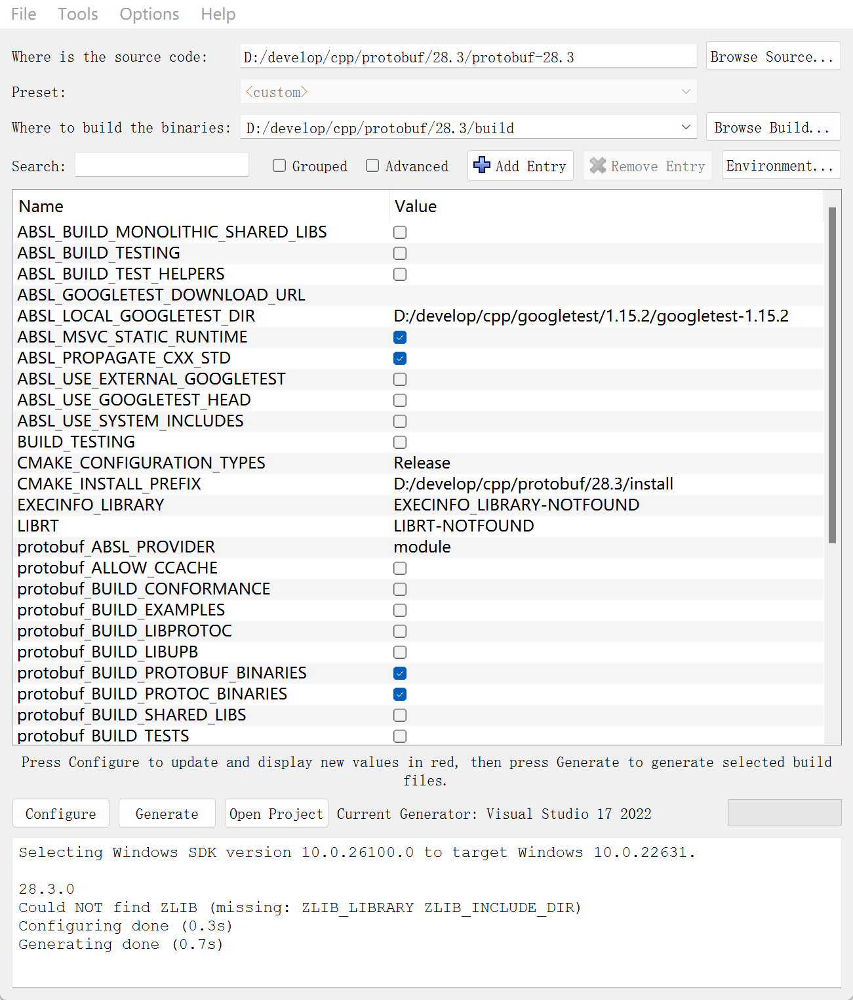
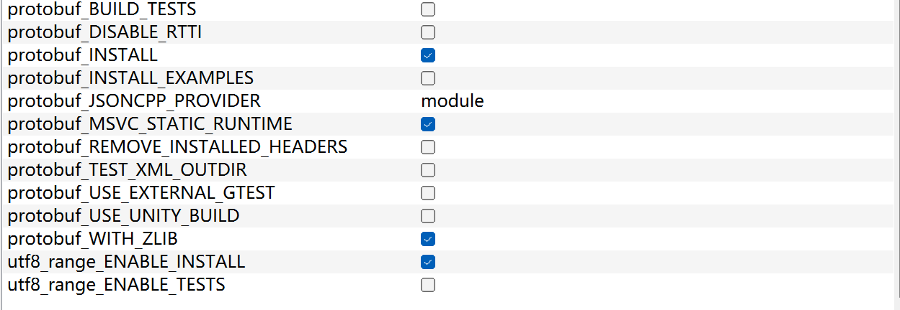

# protobuf编译


1 下载protobuf源码

https://github.com/protocolbuffers/protobuf/releases

解压到指定目录

如 D:\develop\cpp\protobuf\28.3\protobuf-28.3


2 在源码目录内下载依赖额第三方库

abseil-cpp: https://github.com/abseil/abseil-cpp/releases

下载最新版本 abseil-cpp 源码解压到 \third_party\abseil-cpp 内


3 创建构建和安装目录

创建指定目录,分别保存构建过程的临时文件和最终的构建产物

如:

D:\develop\cpp\protobuf\28.3\build

D:\develop\cpp\protobuf\28.3\install


4 配置cmake

打开cmake-gui, 配置如下:







注意: 这里编译静态库, 所有 abseil和protobuf都选择使用静态库

ABSL_MSVC_STATIC_RUNTIME

protobuf_MSVC_STATIC_RUNTIME

都不要勾选


protobuf_BUILD_LIBUPB 这个是用于构建适用于小型设备的轻量版protobuf库, 通常不需要, 去掉勾选即可


测试相关的选项页去掉勾选, 如 

ABSL_BUILD_TESTING  

BUILD_TESTING 

protobuf_BUILD_TESTS

utf8_range_ENABLE_TESTS


按照上图配置好之后点击下面的 Configure 按钮, 

第一次点击会有弹窗, 选择编译环境, 这里选择 VS2022 , 再选择编译平台, 默认选择 x64

稍等输出:

```
Selecting Windows SDK version 10.0.26100.0 to target Windows 10.0.22631.

28.3.0
Could NOT find ZLIB (missing: ZLIB_LIBRARY ZLIB_INCLUDE_DIR) 
Configuring done (0.3s)
Generating done (0.7s)
```

说明配置完成


再点击 Generate 生成项目, 此时会在 build目录内生成 vs 项目


关闭 CMake-gui, 执行指令:

开始编译:

```shell
cmake --build D:\develop\cpp\protobuf\28.3\build --config Release
```


编译完成后安装:

```shell
cmake --install D:\develop\cpp\protobuf\28.3\build --config Release
```

执行完成后可以在 install 目录看到构建产物:

```shell
├─bin
│      protoc.exe
│
├─include
│  │  utf8_range.h
│  │  ...
│  │
│  ├─absl
│  ├─google
│  │  └─protobuf
│  │      │  any.h
│  │      │  ...
│  │
│  ├─java
│  │
│  └─upb_generator
│
└─lib
    │  absl_bad_any_cast_impl.lib
    │  ...
```

