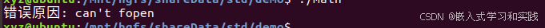
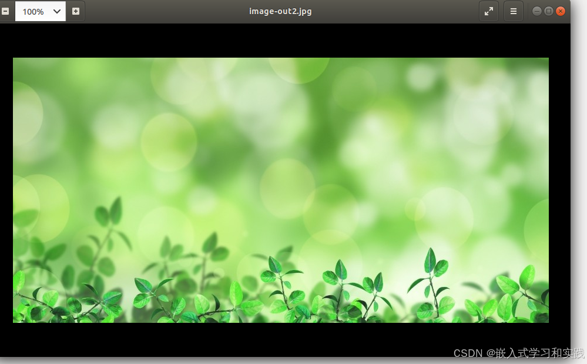
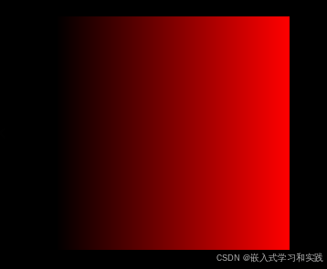
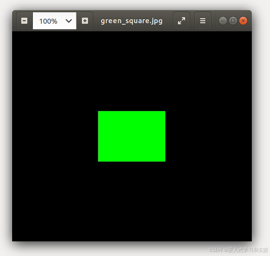
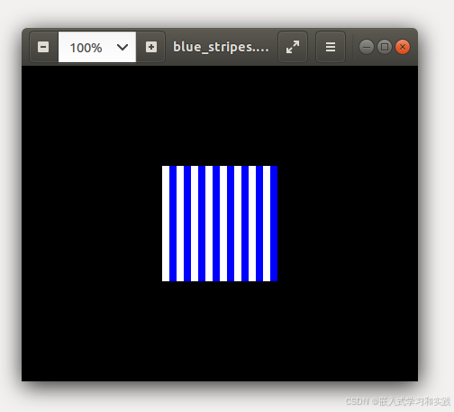
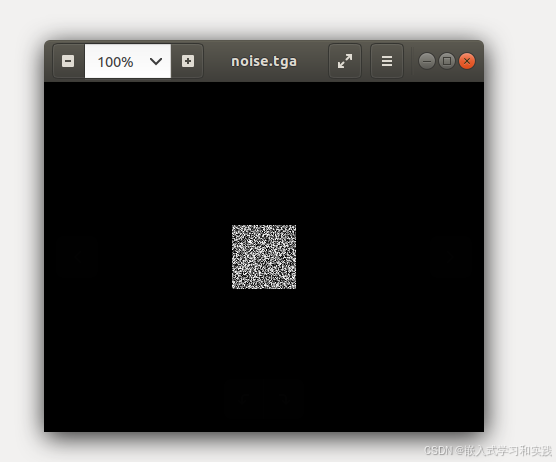
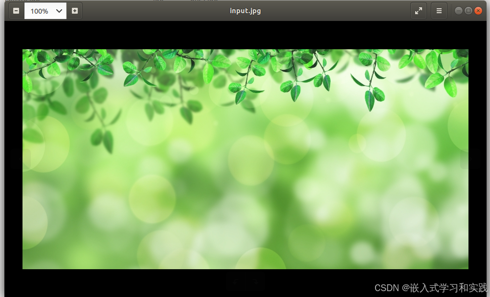
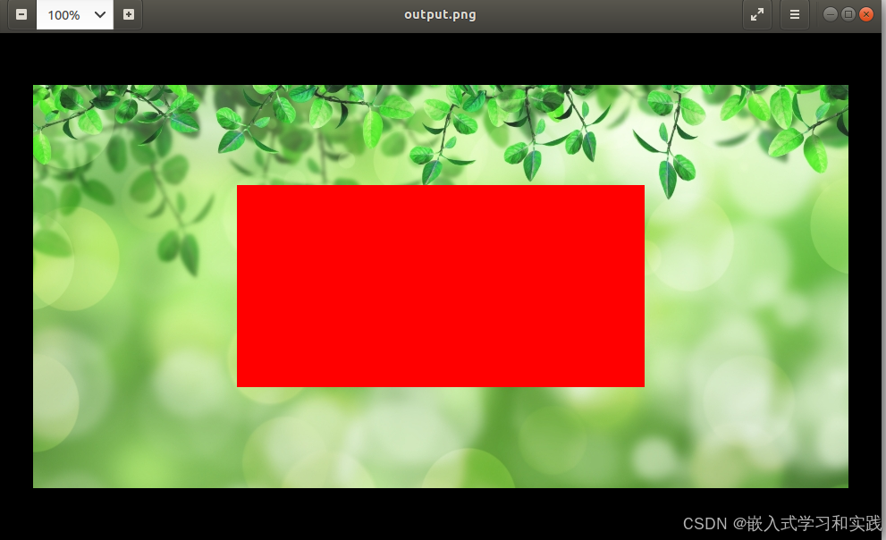

# stb_image 开源库 常用函数介绍、详解


stb_image 开源库中常用函数的介绍，涵盖图像加载、内存管理、配置选项、写入函数等核心功能。


## 1 核心函数 图像加载

### 1.1 stbi_load - 加载图像文件

函数原型：

```
unsigned char* stbi_load(
    const char *filename,   // 文件路径
    int *width,            // 返回图像的宽度（像素）
    int *height,           // 返回图像的高度（像素）
    int *channels,         // 返回图像的通道数（1-灰度，3-RGB，4-RGBA）
    int desired_channels   // 期望的通道数（0表示保持原样）
);
```

功能：从文件加载图像数据，返回像素数据指针（失败返回 NULL）。

示例：

```cpp
#define STB_IMAGE_IMPLEMENTATION
#include "stb_image.h"
#include <stdio.h>

int main() {
    int width, height, channels;
    unsigned char *data = stbi_load("image.jpg", &width, &height, &channels, 0);
    if (!data) {
        printf("加载失败: %s\n", stbi_failure_reason());
        return 1;
    }
    printf("尺寸: %dx%d, 通道数: %d\n", width, height, channels);
    stbi_image_free(data); // 必须手动释放内存
    return 0;
}
```


### 1.2 stbi_load_from_memory - 从内存加载图像

函数原型：

```cpp
unsigned char* stbi_load_from_memory(
    const unsigned char *buffer, // 内存中的图像数据
    int len,                    // 数据长度（字节）
    int *width, int *height, int *channels,
    int desired_channels
);
```

功能：直接解析内存中的图像数据（如网络下载的图片）。

示例：

```
// 假设 image_buffer 是已加载到内存的图像数据
unsigned char *image_buffer = ...;
int buffer_size = ...;

int width, height, channels;
unsigned char *data = stbi_load_from_memory(image_buffer, buffer_size, &width, &height, &channels, 3); // 强制转为 RGB

if (data) {
    // 处理数据...
    stbi_image_free(data);
}
```

```cpp
#define STB_IMAGE_IMPLEMENTATION
#include "stb_image.h"
#define STB_IMAGE_WRITE_IMPLEMENTATION
#include "stb_image_write.h"
#include <stdio.h>

int main() {

    FILE *f;
    int width, height, channels;
    char *buf = NULL;
    long siz_buf;


    f = fopen("image.jpg", "rb");
    if(f == NULL)
    {
        fprintf(stderr, "error opening input file\n");
        goto err;
    }

    fseek(f, 0, SEEK_END);

    siz_buf = ftell(f);
    rewind(f);

    if(siz_buf < 1) goto err;

    buf = (char*)malloc((size_t)siz_buf);
    if(buf == NULL)
    {
        fprintf(stderr, "malloc() failed\n");
        goto err;
    }

    if(fread(buf, (size_t)siz_buf, 1, f) != 1)
    {
        fprintf(stderr, "fread() failed\n");
        goto err;
    }

       unsigned char *image_buffer = stbi_load_from_memory( buf, siz_buf, &width, &height, &channels, 3); // 强制转为 RGB

    printf("尺寸: %dx%d, 通道数: %d\n", width, height, channels);

    if (image_buffer) {
        // 处理数据...
        printf("image-out.jpg\n");
        stbi_write_jpg("image-out.jpg", width, height, 3, image_buffer, 90);
        stbi_image_free(image_buffer );
    }

err:
    free(buf);
    return 0;
}
```


### 1.3 stbi_load_from_file - 从文件流加载图像

函数原型：

```cpp
unsigned char* stbi_load_from_file(
    FILE *file,              // 已打开的文件指针
    int *width, int *height, int *channels,
    int desired_channels
);
```

文件流加载图像（适用于自定义文件读取逻辑）。

示例：

```cpp
FILE *file = fopen("image.png", "rb");
if (!file) return 1;

int width, height, channels;
unsigned char *data = stbi_load_from_file(file, &width, &height, &channels, 4); // 强制 RGBA
if (data) {
    // 处理数据...
    stbi_image_free(data);
}
fclose(file);
```

```cpp
#define STB_IMAGE_IMPLEMENTATION
#include "stb_image.h"
#include <stdio.h>

int main() {
    FILE *file = fopen("image.png", "rb");
    if (!file) return 1;

    int width, height, channels;
    unsigned char *data = stbi_load_from_file(file, &width, &height, &channels, 4); // 强制 RGBA
    if (data) {
        // 处理数据...
        printf("尺寸: %dx%d, 通道数: %d\n", width, height, channels);
        stbi_image_free(data);
    }
    fclose(file);
    return 0;
}
```


## 2 辅助函数

### 2.1 stbi_image_free - 释放内存

函数原型：

```cpp
void stbi_image_free(void *data); // 释放 stbi_load 返回的数据
```

功能：释放由 stbi_load 或类似函数分配的内存。


### 2.2 stbi_failure_reason - 获取错误信息

函数原型：

```cpp
const char* stbi_failure_reason();
```

功能：返回加载失败的具体原因（如 “JPEG format not supported”）。

示例：

```cpp
unsigned char *data = stbi_load("corrupt.jpg", &w, &h, &c, 0);
if (!data) {
    fprintf(stderr, "错误原因: %s\n", stbi_failure_reason());
}
```

```cpp
#define STB_IMAGE_IMPLEMENTATION
#include "stb_image.h"
#include <stdio.h>

int main() {
    int width, height, channels;
    unsigned char *data = stbi_load("corrupt.jpg", &width, &height, &channels, 0);
    if (!data) {
        fprintf(stderr, "错误原因: %s\n", stbi_failure_reason());
    }
    return 0;
}
```



### 2.3 stbi_set_flip_vertically_on_load - 垂直翻转图像

函数原型：

```cpp
void stbi_set_flip_vertically_on_load(int flag); // 1=翻转，0=不翻转
```

功能：在加载图像时垂直翻转数据（适用于 OpenGL 等坐标原点在左下角的系统）。

示例：

```cpp
stbi_set_flip_vertically_on_load(1); // 启用翻转
unsigned char *data = stbi_load("texture.png", &w, &h, &c, 0);
// 数据已垂直翻转
```

```cpp
#define STB_IMAGE_IMPLEMENTATION
#include "stb_image.h"
#define STB_IMAGE_WRITE_IMPLEMENTATION
#include "stb_image_write.h"
#include <stdio.h>

int main() {
    int width, height, channels;
    stbi_set_flip_vertically_on_load(1); // 启用翻转
    unsigned char *data = stbi_load("image.jpg", &width, &height, &channels, 0);
    if (!data) {
        printf("加载失败: %s\n", stbi_failure_reason());
        return 1;
    }
    printf("尺寸: %dx%d, 通道数: %d\n", width, height, channels);
    // 处理数据...
    stbi_write_jpg("image-out2.jpg", width, height, 3, data, 90);
    stbi_image_free(data); // 必须手动释放内存
    return 0;
}
```

原图：


测试后：




## 3 高级配置

### 3.1 自定义内存分配器

通过定义以下宏，可自定义内存分配和释放函数：

```cpp
#define STBI_MALLOC(size)        my_malloc(size)
#define STBI_REALLOC(ptr, size)  my_realloc(ptr, size)
#define STBI_FREE(ptr)           my_free(ptr)
```

在包含 stb_image.h 前定义这些宏。


### 3.2 限制图像尺寸

通过定义宏限制加载图像的最大尺寸（防止恶意大文件）：

```cpp
#define STBI_MAX_DIMENSIONS 4096 // 限制宽高不超过 4096 像素
```


## 4 写入函数 涵盖 PNG、JPG、BMP、TGA 等

### 4.1 stbi_write_png - 保存为 PNG 格式

函数原型：

```cpp
int stbi_write_png(
    const char *filename,  // 输出文件名（如 "output.png"）
    int w, int h,         // 图像宽高（像素）
    int comp,              // 通道数（1-灰度，3-RGB，4-RGBA）
    const void *data,      // 像素数据指针
    int stride_bytes       // 每行字节数（通常为 w * comp）
);
```

特点：

支持透明度（RGBA）
无损压缩
默认使用 Zlib 压缩
示例：

```cpp
// 生成红色渐变图像并保存为 PNG
#define STB_IMAGE_IMPLEMENTATION
#include "stb_image.h"
#define STB_IMAGE_WRITE_IMPLEMENTATION
#include "stb_image_write.h"
#include <stdio.h>

// 生成红色渐变图像并保存为 PNG
#define WIDTH 256
#define HEIGHT 256

int main() {
    unsigned char data[WIDTH * HEIGHT * 3]; // RGB 三通道
    for (int y = 0; y < HEIGHT; y++) {
        for (int x = 0; x < WIDTH; x++) {
            int idx = (y * WIDTH + x) * 3;
            data[idx] = x;     // R 通道渐变（0-255）
            data[idx + 1] = 0; // G 通道
            data[idx + 2] = 0; // B 通道
        }
    }
    stbi_write_png("red_gradient.png", WIDTH, HEIGHT, 3, data, WIDTH * 3);
    return 0;
}
```



### 4.2 stbi_write_jpg` - 保存为 JPEG 格式

函数原型：

```cpp
int stbi_write_jpg(
    const char *filename, 
    int w, int h, 
    int comp, 
    const void *data, 
    int quality          // 压缩质量（1-100，100为最高质量）
);
```

特点：

有损压缩，适合照片类图像
仅支持 3 通道（RGB）或 1 通道（灰度）
示例：

```cpp
#define STB_IMAGE_IMPLEMENTATION
#include "stb_image.h"
#define STB_IMAGE_WRITE_IMPLEMENTATION
#include "stb_image_write.h"
#include <stdio.h>

// 生成绿色方块并保存为 JPEG（质量 90）
int main() {
    int width = 400, height = 300;
    unsigned char *data = malloc(width * height * 3);
    memset(data, 0, width * height * 3); // 初始化为黑色

    // 在中心绘制绿色方块
    for (int y = height/3; y < 2*height/3; y++) {
        for (int x = width/3; x < 2*width/3; x++) {
            int idx = (y * width + x) * 3;
            data[idx] = 0;     // R
            data[idx + 1] = 255; // G
            data[idx + 2] = 0; // B
        }
    }

    stbi_write_jpg("green_square.jpg", width, height, 3, data, 90);
    free(data);
    return 0;
}
```



### 4.3 stbi_write_bmp - 保存为 BMP 格式

函数原型：

```cpp
int stbi_write_bmp(
    const char *filename, 
    int w, int h, 
    int comp, 
    const void *data
);
```

特点：

无压缩，文件较大
支持 3 通道（BGR 顺序）或 4 通道（BGRA）
示例：

```cpp
#define STB_IMAGE_IMPLEMENTATION
#include "stb_image.h"
#define STB_IMAGE_WRITE_IMPLEMENTATION
#include "stb_image_write.h"
#include <stdio.h>

// 生成蓝白条纹 BMP
int main() {
    int width = 128, height = 128;
    unsigned char data[width * height * 3];
    for (int y = 0; y < height; y++) {
        for (int x = 0; x < width; x++) {
            int idx = (y * width + x) * 3;
            data[idx] = (x % 16 < 8) ? 255 : 0; // B 通道（条纹）
            data[idx + 1] = data[idx];           // G 通道（同 B）
            data[idx + 2] = 255;                 // R 通道（固定值）
        }
    }
    stbi_write_bmp("blue_stripes.bmp", width, height, 3, data);
    return 0;
}
```




### 4.4 stbi_write_tga - 保存为 TGA 格式

函数原型：

```cpp
int stbi_write_tga(
    const char *filename, 
    int w, int h, 
    int comp, 
    const void *data
);
```

特点：

支持 RLE 压缩（通过 stbi_write_tga_with_rle）
通道数支持 1（灰度）、3（RGB）、4（RGBA）
示例：

```cpp

#define STB_IMAGE_IMPLEMENTATION
#include "stb_image.h"
#define STB_IMAGE_WRITE_IMPLEMENTATION
#include "stb_image_write.h"
#include <stdio.h>

#include <stdlib.h>
#include <time.h>
// 生成黑白噪声图并保存为 TGA
int main() {
    srand(time(NULL));
    int width = 64, height = 64;
    unsigned char data[width * height]; // 单通道灰度
    for (int i = 0; i < width * height; i++) {
        data[i] = rand() % 256; // 随机灰度值
    }
    stbi_write_tga("noise.tga", width, height, 1, data);
    return 0;
}
```




#### 注意事项

##### 1 数据对齐

  确保像素数据顺序与 comp 参数一致（如 RGB 或 BGR）。
  BMP 格式的像素顺序为 BGR（而非 RGB），需注意处理。


##### 2 错误处理

检查函数返回值：返回 1 表示成功，0 表示失败（如路径不可写）。
失败时可通过 stbi_failure_reason() 获取错误信息（需在包含头文件前定义 STBI_FAILURE_USERMSG）。


##### 3 内存管理

写入完成后，需手动释放 data 内存（若为动态分配）。


#### 扩展函数

1 stbi_write_hdr - 保存 HDR 格式（高动态范围图像）

```cpp
int stbi_write_hdr(const char *filename, int w, int h, int comp, const float *data);
```

用途：保存浮点像素数据（如光照贴图）。

2 stbi_write_png_to_func - 自定义输出目标（如内存或网络流）

```cpp
int stbi_write_png_to_func(void *context, void *data, int size);
```

用途：将 PNG 数据写入自定义回调函数而非文件。

总结

| 格式 | 函数             | 压缩 | 典型用途           |
| ---- | ---------------- | ---- | ------------------ |
| PNG  | `stbi_write_png` | 无损 | 透明图像、图标     |
| JPEG | `stbi_write_jpg` | 有损 | 照片、网页图像     |
| BMP  | `stbi_write_bmp` | 无   | Windows 兼容图像   |
| TGA  | `stbi_write_tga` | 可选 | 游戏纹理、旧版软件 |
| HDR  | `stbi_write_hdr` | 无   | 高动态范围渲染数据 |

根据需求选择格式，结合 stb_image.h 可实现完整的图像读写流程！


## 5 完整示例：加载并修改图像

```cpp
#define STB_IMAGE_IMPLEMENTATION
#define STB_IMAGE_WRITE_IMPLEMENTATION
#include "stb_image.h"
#include "stb_image_write.h"
#include <stdio.h>

int main() {
    // 加载图像
    int width, height, channels;
    unsigned char *data = stbi_load("input.jpg", &width, &height, &channels, 3);
    if (!data) return 1;

    // 将图像中心区域变为红色
    for (int y = height/4; y < 3*height/4; y++) {
        for (int x = width/4; x < 3*width/4; x++) {
            int idx = (y * width + x) * 3;
            data[idx] = 255;   // R
            data[idx+1] = 0;   // G
            data[idx+2] = 0;   // B
        }
    }

    // 保存为 PNG
    stbi_write_png("output.png", width, height, 3, data, width*3);
    stbi_image_free(data);
    return 0;
}
```

原图：



测试后：



总结
核心加载函数：stbi_load, stbi_load_from_memory, stbi_load_from_file
内存管理：必须使用 stbi_image_free 释放数据
错误处理：通过 stbi_failure_reason() 获取错误详情
高级功能：垂直翻转、自定义内存分配、尺寸限制
写入功能：写入相关函数 stbi_write_png、stbi_write_jpg、stbi_write_bmp、stbi_write_tga等常见格式