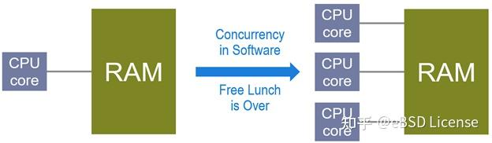
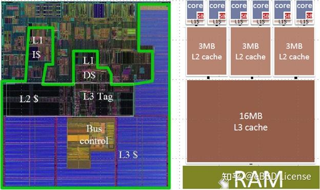
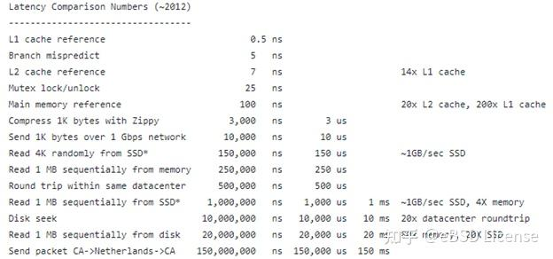
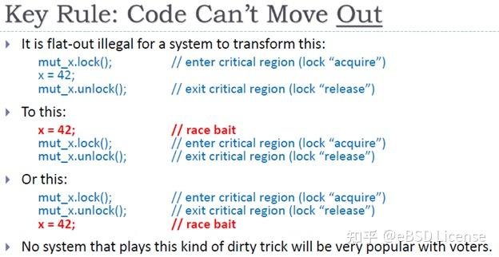
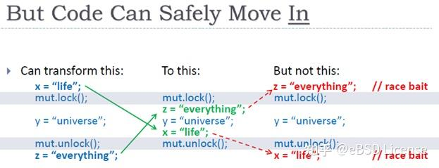
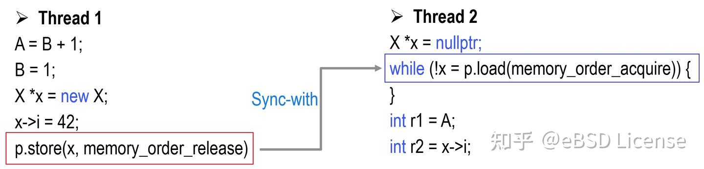
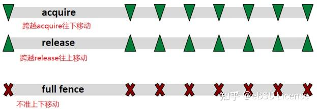
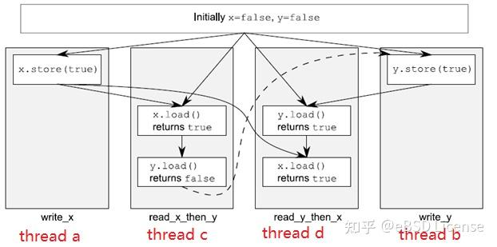
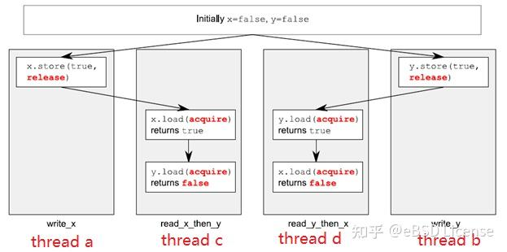

# 现代C++的内存模型

https://zhuanlan.zhihu.com/p/382372072


写这篇文章的初衷，起因是在读《[C++ Concurrency In Action](https://link.zhihu.com/?target=https%3A//book.douban.com/subject/4130141/)》第5章时，感觉异常难懂，特别是5.3.3节作者举了一个不相关且并不适合的例子来解释[Relaxed Ordering](https://zhida.zhihu.com/search?content_id=173102019&content_type=Article&match_order=1&q=Relaxed+Ordering&zhida_source=entity)，让人更是一头雾水。所以当时便有计划在弄明白C++的内存模型后，写一个更好懂的版本，于是便有了此文。

本文将从编译器和CPU的优化，引出内存模型，最后再介绍内存模型的使用。

**1、编译器和CPU的优化**

为什么要有C++的内存模型呢？当然，此处说的内存模型是指多线程编程方面，而非对象的内存布局内存对齐之类。要回答这个问题，我们要从理想的硬件和实际的硬件差异说起。

先说一下理想的硬件，如图1所示，我们编程都是基于此种理想架构，CPU Core直接对RAM进行读写，而无需考虑二者速度差异。从最初的单核时代，到如今的多核时代，都是如此，至少大部分编程都可只做如此假设。这样的理想架构在最开始的单核时代，程序性能甚至可以在不修改代码的前提下而仅靠CPU主频提升而得到大幅改善，这种性能提升就是所谓的[Free Lunch](https://link.zhihu.com/?target=http%3A//www.gotw.ca/publications/concurrency-ddj.htm)。随着主频提升到达极限，多核时代来临，原来单核时代的好日子便一去不复返，复杂的并发程序设计开始成为主流。



图1. 理想的架构

不过，单纯地比较图1左右部分的架构，其实多核并没有带来更高的复杂度，但实际的CPU/RAM架构远比图1的复杂，图2便是实际的某款CPU架构。



图2. 实际的CPU架构

图2左侧为CPU的实际芯片，大约有85%面积为Cache，而图2右侧，在CPU Core和RAM之间，还有共三层的Cache结构（L1/L2/L3），此外还有[Store Buffer](https://zhida.zhihu.com/search?content_id=173102019&content_type=Article&match_order=1&q=Store+Buffer&zhida_source=entity) (SB)，且SB和L1 是每个Core独享，而L2是两个Core共享，L3是所有Core共享，当然，该结构只是对这款实际CPU产品而言，并不能代表全部。但这足以说明，理想和实际的区别。

为什么非要引入Cache？根据[Jeff Dean](https://link.zhihu.com/?target=https%3A//en.wikipedia.org/wiki/Jeff_Dean)对程序运行方面的一些[时间数据](https://link.zhihu.com/?target=http%3A//highscalability.com/numbers-everyone-should-know)的论述，如图3所示：



图3 程序员应该知道的一些时间数据

我们可以看出，在速度上，CPU和内存之间有两个数量级的差异。试想，如果没有Cache，CPU每执行一条指令，都要去内存取下一条，而执行一条指令也就几个时钟周期（几ns），而取指令却要上百个时钟周期，这将导致CPU大部分时间都在等待状态，进而导致执行效率低下。

引入了Cache，解决了CPU等待的问题，但却产生了很多新的问题，例如[Cache的一致性](https://link.zhihu.com/?target=https%3A//en.wikipedia.org/wiki/Cache_coherence)，[Cache的缺失](https://link.zhihu.com/?target=https%3A//en.wikipedia.org/wiki/CPU_cache%23Cache_miss)，[Cache的乒乓效应](https://link.zhihu.com/?target=https%3A//stackoverflow.com/questions/30684974/are-cache-line-ping-pong-and-false-sharing-the-same%23%3A~%3Atext%3DCache%20line%20ping-ponging%20is%20the%20effect%20where%20a%2Cbe%20cause%20by%20either%20false%20or%20true%20sharing)等等，为了解决这些问题，各CPU平台（X86/IA64/ARM/Power…）都有自己的解决方案，软件层面（编译器）也会有对应的优化。这导致了CPU执行的程序，并不是你写的那个版本，只是从结果上看不出差别而已。如果你曾经单步调试过一个release版本的程序，你会发现运行过程很怪异，居然没有沿着你的代码顺序执行。因为，要是严格按照你的代码顺序执行，编译器和CPU都会抱怨，说执行效率很低速度很慢。

为什么它们执行了一个不一样的程序，我们竟然不知情？其实，主要原因是编译器和CPU优化都遵循了一个同样的原则（[As-if rule](https://link.zhihu.com/?target=https%3A//en.wikipedia.org/wiki/As-if_rule)），即优化后的代码，[若是单线程执行，要与原有代码行为保持一致](https://link.zhihu.com/?target=https%3A//preshing.com/20120625/memory-ordering-at-compile-time/)。再加之多线程环境我们使用的互斥锁，其对编译器和CPU优化做了很多限制，可以让我们对线程间的执行顺序进行同步，进而保证了即使被优化成了另一个程序，仍然有相同的执行结果。

若我们从比互斥锁更为底层地去了解多线程间的同步机制，我们势必会看到CPU平台（X86/IA64/ARMv7/ARMv8/Power…）和编译器（gcc/VC/clang…）的差异，进而可以知道优化的存在。现代C++的内存模型，便是为了屏蔽这些差异，而让你可以不用去了解特定平台特定编译器，也不用依赖互斥锁，就可以完成线程间的同步。C++11开始提供的[std::atomic](https://zhida.zhihu.com/search?content_id=173102019&content_type=Article&match_order=1&q=std%3A%3Aatomic&zhida_source=entity)<>类模板，便可以作为更为底层的同步工具，这也是内存模型起作用的地方。

要了解内存模型，我觉得还是要先谈谈一些重要的优化，包括编译器和CPU/Cache方面。优化主要包括Reorder/Invent/Remove，正如图4所言，优化发生在哪一层并不重要。但有哪些类型的优化还是值得一提。


图4. 优化（Herb Sutter: atomic Weapons）

对于重排（Reordering），编译器和CPU都会有重排，主要就是为了[优化性能](https://link.zhihu.com/?target=https%3A//preshing.com/20120625/memory-ordering-at-compile-time/)。既然发生在哪一层不重要，我们这里就从编译器方面来看，以下面代码为例，

```cpp
//reordering 重排示例代码
int A = 0, B = 0;
void foo()
{
    A = B + 1;  //(1)
    B = 1;      //(2) 
}
// g++ -std=c++11 -O2 -S test.cpp
// 编译器重排后的代码
// 注意第一句汇编，已经将B最初的值存到了
// 寄存器eax，而后将该eax的值加1，再赋给A
movl  B(%rip), %eax
movl  $1, B(%rip)          // B = 1
addl  $1, %eax             // A = B + 1
movl  %eax, A(%rip)
```

可以看到，B=1居然先于A=B+1被执行，不过，最终的结果仍然与重排前一致。对于单线程来说，这没什么问题。但是，对于多线程，若另一个线程依赖于未重排的假设，当B为1时，它认为A=B+1已经执行了。这样，就会发生非预期的行为。重排有什么好处呢？我们前文谈到了Cache，其实Cache的读写单位是Cache line，即一块内存区域，大小一般为64字节。若需要读写该区域中的某个变量，则CPU会将该区域整体进行读写。对于重排的例子，假设A和B在不同的Cache line，且假定没有重排优化，也就是第二句汇编放于最后，那我们设想一种情形，当CPU将B读入Cache之后，Cache已经满了，那么，若要接着读入A，这时候只能移出某些Cache line，且假设刚好B所在的Cache line被移出，这样导致最后一句（原先的第二句汇编）给B赋值时，又要再次读取B到Cache。要知道，读取变量到Cache是需要读写主存的，还记得图3中主存的访问速度吗？重排只需读取主存一次，而未重排则需要两次读取。

再来说Invention，其实这主要涉及CPU的[Speculative execution](https://link.zhihu.com/?target=https%3A//en.wikipedia.org/wiki/Speculative_execution)，我们看如下代码，

```cpp
// Invention示例代码
// 原始代码
if( cond ) x = 42;

// 优化后代码
r1 = x;// read what's there
x = 42;// oops: optimistic write is not conditional
if( !cond)// check if we guessed wrong
    x = r1;// oops: back-out write is not SC
```

我们看到，相比于最初的代码，多了一次对x的写入。同样，对于单线程来说，没有什么问题，但是对于多线程，显然是有问题的，另一个线程在cond为false的情况下，依然可能看到x为42.

当然，Invention还有很多其它情况，这里就不细表了。

最后说说removal，一般是编译器在优化时会移除一些不影响行为的代码，比如，未使用的变量、if(false)代码块的语句等。本文在讨论内存模型时，不会涉及此优化，所以就此略过。

从上面的几类优化可以看出，即使编译器和CPU遵循As-if原则，优化仍然可能会影响多线程程序的行为。当然，在多线程编程中，我们一般借助于互斥锁去同步相关线程，即使在优化存在的条件下仍然能得到预期的程序行为。但是，互斥锁是较为高层的同步工具。C++11引入的现代C++内存模型，可以使我们在不借助互斥锁时，从更为底层的层面，让我们写出符合预期行为的多线程程序。

**2、现代C++的内存模型**

谈内存模型之前，先谈谈如下几个概念，以便于后续分析多线程的同步过程。

（1）顺序一致（Sequential consistency）

编译器和CPU需要严格按照代码顺序进行生成和执行。对于多线程程序，由图1架构可知，每个线程的指令执行顺序由各自的CPU来控制，因而都有独立的执行顺序，但因为它们共享同一个内存，而内存修改的顺序是全局的（global memory order），我们可以以该全局顺序为参照，对所有线程进行同步。其实，我们用互斥锁来推导线程间同步顺序时，也是基于类似这种顺序一致的前提。但顺序一致更为严格，对于内存读写来说，读写顺序需要严格按照代码顺序，即要求如下（符号”<p”表示程序代码顺序，符号”<m”表示内存的读写顺序）：

```cpp
// 顺序一致的要求
/* Load→Load */
/*若按代码顺序，a变量的读取先于b变量，
则内存顺序也需要先读a再读b
后面的规则同理。*/
if L(a) <p L(b) ⇒ L(a) <m L(b) 

/* Load→Store */
if L(a) <p S(b) ⇒ L(a) <m S(b) 

/* Store→Store */	
if S(a) <p S(b) ⇒ S(a) <m S(b) 

 /* Store→Load */
if S(a) <p L(b) ⇒ S(a) <m L(b)	
```

既然顺序一致这么严格，其显然会限制编译器和CPU的优化，所以业界提出了很多宽松的模型，例如在X86中使用的[TSO](https://link.zhihu.com/?target=https%3A//www.cis.upenn.edu/~devietti/classes/cis601-spring2016/sc_tso.pdf)（Total Store Order）便允许某些条件下的重排。

从程序员（a programmer-centric approach）的角度，抛开编译器和硬件，也即从语言层面，我们也可以提出合适的模型。现代C++（包括Java）都是使用了[SC-DRF](https://zhida.zhihu.com/search?content_id=173102019&content_type=Article&match_order=1&q=SC-DRF&zhida_source=entity)(Sequential consistency for data race free)。在SC-DRF模型下，程序员只要不写出[Race Condition](https://link.zhihu.com/?target=https%3A//stackoverflow.com/questions/34510/what-is-a-race-condition)的代码，编译器和CPU便能保证程序的执行结果与顺序一致相同。**因而，内存模型就如同程序员与编译器/CPU之间的契约，需要彼此遵守承诺。C++的内存模型默认为SC-DRF，此外还支持更宽松的非SC-DRF的模型。**

（2）Happens-before

按代码顺序，若语句A在语句B的前面，则语句A Happens Before 语句B。对同一个线程来说，前面的代码Happens Before后面的代码。线程之间的语句也有Happens Before的关系，这需要借助我们后面讲的synchronizes-with来确定。值得说明的是，[Happens Before](https://link.zhihu.com/?target=https%3A//preshing.com/20130702/the-happens-before-relation/)并不表明语句A一定会在语句B之前执行，例如前面重排（Reordering）的例子。不过这并不影响此概念的引入和使用，后面在具体使用此概念时会看到原因。

（3）Synchronizes-with

用于线程间的同步，通常借助原子变量的操作来实现。线程1对原子变量x进行写操作，若线程2对原子变量x进行读操作且读到了线程1的写结果，则线程1的写操作Synchronizes-with线程2的读操作。

假设线程1的原子操作A Synchronizes-with 线程2的原子操作B，则线程1中，所有Happens Before 操作A的其它所有写操作结果（包括原子和非原子），都对线程2中操作B之后的操作可见（也就是被操作B Happens Before的那些操作）。基于Synchronizes-with，我们可以推导出跨线程的Happens Before关系。

多线程编程，临界区是一个很重要的概念。我们对此再做进一步的认识。

对于临界区区内的语句，显而易见，我们不能将其移出临界区，如图5所示，编译器和CPU都不会做这种移出临界区的优化：



图5. 不能移出临界区区内代码

但我们可以将临界区区外的代码移进来，如图6所示



图6. 临界区区外代码可以移入临界区

从图5和图6我们可以看出，lock和unlock可以看作两个单方向的屏障，lock对应的屏障，只允许代码往下方向移动，而unlock则只允许上方向移动。

C++内存模型借鉴lock/unlock，引入了两个等效的概念，Acquire（类似lock）和Release（类似unlock），这两个都是单方向的屏障（One-way Barriers: acquire barrier, release barrier）。

借助于Acquire & Release语义，在比互斥锁更底层的层面，我们也能实现线程间同步。先来看图7中的例子，p是我们后面会介绍的原子变量（std::atomic<X*>），当线程2看到p为非空时，后续的r1 = A语句可以看到线程1对A的写操作结果。这是因为线程1对p的store操作Synchronizes-with线程2对p的load操作，这样加之Happens-before关系，我们实现了线程间同步。值得一提的是，线程1中，”A=B+1” Happens-before “B = 1”，但”B = 1”可能先执行，但线程1对A的写操作的结果，依旧能正确地被线程2中”int r1 = A”语句读取。

有人也许会问，用非原子变量难道不能实现Synchronizes-with关系？首先，非原子变量，显然不能被多个线程同时读写，再者，其无法提供内存屏障，不要忘了前文重排的例子，试想，若线程1中A和B的写入操作被重排到了p.store的后面，且即使替换p.store的非原子变量操作在多线程下可以正确执行，但此时"int r1 = A"能读取到正确的值吗？



图7. 使用内存顺序为Acquire/Release模型进行同步

值得说明的是，线程2需要看到线程1对原子变量p的写结果，才能认为线程1 synchronizes-with 线程2，所以线程2对p的读取是在while中进行的。相比于mutex，两个线程都不再需要lock/unlock操作，而仅靠对原子变量的写/读(release/acquire)便能进行同步。

上述线程1和线程2中用到的memory_order_release和memory_order_acquire，其实是比SC-DRF更为宽松的模型，C++默认的SC-DRF对应为memory_order_seq_cst，使用该默认模型的操作，上移下移都不被允许，相当于双向屏障，可以用图8稍作总结。



图8. 三种屏障 （可下移、可上移、不能跨越）

现代C++的内存模型，其实主要表现在对原子变量进行操作时，通过指定memory order（内存顺序）的参数，来控制线程间同步。图7的示例便是其中一种内存顺序模型（获取发布模型：Acquire-Release Ordering）。memory order是一个枚举值，定义如下：

```cpp
// 内存模型枚举值
typedef enum memory_order {
    memory_order_relaxed,
    memory_order_consume,
    memory_order_acquire,
    memory_order_release,
    memory_order_acq_rel,
    memory_order_seq_cst
} memory_order;
```

以上6个枚举值可以细分为三种内存顺序模型，见下表1

| 内存顺序模型                                 | Memory order枚举值                                           |
| -------------------------------------------- | ------------------------------------------------------------ |
| 顺序一致（sequentially consistent ordering） | memory_order_seq_cst，只有该值满足SC-DRF，其它都是比SC-DRF更宽松的模型，原子操作默认使用该值。 |
| 获取发布 （acquire-release ordering）        | memory_order_consume, memory_order_acquire, memory_order_release, memory_order_acq_rel |
| 松散（relaxed ordering ）                    | memory_order_relaxed                                         |

上述枚举值与需原子操作配合使用，原子操作包含load/store/RMW(read-modify-write) 这三类，各枚举值的意义总结如下表2：

| Memory order枚举值   | 意义                                                         |
| -------------------- | ------------------------------------------------------------ |
| memory_order_relaxed | 对于其它读写操作没有任何同步和重排的限制，仅要求保证原子性和内存一致性（见最后的例子说明）。 |
| memory_order_consume | 类似于memory_order_acquire，也是用于load操作，但更为宽松，请先参考acquire的说明。区别在于，load操作所在的线程仅能看到对于依赖于该原子变量的写操作的结果。图7中例子，”int r2 = x->i” 是有效的，因为其读取的值依赖原子变量p，但”int r1 = A”并不能读到线程1写入到A的值，因为A值并不依赖p。 |
| memory_order_acquire | 对于使用该枚举值的load操作，不允许该load之后的操作重排到load之前。若同一原子变量的store操作(使用memory_order_release，在另一线程) Synchronizes-with 该load操作，则另一线程store操作之前的所有写操作的结果，对当前线程load操作之后的所有操作可见。如图7的例子。 |
| memory_order_release | 使用该枚举值的store操作，不允许store之前的操作重排到store之后。Store(release)操作可以与load(Acquire/Consume)配合使用，见acquire/consume解释。 |
| memory_order_acq_rel | 用于RMW原子操作，RMW操作前后的语句都不允许跨越该操作而重排。该操作相当于兼具load(acquire)和store(release)，可以看作由这两个操作组成，但是整体上是原子的。 |
| memory_order_seq_cst | Load/store/RMW操作都可以使用该枚举值，这些操作依然分别具有Acquire语义/Release语义/Acquire&Release语义，且所有操作都相当于一个双向屏障，前后语句都不能跨越该操作进行重排。并且所有线程的语句都以全局的内存修改顺序为参照。 |

然而，并不是所有枚举值都适用于所有原子操作。适配关系总结如下表3：

| 操作              | 有效的Memory order枚举值                                     | 备注                                                         |
| ----------------- | ------------------------------------------------------------ | ------------------------------------------------------------ |
| Load              | memory_order_relaxed, memory_order_consume, memory_order_acquire, or memory_order_seq_cst | 其它枚举值不合法， MS STL的实现是将其当作memory_order_seq_cst处理 |
| Store             | memory_order_relaxed, memory_order_release, or memory_order_seq_cst | 同上                                                         |
| read-modify-write | memory_order_relaxed, memory_order_consume, memory_order_acquire, memory_order_release, memory_order_acq_rel, or memory_order_seq_cst |                                                              |

内存模型的介绍大致就是以上内容。我们最后来举例说明模型的使用。

**3、std::atomic<>与内存模型：**

（1）顺序一致模型（sequentially consistent ordering）

对于顺序一致模型，因为所有线程都参考全局的内存修改顺序。因此，我们可认为所有变量的读写都直接从内存进行，从而完全不用考虑Cache，Store Buffer这些因素，而以图1的理想架构就能完成线程同步的推导。

值得指出的是，C++此处的顺序一致是指SC-DRF，而并不是真正的SC。如表2最后一条所言，前后语句都不能跨越使用该模型（memory_order_seq_cst）的原子操作，且有全局的内存顺序，满足此要求下的重排是允许的。例如，在不跨越该原子操作的前提下，该原子操作前面的几条语句之间的重排是允许的，当然，若还有其它原子操作，则也要满足表2对应的要求。

以如下代码为例，以下代码，其执行结果是否能保证z不为0？

```cpp
// 顺序一致
std::atomic<bool> x,y;
std::atomic<int> z;
void write_x()
{
   x.store(true,std::memory_order_seq_cst);
}
void write_y()
{
    y.store(true,std::memory_order_seq_cst);
}
void read_x_then_y()
{
    while(!x.load(std::memory_order_seq_cst));
    if(y.load(std::memory_order_seq_cst))
        ++z;
}
void read_y_then_x()
{
    while(!y.load(std::memory_order_seq_cst));
    if(x.load(std::memory_order_seq_cst))
        ++z;
}
int main()
{
    x=false;
    y=false;
    z=0;
    std::thread a(write_x);
    std::thread b(write_y);
    std::thread c(read_x_then_y);
    std::thread d(read_y_then_x);
    a.join();
    b.join();
    c.join();
    d.join();
    assert(z.load()!=0);
}
```

由代码可知，显然线程a Synchronizes-with 线程c（线程c读取到了线程a对原子变量x的写入值），同理，线程b Synchronizes-with 线程d（根据对原子变量y的写入读取），但是其它线程关系，则只能分情况推知：

- 假设线程c和线程d中的第一个load操作同时返回true，显然，它们后续的load操作的值都为true，进而z不为0。因为，所有线程都参考一个全局的内存顺序（global memory order），即所有变量的值都只参考内存中的那一份，而与cache/store buffer无关。
- 假设线程c中的第一个load先返回true，显然，线程d中第二个load操作的值肯定为true，进而z不为0 。因为，所有线程都参考一个全局的内存顺序。根据对称性，假设线程d中的第一个load先返回true也有类似结果。

由以上分析可见，因为所有线程需要参考全局的内存顺序，其推导过程最为直观，但对于优化则有很多限制，性能方面要差于其它更为宽松的模型。

各线程关系如图9所示：



图9. .顺序一致模型的线程同步

（2）获取发布模型（acquire-release ordering）

代码依旧与顺序一致的代码相同，只是load的memory order参数要改为memory_order_acquire，而store的参数要改为memory_order_release，其余都一样。

但此时，我们不能简单按照图1的理想架构来分析代码，而应该按照图2的实际架构进行分析。该代码最终的执行结果，z值可能为0.



图10. 获取发布模型的线程同步

由代码及图10可知，线程a Synchronizes-with 线程c（线程c读取到了线程a对原子变量x的写入值），同理，线程b Synchronizes-with 线程d（根据对原子变量y的写入读取）。但因为所有线程没有参考一个全局的内存顺序，我们无法推出与SC-DRF模型相同的结果，即该模型下，z可能为0。

有几点值得说明的是：

- 线程a Synchronizes-with 线程c，线程b Synchronizes-with 线程d，这两组线程之间，因为没有同一个参照系，所以两组线程之间没有任何关系，因而也无法给出一个全局的关系。但每一组线程内部满足Synchronizes-with关系
- 线程c和线程d分别读到了都为true的x和y值，表明线程a和线程b对于x和y的写入已经到达了内存
- 按照前述SC-DRF模型的例子中的假设推导，却无法得出z不为0的结论。例如即使线程c和线程d的第一个load同时返回true，其后的两个load依旧可能返回false。因为，在acquire-release ordering下，线程没有全局一致的内存顺序可供参考，后续的两个load可能会从各自CPU的cache中获取数据，而该cache中的数据依旧为false。关于cache的影响，可以参考《[为什么需要内存屏障](https://zhuanlan.zhihu.com/p/55767485)》，更深入的参考可以看[perfbook](https://link.zhihu.com/?target=https%3A//cdn.kernel.org/pub/linux/kernel/people/paulmck/perfbook/perfbook.html)的附录C。
- 根据后面提到的修改顺序一致性（modification order consistency），线程c中对于y的读取，可能也会读取到线程b对于y的写入，但是，并不表明，线程b将y值写入到内存后，线程c就只能或者立即读取内存中y的值，线程c完全可能继续使用cache中的y值，而过一段时间后再去读取内存中的y值。

（3）松散模型（relaxed ordering）

该模型比获取发布模型更为宽松，所以依旧需要结合图2进行分析。以下面代码为例

```cpp
// 松散模型
std::atomic<bool> x(false),y(false);
std::atomic<int> z(0);
void write_x_then_y()    // thread 1
{
    x.store(true,std::memory_order_relaxed);
    y.store(true,std::memory_order_relaxed);
}
void read_y_then_x()     // thread 2
{
    while(!y.load(std::memory_order_relaxed));
    if(x.load(std::memory_order_relaxed))
        ++z;
}
```

执行结果，z值可能为0。其实很简单，若y.store重排于x.store之前，便可得出结论。重排可以发生在编译器，也可以在CPU/Cache。例如，将写入结果先缓存至Store Buffer，最后写入内存，但是Store Buffer到内存，可能会先写y再写x（先进后出），这样也相当于重排。所以正如前面的优化分析所述，我们无需关注优化发生在哪一层，我们只需关注这种优化是否发生以及发生后的影响，以便我们进行分析。当然，即使不是重排，也有可能，例如，线程2对于x的读取，可能读取的是cache而非内存。

从上述代码执行结果来看，这很反直觉，很不直观，而且很容易出错。因此Herb Sutter在[atomic weapons](https://link.zhihu.com/?target=https%3A//channel9.msdn.com/Shows/Going%2BDeep/Cpp-and-Beyond-2012-Herb-Sutter-atomic-Weapons-1-of-2)上建议不要使用这种模型，但是因为有些CPU平台，例如Power/ARMv7，要保证顺序一致开销很大，所以C++内存模型才包含了Relaxed ordering。

从前面的表2可知，Relaxed ordering仅要求保证原子性和内存修改顺序一致性（modification order consistency）。原子性不用多说。举例说一下修改顺序一致性，

```cpp
// 内存修改顺序一致性
std::atomic<int> x(0),y(0);

// thread 1
for(unsigned i=0;i<10;++i) {
    auto x1=x.load(std::memory_order_relaxed);
    auto y1=y.load(std::memory_order_relaxed);
    x.store(i+1, std::memory_order_relaxed);
    std::cout << "(" << x1 << "," << y1 << ")" << std::endl;
    std::this_thread::yield();
}

// thread 2
for(unsigned i=0;i<10;++i) {
    auto x1=x.load(std::memory_order_relaxed);
    auto y1=y.load(std::memory_order_relaxed);
    y.store(i+1, std::memory_order_relaxed);
    std::cout << "(" << x1 << "," << y1 << ")" << std::endl;
    std::this_thread::yield();
}
```

假设上述两个线程同时分别执行两个for循环，那么，输出的结果可能如下：

```text
线程1：(0,0),(1,0),(2,0),(3,0),(4,0),(5,7),(6,7),(7,9),(8,9), (9,9)
线程2：(0,0),(0,1),(0,2),(1,3),(8,4),(8,5),(8,6),(8,7),(10,8),(10,9)
```

由上述结果可知，对于线程中的变量，例如线程1中的x，其写入的值必定会被**同一个线程**后续的读取操作所读取，即使写入仅发生在Store Buffer，而未写入到内存。因而我们看到了线程1输出中连续递增的x （load/store都在线程1）。而线程2对于x的读取（x的写入操作在线程1），并不一定能读取到x的最新值，但如果能读取到（证明线程1将该值写入了内存），则也是按照x的写入顺序，即假设读取到8之后，后续读取不可能是8之前的值（即小于8的值）。

因为本文篇幅已经很长，所以关于std::atomic<>在实际产品中的应用就另外再介绍了。