# Simplicity is the ultimate sophistication：Optiver 的 C++ 纳秒优化实战指南

https://zhuanlan.zhihu.com/p/1924997400336000551

## **前言**

最近看了 Cppcon24 的一个分享，叫《When Nanoseconds Matter: Ultrafast Trading Systems in C++》，是顶级量化交易公司 `Optiver` 的工程师 **David Gross** 分享了构建低延时交易系统的一些思考与做法，列出了一些性能优化的指导原则。看完之后感觉干货满满，学到了很多 C++ 优化技巧，于是加入自己的理解，整理记录一下。

## **指导原则**

### **Principle #1: “Most of the time, you don’t want node containers”**

作者首先以一个[订单簿](https://zhida.zhihu.com/search?content_id=259964045&content_type=Article&match_order=1&q=订单簿&zhida_source=entity) (Order Book) 的实现为例。订单簿由不同价格档位 (`<price, volume>`) 组成，需按 `price` 排序，并支持高频的插入、修改和删除。正常第一反应就是使用 `std::map` 数据结构来实现。

Ok，先用 `std::map` 实现一个基准版本。这里学到的一点是，跑基准要尽量模拟生产环境的情况。在生产环境中，分配给 `std::map` 节点的内存往往是分散的，因此在基准实现时要加入一些内存分配的扰动。

在得到基准后，可以想想，这些 `node containers` 的数据结构如 `std::map`、`std::set`、`std::unordered_map` 等，数据节点在内存中是离散存储的，数据缓存局部性比较差的。追求高性能应优先选择连续内存的 `std::vector` + `std::lower_bound` 实现。测试发现在该场景下，使用 `std::vector` 性能更好，但是一样有较大的长尾延迟。

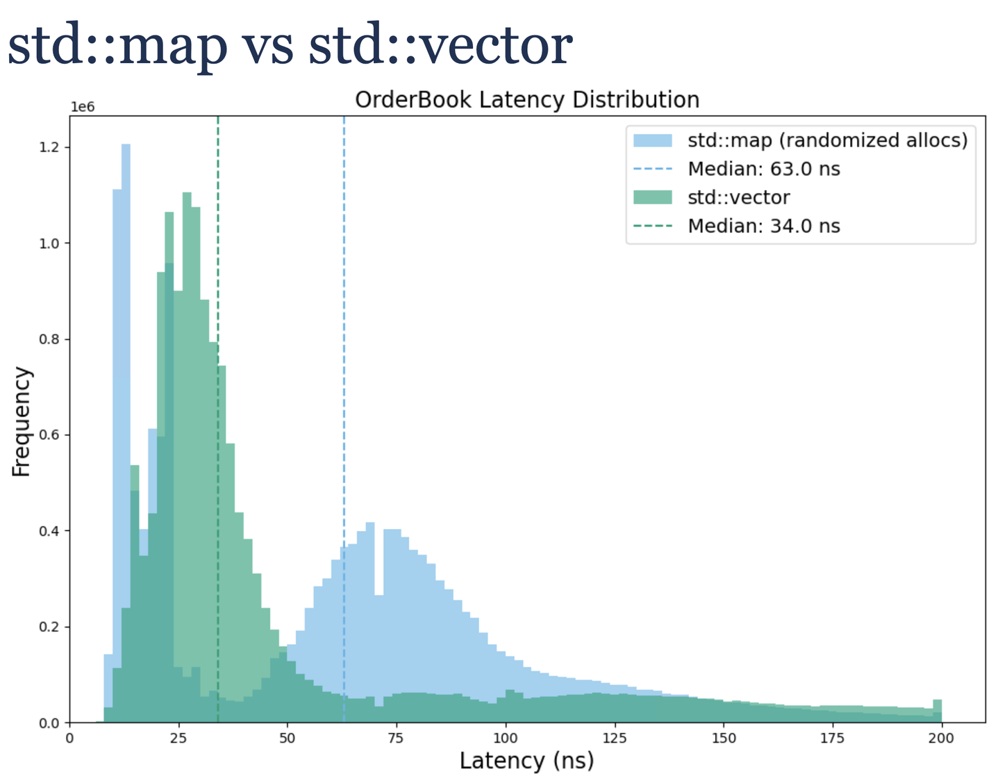

Cppcon24

### **Principle #2: “Understanding your problem (by looking at data!)”**

长尾的原因很简单，使用 `std::vector` 在插入和删除数据会移动数据。作者分析了业务数据特征，发现频繁操作的数据集中在 `std::vector` 的头部，导致移动数据成本较高。所以只需简单将反转数据存储顺序，就能减少数据移动成本，长尾延迟显著降低。

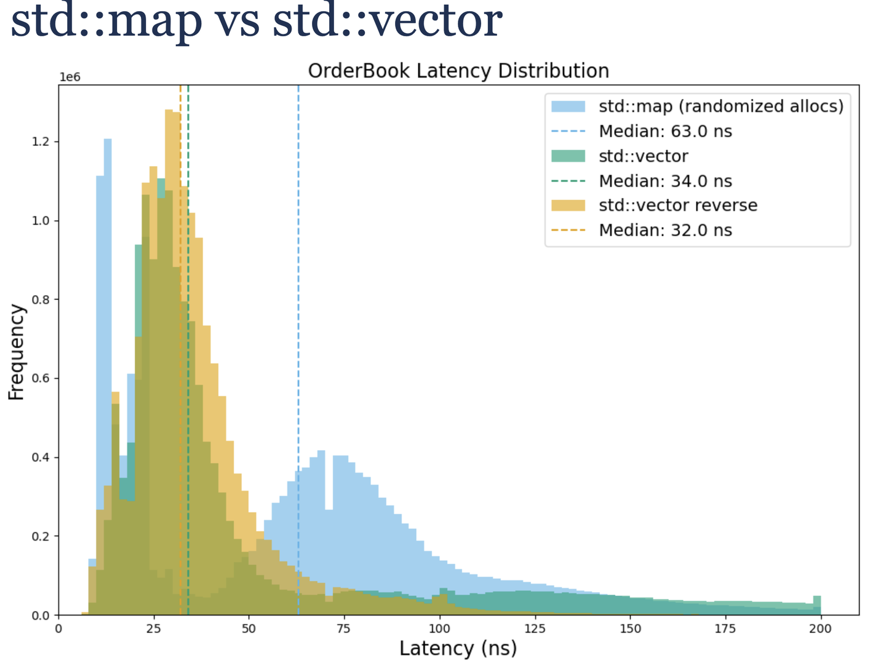

Cppcon24

### **Principle #3: “Hand tailored (specialized) algorithms are key to achieve [perf](https://zhida.zhihu.com/search?content_id=259964045&content_type=Article&match_order=1&q=perf&zhida_source=entity)ormance ”**

对上述实现运行 `perf` 看看有什么瓶颈。

这里又学到了一个技巧，使用 `fork` + `execlp` 在基准测试主要逻辑运行前启动 `perf`，能避免初始化等无关函数干扰测试。又是一个 `fork` 的骚操作！

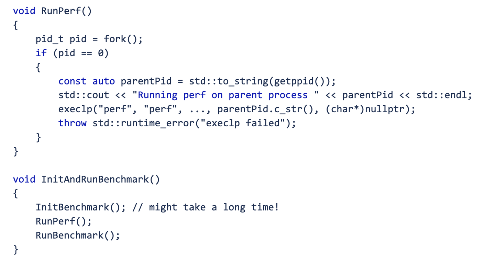

Cppcon24

通过 `perf` 发现该版本在调用 `std::lower_bound` 时有不少分支预测错误，为此，作者实现了一个无分支的二分查找，核心是使用算术运算和条件移动指令 (`CMOV`) 替代条件跳转（这里后面还得再仔细研究下）。性能得到进一步提升！

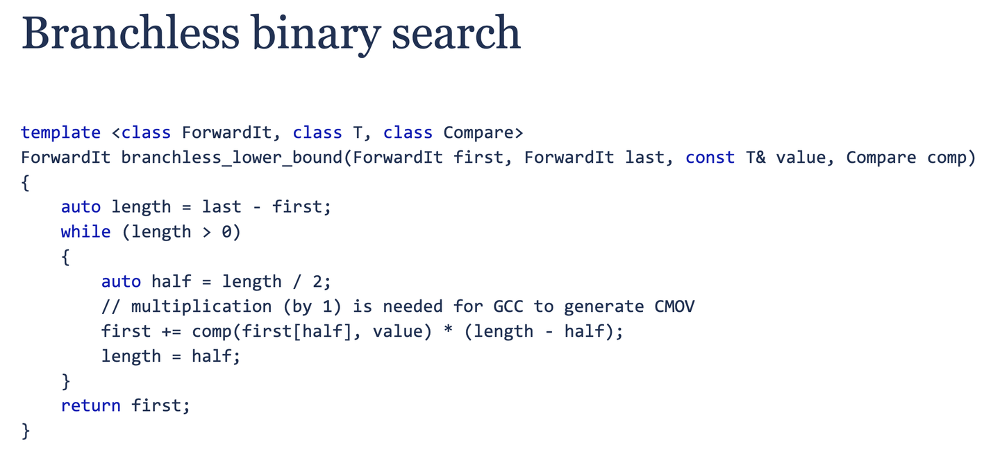

Cppcon24

这里也学习到一个 `libpapi` C++ 库的使用，可在代码中直接读取 `CPU` 硬件性能计数器，如指令数、周期数、缓存缺失、分支误预测等，方便量化优化效果。

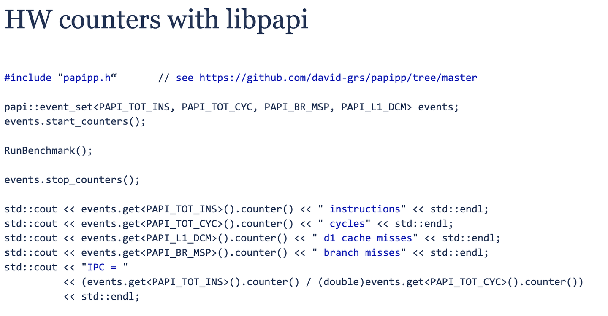

Cppcon24

### **Principle #4: “Simplicity is the ultimate sophistication” && Principle #5: “Mechanical sympathy”**

二分查找会随机访问内存，如果直接简单使用顺序查找会如何？作者测试发现性能更好。所以有时最简单的算法在特定数据和规模下可能是最优的。

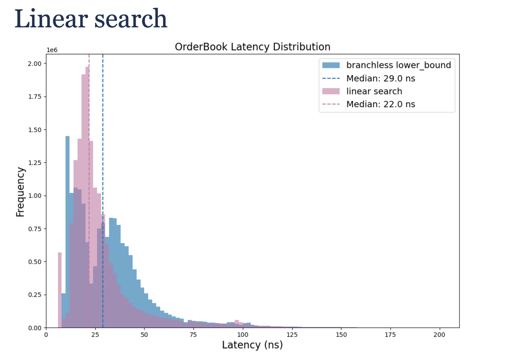

Cppcon24

数据缓存优化得差不多了，接着看看指令缓存。

使用 `[[likely]]` 属性提示编译器将高频分支的代码放在主执行路径附近，优化指令缓存局部性。

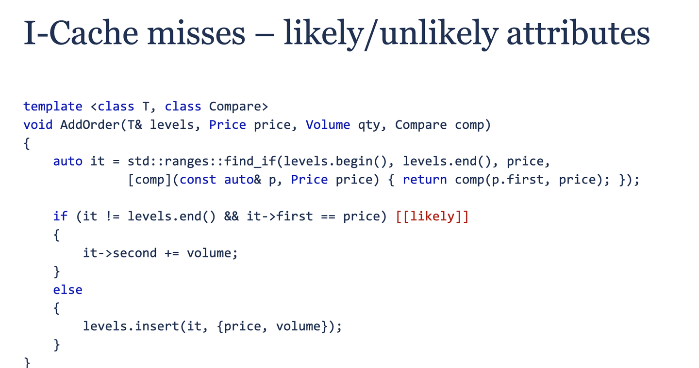

Cppcon24

使用 `[[unlikely]]`,`noinline`,`cold` 这些属性标记低频分支的代码。这些代码不会被内联到热点路径中，放得远远滴，避免它们污染指令缓存。真细啊！

Cppcon24

优先使用 `lambda`，比 `std::function` 性能更优，后者可能有类型擦除和间接调用开销。

原则里的 `Mechanical sympathy` 翻译叫“机械共情”。我的理解就是编写高性能代码必须站在机器的角度思考，深刻理解机器的运行方式，如各级缓存，流水性指令、分支预测等，充分利用好其特性。

### **Principle #6: “True efficiency is found not in the layers of complexity we add, but in the unnecessary layers we remove”**

作者接着开了另一个话题，主要讲网络和并发。

网络通信上，尽量绕过内核，减少数据拷贝和用户态内核态的切换。这里介绍了一些工具。

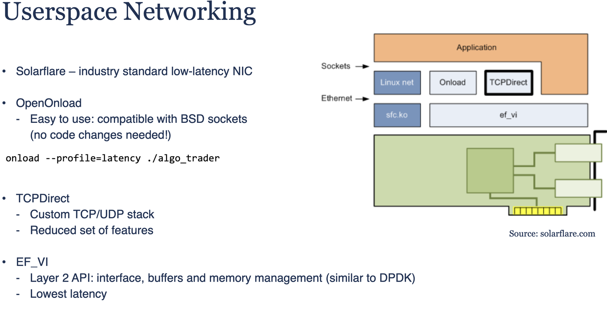

Cppcon24

如果多进程在同一机器通信，那就没必要使用 `Socket`，直接使用共享内存。使用共享内存的话，一般需要有个高并发的消息队列。消息队列种类很多，设计前需明确需求边界。

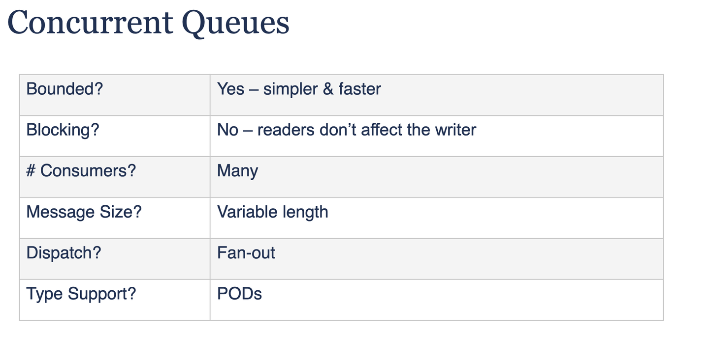

Cppcon24

### **Principle #7: “Choose the right tool for the right task”**

基于需求，作者设计了一个名为 `FastQueue` 的单生产者多消费者共享内存无锁队列，主要通过两个原子变量 `mReadCounter` 和 `mWriteCounter` 来实现无锁。（整个实现值得好好学习下）

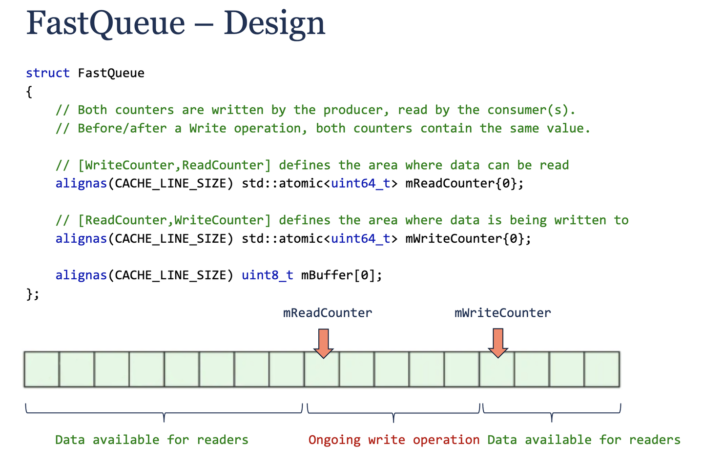

Cppcon24

这里值得学习是，这些变量都做了 `CACHE_LINE_SIZE` 内存对齐，避免 `False Sharing`。

`Writer` 和 `Reader` 的具体实现。

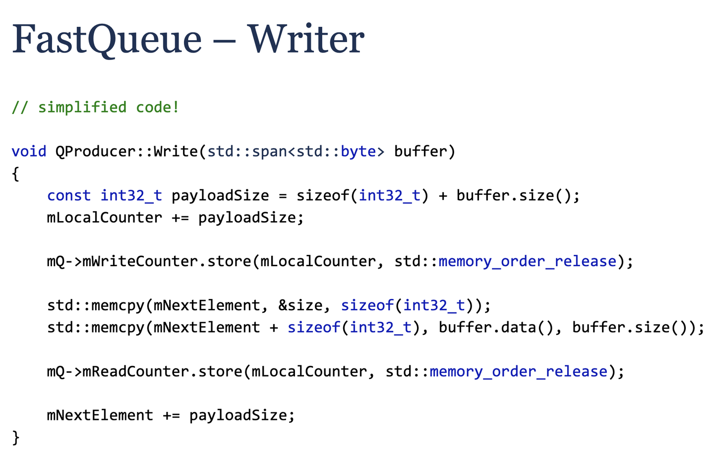

Cppcon24

Cppcon24

第一版实现的性能比不上一些开源的库。于是作者又做了几个优化。

第一，缓存写计数器 `mCachedWriteCounter`，只有写入累积超过阈值，才更新 `mWriteCounter`，避免频繁访问 `mWriteCounter` 原子变量。注意这里也做了内存对齐，可以学学如何使用位运算进行高效的对齐计算。

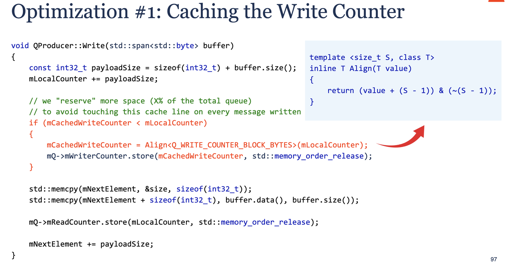

Cppcon24

第二，对每条消息做内存对齐。

Cppcon24

第三，缓存读计数器 `mCachedReadCounter`，避免频繁访问 `mReadCounter` 原子变量。

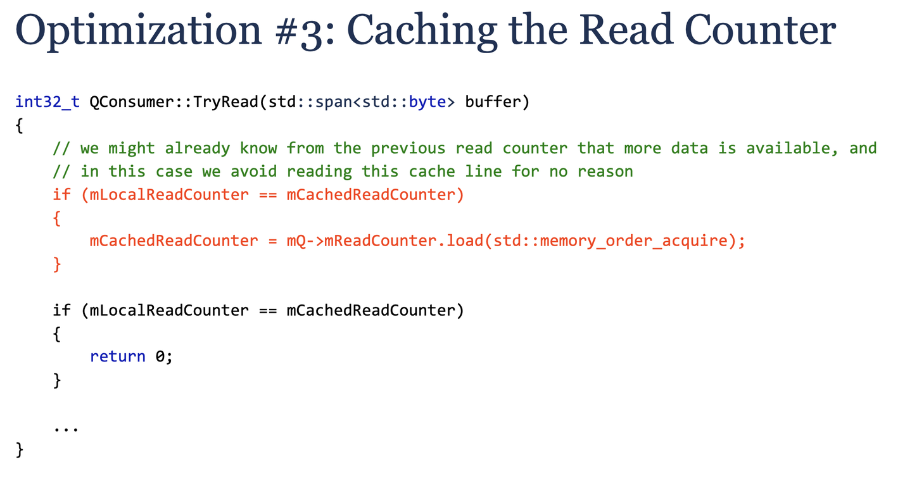

Cppcon24

优化后，`FastQueue` 实现性能优于一些著名开源实现。为什么作者一开始不直接使用开源库呢？因为作者贯彻“Simplicity is the ultimate sophistication”，觉得简单才是高效的，开源的都太“重”了。

最后作者还提出了 `api` 设计的零拷贝优化，重新设计接口，允许调用者直接在队列的内部缓冲区进行序列化，能避免了一次内存拷贝。

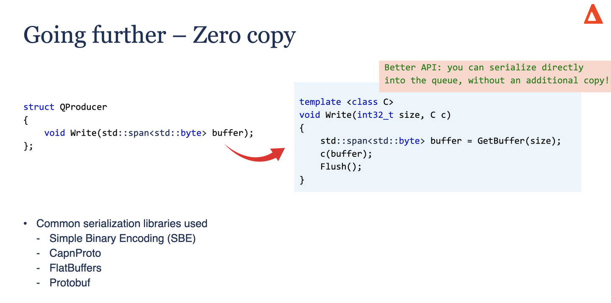

Cppcon24

### **Principle #8: “Being fast is good – staying fast is better”**

性能优化非一劳永逸，需持续监控。这里又学到一种新的统计函数信息的方式，就是 `Clang Xray Instrumentation`。

这是一种低开销的函数级追踪工具，可以动态地给函数入口和出口打桩。作者提到程序只需编译一次，在运行时选择是否开始追踪。如果不开启，打桩的代码只会运行空指令，开销极低。实用！牛逼！后面会研究一下。

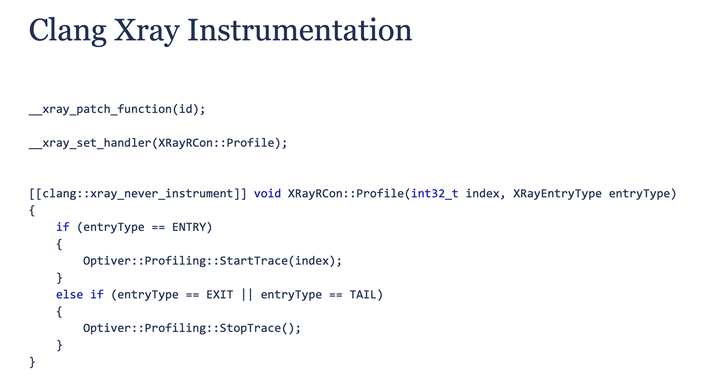

Cppcon24

### **Principle #9: “Thinking about the system as a whole” && Principle #10: “The performance of your code depends on your colleagues’ code as much as yours"**

作者通过一个随机访问内存的基准测试程序，展示了 `CPU` 多级缓存的容量效应和缓存竞争的问题：

- 当数据集能完全放入 `L1/L2 Cache` (私有) 时，单核与多核 (6 核) 的吞吐量几乎线性扩展。
- 当数据集增长到 `L3 Cache` (共享) 大小时，6 核并行时的总吞吐量显著下降，接近单核吞吐量。因为多个核在激烈争抢共享的 `L3 Cache`。

所以如果在同一台机器里，即使你的程序优化到极致，但是其他程序对 `L3 Cache` 滥用，也会拖慢你的程序。

Cppcon24

## **总结**

整个分享下来，学到不少东西，纳米级延迟优化真的很细！作者贯彻的原则就是尽量简单！less is more !

结合演讲和个人理解，提炼以下优化原则备忘：

- 基准测试尽量符合生产环境情况。
- 在性能优化前，分析好业务特性，数据分布。
- 在性能优化前，分析性能瓶颈，定位关键路径。
- 多考虑缓存的重要性，如数据缓存，指令缓存。做好数据结构的选择、数据内存对齐，原子变量的 `Cache Line` 对齐。
- 尝试在业务中减少使用 `node containers`，做好性能对比。
- 标准库和通用算法虽好，但在热点路径上，针对数据和场景尝试自己实现一些算法。
- 一些著名开源库功能丰富但可能臃肿。在明确边界的需求下，自研简洁高效的组件。
- 根据实际需求来明确设计边界。
- 简单设计和实现通常更易维护且性能更好。
- 移除非必要的抽象层和复杂性。
- 建立持续性能监控。
- 考虑整个系统乃至整机的资源共享和竞争。

这个演讲的视频 B 站有，推荐感兴趣的去看看。需要演讲稿的 `pdf` 童鞋欢迎来领取。