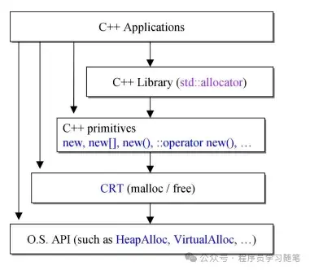

# C++内存管理简介

**0.简介**

本文主要介绍C++应用程序内存使用层级以及各层级之间的作用，着重介绍不同的内存分配重载和各层级的主要函数，后续再对各层详细介绍。

**1.整体介绍**

C++应用一次内存的请求涉及到的层级如下：

**2.[C++ primitives](https://zhida.zhihu.com/search?content_id=249160602&content_type=Article&match_order=1&q=C%2B%2B+primitives&zhida_source=entity)**

对于C++常见内存申请方式，对比如下

| 分配                                                         | 释放                                                         | 是否可重载 |
| ------------------------------------------------------------ | ------------------------------------------------------------ | ---------- |
| malloc                                                       | free                                                         | 不可       |
| new                                                          | delete                                                       | 不可       |
| ::[operator new](https://zhida.zhihu.com/search?content_id=249160602&content_type=Article&match_order=1&q=operator+new&zhida_source=entity) | ::[operator delete](https://zhida.zhihu.com/search?content_id=249160602&content_type=Article&match_order=1&q=operator+delete&zhida_source=entity) | 可         |
| [allocator](https://zhida.zhihu.com/search?content_id=249160602&content_type=Article&match_order=1&q=allocator&zhida_source=entity)::allocate | allocator::deallocate                                        | 可自由设计 |

**2.1** **new的执行流程（如A\* a = new A())**

1)第一步，创建一个A类型指针。

2)第二步，通过operator new(sizeof(A)) 来申请A大小的内存，即operator new调用malloc来获取内存

3)第三步，将获取到的void*指针通过static_cast方式转换为A类型指针，赋值给第一步声明的指针

4)第四步，调用构造函数来进行这块空间的初始化

**2.2 delete执行流程**

1)第一步，调用析构函数

2)第二步，使用operator delete释放内存，operator delete即调用了free

**2.3. new xx[] 执行流程**

调用多次构造函数，无法赋给初值，得到一个下方这样的内存空间，cookie记录大小等信息

**2.4 delete[] 执行流程**

执行三次析构和一次内存回收操作，三次析构顺序和创建顺序相反

说明：使用[new]创建，使用delete释放本身的空间并未造成内存泄漏（因为由cookie记录了该地址相关信息），但是只调用一次析构可能未经过析构的对象内含有一些指针造成泄漏。

**3. CRT(malloc/free)**

在程序运行时会调用malloc来分配堆空间，其实际是做了一次内存映射。根据申请的空间大小，会采用不提的方式来进行处理，如果申请的大小小于128k，会使用brk来分配，其brk本质上就是移动堆顶的位置来分配内存，在释放后并不会立刻归还给操作系统，而是缓存起来，重复使用，对于大于128k的空间申请，使用的是mmap来分配，也就是在文件映射段去找一块空闲内存分配出去。这两种方式优缺点如下：1）brk方式：

优点：减少缺页异常，提高内存访问效率

缺点：内存没有归还，频繁的申请和释放容易造成内存碎片

2）mmap方式：

优点：适合大块内存申请

缺点：容易造成大量缺页异常

**4.OS 堆管理API**

**4.1 windows**

window的主要函数如下:

1)VirtualAlloc

　　该函数的功能是在调用进程的虚地址空间,预定或者提交一部分页，如果用于内存分配的话,并且分配类型未指定MEM_RESET,则系统将自动设置为0。

2)GlobalAlloc 和 LocalAlloc

　　从全局堆中分配出内存供程序使用。都是 Windows 系统提供的内存分配函数, 他们的区别在于 16BIT 代码时代, 那时没有不同的进程内存空间, GlobalAlloc 是在全局的, 公用的远堆上分配; LocalAlloc 则在任务自己的近堆上分配. 在 Win32 平台下这两个函数是完全相同的, 都是在进程自己的内存空间中分配, Lock 之后的结果是普通指针(32位近指针)。

3）HeapAlloc

从堆上分配一块内存，且分配的内存是不可移动的（即如果没有连续的空间能满足分配的大小，程序不能将其他零散的空间利用起来，从而导致分配失败），该分配方法是从一指定地址开始分配，而不像GloabalAlloc是从全局堆上分配，这个有可能是全局，也有可能是局部。

**4.2 linux**

主要是brk和mmap见malloc分析