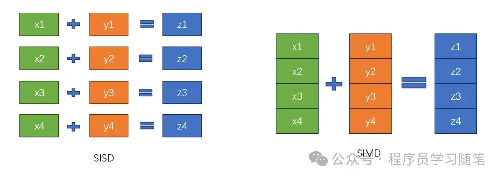
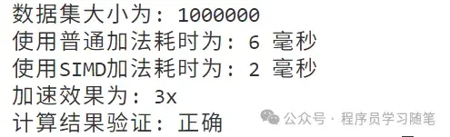

# 现代C++ ：使用SIMD 指令集实现高性能计算

## **0.简介**

提升效率的两种常见方式，一个是增大并发，一个是增大扇入扇出。在前面文章中介绍了多线程并发相关的内容，也就是增大并发常用的内容；本文将介绍的[SIMD](https://zhida.zhihu.com/search?content_id=259020195&content_type=Article&match_order=1&q=SIMD&zhida_source=entity)就和增大扇入扇出相关了，也就是一次处理更多的数据，增加数据级的并行。本文将从SIMD的概念，原理和使用方式对其进行介绍。

## **1.SIMD概念**

SIMD(Single Instruction Multiple Data，单指令多数据流)能够使用一条指令去执行多个数据运算操作，和之前常见的[SISD](https://zhida.zhihu.com/search?content_id=259020195&content_type=Article&match_order=1&q=SISD&zhida_source=entity)（Single Instruction Single Data，单指令单数据流）相比，增大了一次运算的数据量。




接下来可以了解一下SIMD的发展流程：

1）1996年英特尔首次推出[MMX](https://zhida.zhihu.com/search?content_id=259020195&content_type=Article&match_order=1&q=MMX&zhida_source=entity)（多媒体扩展）指令集，以64位寄存器作为载体，让CPU可以同时处理多组整数数据。

2）1999年奔腾III搭载的[SSE](https://zhida.zhihu.com/search?content_id=259020195&content_type=Article&match_order=1&q=SSE&zhida_source=entity)将寄存器位宽范围128位，同时对浮点数的并行处理能力提供了支持，此后SSE2、SSE3等迭代版本持续增加了指令集。

3）2008 年，英特尔与 AMD 联合提出 AVX（高级向量扩展）架构，2011 年随 Sandy Bridge 和 Bulldozer 架构落地，将寄存器位宽拓展至 256 位，VEX 指令前缀设计让向量操作更灵活。2013 年 Haswell 处理器支持的 AVX2 进一步强化整型数据处理能力，而同年萌芽的 AVX-512 则在 2016 年于 Xeon Phi 200 处理器中实现 512 位寄存器突破，成为数据中心高密度计算的核心加速引擎。

其对于的寄存器和位宽如下：

| 指令集 | 寄存器     | 浮点位宽 | 整型位宽 |
| ------ | ---------- | -------- | -------- |
| MMX    | MM0~MM7    |          | 64       |
| SSE    | XMM0~XMM7  | 128      |          |
| SSE2   | XMM0~XMM15 | 128      | 128      |
| AVX    | YMM0~YMM15 | 256      | 128      |
| AVX2   | YMM0~YMM15 | 256      | 256      |


## **2.SIMD原理**

SIMD本质上是通过特殊的指令集和寄存器，把多个数据打包到一起，在一个CPU时钟周期内执行同一个操作，其基本的工作模式就是利用更多位数的寄存器来同时处理更多数据，基本的向量寄存器和数据布局如下：

1）寄存器位宽：如 SSE（128 位）、AVX（256/512 位），决定一次可处理的数据量。

2）数据打包：将多个相同类型的数据（如整数、浮点数）连续的存储，形成一个向量。

## **3.SIMD使用**

### **3.1 [内联汇编](https://zhida.zhihu.com/search?content_id=259020195&content_type=Article&match_order=1&q=内联汇编&zhida_source=entity)**

内联汇编在不同编译器有差异，此处使用[GCC](https://zhida.zhihu.com/search?content_id=259020195&content_type=Article&match_order=1&q=GCC&zhida_source=entity)风格实现的SSE浮点加法来作为演示：

```text
#include <stdio.h>
#include <stdlib.h>    
int main()
{
    float left[4] = { 3,6,8,10 };
    float right[4] = { 4,5,5,6 };
    float res[4];
    __asm__ __volatile__( 
        "movups %1,%%xmm0\n\t"            // 将left内存的128位数据放入xmm0寄存器
        "movups %2,%%xmm1\n\t"            // 将right内存的128位数据放入xmm0寄存器
        "mulps  %%xmm1,%%xmm0\n\t"        // 执行xmm0 * xmm1，结果放入 xmm0
        "movups %%xmm0,%0\n\t"            // 将xmm0的数据放入res所指内存
        :"=m"(res)                        //输出
        :"m"(left),"m"(right)             //输入
    );
    for(int i=0;i<4;i++)
      printf("%.2f\n",res[i]);
    return 0;
}
```

可以简单来看一下各个指令，主要用到的movups、mulps。

1）movups：move表示移动；u表示unaligned，内存未对齐，如果是a表示aligned，内存已对齐；p的话是packed，表示打包数据，对128位数据操作，如果是s，表示scalar，仅对第一个数据操作；s表示signal precision floating point，表示单精度浮点数，d表示双精度浮点数。

2）mulps：mul表示乘法；p,s和moveups中含义一致。

相关内联汇编文档可以参考：

1）GCC 内联汇编文档：

[https://gcc.gnu.org/onlinedocs/gcc/Using-Assembly-Language-with-C.html](https://link.zhihu.com/?target=https%3A//gcc.gnu.org/onlinedocs/gcc/Using-Assembly-Language-with-C.html)

2）[MSVC](https://zhida.zhihu.com/search?content_id=259020195&content_type=Article&match_order=1&q=MSVC&zhida_source=entity) 内联汇编指南：

[https://docs.microsoft.com/en-us/cpp/assembler/inline/inline-assembler?view=msvc-170](https://link.zhihu.com/?target=https%3A//docs.microsoft.com/en-us/cpp/assembler/inline/inline-assembler%3Fview%3Dmsvc-170)

### **3.2 使用Intrinsics函数**

Intrinsics 函数由编译器厂商（如 Intel、GCC）提供，通常以`_mm_`或`_mm256_`开头，直接映射到特定 SIMD 指令（如`_mm_add_ps`对应 SSE 的浮点加法指令），来看一个和上面内联汇编一样的GCC中的写法：

```text
#include <stdio.h>
#include <stdlib.h>
#include <emmintrin.h>
int main()
{
    float left[4] = { 3,6,8,10};    
    float right[4] = { 4,5,5,6};    
    float res[4];    
    __m128 A = _mm_loadu_ps(left);    
    __m128 B = _mm_loadu_ps(right);    
    __m128 RES = _mm_mul_ps(A, B);    
    _mm_storeu_ps(res, RES);    
    for(int i=0;i<4;i++)    
        printf("%.2f\n",res[i]);
    return 0;
}
```

_mm，表示这是一个64位/128位的指令，_mm256和_mm512则表示是256位或是512位的指令;_loadu，表示unaligen的load指令，不带u后缀的为aligen;_ps，同上面汇编指令。

1）Intel 指令集参考:

[https://www.intel.com/content/www/us/en/docs/intrinsics-guide/index.html](https://link.zhihu.com/?target=https%3A//www.intel.com/content/www/us/en/docs/intrinsics-guide/index.html)

### **3.3 编译器支持，自动的代码优化**

现代编译器（如 GCC、[Clang](https://zhida.zhihu.com/search?content_id=259020195&content_type=Article&match_order=1&q=Clang&zhida_source=entity)、MSVC）支持自动向量化，通过`-O3`等优化级别开启。例如：

- GCC：使用`-march=native`参数让编译器自动选择最优的 SIMD 指令集。
- Clang：通过`-fvectorize`强制启用向量化，`-fvectorizer-verbose=1`查看向量化日志。
- 自动优化效果不佳可以采用手动优化

**3.4 性能测试**

```text
#include <iostream>
#include <chrono>
#include <vector>
#include <cstdlib>
#include <xmmintrin.h> // 引入SSE指令集头文件
using namespace std;
using namespace std::chrono;
// 普通加法函数
void normalAdd(const vector<float>& a, const vector<float>& b, vector<float>& result) {
    for (size_t i = 0; i < a.size(); ++i) {
        result[i] = a[i] + b[i];
    }
}
// 使用SSE指令集的SIMD优化加法函数
void simdAdd(const vector<float>& a, const vector<float>& b, vector<float>& result) {
    size_t i = 0;
    const size_t sseWidth = 4; // SSE可以同时处理4个单精度浮点数
    
    // 按4个元素一组进行SIMD计算
    for (; i + sseWidth <= a.size(); i += sseWidth) {
        __m128 va = _mm_loadu_ps(&a[i]);
        __m128 vb = _mm_loadu_ps(&b[i]);
        __m128 vresult = _mm_add_ps(va, vb);
        _mm_storeu_ps(&result[i], vresult);
    }
    
    // 处理剩余元素
    for (; i < a.size(); ++i) {
        result[i] = a[i] + b[i];
    }
}
// 验证结果正确性
bool verifyResult(const vector<float>& result, const vector<float>& expected) {
    for (size_t i = 0; i < result.size(); ++i) {
        if (abs(result[i] - expected[i]) > 1e-6) {
            return false;
        }
    }
    return true;
}
int main() {
    const size_t size = 1000000; // 100万个元素
    
    // 初始化向量
    vector<float> a(size);
    vector<float> b(size);
    vector<float> result_normal(size);
    vector<float> result_simd(size);
    
    // 使用固定种子确保可重复性
    srand(42);
    
    // 填充随机数据
    for (size_t i = 0; i < size; ++i) {
        a[i] = static_cast<float>(rand()) / RAND_MAX;
        b[i] = static_cast<float>(rand()) / RAND_MAX;
    }
    
    // 测试普通加法
    auto start_normal = high_resolution_clock::now();
    normalAdd(a, b, result_normal);
    auto end_normal = high_resolution_clock::now();
    auto duration_normal = duration_cast<milliseconds>(end_normal - start_normal).count();
    
    // 测试SIMD加法
    auto start_simd = high_resolution_clock::now();
    simdAdd(a, b, result_simd);
    auto end_simd = high_resolution_clock::now();
    auto duration_simd = duration_cast<milliseconds>(end_simd - start_simd).count();
    
    // 验证结果
    bool isCorrect = verifyResult(result_simd, result_normal);
    
    // 输出结果
    cout << "数据集大小为: " << size << endl;
    cout << "使用普通加法耗时为: " << duration_normal << " 毫秒" << endl;
    cout << "使用SIMD加法耗时为: " << duration_simd << " 毫秒" << endl;
    cout << "加速效果为: " << static_cast<double>(duration_normal) / duration_simd << "x" << endl;
    cout << "计算结果验证: " << (isCorrect ? "正确" : "错误") << endl;
    
    return 0;
}    
```

结果如下：




