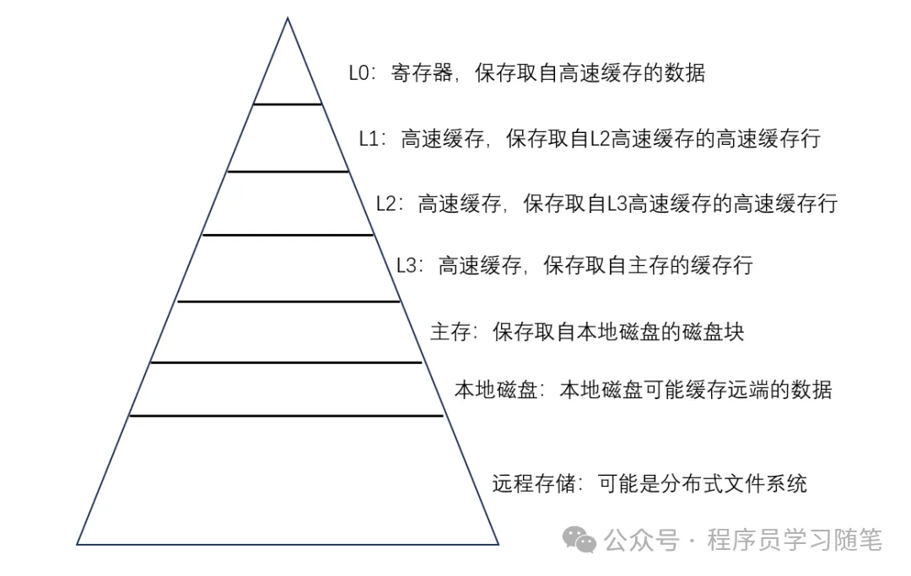
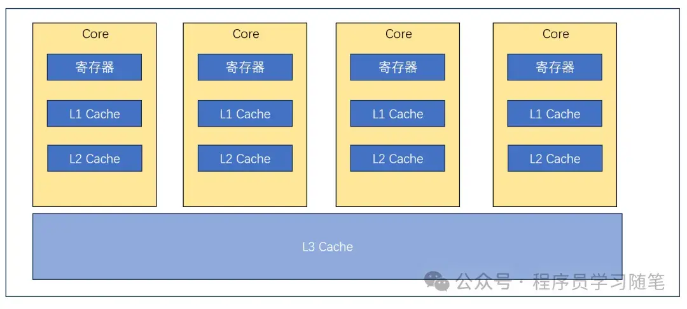
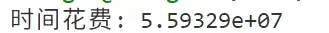

# CPU缓存行(Cache Line)详解：从原理到优化实践

## **0.简介**

在现代的计算机体系结构中，CPU的计算速度是远远高于内存访问速度的，因此，对于缓存(Cache)对于系统性能来说至关重要。[Cache Line](https://zhida.zhihu.com/search?content_id=259609765&content_type=Article&match_order=1&q=Cache+Line&zhida_source=entity)是缓存关联的最小单位，本文将对Cache Line的概念，命中和未命中缓存的影响以及如何优化数据布局以提高缓存利用率。

## **1.Cache Line介绍**

### **1.1 计算机存储结构**

要了解Cache Line，首先需要知道计算机存储的层次，这个层次结构对于性能和成本的平衡（很多项目和设计都是取舍的结果），可以从下图来看，越上层速度越快，价格也就越高，其中L1,L2,L3 Cache都是在CPU内部。



### **1.2 Cache Line读取流程**

读取流程整体来说就是从上往下依次检查是否存在，存在的话就直接使用，不存在就去下一级存储读取，其中内存到Cache的最小传输单位就是Cache Line，对于现代CPU而言，一般是64字节，也就是说，即使只取一个字节数据也要映射64字节到cache，这体现了局部性的原理，当访问一个地址时，这个地址附近的内容近期大概率也会被访问到。

### **1.3 Cache Line一致性**

现代CPU一般都有多个Core，每个Core都可以支持一个并发（超线程可以支持两个），每个Core都有自己的L1，L2缓存，而共享L3缓存，其结构如下图，这种场景下就可能面临Cache Line不一致的问题，常见的解决方法有[MESI协议](https://zhida.zhihu.com/search?content_id=259609765&content_type=Article&match_order=1&q=MESI协议&zhida_source=entity)，其是经典的状态机模式，可以分为以下四个状态：

1）Modified（已修改）：缓存行数据被修改且未同步到主内存，此状态下其他核心无法直接访问该数据。

2）Exclusive（独占）：缓存行数据与主内存一致，且未被其他核心缓存，可直接修改为 Modified 状态。

3）Shared（共享）：缓存行数据与主内存一致，且可被多个核心同时缓存，修改前需先获取独占权限。

4）Invalid（无效）：缓存行数据已失效，需从主内存或其他核心缓存中重新加载。

该协议通过状态转换和总线监听机制，确保多核心环境下缓存数据的一致性。例如，当核心 A 修改 Shared 状态的缓存行时，会通过总线通知其他核心将对应数据标记为 Invalid，避免脏读问题。



## **2.Cache Line对C++影响**

Cache Line的性能优化可以从局部性原理考虑：时间局部性（短时间内重复访问相同数据）和空间局部性（顺序访问相邻内存数据）。合理利用这些特性可以显著提升缓存命中率。

```text
// 低效：列优先访问（Cache Miss率高）
for (int j = 0; j < N; ++j)
    for (int i = 0; i < M; ++i)
        sum += matrix[i][j];

// 高效：行优先访问（利用Cache Line预取）
for (int i = 0; i < M; ++i)
    for (int j = 0; j < N; ++j)
        sum += matrix[i][j];
```

第二个可能的影响就是[伪共享](https://zhida.zhihu.com/search?content_id=259609765&content_type=Article&match_order=1&q=伪共享&zhida_source=entity)问题，我们知道Cache Line最小是64字节，那么就有可能读到其他线程使用的变量，因为使用MESI，所以这两个数据的修改都需要变更对应的同一个Cache Line为Exclusive状态，降低了并发。

```text
struct Data {
    int x; // 线程1频繁修改
    int y; // 线程2频繁修改
    // 可能位于同一Cache Line，导致伪共享
};
// 优化：填充或对齐，使x和y位于不同Cache Line
struct AlignedData {
    alignas(64) int x; // 64字节对齐
    alignas(64) int y;
};
```

## **3.Cache Line利用率优化**

### **3.1 [结构体对齐](https://zhida.zhihu.com/search?content_id=259609765&content_type=Article&match_order=1&q=结构体对齐&zhida_source=entity)**

结构体对齐可以使用 `alignas` 或编译器扩展（如 `__attribute__((aligned(64)))`）确保关键数据独占Cache Line。

### **3.2 [数据布局优化](https://zhida.zhihu.com/search?content_id=259609765&content_type=Article&match_order=1&q=数据布局优化&zhida_source=entity)**

数据布局的优化可以考虑结构体紧凑化，提高缓存利用率；也可以进行冷热数据的分离，增强预读的效果。

### **3.3 避免伪共享**

伪共享我们在前面已经说过，可以通过填充字节或者通过线程局部存储来避免。

### **3.4 Cache[性能检测工具](https://zhida.zhihu.com/search?content_id=259609765&content_type=Article&match_order=1&q=性能检测工具&zhida_source=entity)**

Cache Miss的分析可以使用perf来分析，后面会专门写一篇文章介绍这个工具，在性能分析时非常常用，使用方式如下：

```text
perf stat -e cache-misses
```

## **4.实际优化例子**

在很多大型项目中，像PG，ClickHouse等数据库项目中都有很多实际应用，下面来做一个性能测试。

```text
#include <iostream>
#include <pthread.h>
#include <chrono>
#define NUM 100000000
struct Data
{
    Data() : a(0), b(0) {}
    
    int a;
    int b;
};
void* T1(void* args)
{
    Data* item = (Data*)args;
    for (int i = 0; i < NUM; ++i)
    {
        item->a += 1;
    }
    return NULL;
}
void* T2(void* args)
{
    Data* item = (Data*)args;
    for (int i = 0; i < NUM; ++i)
    {
        item->b += 1;
    }
    return NULL;
}
int main()
{
    pthread_t t1, t2;
    Data item;
    const auto& begin = std::chrono::high_resolution_clock::now();
 
    pthread_create(&t1, NULL, T1, &item);
    pthread_create(&t2, NULL, T2, &item);
    pthread_join(t1, NULL);
    pthread_join(t2, NULL);
    const auto& end = std::chrono::high_resolution_clock::now();
    double cost = std::chrono::duration_cast<std::chrono::nanoseconds>(end - begin).count();
    std::cout << "时间花费: " << cost << std::endl;
    return 0;
}
```

上面程序是可能存在伪共享的，其执行结果如下：


如果将上面Data结构改为如下：

```text
struct Data
{
    Data() : a(0), b(0) {}
    
    int a;
    int64_t align[8];
    int b;
};
```

时间消耗如下：





该优化手段可以根据实际需要使用，提供一种优化思路。