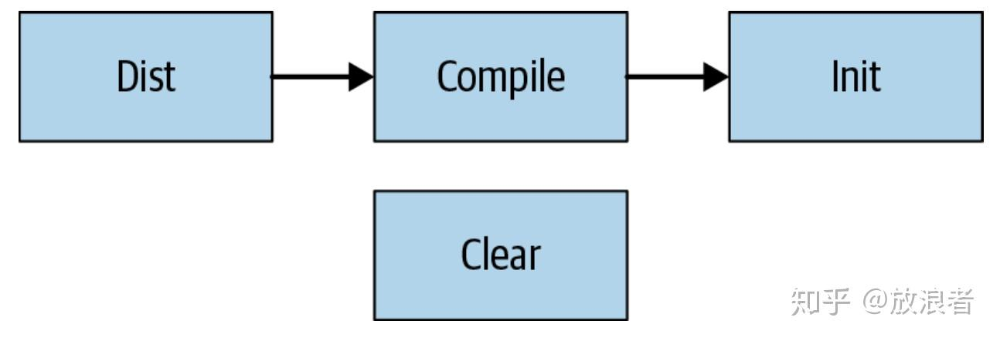

# 传统构建系统的问题

国庆无事，花了一天时间看了看bazel相关的内容（主要是看google谈software engineering那本书，动手其实很简单，后面两部分讲）。也是因为最近工作需要，可能会接触相关事宜，动手做做总是好的。

过去在Uber的时候用过Buck，当时作为应用开发者也没咋关心这些Build System怎么运作怎么玩，反正就是修改代码文件时把对应的配置文件改改，具体怎么设置的完全不关心。现在有时间来看一看Bazel也挺有趣。

下面进入正文，本文分四部分：传统构建系统的问题，Bazel的来龙去脉，用Bazel构建简单的Android Demo，用remote server作为构建缓存。其中最重要其实是第一二部分讲原理，后面的demo无非是把官方demo修改一下用于验证一些概念。

Let's begin (下文译自Software Engineering at Google一书）

------

如果你问 Google工程师最喜欢google的什么（除了免费食品），很可能他们的答案会让你很惊讶：大家都爱Google的构建系统(Build System)。Google对于他自己的构建系统，是投入了非常大的精力，从无到有这样建立起来的，其目标是保证工程师能够快速可靠地构建他们的代码。而这个构建系统中的核心组件Blaze，因为实在是很优秀，所以被离开Google的工程师又重新实现了好几次。有鉴于此，在2015年Google开源了他们内部的Blaze工具，并重新命名为Bazel.

## 构建系统的目标(Purpose of a Build System)

基本上，所有构建系统都又一个很直接的目标：把程序员写的代码转变成可执行二进制文件。一个出色的构建系统通常会针对两个方面进行优化：

- 速度(Fast)

程序员应该只需要输入一个简单命令就能运行整个构建过程，并获得所需要的二进制文件，这个过程通常期望只需要几秒钟（译者：本人对此表示疑惑。。。）

- 正确性(Correct)

程序员每次在任何机器上进行构建时，所获的结果应该一致（假设输入完全一样）


很多陈旧的构建爱你工具试图在以上两点中找到平衡，从而会采用一些捷径来处理，然而这常常会导致一些不可靠的构建结果。Bazel的主要目标就是避免去对这两点平衡取舍，从架构设计上去确保代码构建既快又稳定。

构建系统并不仅仅被人类所阅读，他们也是机器自动构建的基础，而这个构建则包括了从测试期间到产品发布多个阶段的构建。实际上google的绝大部分构建工作都是机器自动触发，而不是程序员去控制，而gogole内部几乎所有的开发工具也都和构建系统存在某些联系。下面举一些例子来体现google自动构建系统的优越性。

- 代码无需人工干预即可构建、测试并发布到生产环境。不同的团队可以以不同的节奏来完成这些工作，有些团队是每周发布，有些是每日发布，而还有些则是一旦创建并验证了新的build后就立即发布。
- 程序员的代码修改在提交到code review的时候能够被自动测试，从而帮助reviewer和提交者都能立刻看到构建测试过程是否暴露了什么问题。
- 代码在merge到分支之前能够被立刻再次测试，因此要提交破坏性的代码是困难的事情。
- 底层库开发者能够对整个代码库测试他们的代码修改，确保修改是安全的。
- 程序员能够一次创建大范围修改(Large Scale Changes, LSCs)，对上万行代码进行变动，并确保安全的提交和测试。

以上这些操作之所以能够做到，全靠google对构建系统的投入。尽管从规模来说，google的情况比较特殊，但任何规模的公司实际上都能从中意识到一个现代构建系统所带来的好处。下面我们来谈google是如何思考“现代构建系统”并如何使用的。

## 没有构建系统会怎样？(What Happens Without a Build System)

构建系统允许你扩大你的开发工作(Build systems allow your development to scale)。下面我们来先谈谈没有合适的构建环境所带来的问题：

**但我需要的只是一个编译器(But All I Need Is a Compiler!)**

对构建系统的需求也许一开始并不明显。毕竟，对于大部分人来说，一开始学习编程的时候并没有用过什么构建系统---我们很可能只是启动类似gcc或者javac这样的命令行工具而已，或者在一个集成开发环境(IDE)点击一下按钮。而只要我们所有的代码都在一个目录下，用一个 javac *.java 的命令就足够了。

这个命令告诉Java编译器把当前目录下所有java代码作为输入，然后转变为一个二进制class文件。在最简单的场景下，这就够了。

然而随着我们的代码增长，情况会越来越复杂。javac很聪明，它可能查看当前目录下的所有子目录，找到我们需要import的所有相关代码。但是它没法找到存储在其他地方的代码（例如被几个项目共享的库）。另外，他也只知道如何构建java代码，而大型系统通常会涉及用不同语言编写的不同部分，这意味着并不存在一种针对单一语言的编译器能够构建整个系统。

一旦我们开始处理不同语言或者多个模块的代码时，构建代码就不再是一个一步到位的过程。我们现在需要思考代码的依赖关系，并如何把这些部分按合理顺序构建，因此也许会对每一部分都使用不同的工具来处理。如果我们修改了依赖关系，那么部分二进制文件就发生了改变，从而需要重复整个过程。即便对一个中等规模的项目，这个过程很快就会变得琐碎而容易出错。

编译器也不知道如何处理外部依赖，例如第三方的JAR文件等等。在没有构建系统情况下，我们会去直接下载一个包，并放在例如lib之类的文件夹下，再调整编辑器的配置来读取该文件。时间变成之后，我们很容易忘记该文件夹下到底放了些什么包，以及从何而来，也不知道到底还在使用没有。同时在发布新版本时对这些包进行更新维护也成了一种挑战。

**脚本能救我们吗？(Shell Scripts to the Rescue)**

假设你的一个小项目非常简单，你用编译器就能处理，然后慢慢地你遇到上述一些问题。你可能仍然觉得没必要搞一个构建系统，只需要写一些简单的脚本文件就能自动处理这些琐碎的工作。这的确可以帮助一段时间，但很快你会碰到更多问题：

事情会变得非常琐碎。随着你的系统扩大日益复杂，你会花大把时间来调整你的构建脚本。对脚本进行调试将变得很痛苦，然后你会加上越来越多的hack方式，导致最后无法维护。

为了确保你不会用到一些过时的库，你会让你的构建脚本每次都把所有依赖都按顺序构建。你也想过加一些逻辑来判断哪些部分不需要重复构建，但这对于一个脚本工具来说就过于复杂而且易错。或者你又想每次能定义哪些部分才需要重新构建，但是这样你又回到了需要手工维护的起点。

假设终于能发布了，这时候你需要搞清楚最终产品环境的构建需要对你的jar命令提供哪些参数，以及具体如何上传发布。同时你还要构建并发布对应的文档，通知相关用户。。。这可能又需要写一个新的脚本。

你的硬盘挂掉了！这样你有需要重新创建整个系统。即便你把所有源代码和相关源文件放到了git，但是相关的第三方库、相关的编译环境和工具，你能确保和以前一致吗？想想你要花多少时间去重新搭建环境。

假设你的项目非常成功，你开始招入更多的程序员----现在你需要对每个程序员加入时都帮助他们去进行同样的开发环境配置。而每个人的系统多少都存在细微差异，在某些机器上运行正常的脚本在另外的机器不一定正常，而为了这些差异则需要投入大量时间去调整。

你决定需要自动化你的构建流程。理论上，这只是设置一台机器然后每天晚上定时构建就可以。你仍然需要完成痛苦的环境配置，同时你也没有人来帮你发现构建中出现的问题。因此每天早上你都发现昨晚的构建工作失败了，然后你花大把时间发现失败原因是一个开发者的某个修改在他自己机器上正常，但在自动构建的机器上则有问题。每次这都是一个简单的修复，但这种问题会频繁发生，最后你的大把时间就花在对这些琐碎事情的排查和修复上。

构建会随着项目扩大越来越慢。最终有一天你在等待构建完成的时候，会盯着你旁边休假同事的空闲电脑，思考着是否有办法能利用这些闲散的计算资源。

实际上这是进入了经典的规模化问题(problem of scale)。对一个工作了一两周，只在几百行代码项目中工作的程序员（实际上也是美国刚毕业大学生的情况）来说，一个编译器就足够了。但当你要协调多个开发者的多个机器时，就算最完美的构建脚本也是不够的，因为它很快就会变得无法处理不同机器上的细微差异。这样，这种简单的手段就无法继续下去，而必须考虑一个真正的构建系统。

## 现代构建系统(Modern Build Systems)

幸运的是，上面所有这些问题都已经被当前多个通用构建系统(如ant, maven, gradle等等)解决过。基本上，这些构建系统和前面说的脚本方式没有太大差别：他们在底层运行同样的编译命令，而你需要理解这些底层工具究竟如何工作的。只是这些构建工具已经经过了多年的发展，比自己开发的脚本要稳定灵活的多。

**一切都是依赖关系的问题(It's All About Dependencies)**

在前面讨论的各种问题中，有一个问题被反复地提及：管理你自己的代码非常简单，但是管理它的各种依赖则要困难得多。我们这里提到的“依赖”包括很多形式，例如：

- 对任务的依赖（e.g. 在我完成发布前把文档发布出去）
- 对制品(artifact)的依赖(e.g. 我需要这个计算机视觉开发库的最新版本来构建我的代码)

有时候你对你自己代码库的其他部分有依赖，有时候你又会对其他团队负责的代码或数据有依赖。但是无论哪种形式，“我需要在做这件事情之前完成另一件事“这种问题都会在开发过程中反复发生，而管理依赖关系恐怕是一个构建系统最基础的工作。

**基于任务的构建系统(Task-Based Build System)**

我们在前一节讨论的脚本是一种最初级的基于任务的构建系统。在这种系统里，最基本的工作单位是“任务“。每一个任务都是一个能执行任何逻辑的脚本，而每个任务都会把其它一些任务作为依赖(dependencies)，而要求必须在它们自己之前运行。今天，大部分广为人知的构建系统都是基于任务的，例如Ant，Maven，Gradle，Grunt及Rake等等。

和脚本不同的是，大部分现代构建系统要求程序员创建buildfiles来描述如何完成构建。例如下面这个来自于Ant手册的示例：

```text
<project name="MyProject" default="dist" basedir="."> <description>
simple example build file
</description>
<!-- set global properties for this build --> <property name="src" location="src"/> <property name="build" location="build"/> <property name="dist" location="dist"/>
<target name="init">
<!-- Create the time stamp --> <tstamp/>
 
<!-- Create the build directory structure used by compile -->
<mkdir dir="${build}"/> </target>
<target name="compile" depends="init" description="compile the source">
<!-- Compile the Java code from ${src} into ${build} -->
<javac srcdir="${src}" destdir="${build}"/> </target>
<target name="dist" depends="compile" description="generate the distribution">
<!-- Create the distribution directory --> <mkdir dir="${dist}/lib"/>
<!-- Put everything in ${build} into the MyProject- ${DSTAMP}.jar file -->
<jar jarfile="${dist}/lib/MyProject-${DSTAMP}.jar" basedir="${build}"/>
</target>
<target name="clean" description="clean up">

<!-- Delete the ${build} and ${dist} directory trees --> <delete dir="${build}"/>
<delete dir="${dist}"/>
</target> </project>
```

上面这个buildfile用xml编写，对于构建相关任务定义了一些简单的metadata(例如<target>之类的tag)。每个任务都会执行一系列Ant定义的命令，包括创建/删除目录，执行javac，创建JAR文件等等。这一系列命令能够靠用户提供的插件来进行扩展，从而实际上能实现任何逻辑。同时，每个任务都能通过depends属性来定义他所依赖的其它任务。这些依赖就形成了一个无环图(acyclic graph)。



用户通过对Ants的命令行工具设计任务来完成构建。例如，当用户输入ant dist的时候，Ant会执行下面一系列工作：

1. 读入build.xml文件，对其解析形成上图的数据结构
2. 查看命名为dist的任务，然后发现它依赖于另一个名为compile的任务
3. 查看compile任务，并发现它又依赖于任务init
4. 查看任务init，发现它没有依赖于其它任务
5. 执行init任务下定义的命令
6. 执行compile任务下定义的命令
7. 执行dist任务所定义的命令

实际上，Ant运行dist任务所执行的命令，等价于下面这个脚本

```text
./createTimestamp.sh
mkdir build/
javac src/* -d build/
mkdir -p dist/lib/
jar cf dist/lib/MyProject-$(date --iso-8601).jar build/*
```

当我们把各种语法糖剥离后，buildfile和构建脚本其实也没多大差别。但是我们通过buildfile获得了很多好处。我们能够在其它目录下创建buildfile并把它们链接到一起。我们能够更轻松地添加基于现有任务的新任务。我们只需要把任务名字传给ant命令工具，它就能自动确定要执行的所有工作。

Ant已经是一个很老的软件，最早发布于2000--它并不是很多人认为的“现代“构建系统！其他的工具，如Maven和Gradle，在后来不断对Ant进行改进，并基本上通过增加新的功能(如外部依赖的自动管理、无需xml更加简洁的描述)替代了Ant。但是这些新工具的本质还是一样的：允许程序员通过规范和模块化的任务形式来创建构建脚本，并提供工具来执行这些任务并完成依赖管理。

**基于任务构建系统的问题(The Dark Side of Task-Based Build Systems)**

因为这些工具让程序员可以定义任何脚本作为任务来执行，所以他们的确很清大，能够让你做任何想做的事情。但是强大的能力也带来问题，也就是当基于任务的构建系统会随着他们的构建脚本变得复杂而难以控制。这种系统的根本问题是他们赋予了程序员过多的能力，而不是把这种能力赋予程序员本身。因为系统本身完全不知道脚本在做什么，所以它必须在如何规划和执行构建步骤时非常保守，从而导致性能很差。同时系统也没有办法确认每个脚本的确在做它声称要完成的工作，因此脚本不受控制地变得复杂，最后不得不变成一个需要频繁调试的东西。

**并发的难题(Difficulty of parallelizing build steps)**

现代开发机器是相当强劲的，多核的机器在理论上都应该能够并发执行多个构建步骤。但是，尽管看起来似乎是应该的，基于任务的构建系统通常不能对任务进行并发执行。假设任务A依赖于任务B和C，因为B和C相互之间没有依赖，是不是就能并发执行提高速度呢？也许可以，但也许不行---也许两者使用同一个文件来记录状态，同时运行就会造成冲突。系统本身无法知道这一点，所以它要么冒着冲突风险（导致少见而难以调试的构建问题），要么只能强制整个构建在单一进程的单一线程内执行。这会造成开发者机器的极大性能浪费，并且完全不可能使用多台机器做分布式的构建。

**实现增量构建的难题(Difficulty performing incremental builds)**

一个优秀的构建系统应该能够让程序员实现可靠的增量构建，这样一些细小的该拜年不至于要求重新构建整个代码库。这对于前面提到的无法并发执行构建步骤的系统来说尤其重要。然而，不幸的是，基于任务的构建系统在这方面也不行。因为任务本身可以做任何工作，这样基本上没法检查他们到底是不是已经执行完毕。绝大部分任务只是读取一组源文件，执行编译，然后创建一堆二进制文件。如果底层的源文件没有变化，这些工作完全不需要做第二次。但如果没有额外信息，系统是无法确保这点的----也许任务会下载一个文件，而这个文件和之前的有变化。也许任务会在每次执行的时候写一个时间戳。结果是为了确保正确性，这些系统不得不在每一次构建中都重新执行每个任务。

一些构建系统尝试让程序员来自己定义任务需要重新执行的条件。这种做法有时候是可行的，但更多时候这是一个比表面上看起来困难得多的问题。例如在C++中，因为语言允许一个文件include别的文件，这基本上无法决定哪些文件需要被关注，除非对整个源代码进行解析。程序员会为此采用一些捷径方式，但这会导致一些少见但非常让人头痛的问题，例如当任务产生的结果被复用，但实际上他需要被重新构建。所以当这些情况反复发生时，程序员就变成了每次构建之前都习惯性执行clean命令来从全新的环境开始，而这又推翻了增量构建(incremental build)的目的。判断一个任务是否该执行是一个很精细的工作，这样的工作最好让机器去执行而不是让人去做。

**维护和调试脚本的困难(Difficulty maintaining and debugging scripts)**

最后要说的是，基于任务的构建系统带来的构建脚本一般是很难去控制的。尽管一般不会对这些脚本进行审核检查，构建脚本本身其实和所要构建的系统一样是一些代码，所以也是容易隐藏bug的地方。以下是一些基于任务的构建系统中常见的bug：

- 任务A依赖任务B生成的某个文件，而任务B的负责人并不知道有人依赖于这个文件，所以他们进行了改动，把文件放到了别的地方。这只有在任务A失败时才会被发现。
- 任务A依赖于任务B，而B又依赖于任务C，而C在构建过程中生成的某个文件又是A需要的（形成循环）。B的负责人有一天觉得不再需要C，而去掉了对C的依赖，于是构建B的时候不再构建C，这就导致了A的失败，尽管B确实不再需要C。
- 某个任务的开发者预设了一些运行环境条件，例如某些工具的位置或者某些环境变量。这样的任务在他自己机器上运行顺畅，而在其他机器上就会失败。
- 某个任务包括了不确定行为，例如从网络下载文件或者对某个构建加上时间戳(timestamp)。这样用户每次进行构建时都可能得到不同结果，这意味着程序员不能重现问题(reproduce)也无法互相修护构建系统伤的失败。
- 包括多个依赖的任务可能会出现race condition。例如A依赖B和C，而B和C都要修改同一个文件，那么根据B和C谁先完成文件修改，A会得到不同的结果。

基本上，在基于任务的框架里面，并没有一个通用的方法来解决这些涉及到性能、正确性及可维护性的问题。只要程序员仍然为构建过程编写代码，系统就没法获得足够的信息来保证构建过程又快又稳定。要解决这个问题，我们需要从程序员手里拿走一些能力，把这些能力交换到系统本身，并且重新定义系统角色不再是执行任务(running tasks)，而是生成制品(artifacts)。这就是Google对于Blaze和Bazel的做法，我们下面就会讲到。


编辑于 2020-10-07 00:20