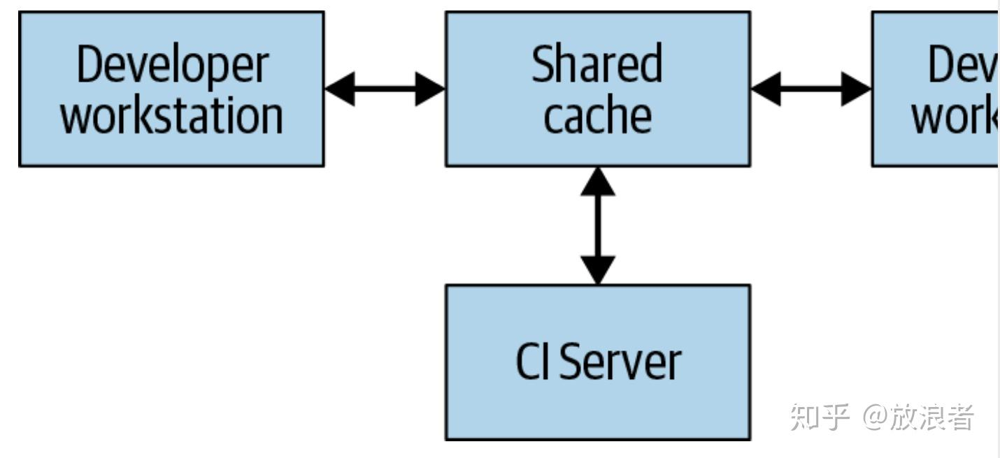
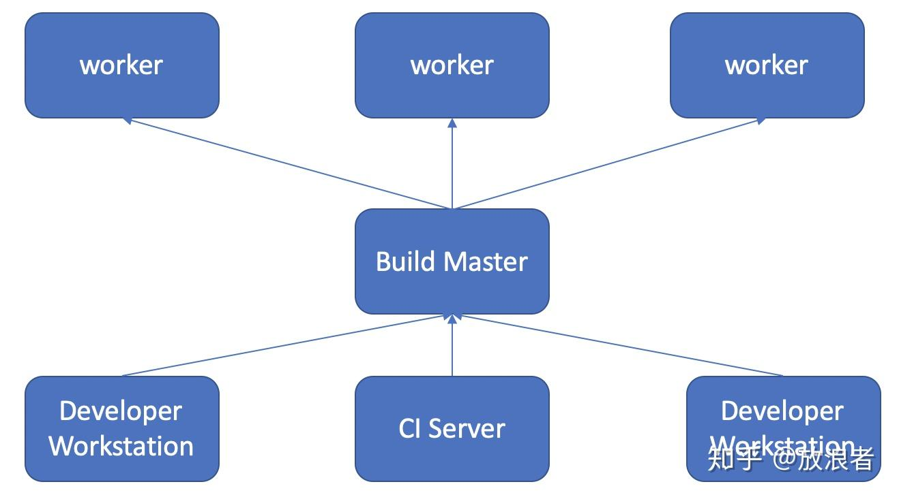
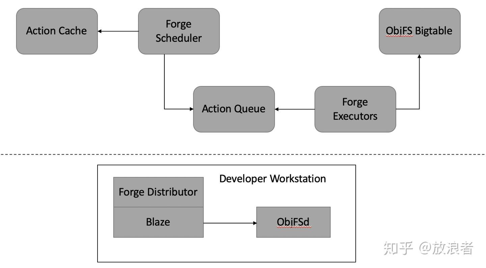
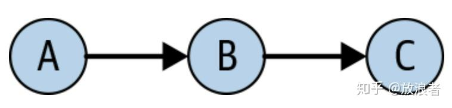

# 了解Bazel

## 基于制品的构建系统(Artifact-Based Build Systems)

** 关于artifact这个词，不知道怎么翻译比较好，英文原意似乎有工艺品、手工制品的意思，总之意味着精致小巧的物品。想过翻译成“物品”“构件“似乎都不是很确切。*

** 本节涉及到的技术名词较多，而很多是和Bazel的BUILD文件属性直接相关的，因此对于这些名词就不做翻译，以免造成歧义，例如target/input/output/etc.*

要设计一个更好的构建系统，我们需要回退一步。前面所说的这些系统的问题在于，他们给了程序员太大的权力去定义他们自己的任务。实际上，与其让程序员自己去定义任务，不如让系统定义一组任务，然后由程序员在受限的情况下进行配置。从这一节的标题我们可以猜到其中最重要的任务：一个构建系统最重要的功能是去构建代码。程序员仍然需要告诉系统他们想去build什么东西，但是“如何构建“则是系统自己的事情。

这就是Blaze以及其它基于artifact的构建系统（如Bazel, Pants, 及Buck）所采用的方案。和基于task任务的系统一样，我们仍然需要buildfile，但是这些buildfile的内容就很不一样了。相对于之前使用图灵完备的脚本语言来实现各种命令(an imperative set of commands)，以描述如何生成结果的方式，Blaze的buildfile是一种声明式的形式(declarative manifest)来描述一组制品(artifacts)如何去构建，他们的相互依赖，以及一组受限的选项来定义如何构建。当程序员运行blaze命令行时，他们会定义一组要构建的目标(what)，然后blaze负责配置、运行和调度编译步骤(how)。由于现在构建系统完全控制了运行时所用的工具，它才能确保运行期间的高效和正确。

### **从函数编程的角度思考(A Functional Perspective)**

把基于制品(artifact)的系统和函数编程(functional programming)对比是很有意思的。传统的命令式编程(imperative programming，如Java, C, Python)定义了一组可执行的statement，并依顺序执行。这也是基于任务的构建系统所参考的对象，用同样的思路让程序员去定义一系列可执行的步骤。函数式编程(Functional Programming，如Haskell, ML)则不一样，他们更像一组数学公式。在函数式编程中，程序员描述一个需要完成的计算，但是把何时执行以及如何执行则交给了编译器。这就对应到了基于制品的构建系统的思路，通过声明manifest，让系统自己决定如何执行。

尽管仍然有很多问题并不容易用函数式编程来实现，但有一件事恰好是函数编程最擅长的：简洁的并发支持，以及对正确性的强保障，而这两点对命令式编程(imperative programming)是几乎不可能的。对于函数式编程(Functional Programming)来说，最简单的工作就是通过一系列规则或函数，把一组数据转换为另一组。而这正是构建系统的目的：整个构建系统实质上就是一个数学函数，接受源文件（包括编译器这样的工具）作为输入，输出二进制。因此，基于函数式编程的思路来设计构建系统也变成很自然的事情。

## 走进Bazel(Getting concrete with Bazel)

Bazel是google内部构建工具Blaze的开源实现，也是一个基于artifact的构建系统的优秀示例。我们先来看Bazel中的buildfile（通常命名为BUILD）的形式：

```text
java_binary(
name = "MyBinary",
srcs = ["MyBinary.java"], deps = [
":mylib", ],
)
java_library(
name = "mylib",
srcs = ["MyLibrary.java", "MyHelper.java"],
visibility = ["//java/com/example/myproduct:__subpackages__"],
deps = [
"//java/com/example/common", "//java/com/example/myproduct/otherlib", "@com_google_common_guava_guava//jar",
], )
```

在Bazel中，BUILD文件定义了targets。上面的两个targets分别是java_binary和java_library. 每个target都对应着bazel能够创建的一种artifact. binary targets生成能够直接运行的二进制文件，library targets生成能够被其它binary或者library所使用的内容。每个target都有一个name（定义它在命令行和其它target中应该如何被引用)，srcs（定义必须被编译的相关源文件以生成对应的target制品），以及deps（定义前置必须先构建或链接的依赖）。依赖关系可以限制在当前package以内（e.g. MyBinary依赖于:mylib），也可以是在同一个源代码层级中的不同package(e.g. mylib依赖于//java/com/example/common)，或者源代码层级之外的第三方artifact(e.g. mylib依赖于"@com_google_common_grava_grava//jar"). 每个源代码层级(source hierarchy)都被称为一个workspace，并由根目录下的一个WORKSPACE文件来标示。

和Ant一样，用户也需要使用bazel的命令行工具来进行构建。为了构建MyBinary这个target，用户需要执行

```text
bazel build :MyBinary
```

在第一次运行上面命令时，Bazel会执行下列工作：

1. 解析当前workspace中每一个BUILD文件，创建各个制品(artifacts)之间的依赖图(graph of dependencies)
2. 使用上面创建的图来决定MyBinary的依赖转换关系(transitive dependencies)，也即是MyBinary所依赖的每个target，及每个target依赖的其它target，以此递归
3. 根据具体定义，按顺序构建或下载每一个依赖。Bazel在这里首先构建没有任何依赖的target，并保持跟踪对于每个target来说还有哪些依赖需要构建。一旦一个target的所有依赖都已经构建好之后，Bazel就开始构建该target. 该过程持续到MyBinary的每一个依赖都被构建完成。
4. 链接所有上一步中所生成的依赖，构建MyBinary来生成最后的可执行二进制文件。

从上面看，似乎这跟前面基于任务的构建系统也没有两样。的确，最后结果是一样的二进制文件，过程也同样包括解析一堆执行步骤来找到依赖关系，然后顺序执行这些步骤。然而，这里存在一些根本性的差异。第一个是在第3步中，因为Bazel知道每个target只生成一个Java library，它就清楚它只需要运行java编译器，而不是一个用户定义的脚本，这样bazel就知道并发执行这些步骤是安全的。这一点就能在一个多核机器上带来指数级别的性能提升，而且这只可能在基于artifact的构建系统上才能实现，因为它才能控制自己的执行方式以提供并发计算时的安全保障。

当然，优点不局限于并发支持。另一点就是当程序员第二次执行 *bazel build :MyBinary* 的时候。如果并没有什么修改，bazel一秒之内就会结束，并告诉你target已经最新，无需重新构建。这也是得益于我们之前提到的函数式编程模式---Bazel知道每个target都只是执行一次java编译器而已，而jiava编译器的输出又决定于它的输入，因此只要输入不变，输出结果就可以被重用。这样的分析适用于所有层面。如果MyBinary.java发生改变，Bazel就知道需要重建MyBinary，但是mylib是可以重用的。如果//java/com/example/common中的源文件发生改变，bazel也知道如何重建这个库，mylib以及MyBinary，但却可以重用//java/com/example/myproduct/otherlib. 因为Bazel知道每一步中所使用的工具属性，它就能够决定每一次执行时需要重构的最小制品组合(minimum set of artifacts)，同时保证不会出现过期的结果。

把构建系统用artifacts来描述而不是任务，这个想法是比较微妙但却非常强大的。通过减少暴露给程序员的灵活性，构建系统能够知道每一步到底在做什么，从而能够用这些信息来帮助构建通过并发和重用机制更加高效。但这其实只是第一步，这些可以并发的构建模块能够组成分布式可扩展构建系统的基础，我们将在后面去讨论。

### 其它Bazel相关技巧(Other Nifty Bazel Tricks)

基于Artifact的构建系统基本解决了并发和重用的问题，但这里还有些我们之前提过的难题。在我们讨论更多场景之前，我们来看看Bazel如何巧妙地处理这些问题的。

- **对工具的依赖(Tools as dependencies)**

在前面我们谈到一个问题，很多构建都依赖于安装在我们自己机器上的各种工具，由于工具版本和安装环境等因素，实现跨机器的构建就会变得比较困难。如果你的项目还是用了不同语言，并针对不同平台进行构建或编译，而每个平台都要求略有差异的工具来完成相思工作，这个问题就更加明显。(这里涉及到两个问题：环境依赖和平台针对性）

Bazel处理第一个问题的方式是把工具作为target所依赖的一部分。当前workspace中每个java_library都默认依赖于一个java编译器，但也可以在workspace层面进行配置。每次当Bazel构建一个java_library的时候，它首先检查特定的编译器是否在已知位置存在，如果没有的话首先下载。和其它依赖一样，如果java编译器发生变化，所有依赖于它的artifact都需要重建。Bazel中定义的每一类target都是用同样的策略来声明它需要运行的工具，确保无论什么样的环境下Bazel都能够正确初始化。

Bazel解决第二个平台独立性问题的方式是使用工具链(toolchain)。targets并不直接依赖于工具本身，而是依赖于工具链的类型。一个工具链包括一组工具和其它相关属性，用于定义某个类型的target如何在特定平台上构建。workspace可以根据主机和目标平台定义所使用的特定工具链，具体细节请查阅Bazel的使用手册。

- **扩展构建系统(Extending the build system)**

Bazel本身自带对几种流行编程语言的支持，如Java, C++等，当然程序员的期望不止于此。当然，这部分也是因为基于任务的系统给了足够多的灵活性去支持任意的构建过程，所以我们也不打算在基于artifact的系统里就把这个特性放弃。幸运的是，Bazel允许通过自定义规则(custom rules)来扩展所支持的target类型。

要定义一个Bazel的rule，开发者首先要定义rule需要的input(以BUILD文件中传递的参数形式)和该rule所生成的output。开发者还要定义该rule所要生成的actions. 每个action同样也要声明input和output，运行一个特定可执行文件或在文件中写入特定字符串，并能够通过input/output连接到其它的action. 这也意味着在Bazel里面，action是最底层的可编辑单元(lowest-level composable unit)--只要一个action只使用它所声明的input/output，它就能做任何它想做的事情，而Bazel则会负责对action进行规划安排并在合适的时候缓存其执行结果。

这样的系统并不是完全不会出问题的，它不可能去阻止一个程序员在action中做一些不正确的事情，例如引入一个结果不确定的过程等等。不过这种情况在实际操作中并不会经常出现，并且把滥用的可能性压制在最底层的action上，也大幅度降低了出现错误的可能。另外网上也有大量实现了对不同语言不同工具支持的rules，绝大部分项目实际上并不需要去定义他们自己的rules.即便是对不得不自定义rules的来说，所有的rule定义也只需要集中在一起，这意味着程序员可以随意使用这些rules而无需关注其实现细节。

- **环境隔离(Isolating the environment)**

无论如何，既然Actions可以做很多事情，那么听起来很可能和任务task一样会导致各种问题--例如两个actions难道不会也往一个文件写数据而导致冲突吗？实际上，Bazel利用了沙盒技术(sandboxing)而使得这种冲突是不可能的。在所支持的系统上，每一个action都通过文件沙盒技术(filesystem sandbox)相互隔离，每个action都只能看到一个有限的文件系统部分，这个部分包括了所有它所声明的inputs和生成的outputs. 这是依靠了和Docker一样的，基于Linux的LXC技术实现的。这意味着actions直接是不可能发生冲突，因为他们不可能读取自己没有声明的文件，而写往没有声明的文件则会在action完成后被立刻销毁。同时，Bazel也使用沙盒技术来限制action之间进行网络通讯。

- **可确定的外部依赖(Making external dependencies deterministic)**

这里还有一个问题没有解决：构建系统经常需要从外部下载依赖(工具或libraries)，而不是直接去构建他们。这可以从前面示例中的 @com_google_common_guava_guava//jar 的依赖看出，这是从Maven下载一个jar包。

依赖当前workspace之外的文件是很有风险的。这些文件随时可能变化，也就导致构建系统需要频繁检查他们是否是最新版本。如果一个远程文件的变化没有同步到当前workspace中源代码来，这可能会导致无法复现的构建版本--这意味着一个构建可能今天正常，而明天就因为很隐晦的原因失败，仅仅是因为一个没有注意到的依赖发生了变化。最后，第三方外部依赖会带来严重的安全隐患。如果攻击者能够进入第三房的服务器，他们就能用自己的东西替换掉你所依赖的文件，从而让他们有可能控制你的构建环境和输出。

这里最根本的问题在于我们希望构建系统能够注意到这些外部文件，但同时又不需要把他们加入到代码控制(source control)中。更新一个依赖应该是一个有意识的行为，但这个行为应该由一个中心控制来一次完成，而不是由单独的程序员或者系统自动完成。这是因为我们希望构建本身是可确定的(deterministic)，这意味着如果你check out上周的一个commit，你应该看到所有的依赖都和上周时一样，而不会仍然是今天的版本。

Bazel和其它构建系统通过workspace范围内的清单(manifest)来处理这个问题，这个清单列出了所有外部依赖的加密hash值(cryptographic hash)。这个hash值是一个相当简洁的方式来唯一标示外部依赖文件，而无需将文件本身提交到source control. 只要workspace中有任何新的外部依赖被引用时，该依赖的hash值就会加入到清单中，有可能是自动的，也可能是手动。当Bazel执行一个构建的时候，它会去检查缓存中的依赖(dependency)的hash值，和清单中的hash值做比较，如果不同的话则再去重新下载。

如果我们下载的artifact所具有的hash值也和清单中所声明的不同，那么构建就会失败，直到清单中的hash值根据实际情况进行调整。这可以自动完成，但这样的修改必须被审核通过，然后构建才能接受新的依赖。这意味着对于任何依赖调整，都会有一个对应的记录。同时，一个外部依赖不能在workspace的源文件没有变化的情况下就发生改变。这也意味着，当我们check out一个较老版本的源代码时，该构建一定会使用该版本提交时所使用的依赖，而如果这些依赖不再存在，构建也会失败。

当然，如果远程服务器不可用或使用错误的数据进行服务，这仍然会是一个问题。这会导致你所有的构建都会失败，除非你还有另一份复制的依赖数据可用。为了避免这个问题，我们推荐对于所有重要的项目，你应该把所有的依赖做一个镜像，并存在你所信任并能控制的服务器或服务上。否则哪怕是提交的hash值保证了安全性，你也仍然是把你的构建系统可用性寄托在第三房上。

## 分布式构建(Distributed Builds)

google的代码库是非常庞大的---超过20亿行代码，相互之间的依赖链非常深，就算是最简单的二进制文件也可能依赖于上万个构建targets. 在这种规模下，几乎不可能在单机上在能接受的时间范围内完成构建，没有任何构建系统能够绕过机器硬件的物理限制。唯一可以考虑的办法让系统支持分布式构建(distributed builds)，这样需要完成的单位工作就能分散到指定且可扩展的一组机器上。假设我们已经把系统工作拆分为足够小的单位，这就允许我们能够完成任何规模的构建。这样的可扩展性是我们通过定义基于artifact的构建系统所期望达到的圣杯。

- **远程缓存(Remote Caching)**

最简单的分布构建是仅仅实现远程缓存(remote caching)，如下图所示



\* 右边也是Developer Workstation

每个执行构建的系统，包括两个developer workstations，以及持续集成服务，都共享一个指向公用共享缓存服务。这服务可能是一个告诉的本地短期存储系统例如Redis，也或者是一个云服务例如Google Cloud Storage. 当用户需要构建一个artifact的时候，无论是直接的还是作为依赖项，系统都首先去检查远程缓存，查看该artifact是否已经存在。如果有的话，就直接从缓存下载而不用构建，否则系统就会先构建该artifact，然后把结果上传到cache. 这意味着不会经常变化的底层依赖能够构建一次就被多个用户共享，而不需要每个用户都去自己构建。在Google，大量artifacts都是从缓存中获得，而不是从头构建，这就大幅度减少了运行构建系统所需要的投入。

要一个远程缓存系统能够正常工作，构建系统必须保证构建本身是完全可以复现的。这就是说，对任何构建的target，输入都必须是确定的，这样才能保证同一组输入在任何机器上都能产生一致结果。这是唯一一种能保证下载一个artifact和自己构建的完全一致的方式。可喜的是，Bazel就提供了这种保障并也支持remote caching. 注意这要求缓存中的每个artifact对它的target和input hash都有对应的键值---这样，不同的开发者就能对同一个target同时进行不同修改，而remote cache则会存储所有结果artifacts并分别服务，不至于造成冲突。

当然，为了提供真正的便利，下载一个artifact需要比构建更快。这并非一直如此，特别是当缓存服务器距离构建机器较远的时候。Google的网络和构建系统对此做了非常精细的调整，以便能够快速分享构建结果。当配置你公司里的远程缓存服务时，注意考虑到网络延迟并用实验确认缓存系统的确提高了性能

- **远程执行(Remote Execution)**

远程缓存并非一个真正的分布式构建。如果缓存挂掉或者你需要做一个底层修改，而导致所有内容都需要重建时，你仍然需要在本地完成整个构建。我们真正的目标是去实现远程执行，这样真正的构建工作就能分布在多个worker上，如下图所示：



每个用户机器所运行的构建工具把请求发送到一个中央构建master节点(Build Master)。Build Master把请求拆分为对应的actions，并根据一个worker pool对action的执行进行规划。每个worker根据用户定义的输入执行action，并把结果作为artifact输出。这些artifacts则会被其它执行action的机器共享，直到生成最终输出并返回给用户。

实现一个这样的系统最麻烦的地方是管理worker, master和用户本地机器之间的通讯。Worker可能依赖于其它worker所产生的中间artifact结果，而最终结果需要被送回到用户本地机器。为了实现这些，我们可以用前面提到的分布式缓存来实现，让每个worker都把结果写入到cache，并从cache中读取它的依赖项。Build Master则会阻止worker在所有依赖项都完成前进行后续工作，也就是在所有依赖项都完成之前，worker是不能从cache读取输入的。最终产品也会被cache，以允许本地机器进行下载。注意我们也需要能够把用户源代码中的本地修改输出，这样worker才能在构建之前应用这些改变。

要实现这样的目标，前面提到的基于artifact系统所有的部分都必须整合起来。构建环境本身必须是能自我描述(self-describing)，这样workers才能无需人工干预而运转。构建过程则必须是自给自足，因为每一步都可能在一个完全不同的机器上执行。输出必须绝对确定，这样每个worker才能信任从其它worker中收到的结果。这些保障对于基于任务的系统来说是极端困难的，也使得基于任务的系统几乎无法实现一个可靠的远程执行体系。

- **Google的分布式构建(Distributed Builds at Google)**

从2008年开始，Google就开始采用分布式构建系统，包括remote caching和remote execution，如下图



Google的分布式构建系统架构

Google的远程缓存被称为ObjFS，它包括一个后端服务用于存储构建输出，存入分布于主要生产环境机器的BigTable中，以及一个被称为objfsd的前端FUSE守护进程，运行于每个开发者的机器上。FUSE进程允许开发者浏览构建输出，就像这些输出是存在workstation本地一样，但实际上文件内容只会在用户要求时才会下载。按需下载文件大大降低了网络带宽和硬盘空间的需求，而整个系统也能以本地构建两倍的速度完成工作。

Google的远程执行(Remote Execution)系统称为Forge. 一个在Blaze中被称为Distributor的Forge Client把每个action的请求发送到数据中心的一个称为Scheduler的服务中。Scheduler会维护一个保存action结果的缓存，如果缓存中已经有其它用户生成的该action的结果，则可以立刻返回。如果没有的话，它就把action放到一个队列中(Action Queue)。一个巨大的Executor Pool则会持续从action queue中读取action，执行action，并把结果存储在ObjFS BigTable中。这些结果可以用于executor处理后续action，或者让用户直接通过objfsd下载。

最终我们获得一个可以扩展的有效支持Google所有构建工作的系统。而Google的构建规模的确非常庞大：每天，Google会基于数十亿行代码来运行数百万次构建，执行数百万次测试，并生成PB级别的构建输出。这样一个系统不但让开发者能够快速构建复杂的代码库，它也使得我们能够基于构建实现海量的自动化工具。Google的确为这样的系统付出了多年的努力，但现在开源工具的普及让任何公司都能实现一个类似的系统。尽管它仍然需要付出时间和精力来部署这样的构建体系，最终结果一定会让开发者觉得一切的努力都是值得的。

- **时间、规模与取舍(Time, Scale, Trade-Offs)**

构建系统的目的就是让代码随着项目扩展的同时易于管理和控制。和软件工程的所有问题一样，这里在选择何种构建系统时仍然需要作出一些取舍。使用脚本或者直接使用工具的DIY方案仅仅对小项目有效，比如并不需要处理很久以前的代码那种情况，或者是对像Go这样有内建构建体系的语言。

选择一个基于task任务的构建系统，而不是依靠DIY方案，会显著地提高项目的可扩展性，允许你对复杂的构建过程自动化，并且能简单地在不同机器上重复构建过程。这里的折衷在于你必须思考如何去组织你的构建过程，并需要编写build files(尽管有时候可以用一些自动化工具完成). 这些取舍对大多数项目来说是值得的，但对于特别简单的项目（例如只包括一个源文件的项目），这些额外工作可能并不会帮到你什么。

基于task任务的构建系统随着项目的扩大会开始遇到一些核心问题，而这些问题可以用基于artifact的构建系统来补救。基于artifact的系统把扩展性解锁到一个全新的阶段，因为庞大的构建现在可以分布到大量的机器上，并且可以让数千个开发者都确信自己的build是稳定且可重复的。这里的取舍在于灵活性的丧失：基于artifact的系统并不允许你用真正的编程语言编写通用性的任务，而是要求你在系统的限制下工作。对于一个一开始就基于折衷系统的项目来说，这不是一个问题，但如果是从现有的基于task的系统迁移过来，这会比较困难而且不一定值得，除非项目构建本身已经在速度或稳定性上出现了问题。

对项目的构建体系做修改是比较昂贵的投入，而且这种投入随着项目扩大是不断增加。这也是为什么Google认为每一个新项目都应该一开始就采用基于Bazel类似构建系统的方式。在Google内部，基本上所有代码，从实现性质的小项目到Google Search，都使用Blaze进行构建。

## 处理模块与依赖(Dealing with Modules and Dependencies)

使用类似Bazel这样基于artifact的构建系统的项目会被分解为一组模块，而每个模块都会通过BUILD文件来描述其依赖关系。对模块及依赖关系进行合理组织是一件对构建系统的性能及维护投入都有巨大影响的事情。

- **使用精调的模块和1:1:1规则(Using Fine-Grained Modules and the 1:1:1 Rule)**

第一个要思考的问题就是在组织一个基于artifact的构建时，需要决定一个独立模块到底要包含多少功能。对于Bazel而言，一个“模块”则是用target来定义的一个可构建的单位，例如java_library或go_library. 从一个极端的角度来说，整个项目可以包含在一个单独模块里，通过在根目录放一个BUILD文件，并且把该项目的所有源代码文件都放进去。而从另一个极度角度出发，我们又可以把每一个源文件都作为一个单独的模块，从而要求每个文件都在一个BUILD文件中列出它所依赖的其它文件。

大部分项目都落在这两种极端之间，而我们需要考虑性能和可维护性的平衡。对整个项目用一个单独模块意味着除非你需要增加一个外部依赖，不然没有必要去改动BUILD文件，但这也意味着系统每次都要重现构建整个项目，因此它无法并行或用分布式的方式来完成部分构建工作，它也无法去缓存已经构建的部分。而一个文件一个模块的做法则恰好想反，构建系统有最大的灵活性来缓存和规划构建步骤，但开发者要付出更多的精力来维护依赖关系列表，特别是当修改文件引用的时候。

尽管具体的细分方式根据编程语言而不同，Google倾向于使用较小的模块，比基于任务的系统中常见的要小很多的模块。Google的一个可运行产品通常会包括上万个target，而即便是中等规模的团队也在代码库拥有至少几百个target. 对于像Java这样有很强的package包管理的语言，每个目录通常都包括了一个package，target，以及一个BUILD文件(在另一个基于Blaze的系统Pants中，把这个称为1:1:1 rule). 而对于package管理较弱的语言，则经常会在一个BUILD文件里定义多个targets.

使用较小的build target所带来的好处在大规模使用时特别明显，因为他们会带来更快的分布式构建，也无需频繁重新构建。而当测试人员也进入流程的时候，这些优势就更加明显，因为精心设计的target意味着构建系统能够更加“聪明”，它只会运行被修改影响到的测试子集。因为Google相信使用较小target所带来的系统化优势，他们投入了相当大的努力来开发相关的工具用于自动管理BUILD文件，以减轻对程序员的负担。大部分这些工具都已经开源。

- **最小化模块可见度(Minimizing Module Visibility)**

Bazel和其它构建系统允许每个target都定义自己的可见度(visibility):定义哪些targets可能会依赖自己。Targets可以是public的，这种情况下在workspace中的任何target都可以引用。可以是private，那么只有在同一个BUILD文件中的才能引用。或者也可以只对于一个列表中的targets可见。可见度(Visibility)和dependency是相反的：如果target A需要依赖于target B，那么target B必须是对A可见的。

和大部分编程语言一样，visibility要尽可能的小。一般来说Google的团队只有当target是Google公司内大量团队广泛使用的library时才会将其设为public. 需要合作的团队则通常事先进行沟通，维护一个用户target白名单来定义他们target的visibility. 每个团队的内部实现target会限制在团队负责的目录中，同时大部分BUILD文件通常只有一个非private的target.

- **管理依赖(Managing Dependencies)**

模块需要能够互相引用。把一个代码库拆分为细化的模块后，其负面影响是你需要维护这些模块之间的依赖关系。实际上，BUILD文件的主要内容就是在表达这些相互依赖。

- **内部依赖(INTERNAL DEPENDENCIES)**

在一个大项目拆分为细分模块后，大部分依赖项都很可能是项目内部的，意即为依赖于另一个在同一个代码仓库中定义和构建的target. 内部依赖和外部依赖的差别在于，他们是直接从源代码构建，而不是在构建过程中从外部作为一个预先构建好的artifact下载。这也意味着对内部构建而言，实际上没有版本的概念--一个target及其所有的内部依赖项都是始终从代码仓库的同一个版本统一构建的。

内部依赖需要仔细处理的一个问题是如何对待所谓传递性依赖关系(Transitive Dependencies)，如下图中，target A依赖B，而B依赖一个公共库target C，那么A是否能使用C中定义的class呢？



只要底层工具支持，这样的实现是没有问题的。在A构建的时候，B和C都会被链接到A, 因此C定义的内容也应该是A知道的。Blaze允许这样的关系很多年了，但是随着Google的成长，也慢慢发现了其中的问题。假设B进行了重构，不再需要C，因此B会移除对C的依赖，那么A对C的依赖就会被破坏。这样的结果就是，一个target的依赖项会变成它的公开contract一部分，而无法安全地进行修改。这也意味着随着依赖项的增加，Google的构建开始变慢。

因此Google最后通过Blaze中“严格传递依赖模式”(strict transitive dependency mode)解决了这个问题。在这个模式中，Blaze如果监测到一个target试图引用一个没有直接依赖的符号(symbol)，就直接报错，同时提供一个脚本命令来直接插入该依赖。对Google内部推广这种形式并重构几百万个targets，让他们显式列出自己的依赖项是一个需要多年时间的投入，但是很值得。现在google的构建快了很多，因为不必要的依赖项都移除了，同时开发人员也不再担心会错误移除依赖项。

和前面谈到的一样，强调传递式依赖也有取舍的考虑。它让build文件更加啰嗦，因为频繁使用的库现在需要显式列在很多地方，同时开发者需要花费更多努力来在BUILD文件中添加依赖项。因此我们又开发了一些工具来减少这些麻烦，这些工具可以自动检查到丢失的依赖项并自动加入到BUILD文件中。但是即便没有这些工具，我们也看到了这些努力随着代码库的扩大而变得越来 ️有价值：显式添加一个依赖项是一个一次性工作，但处理隐藏的传递式依赖则会造成持续问题。Bazel中则对于Java强制要求了strict transitive dependencies.

### 外部依赖(EXTERNAL DEPENDENCIES)

如果一个依赖不是内部的，那么它一定是来自外部。外部依赖指构建和存储在当前构建系统之外的artifacts制品。这样的依赖项被直接从artifact仓库导入(通常通过internet)，并会被直接使用，而不是从代码构建。它和内部依赖最大的一点差异是外部依赖存在版本，并且这些版本独立于项目的源代码存在。

- **依赖管理：自动vs手动(Automatic versus manual dependency management)**

构建系统允许这些外部依赖版本通过自动或手动的方式进行管理。当手动管理时，buildfile显式列出它需要从artifact仓库下载的版本，通常用版本号表示，例如1.1.4这种形式。当自动管理时，源代码定义一个可接受的版本号范围，而构建系统会下载最新的一个。例如，Gradle则允许一个依赖项版本声明为"1.+"来指明任何小版本或补丁版本都可以接受，只要大版本是1.

自动管理依赖项对于小项目来说很方便，但他们通常在较为复杂或者多人合作的项目中造成灾难。自动管理依赖的问题是当版本升级时你无法控制，而没有任何保障说外部的改变不会导致升级失败(即便外部声称遵循了版本号标示)，所以一个今天正常工作的build，明天就可能出问题，而且没有什么简单方法来检测什么发生了改变，以及如何回滚到正常状态。就算build没有break，这里也可能存在很微妙的行为或性能变化，而这些是完全无法回溯的。

相对的，因为手动管理依赖项要求在source control中做出改变，这就能够很简单的发现并回滚，而且也可以check out较老的版本来用以前的依赖项构建。Bazel要求所有依赖项都手动定义。即便在中等规模项目中，手工定义版本号所带来的额外工作，相对于所带来的稳定性而言也是非常值得的。

- **单一版本规则(The One-Version Rule)**

不同的library版本通常用不同的artifacts来表示，所以理论上讲，一个构建系统中没有理由对一个相同的外部依赖采用不同版本。尽管如此，每个target实际上都能选择它自己想要的依赖项。Google则发现这会导致很多实践问题，所以我们强制了严格的单一版本规则(One-version rule)，要求所有内部代码库的第三方依赖都是用同样的版本。

允许多个版本的最大问题是所谓的“宝石状依赖"(diamond dependency)问题。假设target A依赖B，以及某个外部库的v1版本。如果B后来重构代码，使用了同样的外部库的v2版本，这时A就会挂掉，因为它现在隐性地依赖了同一个lib的两个版本。因此，对一个target增加任何支持多版本的第三方lib都是不安全的，因为这个target可能已经依赖了其中一个版本。遵循one-version rule就让这种冲突不再发生---如果一个target增加了一个第三方lib的依赖，任何现有的依赖其实都是基于同一个版本，所以他们能够互相共存。

- **可传递的外部依赖(Transitive external dependencies)**

处理具有传递性的外部依赖关系非常困难。很多artifact仓库，例如Maven Central, 允许artifacts定义其它artifact的指定版本作为依赖项。Maven或者Graddle通常会遍历并下载每个依赖关系链，这意味着增加一个单独的的依赖项，可能会导致实际上会下载一堆不同的artifacts.

这种做法的确很方便：每当增加一个新的lib时，跟踪它的所有依赖链并手动添加会非常痛苦。但这里也有一个很大的负面问题：因为不同的lib可能依赖同一个第三方lib的不同版本，这个策略因此就违背了上面提过的单一版本原则(One-Version Rule)，并且会导致diamond dependency问题。如果你的target依赖两个外部lib，而他们使用了同一个依赖项的不同版本，那就没法确定到底你会得到哪一个了。这也意味着当升级一个外部依赖项时，如果新版本和某些依赖项需要的版本发生冲突，则可能会导致毫无原因的故障。

因此Bazel并不会去自动下载具有传递性的依赖项。然而，这也不是万能的做法---Bazel的替代方案是使用一个全局文件(global file)来列出每一个外部依赖，以及要求显式定义该依赖所使用的版本。幸运的是，Bazel提供了对应工具来对Maven artifacts自动生成这样一个文件。这个工具可以运行一次就生成项目的初始化WORKSPACE文件，然后该文件可以通过手工更新来调整每个dependency的版本。

再次强调，在方便性和可扩展性之间我们必须做出取舍。小项目可能并不想去管理这种传递性依赖关系链，而希望直接用自动方式来处理。随着团队和代码库的扩张，这种方式会变得越来越不受欢迎，而各种冲突和意外也会越来越频繁。对于大规模项目来说，手工管理依赖的代价比起处理自动化管理带来的各种问题所付出的代价来说，是要小得多的。

- **使用外部依赖缓存构建结果(Caching build results using external dependencies)**

外部依赖通常基于第三方发布的稳定版本，而且可能并不包含源代码。有些公司也会把自己的一些代码作为artifacts发布，从而允许其他代码把他们当作第三方库使用。这在理论上可以提高构建速度（前提是artifacts的构建很慢而下载较快）。

然而，这也带来了大量的额外工作和复杂性：需要有人来负责构建这些artifacts并上传到公司内部的仓库，而客户端则要确保他们和最新版本保持一致。调试也变得越来越难，因为系统的不同部分现在要从仓库的不同位置进行构建，整个源文件树(source tree)就失去了一个稳定可靠的统一视角。

解决构建artifacts耗时问题的更好方案是使用remote caching，就像前面几节提到的那样。这样的系统能够把每次构建的结果存到一个区域，以便程序员之间共享。因此如果一个程序员依赖于一个最近由别人构建的artifact，系统会自动下载而不是重新创建。这就极大地提升了性能，同时也保证了最终结果和直接在本地用源代码构建保持一致。这也是Google在内部使用的策略，而Bazel也可以通过配置来使用remote cache.

- **外部依赖的安全性和可靠性(Security and reliability of external dependencies)**

依赖第三方源的artifacts本质上是有风险的。例如存在可用性风险，如果第三方源因为某些原因挂掉，而你的整个构建就可能会因为无法下载外部依赖项而停止。这也可能有安全风险，如果第三方系统被人攻击，攻击者可能会把你用到的artifact用他们自己的东西替换，从而在你的构建中注入他们的代码。

这两个问题都可以通过对artifacts做镜像来解决，这样你就可以控制并阻止你的系统访问第三方仓库如Maven Central. 然而代价就是需要投入时间和资源去维护镜像，所以是否采用这种方式取决于你的项目规模。安全问题也可以被解决，只需要要求每个第三方artifact都在代码仓库中定义它的hash值，这样如果artifact被污染，构建就会直接终止。

另一个可选方案是把你项目的依赖项完全独立出去（原文有外包/出租的意思，vendor）。当一个项目独立之后，他会把这些依赖项和源代码一起check in到项目的source control中，用源代码或二进制都可以。这就以为和所有的外部依赖都变成了内部依赖。实际上，Google内部就采用了这种方式，把引用到的每个第三方库都提交到一个叫third_party的目录。然而，Google用这种方式也是因为Google自己的source control系统是设计来处理巨大的monorepo的形式，所以这种方式未必适合其它公司。

## 总结

构建系统是一家科技公司最重要的资产之一。每个开发者每天都可能和它打上几十甚至几百次交道。因此这是决定生产效率的重要因素之一，这样的系统是值得投资并正确实施的。

就像本章所讨论的那样，最重要的一点，就是对开发者权力和灵活性的限制，实际上能够提高他们的生产效能。我们开发了按照这种思路的系统，原则就是不给开发者不受限的权力去定义运行和构建实现细节，而是实现了一个高度结构化的框架来限制个人决策，并把核心的决策交给了自动化工具。实际上，开发者也并不反对这样做。Google人员非常喜欢这个系统，这样他们就能专注于更有趣的工作，例如开发他们的应用而不是和构建逻辑搏斗。记住一点：对构建系统的信任是非常重要----增量构建可以真正生效，而再也不必去清理构建缓存或者运行什么"clean"步骤。

基于这种思考，我们创建了一个全新的基于artifact的构建系统，并和传统的基于任务的构建系统产生了鲜明的对比。我们的方案让构建围绕着artifact进行，而不是围绕任务执行，这使得我们可以让构建工作满足像Google这样规模的组织。从比较极端的角度来说，它允许分布式构建系统把整个计算机集群的资源用于提升开发者的开发效率。即便你的公司还没有大到能充分享受这种好处的阶段，我们也相信基于artifact的系统仍然会对你适用。就算对于小项目，像Bazel这样的构建系统也能在速度和正确性上带来很多好处。

本章后面部分重点在讨论如何在基于artifact的系统中管理依赖关系。我们得出细化的小模块(fine-grained modules)比大模块(coarse-grained modules)更有利于规模扩展。我们也讨论了处理不同问题时会遇到的困难，如对依赖版本的管理，描述One-Version Rule及关于所有依赖都应该手工显性定义版本。这样的实践经验避免了常见的diamond dependency问题，从而允许代码库达到Google今天的几十亿行代码在一个单一仓库中，并通过一个统一的系统进行构建。

编辑于 2020-10-09 06:24