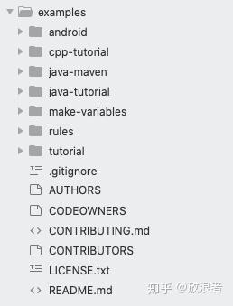
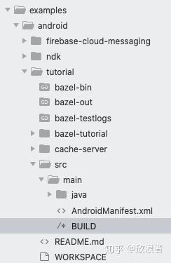
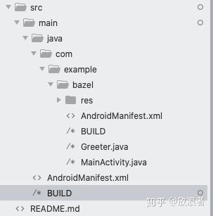
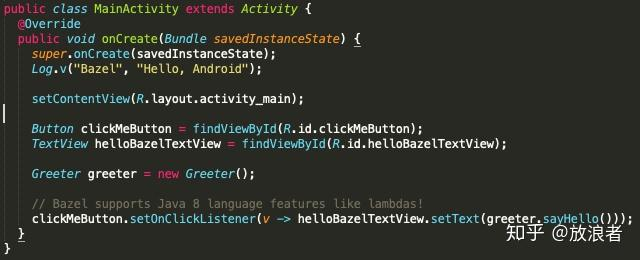
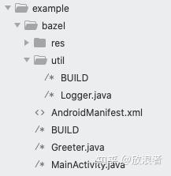
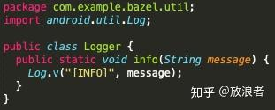
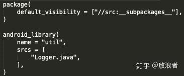
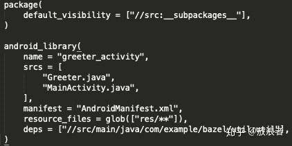
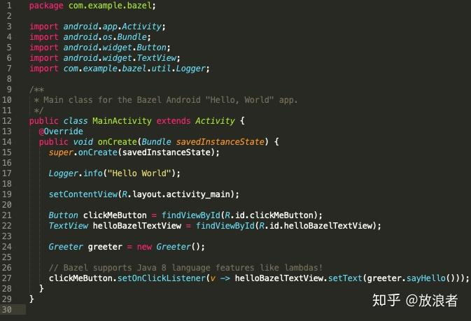
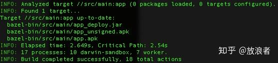

# 简单Demo

下面我们将首先用Bazel的官方android demo来看看到底如何用Bazel进行构建，然后我们会在其中做一些调整，看看如何用Bazel来实现简单的模块化。

首先安装bazel，现在的程序员，缺省开发环境应该以mac为准，我们就不讨论windows的情况了。官方安装文档可以在 [https://docs.bazel.build/](https://link.zhihu.com/?target=https%3A//docs.bazel.build/) 查看，我们这里先只讲怎么安装bazel以及对应的android project demo。

## **1. 安装Bazel**

先安装homebrew ([Homebrew](https://link.zhihu.com/?target=https%3A//brew.sh/))

然后运行

```text
$brew install bazel
```

查看bazel版本可以看到

```text
$bazel --version
bazel 3.5.0-homebrew
```

在笔者电脑上的版本是3.5.0-homebrew. 总之现在bazel装好了。

## 2. 配置android demo project

参考 [https://docs.bazel.build/versions/master/tutorial/android-app.html](https://link.zhihu.com/?target=https%3A//docs.bazel.build/versions/master/tutorial/android-app.html) ，运行

```text
git clone https://github.com/bazelbuild/examples
```

然后会看到类似这样的目录



我们这里要用到的是examples/android/tutorial下的内容。我们在终端窗口下进入该目录，首先需要创建一个WORKSPACE文件（如前面介绍Bazel时提到的那样，每个Bazel项目对应一个WORKSPACE文件）。注意在Bazel中，WORKSPACE指的是一个包括了单个或多个项目所有源文件的目录，然后我们在这个目录下要放一个WORKSPACE文件。我们需要运行

```text
$touch WORKSPACE
$bazel info workspace
```

这时候我们应该可以看到输出当前路径，这说明workspace创建成功（注意这里的WORKSPACE文件本身还是空的）。然后我们需要在空白的WORKSPACE文件中添加一行:

```text
android_sdk_repository(name = "androidsdk")
```

这样会配置android sdk，该路径由环境变量的ANDROID_HOME定义。通常我们在mac机器上可以这样设置

```text
$export ANDROID_HOME=$HOME/Library/Android/sdk
```

注意上面的android_sdk_repository(...)设置中可以配置更多参数，指定绝对路径，api_level等等，这里就不赘述。现在WORKSPACE就设置好了，我们下一步需要创建对应的BUILD文件。

BUILD文件描述了构建输出（例如通过aapt生成的android资源文件，或者javac编译的class文件）及他们的依赖dependencies. Dependencies可以是源代码，也可以是其它build的输出。BUILD文件本身是通过一种称之为StartLark的语言编写的。在我们的这个例子中，源代码都在examples/android/tutorial/src/main/java下面，因此我们在对应目录(src/main)下创建一个BUILD文件，这时目录结构如下：



\* 注意，上图中的cache-server是后面做远程缓存时加上的，原demo并没有

然后我们在BUILD文件中加上下面内容：

```text
android_binary(
    name = "app",
    manifest = "AndroidManifest.xml",
    deps = ["//src/main/java/com/example/bazel:greeter_activity"],
)
```

我们这里设立了android_binary作为输出target，并设定了其依赖deps为src/main/java/com/example/bazel下的greeter_activity，那么这意味着我们需要在src/main/java/com/example/bazel目录下再创建一个BUILD文件，并定义其生成的artifact名字为greeter_activity，因此在该目录下再创建一个BUILD文件，其内容为

```text
package(
    default_visibility = ["//src:__subpackages__"],
)

android_library(
    name = "greeter_activity",
    srcs = [
        "Greeter.java",
        "MainActivity.java",
    ],
    manifest = "AndroidManifest.xml",
    resource_files = glob(["res/**"]),
)
```

这时候我们就可以先体会一下Bazel的构建了，在workspace所在目录(examples/android/tutorial，也就是WORKSPACE文件所在位置）下执行：

```text
$bazel build //src/main:app
```

可以看到开始构建，在笔者机器上输出为

```text
INFO: Analyzed target //src/main:app (2 packages loaded, 10 targets configured).
INFO: Found 1 target...
Target //src/main:app up-to-date:
  bazel-bin/src/main/app_deploy.jar
  bazel-bin/src/main/app_unsigned.apk
  bazel-bin/src/main/app.apk
INFO: Elapsed time: 13.625s, Critical Path: 12.75s
INFO: 13 processes: 9 darwin-sandbox, 4 worker.
INFO: Build completed successfully, 14 total actions
```

最后看到生成了一个jar文件和两个apk文件，我们在这里就不安装到设备上运行了，这不是bazel的重点。

## 3. 增加依赖模块

上面是官方demo的标准内容，我们不必过多纠结。我们提到，bazel最大的好处是模块细化（以便支持缓存和分布式执行），那么下面来看怎么增加一个模块。

先来看我们当前的代码结构：



这里有两个BUILD文件（上一节已经讲过），其中src/main/BUILD是最终生成的target，也即是最后android的apk文件(android_binary)，而src/main/java/com/example/bazel/BUILD下则是包括MainActivity.java的具体实现代码所构成的target (android_library)。

MainActivity.java的内容其实很直白简单：



那么我们来做个简单的工作，把Log.v封装起来。如同很多正式产品代码所做的一样，我们创建一个util模块来实现各种辅助功能，其中包括一个Logger类。代码结构如下：



我们新建了一个util目录，并在里面创建了一个Logger.java和BUILD文件，文件内容很简单：



Logger.java



example/bazel/util/BUILD

其中Logger.java仅仅是一个对android.util.log的封装，BUILD文件则是和example/bazel/BUILD如出一辙，只是移除了一些不必要的属性如manifest等。这里是希望能构建把Logger实现作为util模块中的一环。

然后我们需要在上一层src/main/java/com/example/bazel/BUILD中加上对这个新模块的依赖，在其中加上一行：

```text
deps = ["//src/main/java/com/example/bazel/util:util"],
```

这时候example/bazel下的BUILD文件内容如下：



可以看到我们没做任何其他别的修改，只是加了一行deps的依赖描述。

最后微调一下MainActivity.java，把对Log.v的使用换成新的Logger类：



注意上面代码中第17行，我们使用了新的Logger类，并在第7行import了util模块中的class.

然后回到命令行，运行同样命令进行构建：

```text
bazel build //src/main:app
```

可以看到构建成功：



简单的Bazel构建和模块处理基本上就这样，其他细节，例如如何跨package调用等等，则和具体项目的代码结构，以及合理设置上面BUILD文件中的visibility息息相关，需要根据具体项目来讨论，这里不再赘述，各位可自行参考Bazel的使用手册。

到目前的sample位置，bazel只是起到一个代码管理和本地build工具的作用，虽然有趣，但并没真正体现出对大规模项目的帮助，而这正如前面章节所说，是需要通过两个方面来实现：

- 远程缓存(Remote Caching)
- 远程执行(Remote Execution)

我们将在下一节来介绍。

编辑于 2020-10-12 15:41