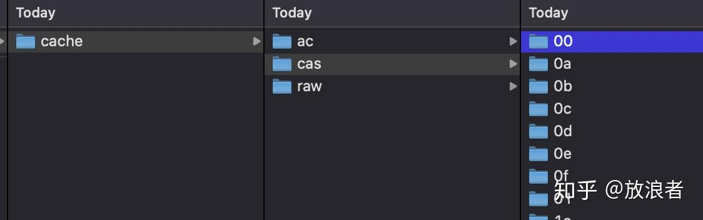
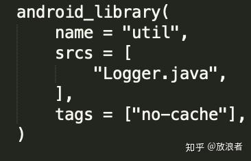

# Remote Cache

前面讲了Bazel的基本本地使用，但是我们知道，Bazel最重要的是支持缓存和分布式（远程执行），那么这一节主要就是讲如何让bazel使用缓存。

要能够缓存Bazel每个action的输出，我们就要一个server来实现remote cache，用于存储action的输出。这些输出实际上是一堆文件恶化对应的hash值。总体来说，我们需要满足三个前提：

- 设置一个server作为cache backend
- 配置Bazel build去使用cache
- Bazel版本要在0.10.0以上

Cache本身会存储两种数据：

- action cache，或者说实际上是一个acton->action result的map映射表
- 一个可寻址(addressable)的输出文件存储系统

[https://docs.bazel.build/versions/master/remote-caching.html](https://docs.bazel.build/versions/master/remote-caching.html) 中对Bazel Remote Cache的使用和工作有更详细的介绍，就不重复了。这里直接讲到底怎么设置一个Bazel Remote Cache Server. 在上面这个链接中提到了三种方式：

- NGINX的WebDAV模块
- 开源的bazel-remote
- Google Cloud Storage

这里我们直接选择第二种：开源的bazel-remote，以便可能的定制及更好理解内部实现。

[buchgr/bazel-remote](https://github.com/buchgr/bazel-remote/)

这里我们不用去重新编译运行，直接下载对应的docker镜像并运行即可

```text
$docker pull buchgr/bazel-remote-cache
```

bazel-remote支持grpc和http的接口调用，但注意docker内部应用的http接口应该是8080而不是9090（官方文档有误）。

创建一个目录cache, 然后启动docker容器如下

```text
path=`pwd`;docker run -v $path/cache:/data -p 9090:8080 -p 9092:9092 buchgr/bazel-remote-cache
```

我们可以看到一堆输出：

```text
2020/10/13 16:12:20 bazel-remote built with go1.14.5 from git commit cc9030667416ab63d89b9fbf543f0243292009b4.
2020/10/13 16:12:20 Initial RLIMIT_NOFILE cur: 1048576 max: 1048576
2020/10/13 16:12:20 Setting RLIMIT_NOFILE cur: 1048576 max: 1048576
2020/10/13 16:12:21 Migrating files (if any) to new directory structure: /data/ac
2020/10/13 16:12:21 Migrating files (if any) to new directory structure: /data/cas
2020/10/13 16:12:21 Loading existing files in /data.
2020/10/13 16:12:23 Sorting cache files by atime.
2020/10/13 16:12:23 Building LRU index.
2020/10/13 16:12:23 Finished loading disk cache files.
2020/10/13 16:12:23 Loaded 0 existing disk cache items.
2020/10/13 16:12:23 Starting HTTP server on address :8080
2020/10/13 16:12:23 HTTP AC validation: enabled
2020/10/13 16:12:23 Starting HTTP server for profiling on address :6060
2020/10/13 16:12:23 Starting gRPC server on address :9092
2020/10/13 16:12:23 gRPC AC dependency checks: enabled
2020/10/13 16:12:23 experimental gRPC remote asset API: disabled
```

然后可以通过其/status接口来查看是否正常启动

```text
$curl http://localhost:9090/status
{
 "CurrSize": 0,
 "MaxSize": 5368709120,
 "NumFiles": 0,
 "ServerTime": 1602605641,
 "GitCommit": "cc9030667416ab63d89b9fbf543f0243292009b4"
}
```

另外我们也可以查看cache目录下是否生成了对应文件：



这时就可以在运行bazel build的时候指定remote cache server的地址：

```text
$bazel build //src/main:app --remote_cache=http://localhost:9090
INFO: Invocation ID: a9a389d2-1e9f-4878-b65b-586e7b70fa35
INFO: Analyzed target //src/main:app (0 packages loaded, 0 targets configured).
INFO: Found 1 target...
Target //src/main:app up-to-date:
  bazel-bin/src/main/app_deploy.jar
  bazel-bin/src/main/app_unsigned.apk
  bazel-bin/src/main/app.apk
INFO: Elapsed time: 3.271s, Critical Path: 3.02s
INFO: 12 processes: 9 darwin-sandbox, 3 worker.
INFO: Build completed successfully, 13 total actions
```

在docker一侧，我们可以看到输出


可以看到cache主要是通过http put/get，并使用hash作为key来进行对应结果的查找。

我们重复几次bazel build后可以看到耗时很短，只有不到0.3秒:

```text
INFO: Analyzed target //src/main:app (0 packages loaded, 0 targets configured).
INFO: Found 1 target...
Target //src/main:app up-to-date:
  bazel-bin/src/main/app_deploy.jar
  bazel-bin/src/main/app_unsigned.apk
  bazel-bin/src/main/app.apk
INFO: Elapsed time: 0.286s, Critical Path: 0.03s
INFO: 0 processes.
INFO: Build completed successfully, 1 total action
```

这显然是cache的作用，我们也可以在BUILD文件中禁止cache。这实际上是对rule的tags设置（我们在以后再讲如何定义rule），我们在这里可以尝试对java_library这个rule添加tag，禁止cache。修改src/main/java/com/example/bazel/util/BUILD中的java_library属性如下：



这样bazel就不会对该BUILD的结果进行缓存，读者可以自行尝试对比，这里就不过多展示实验结果。

实际上，remote caching只是最基本的一个结果缓存机制，部署和使用都很简单，这里也只是对此进行快捷说明。小团队完全可以用这种方式来部分提升效率。而远程执行(Remote Execution)往往集成了缓存功能，因此在实际大型团队部署中一般不会专门对Remote Cache创建server。我们在下一节来介绍Remote Execution.

发布于 2020-10-14 00:57