# Remote Execution和rule编写

### Bazel的Remote Execution

勿用多说，要Bazel能在大型公司内成为真正的核心构建集群，用于几百上千甚至上万工程师的日常构建和CI（持续集成）构建，靠单机bazel build或者简单地引入bazel 缓存，都是不够的（引入缓存对小团队应该有较明显帮助）。

要达到真正大规模的构建，我们需要Bazel集群服务，而这个集群服务不光是缓存，更重要是能够把构建工作放到集群来执行，而不是本地完成。

官方文档 [https://docs.bazel.build/versions/master/remote-execution.html](https://link.zhihu.com/?target=https%3A//docs.bazel.build/versions/master/remote-execution.html) 中，对Baze的远程执行Remote Execution有很轻描淡写的介绍，其中提到了三种方式：

- 自行开发remote execution服务，bazel本身提供了对应的gRPC API可以使用([https://github.com/bazelbuild/remote-apis](https://link.zhihu.com/?target=https%3A//github.com/bazelbuild/remote-apis))
- 使用实现了bazel remote execution的开源工具，如Buildbarn, Buildfarm, BuildGrid, Scoot，都在github上开源
- 使用商业服务

Bazel的远程集群执行是个比较复杂，而且技术挑战较大的事情，要支持好远程执行，从本地BUILD文件的编写就要做一些调整。必须要说，截止到当前2020年10月为止，Bazel仍然是一个毁誉参半的工具，除开google自己大规模应用之外（Google以前是blaze，bazel是它实现的一个开源版本，差别在哪里估计就内部负责人员才知道。Google内部用社区版本的Bazel还是自己的blaze，这问题也各有说法。。。但bazel核心在于其各种rules实现和对大型公司内部基础服务的支持，因此这并不意味着g家能用顺，其它公司就可以无脑上手），对于硅谷其它公司，无论是Uber、Airbnb还是Pinterest，都没有在这方面做得非常顺利。用Airbnb一位朋友的话来说：

> 大家都在浪费很多时间研究build怎么写，出了问题也不知道怎么调。
> 经常升级个版本就build break了；
> monorepo里跑个bazel build 就可以泡杯咖啡扯个蛋；

尽管如此，Bazel仍然是当前开源Build System里最先进也最代表着未来方向的产品，正如2014年容器docker刚起来的时候，各大公司往容器迁移又何尝不痛。。。所以，坑是一定有的，踩踩也没啥坏处。

这里我们将使用开源的Bazel Buildfarm来演示如何执行bazel remote execution.

我们创建一个目录，然后在下面clone Bazel Buildfarm项目：

```text
$mkdir buildfarm
$cd buildfarm
$git clone git clone https://github.com/bazelbuild/bazel-buildfarm.git
$cd bazel-buildfarm
```

这时候进入了对应的bazel buildfarm目录，但是我们要做一些修改，直接下载的项目里面的一些设定和配置需要调整才能正常运行。

首先修改 ./bazelversion，在我的机器上装的bazel是3.5.0（运行bazel --version查看), 而buildfarm中该文件定义的是3.3.0，这会导致会运行失败。我们将该文件的3.3.0改为3.5.0即可。

然后需要对examples/worker.config.example进行修改，一共有两处：

```text
root: /tmp/root     # 把这里改成一个的确存在的路径
cas_cache_directory: # 把这里要么改成一个对上面root的相对路径，要么改为绝对路径
```

然后就可以尝试运行了。Bazel Buildfarm是一个master-slave架构（绝不政治正确），需要一个server作为服务入口，同时多个worker执行action. 我们在这里只启动一个server和一个worker用于演示。

首先启动server

```text
bazel run src/main/java/build/buildfarm:buildfarm-server $PWD/examples/server.config.example
```

注意，examples/server.config.example中定义了相关属性，如端口等等。第一次运行时会看到bazel会下载安装很多依赖，需要等几分钟。等看到类似以下窗口则证明启动成功：

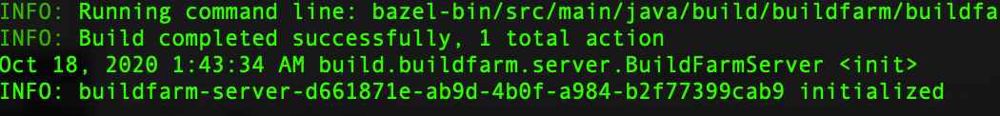

然后再开个terminal window，运行

```text
bazel run src/main/java/build/buildfarm:buildfarm-operationqueue-worker $PWD/examples/worker.config.example
```

然后再打开个窗口，回到我们之前的bazel官方目录 examples/android/tutorial.

这里我们执行如下命令进行远程构建：

```text
bazel build --remote_executor=grpc://localhost:8980 //src/main:app
```

很遗憾的是，第一次构建时，在笔者机器上出现了异常，似乎是什么vm的初始化失败，没做任何调整，立刻重新运行上面命令后则构建成功（充分展示了airbnb朋友所说：失败了也不知道怎么改。。。)，各位可参考运行结果：

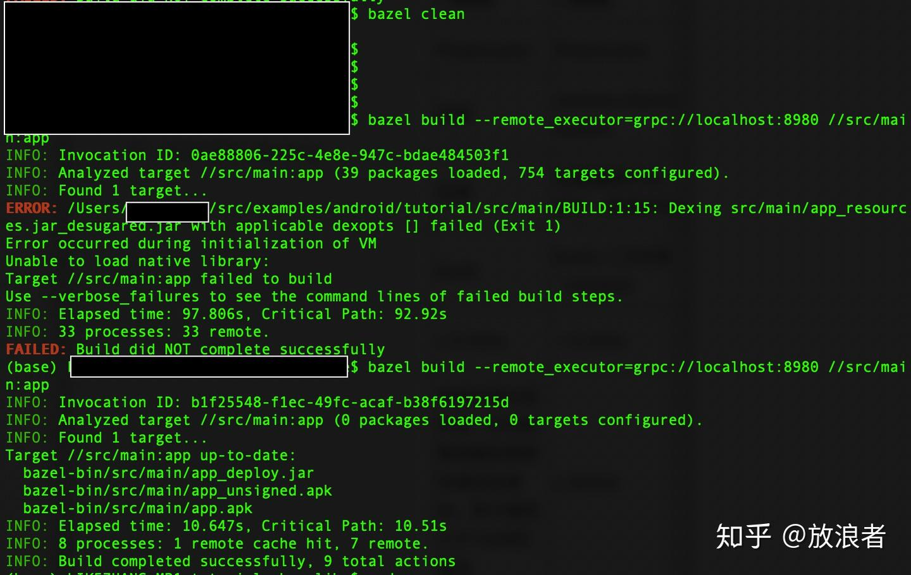

所以。。。额，难以言喻，建议各位自行体会，包括本地构建和这个远程构建的速度差异也挺明显。。。

注意两次所显示内容中，第一次显示：

```text
INFO: 33 processes: 33 remote
```

这表示所有构建过程都在远程完成。

第二次因为已经在本地有了缓存，则显示：

```text
INFO: 8 processes: 1 remote cache hit, 7 remote
```

所执行的数量就小多了，同时有一个远程的cache hit。

## *******开始踩坑************

我们上面的操作都是在本地mac系统下完成，虽然演示了用Bazel Buildfarm的操作，但是要作为生产环境的平台，显然要考虑如何在集群上远程执行。

很遗憾，这是个很困难的事情。直到2017年底，Bazel都不支持在不同架构/环境的机器上执行分布式跨机器构建( [https://stackoverflow.com/questions/44354378/running-bazel-remote-executor-test-on-separate-machines](https://link.zhihu.com/?target=https%3A//stackoverflow.com/questions/44354378/running-bazel-remote-executor-test-on-separate-machines) )，从Uber核心架构团队朋友讲到来说，到2017年位置，Uber使用Bazel也是保持和开发人员一样，用Mac机器搭的集群。

最新的官方文档上，把跨不同机器/环境的构建放在了对不同platform的支持里( [https://docs.bazel.build/versions/master/platforms.html](https://link.zhihu.com/?target=https%3A//docs.bazel.build/versions/master/platforms.html) )，并定义了Bazel所支持的三种场景。首先Bazel定义了构建过程中，平台所承担的三种角色：

- Host-Bazel自身运行的平台
- Execution-构建工具运行的平台，用于生成中间和最终结果
- Target-最终结果所在的平台

根据这三个角色区分，Bazel声称其支持3种场景

- Single-Platform Builds(default): 这种场景下，host,execution, target是完全一致的
- Cross-compilation builds: Host和Execution一致，但target不一样。例如在mac机器上构建一个针对android的应用
- Multi-platform builds: 三者都不一样，例如，我们想尝试在macos启动baze，而调用ubuntu上的bazel server/worker，生成android apk...

我们在前面的例子里其实试过了前两种场景，但第三种场景。。。很遗憾，经过长达一个周末的折腾，直接使用buildfarm没能搞定。这里对这个过程也不多说，应该是像文档所说的那样，需要对BUILD文件做针对性调整，这就超出了快速入门的范围，真要做这事情就要专门投入人力研究。。。

总之，要实验很简单，各位可以通过下面的dockerfile自己构建一下就知道了

先创建一个包含了bazel和bazel buildfarm的基础镜像(Dockerfile.bazel.base)：

```text
FROM ubuntu:latest
RUN apt update -y
RUN DEBIAN_FRONTEND="noninteractive" apt-get -y install tzdata
RUN apt install git wget g++ unzip zip openjdk-11-jdk -y

RUN mkdir -p /app/bazel && cd /app/bazel && wget https://github.com/bazelbuild/bazel/releases/download/3.5.0/bazel-3.5.0-installer-linux-x86_64.sh && chmod +x bazel-3.5.0-installer-linux-x86_64.sh && ./bazel-3.5.0-installer-linux-x86_64.sh --user

RUN cd /app && git clone https://github.com/bazelbuild/bazel-buildfarm.git --depth=1
WORKDIR /app/bazel-buildfarm
```

再创建一个server镜像(Dockerfile.bazel.server):

```text
FROM bazelfarm:1.0
ENV PATH="${PATH}:/root/bin"
WORKDIR /app/bazel-buildfarm
COPY ./src/bazel-buildfarm/.bazelversion /app/bazel-buildfarm/.bazelversion
CMD bazel run //src/main/java/build/buildfarm:buildfarm-server /app/bazel-buildfarm/examples/server.config.example
```

最后创建一个worker镜像(Dockerfile.bazel.worker):

```text
FROM bazelfarm:1.0
RUN apt install android-sdk -y
ENV PATH="${PATH}:/root/bin"
ENV ANDROID_HOME="/usr/lib/android-sdk"
WORKDIR /app/bazel-buildfarm
RUN mkdir -p /app/bazel-buildfarm/worker_root
RUN mkdir -p /app/bazel-buildfarm/worker_root/cache
COPY ./src/bazel-buildfarm/.bazelversion /app/bazel-buildfarm/.bazelversion
COPY ./src/bazel-buildfarm/examples/worker.config.example /app/bazel-buildfarm/examples/worker.config.local
CMD bazel run //src/main/java/build/buildfarm:buildfarm-operationqueue-worker /app/bazel-buildfarm/examples/worker.config.local
```

这基本上和我们上面单机的内容保持一致，只是把Bazel buildfarm的server/worker放到docker容器，并基于ubuntu运行。

然后我们构建这三个images：

```text
docker build -f Dockerfile.bazel.base . -t bazelfarm:1.0
docker build -f Dockerfile.bazel.server . -t bazelserver:1.0
docker build -f Dockerfile.bazel.worker . -t bazelworker:1.0
```

需要注意，我们在Dockerfile.bazel.server和Dockerfile.bazel.worker中都用了本地修改过的.bazelversion和worker.config.example去覆盖了docker容器里的原始文件，因为涉及到本地IP地址和bazel版本的问题（ubuntu里面装的也是3.5.0），所以构建的时候注意一下目录路径。

然后开两个终端窗口分别启动容器：

```text
$docker run -p 8980:8980 bazelserver:1.0
```

在第一个sever启动后，再启动worker：

```text
$docker run bazelworker:1.0
```

\* 要注意，ubuntu上启动这两者，会有大量依赖需要从外网下载，如果不科学上网的话是不行的，网络还得比较稳定那种

然后我们来在本地再次运行bazel build命令

```text
$build --remote_executor=grpc://localhost:8980 //src/main:app
```

这时我们会看到类似如下错误：

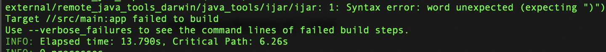

根据上面stackoverflow ([https://stackoverflow.com/questions/44354378/running-bazel-remote-executor-test-on-separate-machines](https://link.zhihu.com/?target=https%3A//stackoverflow.com/questions/44354378/running-bazel-remote-executor-test-on-separate-machines) )中的解释，这就是因为

> Running the remote worker on a different architecture / OS combination than Bazel itself isn't working yet. We still have a couple of places in Bazel where we inspect the local machine - they were added as temporary measures, but haven't been fixed yet

当然，在最新的bazel文档中([https://docs.bazel.build/versions/master/platforms.html](https://link.zhihu.com/?target=https%3A//docs.bazel.build/versions/master/platforms.html) )，介绍可以在BUILD文件中定义平台属属性，但语焉不详。而在另外一些文章中，则不建议自己定义platform，如

[https://docs.google.com/document/d/1UZaVcL08wePB41ATZHcxQV4Pu1YfA1RvvWm8FbZHuW8/edit#](https://link.zhihu.com/?target=https%3A//docs.google.com/document/d/1UZaVcL08wePB41ATZHcxQV4Pu1YfA1RvvWm8FbZHuW8/edit%23) (这来自官方文档)

[hlopko/bazel_platforms_examples](https://link.zhihu.com/?target=https%3A//github.com/hlopko/bazel_platforms_examples/tree/master/examples/05_select_on_platform)

总之，对这个要进一步研究，可以从 [https://docs.bazel.build/versions/master/platforms-intro.html](https://link.zhihu.com/?target=https%3A//docs.bazel.build/versions/master/platforms-intro.html) 这里开始，原文开篇也提到：

> Bazel has sophisticated support for modeling platforms and toolchains. Integrating this into real projects requires coherent cooperation between project and library owners, rule maintainers, and core Bazel devs.

翻译成人话，就是：我们支持多种平台的构建，但是这需要团队开发者、rule维护者及bazel开发者等多个人员的配合（折腾）。。。

所以笔者对bazel作为业余爱好也就到此为止了。。。从目前了解到的来看，似乎还没有哪家把bazel的remote execution大范围跑顺。

### 关于Bazel Rule的编写及action的应用

关于bazel rule的编写，根据airbnb/pinterest朋友的反馈，开发人员一般也就是写BUILD文件，而前面Bazel介绍文章也推荐尽量用网上已有的开源的Rule（其实就是一段基于所谓Skylark语言的描述性语言），而不建议自己写（大公司有资源的当然自己决定）。

Bazel rule的基本逻辑其实很直白，[https://docs.bazel.build/versions/master/skylark/rules-tutorial.html](https://link.zhihu.com/?target=https%3A//docs.bazel.build/versions/master/skylark/rules-tutorial.html) 有浅显易懂的介绍。我在这里选一个例子来说明：

创建一个新目录，在其中创建两个文件：

test1.bzl (bazel rule文件)

```text
def _test_binary_impl(ctx):
    print("Hellow world ", ctx.label)

test_binary = rule(
    implementation = _test_binary_impl,
)

print("test bzl")
```

BUILD

```text
load(":test1.bzl", "test_binary")

print("BUILD test")
test_binary(name = "test_result")
```

运行 bazel build :all (这意味着build当前目录下所有package中所有rules)

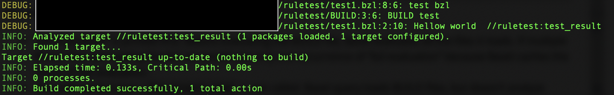

我们看到build过程执行了我们在_test_binary_impl中定义的行为，print了hello world，加上对应的label。当然这是个很trivial的实现，只是体现rule该怎么写，没有什么作用，实际上我们希望用rule定制我们需要的功能，而rule实际上是对我们要做的行为(action)的编排。

我们在前面讨论bazel时说到bazel的最小单位是action, bazel中有一堆预定义的action可以用([https://docs.bazel.build/versions/2.0.0/skylark/lib/actions.html](https://link.zhihu.com/?target=https%3A//docs.bazel.build/versions/2.0.0/skylark/lib/actions.html) ）：

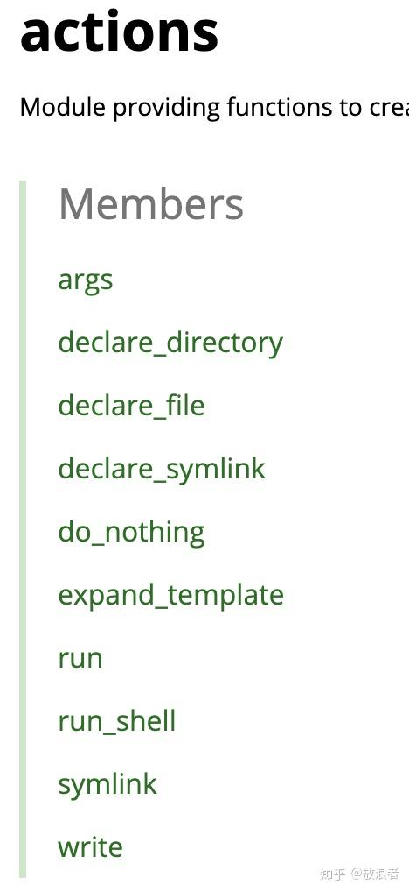


我们用一个简单的例子来实现如何在bazel中实现自定义的命令行执行和文件输出（也就是调用上面的run_shell和write action)

编写一个bazel rule (cmd.bzl):

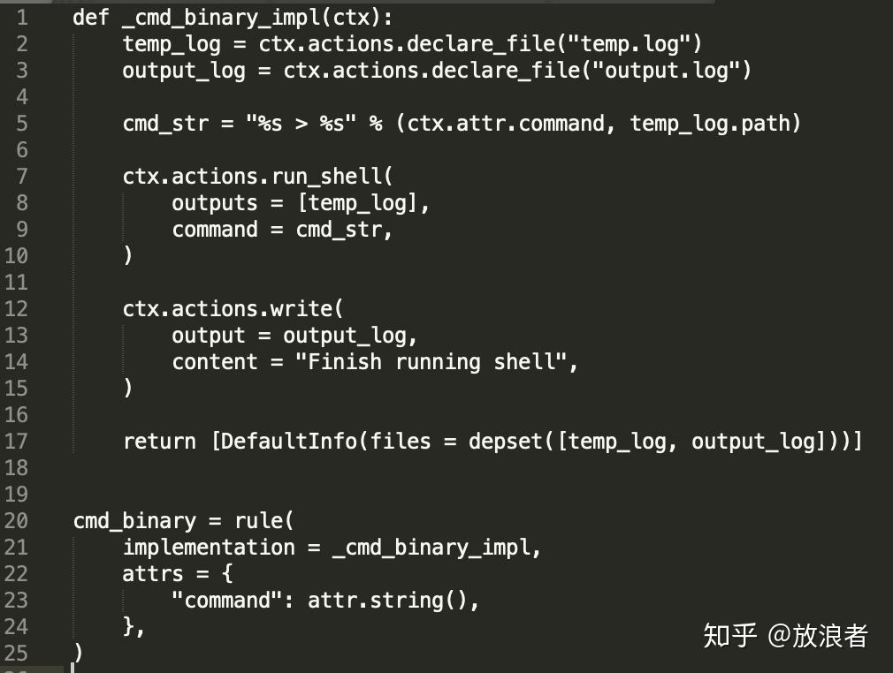

首先在这个rule的实现函数_cmd_binary_impl中，我们使用了三个action：

- ctx.actions.declare_file: 声明文件，这跟一般C++/Java这些里面要先定义输入输出一个道理
- ctx.actions.run_shell: 执行命令。注意第5行中我们定义了所执行的命令，实际上是把用户在BUILD文件中定义的命令输出写入temp.log文件
- ctx.actions.write: 写文件，这只是往文件随便写点东西

在第17行我们需要把生成的两个文件作为depset返回，不然不会生成。

第20～24行我们定义了cmd_binary的rule，注意这里用了attr模块，这样可以让用户在BUILD文件中自定义属性（例如command)。

最后来创建新的BUILD文件

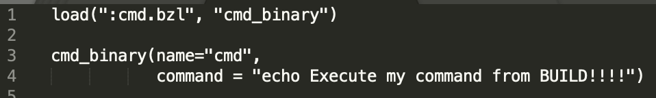

运行 bazel build cmd，可以看到如下输出：

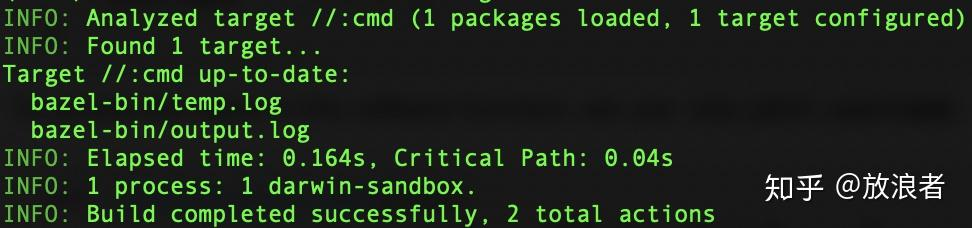

检查对应WORKSPACE中，可以看到如下目录

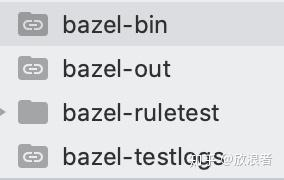

在bazel-bin目录中即为build输出，我们可以看到有两个输出文件output.log和temp.log，对应上面rule中的输出定义。检查文件内容，可验证输出结合和定义相符。

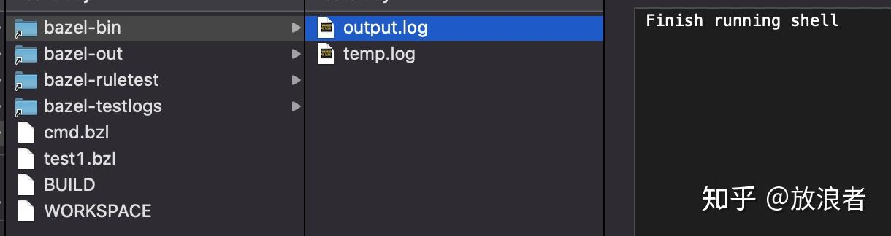

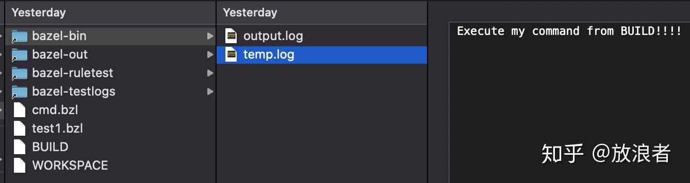

能够调用终端命令和脚本命令，基本上就解锁了一切能力（可以把网络接口调用封装到脚本里），剩下的就是具体的执行和想象力发挥。Rules编写有很多官方示例，可以参考 [bazelbuild/examples](https://link.zhihu.com/?target=https%3A//github.com/bazelbuild/examples/tree/master/rules)

Have Fun！！