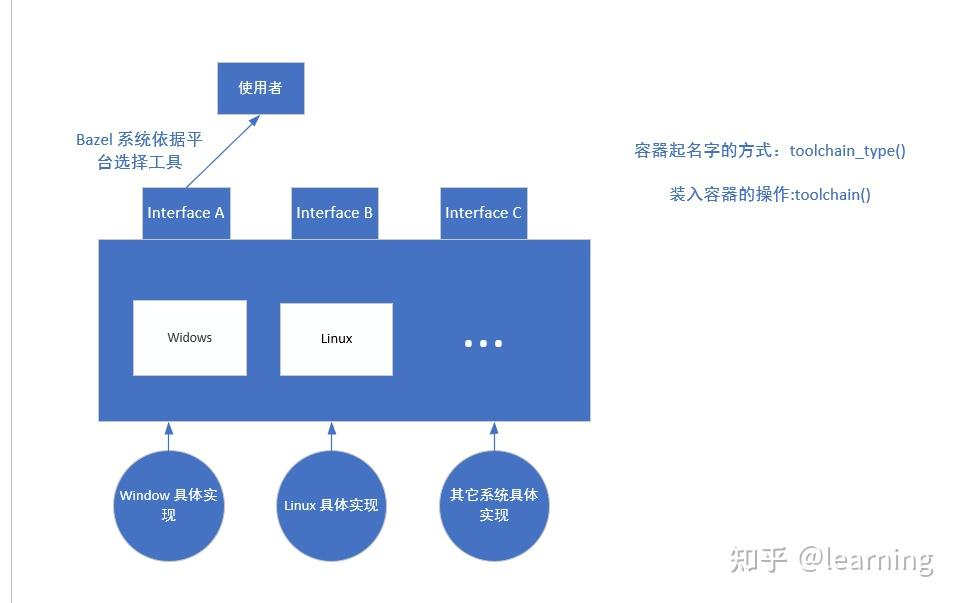

## Bazel 自定义规则入门

## 1. 基础知识

### 1.1 bazel 文件组织

- **Workspace** ：通常你可以理解为一个工程，对应一个repo，一个项目有自己唯一名字（Bazel鼓励它是全网唯一的）；一个Workspace的顶层目录下应该有一个 **`WORKSPACE` 文件**；
- **Packages** ：一个包含 **`BUILD` 文件**的目录和其目录下的其他所有文件和子文件夹（包含 `BUILD` 文件的子文件夹除外）；
- **Targets** ：一个构建目标；由一个规则（ `rule` ）给出，必须有一个名字；

以下示例展示了一个 target, target 要写在 BUILD 文件中

```text
cc_binary 表生成二进制文件，是一个规则，而 my_app 叫做 target
target:
cc_binary(
    name = "my_app",
    srcs = ["my_app.cc"],
    deps = [
        "//absl/base",
        "//absl/strings",
    ],
)
```

- 可以使用“...”表示package中的所有targets, 例如 `//test/...` `表示 `test` package 中的所有targets.

描述Target的语法规则是：

```text
[@workspace][//package/path][:][target]
```


**具体展示如下：**

WORKSPACE 所在的目录称为 Repo （WORKSPACE 表示 repo），如 stage1 , stage2, stage 3

BUILD 所在的目录称为 PACKAGE ，里面写了 target。

```text
examples
└── cpp-tutorial
    ├──stage1
    │  └── main
    │      ├── BUILD
    │      ├── hello-world.cc
    │  └── WORKSPACE
    ├──stage2
    │  ├── main
    │  │   ├── BUILD
    |  |   |—— helle-greet.bzl
    │  │   ├── hello-world.cc
    │  │   ├── hello-greet.cc
    │  │   ├── hello-greet.h
    │  └── WORKSPACE
    └──stage3
       ├── main
       │   ├── BUILD
       │   ├── hello-world.cc
       │   ├── hello-greet.cc
       │   └── hello-greet.h
       ├── lib
       │   ├── BUILD
       │   ├── hello-time.cc
       │   └── hello-time.h
       └── WORKSPACE
```

Targets **的可见性管理**
●bazel中所有Target都有可见性属性，如果没设置，则服从package中设置的默认可见性；
●package可以设置默认可见性；
●可见性分为以下几种等级

```text
"//visibility:public"  # 完全公开，本worksapce及其他workspace都可以访问
"//visibility:private" # 私有，仅同一package内可访问
"@my_repo//foo/bar:__pkg__"    # 指定某些特定的Target可以访问，这里"__pkg__"是一种特殊语法，表示该package内所有Targets
"//foo/bar:__subpackages__" # 指定某些特定的Target可以访问，这里"__subpackages__"是一种特殊语法，表示该package及其内部所有package的所有Targets
```

### 1.2 bazel 名词解释

**规则：**

Rule specifies the relationship between inputs and outputs

如代码 1 所示：就是通过**输入**( [http://my_app.cc](http://my_app.cc) 和 依赖) 通过**动作**(编译链接) 产生**输出 (**my_app.exe）

所以一个规则由： 输入、输出(必要)、动作组成

注意： 自定义规则 ，需要通过 bazel 提供的 rule 接口定义

```text
def _impl(ctx):
    # The list of arguments we pass to the script.
    ...
    ...
    ...
    # Action to call the script.
    ctx.actions.run(
        inputs = 
        outputs =  
        arguments = 
        executable = 
    )
   
msginit=rule(
    implementation = _impl,
    attrs = {
        "inputs": attr.label_list(allow_files = True), 输入
        "out": attr.output(mandatory = True),          输出
        ......
        ......
    },
)
```

代码 1 、target 示例

**平台：**

**平台就是一组约束值（constraint_value）的集合，就是 系统和硬件** 。即比如一个平台可以由 OS 和 CPU 两个约束类型来决定，又或者一个平台可以由 OS、CPU 和 GLibc_Version 来决定。

如下: "@platforms//os:linux", "@platforms//cpu:x86_64" 确定硬件和系统组合，这就是一个平台。

```text
platform(
    name = "linux_x86",
    constraint_values = [
        "@platforms//os:linux",
        "@platforms//cpu:x86_64",
    ],
)
```

代码 2 、toolchian 示例

**工具链：**

**不同平台可能需要不同的工具。**如 C++ 在windows系统中需要使用 msvc 编译器，在 linux 使用 gcc 编译器，为了解决此种问题，bazel 在不同的平台下，自动调用不同工具。

如下面代码所示：

在定义工具链时，通过 toolchian 函数，将不同平台实现(barc_windows)关联到 dd_toolchain_type 上，

调用时可以通过 dd_toolchain_type 进行调用

```text
toolchain(
    name = "barc_linux_toolchain",
    exec_compatible_with = [
        "@platforms//os:linux",
        "@platforms//cpu:x86_64",
    ],
    target_compatible_with = [
        "@platforms//os:linux",
        "@platforms//cpu:x86_64",
    ],
    toolchain = ":barc_linux",
    toolchain_type = ":dd_toolchain_type",
)

toolchain(
    name = "barc_windows_toolchain",
    exec_compatible_with = [
        "@platforms//os:windows",
        "@platforms//cpu:x86_64",
    ],
    target_compatible_with = [
        "@platforms//os:windows",
        "@platforms//cpu:x86_64",
    ],
    toolchain = ":barc_windows",
    toolchain_type = ":dd_toolchain_type",
)
```

代码 3、工具链设置

## 2. bazel 构建原理解析

简析： 本章概述了 bazel 构建的原理 ；

bazel 的设计理念是：所有的依赖关系尽量让 bazel 系统知道（如何让 bazel 系统知道依赖关系：

体现在 下文 2.1.1 代码中）；至于如何让用户（rule 的定义者）不使用隐式的依赖（隐式依赖：bazel 不知道的依赖关系），bazel 使用资源隔离的思想，体现在默认不使用环境变量，sandbox 机制 ；好处：bazel 系统知道所有的依赖关系，当修改一个文件后，可以生成最小依赖子图，然后编译就快。

2.1 bazel 构建过程


1. **Loads** the BUILD files relevant to the target.
2. **Analyzes** the inputs and their [dependencies](https://docs.bazel.build/versions/4.2.1/build-ref.html%23dependencies), applies the specified build rules, and produces an [action](https://docs.bazel.build/versions/4.2.1/skylark/concepts.html%23evaluation-model) graph.
3. **Executes** the build actions on the inputs until the final build outputs are produced.


load 阶段：

\1. bazel 是将相关的 *.bzl 定义的 rule 展开，替换成具体实现，类似 c++ 预处理阶段将宏展开

具体解释：

可以理解成，将 BUILD 中 msginit() 替换成 ctx.action.run() 中具体实现

BUILD 中：

先验知识： 在 BUILD 调用规则时，通过 load("定义rule的bazel","rule 名") 宏进行加载，类似 c++ include

```text
load("//binary:actionbinary.bzl","msginit")

msginit(
    name = "msgi",
    inputs = [":ce.cpp"],
    out = "ce.pot",
    gettext_tool= "@gettext//:gettextexe",
)
```

代码 4、使用自定义规则

在 actionbinary.bzl 文件中 msginit 叫做 rule ，是通过 bazel 提供的 rule（） 定义的

actionbinary.bzl 文件中


```text
def _impl(ctx):
    # The list of arguments we pass to the script.
    # args = [ctx.outputs.out.path] + [f.path for f in ctx.files.chunks]
    args = [
        "--keyword=_",
        # "f.cpp",
        "--from-code=UTF-8",
         "-o",] + [ctx.outputs.out.path] + ["-i"] + [f.path for f in ctx.files.inputs]  
    
    # Action to call the script.
    需要执行的动作
    ctx.actions.run(
        inputs = ctx.files.inputs,   
        outputs = [ctx.outputs.out], //  bazel 通过 outpust 是否生成来判读 build 是否成功
        arguments = args,
        # progress_message = "Merging into %s" % ctx.outputs.out.short_path,
        executable = ctx.executable.gettext_tool,
    )
    return DefaultInfo(runfiles= *** ) // runfiles=ctx.outputs.out
   
msginit=rule(
    implementation = _impl,
    attrs = {
        "inputs": attr.label_list(allow_files = True), 定义的输入文件名 
        "out": attr.output(mandatory = True), 定义的输出文件名
        "gettext_tool": attr.label(          定义的可执行工具
            executable = True,
            cfg = "exec",
            allow_files = True,
            # default = Label("//actions_run:merge"),
        ),
    },
)
```

代码 5、自定义规则


\2. 分析阶段

根据 **动作的** 输入输出，构建**最小动作**图

如下图 圆代表文件，方形代表 动作 就是指 上面代码中的的 ctx.actions.

如果 d 文件 发生修改 ，会执行 E 动作 和 T 动作 ， H 动作不会执行, 会复用上一次产生的 g 文件

**思考： bazel 怎么才能知道文件修改？**

**在 load 阶段，target 已经被替换成 ctx.actions, 所以需要将需要检测的文件“告诉”actions，**

**即在 action.run() 中设置 inputs = ctx.files.inputs。**

**这就是在 bazel 显示的定义依赖关系，此时 bazel 系统已经知道哪些文件需要被监测。**


图 2 action 动作图


## 2.2 sandbox 机制

简析：内容涉及了 ，sandbox 意义和执行原理；如何关闭 rule; execvp(argv[0], argv): No such file or directory 找不到文件解决方案。

**沙箱是一种权限限制策略，它将各个进程或系统中的资源隔离开来**。

对于Bazel，这意味着限制文件系统访问。Bazel的文件系统沙箱在一个只包含已知输入的工作目录中运行进程，这样编译器和其他工具就看不到它们不应该访问的源文件，除非它们知道源文件的绝对路径。

沙盒不会以任何方式隐藏主机环境。进程可以自由访问文件系统中的所有文件。但是，在支持用户名称空间的平台上，进程不能修改其工作目录之外的任何文件。这确保构建图没有可能影响构建的再现性的隐藏依赖项。

**更具体地说，Bazel为每个操作构造一个execroot/目录，该目录在执行时充当操作的工作目录。**Execroot /包含操作的所有输入文件，并作为任何生成输出的容器。Bazel然后使用操作系统提供的技术、Linux上的容器和macOS上的沙箱exec来约束execroot/中的操作。


**sandbox 干了啥？**

```text
cd /some/path && \
  exec env - \
    LANG=en_US \
    PATH=/some/path/bin:/bin:/usr/bin \
    PYTHONPATH=/usr/local/some/path \
  /some/path/namespace-sandbox @/sandbox/root/path/this-sandbox-name.params --
  /some/path/to/your/some-compiler --some-params some-target
```

代码 7、 sandbox 工作原理

为什么 引入sandbox？

谷歌相信开发人员永远不必担心正确性，并且无论输出树的当前状态如何，每次构建都应该得到相同的输出。**如果编译器或工具在Bazel不知道的情况下读取文件，那么如果该文件已更改，Bazel将不会重新运行该操作，从而导致不正确的增量构建**。解释： 通过sandbox 将隐式依赖隔绝（没有定义为 input output）隔绝掉。

谷歌还希望在**Bazel中支持远程缓存**，在这种情况下，缓存条目的不正确重用比在本地机器上更容易造成问题。共享缓存中的一个糟糕的缓存条目会影响到项目中的每个开发人员，而“bazel clean”的等效方法，即清除整个远程缓存，会适得其反。解释：大家都用一套编译环境，但是个人有所区别

此外，**沙盒与远程执行密切相关**。如果构建在沙盒上工作得很好，那么它也可能在远程执行上工作得很好——如果我们知道所有的输入，我们也可以将它们上传到远程机器上。上传所有文件(包括本地工具)可以显著降低编译集群的维护成本，相比之下，每次尝试新编译器或更改现有工具时都必须在集群中的每台机器上安装这些工具。


**sandbox 开启条件：**

Note that sandboxing does not try to hide the host environment in any way. Processes can freely access all files on the file system. However we try to prevent them from modifying any files outside their working directory. **This requires platform-specific features though and is only available on newer Linux versions that support user namespaces and on macOS.**

**On Linux**, we're using user namespaces, which are available in Linux 3.8 and later. We use mount namespaces to make parts of the file system read-only and PID namespaces for reliable process management.

On Mac, we use sandbox-exec, which is supplied with the operating system. Unfortunately no mechanism like PID namespaces or Subprocess Reapers seems to exist on macOS, so we couldn't get process management to work reliably so far.

**On Windows, we currently do not implement sandboxing.**

**linux 默认， windows 没有 sandbox**


由于系统配置，sandbox 可能启动出问题。启动问题会出现，找不到文件, 可以手动启动沙箱 。

The sandbox may fail to execute rules because of the system setup. If you see a message like namespace-sandbox.c:633: execvp(argv[0], argv): No such file or directory, try to deactivate the sandbox with --strategy=Genrule=local for genrules, and --spawn_strategy=local for other rules.


当然也可以关闭沙箱， 如下所示。

```text
    ctx.actions.run(
		.......
        execution_requirements = {
            "no-sandbox": "1",
        },
    )
```

代码 8、 sandbox 关闭

## 2.3 bazel 中的使用系统环境变量

windows 中默认隔绝环境变量（use_default_shell_env=False），所以要手动开启。

```text
    ctx.actions.run(
        ....
        use_default_shell_env=True,
        ....
    )
```

代码 9、 开启环境变量

## 2.4 bazel 中 windows 和 linux 中特殊情况

### 2.4.1 windows 下路径

bazel 系统自带路径格式 如 ：c:/aidi.cpp

而 windosws 格式是 // ， 如果使用 windows 脚本要进行转化

### 2.4.2 windows 和 linux 文件区别

**先验知识：**

linux 文件换行符是 : \n

windows中换行是： \r\n


如一个文档 肉眼看到是：


在 linux 下，用 cat -A 查看隐藏字符 会多出个子符（$），那就是我们肉眼看不到的换行符


如果在 windows 编译后，此时 换行符变成 \r\n, 在 linux 运行就会出现未知错误，无法正常执行。

**为了解决这种情况，**在写脚本的时候，建议要手动写出换行符

其中每一行后面都有 "\"，表示连字符**将系统的换行符**取消，\r\n 是 windows的换行符 。

window下：

```text
_msgcmp_script = """\
@echo off\r\n\
SETLOCAL ENABLEDELAYEDEXPANSION \r\n\
{msgcmp_path}  %1 %2 \r\n\
IF !ERRORLEVEL! == 0 ( \r\n\
    {msgcmp_path}  %1 %2 > %3 2>&1 \r\n\
)\r\n\
"""
```

代码 10、 windows文件换行

linux 下：

```text
_msgcmp_script_linux = """\
#!/bin/bash\n\
msgcmp  $1 $2\n\
if [ $? == 0 ] \n\
then\n\
    msgcmp  $1 $2 > $3 2>&1\n\
fi\n\
"""
```

代码 11、 unix 文件换行

## 3. Rule 实战

## 3.1 bazel 中提供的接口和基础概念

### 3.1.1 部分基础数据类型

bazel 使用 [Starlark](https://docs.bazel.build/versions/main/skylark/language.html) ，和 python 几乎完全相同的语法规则。

bazel 提供的接口：[https://docs.bazel.build/versions/main/skylark/lib/skylark-overview.html](https://docs.bazel.build/versions/main/skylark/lib/skylark-overview.html)

基础的数据类型 ：

这里介绍三种常用**数据对象**，string, list, tuple。 和 python 几乎相同

string : [https://docs.bazel.build/versions/main/skylark/lib/string.html](https://docs.bazel.build/versions/main/skylark/lib/string.html)

```text
string： 
a = 'abc\ndef'
b = "ab'cd"
c = """multiline string"""
t = str("a")

list 是用 [] 表示， 如 a =[1,23,4] // 解释了 为什么调用 rule 时，有时用 [] ,有时不用

tuple 使用 {} 表示， f = {
                    "at" : 1,
                     "vv": c }
```

代码 12、 类型展示

函数接口 ：[https://docs.bazel.build/versions/main/skylark/lib/globals.html#exec_group](https://docs.bazel.build/versions/main/skylark/lib/globals.html%23exec_group)

本文涉及到的函数: rule、register_toolchains、print、depset、aspect、select

### 3.1.2 Rule 示例

本章涉及了：ctx 和 attr 的关系； 如何写一个 rule；

[https://docs.bazel.build/versions/main/skylark/lib/globals.html#rule](https://docs.bazel.build/versions/main/skylark/lib/globals.html%23rule)

**先验知识 ：**

\1. bazel 自定义 rule 要写在 *.bzl 中, bazel 规定了 自定义rule 的文件 后缀: .bzl 。

\2. 自定义规则要通过 rule 接口

\3. 调用 rule 在要使用 load() 加载，类似于 c++ 的 include


其中 定义 rule 的属性 通过 attr 定义 。

在 _impl() ctx 中获取其定义的属性。

注意：

\1. _impl 中 "_" 表示私有，仅在此 bzl 中可用

\2. rule attrs 定义的是外部接口，通过 attr 定义 , 可以理解 c++ 函数的形参

\3. bazel 在 implementation 中 使用 ctx 将传入的参数读出

示例总体说明：

实现的是文件合并，通过 shell 命令，windows 和 linux 上的 shell 脚本是不同的所以有两套实现, 使用平台设置 ，让 bazel 系统自动选择 脚本

```text
rule 有两部分组成：
1.定义接口 通过 rule()
2.完成实现 通过自定义的宏

例如:
def _impl11(ctx):
    # The list of arguments we pass to the script.
    args = [ctx.outputs.out.path] + [f.path for f in ctx.files.chunks]
    print([f.path for f in ctx.files.chunks])
    print(ctx.outputs.out)
    # Action to call the script.
    // 执行的动作
    ctx.actions.run(
        inputs = ctx.files.chunks,
        outputs = [ctx.outputs.out],
        arguments = args,
        progress_message = "Merging into %s" % ctx.outputs.out.short_path,
        executable = ctx.executable.merge_tool,
    )
    
concat = rule(
    implementation= _impl11,
    attrs = {
        "chunks": attr.label_list(allow_files = True),  // 输入参数
        "out": attr.output(mandatory = True),           // 输出的 path
        "merge_tool": attr.label(                       // 可执行的文件
            executable = True,
            cfg = "exec",
            allow_files = True,
        ),
    },
)
```

代码 13、 自定义 rule

BUILD 中调用:

```text
load(":execute.bzl", "concat")

concat(
    name = "sh",
    out = "page.html",
    chunks = [
        "header.html",
        "body.html",
        "footer.html",
    ], # 在上面定义中 使用 label_list 所以用 [] 
    merge_tool = select({
        "//conditions:default": "//actions_run:merge_on_linux",
        "on_linux": "//actions_run:merge_on_linux",
        "on_windows": "//actions_run:merge_on_windows.bat",
    }),
)


# This target is used by the shell rule.
sh_binary(
    name = "merge_on_linux",
    srcs = ["merge.sh"],
)

sh_binary(
    name = "merge_on_windows.bat",
    srcs = ["merge.bat"],
)

config_setting(
    name = "on_linux",
    constraint_values = [
        "@platforms//os:linux",
    ],
)

config_setting(
    name = "on_windows",
    constraint_values = [
        "@platforms//os:windows",
    ],
)
```

代码 14、 调用 rule

### 3.1.3 attr 和 ctx

涉及到两个重要的对象， attr 和 ctx

其中 attr 是定义 rule 所使用的

其中常用的是 label 和 output, 下面着重介绍：


ctx 涉及的东西较多：provides、files、target、actions、outputs、executable 等对象， 这里不做详细展开

\1. file ： [https://docs.bazel.build/versions/main/skylark/lib/File.html](https://docs.bazel.build/versions/main/skylark/lib/File.html)


\2. provides : 类似c++ 函数返回值，bazel 规定宏返回值类型，也是 rule 交互的唯一接口, 最常用的 DefaultInfo 、OutputGroupInfo， 返回值如何使用见, 4 如何调试 一个 rule

provide : [https://docs.bazel.build/versions/main/skylark/lib/globals.html#provider](https://docs.bazel.build/versions/main/skylark/lib/globals.html%23provider)

常用的 provide: [https://docs.bazel.build/versions/3.5.0/skylark/lib/skylark-overview.html#providers](https://docs.bazel.build/versions/3.5.0/skylark/lib/skylark-overview.html%23providers)

DefaultInfo （如代码 13 _impl 没有 return, 可以通过 DefaultInfo 获取其部分信息）

[https://docs.bazel.build/versions/main/skylark/lib/DefaultInfo.html#modules.DefaultInfo](https://docs.bazel.build/versions/main/skylark/lib/DefaultInfo.html%23modules.DefaultInfo)

OutputGroupInfo:

[https://docs.bazel.build/versions/3.5.0/skylark/lib/OutputGroupInfo.html#modules.OutputGroupInfo](https://docs.bazel.build/versions/3.5.0/skylark/lib/OutputGroupInfo.html%23modules.OutputGroupInfo)


\3. action

- [ctx.actions.run](https://docs.bazel.build/versions/4.2.1/skylark/lib/actions.html%23run), to run an executable. 用来执行 shell 或者 binary
- [ctx.actions.run_shell](https://docs.bazel.build/versions/4.2.1/skylark/lib/actions.html%23run_shell), to run a shell command. 执行单条命令
- [ctx.actions.write](https://docs.bazel.build/versions/4.2.1/skylark/lib/actions.html%23write), to write a string to a file. 写一个文件
- [ctx.actions.expand_template](https://docs.bazel.build/versions/4.2.1/skylark/lib/actions.html%23expand_template), to generate a file from a template . 生成一个模板

**action 做了啥，大话解析？**

**官网解释太抽象了 ,如下所示：**


图 1. 官网解释

结合个人理解，给出解释说明：

```text
 ctx.action.run(
         inputs =,   inputs 作用 是检测其等号后面文件有没有修改，如果修改重新执行动作
         outputs= *, bazel 规定动作必须生成文件，通过判读文件有没有生成来判读 动作有没有执行成功
         args= ,     inputs和 outputs路径其实已经包含在 args 中了，也就是函数的实参 
         executable= , 可以理解为函数
 )
```

代码 6、 action 函数参数的个人理解

\4. outputs : 用户设置了文件生成的目录，如 我们设置 aidi 工程输出路径 为 D:/aidi/output

那么 outputs 对象的路径都是 D:/aidi/output/下

通过如何定义输入，输出 阐述了 ctx 和 attr 的关系：

```text
1.定义输入
定义有一个文件输入:
   "src":attr.label(allow_single_file=True)
在 _imp 中获取: ctx.file.src  此时得到了 file 类型的 src
        ctx.file.src.path 获取其路径
注意: ctx.file.src 表示获取将 src 封装成 file 对象
当然也可以原封不动的获取 ctx.attr.src 但是你此刻获得是一个target类型的返回值
                       ctx.attr.src.files 获取其返回值(provider)
定义多个输入文件:
     "src":attr.label_list(allow_files=True)
可以理解成: 在 _imp 获取  ctx.files.src 封装成 files 对象返回
       获取路径:
        [f.path for i in ctx.files.src]

2.定义输出
定义获取输出名字:
    "out_dd" : attr.output(mandatory=True) 
类内部使用 output 
     ctx.outputs.out_dd 获取一个 outputs 类型的对象
     ctx.outputs.out_dd.path  是对原路径进行改变，$(location out_dd's path)
     即表示 在 bazel_out/../../.... 路径下的路径
     如果没有设置输出文件，详情见 3.2.3 
     ctx.actions.declare_file

3.定义一个可执行文件                             
定义获取可执行文件
     "merge_tool": attr.label(
            executable = True, # 表明可执行文件
            cfg = "exec",      # 表明是可执行文件
            allow_files = True, # 允许有后缀,如 .exe .sh .bat
            default = Label("//actions_run:merge"),
        ),
rule 内部使用  ctx.executable.merge_tool  
```

代码 15、 定义输入输出

## 3.2 Rule 实战进阶

本章涉及: 1.常用的 rule；2.平台 ; 3.shell rule; 4. aspect 用法 ; 5. 重头开始定义一个工具链;

### 3.2.1 bazel 常用的 rule

简析：bazel 自带：filegroup 、http_archive , [bazel_skylib](https://github.com/bazelbuild/bazel-skylib) : write_file 、copy_file、native_file, run_binary

filegroup 常用来导出文件:

```text
filegroup(
    name="file",
    srcs=["bin/dd.cpp"],
)
```

代码 16、 filegroup 示例

http_archive() ，其中 build_file 、 build_file_content 、workspace_file 、workspace_file_content

**限制条件只能在 WORKSPACE 里面使用**

这个规则适合绝大部分的压缩包文件，如 jar、zip 、7z 等

代表引入一个 repo, name 代表 repo 名， 所以 @gettext//：对调用其内部的 target

build_file 是 BUILD 文件的相对地址

build_file_content 表示 BUILD的内容 ，和 build_file 不能共存

具体使用如下：

```text
load("@bazel_tools//tools/build_defs/repo:http.bzl", "http_archive")
http_archive(
    name = "gettext",
    build_file="//third_party:windows_gettext.BUILD",
    urls = ["https://github.com/mlocati/gettext-iconv-windows/releases/download/v0.21-v1.16/gettext0.21-iconv1.16-static-64.zip"],
    sha256 = "721395c2e057eeed321f0c793311732e57cb4fa30d5708672a13902a69a77d43",
    #strip_prefix="gettext0.21-iconv1.16-static-64",
    #strip_prefix ="721395c2e057eeed321f0c793311732e57cb4fa30d5708672a13902a69a77d43",
)
```

代码 17、http_archive 示例

bazel_skylib 是 bazel 封装的补充库

在 WORKSPACE 加载

```text
load("@bazel_skylib//:workspace.bzl", "bazel_skylib_workspace")

bazel_skylib_workspace()
```

代码 18、bazel_skylib 加载

为什么要用 bazel_skylib

1. 一些动作和系统有关，如 write file 中 unix 和 windows 换行符号不同
2. 像 copy 一些动作必须借助 shell 命令


解释：

先验知识： linux 中 文件运行需要权限，chmod +x , shell 脚本也是这样

\1. 如果用 write_file 写 shell 脚本 ，当 is_executable 就是完成了以上 chmod +x 的操作

\2. windows 下 二进制 exe ，为了保持逻辑一致 , linux 也 copy 为 exe， sh_binary 同理

```text
load("@bazel_skylib//rules:native_binary.bzl", "native_binary")
load("@bazel_skylib//rules:copy_file.bzl", "copy_file")
load("@bazel_skylib//rules:wirte_file.bzl", "write_file")

write_file(
    name = "write_nonempty_bin",
    out = "out/nonempty.sh",
    content = [
        "#!/bin/bash",
        "echo potato",
    ],
    is_executable = True,
    # newline ="auto",# ["auto", "unix", "windows"], default ="auto" 
)

copy_file(
    name = "a_exe",
    src = "dd/a",
    out = "out/a.exe",
)
```

代码 19、bazel_skylib rule 简单示例

### 3.2.2 paltform

和平台相关的函数


```text
定义一个 platform:
platform(
    name = "linux_x86",
    constraint_values = [
        "@platforms//os:linux",
        "@platforms//cpu:x86_64",
    ],
)
```

代码 20、platform 简单示例

### 3.2.3 write shell rule

简析：

\1. 使用 wirte_file 已经能满足绝大部分需求 ，详情 见 3.2.1

\2. 如果 wirte_file 满足不了需求，参照以下部分

windows 下 如何写：

```text
_msgcmp_script = """\
@echo off\r\n\
SETLOCAL ENABLEDELAYEDEXPANSION \r\n\
{msgcmp_path}  %1 %2 \r\n\
IF !ERRORLEVEL! == 0 ( \r\n\
    {msgcmp_path}  %1 %2 > %3 2>&1 \r\n\
)\r\n\
"""
# findstr "untranslated fatal" %3
# {msgcmp_path}  %1 %2 > %3 2>&1


def _msgcmp_impl(ctx):
    content = _msgcmp_script.format(
        msgcmp_path = ctx.executable.msgcmp_tool.path.replace("/", "\\")
    )
    msgcmp_script = ctx.actions.declare_file(ctx.attr.name + ".bat")
    ctx.actions.write(output = msgcmp_script, content = content, is_executable = True)
    # ctx.actions.do_nothing(wgg,inputs= ctx.executable.msgcmp_tool)
    return DefaultInfo(
        executable = msgcmp_script,
    )

windows_msgcmp = rule(
    implementation = _msgcmp_impl,
    attrs ={
        "msgcmp_tool": attr.label(
            executable = True,
            cfg = "exec",
            allow_files = True, # allow has extension, for example : .exe .cpp, it set has no effect but interesting 
            doc ="Tool used to check po file for no translation or error delete by translator",
        ),
    },

)
```

代码 21、windows 自定义 write shell

linux:

```text
_xgettext_script_linux = [
"#!/bin/sh",
"xgettext $@",
]

# _xgettext_script_linux = """\
# #!/bin/sh\n\
# xgettext $@\n\
# """

def _xgettext_impl_linux(ctx):
    lc="\n"
    content = lc.join(_xgettext_script_linux) 
    xgettext_script_linux = ctx.actions.declare_file(ctx.attr.name +".sh")
    ctx.actions.write(output = xgettext_script_linux, content = content, is_executable = True)
    # ctx.actions.do_nothing(wgg,inputs= ctx.executable.msgcmp_tool)
    return DefaultInfo(
        executable = xgettext_script_linux,
    )

xgettext_linux = rule(
    implementation = _xgettext_impl_linux,
)
```

代码 22、linux 自定义 write shell

### 3.2.4 toolchian

### 3.2.4.1 depset

[Depsets](https://docs.bazel.build/versions/main/skylark/lib/depset.html) are a specialized data structure for efficiently collecting data across a target’s transitive dependencies. Since this use case concerns the [analysis phase](https://docs.bazel.build/versions/main/skylark/concepts.html%23evaluation-model), depsets are useful for authors of rules and aspects, but probably not macros.

```text
s = depset(["a", "b", "c"])
t = depset(["d", "e"], transitive = [s])

print(s)    # depset(["a", "b", "c"])
print(t)    # depset(["d", "e", "a", "b", "c"])
```

代码 23、 depset 示例

### 3.2.4.2 aspect

aspect 详情： [https://docs.bazel.build/versions/main/skylark/aspects.html#aspects](https://docs.bazel.build/versions/main/skylark/aspects.html%23aspects)

aspect 主要作用是对其他规则进行拓展， 如下图所示一个规则

Aspects allow augmenting build dependency graphs with additional information and actions


如下图所示，通过 aspect 可以获取 target 信息进而进行拓展 ，如下文所示 。


**注意： ctx.rule 只有 aspect 的 implemation 中才有**


aspect 可以理解成，通过递归的方式（如上文对 deps 进行展开）， 获取原有的 target 的信息 ，拓展其功能。下文代码通过 aspect 使其具有特殊返回值属性，如下面代码所示，第 36 行调用 aspect ，增加 FileCountInfo 返回值。

在 30 行就可以通过 dep[FileCountInfo] 直接调用其内部属性

```text
FileCountInfo = provider(
    fields = {
        'count' : 'number of files'
    }
)

def _file_count_aspect_impl(target, ctx):
    count = 0
    # Make sure the rule has a srcs attribute.
    if hasattr(ctx.rule.attr, 'srcs'):
        # Iterate through the sources counting files
        for src in ctx.rule.attr.srcs: // ctx.rule 只有 aspect function 才有
            for f in src.files.to_list():
                if ctx.attr.extension == '*' or ctx.attr.extension == f.extension:
                    count = count + 1
    # Get the counts from our dependencies.
    for dep in ctx.rule.attr.deps:
        count = count + dep[FileCountInfo].count
    return [FileCountInfo(count = count)]

file_count_aspect = aspect(
    implementation = _file_count_aspect_impl, // aspect 具体实现
    attr_aspects = ['deps'],    // 根据 deps 进行分析 rule 
    attrs = {
        'extension' : attr.string(values = ['*', 'h', 'cc']),
    }
)

def _file_count_rule_impl(ctx):
    for dep in ctx.attr.deps:
        print(dep[FileCountInfo].count)

file_count_rule = rule(
    implementation = _file_count_rule_impl,
    attrs = {
        'deps' : attr.label_list(aspects = [file_count_aspect]),
        'extension' : attr.string(default = '*'),
    },
)
```

aspect 调用可以分两种， 一种是定义规则调用，如上面所示

还有一种是通过命令行调用 aspect

```text
bazel build //MyExample:example --aspects print.bzl%file_count_aspect
```


### 3.2.4.3 gettext toolchain 实例

简析： toolchain 的具体实现原理; gettext toolchain 实例

toolchian目的： bazel 根据平台选择哪种实现

如下图所示：

1、给工具链起个名字； 首先定义接口 （rule）；根据 不同平台，写出不同的逻辑，实现接口逻辑(target 调用工具链接口的实例)

2、将不同不平台的具体实现 ，和工具链（名为 dd）相关联

3、使用就可以通过工具链名（dd），直接调用这个工具链了，其中 bazel 根据平台选择构建工具





Gettext 工具链的实现

1. 定义工具链类型 ，其实就是给工具链起个名字（调用者可以根据这个名字进行调用）。在 BUILD 里定义 toolchian name ，用 toolchian_type

```text
toolchain_type(
    name = "gettext_toolchain_type",
    visibility = ["//visibility:public"],
)
```

1. 在 gettext_tool.bzl 里定义 统一的接口（rule 的定义）

```text
#自定义输出类型
GettextInfo = provider(
    doc = "Information about how to invoke the barc compiler.",
    # In the real world, compiler_path and system_lib might hold File objects,
    # but for simplicity we'll make them strings instead. arch_flags is a list
    # of strings.
    fields = ["xgettext_tool","msgfmt_tool","msgmerge_tool","msgcmp_tool",],  
)

# By convention, toolchain_type targets are named "toolchain_type" and
# distinguished by their package path. So the full path for this would be
# //bar_tools:toolchain_type.
def _gettext_toolchain_impl(ctx):
    toolchain_info = platform_common.ToolchainInfo(
        barcinfo = GettextInfo(
            xgettext_tool = ctx.executable.xgettext_tool,
            msgfmt_tool = ctx.executable.msgfmt_tool,
            msgmerge_tool = ctx.executable.msgmerge_tool,
            msgcmp_tool = ctx.executable.msgcmp_tool,
        ),
    )
    return [toolchain_info]


gettext_toolchain = rule(
    implementation = _gettext_toolchain_impl,
    attrs = {
        "xgettext_tool": attr.label(
            executable = True,
            cfg = "exec",
            allow_files = True, # allow has extension, for example : .exe .cpp, it set has no effect but interesting 
            doc ="Tool used to generate .pot file from src (cpp hpp h)",
        ),
       "msgfmt_tool": attr.label(
            executable = True,
            cfg = "exec",
            allow_files = True, # allow has extension, for example : .exe .cpp, it set has no effect but interesting 
            doc ="Tool used to generate .mo file from .po file",
        ),   
        "msgmerge_tool": attr.label(
            executable = True,
            cfg = "exec",
            allow_files = True, # allow has extension, for example : .exe .cpp, it set has no effect but interesting 
            doc ="Tool used to update po from by merging pot to po if code is changed",
        ),
        "msgcmp_tool": attr.label(
            executable = True,
            cfg = "exec",
            allow_files = True, # allow has extension, for example : .exe .cpp, it set has no effect but interesting 
            doc ="Tool used to check po file for no translation or error delete by translator",
        ),
        
    }
)
```

1. 在 BUILD 中，通过 toolchain() 将 实现 和 定义的工具链类型

```text
gettext_toolchain(
    name = "gettext_linux",
    xgettext_tool = ":linux_xgettext",
    msgcmp_tool=":linux_msgcmp" ,
    msgfmt_tool=":linux_msgfmt",
    msgmerge_tool=":linux_msgmerge",
)

gettext_toolchain(
    name = "gettext_windows",
    xgettext_tool = "@windows_gettext//:xgettext",
    msgcmp_tool=":window_msgcmp" ,
    msgfmt_tool="@windows_gettext//:msgfmt",
    msgmerge_tool="@windows_gettext//:msgmerge",
)


toolchain(
    name = "gettext_windows_toolchain",
    exec_compatible_with = [
        "@platforms//os:windows",
    ],
    target_compatible_with = [
        "@platforms//os:windows",

    ],
    toolchain = ":gettext_windows",
    toolchain_type = ":gettext_toolchain_type",
)

toolchain(
    name = "gettext_linux_toolchain",
    exec_compatible_with = [
        "@platforms//os:linux",
    ],
    target_compatible_with = [
        "@platforms//os:linux",

    ],
    toolchain = ":gettext_linux",
    toolchain_type = ":gettext_toolchain_type",
)
```

1. 在 WORKSPACE 注册工具

```text
register_toolchains(
    "//language:gettext_windows_toolchain",
    "//language:gettext_linux_toolchain",
)
```

5、工具链一般使用 aspect 通过 aspect(和 rule 函数 在一个层级上) 解析规则，通过 ctx.rule

```text
rule_attributes ctx.rule
```

rule_attributes [https://docs.bazel.build/versions/main/skylark/lib/rule_attributes.html#modules.rule_attributes](https://docs.bazel.build/versions/main/skylark/lib/rule_attributes.html%23modules.rule_attributes)

可以通过 ctx.rule.files 获取源文件 里面的文件

在 .bzl 中 定义 aspect

要点：

\1. gettext 针对 cc_library( ) cc_binary()

其中 cc_library 包含 源文件的是 srcs 和 hdrs

cc_binary() 只有 srcs

所以用 hasattr 进行判断，然后根据其 deps: 得到递归展开

```text
FileCollector = provider(
    doc ='collect all files ',
    fields = {"files": "collected files"},
)

def _file_collector_aspect_impl(target, ctx):
    # This function is executed for each dependency the aspect visits.
    direct =[]
    # Collect files from the srcs
    if hasattr(ctx.rule.attr, "srcs"):
        # for src in ctx.rule.attr.srcs:
        #     direct += [src for src in src.files.to_list() if src.is_source] 
        direct += [
            f
            for f in ctx.rule.files.srcs
            if f.is_source and (ctx.attr.extension == "*" or ctx.attr.extension == f.extension)
        ]
    direct_hdrs=[]
    if hasattr(ctx.rule.attr,"hdrs"):
       direct_hdrs += [
            f
            for f in ctx.rule.files.hdrs
            if  f.is_source and (ctx.attr.extension == "*" or ctx.attr.extension == f.extension)
        ]
    direct += direct_hdrs
    # Combine direct files with the files from the dependencies.
    files = depset(
        direct = direct,
        transitive = [dep[FileCollector].files for dep in ctx.rule.attr.deps],
    )
    return [FileCollector(files = files)]


file_collector_aspect = aspect(
    implementation = _file_collector_aspect_impl,
    attr_aspects = ["deps"], 
    attrs = {
        "extension": attr.string(values = ["*", "h", "cc","hpp","cpp"]),
    },
    # toolchains = ["//rules:gettext_toolchain_type"]
)
```

1. 使用 aspect 和 工具链 定义 gettext 接口

在下面代码 84 使用 aspect, 在实现里就可以通过 deps[FileCollector].files 获取其返回值

```text
def _file_collector_rule_impl(ctx):

    # get gettext tool from tool chain 
    gettext = ctx.toolchains["//language:gettext_toolchain_type"].barcinfo
    # get file path from target rule by aspect
    files = []
    for dep in ctx.attr.deps:
        files += [
            f.path 
            for f in dep[FileCollector].files.to_list() 
            if  f.dirname.split('/')[0] != "external"  and  f.path.find(ctx.attr.filter) == -1 
        ]
    # for i in files:
    #     print(i)
    xgettext_input = []
    for dep in ctx.attr.deps:
        xgettext_input += [
            f
            for f in dep[FileCollector].files.to_list()
            if  f.dirname.split('/')[0] != "external"  and  f.path.find(ctx.attr.filter) == -1 
        ]
    # this action is to generate pot
    xgettext_args = [
        "--keyword=_",
        # "f.cpp",
        "--from-code=UTF-8",
         "-o",] + [ctx.outputs.pot_out.path] + ["-i"] + files  
    ctx.actions.run(
        inputs = xgettext_input,
        outputs = [ctx.outputs.pot_out],
        arguments = xgettext_args,
        progress_message = "Generate %s from target file" % ctx.outputs.pot_out,
        executable = gettext.xgettext_tool,
        use_default_shell_env=True,
        execution_requirements = {
            "no-sandbox": "1",
        },
    )
    # this action to merege pot to po
    msgmerge_args= ["-o", ctx.outputs.merge_po_out.path, ctx.file.po_dir.path, ctx.outputs.pot_out.path]
    ctx.actions.run(
        inputs = [ctx.outputs.pot_out, ctx.file.po_dir],
        outputs = [ctx.outputs.merge_po_out],
        arguments = msgmerge_args,
        progress_message = "Generate %s file" %ctx.outputs.merge_po_out.path,
        executable = gettext.msgmerge_tool,
        use_default_shell_env=True,
        execution_requirements = {
            "no-sandbox": "1",
        },

     )

    print(ctx.outputs.pot_out.path)
    # this  action to check po by po
    ctx.actions.run(
        inputs = [ctx.outputs.merge_po_out, ctx.outputs.pot_out], 
        outputs = [ctx.outputs.error_txt],
        arguments=[ctx.outputs.merge_po_out.path, ctx.outputs.pot_out.path, ctx.outputs.error_txt.path],
        executable = gettext.msgcmp_tool,
        use_default_shell_env=True,
        execution_requirements = {
            "no-sandbox": "1",
        },
    )
   
   # this action to generate mo
    msgfmt_args = ["-o",] + [ctx.outputs.mo_out.path] + [ctx.outputs.pot_out.path]
    ctx.actions.run(
        inputs = [ctx.outputs.pot_out],
        outputs = [ctx.outputs.mo_out],
        arguments = msgfmt_args,
        # progress_message = "Merging into %s" % ctx.outputs.out.short_path,
        executable = gettext.msgfmt_tool,
        use_default_shell_env=True,
        execution_requirements = {
            "no-sandbox": "1",
        },
    )

_gettext_collector = rule(
    implementation = _file_collector_rule_impl,
    attrs = {
        "deps": attr.label_list(aspects = [file_collector_aspect]),
        "extension": attr.string(default = "*"),
        "pot_out": attr.output(),
        "po_dir": attr.label(allow_single_file=True),
        # "new_po_dir": attr.string(),
        "merge_po_out": attr.output(),
        "error_txt":attr.output(),
        "mo_out": attr.output(),
        "filter": attr.string(default = "*", doc='filter dir file, for external/**/, you can set external'),
    },
    toolchains = ["//language:gettext_toolchain_type"],
)

def gettext_tool(**kwargs):
    _gettext_collector(pot_out = "{name}_out.pot".format(**kwargs), error_txt="{name}_error.txt".format(**kwargs), **kwargs)
```

bazel 建议显示定义关系，但是如果我们必须用到隐式的关系，那应该怎么办？

在定义gettext 时，需要将 xgettext.exe 在网上下载下来，将 xgettext.exe 在系统的路径，写入 shell 文件中。

注意：

由于 ctx.actions.write 由于没有设置 输入的参数，所以 bazel 系统无法知道，这个动作依赖于 msgcmp_tool，

这就是隐关系;

```text
_msgcmp_script = """\
@echo off\r\n\
SETLOCAL ENABLEDELAYEDEXPANSION \r\n\
{msgcmp_path}  %1 %2 \r\n\
IF !ERRORLEVEL! == 0 ( \r\n\
    {msgcmp_path}  %1 %2 > %3 2>&1 \r\n\
)\r\n\
"""


def _msgcmp_impl(ctx):
    content = _msgcmp_script.format(
        msgcmp_path = ctx.executable.msgcmp_tool.path.replace("/", "\\")
    )
    msgcmp_script = ctx.actions.declare_file(ctx.attr.name + ".bat")
    ctx.actions.write(output = msgcmp_script, content = content, is_executable = True)
    # ctx.actions.do_nothing(wgg,inputs= ctx.executable.msgcmp_tool)
    return DefaultInfo(
        executable = msgcmp_script,
    )

msgcmp_windows = rule(
    implementation = _msgcmp_impl,
    attrs ={
        "msgcmp_tool": attr.label(
            executable = True,
            cfg = "exec",
            allow_files = True, # allow has extension, for example : .exe .cpp, it set has no effect but interesting 
            doc ="Tool used to check po file for no translation or error delete by translator",
        ),
    },

)
```

其中通过

```text
msgcmp_windows(
    name ="window_msgcmp",
    msgcmp_tool= "@windows_gettext//:msgcmp",
)
```

@windows_gettext//:msgcmp:

```text
# native_binary(
#     name ="msgcmp",
#     out = "msgcmp.exe",
#     src =  "bin/msgcmp.exe",
#     # is_executable = True,
# )

filegroup(
    name = "msgcmp",
    srcs= ["bin/msgcmp.exe"],
)
```

结果：

当在windows_gettext 定义 msgcmp 使用 native_binary 时，发现 bazel 无法执行，找不到 msgcmp.exe 文件

而使用 filegroup 时，可正常执行

分析：

\1. native_binary 会进行一次 copy 动作。

\2. 上文中使用隐式定义的关系， 在 bazel 分析 阶段，生成 action graph 时，会认为 native_binary 的动作不是必须的，从而不执行这个动作，从而使执行失败。


结论： 使用使用隐式定义关系，建议通过 filegroup 直接使用，不要通过中间执行动作


编辑于 2022-02-08 16:15

[规则](https://www.zhihu.com/topic/19567983)

[Bazel](https://www.zhihu.com/topic/20084969)

[自定义函数](https://www.zhihu.com/topic/20000093)