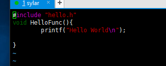
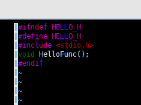

# cmake使用教程


本文主要借鉴《CMake+Pratice》一文，如果造成版权问题请联系作者删除。此前发现关于cmake的中英文材料都比较少，所以本文主要介绍cmake的入门教程。如果需要深入了解cmake的各种命令，建议在已有的项目中学习。

## 一、初识cmake

官网：www.cmake.org
优点：
1、开源代码，使用类BSD许可发布。
2、跨平台，并可以生成native编译配置文件，在linux/Unix平台，生成makefile,在苹果平台可以生成Xcode,在windows平台，可以生成MSVC的工程文件。
3、能够管理大型项目。
4、简化编译构建过程和编译过程。cmake的工具链：cmake+make。
5、高效率，因为cmake在工具链中没有libtool。
6、可扩展，可以为cmake编写特定功能的模块，扩展cmake功能。

缺点：
1、cmake只是看起来比较简单，使用并不简单；
2、每个项目使用一个CMakeLists.txt（每个目录一个），使用的是cmake语法。
3、cmake跟已有体系配合不是特别的理想，比如pkgconfig。

## 二、安装cmake

下载：centos7

```
yum -y install cmake
```


## 三、cmake的helloworld

1、准备工作
先在/backup/cmake下建立第一个练习目录t1。在t1下添加两个文件，分别是main.c和CMakeLists.txt。内容如下：


2、开始构建
指令： cmake .
成功建立如下：


可以发现，系统自动生成了如下的文件


包括：CMakeCache.txt、CMakeFiles、cmake_install.cmake、Makefile等中间文件。
指令：make


PS：可以使用make VERBOSE=1来查看make构建的详细过程。
这个时候已经生成了hello.
指令：./hello


以上是cmake构建的全部过程。

3、详细解释
对CMakeLists.txt的详细解释：

```
PROJECT(projectname [CXX] [C] [Java])
```

用这个指令定义工程名称，并且可以指定工程支持的语言，支持的语言列表是可以忽略的，默认情况表示支持所有语言。这个指令隐式的定义了两个cmake的变量：

```
<projectname>_BINARY_DIR
<projectname>_SOURCE_DIR
```

这两个变量可以用（这样不用担心写错工程名称）。

```
PROJECT_BINARY_DIR
PROJECT_SOURCE_DIR
```

```
SET(VAR [VALUE] [CACHE TYPE DOCSTRING [FORCE]])
```


这里先了解SET指令可以用来显示的定义变量即可。这里是

```
SET(SRC_LIST main.c)
```


如果有多个源文件，也可以定义为：

```
SET(SRC_LIST main.c t1.c t2.c)
```

```
MESSAGE([SEND_ERROR | STATUS | FATAL_ERROR] "message")
```

这个指令是向终端输出用户定义的信息，包含三种类型：

```
SEND_ERROR#产生错误，生成过程被跳过。
STATUS#输出前缀为--d的信息。
FATAL_ERROR#立即终止所有的cmake过程。
```

```
ADD_EXECUTABLE(hello ${SRC_LIST})
```

定义了一个为hello的可执行文件，相关的源文件是SRC_LIST中定义的源文件列表。

本例可以简化为如下CMakeList.txt

```
PROJECT(HELLO)
ADD_EXECUTABLE(hello main.c)
```

4、基本的语法规则
使用${}方式来取得变量中的值，而在IF语句中则直接使用变量名。
指令（参数1 参数2 …）
参数之间使用空格或者分号分隔开。如果加入一个函数fun.c

```
ADD_EXETABLE(hello main.c;fun.c)
```

指令是大小写无关的，参数和变量是大小写相关的。但是推荐你全部使用大写指令。

5、关于语法的困惑
可以使用双引号“”将源文件包含起来。处理特别难处理的名字比如fun c.c，则使用`SET(SRC_LIST "fun c.c")`可以防止报错。

6、清理工程
可以使用make clean清理makefile产生的中间的文件，但是，不能使用make distclean清除cmake产生的中间件。如果需要删除cmake的中间件，可以采用rm -rf ***来删除中间件。

7、外部构建
在目录下建立一个build文件用来存储cmake产生的中间件，不过需要使用cmake …来运行。其中外部编译，PROJECT_SOURCE_DIR仍然指代工程路径，即/backup/cmake/t1，而PROJECT_BINARY_DIR指代编译路径，即/backup/cmake/t1/build。


## 四、更复杂的cmake例子

本小节的任务：
1、为工程添加一个子目录src，用来放置工程源代码
2、添加一个子目录doc，用来放置工程源代码
3、在工程目录添加文本文件COPYRIGHT，README
4、在工程目录添加一个runhello.sh脚本，用来调用hello二进制
5、将构建后的目标文件放入构建目录的bin子目录；
6、最终安装这些文件：将hello二进制与runhello.sh安装到/usr/bin，将doc目录的内容以及COPYRIGHT/README安装到/usr/share/doc/cmake/t2。

1、准备工作
将main.c与CMakeLists.txt拷贝到新创建的t2文件中。

2、添加子目录
指令：

```
mkdir src
mv main.c src
```

现在t2的文件夹中，只会有src与CMakeLists.txt两个文件。

需要在任何一个子目录下建立一个CMakeLists.txt，进入到子目录src下，编写CMakeLists.txt如下：


将t2目录下的CMakeLists.txt,修改为：


然后建立build文件。
指令：

```
mkdir build
cmake ..
make
```

构建成功后会在build/bin中发现目标文件hello。

语法解释：

```
ADD_SUBDIRECTORY(source_dir [binary_dir] [EXCLUDE_FROM_ALL] )
```

这个指令用于向当前工程添加存放源文件的子目录。并可以指定中间二进制和目标二进制存放的位置。EXCLUDE_FROM_ALL参数的含义是将这个目录从编译过程中排除，比如，工程中的example，可能就需要工程构建完成后，再进入example目录单独进行构建（当然，你可以通过定义依赖来解决此类问题）。

上面的例子定义了将src子目录加入工程，并指定编译输出（包含编译中间结果）路径为bin目录。如果不进行bin目录的指定，那么编译结果（包括中间结果）都将存放在build/src目录（这个目录跟原来的src目录对应），指定bin目录后，相当于在编译时将src重命名为bin，所有的中间结果和目标二进制都贱存放在bin目录中。

如果在上面的例子中将ADD_SUBDIRECTORY(src bin)改成SUBDIRS(src)。那么在build目录中将出现一个src目录，生成的目标代码hello将存在在src目录中。

这里提一下，SUBDIRS指令，使用的方法是：
SUBDIRS(dir1 dir2 …),但是这个指令已经不推荐使用了。他可以一次添加多个子目录，并且，即是外部编译，子目录体系仍然会被保存。

3、换个地方保存目标二进制
不管是SUBDIRS还是ADD_SUBDIRECTORY指令（不论是否指定编译输出目录），我们都可以通过SET指令重新定义EXECUTABLE_OUTPUT_PATH和LIBRARY_OUTPUT_PATH变量来指定最终的目标二进制的位置（指最终生成的hello或者最终的共享库，不包括编译生成的中间文件）

```
SET(EXECUTABLE_OUTPUT_PATH ${PROJECT_BINARY_DIR}/bin)
SET(LIBRARY_OUTPUT_PATH ${PROJECT_BINARY_DIR}/lib)
```


如果是外部编译，指的是外部编译所在目录，也就是本例中的build目录。
那么有这么多的CMakeLists.txt，应该把以上的两条指令写在哪？一个简单原则，在哪里ADD_EXECUTABLE或者ADD_LIBRARY，如果需要改变目标存放路径，就在哪里加上上述的定义。在这个例子中，则是src下的CMakeLists.txt。

4、如何安装
安装有两种方式：一是从代码编译后直接make install安装，一种是打包时的指定目录安装。

makefile的写法如下：

```
DESTDIR=
install:
		mkdir -p $(DESTDIR)/usr/bin
		install -m 755 hello $(DESTDIR)/usr/bin
```


你可以通过：

```
make install
```


将hello直接安装到/usr/bin目录。也可以通过

```
make install DESTDIR=/tmp/test
```


将它安装在/tmp/test/usr/bin目录。打包时这个方式经常被使用。

还有稍微复杂一点的，需要使用PREFIX，会运行这样的指令：
./configure -prefix=/usr或者./configure --prefix=/usr/local来指定PREFIX
比如上面的Makefile就可以改写成：

```
DESTDIR=
PREFIX=/usr
install:
		mkdir -p $ (DESTDIR)/$(PREFIX)/bin
		install -m 755 hello $ (DESTDIR)/$(PREFIX)/bin
```

在cmake中如何安装helloworld呢？这里引入了一个新的cmake指令INSTALL和一个非常有用的变量CMAKE_INSTALL_PREFIX。相当于makefile中的-prefix，常用的方法如下：

```
cmake -DCMAKE_INSTALL_PREFIX=/usr .
```


INSTALL指令包含了各种类型，我们需要一个个分开解释：
目标文件的安装：

```
INSTALL(TARGETS targets ...
		    [[ARCHIVE|LIBRARY|RUNTIME]
			[DESTINATION <dir>]
			[PERMISSIONS permissions ...]
			[CONFIGURATIONS [Debug|Release|...]]
			[COMPONENT <component>]
			[OPTIONAL]
			][...])
```

参数中的TARGETS后面跟的就是我们通过ADD_EXECUTABLE或者ADD_LIBRARY定义的目标文件，可能是可执行二进制、动态库、静态库。

目标类型：ARCHIVE特指静态库，LIBRARY特指动态库，RUNTIME特指可执行目标二进制。

DESTINATION定义了安装的路径，如果路径以/开头，那么指的是绝对路径，这时候CMAKE_INSTALL_PREFIX其实就无效了。如果你希望使用CMAKE_INSTALL_PREFIX来定义安装路径，就要写成相对路径，既不要以/开头，那么安装后的路径就是

```
${CMAKE_INSTALL_PREFIX}/<DESTINATION定义的路径>
```

举例：

```
INSTALL(TARGETS myrun mylib mystaticlib
				RUNTIME DESTINATION bin
				LIBRARY DESTINATION lib
				ARCHIVE DESTINATION libstatic
				)
```

说明：
二进制myrun安装到${CMAKE_INSTALL_PREFIX}/bin目录
动态库lib mylib安装 $ {CMAKE_INSTALL_PREFIX}/lib目录
静态库lib mystaticlib安装到 ${CMAKE_INSTALL_PREFIX} / libstatic目录。
特别注意的是不需要关心TARGETS具体生成的路径，只需要写上TARGETS名称就可以了。

普通文件的安装：

```
INSTALL(FILES files ... DESTINATION <dir>
				[PERMISSIONS permissions...]
				[CONFIGURATIONS [Debug|Release|...]]
				[COMPONENT <component>]
				[RENAME <name>] [OPTIONAL])
```

可用于安装一般文件，并可以指定访问权限，文件名是此指令所在路径下的相对路径。如果默认不定义PERMISSIONS，安装后的权限为：
OWNER_WRITE，OWNER_READ，GROUP_READ和WORLD_READ，权限644。

非目标文件的可执行程序安装，如脚本之类的：

```
INSTALL(PROGRAMS files ... DESTINATION <dir>
				[PERMISSIONS permissions...]
				[CONFIGURATIONS [Debug|Release|...]]
				[COMPONENT <component>]
				[RENAME <name>][OPTIONAL])
```

安装后权限为：OWNER_EXECUTE，GROUP_EXECUTE和WORLD_EXECUTE，即755权限。

目录的安装：

```
INSTALL(DIRECTORY dirs ... DESTINATION <dir>
				[FILE_PERMISSIONS permissions...]
				[DIRECTORY_PERMISSIONS permissions...]
				[USE_SOURCE_PERMISSIONS]
				[CONFIGURATIONS  [Debug|Release|...]]
				[COMPONENT <component>]
				[[PATTERN <pattern> | REGEX <regex>]
				[EXCLUDE] [PERMISSIONS permissions...]][...])
```

这里主要介绍其中的DIRECTORY、PATTERN、以及PERMISSIONS参数。
DIRECTORY后面连接的是所在Source目录的相对路径，当请务必注意：
abc和abc/有很大的区别。
如果目录名不以/结尾，那么这个目录将被安装到目标路径下的abc，如果目录ming以/结尾，代表将这个目录中的内容安装到目标路径，但不包括这个目录本身。
PATTERN用于使用正则表达式进行过滤，PERMISSIONS用于指定PATTERN过滤后的文件权限。
举例：

```
INSTALL(DIRECTORY icons scripts/ DESTINATION share/myproj
					PATTERN "CVS" EXCLUDE
					PATTERN "scripts/*"
					PERMISSIONS OWNER_EXECUTE OWNER_WRITE WONER_READ GROUP+EXECUTE GROUP_READ)
```

这条指令的执行结果是：
将icons目录安装到<prefix>/share/myproj,将scripts/中的内容安装到<prefix>/share/myproj
不包含目录名为CVS的目录，对于scripts/*文件指定权限为OWNER_EXECUTE OWNER_WRITE WONER_READ GROUP_EXECUTE GROUP_READ.

安装时CMAKE脚本的执行：

```
INSTALL([ [SCRIPT < file>] [ CODE < code >]] [...])
```

SCRIPT参数用于在安装时调用cmake脚本文件（也就是<abc>.cmake文件）
CODE参数用于执行CMAKE指令，必须以双引号括起来。比如：

```
INSTALL(CODE "MESSAGE(\"Sample install message.\")")
```


## 五、静态库与动态库构建

本节建立一个静态库和动态库，提供HelloFunc函数供其他程序编程使用，HelloFunc向终端输出Hello World字符串。安装头文件和共享库。

1、准备工作
在/backup/cmake中建立t3,用于存放本节涉及到的工程。

2、建立共享库
指令：

```
cd /backup/cmake/t3
mkdir lib
```

在t3目录下建立CMakeLists.txt，内容如下：


在lib目录下建立两个两个源文件hello.c和hello.h，





在lib的目录下建立CMakeLists.txt，内容如下：


3、编译共享库
在build目录下：

```
cmake ..
make
```

编译成功后，在build文件下的lib文件下可以发现存在一个libhello.so的动态链接库。

```
ADD_LIBRARY(libname [SHARED|STATIC|MODULE][EXCLUDE_FROM_ALL] source1 source2 ... sourceN)
```

不需要在全libhello.so，只需要填写hello即可，cmake系统会自动为你生成libhello.X
类型有三种：
SHARED,动态库
STATIC,静态库
MODULE，在使用dyld的系统有效，如果不支持dyld，则被当做SHARED对待。
EXCLUDE_FROM_ALL参数的意思是这个不会被默认构建，除非有其他的组件依赖或者手工构建。

4、 添加静态库
在以上的基础上再添加一个静态库，按照一般的习惯，则这个静态库的名字的后缀为.a。
我们往lib/CMakeLists.txt中添加一条：

```
SET_TARGET_PROPERTIES(hello_static PROPERTIES OUTPUT_NAME "hello")
```

这样就可以同时得到libhello.so/libhello.a两个库了。
PS:为什么不使用

```
ADD_LIBRARY(hello STATIC ${LIBHELLO_SRC})
```

?因为使用了这个语句，hello作为target是不能重名的。所以会造成静态库的构建指令无效。

```
SET_TARGET_PROPERTIES(target1 target2 ...PROPERTIES prop1 value1 prop2 value2 ...)
```

这条指令可以用来设置输出的名称，对于动态库，还可以用来指定动态库的版本和API版本。

与他对应的指令是：

```
GET_TARGET_PROPERTY(VAR target property)
```

举例：向lib/CMakeLists.txt中添加：

```
GET_TARGET_PROPERTY(OUTPUT_VALUE hello_static OUTPUT_NAME)
MESSAGE(STATUS "This is the hello_static OUTPUT_NAME:"${OUTPUT_VALUE})
```

如果没有这个属性则会返回NOTFOUND.而使用以上的例子会出现一个问题，那就是会发现libhello.a存在，但是libhello.so会消失，因为cmake在构建一个新的target时，会尝试清理掉其他使用这个名字的库。解决方案如下：
向lib/CMakeLists.txt中添加

```
SET_TARGET_PROPERTIES(hello PROPERTIES CLEAN_DIRECT_PUTPUT 1)
SET_TARGET_PROPERTIES(hello_static PROPERTIES CLEAN_DIRECT_OUTPUT 1)
```

这个时候再进行构建，会发现build/lib目录中同时生成了libhello.so和libhello.a。

5、增加动态库的版本号

```
SET_TARGET_PROPERTIES(hello PROPERTIES VERION 1.2 SOVERSION 1)
```

VERSION指代动态库版本，SOVERSION指代API版本。

6、安装共享库和头文件
以上面的例子，将libhello.a、libhello.so以及hello.h安装到系统目录，才能真正让其他人开发使用。例如将共享库安装到/lib目录，将hello.h安装到/include/hello目录。

在lib/CMakeLists.txt中添加指令：

```
INSTALL(TARGETS hello hello_static LIBRARY DESTINATION lib ARCHIVE DESTINATION lib)
INSTALL(FILES hello.h DESTINATION include/hello)
```

编译指令：

```
cmake -DCMAKE_INSTALL_PREFIX=/usr ..
make 
make install
```

这样就可以将头文件和共享库安装到系统目录/usr/lib和/usr/include/hello中了。

7、小结
ADD_LIBRARY指令构建动态库和静态库
SET_TARGET_PROPERTIES同时构建同名的静态库和动态库。
SET_TARGET_PROPERTIES控制动态版本库
INSTALL安装头文件和动态库和静态库。


## 六、如何使用外部共享库和头文件

使用上一节中构建的共享库。

1、准备工作
在cmake中创建t4用来存储这一节的资源。

2、编码
编写源文件main.c如下：


t4下的CMakeLists.txt如下：


t4下的src下的CMakeLists.txt如下：


3、外部构建
建立build文件夹，使用cmake …来构建。

```
cmake ..
make
```

会的到如下的错误：

```
/backup/cmake/t4/src/main.c:1:19: error: hello.h:
```

没有那个文件或目录

4、引入头文件搜索路径
hello.h位于/usr/include/hello目录中，并没有位于系统标准的头文件路径。为了让我们的工程能够找到hello.h头文件，需要引入一个新的指令

```
INCLUDE_DIRECTORIES([AFTER|BEFORE] [SYATEM] dir1 dir2 ...)
```

这条指令可以用来向工程添加多个特定的头文件搜索路径，路径之间用空格分隔，可以使用双引号将它括起来，默认的行为是追加到当前的头文件搜索路径的后面，你可以通过两种方式来进行控制搜索路径添加的方式：

```
CMAKE_INCLUDE_DIRECTORIES_BEFORE
```

通过SET这个cmake变量为on，可以将添加的头文件搜索路径放在已有路径的前面。
通过AFTER或者BEFOR参数，也可以控制是追加还是置前。

现在我们在src/CMakeLists.txt添加一个头文件搜索路径，如下：
添加

```
INCLUDE_DIRECTORIES(/usr/include/hello)
```


如果只添加头文件搜索路径，则还是会出现一个错误：

```
main.c:(.text+0x12): undefined reference to `HelloFunc'
```

因为我们还没有将link到共享库libhello上。所以我们需要为target添加共享库，需要将目标文件连接到libhello，这里我们需要引入两个新的指令：

```
LINK_DIRECTORIES
TARHGET_LINK_LIBRARIES
```

```
LINK_DIRECTORIES(directtory1 directory2 ...)
```

添加非标准的共享库搜索路径，比如在工程内部同时存在共享库和可执行二进制，在编译时就需要指定一下这些共享库的路径。

```
TARGET_LINK_LIBRARIES(target library1 <debug | optimized> library2...)
```

这个指令可以用来为target添加需要连接的共享库，但是同样可以用于为自己编写的共享库添加共享库添加共享库连接。

进入build/src目录，运行main的结果可能还会出现错误+_+.


出现错误的原因是：链接器ld找不到库文件。ld默认目录是/lib和/usr/lib，如果放在其他路径也可以，需要让ld知道文件的所在路径。
解决方法如下：
方案一：

```
# vim /etc/ld.so.conf      //在新的一行中加入库文件所在目录
  /usr/lib  
# ldconfig                 //更新/etc/ld.so.cache文件
```

方案二：

```
1.将用户用到的库统一放到一个目录，如 /usr/loca/lib
# cp libXXX.so.X /usr/loca/lib/           
2.向库配置文件中，写入库文件所在目录
# vim /etc/ld.so.conf.d/usr-libs.conf    
  /usr/local/lib  
3.更新/etc/ld.so.cache文件
# ldconfig  
```

我这里为了方便采用了方案一。如果共享库文件安装到了/lib或/usr/lib目录下, 那么需执行一下ldconfig命令，ldconfig命令的用途, 主要是在默认搜寻目录(/lib和/usr/lib)以及动态库配置文件/etc/ld.so.conf内所列的目录下,搜索出可共享的动态链接库(格式如lib*.so*), 进而创建出动态装入程序(ld.so)所需的连接和缓存文件. 缓存文件默认为/etc/ld.so.cache, 此文件保存已排好序的动态连接库。

得到的结果是：


查看main的动态链接库情况：


可以看到main确实连接到了共享库libhello，而且链接的是动态库libhello.so.1.

那如何链接到动态库？
方法很简单：
将TARGET_LINK_LIBRERIES(main libhello.a)，重新编译连接后。使用指令
指令：ldd src/main(在目录build下）
结果如下：


可以看到，main确实连接到了静态库libhello.a。

6、特殊的环境变量CMAKE_INCLUUDE_PATH和CMAKE_LIBRARY_PATH
注意，这两个是环境变量不是cmake变量。使用的方法是要在bash中使用export或者在csh中使用set命令设置或者CMAKE_INCLUDE_PATH=/home/include
cmake …等方式。
这两个变量指的是，如果头文件没有存放在常规路径中，比如（/usr/include，/usr/local/include等），则可以通过这些变量来弥补。
之前在CMakeList.txt中使用了INCLUDE_DIRECTORIES(/usr/include/hello)告诉头文件这个头文件目录。
为了将程序更智能一点，我们可以使用CMAKE_INCLUDE_PATH来进行，使用bash的方法如下：
在指令行中输入：


然后，再将src/CMakeLisrs.txt中的INCLUDE_DIRECTORIES(/usr/include/hello)替换为：


指令：FIND_PATH(myHeader NAMES hello.h PATHS /usr/include /usr/include/hello)
这里cmake.h仍然可以找到hello.h存放的路径，就是因为我们设置了环境变量CMAKE_INCLUDE_PATH.

如果你不使用FIND_PATH，CMAKE_INCLUDE_PATH变量是没有作用的，你不能指望他会为变化一起命令添加参数-I<CMAKE_INCLUDE_PATH>。

以此为例，CMAKE_LIBRARY_PATH可以用在FIND_LIBRARY。

7、小节
如何通过INCLUDE_DIRECTORIES指令加入非标准的头文件搜索路径。
如何通过LINK_DIRECTORIES指令加入非标准的库文件搜索路径。
如何通过TARGET_LINK_LIBRARIES为库或可执行二进制加入库链接。
并解释了如何链接到静态库。下面会介绍一些高级话题，比如编译条件检查、编译器定义、平台判断、如何跟pkgconfig配合使用等等。


## 七、cmake常用变量和常用环境变量

1、cmake变量的引用方式：
一般情况下，使用 $ { }进行变量的引用。在IF等语句中，是直接使用变量名而不通过${}取值。

2、cmake自定义变量的方式
隐式定义：使用PROJECT指令，会隐式的定义

```
<projectname>_BINARY_DIR
<projectname\>_SOURCE_DIR
```

两个变量。
显示定义：使用SET指令

```
SET(HELLO_SRC main.c)
```

3、cmake的常用变量

```
CMAKE_BINARY_DIR
PROJECT_BINARY_DIR
<projectname>_BINARY_DIR
```

这三个变量指代的内容是一致的，如果是内部编译则指的是工程顶层目录，如果是外部编译则指的是工程编译发生的目录。PROJECT_BINARY_DIR跟其他指令稍有区别，现在可以认为是一致的。

```
CMAKE_SOURCE_DIR
PROJECT_SOURCE_DIR
<projectname>_SOURCE_DIR
```

这三个变量的内容是一致的，不论采用何种编译方式，都是工程顶层目录。

```
CMAKE_CURRENT_SOURCE_DIR
```

指的是当前处理的CMakeLists.txt所在的路径，比如上面我们提到的src子目录。

```
CMAKE_CURRENT_BINARY_DIR
```

如果是内部编译，则它与CMAKE_CURRENT_SOURCE_DIR一致，如果是外部编译则指的是target编译目录。使用我们上面说的ADD_SUBDIRECTORY(src bin)可以更改这个变量的值。使用SET(EXECUTABLE_OUTPUT_PATH <新路径>)并不会对这个变量造成影响，它仅仅修改了最终目标存放的路径。

```
CMAKE_CURRENT_LIST_FILE
```

输出调用这个变量的CMakeLists.txt的完整路径

```
CMAKE_CURRENT_LIST_LINE
```

输出这个变量所在的行

```
CMAKE_MODULE_PATH
```

这个变量用来定义自己的cmake模块所在的路径。如果你的工程比较复杂，有可能会自己编写一些cmake模块，这些cmake模块是随你的工程发布的，为了让cmake在处理CMakeLists.txt时找到这些模块，你需要通过SET指令，将自己的cmake模块路径设置一下。
SET(CMAKE_MODULE_PATH ${PROJECT_SOURCE_DIR}/cmake)这个时候你就可以通过INCLUDE指令来调用自己的模块。

```
EXECUTABLE_OUTPUT_PATH
LIBRARY_OUTPUT_PATH
```

分别用来重新定义最终结果的存放目录，前面我们已经提到了这两个变量。

```
PROJECT_NAME
```

返回通过PROJECT指令定义的项目名称。


4、cmake调用环境变量的方式
使用$ ENV{NAME}指令就可以调用系统的环境变量了。例如：

```
MESSAGE(STATUS "HOME dir: $ENV{HOME}")
```

设置环境变量的方式是：

```
SET(ENV{变量名} 值）
```

```
CMAKE_INCLUDE_CURRENT_DIR
```

自动添加CMAKE_CURRENT_BINARY_DIR和CMAKE_CURRENT_SOURCE_DIR到当前处理的CMakeLists.txt。相当于在每个CMakeLists.txt加入：

```
INCLUDE_DIRECTORIES(${CMAKE_CURRENT_BINARY_DIR} ${CMAKE_CURRENT_SOURCE_DIR})
```

```
CMAKE_INCLUDE_DIRECTORIES_PROJECT_BEFORE
```

将工程提供的头文件目录目录时钟置于系统头文件目录前面，当你定义的头文件确实跟系统发生冲突可以提供一些帮助。

CMAKE_INCLUDE_PATH和CMAKE_LIBARARY_PATH上一节提及。

5、系统信息
CMAKE_MAKOR_VERSION，CMAKE的主版本号，比如2.4.6中的2
CMAKE_MINOR_VERSION，CAMKE的次版本号，比如2.4.6中的4
CMAKE_PATCH_VERSION，CMAKE的补丁等级，比如2.4.6中的6
CAMKE_SYSTEM。系统名称比如LInux-2.6.22
CAMKE_SYSTEM_NAME，不包含版本的系统名，比如linux
CMAKE_SYSTEM_VERSION，系统版本，比如2.6.22
CMAKE_SYSTEM_PROCESSOR，处理器的名称，比如i686。
UNIX，在所有的类UNIX平台为TRUE，包括OS X和cygwin
WIN32，在所有win32平台为TRUE，包括cygwin

6、主要的开关选项

```
CMAKE_ALLOW_LOOSE_LOOP_CONSTRUCTS
```

用来控制IF ELSE语句的书写方式，在下一节语法部分会讲到。

BUILD_SHARED_LIBS，这个开关用来控制默认的库编译方式，如果不进行设置，使用ADD_LIBRARY并没有指定库类型的情况下，默认编译生成的库都是静态库。

```
SET(BUILD_SHARED_LIBS ON)#默认生成的为动态库。
CMAKE_C_FLAGS#设置C编译选项，也可以通过指令ADD_DEFINITIONS（）添加。
CAMKE_CXX_FLAGS#设置C++编译选项，也可以通过ADD_DEFINNITIONS()添加。
```


## 八、cmake常用指令

本节会引入更多的cmake指令。

1、基本指令
（1）ADD_DEFINITIONS
向C/C++编译器添加-D定义，比如：
ADD_DEFINITIONS(-DENABLE_DEBUG -DABC)，参数之间用空格分隔。如果你的代码中定义了#ifdef ENABLE_DEBUG #endif，这个代码块就会生效。如果要添加其他的编译器开关，可以通过CMAKE_C_FLAGS变量和CMAKE_CXX_FLAGS变量设置。

（2）ADD_DEPENGENCIES
定义target依赖的其他的target，确保在编译本target之前，其他的target已经被构建。
ADD——DEPENDCIES(target-name depend-target1 depend-target2 …)

(3) ADD_EXECUTABLE、ADD_LIBRARY、ADD_SUBDIRECTORY见前面
(4) ADD_TEST与ENABLE_TESTING指令

```
ENABLE_TESTING
```

用来控制Makefile是否构建test目标，涉及工程所有目录。语法很简单，没有任何参数，ENABLE_TESTING()，一般情况这个指令放在工程的主CMakeLists.txt中。

```
ADD_TEST(testname Exename arg1 arg2 ...)
```

testname是自定义的test名称，Exename可以是构建的目标文件也可以是外部脚本等等。后面是传递给可执行文件的参数。如果没有在同一个CMakeLists.txt中打开ENABLE_TESTING()指令，任何ADD_TEST都是无效的。

举例：比如在t4中的主工程文件CMakeLists.txt中加入


cmake …
make test


(5) AUX_SOURCE_DIRECTORY
基本语法是：

```
AUX_SOURCE_DIRECTORY(dir VARIABLE)
```

发现一个目录下所有的源代码文件并将列表存储在一个变量中，这个指令临时被用来自动构建源文件列表。

```
AUX_SOURCE_DIRECTORY(. SRC_LIST)
ADD_EXECUTABLE(main ${SRC_LIST})
```

后面提到的FOREACH指令来处理这个LIST

(6) CAMKE_MINIMUM_REQUIRED
其语法为

```
CAMKE_MINIMUM_REQUIRED(VERSION versionNumber [FATAL_ERROR])
```

比如CMAKE_MINIMUM_REQUIRED(VERSION 2.5 FATAL_ERROR)如果cmake版本小于2.5，则出现严重错误，整个过程终止。

(7) EXEC_PROGRAM
在CMakeLists.txt处理过程中执行命令，并不会在生成的Makefile中执行。具体语法为：

```
EXEC_PROGRAM（Executable [directory in which to run]
										[ARGS <arguments to executable>]
										[OUTPUT_VARIABLE <var>]
										[RETURN_VALUE <var>]）
```

用于在指定的目录中运行某个程序，通过ARGS添加参数，如果要获取输出和返回值，可通过

```
OUTPUT_VARIABLE
RETURN_VALUE
```

分别定义两个变量。
这个指令可以帮助你在CAMKELists.txt处理过程中支持任何命令，比如根据系统情况取修改代码文件等等。

举例，在src目录执行ls命令，并把结果和返回值存下来。
可以在src/CMakeLists.txt中添加：

```
EXEC_PROGRAM(ls ARGS "*.c” OUTPUT_VARIABLE LS_OUTPUTRETURN_VALUE LS_RVALUE)
IF(not LS_RVALUE)
MESSAGE(STATUS "ls result:" ${LS_OUTPUT})
ENDIF(not LS_RVALUE)
```

在cmake生成Makefile的过程中，就会执行ls命令，如果返回0，则会说明成功执行，那么久输出ls *.c的结果。关于IF语句，后面的控制指令会提到。


(8)FILE指令
文件操作指令，基本语法为:

```
FILE(WRITE filename "message to write"... )
FILE(APPEND filename "message to write"... )
FILE(READ filename variable)
FILE(GLOB variable [RELATIVE path] [globbing
expressions]...)
FILE(GLOB_RECURSE variable [RELATIVE path]
[globbing expressions]...)
FILE(REMOVE [directory]...)
FILE(REMOVE_RECURSE [directory]...)
FILE(MAKE_DIRECTORY [directory]...)
FILE(RELATIVE_PATH variable directory file)
FILE(TO_CMAKE_PATH path result)
FILE(TO_NATIVE_PATH path result)
```

这里的语法都比较简单。

(9)INCLUDE指令
用来载入CMakeLists.txt文件，也用于载入预定义的cmake模块。

```
INCLUDE(file1 [optional])
INCLUDE(module [OPTIAONAL])
```

OPTIONAL参数的作用时文件不存在也不会产生错误。
你可以指定一再入一个文件，如果定义的是一个模块，那么将在CAMKE_MODULE_PATH中搜索这个模块并载入。载入的内容将在处理到INCLUDE语句是直接执行。

2、INSTALL命令
参见前面。

3、FIND_指令
FIND_系列指令主要包含以下的命令：

(1) 

```
FIND_FILE(<VAR> name1 path1 path2 …)
```

VAR变量代表找到的文件全路径，包含文件名

(2) 

```
FIND_LIBRARY(<VAR> name1 path1 path2 …)
```

VAR变量表示找到的库全路径，包含库文件

(3) 

```
FIND_PATH(<VAR> name1 path1 path2 …)
```

VAR变量代表包含这个文件的路径。

(4) 

```
FIND_PROGRAM(<VAR> name1 path1 path2 …)
```

VAR变量代表包含这个程序的全路径。

(5)

```
FIND_PACKAGE(<name> [major.minor] [QUIET] [NO_MODULE] [[REQUIRED|COMPONENTS] [componets …]])
```

用来有调用预定义在CAMEK_MODULE_PATH下的FIND<name>.cmake模块，你也可以自己定义FInd<name>模块，通过SET(CMAKE_MODULE_PATH dir)将其放入工程的某个目录中供工程使用，在后面的章节会详细介绍FIND_PACKAGE的使用方法和FIND模块的编写。

4、控制指令
1,IF 指令，基本语法为：

```
IF(expression)
# THEN section.
COMMAND1(ARGS ...)COMMAND2(ARGS ...)
...
ELSE(expression)
# ELSE section.
COMMAND1(ARGS ...)
COMMAND2(ARGS ...)
...
ENDIF(expression)
```

另外一个指令是 ELSEIF，总体把握一个原则，凡是出现 IF 的地方一定要有对应的
ENDIF.出现 ELSEIF 的地方，ENDIF 是可选的。
表达式的使用方法如下:

```
IF(var)#如果变量不是：空，0，N, NO, OFF, FALSE, NOTFOUND 或<var>_NOTFOUND 时，表达式为真。
IF(NOT var )#与上述条件相反。
IF(var1 AND var2)#当两个变量都为真是为真。
IF(var1 OR var2)#当两个变量其中一个为真时为真。
IF(COMMAND cmd)#当给定的 cmd 确实是命令并可以调用是为真。
IF(EXISTS dir)或者 IF(EXISTS file)#当目录名或者文件名存在时为真。
IF(file1 IS_NEWER_THAN file2)#当 file1 比 file2 新，或者 file1/file2 其中有一个不存在时为真，文件名请使用完整路径。
IF(IS_DIRECTORY dirname)#当 dirname 是目录时，为真。
IF(variable MATCHES regex)
IF(string MATCHES regex)#当给定的变量或者字符串能够匹配正则表达式 regex 时为真。比如：
IF("hello" MATCHES "ell")
    MESSAGE("true")
ENDIF("hello" MATCHES "ell")IF(variable LESS number)
IF(string LESS number)
IF(variable GREATER number)
IF(string GREATER number)
IF(variable EQUAL number)
IF(string EQUAL number)
#数字比较表达式
IF(variable STRLESS string)
IF(string STRLESS string)
IF(variable STRGREATER string)
IF(string STRGREATER string)
IF(variable STREQUAL string)
IF(string STREQUAL string)
#按照字母序的排列进行比较.
IF(DEFINED variable)#如果变量被定义，为真。
一个小例子，用来判断平台差异：
IF(WIN32)
MESSAGE(STATUS “This is windows.”)
#作一些 Windows 相关的操作
ELSE(WIN32)
MESSAGE(STATUS “This is not windows”)
#作一些非 Windows 相关的操作
ENDIF(WIN32)
```


上述代码用来控制在不同的平台进行不同的控制，但是，阅读起来却并不是那么舒服，
ELSE(WIN32)之类的语句很容易引起歧义。
这就用到了我们在“常用变量”一节提到的 CMAKE_ALLOW_LOOSE_LOOP_CONSTRUCTS 开
关。

```
SET(CMAKE_ALLOW_LOOSE_LOOP_CONSTRUCTS ON)
```


这时候就可以写成:

```
IF(WIN32)
ELSE()
ENDIF()如果配合 ELSEIF 使用，可能的写法是这样:
IF(WIN32)
#do something related to WIN32
ELSEIF(UNIX)
#do something related to UNIX
ELSEIF(APPLE)
#do something related to APPLE
ENDIF(WIN32)
```

2、WHILE
WHILE 指令的语法是：

```
WHILE(condition)
COMMAND1(ARGS ...)
COMMAND2(ARGS ...)
...
ENDWHILE(condition)
```

其真假判断条件可以参考 IF 指令。

3、FOREACH
FOREACH 指令的使用方法有三种形式：
1，列表

```
FOREACH(loop_var arg1 arg2 ...)
COMMAND1(ARGS ...)
COMMAND2(ARGS ...)
...
ENDFOREACH(loop_var)
```

像我们前面使用的 AUX_SOURCE_DIRECTORY 的例子

```
AUX_SOURCE_DIRECTORY(. SRC_LIST)
FOREACH(F ${SRC_LIST})
MESSAGE(${F})
ENDFOREACH(F)
```

2，范围

```
FOREACH(loop_var RANGE total)
ENDFOREACH(loop_var)
#从 0 到 total 以１为步进举例如下：
FOREACH(VAR RANGE 10)
  MESSAGE(${VAR})
ENDFOREACH(VAR)
```

最终得到的输出是：
0 1 2 3 4 5 6 7 8 9
10

３，范围和步进

```
FOREACH(loop_var RANGE start stop [step])
ENDFOREACH(loop_var)
```

从 start 开始到 stop 结束，以 step 为步进，
举例如下

```
FOREACH(A RANGE 5 15 3)
MESSAGE(${A})
ENDFOREACH(A)
```

最终得到的结果是：
5 8
11
14
这个指令需要注意的是，知道遇到 ENDFOREACH 指令，整个语句块才会得到真正的执行


## 九、复杂的例子：模块的使用和自定义模块

本节着重介绍系统预定义的Find模块的使用以及自己编写Find模块，系统中提供了其他各种模块，一般情况需要使用INCLUDE指令显示的调用，FIND_PACKAGE指令是一个特例，可以直接调用预定义的模块。
其实使用纯粹依靠cmake本身提供的基本指令来管理工程是一件非常复杂的事件，所以，cmake设计成了可扩展的架构，可以通过编写一些通用的模块来扩展cmake.
在本章，我们准备首先介绍一下cmake提供的FindCURL模块的使用。然后，基于我们的libhello共享库，编写一个FindHello.cmake模块。

1、使用FindCURL模块
建立t5目录，用于存放我们的例子，建立src目录，并建立src/main.c，内容如下：


作用是使用curl取回www.linux-ren.org的首页并写入/tmp/curl-test文件中。
建立主工程文件：


src/CMakeLists.txt：


现在需要添加curl的头文件和库文件。
方法一：
直接在src/CMakeLists.txt中添加：

```
INCLUDE_DIRECTORIES(/usr/include)
TARGET_LINK_LIBRARIES(curltest curl)
```

方法二：使用FindCURL模块
向src/CMakeLists.txt中添加：

```
FIND_PACKAGE(CURL)
IF(CURL_FOUND)
			INCLUDE_DIRECTORIES(${CURL_INCLUDE_DIR})
			TARGET_LINK_LIBRARIES(curltest ${CURL_LIBRARY})
ELSE(CURL_FOUND)
			MESSAGE(FATAL_ERROR "CURL library not found")
ENDIF(CURL_FOUND)
```

对于系统预定义的Find<name>.cmake模块，使用的方法一般如上例所示：
每一个模块都会定义以下几个变量

```
<name>_FOUND
<name>_INCLUDE_DIR or <name>_INCLUDES
<name>_LIBRARY or <name>_LIBRARIES
```

你可以通过< name >_FOUND来判断模块是否被找到，如果没有找到，按照工程的需要关闭某些特性、给出提醒或者终止编译，上面的额例子就是给=给出致命的错误并且终止构建。

如果<naem>_FOUND为真，则将<name>_INCLUDE_DIR加入INCLUDE_DIRECTORIES,将<name>_LIBRARY加入TARGET_LINK_LIBRARIES中。

举例：通过判断系统是否提供了 JPEG 库来决定程序是否支持 JPEG 功能。

```
SET(mySources viewer.c)
SET(optionalSources)SET(optionalLibs)
FIND_PACKAGE(JPEG)
IF(JPEG_FOUND)
	SET(optionalSources ${optionalSources} jpegview.c)
	INCLUDE_DIRECTORIES( ${JPEG_INCLUDE_DIR} )
	SET(optionalLibs ${optionalLibs} ${JPEG_LIBRARIES} )
	ADD_DEFINITIONS(-DENABLE_JPEG_SUPPORT)
ENDIF(JPEG_FOUND)
IF(PNG_FOUND)
	SET(optionalSources ${optionalSources} pngview.c)
	INCLUDE_DIRECTORIES( ${PNG_INCLUDE_DIR} )
	SET(optionalLibs ${optionalLibs} ${PNG_LIBRARIES} )
	ADD_DEFINITIONS(-DENABLE_PNG_SUPPORT)
ENDIF(PNG_FOUND)
ADD_EXECUTABLE(viewer ${mySources} ${optionalSources} )
TARGET_LINK_LIBRARIES(viewer ${optionalLibs}
```


2、编写属于自己的FindHello模块
在t6中演示如何使用自定义FindHello模块并使用这个模块构建工程：
请在/backup/cmake中建立t6目录，并在其中建立cmake目录用于存放我们的源文件。

(1) 定义cmake/FindHELLO.camke模块


解释一下FIND_PACKAGE指令：

```
FIND_PACKAGE(< name > [malor.minor] [QUIET] [NOMODULE] [[REQUIRED|COMPONENTS] [compents ...]])
```

前面的 CURL 例子中我们使用了最简单的 FIND_PACKAGE 指令，其实他可以使用多种参数，
QUIET 参数，对应与我们编写的 FindHELLO 中的 HELLO_FIND_QUIETLY，如果不指定
这个参数，就会执行：

```
MESSAGE(STATUS "Found Hello: ${HELLO_LIBRARY}")
```

REQUIRED 参数，其含义是指这个共享库是否是工程必须的，如果使用了这个参数，说明这
个链接库是必备库，如果找不到这个链接库，则工程不能编译。对应于
FindHELLO.cmake 模块中的 HELLO_FIND_REQUIRED 变量。

建立src/main.c内容：


建立src/CMakeLists.txt文件，内容：


主工程文件CMakeLists.txt中加入：


(3) 使用自定义的FindHELLO模块构建工程
仍然采用外部编译的方式，建立 build 目录，进入目录运行：

```
cmake ..
```

我们可以从输出中看到：

```
Found Hello: /usr/lib/libhello.so
```

如果我们把上面的 FIND_PACKAGE(HELLO)修改为 FIND_PACKAGE(HELLO QUIET),则
不会看到上面的输出。
接下来就可以使用 make 命令构建工程，运行:
./src/hello 可以得到输出
Hello World。
说明工程成功构建。

(4)如果没有找到 hello library 呢？
我们可以尝试将/usr/lib/libhello.x 移动到/tmp 目录，这样，按照 FindHELLO 模块
的定义，就找不到 hello library 了，我们再来看一下构建结果：

```
cmake ..
```

仍然可以成功进行构建，但是这时候是没有办法编译的。
修改 FIND_PACKAGE(HELLO)为 FIND_PACKAGE(HELLO REQUIRED)，将 hello
library 定义为工程必须的共享库。
这时候再次运行 cmake …
我们得到如下输出：
CMake Error: Could not find hello library.
因为找不到 libhello.x，所以，整个 Makefile 生成过程被出错中止

(5)小结
在本节中，我们学习了如何使用系统提供的 Find<NAME>模块并学习了自己编写
Find<NAME>模块以及如何在工程中使用这些模块。