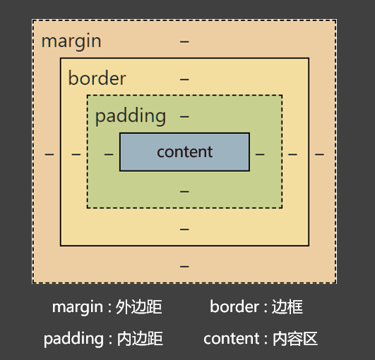

# CSS盒子模型 

## 1 CSS 长度单位

2 `px` ：像素。

2 `em` ：相对元素 `font-size` 的倍数。

3 `rem` ：相对根字体大小，`html` 标签就是根。

4 `%` ：相对父元素计算。

注意： CSS 中设置长度，必须加单位，否则样式无效！

## 2 元素的显示模式

块元素（block）

又称：块级元素

特点：

1 在页面中**独占一行**，不会与任何元素共用一行，是从上到下排列的。

2 默认宽度：撑满**父元素**。

3 默认高度：由**内容**撑开。

4 **可以**通过 `CSS` 设置宽高。

行内元素（inline）  

又称：内联元素

特点:

1 在页面中不独占一行，一行中不能容纳下的行内元素，会在下一行继续从左到右排列。

2 默认宽度：由内容撑开。

3 默认高度：由内容撑开。

4 无法通过 CSS 设置宽高。

行内块元素（inline-block）  

又称：内联块元素

特点：

1 在页面中不独占一行，一行中不能容纳下的行内元素，会在下一行继续从左到右排列。

2 默认宽度：由内容撑开。

3 默认高度：由内容撑开。

4 可以通过 CSS 设置宽高。

**注意**：元素早期只分为：行内元素、块级元素，区分条件也只有一条："是否独占一行"，如果按照这种分类方式，行内块元素应该算作行内元素。  

## 3 总结各元素的显示模式  

块元素（block）  

1 主体结构标签： `<html>` 、 `<body>`

2 排版标签： `<h1>` ~ `<h6>` 、 `
` 、 `
` 、 `<pre>` 、 `
`

3 列表标签： `<ul>` 、 `<ol>` 、 `<li>` 、 `<dl>` 、 `<dt>` 、 `<dd>`

4 表格相关标签： `<table>` 、 `<caption>` 、`<thead>` 、`<tbody>` 、  `<tfoot>` 、 `<tr>` 

5 `<form>` 与 `<option>`

行内元素（inline）  

1 文本标签： ` ` 、 `<em>` 、 `<strong>` 、 `` 、 `` 、 `<del>` 、 `<ins>`

2 `<a>` 与 `<label>`

行内块元素（inline-block）  

1 图片： ``

2 单元格： `<td>` 、 `<th>`

3 表单控件： `<input>` 、 `<textarea>` 、 `<select>` 、 `<button>`

4 框架标签： `<iframe>`

## 4 修改元素的显示模式

通过 `CSS` 中的 `display` 属性可以修改元素的默认显示模式，常用值如下：

| 值           | 描述                       |
| ------------ | -------------------------- |
| none         | 元素会被隐藏。             |
| block        | 元素将作为块级元素显示。   |
| inline       | 元素将作为内联元素显示。   |
| inline-block | 元素将作为行内块元素显示。 |

## 5 盒子模型的组成

CSS 会把所有的 HTML 元素都看成一个盒子，所有的样式也都是基于这个盒子。

1 margin（外边距）： 盒子与外界的距离。

2 border（边框）： 盒子的边框。

3 padding（内边距）： 紧贴内容的补白区域。

4 content（内容）：元素中的文本或后代元素都是它的内容。

图示如下：

盒子的大小 = `content` + 左右 `padding` + 左右 `border` 。  

注意：外边距 `margin` 不会影响盒子的大小，但会影响盒子的位置。  

## 6 盒子内容区（content）  

| CSS 属性名 | 功能                   | 属性值 |
| ---------- | ---------------------- | ------ |
| width      | 设置内容区域宽度       | 长度   |
| max-width  | 设置内容区域的最大宽度 | 长度   |
| min-width  | 设置内容区域的最小宽度 | 长度   |
| height     | 设置内容区域的高度     | 长度   |
| max-height | 设置内容区域的最大高度 | 长度   |
| min-height | 设置内容区域的最小高度 | 长度   |

注意：

`max-width` 、 `min-width` 一般不与 `width` 一起使用。

`max-height` 、 `min-height` 一般不与 `height` 一起使用。

## 7 关于默认宽度

所谓的默认宽度，就是**不设置 width 属性时**，元素所呈现出来的宽度。

总宽度 = 父的 `content` — 自身的左右 `margin` 。

内容区的宽度 = 父的 `content` — 自身的左右 `margin` — 自身的左右 `border` — 自身的左右 `padding` 。

## 8 盒子内边距（padding）

| CSS 属性名     | 功能     | 属性值                    |
| -------------- | -------- | ------------------------- |
| padding-top    | 上内边距 | 长度                      |
| padding-right  | 右内边距 | 长度                      |
| padding-bottom | 下内边距 | 长度                      |
| padding-left   | 左内边距 | 长度                      |
| padding        | 复合属性 | 长度，可以设置 1 ~ 4 个值 |

`padding` 复合属性的使用规则：  

1 `padding: 10px;` 四个方向内边距都是 10px 。

2 `padding: 10px 20px;` 上下 10px ，左右 20px 。（上下、左右）

3 `padding: 10px 20px 30px;` 上 10px ，左右 20px ，下 30px 。（上、左右、下）

4 `padding: 10px 20px 30px 40px;` 上 10px ，右 20px ，下 30px ，左 40px 。（上、右、下、左）

注意点：

1 `padding` 的值不能为负数。

2 **行内元素** 的 左右内边距是没问题的，上下内边距不能完美的设置。

3 **块级元素**、**行内块元素**，四个方向**内边距**都可以完美设置。

## 9 盒子边框（border）  

| CSS 属性名                                                   | 功能                               | 属性值                                                       |
| ------------------------------------------------------------ | ---------------------------------- | ------------------------------------------------------------ |
| border-style                                                 | 边框线风格复合了四个方向的边框风格 | none ： 默认值 solid ： 实线 dashed ： 虚线 dotted ： 点线 double ： 双实线 ...... |
| border-width                                                 | 边框线宽度复合了四个方向的边框宽度 | 长度，默认 3px                                               |
| border-color                                                 | 边框线颜色复合了四个方向的边框颜色 | 颜色，默认黑色                                               |
| border                                                       | 复合属性                           | 值没有顺序和数量要求。                                       |
| border-left  border-left-style  border-left-width  border-left-color  border-right  border-right-style  border-right-width  border-right-color  border-top  border-top-style  border-top-width  border-top-color  border-bottom  border-bottom-style  border-bottom-width  border-bottom-color | 分别设置各个方向的边框             | 同上                                                         |

边框相关属性共 `20` 个。

`border-style` 、 `border-width` 、 `border-color` 其实也是复合属性。

## 10 盒子外边距_margin  

| CSS 属性名    | 功能                                                 | 属性值         |
| ------------- | ---------------------------------------------------- | -------------- |
| margin-left   | 左外边距                                             | CSS 中的长度值 |
| margin-right  | 右外边距                                             | CSS 中的长度值 |
| margin-top    | 上外边距                                             | CSS 中的长度值 |
| margin-bottom | 下外边距                                             | CSS 中的长度值 |
| margin        | 复合属性，可以写 1~4 个值，规律同 padding （顺时针） | CSS 中的长度值 |

### 10.1 margin 注意事项  

1 子元素的 `margin` ，是参考父元素的 `content` 计算的。（因为是父亲的 `content` 中承装着子元素）

2 上 `margin` 、左 `margin` ：影响自己的位置；下 `margin` 、右 `margin` ：影响后面兄弟元素的位置。

3 块级元素、行内块元素，均可以完美地设置四个方向的 `margin` ；但行内元素，左右 `margin` 可以完美设置，上下 `margin` 设置无效。

4 `margin` 的值也可以是 `auto` ，如果给一个**块级元素**设置左右 `margin` 都为 `auto` ，该块级元素会在父元素中水平居中。

5 `margin` 的值可以是负值。

### 10.2 margin 塌陷问题

什么是 `margin` 塌陷？

第一个子元素的上 `margin` 会作用在父元素上，最后一个子元素的下 `margin` 会作用在父元素上。

如何解决 `margin` 塌陷？

方案一： 给父元素设置不为 0 的 padding 。

方案二： 给父元素设置宽度不为 0 的 border 。

方案三：给父元素设置 css 样式 `overflow:hidden`

### 10.3 margin 合并问题

什么是 margin 合并？

上面兄弟元素的**下外边距**和下面兄弟元素的**上外边距**会合并，取一个最大的值，而不是相加。

如何解决 margin 合并？

无需解决，布局的时候上下的兄弟元素，只给一个设置上下外边距就可以了。

## 11 处理内容溢出  

| CSS 属性名 | 功能                         | 属性值                                                       |
| ---------- | ---------------------------- | ------------------------------------------------------------ |
| overflow   | 溢出内容的处理方式           | visible ：显示，默认值 hidden ：隐藏 scroll ：显示滚动条，不论内容是否溢出 auto ：自动显示滚动条，内容不溢出不显示 |
| overflow-x | 水平方向溢出内容的处理方式   | 同 overflow                                                  |
| overflow-y | 垂直方向溢出内容给的处理方式 | 同 overflow                                                  |

注意：

1 `overflow-x` 、 `overflow-y` 不能一个是 `hidden` ，一个是 `visible` ，是实验性属性，不建议使用。

2 `overflow` 常用的值是 `hidden` 和 `auto` ，除了能处理溢出的显示方式，还可以解决很多疑难杂症。

## 12 隐藏元素的方式

### 方式一：visibility 属性

visibility 属性默认值是 show ，如果设置为 hidden ，元素会隐藏。

元素看不见了，还占有原来的位置（元素的大小依然保持）。

### 方式二： display 属性

设置 `display:none` ，就可以让元素隐藏。

彻底地隐藏，不但看不见，也不占用任何位置，没有大小宽高。

## 13 样式的继承

有些样式会继承，元素如果本身设置了某个样式，就使用本身设置的样式；但如果本身没有设置某个样式，会从父元素开始一级一级继承（优先继承离得近的祖先元素）。

### 会继承的 css 属性

字体属性、文本属性（除了vertical-align）、文字颜色 等。  

### 不会继承的 css 属性  

边框、背景、内边距、外边距、宽高、溢出方式 等。  

一个规律：能继承的属性，都是不影响布局的，简单说：都是和盒子模型没关系的。  

## 14 默认样式

元素一般都些默认的样式，例如：

1 `<a>` 元素：下划线、字体颜色、鼠标小手。

2 `<h1>` ~ `<h6>` 元素： 文字加粗、文字大小、上下外边距。

3 `
` 元素：上下外边距

4 `<ul>` 、 `<ol>` 元素：左内边距

5 `<body>` 元素： 8px 外边距（4个方向）

......

优先级：元素的默认样式 > 继承的样式，所以如果要重置元素的默认样式，选择器一定要直接选择器到该元素。  

## 15 布局小技巧

1 行内元素、行内块元素，可以被父元素当做文本处理。

即：可以像处理文本对齐一样，去处理：行内、行内块在父元素中的对齐。例如： `text-align` 、 `line-height` 、 `text-indent` 等。  

2 如何让子元素，在父亲中 **水平居中**：

若子元素为**块元素**，给父元素加上： `margin:0 auto;` 。

若子元素为**行内元素**、**行内块元素**，给父元素加上： `text-align:center` 。

3 如何让子元素，在父亲中 **垂直居中**：

若子元素为**块元素**，给子元素加上： `margin-top` ，值为：`(父元素 content －子元素盒子总高)  /  2`。

若子元素为**行内元素**、**行内块元素**：

让父元素的 `height` = `line-height` ，每个子元素都加上： `verticalalign:middle;` 。

补充：若想绝对垂直居中，父元素 `font-size` 设置为 0 。

## 16 元素之间的空白问题

产生的原因：

行内元素、行内块元素，彼此之间的换行会被浏览器解析为一个空白字符。

解决方案：

1 方案一： 去掉换行和空格（不推荐）。

2 方案二： 给父元素设置 `font-size:0` ，再给需要显示文字的元素，单独设置字体大小（推荐）。

## 17 行内块的幽灵空白问题

产生原因：

行内块元素与文本的基线对齐，而文本的基线与文本最底端之间是有一定距离的。

解决方案：

方案一： 给行行内块设置 `vertical` ，值不为 `baseline` 即可，设置为 `middel` 、 `bottom` 、`top` 均可。

方案二： 若父元素中只有一张图片，设置图片为 `display:block` 。

方案三： 给父元素设置 `font-size: 0` 。如果该行内块内部还有文本，则需单独设置 `fontsize` 。

