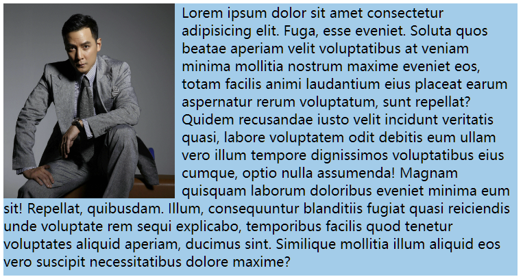
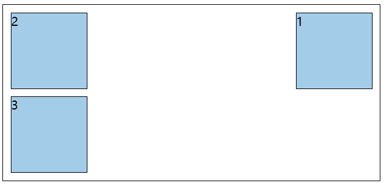
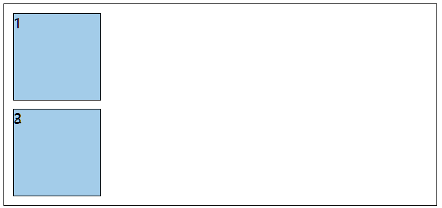
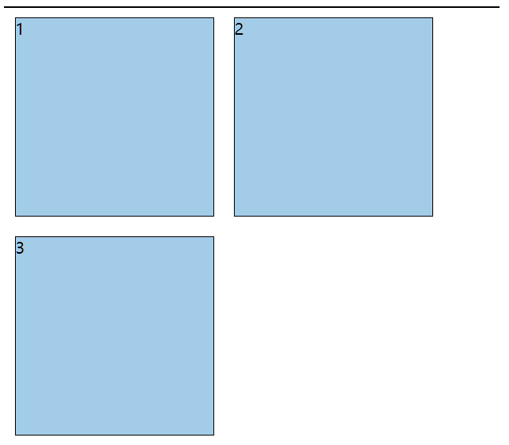
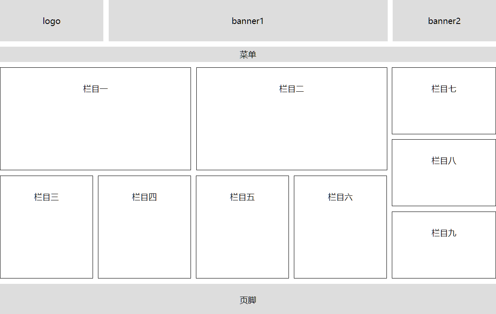

# css 浮动  

## 1 浮动的简介

在最初，浮动是用来实现文字环绕图片效果的，现在浮动是主流的页面布局方式之一。



## 2 元素浮动后的特点  

1 🤢脱离文档流。

2 😊不管浮动前是什么元素，浮动后：默认宽与高都是被内容撑开（尽可能小），而且可以设置宽高。

3 😊不会独占一行，可以与其他元素共用一行。

4😊不会 margin 合并，也不会 margin 塌陷，能够完美的设置四个方向的 margin 和 padding 。

5😊不会像行内块一样被当做文本处理（没有行内块的空白问题）。


## 3 浮动小练习

练习1：盒子1右浮动，效果如下



练习2：盒子1左浮动，效果如下  



练习3：所有盒子都浮动，效果如下  


练习4：所有盒子浮动后，盒子3落下来，效果如下  



练习5：所有盒子浮动后，盒子3卡住了，效果如下  


## 4 解决浮动产生的影响

### 4.1 元素浮动后会有哪些影响

对兄弟元素的影响： 后面的兄弟元素，会占据浮动元素之前的位置，在浮动元素的下面；对前面的兄弟无影响。

对父元素的影响： 不能撑起父元素的高度，导致父元素高度塌陷；但父元素的宽度依然束缚浮动的元素。


### 4.2 解决浮动产生的影响（清除浮动）

解决方案：

1 方案一： 给父元素指定高度。

2 方案二： 给父元素也设置浮动，带来其他影响。

3 方案三： 给父元素设置 `overflow:hidden` 。

4 方案四： 在所有浮动元素的最后面，添加一个块级元素，并给该块级元素设置 `clear:both` 。

5 **方案五**： 给浮动元素的父元素，设置伪元素，通过伪元素清除浮动，原理与方案四相同。===> 推荐使用

```css
.parent::after {
    content: "";
    display: block;
    clear:both;
}
```

布局中的一个原则：设置浮动的时候，兄弟元素要么全都浮动，要么全都不浮动。  


## 5 浮动布局小练习

整体效果如下：



具体标注如下：  


## 6 浮动相关属性  

| CSS 属性 | 功能                                   | 属性值                                                       |
| -------- | -------------------------------------- | ------------------------------------------------------------ |
| float    | 设置浮动                               | left : 设置左浮动<br />right : 设置右浮动<br />none ：不浮动，默认值 |
| clear    | 清除浮动清除前面兄弟元素浮动元素的响应 | left ：清除前面左浮动的影响<br />right ：清除前面右浮动的影响<br />both ：清除前面左右浮动的影响 |

